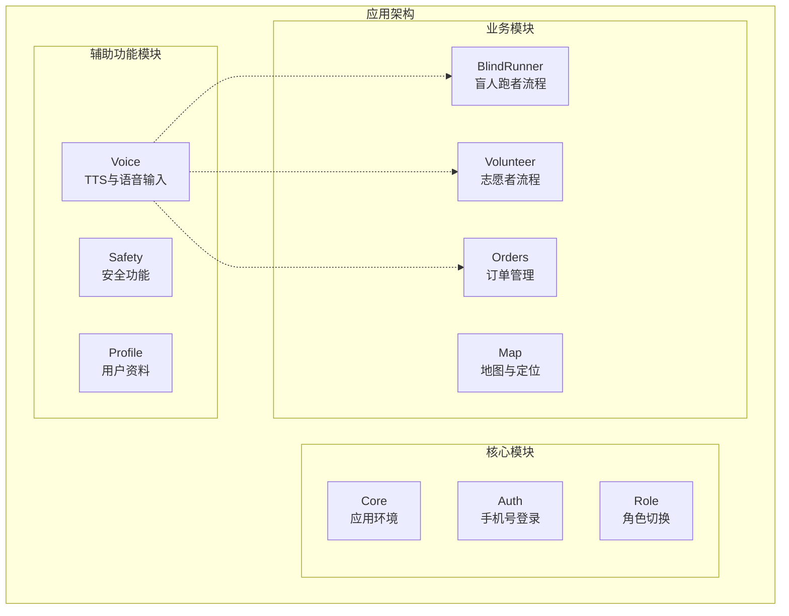
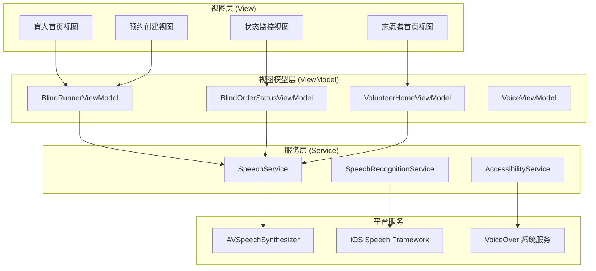
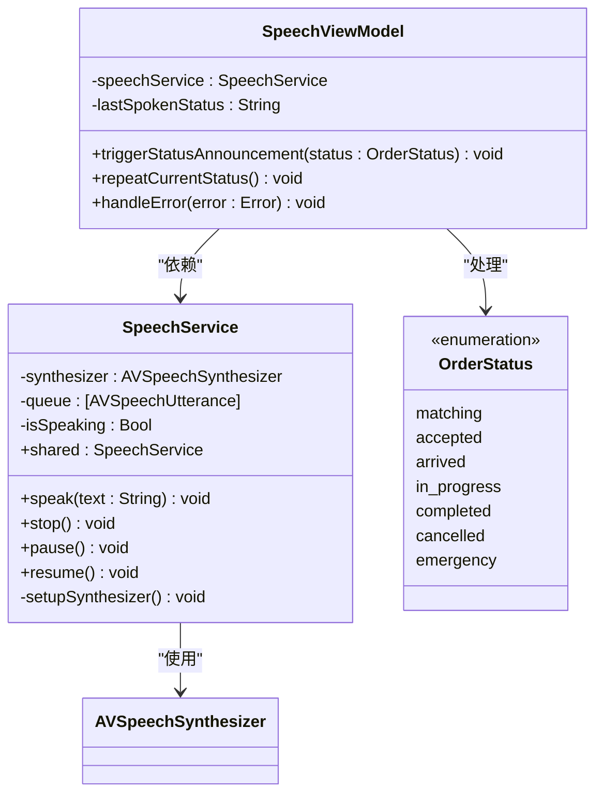
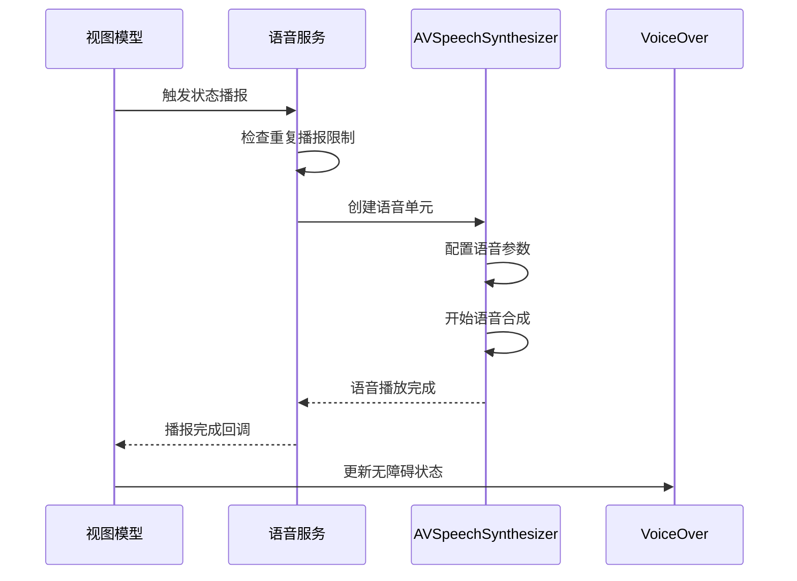
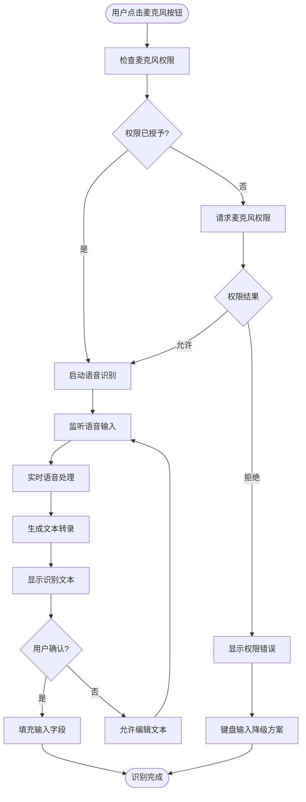
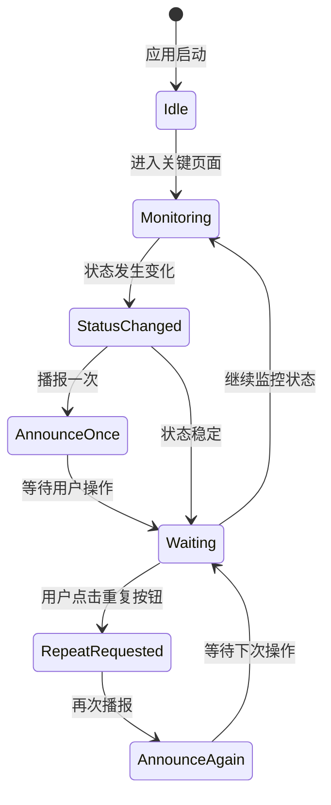
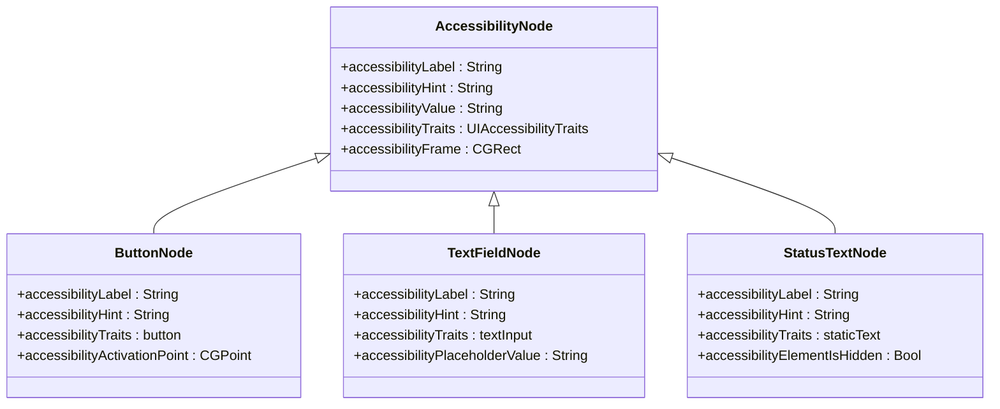
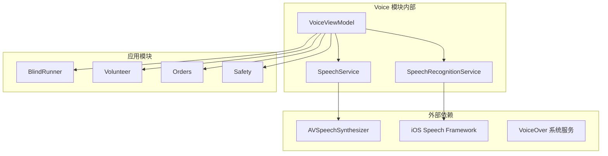

# Voice 语音模块

<cite>
**本文档引用的文件**
- [blindRunApp.swift](file://blindRun/blindRunApp.swift)
- [ContentView.swift](file://blindRun/ContentView.swift)
- [09-无障碍与语音指南.md](file://docs/09-accessibility-and-voice-guidelines.md)
- [08-iOS 架构.md](file://docs/08-ios-architecture.md)
- [spec.md](file://openspec/changes/add-aidrun-ios-spring-mvp/specs/accessibility-voice-ui/spec.md)
- [03-用户故事.md](file://docs/03-user-stories.md)
</cite>

## 目录
1. [简介](#简介)
2. [项目结构](#项目结构)
3. [核心组件](#核心组件)
4. [架构概览](#架构概览)
5. [详细组件分析](#详细组件分析)
6. [依赖关系分析](#依赖关系分析)
7. [性能考虑](#性能考虑)
8. [故障排除指南](#故障排除指南)
9. [结论](#结论)
10. [附录](#附录)

## 简介

Voice 语音模块是 AidRun MVP 项目中专为盲人用户设计的无障碍功能实现。该模块基于 iOS 原生技术栈，实现了完整的语音合成（TTS）和语音识别功能，确保盲人用户能够通过 VoiceOver 屏幕阅读器、语音播报和语音输入来完全使用应用程序。

本模块的核心目标是为盲人跑者提供语音优先的用户体验，包括关键状态播报、重复当前状态功能、语音输入支持以及全面的无障碍设计集成。

## 项目结构

根据项目架构文档，Voice 模块属于独立的功能模块组，与 Core、Auth、Role、BlindRunner、Volunteer 等模块并列：

**图表来源**
- [08-iOS 架构.md:18-31](file://docs/08-ios-architecture.md#L18-L31)

**章节来源**
- [08-iOS 架构.md:18-31](file://docs/08-ios-architecture.md#L18-L31)

## 核心组件

Voice 模块的核心组件包括：

### 1. 语音合成服务 (SpeechService)
- 基于 iOS 原生 AVSpeechSynthesizer 实现
- 单例模式设计，确保全局统一的语音输出
- 支持中文语音合成和语速控制

### 2. 语音识别服务 (Speech Recognition)
- 使用 iOS Speech 框架实现语音转文本
- 支持实时语音识别和结果展示
- 提供权限管理和错误处理机制

### 3. 无障碍集成层
- VoiceOver 支持，包括标签和提示
- 辅助功能集成，确保屏幕阅读器兼容性
- 重复当前状态按钮实现

**章节来源**
- [09-无障碍与语音指南.md:13-36](file://docs/09-accessibility-and-voice-guidelines.md#L13-L36)
- [08-iOS 架构.md:15-16](file://docs/08-ios-architecture.md#L15-L16)

## 架构概览

Voice 模块采用 MVVM 架构模式，与整体应用架构保持一致：

**图表来源**
- [08-iOS 架构.md:33-40](file://docs/08-ios-architecture.md#L33-L40)
- [09-无障碍与语音指南.md:15-16](file://docs/09-accessibility-and-voice-guidelines.md#L15-L16)

## 详细组件分析

### 语音合成服务 (TTS)

#### 组件架构

**图表来源**
- [09-无障碍与语音指南.md:15-35](file://docs/09-accessibility-and-voice-guidelines.md#L15-L35)

#### 语音参数配置

语音合成服务支持以下配置参数：

| 参数 | 默认值 | 描述 | 适用场景 |
|------|--------|------|----------|
| 语速 | 0.5 | 0.0-1.0 范围内的语音速度 | 状态播报和导航说明 |
| 音调 | 1.0 | 0.5-2.0 范围内的音调调节 | 重要信息强调 |
| 音量 | 1.0 | 0.0-1.0 范围内的音量控制 | 无障碍环境优化 |
| 语言 | zh-CN | 语音合成语言设置 | 中文普通话播报 |

#### 状态播报实现

**图表来源**
- [09-无障碍与语音指南.md:32-35](file://docs/09-accessibility-and-voice-guidelines.md#L32-L35)

**章节来源**
- [09-无障碍与语音指南.md:17-28](file://docs/09-accessibility-and-voice-guidelines.md#L17-L28)
- [09-无障碍与语音指南.md:112-120](file://docs/09-accessibility-and-voice-guidelines.md#L112-L120)

### 语音识别服务 (Speech Input)

#### 语音识别架构

**图表来源**
- [09-无障碍与语音指南.md:71-86](file://docs/09-accessibility-and-voice-guidelines.md#L71-L86)

#### 语音识别配置

语音识别服务支持以下配置：

- **识别语言**: zh-CN (简体中文)
- **识别模式**: 语音转文本
- **实时显示**: 支持实时转录显示
- **错误处理**: 完善的失败场景处理
- **权限管理**: 按需请求麦克风权限

**章节来源**
- [09-无障碍与语音指南.md:73-78](file://docs/09-accessibility-and-voice-guidelines.md#L73-L78)
- [09-无障碍与语音指南.md:85-86](file://docs/09-accessibility-and-voice-guidelines.md#L85-L86)

### 重复功能实现

#### 重复当前状态机制

**图表来源**
- [09-无障碍与语音指南.md:29-35](file://docs/09-accessibility-and-voice-guidelines.md#L29-L35)

#### 重复功能的技术实现

重复功能通过以下机制实现：

1. **状态缓存**: 缓存最近一次播报的状态信息
2. **按钮集成**: 在每个关键页面提供重复按钮
3. **去重机制**: 避免重复播报相同状态
4. **即时响应**: 用户点击后立即响应

**章节来源**
- [09-无障碍与语音指南.md:27-33](file://docs/09-accessibility-and-voice-guidelines.md#L27-L33)

### 无障碍设计实现

#### VoiceOver 支持

VoiceOver 无障碍功能通过以下方式实现：

**图表来源**
- [09-无障碍与语音指南.md:37-61](file://docs/09-accessibility-and-voice-guidelines.md#L37-L61)

#### 辅助功能集成

辅助功能集成包括：

- **标签系统**: 为所有交互元素提供清晰的标签
- **提示系统**: 提供操作指导和上下文信息
- **遍历顺序**: 确保 VoiceOver 导航顺序符合视觉布局
- **状态同步**: 与语音播报保持状态同步

**章节来源**
- [09-无障碍与语音指南.md:39-43](file://docs/09-accessibility-and-voice-guidelines.md#L39-L43)

## 依赖关系分析

Voice 模块与其他模块的依赖关系如下：

**图表来源**
- [08-iOS 架构.md:29](file://docs/08-ios-architecture.md#L29)

### 模块间耦合度分析

| 依赖方向 | 耦合程度 | 说明 | 影响 |
|----------|----------|------|------|
| Voice → AVSpeechSynthesizer | 低耦合 | 通过系统服务接口 | 独立性强，易于测试 |
| Voice → SpeechFramework | 低耦合 | 通过系统框架接口 | 平台相关性低 |
| Voice → ViewModel | 中等耦合 | 业务逻辑依赖 | 需要遵循 MVVM 模式 |
| Voice → 系统服务 | 低耦合 | VoiceOver 集成 | 与系统服务解耦 |

**章节来源**
- [08-iOS 架构.md:33-40](file://docs/08-ios-architecture.md#L33-L40)

## 性能考虑

### 语音合成性能优化

1. **队列管理**: 实现语音队列，避免同时播放多个语音
2. **内存管理**: 及时释放语音资源，防止内存泄漏
3. **后台处理**: 在后台线程处理语音合成，避免阻塞主线程
4. **缓存策略**: 缓存常用语音片段，减少重复合成

### 语音识别性能优化

1. **实时处理**: 优化语音识别的实时性，减少延迟
2. **错误恢复**: 实现快速错误恢复机制
3. **资源管理**: 合理管理麦克风资源，避免冲突
4. **降级策略**: 提供键盘输入等降级方案

## 故障排除指南

### 常见问题及解决方案

#### 语音播报问题

| 问题类型 | 症状 | 可能原因 | 解决方案 |
|----------|------|----------|----------|
| 无法播放语音 | 无声 | 系统设置禁用语音 | 检查系统语音设置 |
| 语音质量差 | 含糊不清 | 语言包缺失 | 下载中文语音包 |
| 播放卡顿 | 断断续续 | 网络问题 | 检查网络连接 |
| 重复播报 | 频繁重复 | 状态监控问题 | 检查状态缓存机制 |

#### 语音识别问题

| 问题类型 | 症状 | 可能原因 | 解决方案 |
|----------|------|----------|----------|
| 无法识别 | 无反应 | 权限问题 | 请求麦克风权限 |
| 识别错误 | 文本错误 | 环境噪音 | 降低噪音或使用降噪 |
| 识别延迟 | 响应慢 | 网络延迟 | 检查网络状况 |
| 识别失败 | 报错 | 系统限制 | 提供键盘输入降级 |

**章节来源**
- [09-无障碍与语音指南.md:85-86](file://docs/09-accessibility-and-voice-guidelines.md#L85-L86)

## 结论

Voice 语音模块为 AidRun MVP 项目提供了完整的无障碍功能实现。通过合理的架构设计和技术选型，该模块成功实现了：

1. **完整的语音合成功能**: 支持关键状态播报和用户交互反馈
2. **实用的语音识别功能**: 提供语音输入支持和降级方案
3. **全面的无障碍设计**: 确保 VoiceOver 和其他辅助功能的兼容性
4. **良好的用户体验**: 通过重复功能和状态同步提升易用性

该模块的设计充分考虑了盲人用户的特殊需求，在保证功能完整性的同时，注重性能优化和故障处理，为后续的功能扩展奠定了坚实基础。

## 附录

### 开发指导

#### 新功能扩展建议

1. **多语言支持**: 考虑添加其他语言的语音合成支持
2. **个性化设置**: 允许用户自定义语音参数
3. **情境感知**: 根据不同场景调整语音策略
4. **学习模式**: 实现语音学习和适应机制

#### 最佳实践

1. **遵循无障碍标准**: 严格按照 WCAG 指南实现
2. **性能优先**: 优化语音处理性能，减少资源消耗
3. **错误处理**: 完善错误处理和降级机制
4. **测试覆盖**: 全面测试各种使用场景和边界条件