# Volunteer 志愿者模块

<cite>
**本文档引用的文件**
- [04-用户流程与状态机.md](file://docs/04-user-flows-and-state-machine.md)
- [07-API契约.openAPI.yaml](file://docs/07-api-contract.openapi.yaml)
- [08-iOS架构.md](file://docs/08-ios-architecture.md)
- [01-产品需求.md](file://docs/01-product-requirements.md)
- [03-用户故事.md](file://docs/03-user-stories.md)
- [amap-location规格.md](file://openspec/changes/add-aidrun-ios-spring-mvp/specs/amap-location/spec.md)
- [volunteer-order-flow规格.md](file://openspec/changes/add-aidrun-ios-spring-mvp/specs/volunteer-order-flow/spec.md)
- [volunteer-points规格.md](file://openspec/changes/add-aidrun-ios-spring-mvp/specs/volunteer-points/spec.md)
- [order-status-lifecycle规格.md](file://openspec/changes/add-aidrun-ios-spring-mvp/specs/order-status-lifecycle/spec.md)
- [tasks.md](file://openspec/changes/add-aidrun-ios-spring-mvp/tasks.md)
- [config.yaml](file://openspec/config.yaml)
- [ContentView.swift](file://blindRun/ContentView.swift)
</cite>

## 目录
1. [简介](#简介)
2. [项目结构](#项目结构)
3. [核心组件](#核心组件)
4. [架构概览](#架构概览)
5. [详细组件分析](#详细组件分析)
6. [依赖关系分析](#依赖关系分析)
7. [性能考虑](#性能考虑)
8. [故障排除指南](#故障排除指南)
9. [结论](#结论)
10. [附录](#附录)

## 简介

Volunteer 志愿者模块是 AidRun 助盲跑应用的核心功能模块之一，专为志愿者设计，提供完整的志愿服务工作流程管理。该模块实现了从志愿者认证到服务完成的全生命周期管理，包括可用订单浏览、智能接单、服务执行、完成记录等功能。

### 核心功能特性

- **认证管理**：Mock 实名认证系统，支持志愿者身份验证和审核状态管理
- **可用订单浏览**：基于地理位置的智能订单排序，实时显示附近可接订单
- **接单服务**：安全的乐观锁接单机制，防止并发冲突
- **服务执行**：完整的服务流程管理，包括到达确认、服务开始、完成标记
- **积分系统**：基于服务完成的积分奖励机制，支持积分查询和商城占位
- **交互流程**：与盲人跑者的无缝协作，支持紧急求助和状态同步

## 项目结构

基于提供的文档分析，Volunteer 模块采用模块化架构设计，遵循 iOS MVVM 架构模式：

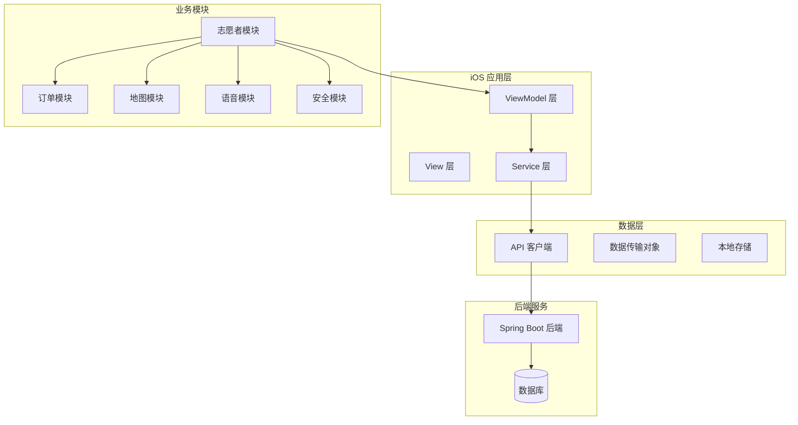

**图表来源**
- [08-iOS架构.md:18-32](file://docs/08-ios-architecture.md#L18-L32)
- [08-iOS架构.md:33-41](file://docs/08-iOS-architecture.md#L33-L41)

### 模块组织结构

志愿者模块按照功能职责进行清晰的模块划分：

- **认证模块**：处理志愿者身份验证和 Mock 认证流程
- **可用订单模块**：管理附近订单的获取、排序和展示
- **订单详情模块**：处理订单接单、状态变更和交互操作
- **服务记录模块**：维护服务历史和完成记录
- **积分管理模块**：实现积分系统和商城占位功能

**章节来源**
- [08-iOS架构.md:18-32](file://docs/08-ios-architecture.md#L18-L32)

## 核心组件

### 订单状态管理系统

志愿者模块的核心是完整的订单状态生命周期管理，确保服务流程的规范性和安全性：

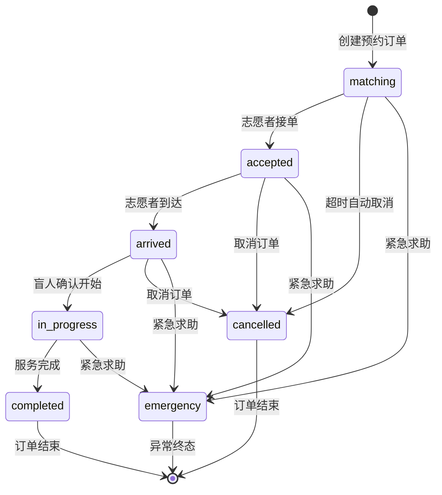

**图表来源**
- [04-用户流程与状态机.md:72-96](file://docs/04-user-flows-and-state-machine.md#L72-L96)

### 认证管理组件

志愿者认证采用 Mock 实名认证机制，简化了开发和演示流程：

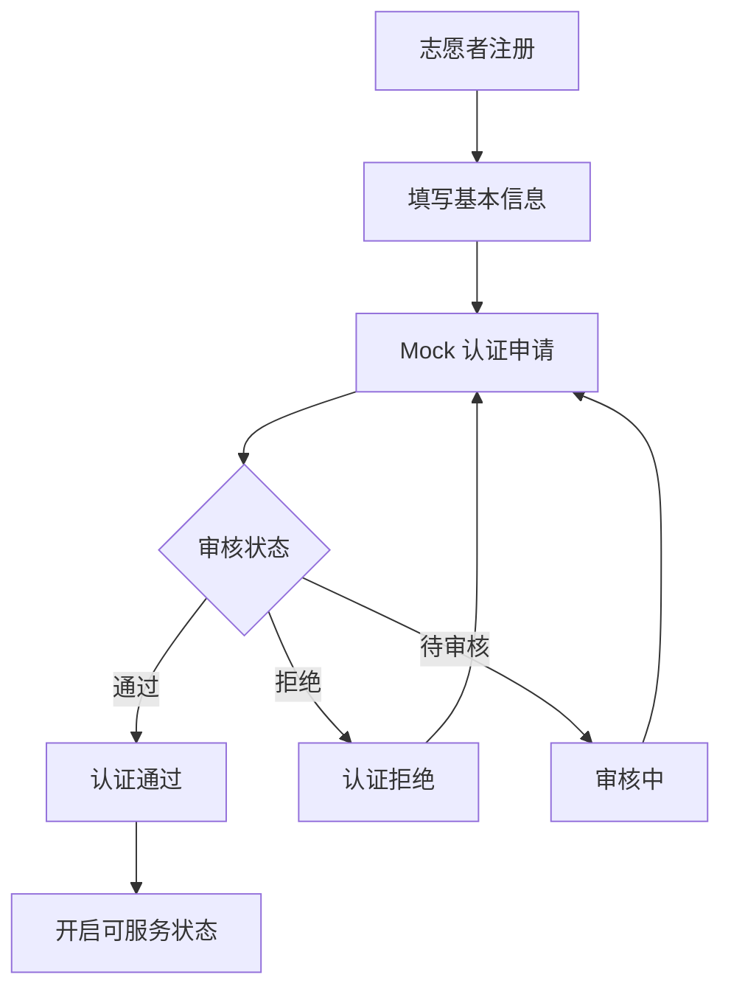

**图表来源**
- [volunteer-order-flow规格.md:15-21](file://openspec/changes/add-aidrun-ios-spring-mvp/specs/volunteer-order-flow/spec.md#L15-L21)

### 订单排序算法

志愿者首页的订单排序采用基于地理位置的距离计算算法：

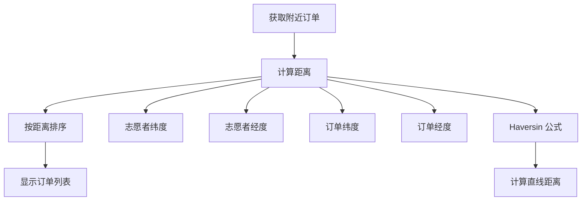

**图表来源**
- [amap-location规格.md:23-29](file://openspec/changes/add-aidrun-ios-spring-mvp/specs/amap-location/spec.md#L23-L29)

**章节来源**
- [04-用户流程与状态机.md:72-96](file://docs/04-user-flows-and-state-machine.md#L72-L96)
- [volunteer-order-flow规格.md:3-5](file://openspec/changes/add-aidrun-ios-spring-mvp/specs/volunteer-order-flow/spec.md#L3-L5)

## 架构概览

### 整体系统架构

志愿者模块采用分层架构设计，确保各层职责清晰、耦合度低：

```mermaid
graph TB
subgraph "表现层"
VolunteerHome[志愿者首页]
OrderList[订单列表]
OrderDetail[订单详情]
ServiceRecords[服务记录]
PointsPage[积分页面]
end
subgraph "业务逻辑层"
VolunteerVM[志愿者 ViewModel]
OrderVM[订单 ViewModel]
ServiceVM[服务 ViewModel]
PointsVM[积分 ViewModel]
end
subgraph "数据访问层"
APIClient[API 客户端]
LocationService[定位服务]
MapService[地图服务]
end
subgraph "外部服务"
BackendAPI[后端 API]
AMap[高德地图]
AuthService[认证服务]
end
VolunteerHome --> VolunteerVM
OrderList --> OrderVM
OrderDetail --> OrderVM
ServiceRecords --> ServiceVM
PointsPage --> PointsVM
VolunteerVM --> APIClient
OrderVM --> APIClient
ServiceVM --> APIClient
PointsVM --> APIClient
APIClient --> BackendAPI
LocationService --> AMap
MapService --> AMap
```

**图表来源**
- [08-iOS架构.md:33-41](file://docs/08-ios-architecture.md#L33-L41)

### 数据流架构

志愿者模块的数据流遵循 MVVM 模式，确保数据的单向流动和状态管理：

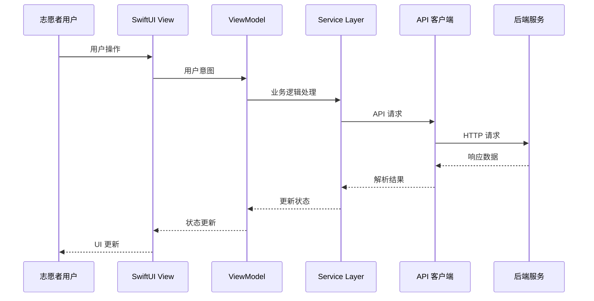

**图表来源**
- [08-iOS架构.md:33-41](file://docs/08-ios-architecture.md#L33-L41)

**章节来源**
- [08-iOS架构.md:33-41](file://docs/08-ios-architecture.md#L33-L41)

## 详细组件分析

### 认证管理组件

#### Mock 认证流程

志愿者认证采用 Mock 实现，简化了开发和测试流程：

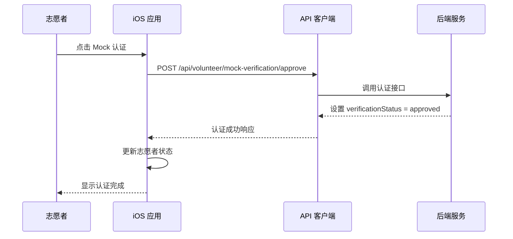

**图表来源**
- [volunteer-order-flow规格.md:15-21](file://openspec/changes/add-aidrun-ios-spring-mvp/specs/volunteer-order-flow/spec.md#L15-L21)

#### 可服务状态管理

志愿者可服务状态控制着订单接收能力：

| 状态 | 描述 | 影响范围 |
|------|------|----------|
| 开启 | 可接收新订单 | 所有 matching 订单 |
| 关闭 | 不可接收新订单 | 仅查看现有订单 |
| 审核中 | 等待审核结果 | 临时状态 |

**章节来源**
- [volunteer-order-flow规格.md:451-470](file://openspec/changes/add-aidrun-ios-spring-mvp/specs/volunteer-order-flow/spec.md#L451-L470)

### 订单浏览与接单组件

#### 订单获取与排序

志愿者首页的订单获取采用实时轮询机制：

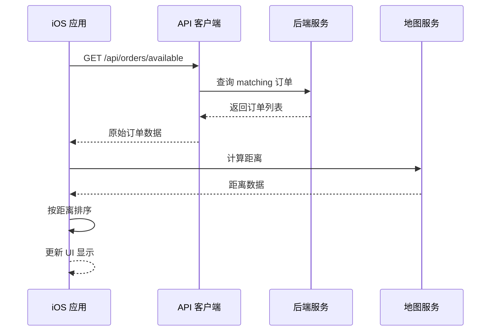

**图表来源**
- [04-用户流程与状态机.md:180-228](file://docs/04-user-flows-and-state-machine.md#L180-L228)

#### 接单流程控制

接单操作采用乐观锁机制确保并发安全：

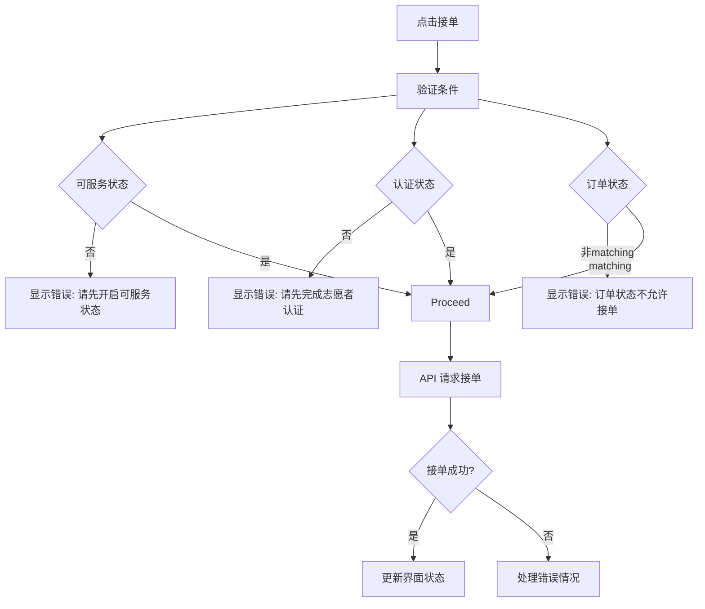

**图表来源**
- [04-用户流程与状态机.md:256-287](file://docs/04-user-flows-and-state-machine.md#L256-L287)

**章节来源**
- [04-用户流程与状态机.md:180-228](file://docs/04-user-flows-and-state-machine.md#L180-L228)
- [04-用户流程与状态机.md:256-287](file://docs/04-user-flows-and-state-machine.md#L256-L287)

### 服务执行组件

#### 服务流程管理

志愿者服务执行包含多个关键步骤的状态管理：

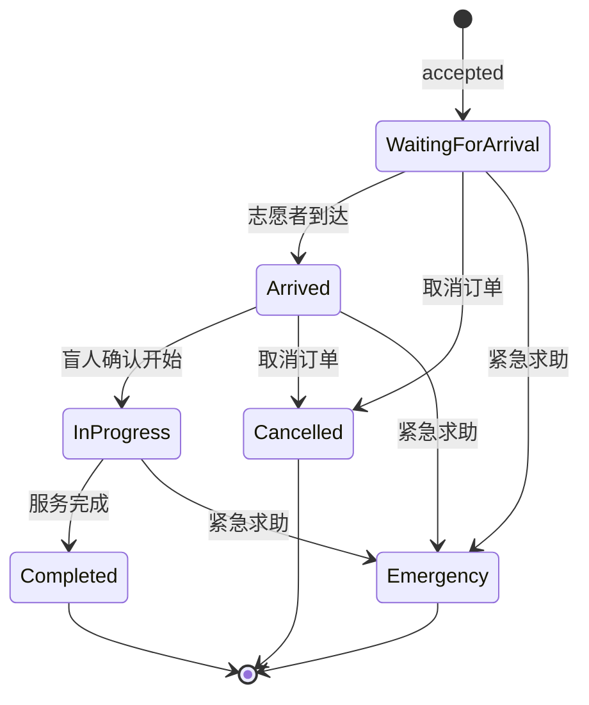

**图表来源**
- [04-用户流程与状态机.md:72-96](file://docs/04-user-flows-and-state-machine.md#L72-L96)

#### 到达确认与服务开始

服务过程中的关键节点确认机制：

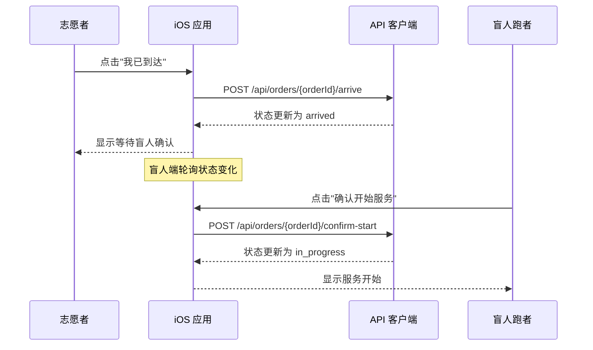

**图表来源**
- [04-用户流程与状态机.md:180-228](file://docs/04-user-flows-and-state-machine.md#L180-L228)

**章节来源**
- [04-用户流程与状态机.md:72-96](file://docs/04-user-flows-and-state-machine.md#L72-L96)
- [04-用户流程与状态机.md:180-228](file://docs/04-user-flows-and-state-machine.md#L180-L228)

### 积分系统组件

#### 积分获取规则

志愿者积分系统基于服务完成提供奖励：

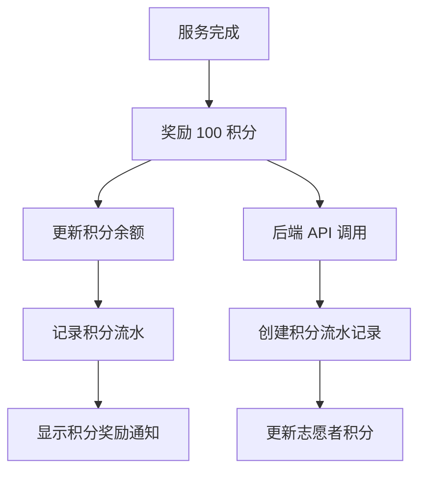

**图表来源**
- [volunteer-points规格.md:3-9](file://openspec/changes/add-aidrun-ios-spring-mvp/specs/volunteer-points/spec.md#L3-L9)

#### 积分记录管理

积分系统采用流水账管理模式：

| 字段 | 类型 | 描述 | 示例值 |
|------|------|------|--------|
| id | UUID | 积分记录 ID | 123e4567-e89b-12d3-a456-426614174000 |
| pointsDelta | Integer | 积分变动数量 | +100 |
| reason | String | 积分获取原因 | service_completed |
| createdAt | DateTime | 记录创建时间 | 2024-01-01T12:00:00Z |

**章节来源**
- [volunteer-points规格.md:1089-1098](file://openspec/changes/add-aidrun-ios-spring-mvp/specs/volunteer-points/spec.md#L1089-L1098)

### 交互流程组件

#### 志愿者与盲人跑者交互

志愿者与盲人跑者的交互流程确保服务的顺利进行：

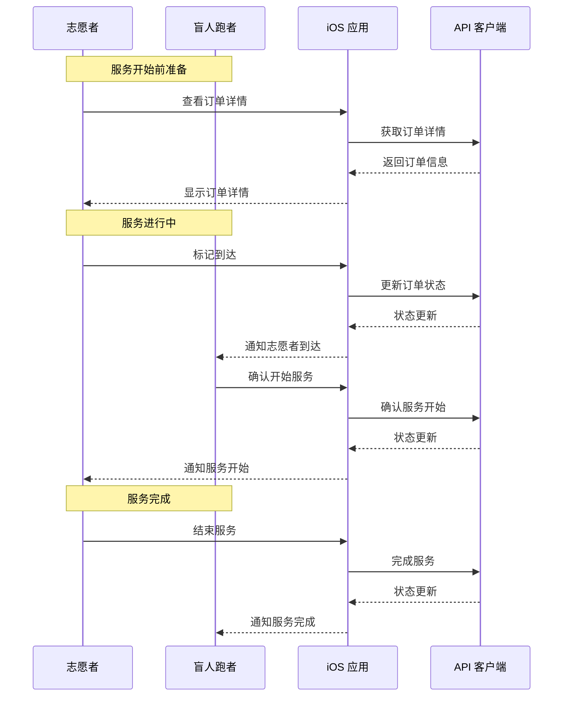

**图表来源**
- [04-用户流程与状态机.md:180-228](file://docs/04-user-flows-and-state-machine.md#L180-L228)

#### 紧急求助流程

紧急求助机制确保在异常情况下能够及时处理：

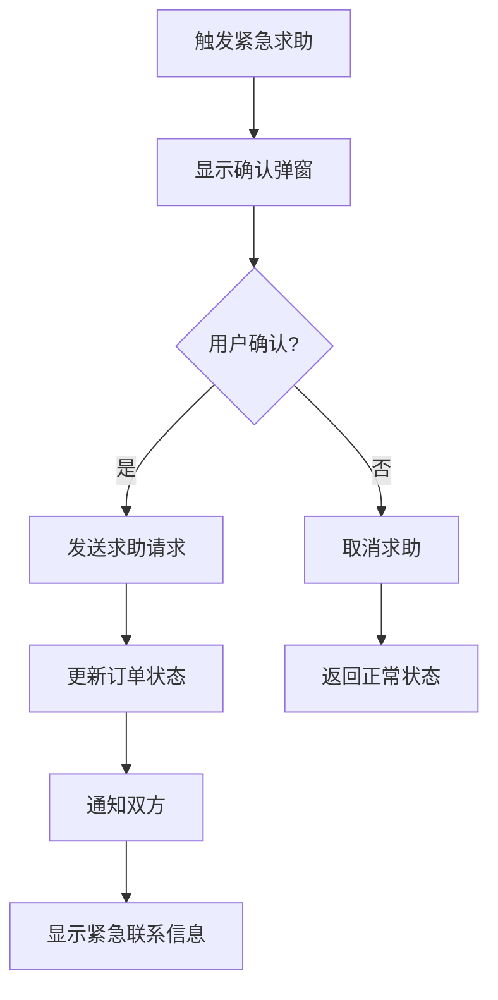

**图表来源**
- [04-用户流程与状态机.md:230-257](file://docs/04-user-flows-and-state-machine.md#L230-L257)

**章节来源**
- [04-用户流程与状态机.md:180-228](file://docs/04-user-flows-and-state-machine.md#L180-L228)
- [04-用户流程与状态机.md:230-257](file://docs/04-user-flows-and-state-machine.md#L230-L257)

## 依赖关系分析

### 技术依赖关系

志愿者模块的技术依赖关系体现了清晰的分层架构：

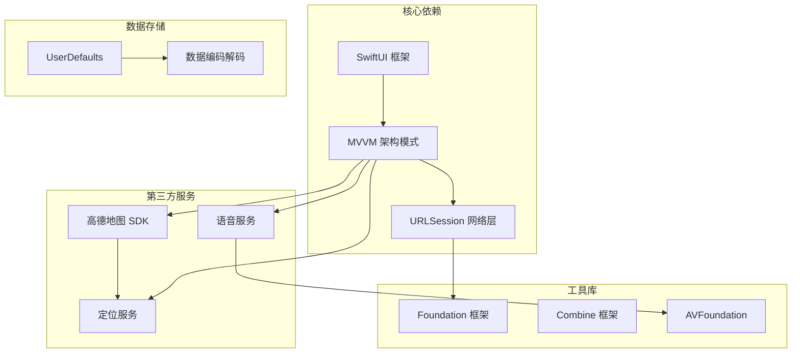

**图表来源**
- [01-产品需求.md:116-129](file://docs/01-product-requirements.md#L116-L129)

### 模块间依赖

志愿者模块与其他模块的依赖关系：

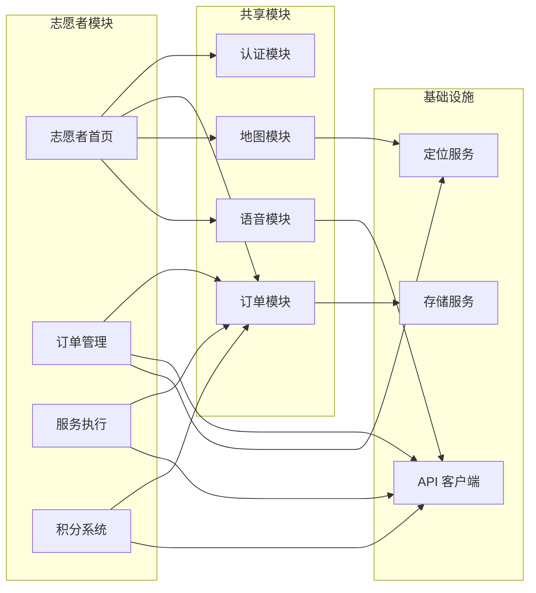

**图表来源**
- [08-iOS架构.md:18-32](file://docs/08-ios-architecture.md#L18-L32)

**章节来源**
- [08-iOS架构.md:18-32](file://docs/08-ios-architecture.md#L18-L32)

## 性能考虑

### 轮询机制优化

志愿者模块采用高效的轮询机制来监控订单状态变化：

- **轮询间隔**：5 秒一次，平衡实时性和性能消耗
- **触发条件**：仅在相关页面且订单处于活跃状态时进行
- **停止条件**：订单进入终态、页面离开、用户登出时停止

### 地理位置计算优化

距离计算采用高效的算法减少 CPU 消耗：

- **算法选择**：使用 Haversin 公式计算球面距离
- **缓存策略**：对已计算的距离进行缓存避免重复计算
- **精度控制**：根据实际需求调整计算精度

### 内存管理

- **弱引用**：避免循环引用导致的内存泄漏
- **及时释放**：页面离开时及时释放相关资源
- **数据缓存**：合理使用缓存减少网络请求频率

## 故障排除指南

### 常见问题诊断

#### 认证相关问题

| 问题描述 | 可能原因 | 解决方案 |
|----------|----------|----------|
| Mock 认证失败 | 网络连接问题 | 检查网络状态，重试认证 |
| 认证状态异常 | 后端服务异常 | 联系技术支持，检查服务状态 |
| 审核状态卡住 | 审核流程延迟 | 稍后重试，检查审核进度 |

#### 订单相关问题

| 问题描述 | 可能原因 | 解决方案 |
|----------|----------|----------|
| 无法获取订单列表 | 定位权限被拒绝 | 在设置中启用定位权限 |
| 订单无法接单 | 志愿者状态不符合要求 | 检查可服务状态和认证状态 |
| 接单失败 | 并发竞争 | 稍后重试，检查订单状态 |

#### 服务执行问题

| 问题描述 | 可能原因 | 解决方案 |
|----------|----------|----------|
| 状态更新延迟 | 网络延迟 | 等待轮询更新，手动刷新 |
| 到达确认失败 | GPS 信号弱 | 移动到开阔地带，重新尝试 |
| 服务完成异常 | 网络中断 | 恢复网络后重试完成操作 |

### 调试建议

1. **日志记录**：启用详细的日志记录便于问题追踪
2. **状态检查**：定期检查志愿者和订单状态的一致性
3. **网络监控**：监控 API 调用的响应时间和成功率
4. **性能监控**：关注应用的内存使用和 CPU 占用情况

**章节来源**
- [04-用户流程与状态机.md:275-299](file://docs/04-user-flows-and-state-machine.md#L275-L299)

## 结论

Volunteer 志愿者模块是一个功能完整、架构清晰的移动应用模块。通过合理的模块划分、清晰的业务流程设计和完善的错误处理机制，该模块为志愿者提供了高效的服务管理工具。

### 主要优势

- **完整的业务流程**：覆盖从认证到服务完成的全生命周期
- **用户体验友好**：简洁直观的操作界面和语音辅助功能
- **技术架构先进**：采用 MVVM 模式和现代 iOS 开发技术
- **扩展性强**：模块化设计便于功能扩展和维护

### 改进建议

1. **性能优化**：进一步优化地理距离计算算法
2. **错误处理**：增强异常情况下的用户引导
3. **数据同步**：考虑引入更实时的推送机制
4. **安全加固**：加强数据传输和存储的安全性

## 附录

### API 接口参考

志愿者模块主要使用的 API 接口：

| 接口 | 方法 | 描述 | 状态要求 |
|------|------|------|----------|
| `/api/volunteer/mock-verification/approve` | POST | Mock 认证通过 | 无 |
| `/api/volunteer/availability` | PATCH | 更新可服务状态 | 无 |
| `/api/orders/available` | GET | 获取可接订单 | 无 |
| `/api/orders/{orderId}/accept` | POST | 志愿者接单 | matching |
| `/api/orders/{orderId}/arrive` | POST | 志愿者到达 | accepted |
| `/api/volunteer/service-records` | GET | 获取服务记录 | 无 |
| `/api/volunteer/points` | GET | 获取积分信息 | 无 |

### 配置说明

志愿者模块的关键配置项：

- **环境配置**：支持 mock、localBackend、production 三种环境
- **定位权限**：必需的定位权限用于订单排序和导航
- **地图配置**：高德地图密钥配置和权限管理
- **语音配置**：TTS 语音播报的配置和控制

**章节来源**
- [07-API契约.openAPI.yaml:118-148](file://docs/07-api-contract.openapi.yaml#L118-L148)
- [07-API契约.openAPI.yaml:412-451](file://docs/07-api-contract.openapi.yaml#L412-L451)