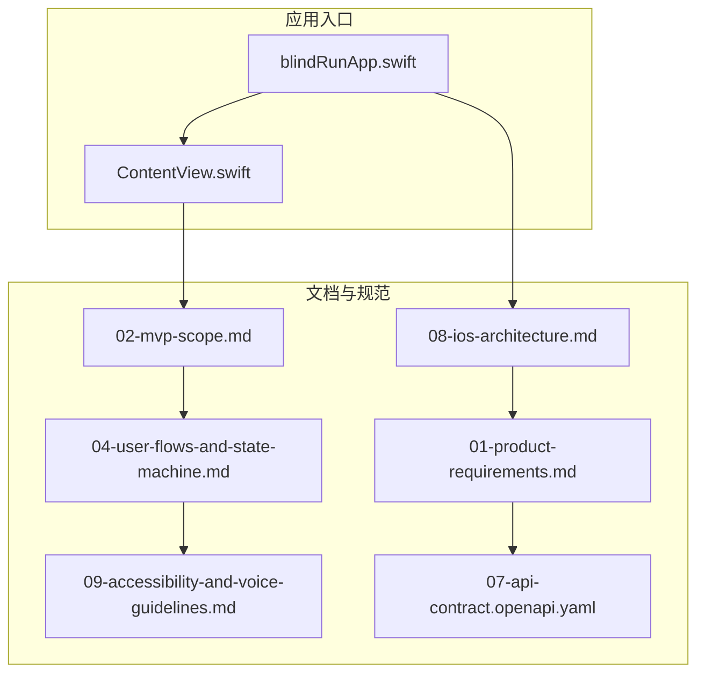
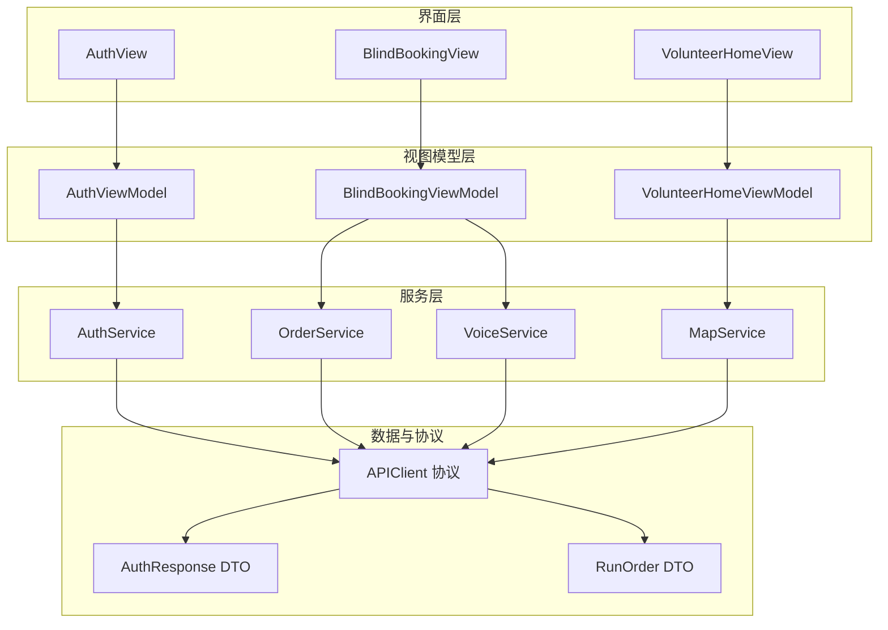
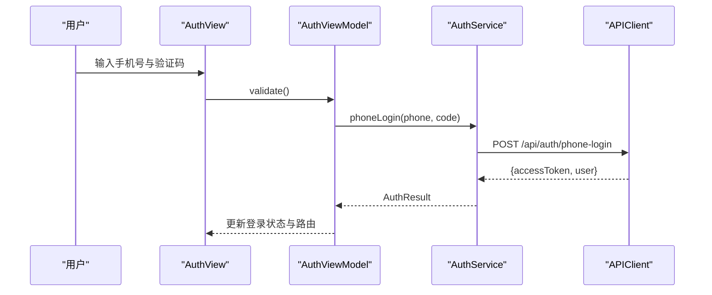
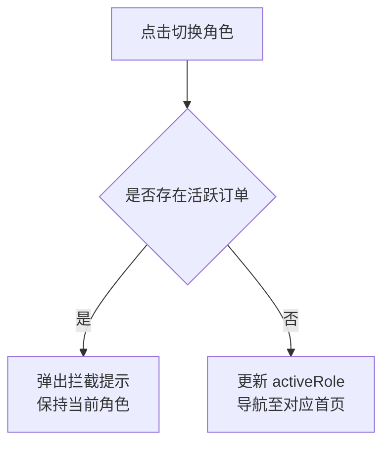
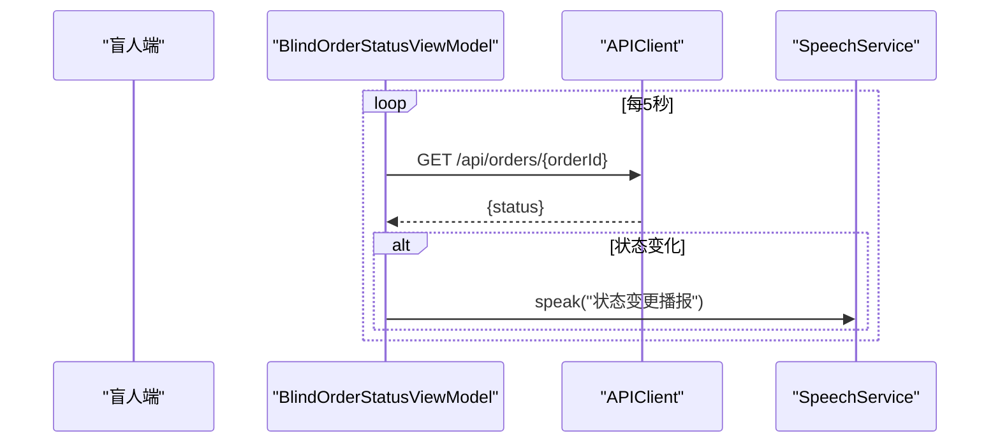
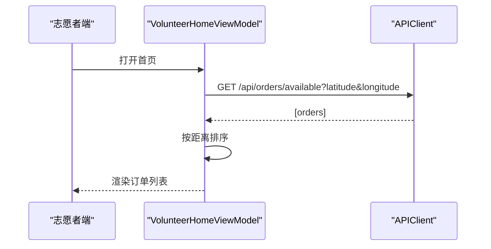
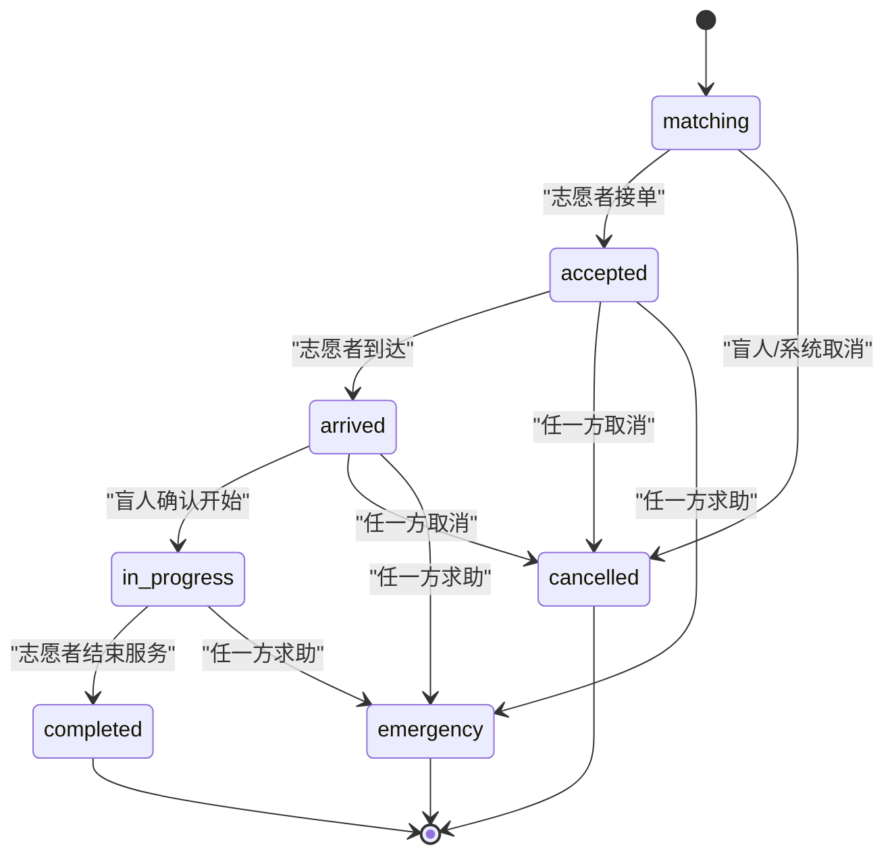
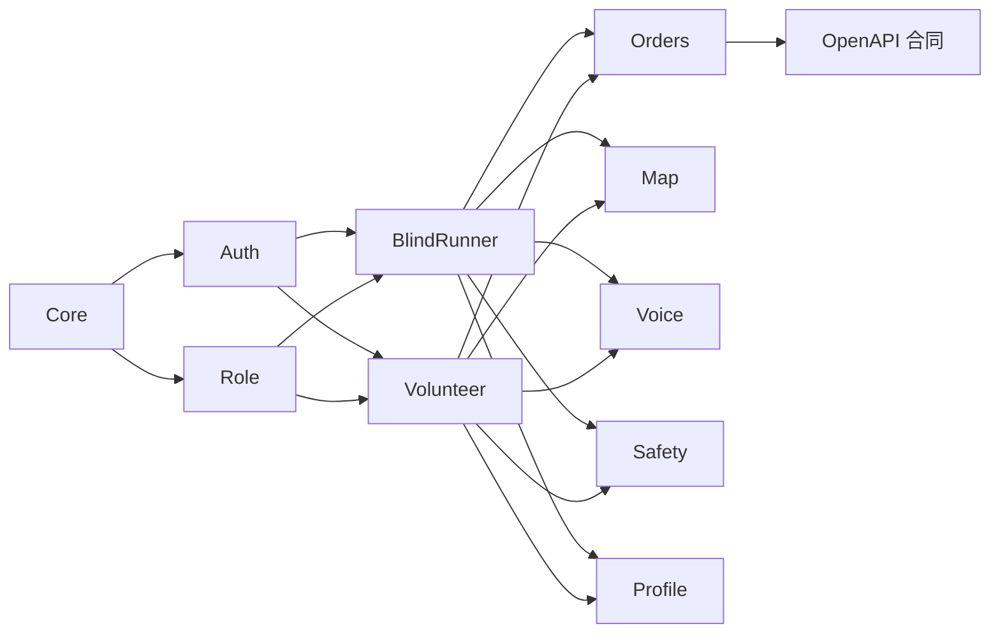

# 项目结构与模块化

<cite>
**本文引用的文件**
- [blindRunApp.swift](file://blindRun/blindRun/blindRunApp.swift)
- [ContentView.swift](file://blindRun/blindRun/ContentView.swift)
- [08-ios-architecture.md](file://docs/08-ios-architecture.md)
- [02-mvp-scope.md](file://docs/02-mvp-scope.md)
- [01-product-requirements.md](file://docs/01-product-requirements.md)
- [04-user-flows-and-state-machine.md](file://docs/04-user-flows-and-state-machine.md)
- [09-accessibility-and-voice-guidelines.md](file://docs/09-accessibility-and-voice-guidelines.md)
- [07-api-contract.openapi.yaml](file://docs/07-api-contract.openapi.yaml)
- [proposal.md](file://openspec/changes/add-aidrun-ios-spring-mvp/proposal.md)
- [tasks.md](file://openspec/changes/add-aidrun-ios-spring-mvp/tasks.md)
- [spec.md](file://openspec/changes/add-aidrun-ios-spring-mvp/specs/role-switching/spec.md)
- [config.yaml](file://openspec/config.yaml)
</cite>

## 目录
1. [简介](#简介)
2. [项目结构](#项目结构)
3. [核心组件](#核心组件)
4. [架构总览](#架构总览)
5. [详细组件分析](#详细组件分析)
6. [依赖分析](#依赖分析)
7. [性能考虑](#性能考虑)
8. [故障排查指南](#故障排查指南)
9. [结论](#结论)
10. [附录](#附录)

## 简介
本指南面向 blindRun 项目的 SwiftUI + MVVM 架构，围绕 Core、Auth、Role、BlindRunner、Volunteer、Orders、Map、Voice、Safety、Profile 等模块，系统阐述设计理念、职责边界、接口契约与数据流，提供模块创建最佳实践、命名规范与文件组织原则，并给出新模块开发模板与示例路径。

## 项目结构
blindRun 当前为 SwiftUI 应用入口，包含应用入口类与基础视图。完整的模块化结构以文档定义为准，建议采用按功能域分组的源代码组织方式，便于团队协作与演进。

**图表来源**
- [blindRunApp.swift:11-16](file://blindRun/blindRun/blindRunApp.swift#L11-L16)
- [ContentView.swift:10-20](file://blindRun/blindRun/ContentView.swift#L10-L20)
- [08-ios-architecture.md:18-31](file://docs/08-ios-architecture.md#L18-L31)
- [02-mvp-scope.md:16-94](file://docs/02-mvp-scope.md#L16-L94)
- [01-product-requirements.md:1-161](file://docs/01-product-requirements.md#L1-L161)
- [04-user-flows-and-state-machine.md:1-70](file://docs/04-user-flows-and-state-machine.md#L1-L70)
- [09-accessibility-and-voice-guidelines.md:1-143](file://docs/09-accessibility-and-voice-guidelines.md#L1-L143)
- [07-api-contract.openapi.yaml:1-25](file://docs/07-api-contract.openapi.yaml#L1-L25)

**章节来源**
- [blindRunApp.swift:11-16](file://blindRun/blindRun/blindRunApp.swift#L11-L16)
- [ContentView.swift:10-20](file://blindRun/blindRun/ContentView.swift#L10-L20)
- [08-ios-architecture.md:18-31](file://docs/08-ios-architecture.md#L18-L31)

## 核心组件
- Core：应用环境、依赖容器、共享模型与全局状态
- Auth：手机号登录、JWT 持久化、会话管理
- Role：角色切换与拦截规则
- BlindRunner：盲人端首页、资料、预约、订单状态
- Volunteer：志愿者首页、可用性、可接订单、服务记录、积分
- Orders：订单 DTO、状态机辅助、轮询
- Map：高德地图桥接、定位、标记、距离计算
- Voice：TTS、重复状态播报、语音输入
- Safety：紧急求助确认与取消确认流程
- Profile：盲人与志愿者资料表单

上述模块划分来自架构文档与 MVP 范围文档，确保每个模块职责单一、边界清晰。

**章节来源**
- [08-ios-architecture.md:18-31](file://docs/08-ios-architecture.md#L18-L31)
- [02-mvp-scope.md:16-94](file://docs/02-mvp-scope.md#L16-L94)

## 架构总览
SwiftUI + MVVM 架构在本项目中的落地要点：
- View：保持轻薄，仅渲染状态并转发用户意图
- ViewModel：持有加载/校验状态、API 调用、轮询、TTS 触发
- Service：封装 API 与平台能力边界
- DTO：与 OpenAPI Schema 对齐；领域助手负责展示文本与状态转换

**图表来源**
- [08-ios-architecture.md:33-48](file://docs/08-ios-architecture.md#L33-L48)
- [07-api-contract.openapi.yaml:25-80](file://docs/07-api-contract.openapi.yaml#L25-L80)

**章节来源**
- [08-ios-architecture.md:33-48](file://docs/08-ios-architecture.md#L33-L48)

## 详细组件分析

### Core 模块
- 职责：应用环境初始化、依赖注入容器、共享模型与全局状态
- 关键点：集中管理 API 环境切换、令牌存储策略、全局主题与无障碍偏好
- 最佳实践：避免循环依赖；将跨模块共享的状态抽象为只读属性；提供工厂方法创建 ViewModel

### Auth 模块
- 职责：手机号 + 验证码登录、JWT 持久化、会话恢复、登出确认
- 接口契约：统一 APIClient 协议；错误映射到用户可感知消息与 TTS
- 安全建议：MVP 使用 UserDefaults，生产前迁移至 Keychain

**图表来源**
- [08-ios-architecture.md:68-82](file://docs/08-ios-architecture.md#L68-L82)
- [07-api-contract.openapi.yaml:25-46](file://docs/07-api-contract.openapi.yaml#L25-L46)

**章节来源**
- [08-ios-architecture.md:68-82](file://docs/08-ios-architecture.md#L68-L82)
- [07-api-contract.openapi.yaml:25-46](file://docs/07-api-contract.openapi.yaml#L25-L46)

### Role 模块
- 职责：激活角色切换与拦截逻辑
- 拦截规则：存在 accepted/arrived/in_progress/emergency 时禁止切换
- 交互设计：提供切换确认与错误提示

**图表来源**
- [spec.md:11-17](file://openspec/changes/add-aidrun-ios-spring-mvp/specs/role-switching/spec.md#L11-L17)

**章节来源**
- [spec.md:1-26](file://openspec/changes/add-aidrun-ios-spring-mvp/specs/role-switching/spec.md#L1-L26)

### BlindRunner 模块
- 职责：盲人资料、预约创建、订单状态轮询、服务中交互、完成与评分
- 轮询策略：每 5 秒轮询订单详情；状态变化时播报 TTS
- 无障碍：大按钮、VoiceOver 标签、重复状态按钮

**图表来源**
- [04-user-flows-and-state-machine.md:277-299](file://docs/04-user-flows-and-state-machine.md#L277-L299)

**章节来源**
- [04-user-flows-and-state-machine.md:275-309](file://docs/04-user-flows-and-state-machine.md#L275-L309)
- [09-accessibility-and-voice-guidelines.md:13-36](file://docs/09-accessibility-and-voice-guidelines.md#L13-L36)

### Volunteer 模块
- 职责：志愿者资料与 Mock 认证、可用性开关、可接订单列表、订单详情与服务流程、服务记录与积分
- 距离排序：基于志愿者位置与订单坐标在 iOS 端计算并排序

**图表来源**
- [07-api-contract.openapi.yaml:209-237](file://docs/07-api-contract.openapi.yaml#L209-L237)

**章节来源**
- [02-mvp-scope.md:40-53](file://docs/02-mvp-scope.md#L40-L53)
- [07-api-contract.openapi.yaml:209-237](file://docs/07-api-contract.openapi.yaml#L209-L237)

### Orders 模块
- 职责：订单 DTO、状态机辅助、轮询控制
- 状态机：matching → accepted → arrived → in_progress → completed；紧急状态 emergency 为终态

**图表来源**
- [04-user-flows-and-state-machine.md:74-96](file://docs/04-user-flows-and-state-machine.md#L74-L96)

**章节来源**
- [04-user-flows-and-state-machine.md:72-119](file://docs/04-user-flows-and-state-machine.md#L72-L119)

### Map 模块
- 职责：高德地图桥接、定位权限处理、标记与距离计算
- 配置：高德 Key 存放于本地配置，加入忽略清单；提供示例配置文件

**章节来源**
- [02-mvp-scope.md:146-151](file://docs/02-mvp-scope.md#L146-L151)
- [08-ios-architecture.md:98-124](file://docs/08-ios-architecture.md#L98-L124)

### Voice 模块
- 职责：TTS 播报、重复状态按钮、语音输入
- 覆盖：登录、订单状态、错误提示、危险操作确认

**章节来源**
- [09-accessibility-and-voice-guidelines.md:13-36](file://docs/09-accessibility-and-voice-guidelines.md#L13-L36)

### Safety 模块
- 职责：紧急求助与取消确认流程，二次确认对话框
- 行为：进入 emergency 终态，播报并保持异常状态

**章节来源**
- [09-accessibility-and-voice-guidelines.md:88-107](file://docs/09-accessibility-and-voice-guidelines.md#L88-L107)
- [04-user-flows-and-state-machine.md:230-257](file://docs/04-user-flows-and-state-machine.md#L230-L257)

### Profile 模块
- 职责：盲人与志愿者资料表单，必填项与可选项管理
- 交互：首次登录后引导完善资料

**章节来源**
- [02-mvp-scope.md:27-51](file://docs/02-mvp-scope.md#L27-L51)

## 依赖分析
- 模块间耦合：Core 为基础设施，Auth/Role 为横切关注点；BlindRunner/Volunteer 依赖 Orders/Map/Voice/Safety/Profile；Orders 依赖 API 合同；Map/Voice/Safety 为平台能力封装
- 外部依赖：高德地图 SDK、CoreLocation、AVSpeechSynthesizer、Speech 框架、OpenAPI 合同
- 循环依赖规避：通过协议与依赖注入解耦；ViewModel 不直接依赖 View；Service 封装平台能力

**图表来源**
- [08-ios-architecture.md:18-31](file://docs/08-ios-architecture.md#L18-L31)
- [07-api-contract.openapi.yaml:1-25](file://docs/07-api-contract.openapi.yaml#L1-L25)

**章节来源**
- [08-ios-architecture.md:18-31](file://docs/08-ios-architecture.md#L18-L31)

## 性能考虑
- 轮询频率：订单相关页面每 5 秒轮询，避免过于频繁导致电量消耗
- 轮询终止：页面消失、订单进入终态、用户登出时停止轮询
- 网络层：统一 APIClient 协议，简化 Mock 与真实实现切换
- 无障碍：避免重复播报，记忆上次播报内容，减少 TTS 频率

**章节来源**
- [04-user-flows-and-state-machine.md:275-299](file://docs/04-user-flows-and-state-machine.md#L275-L299)
- [08-ios-architecture.md:68-77](file://docs/08-ios-architecture.md#L68-L77)
- [09-accessibility-and-voice-guidelines.md:30-36](file://docs/09-accessibility-and-voice-guidelines.md#L30-L36)

## 故障排查指南
- 登录失败：检查验证码是否为固定值；确认后端地址与环境配置；查看错误映射与 TTS 提示
- 订单状态不更新：确认轮询是否启动与停止条件；检查网络连通性与令牌有效性
- 地图/定位问题：确认高德 Key 配置；检查定位权限；模拟器提供默认坐标
- 角色切换被拦截：确认是否存在活跃订单；提示用户完成后重试
- 危险操作：取消订单、紧急求助、完成服务、登出均需二次确认

**章节来源**
- [07-api-contract.openapi.yaml:469-542](file://docs/07-api-contract.openapi.yaml#L469-L542)
- [02-mvp-scope.md:136-151](file://docs/02-mvp-scope.md#L136-L151)
- [09-accessibility-and-voice-guidelines.md:88-107](file://docs/09-accessibility-and-voice-guidelines.md#L88-L107)

## 结论
本指南基于现有文档定义了 blindRun 的模块化架构与职责边界，明确了 SwiftUI + MVVM 的落地方式与关键交互流程。建议在实现过程中严格遵循模块边界、接口契约与无障碍要求，确保可维护性与可演示性。

## 附录

### 模块创建最佳实践
- 文件组织：按模块建立目录，内部按 Model/View/ViewModel/Service/Protocol 分层
- 命名规范：模块名使用名词短语；ViewModel 以“...ViewModel”结尾；Service 以“...Service”结尾；DTO 与协议与 OpenAPI 保持一致
- 依赖注入：通过构造函数注入依赖，避免全局状态
- 错误处理：统一错误映射与用户提示，结合 TTS 与 VoiceOver

### SwiftUI + MVVM 实现要点
- View：只负责布局与事件转发
- ViewModel：集中处理业务逻辑、状态管理与副作用
- Service：封装网络与平台能力
- Model：与 DTO 对齐，提供领域辅助方法

### 新模块开发模板与示例路径
- 模板结构
  - 模块根目录
    - Model/
    - View/
    - ViewModel/
    - Service/
    - Protocol/
- 示例路径
  - 登录流程参考：[AuthViewModel 示例](file://docs/08-ios-architecture.md#L44)
  - 盲人预约流程参考：[BlindBookingViewModel 示例](file://docs/08-ios-architecture.md#L45)
  - 志愿者首页流程参考：[VolunteerHomeViewModel 示例](file://docs/08-ios-architecture.md#L47)
  - 订单状态轮询参考：[BlindOrderStatusViewModel 示例](file://docs/08-ios-architecture.md#L46)
  - 志愿者订单详情流程参考：[VolunteerOrderDetailViewModel 示例](file://docs/08-ios-architecture.md#L48)

**章节来源**
- [08-ios-architecture.md:33-48](file://docs/08-ios-architecture.md#L33-L48)
- [proposal.md:14-25](file://openspec/changes/add-aidrun-ios-spring-mvp/proposal.md#L14-L25)
- [tasks.md:28-53](file://openspec/changes/add-aidrun-ios-spring-mvp/tasks.md#L28-L53)