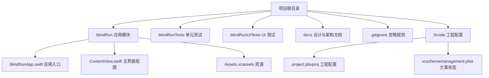
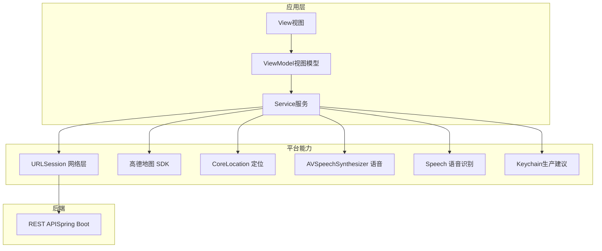
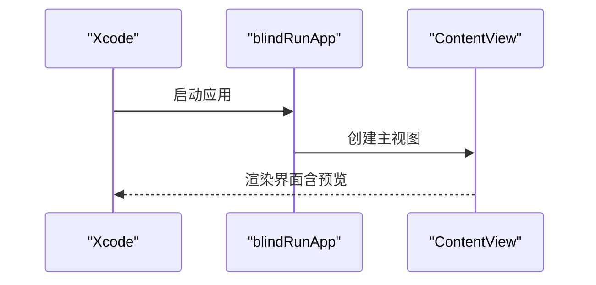
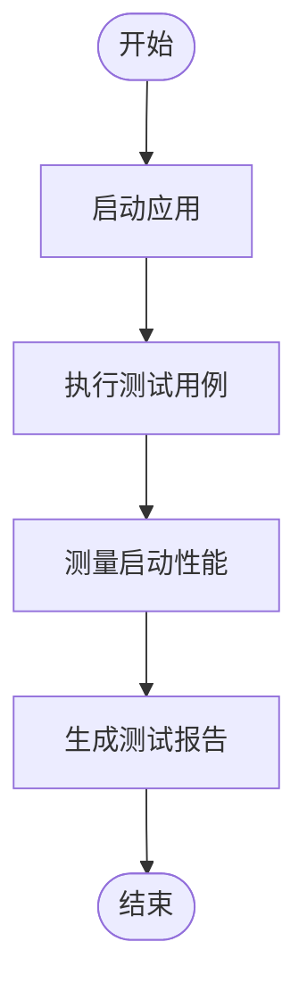
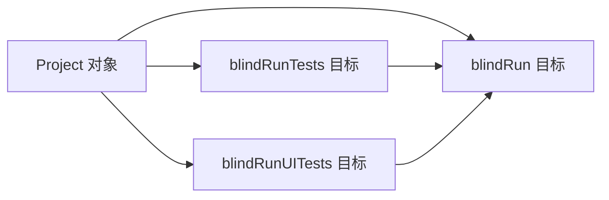

# 快速开始

<cite>
**本文引用的文件**   
- [项目文件索引](file://blindRun.xcodeproj/project.pbxproj)
- [应用入口](file://blindRun/blindRunApp.swift)
- [主界面视图](file://blindRun/ContentView.swift)
- [iOS 架构文档](file://docs/08-ios-architecture.md)
- [产品需求文档](file://docs/01-product-requirements.md)
- [MVP 范围与技术栈](file://docs/02-mvp-scope.md)
- [单元测试模板](file://blindRunTests/blindRunTests.swift)
- [UI 测试模板](file://blindRunUITests/blindRunUITests.swift)
- [Git 忽略规则](file://.gitignore)
- [Xcode 方案状态](file://blindRun.xcodeproj/xcuserdata/jerry.xcuserdatad/xcschemes/xcschememanagement.plist)
</cite>

## 目录
1. [简介](#简介)
2. [项目结构](#项目结构)
3. [核心组件](#核心组件)
4. [架构总览](#架构总览)
5. [详细组件分析](#详细组件分析)
6. [依赖关系分析](#依赖关系分析)
7. [性能注意事项](#性能注意事项)
8. [故障排查指南](#故障排查指南)
9. [结论](#结论)
10. [附录](#附录)

## 简介
本指南面向 iOS 开发新手，帮助你在 macOS 上快速搭建 blindRun 项目的开发环境，完成 Xcode 配置、SwiftUI 开发环境准备、高德地图 SDK 集成与 API 密钥配置，并顺利在模拟器上运行应用。同时提供常见问题排查与调试技巧，确保你能以最小成本完成首次成功运行。

## 项目结构
blindRun 是一个基于 SwiftUI 的 iOS 应用，采用 MVVM 架构，目标是实现真实地图与真实定位、手机号登录与 JWT、无障碍与语音播报等能力。项目当前包含应用主体、单元测试与 UI 测试模板，以及多份设计与架构文档。

图表来源
- [项目文件索引:168-207](file://blindRun.xcodeproj/project.pbxproj#L168-L207)
- [应用入口:10-17](file://blindRun/blindRunApp.swift#L10-L17)
- [主界面视图:10-20](file://blindRun/ContentView.swift#L10-L20)
- [Xcode 方案状态:7-11](file://blindRun.xcodeproj/xcuserdata/jerry.xcuserdatad/xcschemes/xcschememanagement.plist#L7-L11)

章节来源
- [项目文件索引:168-207](file://blindRun.xcodeproj/project.pbxproj#L168-L207)
- [.gitignore:1-63](file://.gitignore#L1-L63)

## 核心组件
- 应用入口：负责创建窗口组并展示主界面视图。
- 主界面视图：当前为占位页面，包含系统图标与提示文本，支持预览。
- 测试套件：提供单元测试与 UI 测试的基础模板，便于后续扩展。

章节来源
- [应用入口:10-17](file://blindRun/blindRunApp.swift#L10-L17)
- [主界面视图:10-20](file://blindRun/ContentView.swift#L10-L20)
- [单元测试模板:11-38](file://blindRunTests/blindRunTests.swift#L11-L38)
- [UI 测试模板:10-43](file://blindRunUITests/blindRunUITests.swift#L10-L43)

## 架构总览
应用采用 SwiftUI + MVVM 架构，要求使用真实地图与真实定位，支持手机号登录与 JWT，具备无障碍与语音播报能力。文档明确了模块划分、网络层、Token 存储、地图与定位、轮询策略、环境切换等关键点。

图表来源
- [iOS 架构文档:3-16](file://docs/08-ios-architecture.md#L3-L16)
- [iOS 架构文档:68-82](file://docs/08-ios-architecture.md#L68-L82)
- [产品需求文档:118-129](file://docs/01-product-requirements.md#L118-L129)

章节来源
- [iOS 架构文档:3-16](file://docs/08-ios-architecture.md#L3-L16)
- [iOS 架构文档:68-82](file://docs/08-ios-architecture.md#L68-L82)
- [产品需求文档:118-129](file://docs/01-product-requirements.md#L118-L129)

## 详细组件分析

### 应用入口与主界面
- 应用入口创建窗口组并渲染主视图，当前主视图为占位页面，用于验证基础运行链路。
- 主视图包含系统图标与文本提示，并提供预览入口，便于在 Xcode 预览器中快速验证布局。

图表来源
- [应用入口:10-17](file://blindRun/blindRunApp.swift#L10-L17)
- [主界面视图:10-20](file://blindRun/ContentView.swift#L10-L20)

章节来源
- [应用入口:10-17](file://blindRun/blindRunApp.swift#L10-L17)
- [主界面视图:10-20](file://blindRun/ContentView.swift#L10-L20)

### 测试组件
- 单元测试与 UI 测试模板已就绪，可直接运行或扩展。
- UI 测试示例展示了应用启动与性能测量的基本用法。

图表来源
- [单元测试模板:21-36](file://blindRunTests/blindRunTests.swift#L21-L36)
- [UI 测试模板:25-42](file://blindRunUITests/blindRunUITests.swift#L25-L42)

章节来源
- [单元测试模板:11-38](file://blindRunTests/blindRunTests.swift#L11-L38)
- [UI 测试模板:10-43](file://blindRunUITests/blindRunUITests.swift#L10-L43)

## 依赖关系分析
- 工程配置显示应用目标为 iOS 平台，使用 Swift 语言，构建系统为 Xcode。
- 当前工程未声明外部依赖，所有第三方能力（如地图、定位、语音）需通过系统框架与 SDK 集成。
- 测试目标与主应用目标相互关联，测试运行依赖主应用产物。

图表来源
- [项目文件索引:168-207](file://blindRun.xcodeproj/project.pbxproj#L168-L207)
- [项目文件索引:258-269](file://blindRun.xcodeproj/project.pbxproj#L258-L269)

章节来源
- [项目文件索引:168-207](file://blindRun.xcodeproj/project.pbxproj#L168-L207)
- [项目文件索引:258-269](file://blindRun.xcodeproj/project.pbxproj#L258-L269)

## 性能注意事项
- 在 Debug 构建下启用严格诊断与预览支持，有助于早期发现潜在问题。
- UI 测试提供了启动性能测量示例，建议在 CI 或本地构建后运行以监控启动耗时。
- 由于应用采用 SwiftUI + MVVM，保持视图薄逻辑、将业务与网络调用下沉至 ViewModel 与 Service，有利于提升可维护性与性能。

章节来源
- [项目文件索引:272-335](file://blindRun.xcodeproj/project.pbxproj#L272-L335)
- [UI 测试模板:37-42](file://blindRunUITests/blindRunUITests.swift#L37-L42)

## 故障排查指南
- 模拟器无法获取定位
  - 现象：地图或定位相关功能在模拟器中不可用。
  - 解决：在模拟器中手动设置位置（开发者菜单），或在代码中提供演示用默认坐标以保证演示稳定性。
  - 参考：[演示回退坐标说明:114-118](file://docs/08-ios-architecture.md#L114-L118)

- 高德地图 SDK 未集成或密钥未生效
  - 现象：地图无法显示或出现鉴权错误。
  - 解决：按照文档要求在本地配置文件中添加所需密钥，并确保该文件被忽略且不提交到版本库。
  - 参考：[高德地图 Key 管理:119-124](file://docs/08-ios-architecture.md#L119-L124)、[MVP 范围与技术栈中的 Key 管理说明:146-151](file://docs/02-mvp-scope.md#L146-L151)

- 后端联调失败（Mock/Local Backend）
  - 现象：应用无法访问后端接口。
  - 解决：在 Debug 构建中启用环境选择器，确保本地后端地址可达（例如局域网 IP），并检查网络权限与防火墙设置。
  - 参考：[环境切换与 API 模式:50-67](file://docs/08-ios-architecture.md#L50-L67)、[MVP 范围与技术栈中的环境说明:136-145](file://docs/02-mvp-scope.md#L136-L145)

- 无法运行 UI 测试
  - 现象：UI 测试启动失败或断言不通过。
  - 解决：确认测试目标指向正确的主应用目标；检查测试前置条件与界面方向设置；使用 `continueAfterFailure = false` 加速失败定位。
  - 参考：[UI 测试模板:12-23](file://blindRunUITests/blindRunUITests.swift#L12-L23)

- 构建配置差异导致的签名或设备兼容性问题
  - 现象：真机运行失败或签名错误。
  - 解决：检查开发团队与签名配置；确认最低系统版本与目标设备家族设置符合要求。
  - 参考：[构建配置（Debug/Release）:272-392](file://blindRun.xcodeproj/project.pbxproj#L272-L392)

章节来源
- [iOS 架构文档:50-67](file://docs/08-ios-architecture.md#L50-L67)
- [iOS 架构文档:114-118](file://docs/08-ios-architecture.md#L114-L118)
- [MVP 范围与技术栈:136-151](file://docs/02-mvp-scope.md#L136-L151)
- [UI 测试模板:12-23](file://blindRunUITests/blindRunUITests.swift#L12-L23)
- [项目文件索引:272-392](file://blindRun.xcodeproj/project.pbxproj#L272-L392)

## 结论
通过本指南，你可以在 macOS 上完成 Xcode 与 SwiftUI 开发环境的准备，理解项目结构与架构约束，并掌握高德地图 SDK 的集成要点与 API 密钥配置方法。结合测试模板与故障排查清单，你可以快速完成首次运行与演示验证，为后续功能迭代打下坚实基础。

## 附录

### 快速开始清单
- 准备工作
  - 安装最新版本 Xcode 与 macOS
  - 准备 iOS 模拟器（建议 iPhone 14 或更新机型）
- 克隆与打开项目
  - 使用 Xcode 打开工程文件，确认项目结构与目标配置
- 首次运行
  - 选择模拟器为目标设备，点击运行
  - 预览主界面，确认应用启动成功
- 高德地图 SDK 集成（可选）
  - 按照文档要求准备本地密钥配置文件
  - 将密钥写入本地配置并忽略提交
- 后端联调（可选）
  - 在 Debug 构建中启用环境选择器
  - 配置本地后端地址并确保网络可达
- 运行测试
  - 运行单元测试与 UI 测试，检查覆盖率与性能指标

章节来源
- [项目文件索引:168-207](file://blindRun.xcodeproj/project.pbxproj#L168-L207)
- [应用入口:10-17](file://blindRun/blindRunApp.swift#L10-L17)
- [主界面视图:10-20](file://blindRun/ContentView.swift#L10-L20)
- [iOS 架构文档:50-67](file://docs/08-ios-architecture.md#L50-L67)
- [MVP 范围与技术栈:136-151](file://docs/02-mvp-scope.md#L136-L151)
- [单元测试模板:21-36](file://blindRunTests/blindRunTests.swift#L21-L36)
- [UI 测试模板:25-42](file://blindRunUITests/blindRunUITests.swift#L25-L42)