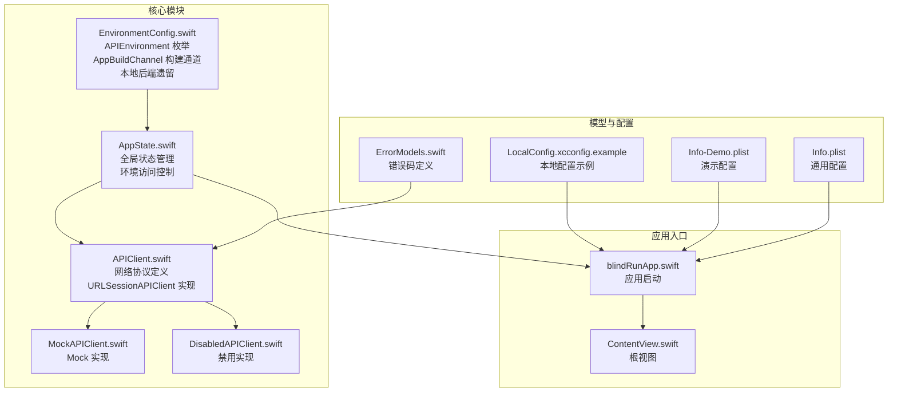
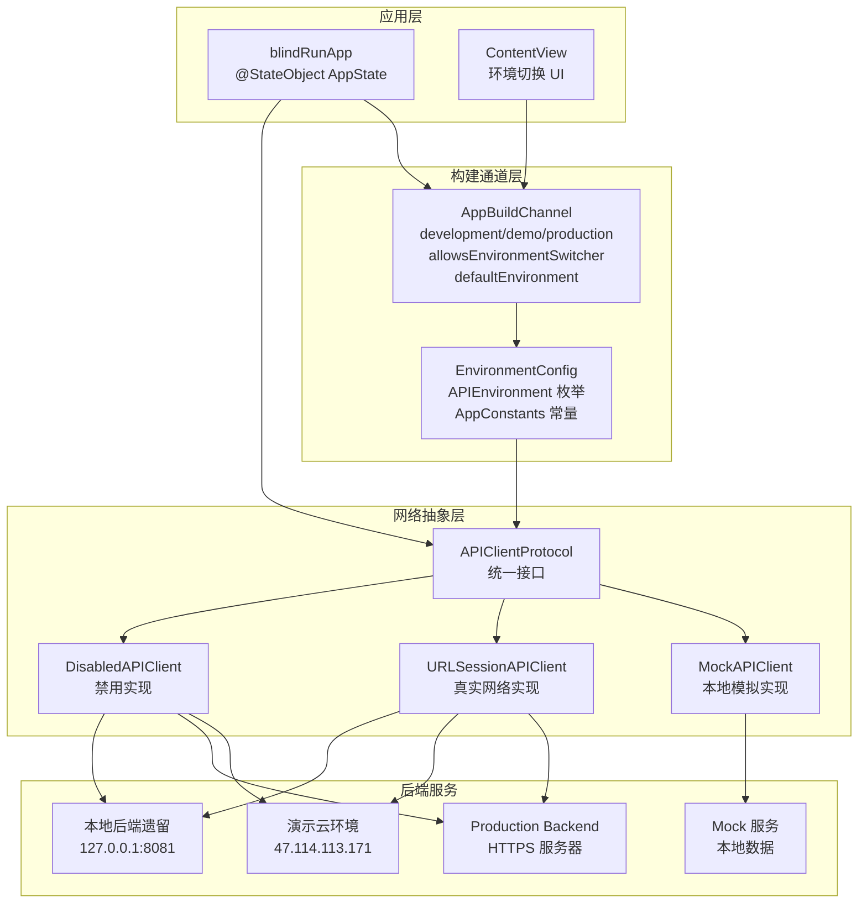
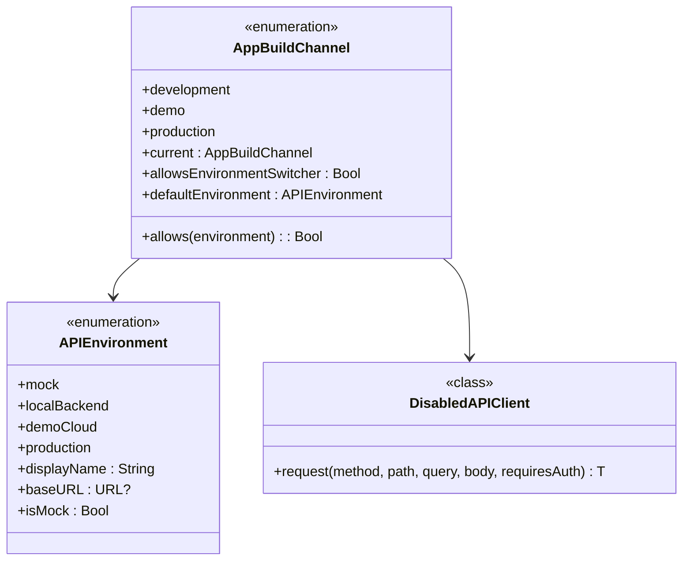
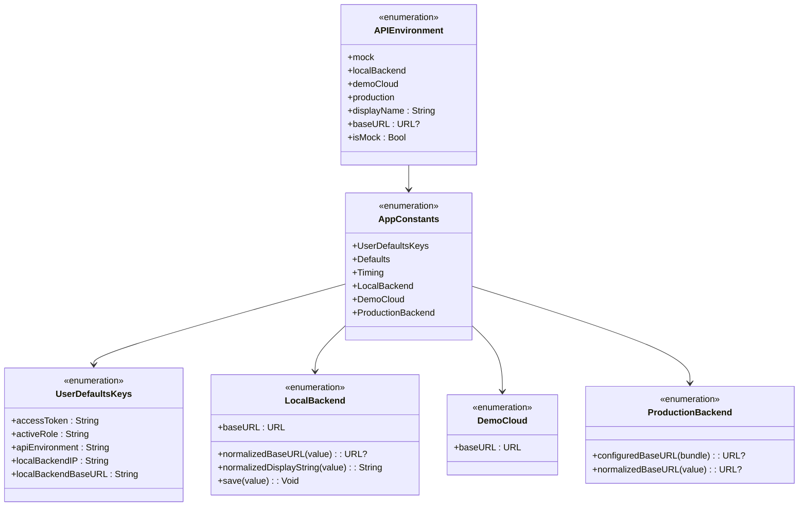
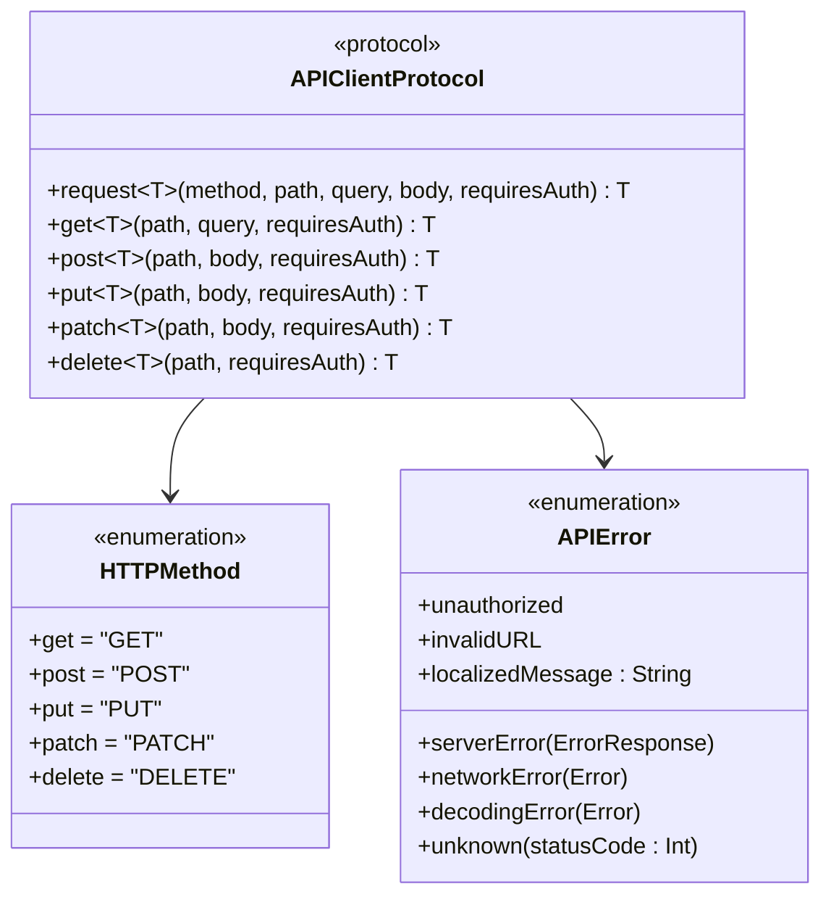
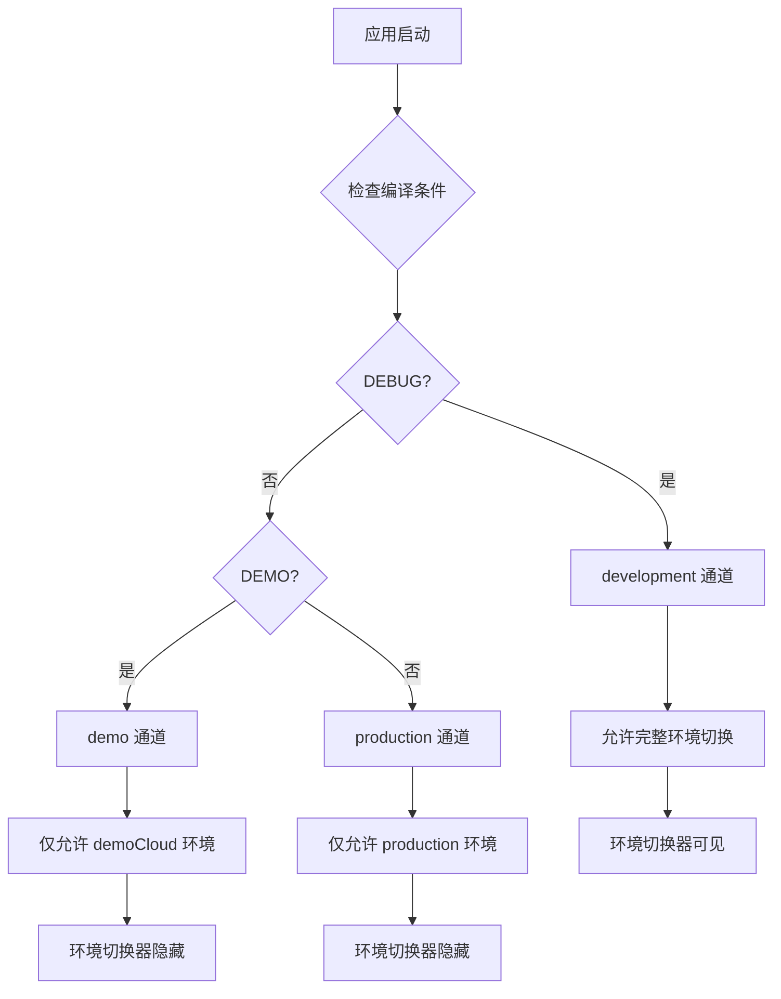
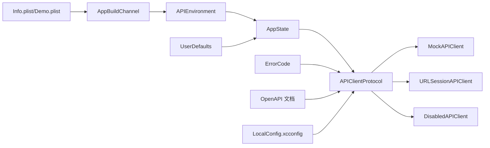

# API 环境配置

<cite>
**本文引用的文件**
- [EnvironmentConfig.swift](file://blindRun/Core/EnvironmentConfig.swift)
- [AppState.swift](file://blindRun/Core/AppState.swift)
- [APIClient.swift](file://blindRun/Core/APIClient.swift)
- [MockAPIClient.swift](file://blindRun/Core/MockAPIClient.swift)
- [blindRunApp.swift](file://blindRun/blindRunApp.swift)
- [ContentView.swift](file://blindRun/ContentView.swift)
- [ErrorModels.swift](file://blindRun/Core/Models/ErrorModels.swift)
- [08-ios-architecture.md](file://docs/08-ios-architecture.md)
- [LocalConfig.xcconfig.example](file://LocalConfig.xcconfig.example)
- [Info-Demo.plist](file://blindRun/Info-Demo.plist)
- [Info.plist](file://blindRun/Info.plist)
</cite>

## 更新摘要
**变更内容**
- 本地后端环境仍保留在代码中，但已在文档中明确标注其为遗留状态
- 完整的构建通道系统已实现，包括 development、demo、production 三个通道
- 新增 DisabledAPIClient 类用于环境访问控制
- 更新了 APIEnvironment 枚举，保留 localBackend 但标记为遗留
- 增强了环境切换的安全性和访问控制机制

## 目录
1. [简介](#简介)
2. [项目结构](#项目结构)
3. [核心组件](#核心组件)
4. [架构总览](#架构总览)
5. [详细组件分析](#详细组件分析)
6. [构建通道系统](#构建通道系统)
7. [演示云环境配置](#演示云环境配置)
8. [本地后端环境（遗留）](#本地后端环境遗留)
9. [依赖关系分析](#依赖关系分析)
10. [性能考量](#性能考量)
11. [故障排查指南](#故障排查指南)
12. [结论](#结论)
13. [附录](#附录)

## 简介
本文件详细介绍了 blindRun 应用的 API 环境配置系统，基于完整的 Swift 实现展示了多环境支持的设计与实现。系统现已升级为支持构建通道的智能环境管理，包括 development、demo、production 三个通道的环境访问限制机制。文档涵盖了 mock、localBackend、demoCloud、production 四种环境的配置与切换机制，深入解释了 APIClient 协议的设计思想，以及如何通过统一接口实现 Mock 与真实环境的无缝切换。同时，文档详细描述了构建通道如何影响环境切换功能的可用性，以及演示云环境的特殊配置和安全考虑。

**重要说明** 本地后端环境（localBackend）目前仍存在于代码中，但已被标记为遗留状态。根据项目文档，该环境不再推荐使用，应在后续版本中逐步移除。

## 项目结构
blindRun 为 SwiftUI 应用，API 环境配置系统位于 Core 模块中，通过 EnvironmentConfig.swift 定义环境常量和构建通道，通过 AppState.swift 管理全局状态，通过 APIClient.swift 定义网络协议，通过 MockAPIClient.swift 实现 Mock 功能，通过 DisabledAPIClient.swift 实现访问控制。



**图表来源**
- [EnvironmentConfig.swift:1-174](file://blindRun/Core/EnvironmentConfig.swift#L1-L174)
- [AppState.swift:1-313](file://blindRun/Core/AppState.swift#L1-L313)
- [APIClient.swift:1-269](file://blindRun/Core/APIClient.swift#L1-L269)
- [MockAPIClient.swift:1-642](file://blindRun/Core/MockAPIClient.swift#L1-L642)
- [DisabledAPIClient.swift:302-312](file://blindRun/Core/AppState.swift#L302-L312)

**章节来源**
- [EnvironmentConfig.swift:1-174](file://blindRun/Core/EnvironmentConfig.swift#L1-L174)
- [AppState.swift:1-313](file://blindRun/Core/AppState.swift#L1-L313)
- [APIClient.swift:1-269](file://blindRun/Core/APIClient.swift#L1-L269)
- [MockAPIClient.swift:1-642](file://blindRun/Core/MockAPIClient.swift#L1-L642)

## 核心组件
- **AppBuildChannel 构建通道**
  - 定义三类构建通道：development、demo、production
  - 通过编译时条件判断确定当前通道
  - 提供 allowsEnvironmentSwitcher 属性控制环境切换器可见性
  - 支持每个通道的默认环境设置和访问权限控制
- **APIEnvironment 枚举**
  - 定义四种环境：mock、localBackend、demoCloud、production
  - 每个环境包含基础 URL 与显示名称
  - 支持 isMock 属性判断是否为模拟环境
  - localBackend 标记为遗留环境，不推荐使用
  - demoCloud 支持演示专用的云环境配置
  - production 支持 HTTPS 生产环境配置
- **AppState 全局状态管理**
  - 管理用户会话、JWT 令牌和当前环境
  - 提供 apiClient 计算属性，根据环境和构建通道动态返回对应客户端
  - 实现环境持久化到 UserDefaults
  - 管理用户登录状态和角色切换
  - 集成构建通道的环境访问控制
- **APIClient 协议**
  - 统一的网络请求接口定义
  - 支持异步请求和错误处理
  - 提供便捷的 HTTP 方法包装
  - 定义错误类型和本地化消息
- **MockAPIClient 实现**
  - 返回预定义的测试数据
  - 模拟网络延迟（0.3秒）
  - 支持基本的认证和用户信息路由
- **URLSessionAPIClient 实现**
  - 基于 URLSession 的真实网络请求
  - 自动处理鉴权头和 JSON 编解码
  - 统一的错误处理和状态码处理
- **DisabledAPIClient 实现**
  - 在不允许的环境中禁用 API 调用
  - 抛出 invalidURL 错误阻止网络请求
  - 用于演示和生产构建的环境保护

**重要说明** 本地后端环境（localBackend）目前仍存在于代码中，但已被标记为遗留状态。根据项目文档，该环境不再推荐使用，应在后续版本中逐步移除。

**章节来源**
- [EnvironmentConfig.swift:5-45](file://blindRun/Core/EnvironmentConfig.swift#L5-L45)
- [EnvironmentConfig.swift:49-89](file://blindRun/Core/EnvironmentConfig.swift#L49-L89)
- [AppState.swift:9-105](file://blindRun/Core/AppState.swift#L9-L105)
- [APIClient.swift:46-99](file://blindRun/Core/APIClient.swift#L46-L99)
- [MockAPIClient.swift:5-642](file://blindRun/Core/MockAPIClient.swift#L5-L642)
- [APIClient.swift:103-192](file://blindRun/Core/APIClient.swift#L103-L192)
- [DisabledAPIClient.swift:302-312](file://blindRun/Core/AppState.swift#L302-L312)

## 架构总览
下图展示了 API 环境配置系统在应用中的完整架构，包括新增的构建通道系统。AppState 作为全局状态中心，根据当前构建通道和环境动态选择合适的 API 客户端实现，实现了不同构建通道下的智能环境切换和访问控制。



**图表来源**
- [EnvironmentConfig.swift:5-45](file://blindRun/Core/EnvironmentConfig.swift#L5-L45)
- [EnvironmentConfig.swift:49-89](file://blindRun/Core/EnvironmentConfig.swift#L49-L89)
- [AppState.swift:87-105](file://blindRun/Core/AppState.swift#L87-L105)
- [MockAPIClient.swift:5-642](file://blindRun/Core/MockAPIClient.swift#L5-L642)
- [APIClient.swift:103-192](file://blindRun/Core/APIClient.swift#L103-L192)
- [DisabledAPIClient.swift:302-312](file://blindRun/Core/AppState.swift#L302-L312)

## 详细组件分析

### AppBuildChannel 构建通道系统
- **设计特点**
  - 使用编译时条件判断确定当前构建通道
  - development 通道支持完整的环境切换功能
  - demo 通道锁定到 demoCloud 环境，禁止其他环境切换
  - production 通道锁定到 production 环境，禁止其他环境切换
- **通道定义**
  - **development**: 开发调试通道，支持所有环境切换
  - **demo**: 演示通道，仅允许 demoCloud 环境
  - **production**: 生产通道，仅允许 production 环境
- **访问控制**
  - allowsEnvironmentSwitcher 属性控制环境切换器的可见性
  - defaultEnvironment 提供每个通道的默认环境设置
  - allows 方法实现细粒度的环境访问权限控制



**图表来源**
- [EnvironmentConfig.swift:5-45](file://blindRun/Core/EnvironmentConfig.swift#L5-L45)
- [EnvironmentConfig.swift:49-89](file://blindRun/Core/EnvironmentConfig.swift#L49-L89)
- [AppState.swift:302-312](file://blindRun/Core/AppState.swift#L302-L312)

**章节来源**
- [EnvironmentConfig.swift:5-45](file://blindRun/Core/EnvironmentConfig.swift#L5-L45)
- [EnvironmentConfig.swift:49-89](file://blindRun/Core/EnvironmentConfig.swift#L49-L89)

### APIEnvironment 枚举与环境配置
- **设计特点**
  - 使用 String 原始值实现序列化和持久化
  - 通过 CaseIterable 支持遍历所有环境选项
  - 提供 displayName 属性用于用户界面显示
  - 通过 baseURL 属性动态生成环境对应的服务器地址
- **环境定义**
  - **mock**: 返回 nil，表示不使用网络请求
  - **localBackend**: 本地后端环境（遗留），固定使用 127.0.0.1:8081
  - **demoCloud**: 演示专用云环境，固定使用演示服务器地址 47.114.113.171
  - **production**: HTTPS 生产环境，支持从 Info.plist 配置
- **配置管理**
  - 通过 AppConstants.UserDefaultsKeys.apiEnvironment 存储当前环境
  - localBackend 环境使用 UserDefaults 存储的 IP 或 URL
  - demoCloud 环境使用固定的演示服务器地址
  - production 环境支持从 Info.plist 配置

**重要说明** localBackend 环境已被标记为遗留状态，不推荐在新项目中使用。



**图表来源**
- [EnvironmentConfig.swift:49-89](file://blindRun/Core/EnvironmentConfig.swift#L49-L89)
- [EnvironmentConfig.swift:118-173](file://blindRun/Core/EnvironmentConfig.swift#L118-L173)

**章节来源**
- [EnvironmentConfig.swift:49-89](file://blindRun/Core/EnvironmentConfig.swift#L49-L89)
- [EnvironmentConfig.swift:118-173](file://blindRun/Core/EnvironmentConfig.swift#L118-L173)

### AppState 全局状态管理与智能环境切换
- **状态管理**
  - @Published 属性实现响应式状态更新
  - 自动持久化到 UserDefaults，确保应用重启后状态保持
  - 提供 isLoggedIn 计算属性简化登录状态判断
- **智能 API 客户端动态切换**
  - apiClient 计算属性根据 currentEnvironment 和构建通道返回对应实现
  - development 通道支持所有环境切换
  - demo 通道强制使用 demoCloud 环境
  - production 通道强制使用 production 环境
  - 禁用不被允许的环境访问
- **初始化与恢复**
  - 应用启动时从 UserDefaults 恢复环境设置
  - 如果没有保存的环境设置，默认使用构建通道的默认环境
  - 支持会话恢复和用户状态管理
  - 集成构建通道的环境访问控制

```mermaid
sequenceDiagram
participant App as 应用启动
participant State as AppState
participant Channel as AppBuildChannel
participant UserDef as UserDefaults
participant Client as API 客户端
App->>State : 初始化
State->>UserDef : 读取 apiEnvironment
UserDef-->>State : 返回环境设置
State->>Channel : 获取当前构建通道
Channel-->>State : 返回通道类型
State->>State : resolvedInitialEnvironment
alt 允许的环境
State->>Client : 访问 apiClient 计算属性
Client->>State : 检查 currentEnvironment
alt mock 环境
Client-->>State : 返回 MockAPIClient
else 允许的环境
Client->>State : 获取 baseURL
alt baseURL 存在
Client-->>State : 返回 URLSessionAPIClient
else baseURL 不存在
Client-->>State : 返回 DisabledAPIClient
end
else 不允许的环境
State->>Client : 访问 apiClient 计算属性
Client-->>State : 返回 DisabledAPIClient
end
```

**图表来源**
- [AppState.swift:109-117](file://blindRun/Core/AppState.swift#L109-L117)
- [AppState.swift:212-224](file://blindRun/Core/AppState.swift#L212-L224)
- [AppState.swift:87-105](file://blindRun/Core/AppState.swift#L87-L105)

**章节来源**
- [AppState.swift:9-313](file://blindRun/Core/AppState.swift#L9-L313)

### APIClient 协议设计与实现
- **协议定义**
  - 统一的 request 方法定义，支持 HTTP 方法、路径、查询参数、请求体和鉴权需求
  - 提供便捷的 HTTP 方法包装（get、post、put、patch、delete）
  - 定义完整的错误类型体系，包括服务器错误、网络错误、解码错误等
- **错误处理机制**
  - APIError 枚举提供详细的错误分类
  - 每种错误类型都有对应的本地化消息
  - 支持将后端错误码映射为用户友好的提示
- **扩展方法**
  - 通过协议扩展提供常用 HTTP 方法的便捷调用
  - 统一的参数处理和默认值设置



**图表来源**
- [APIClient.swift:46-99](file://blindRun/Core/APIClient.swift#L46-L99)
- [APIClient.swift:15-42](file://blindRun/Core/APIClient.swift#L15-L42)
- [APIClient.swift:5-11](file://blindRun/Core/APIClient.swift#L5-L11)

**章节来源**
- [APIClient.swift:46-99](file://blindRun/Core/APIClient.swift#L46-L99)
- [APIClient.swift:15-42](file://blindRun/Core/APIClient.swift#L15-L42)
- [APIClient.swift:5-11](file://blindRun/Core/APIClient.swift#L5-L11)

### MockAPIClient 实现与测试支持
- **模拟数据设计**
  - 返回预定义的测试数据，支持基本的认证和用户信息场景
  - 模拟网络延迟（0.3秒）提供更真实的用户体验
  - 支持 /auth/login 和 /users/me 路径的基本路由
- **测试友好特性**
  - 固定的 JWT 令牌用于测试场景
  - 标准化的用户数据结构
  - 易于扩展的路由系统
- **实现细节**
  - 使用 JSONEncoder/JSONDecoder 进行数据编解码
  - 支持泛型类型 T 的自动解码
  - 异步实现确保主线程不阻塞

**章节来源**
- [MockAPIClient.swift:5-642](file://blindRun/Core/MockAPIClient.swift#L5-L642)

### URLSessionAPIClient 实现与真实网络集成
- **网络请求构建**
  - 基于 URLSession 的异步网络请求
  - 自动处理 URL 组件构建和查询参数编码
  - 支持自定义 HTTP 头部和请求体
- **鉴权与安全**
  - 通过 tokenProvider 闭包获取访问令牌
  - 自动添加 Authorization: Bearer 头部
  - 支持可选的鉴权需求
- **错误处理与状态码**
  - 统一的状态码处理（2xx 成功、401 未授权等）
  - 详细的错误类型分类
  - 支持自定义错误响应解码

**章节来源**
- [APIClient.swift:135-192](file://blindRun/Core/APIClient.swift#L135-L192)

### DisabledAPIClient 实现与环境保护
- **设计目的**
  - 在不允许的环境中禁用 API 调用，防止意外的网络请求
  - 提供统一的错误处理机制，向用户显示环境不可用的信息
  - 保护演示和生产构建免受调试环境的影响
- **实现机制**
  - 抛出 APIError.invalidURL 错误阻止网络请求
  - 在构建通道不允许的环境中自动启用
  - 与 URLSessionAPIClient 共享相同的协议接口
- **应用场景**
  - demo 构建中尝试访问非 demoCloud 环境
  - production 构建中尝试访问非 production 环境
  - 环境 URL 配置无效时的保护措施

**章节来源**
- [DisabledAPIClient.swift:302-312](file://blindRun/Core/AppState.swift#L302-L312)

### 错误码处理与本地化
- **错误码定义**
  - ErrorCode 枚举定义所有支持的后端错误码
  - 每个错误码都有对应的中文本地化消息
  - 支持 TTS 消息输出
- **错误响应结构**
  - ErrorResponse 结构体定义统一的错误响应格式
  - code 字段对应 ErrorCode 原始值
  - message 字段提供人类可读的错误描述
- **映射机制**
  - APIError.serverError 将后端错误映射为本地化消息
  - 支持动态的错误码查找和转换

**章节来源**
- [ErrorModels.swift:5-63](file://blindRun/Core/Models/ErrorModels.swift#L5-L63)

### 环境配置存储与加载时机
- **存储位置**
  - 环境设置：UserDefaults.standard.string(forKey: "com.aidrun.mvp.apiEnvironment")
  - JWT 令牌：UserDefaults.standard.string(forKey: "com.aidrun.mvp.accessToken")
  - 用户角色：UserDefaults.standard.string(forKey: "com.aidrun.mvp.activeRole")
  - 本地后端 IP：UserDefaults.standard.string(forKey: "com.aidrun.mvp.localBackendIP")
  - 本地后端 URL：UserDefaults.standard.string(forKey: "com.aidrun.mvp.localBackendBaseURL")
- **加载时机**
  - 应用启动时：AppState.init() 中从 UserDefaults 恢复环境设置
  - 会话恢复：restoreSession() 方法恢复用户登录状态
  - 环境切换：currentEnvironment 属性变化时自动持久化
  - 构建通道：AppBuildChannel.current 根据编译时条件确定
- **安全性考虑**
  - MVP 阶段使用 UserDefaults 存储令牌，正式发布前必须迁移到 Keychain
  - 本地配置文件（LocalConfig.xcconfig）不纳入版本控制
  - 所有环境 URL 在生产环境前必须替换为实际域名
  - 构建通道提供额外的安全保护层

**章节来源**
- [EnvironmentConfig.swift:94-100](file://blindRun/Core/EnvironmentConfig.swift#L94-L100)
- [AppState.swift:109-117](file://blindRun/Core/AppState.swift#L109-L117)
- [AppState.swift:289-291](file://blindRun/Core/AppState.swift#L289-L291)

### 生产部署前的配置迁移指南
- **令牌存储迁移**
  - 将 UserDefaults 中的 JWT 迁移至 Keychain，确保更安全的本地存储
  - 在迁移前后提供兼容逻辑，保证用户会话连续性
  - 实现 tokenProvider 闭包的安全访问
- **环境 URL 配置**
  - production 环境的 URL 在 MVP 阶段可为占位符，部署前替换为实际域名
  - 确保 DNS 与证书配置正确，避免 TLS 握手失败
  - 配置 CI/CD 流水线中的环境变量注入
- **配置注入与打包**
  - 通过构建配置（Build Settings）或运行时注入方式传入生产环境 URL
  - 在 CI/CD 流水线中区分构建类型（Debug/Release），确保 Debug 不暴露敏感配置
  - 使用 LocalConfig.xcconfig 管理高德地图 API Key 等敏感配置
- **后端契约验证**
  - 使用 OpenAPI 文档校验生产后端的端点与错误码一致性
  - 通过自动化测试覆盖关键流程，确保环境切换不影响业务逻辑
- **监控与日志**
  - 实现环境切换的日志记录
  - 添加网络请求的监控指标
  - 建立错误报告和崩溃收集机制

**章节来源**
- [LocalConfig.xcconfig.example:1-36](file://LocalConfig.xcconfig.example#L1-L36)
- [08-ios-architecture.md:67-92](file://docs/08-ios-architecture.md#L67-L92)

## 构建通道系统

### 构建通道概述
构建通道系统是本次更新的核心改进，它为不同的分发渠道提供了独立的环境访问控制机制。系统定义了三种构建通道：development（开发）、demo（演示）、production（生产），每种通道都有特定的环境访问权限和默认行为。

### 构建通道特性
- **development 通道**
  - 支持完整的环境切换功能
  - 允许访问所有四种环境：mock、localBackend、demoCloud、production
  - 环境切换器在 UI 中可见
  - 默认环境为 mock
- **demo 通道**
  - 仅允许 demoCloud 环境
  - 禁止访问其他环境
  - 环境切换器在 UI 中隐藏
  - 默认环境为 demoCloud
- **production 通道**
  - 仅允许 production 环境
  - 禁止访问其他环境
  - 环境切换器在 UI 中隐藏
  - 默认环境为 production

### 构建通道的实现机制
构建通道通过编译时条件判断确定当前通道类型，这使得不同构建的环境访问控制在编译时就已确定，提高了系统的安全性和可靠性。



**图表来源**
- [EnvironmentConfig.swift:10-18](file://blindRun/Core/EnvironmentConfig.swift#L10-L18)
- [EnvironmentConfig.swift:20-22](file://blindRun/Core/EnvironmentConfig.swift#L20-L22)
- [EnvironmentConfig.swift:24-33](file://blindRun/Core/EnvironmentConfig.swift#L24-L33)

**章节来源**
- [EnvironmentConfig.swift:5-45](file://blindRun/Core/EnvironmentConfig.swift#L5-L45)

### 构建通道与环境访问控制
构建通道系统与环境访问控制紧密集成，确保不同构建的环境访问权限得到严格执行。当用户尝试访问不允许的环境时，系统会自动将其重定向到构建通道的默认环境。

**章节来源**
- [EnvironmentConfig.swift:35-44](file://blindRun/Core/EnvironmentConfig.swift#L35-L44)
- [AppState.swift:87-105](file://blindRun/Core/AppState.swift#L87-L105)

## 演示云环境配置

### 演示云环境概述
演示云环境（demoCloud）是专门为演示场景设计的云环境，使用固定的演示服务器地址 47.114.113.171。该环境专为内部演示、TestFlight 或 Ad Hoc 分发而设计，不是最终的 App Store 生产包。

### 演示云环境特性
- **固定服务器地址**
  - 使用演示专用的 IP 地址：47.114.113.171
  - 无需配置即可直接使用
  - 支持 HTTP 协议（演示环境）
- **ATS 配置**
  - 演示 Info.plist 文件包含 ATS HTTP 允许配置
  - 生产环境不包含 HTTP 或 WS 测试入口点
- **环境访问控制**
  - 仅在 demo 构建中可用
  - development 构建中可作为调试目标
  - production 构建中被禁用

### 演示云环境的配置
演示云环境的配置包含在专用的 Info-Demo.plist 文件中，该文件为演示构建提供了特殊的 ATS 配置，允许 HTTP 连接以支持演示场景。

**章节来源**
- [EnvironmentConfig.swift:153-155](file://blindRun/Core/EnvironmentConfig.swift#L153-L155)
- [Info-Demo.plist:1-28](file://blindRun/Info-Demo.plist#L1-L28)
- [08-ios-architecture.md:73-75](file://docs/08-ios-architecture.md#L73-L75)

### 演示云环境的安全考虑
演示云环境虽然提供了便利的演示功能，但也需要考虑安全因素：
- 演示环境不应包含任何真实用户数据
- 演示服务器应定期清理测试数据
- 演示环境的访问权限应严格限制
- 生产环境不应意外连接到演示服务器

**章节来源**
- [08-ios-architecture.md:73-75](file://docs/08-ios-architecture.md#L73-L75)

## 本地后端环境（遗留）

### 本地后端环境概述
本地后端环境（localBackend）是项目早期使用的本地开发环境，现已标记为遗留状态。该环境使用本地服务器地址 127.0.0.1:8081，主要用于开发阶段的快速迭代。

### 本地后端环境特性
- **本地服务器地址**
  - 使用本地回环地址：127.0.0.1:8081
  - 支持自定义 IP 地址和端口配置
  - 支持从 UserDefaults 恢复之前的配置
- **配置灵活性**
  - 支持完整的 URL 输入（包含协议、主机、端口）
  - 自动规范化 URL 格式
  - 兼容遗留的 IP 地址格式
- **环境访问控制**
  - development 构建中可作为调试目标
  - demo 构建中会被重定向到 demoCloud 环境
  - production 构建中被禁用

### 本地后端环境的配置
本地后端环境的配置包含在 AppConstants.LocalBackend 命名空间中，提供了完整的 URL 规范化和存储机制。

**重要说明** 本地后端环境已被标记为遗留状态，不推荐在新项目中使用。建议尽快迁移到演示云环境或生产环境。

**章节来源**
- [EnvironmentConfig.swift:118-151](file://blindRun/Core/EnvironmentConfig.swift#L118-L151)
- [EnvironmentConfig.swift:73-78](file://blindRun/Core/EnvironmentConfig.swift#L73-L78)

### 本地后端环境的迁移建议
由于本地后端环境已被标记为遗留状态，建议采取以下迁移策略：
- **短期迁移**：将开发工作转移到演示云环境（demoCloud）
- **长期规划**：制定完整的本地后端环境移除计划
- **数据备份**：在移除前备份重要的开发数据和配置
- **团队培训**：确保开发团队了解新的环境配置方式

**章节来源**
- [08-ios-architecture.md:71-71](file://docs/08-ios-architecture.md#L71-L71)

## 依赖关系分析
- **组件耦合**
  - APIClientProtocol 与具体实现解耦，通过协议实现多态
  - AppState 与 APIEnvironment 和 AppBuildChannel 解耦，通过枚举值传递配置
  - MockAPIClient、URLSessionAPIClient、DisabledAPIClient 共享同一协议接口
  - 错误处理与业务逻辑分离，通过统一的错误码映射机制
  - 构建通道系统提供额外的访问控制层
- **外部依赖**
  - URLSession 作为底层网络传输
  - UserDefaults 作为轻量级持久化存储
  - OpenAPI 文档作为后端契约，指导前端实现与测试
  - SwiftUI 作为 UI 框架，支持响应式状态管理
  - 编译时条件（DEBUG、DEMO）用于构建通道判断
- **潜在风险**
  - 构建通道配置错误可能导致环境访问受限
  - 环境切换未持久化或持久化失败会导致请求指向错误后端
  - 令牌未加密存储可能在设备丢失时带来安全风险
  - 错误码映射不一致可能导致用户体验问题
  - Mock 数据与真实后端数据结构不一致
  - 本地后端环境的遗留状态可能影响开发效率



**图表来源**
- [EnvironmentConfig.swift:5-45](file://blindRun/Core/EnvironmentConfig.swift#L5-L45)
- [EnvironmentConfig.swift:49-89](file://blindRun/Core/EnvironmentConfig.swift#L49-L89)
- [AppState.swift:87-105](file://blindRun/Core/AppState.swift#L87-L105)
- [APIClient.swift:46-54](file://blindRun/Core/APIClient.swift#L46-L54)
- [ErrorModels.swift:5-45](file://blindRun/Core/Models/ErrorModels.swift#L5-L45)

**章节来源**
- [EnvironmentConfig.swift:5-45](file://blindRun/Core/EnvironmentConfig.swift#L5-L45)
- [EnvironmentConfig.swift:49-89](file://blindRun/Core/EnvironmentConfig.swift#L49-L89)
- [AppState.swift:87-105](file://blindRun/Core/AppState.swift#L87-L105)
- [APIClient.swift:46-54](file://blindRun/Core/APIClient.swift#L46-L54)
- [ErrorModels.swift:5-45](file://blindRun/Core/Models/ErrorModels.swift#L5-L45)

## 性能考量
- **请求构建与鉴权**
  - 统一的 URLRequest 构建与鉴权头注入减少重复代码，提升可维护性
  - MockAPIClient 的固定延迟模拟真实网络延迟，提供更好的用户体验
  - 构建通道的编译时判断避免了运行时的条件检查开销
- **错误处理与重试**
  - 简化重试策略，避免在网络不稳定时引入复杂队列
  - 统一的错误处理机制减少异常分支的复杂度
  - DisabledAPIClient 提供即时的错误反馈，避免不必要的网络请求
- **内存管理**
  - 使用弱引用避免循环引用（tokenProvider 闭包）
  - 泛型约束确保类型安全和编译时检查
  - 构建通道的单例模式减少内存占用
- **模块化优化**
  - 前后端模块划分清晰，便于独立开发和测试
  - 错误码处理集中化，减少重复逻辑
  - 环境配置独立管理，便于扩展和维护
  - 构建通道系统提供额外的安全隔离

## 故障排查指南
- **环境切换无效**
  - 检查构建通道是否正确识别（DEBUG、DEMO、RELEASE）
  - 确认 AppBuildChannel.current 是否返回期望的通道类型
  - 检查 AppState.currentEnvironment 属性是否正确更新
  - 验证 AppBuildChannel.allows 方法是否正确判断环境访问权限
- **请求失败或返回错误**
  - 核对当前环境的 baseURL 是否正确生成
  - 检查令牌是否过期或未注入
  - 验证错误码映射是否正确
  - 查看 URLSession 的网络请求日志
  - 确认构建通道是否允许当前环境访问
- **Mock 数据不正确**
  - 确认 MockAPIClient.mockResponse 方法中的路由逻辑
  - 检查 JSON 数据结构是否与后端契约一致
  - 验证泛型类型 T 的解码过程
- **演示云环境问题**
  - 确认演示服务器地址 47.114.113.171 是否可达
  - 检查 Info-Demo.plist 的 ATS 配置是否正确
  - 验证演示构建是否正确识别为 demo 通道
- **本地后端环境问题**
  - 检查本地服务器是否正在运行
  - 验证本地后端 URL 配置是否正确
  - 确认本地后端环境的遗留状态和迁移建议
- **令牌存储问题**
  - 检查 UserDefaults 中的 accessToken 键值
  - 确认 tokenProvider 闭包是否正确返回令牌
  - 验证 Keychain 迁移的兼容性逻辑
- **构建通道问题**
  - 检查编译条件（DEBUG、DEMO）是否正确设置
  - 确认构建配置是否正确引用了相应的 Info.plist
  - 验证 LocalConfig.xcconfig 是否正确配置了 API 基础 URL

**章节来源**
- [AppState.swift:109-117](file://blindRun/Core/AppState.swift#L109-L117)
- [EnvironmentConfig.swift:10-18](file://blindRun/Core/EnvironmentConfig.swift#L10-L18)
- [MockAPIClient.swift:23-59](file://blindRun/Core/MockAPIClient.swift#L23-L59)

## 结论
blindRun 的 API 环境配置系统经过重大升级，现在支持完整的构建通道系统，通过 AppBuildChannel 枚举实现了开发、演示、生产三个通道的智能环境管理。系统设计充分考虑了不同构建渠道的安全需求和使用场景，通过构建通道的环境访问控制机制，确保了演示和生产环境的稳定性和安全性。

**重要说明** 本地后端环境（localBackend）目前仍存在于代码中，但已被标记为遗留状态。根据项目文档，该环境不再推荐使用，应在后续版本中逐步移除。建议开发团队尽快迁移到演示云环境（demoCloud）或生产环境（production）。

系统设计在保持开发效率的同时，增强了生产环境的安全性，为后续的功能扩展和维护奠定了坚实基础。建议在生产部署前完成令牌存储的安全迁移与环境 URL 的最终配置，并持续以 OpenAPI 文档为依据保障契约一致性。

## 附录
- **相关文档与配置**
  - iOS 架构与 API 环境说明
  - OpenAPI 合同与服务器示例
  - 项目规范配置
  - AGENTS.md 技术约束与规则
- **开发工具与资源**
  - LocalConfig.xcconfig.example 本地配置示例
  - Mock 数据路由扩展指南
  - 环境切换调试技巧
  - 生产部署检查清单
  - 构建通道配置指南
  - 演示云环境使用说明
  - 本地后端环境迁移指南
- **构建配置参考**
  - Info-Demo.plist 演示配置文件
  - Info.plist 通用配置文件
  - LocalConfig.xcconfig.example 本地配置示例
  - 编译条件配置说明

**章节来源**
- [08-ios-architecture.md:67-175](file://docs/08-ios-architecture.md#L67-L175)
- [LocalConfig.xcconfig.example:1-36](file://LocalConfig.xcconfig.example#L1-L36)
- [Info-Demo.plist:1-28](file://blindRun/Info-Demo.plist#L1-L28)
- [Info.plist:1-15](file://blindRun/Info.plist#L1-L15)