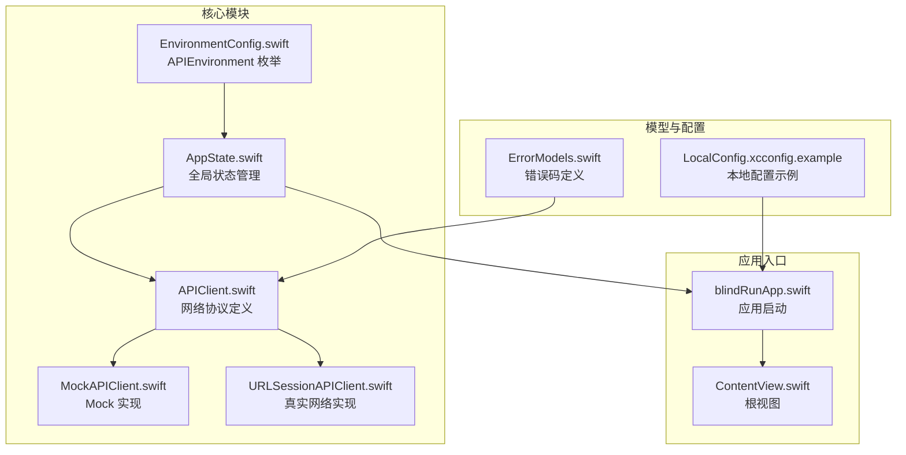
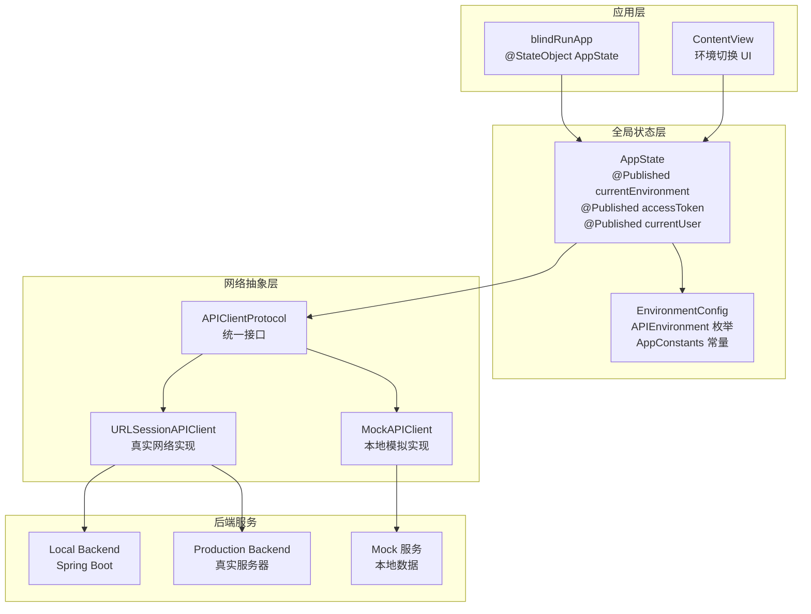
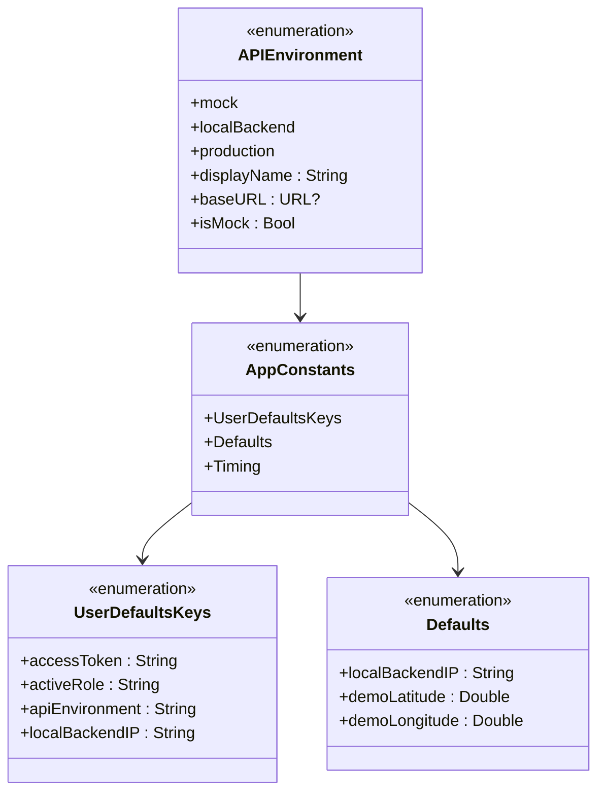
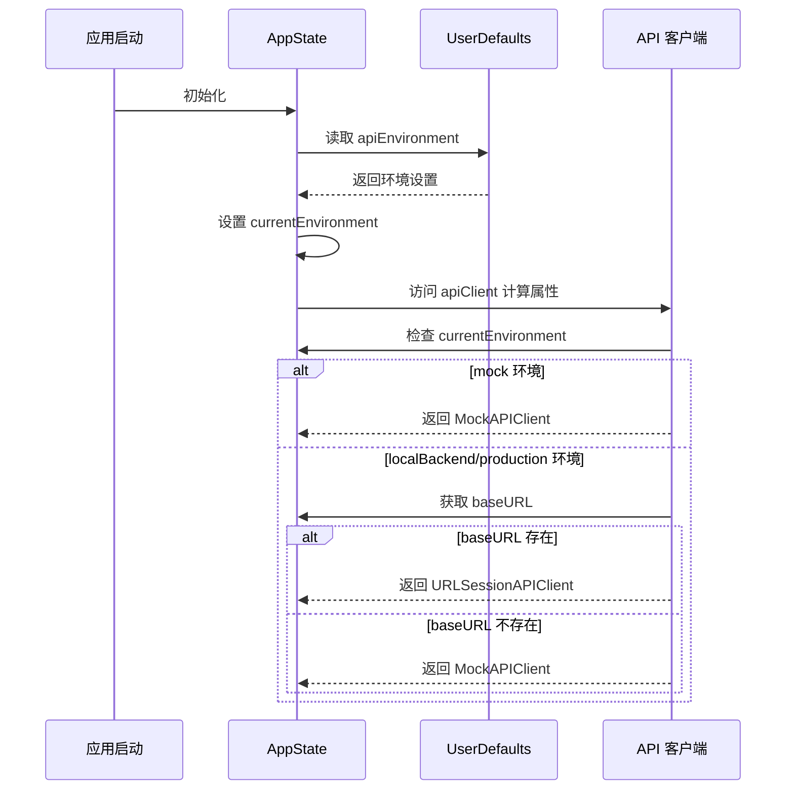
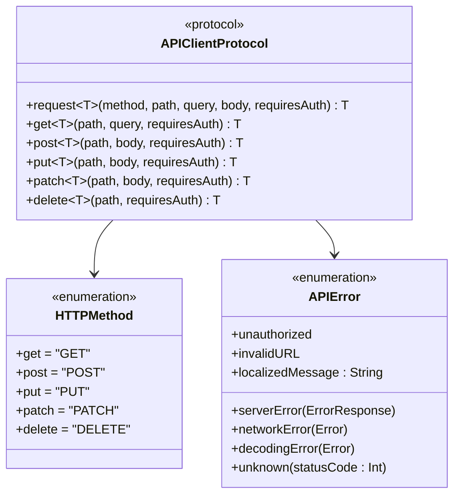
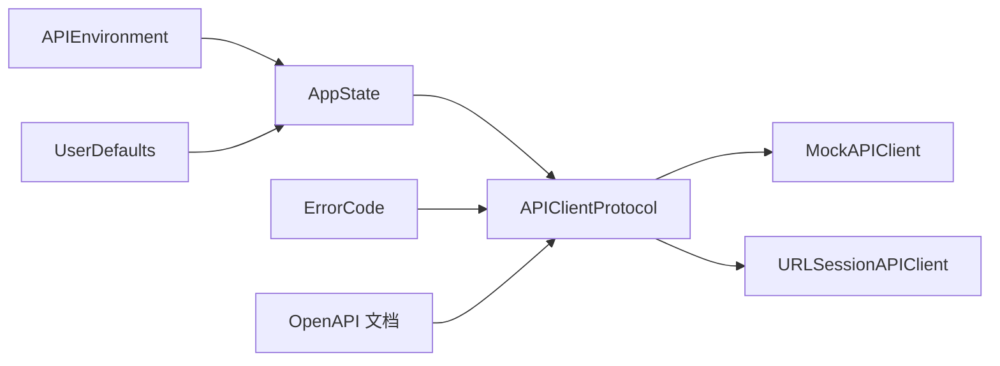

# API 环境配置

<cite>
**本文引用的文件**
- [EnvironmentConfig.swift](file://blindRun/Core/EnvironmentConfig.swift)
- [AppState.swift](file://blindRun/Core/AppState.swift)
- [APIClient.swift](file://blindRun/Core/APIClient.swift)
- [MockAPIClient.swift](file://blindRun/Core/MockAPIClient.swift)
- [blindRunApp.swift](file://blindRun/blindRunApp.swift)
- [ContentView.swift](file://blindRun/ContentView.swift)
- [ErrorModels.swift](file://blindRun/Core/Models/ErrorModels.swift)
- [08-ios-architecture.md](file://docs/08-ios-architecture.md)
- [07-api-contract.openapi.yaml](file://docs/07-api-contract.openapi.yaml)
- [LocalConfig.xcconfig.example](file://LocalConfig.xcconfig.example)
</cite>

## 更新摘要
**变更内容**
- 更新了完整的环境配置管理系统实现，包括APIEnvironment枚举和环境切换机制
- 新增了AppState类的环境管理功能和API客户端动态切换
- 增强了MockAPIClient和URLSessionAPIClient的实现细节
- 完善了错误码处理和本地配置管理的安全性考虑
- 更新了生产部署前的配置迁移指南

## 目录
1. [简介](#简介)
2. [项目结构](#项目结构)
3. [核心组件](#核心组件)
4. [架构总览](#架构总览)
5. [详细组件分析](#详细组件分析)
6. [依赖关系分析](#依赖关系分析)
7. [性能考量](#性能考量)
8. [故障排查指南](#故障排查指南)
9. [结论](#结论)
10. [附录](#附录)

## 简介
本文件详细介绍了 blindRun 应用的 API 环境配置系统，基于完整的 Swift 实现展示了多环境支持的设计与实现。文档涵盖了 mock、localBackend、production 三种环境的配置与切换机制，深入解释了 APIClient 协议的设计思想，以及如何通过统一接口实现 Mock 与真实环境的无缝切换。同时，文档详细描述了环境配置的存储方式、加载时机与安全性考量，提供了调试方法与最佳实践，并给出了生产部署前的配置迁移指南。

**更新** 本版本反映了完整的环境配置管理系统实现，包括APIEnvironment枚举、AppState类的环境管理、MockAPIClient和URLSessionAPIClient的具体实现。

## 项目结构
blindRun 为 SwiftUI 应用，API 环境配置系统位于 Core 模块中，通过 EnvironmentConfig.swift 定义环境常量，通过 AppState.swift 管理全局状态，通过 APIClient.swift 定义网络协议，通过 MockAPIClient.swift 和 URLSessionAPIClient.swift 实现具体客户端。

**图表来源**
- [EnvironmentConfig.swift:1-65](file://blindRun/Core/EnvironmentConfig.swift#L1-L65)
- [AppState.swift:1-123](file://blindRun/Core/AppState.swift#L1-L123)
- [APIClient.swift:1-179](file://blindRun/Core/APIClient.swift#L1-L179)
- [MockAPIClient.swift:1-65](file://blindRun/Core/MockAPIClient.swift#L1-L65)
- [URLSessionAPIClient.swift:1-179](file://blindRun/Core/URLSessionAPIClient.swift#L1-L179)

**章节来源**
- [EnvironmentConfig.swift:1-65](file://blindRun/Core/EnvironmentConfig.swift#L1-L65)
- [AppState.swift:1-123](file://blindRun/Core/AppState.swift#L1-L123)
- [APIClient.swift:1-179](file://blindRun/Core/APIClient.swift#L1-L179)
- [MockAPIClient.swift:1-65](file://blindRun/Core/MockAPIClient.swift#L1-L65)
- [URLSessionAPIClient.swift:1-179](file://blindRun/Core/URLSessionAPIClient.swift#L1-L179)

## 核心组件
- **APIEnvironment 枚举**
  - 定义三类环境：mock、localBackend、production
  - 每个环境包含基础 URL 与显示名称
  - 支持 isMock 属性判断是否为模拟环境
  - localBackend 支持通过 UserDefaults 配置局域网 IP 地址
- **AppState 全局状态管理**
  - 管理用户会话、JWT 令牌和当前环境
  - 提供 apiClient 计算属性，根据环境动态返回对应客户端
  - 实现环境持久化到 UserDefaults
  - 管理用户登录状态和角色切换
- **APIClient 协议**
  - 统一的网络请求接口定义
  - 支持异步请求和错误处理
  - 提供便捷的 HTTP 方法包装
  - 定义错误类型和本地化消息
- **MockAPIClient 实现**
  - 返回预定义的测试数据
  - 模拟网络延迟（0.3秒）
  - 支持基本的认证和用户信息路由
- **URLSessionAPIClient 实现**
  - 基于 URLSession 的真实网络请求
  - 自动处理鉴权头和 JSON 编解码
  - 统一的错误处理和状态码处理

**更新** 新增了完整的实现细节，包括具体的类结构和方法定义。

**章节来源**
- [EnvironmentConfig.swift:5-39](file://blindRun/Core/EnvironmentConfig.swift#L5-L39)
- [AppState.swift:9-123](file://blindRun/Core/AppState.swift#L9-L123)
- [APIClient.swift:46-95](file://blindRun/Core/APIClient.swift#L46-L95)
- [MockAPIClient.swift:5-65](file://blindRun/Core/MockAPIClient.swift#L5-L65)
- [URLSessionAPIClient.swift:99-179](file://blindRun/Core/URLSessionAPIClient.swift#L99-L179)

## 架构总览
下图展示了 API 环境配置系统在应用中的完整架构。AppState 作为全局状态中心，根据当前环境动态选择合适的 API 客户端实现，实现了 Mock 与真实环境的无缝切换。

**图表来源**
- [AppState.swift:40-54](file://blindRun/Core/AppState.swift#L40-L54)
- [EnvironmentConfig.swift:5-39](file://blindRun/Core/EnvironmentConfig.swift#L5-L39)
- [APIClient.swift:46-54](file://blindRun/Core/APIClient.swift#L46-L54)
- [MockAPIClient.swift:5-19](file://blindRun/Core/MockAPIClient.swift#L5-L19)
- [URLSessionAPIClient.swift:99-118](file://blindRun/Core/URLSessionAPIClient.swift#L99-L118)

## 详细组件分析

### APIEnvironment 枚举与环境配置
- **设计特点**
  - 使用 String 原始值实现序列化和持久化
  - 通过 CaseIterable 支持遍历所有环境选项
  - 提供 displayName 属性用于用户界面显示
  - 通过 baseURL 属性动态生成环境对应的服务器地址
- **环境定义**
  - **mock**: 返回 nil，表示不使用网络请求
  - **localBackend**: 支持通过 UserDefaults 配置的局域网 IP 地址，默认 192.168.1.100
  - **production**: 占位符 URL，部署前需要替换为实际域名
- **配置管理**
  - 通过 AppConstants.UserDefaultsKeys.apiEnvironment 存储当前环境
  - 通过 AppConstants.Defaults.localBackendIP 设置默认 IP 地址

**图表来源**
- [EnvironmentConfig.swift:5-39](file://blindRun/Core/EnvironmentConfig.swift#L5-L39)
- [EnvironmentConfig.swift:43-64](file://blindRun/Core/EnvironmentConfig.swift#L43-L64)

**章节来源**
- [EnvironmentConfig.swift:5-39](file://blindRun/Core/EnvironmentConfig.swift#L5-L39)
- [EnvironmentConfig.swift:43-64](file://blindRun/Core/EnvironmentConfig.swift#L43-L64)

### AppState 全局状态管理与环境切换
- **状态管理**
  - @Published 属性实现响应式状态更新
  - 自动持久化到 UserDefaults，确保应用重启后状态保持
  - 提供 isLoggedIn 计算属性简化登录状态判断
- **API 客户端动态切换**
  - apiClient 计算属性根据 currentEnvironment 返回对应实现
  - mock 环境返回 MockAPIClient 实例
  - localBackend 和 production 环境返回 URLSessionAPIClient 实例
  - baseURL 为空时回退到 MockAPIClient
- **初始化与恢复**
  - 应用启动时从 UserDefaults 恢复环境设置
  - 如果没有保存的环境设置，默认使用 mock 环境
  - 支持会话恢复和用户状态管理

**图表来源**
- [AppState.swift:58-66](file://blindRun/Core/AppState.swift#L58-L66)
- [AppState.swift:40-54](file://blindRun/Core/AppState.swift#L40-L54)

**章节来源**
- [AppState.swift:9-123](file://blindRun/Core/AppState.swift#L9-L123)

### APIClient 协议设计与实现
- **协议定义**
  - 统一的 request 方法定义，支持 HTTP 方法、路径、查询参数、请求体和鉴权需求
  - 提供便捷的 HTTP 方法包装（get、post、put、patch、delete）
  - 定义完整的错误类型体系，包括服务器错误、网络错误、解码错误等
- **错误处理机制**
  - APIError 枚举提供详细的错误分类
  - 每种错误类型都有对应的本地化消息
  - 支持将后端错误码映射为用户友好的提示
- **扩展方法**
  - 通过协议扩展提供常用 HTTP 方法的便捷调用
  - 统一的参数处理和默认值设置

**图表来源**
- [APIClient.swift:46-95](file://blindRun/Core/APIClient.swift#L46-L95)
- [APIClient.swift:15-42](file://blindRun/Core/APIClient.swift#L15-L42)
- [APIClient.swift:5-11](file://blindRun/Core/APIClient.swift#L5-L11)

**章节来源**
- [APIClient.swift:46-95](file://blindRun/Core/APIClient.swift#L46-L95)
- [APIClient.swift:15-42](file://blindRun/Core/APIClient.swift#L15-L42)
- [APIClient.swift:5-11](file://blindRun/Core/APIClient.swift#L5-L11)

### MockAPIClient 实现与测试支持
- **模拟数据设计**
  - 返回预定义的测试数据，支持基本的认证和用户信息场景
  - 模拟网络延迟（0.3秒）提供更真实的用户体验
  - 支持 /auth/login 和 /users/me 路径的基本路由
- **测试友好特性**
  - 固定的 JWT 令牌用于测试场景
  - 标准化的用户数据结构
  - 易于扩展的路由系统
- **实现细节**
  - 使用 JSONEncoder/JSONDecoder 进行数据编解码
  - 支持泛型类型 T 的自动解码
  - 异步实现确保主线程不阻塞

**章节来源**
- [MockAPIClient.swift:5-65](file://blindRun/Core/MockAPIClient.swift#L5-L65)

### URLSessionAPIClient 实现与真实网络集成
- **网络请求构建**
  - 基于 URLSession 的异步网络请求
  - 自动处理 URL 组件构建和查询参数编码
  - 支持自定义 HTTP 头部和请求体
- **鉴权与安全**
  - 通过 tokenProvider 闭包获取访问令牌
  - 自动添加 Authorization: Bearer 头部
  - 支持可选的鉴权需求
- **错误处理与状态码**
  - 统一的状态码处理（2xx 成功、401 未授权等）
  - 详细的错误类型分类
  - 支持自定义错误响应解码

**章节来源**
- [URLSessionAPIClient.swift:99-179](file://blindRun/Core/URLSessionAPIClient.swift#L99-L179)

### 错误码处理与本地化
- **错误码定义**
  - ErrorCode 枚举定义所有支持的后端错误码
  - 每个错误码都有对应的中文本地化消息
  - 支持 TTS 消息输出
- **错误响应结构**
  - ErrorResponse 结构体定义统一的错误响应格式
  - code 字段对应 ErrorCode 原始值
  - message 字段提供人类可读的错误描述
- **映射机制**
  - APIError.serverError 将后端错误映射为本地化消息
  - 支持动态的错误码查找和转换

**章节来源**
- [ErrorModels.swift:5-57](file://blindRun/Core/Models/ErrorModels.swift#L5-L57)

### 环境配置存储与加载时机
- **存储位置**
  - 环境设置：UserDefaults.standard.string(forKey: "com.aidrun.mvp.apiEnvironment")
  - JWT 令牌：UserDefaults.standard.string(forKey: "com.aidrun.mvp.accessToken")
  - 用户角色：UserDefaults.standard.string(forKey: "com.aidrun.mvp.activeRole")
  - 本地后端 IP：UserDefaults.standard.string(forKey: "com.aidrun.mvp.localBackendIP")
- **加载时机**
  - 应用启动时：AppState.init() 中从 UserDefaults 恢复环境设置
  - 会话恢复：restoreSession() 方法恢复用户登录状态
  - 环境切换：currentEnvironment 属性变化时自动持久化
- **安全性考虑**
  - MVP 阶段使用 UserDefaults 存储令牌，正式发布前必须迁移到 Keychain
  - 本地配置文件（LocalConfig.xcconfig）不纳入版本控制
  - 所有环境 URL 在生产环境前必须替换为实际域名

**章节来源**
- [EnvironmentConfig.swift:44-49](file://blindRun/Core/EnvironmentConfig.swift#L44-L49)
- [AppState.swift:58-66](file://blindRun/Core/AppState.swift#L58-L66)
- [AppState.swift:119-121](file://blindRun/Core/AppState.swift#L119-L121)

### 生产部署前的配置迁移指南
- **令牌存储迁移**
  - 将 UserDefaults 中的 JWT 迁移至 Keychain，确保更安全的本地存储
  - 在迁移前后提供兼容逻辑，保证用户会话连续性
  - 实现 tokenProvider 闭包的安全访问
- **环境 URL 配置**
  - production 环境的 URL 在 MVP 阶段可为占位符，部署前替换为实际域名
  - 确保 DNS 与证书配置正确，避免 TLS 握手失败
  - 配置 CI/CD 流水线中的环境变量注入
- **配置注入与打包**
  - 通过构建配置（Build Settings）或运行时注入方式传入生产环境 URL
  - 在 CI/CD 流水线中区分构建类型（Debug/Release），确保 Debug 不暴露敏感配置
  - 使用 LocalConfig.xcconfig 管理高德地图 API Key 等敏感配置
- **后端契约验证**
  - 使用 OpenAPI 文档校验生产后端的端点与错误码一致性
  - 通过自动化测试覆盖关键流程，确保环境切换不影响业务逻辑
- **监控与日志**
  - 实现环境切换的日志记录
  - 添加网络请求的监控指标
  - 建立错误报告和崩溃收集机制

**章节来源**
- [LocalConfig.xcconfig.example:1-19](file://LocalConfig.xcconfig.example#L1-L19)
- [08-ios-architecture.md:78-83](file://docs/08-ios-architecture.md#L78-L83)

## 依赖关系分析
- **组件耦合**
  - APIClientProtocol 与具体实现解耦，通过协议实现多态
  - AppState 与 APIEnvironment 解耦，通过枚举值传递配置
  - MockAPIClient 与 URLSessionAPIClient 共享同一协议接口
  - 错误处理与业务逻辑分离，通过统一的错误码映射机制
- **外部依赖**
  - URLSession 作为底层网络传输
  - UserDefaults 作为轻量级持久化存储
  - OpenAPI 文档作为后端契约，指导前端实现与测试
  - SwiftUI 作为 UI 框架，支持响应式状态管理
- **潜在风险**
  - 环境切换未持久化或持久化失败会导致请求指向错误后端
  - 令牌未加密存储可能在设备丢失时带来安全风险
  - 错误码映射不一致可能导致用户体验问题
  - Mock 数据与真实后端数据结构不一致

**图表来源**
- [EnvironmentConfig.swift:5-39](file://blindRun/Core/EnvironmentConfig.swift#L5-L39)
- [AppState.swift:40-54](file://blindRun/Core/AppState.swift#L40-L54)
- [APIClient.swift:46-54](file://blindRun/Core/APIClient.swift#L46-L54)
- [ErrorModels.swift:5-45](file://blindRun/Core/Models/ErrorModels.swift#L5-L45)

**章节来源**
- [EnvironmentConfig.swift:5-39](file://blindRun/Core/EnvironmentConfig.swift#L5-L39)
- [AppState.swift:40-54](file://blindRun/Core/AppState.swift#L40-L54)
- [APIClient.swift:46-54](file://blindRun/Core/APIClient.swift#L46-L54)
- [ErrorModels.swift:5-45](file://blindRun/Core/Models/ErrorModels.swift#L5-L45)

## 性能考量
- **请求构建与鉴权**
  - 统一的 URLRequest 构建与鉴权头注入减少重复代码，提升可维护性
  - MockAPIClient 的固定延迟模拟真实网络延迟，提供更好的用户体验
- **错误处理与重试**
  - 简化重试策略，避免在网络不稳定时引入复杂队列
  - 统一的错误处理机制减少异常分支的复杂度
- **内存管理**
  - 使用弱引用避免循环引用（tokenProvider 闭包）
  - 泛型约束确保类型安全和编译时检查
- **模块化优化**
  - 前后端模块划分清晰，便于独立开发和测试
  - 错误码处理集中化，减少重复逻辑
  - 环境配置独立管理，便于扩展和维护

## 故障排查指南
- **环境切换无效**
  - 检查 UserDefaults 中的 apiEnvironment 键值是否正确
  - 确认 AppState.currentEnvironment 属性是否正确更新
  - 验证 APIEnvironment.allCases 是否包含期望的环境选项
- **请求失败或返回错误**
  - 核对当前环境的 baseURL 是否正确生成
  - 检查令牌是否过期或未注入
  - 验证错误码映射是否正确
  - 查看 URLSession 的网络请求日志
- **Mock 数据不正确**
  - 确认 MockAPIClient.mockResponse 方法中的路由逻辑
  - 检查 JSON 数据结构是否与后端契约一致
  - 验证泛型类型 T 的解码过程
- **本地联调问题**
  - 确认 localBackend 的局域网 IP 与后端监听地址一致
  - 检查防火墙与网络权限设置
  - 验证端口 8080 是否被占用
- **令牌存储问题**
  - 检查 UserDefaults 中的 accessToken 键值
  - 确认 tokenProvider 闭包是否正确返回令牌
  - 验证 Keychain 迁移的兼容性逻辑

**章节来源**
- [AppState.swift:58-66](file://blindRun/Core/AppState.swift#L58-L66)
- [EnvironmentConfig.swift:27-29](file://blindRun/Core/EnvironmentConfig.swift#L27-L29)
- [MockAPIClient.swift:23-59](file://blindRun/Core/MockAPIClient.swift#L23-L59)

## 结论
blindRun 的 API 环境配置系统以完整的 Swift 实现为基础，通过 APIEnvironment 枚举、AppState 全局状态管理和统一的 APIClient 协议，实现了 mock、localBackend 与 production 三种环境的灵活切换。系统设计充分考虑了开发效率、测试友好性和生产安全性，为后续的功能扩展和维护奠定了坚实基础。

**更新** 结论部分强调了完整实现的重要性和系统设计的优势。

建议在生产部署前完成令牌存储的安全迁移与环境 URL 的最终配置，并持续以 OpenAPI 文档为依据保障契约一致性。同时，确保 Mock 数据与真实后端的数据结构保持同步，为用户提供一致的体验。

## 附录
- **相关文档与配置**
  - iOS 架构与 API 环境说明
  - OpenAPI 合同与服务器示例
  - 项目规范配置
  - AGENTS.md 技术约束与规则
- **开发工具与资源**
  - LocalConfig.xcconfig.example 本地配置示例
  - Mock 数据路由扩展指南
  - 环境切换调试技巧
  - 生产部署检查清单

**章节来源**
- [08-ios-architecture.md:1-165](file://docs/08-ios-architecture.md#L1-L165)
- [07-api-contract.openapi.yaml:1-200](file://docs/07-api-contract.openapi.yaml#L1-L200)
- [LocalConfig.xcconfig.example:1-19](file://LocalConfig.xcconfig.example#L1-L19)