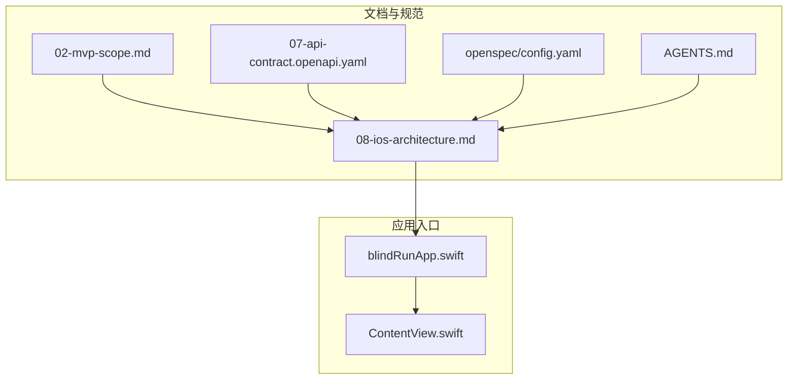
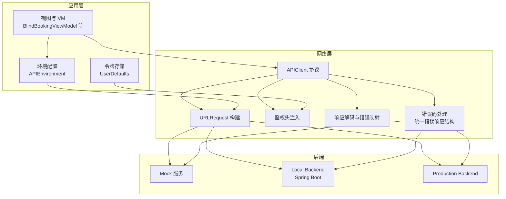
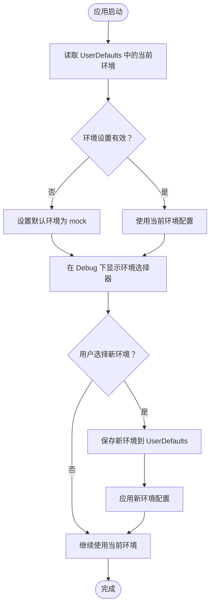
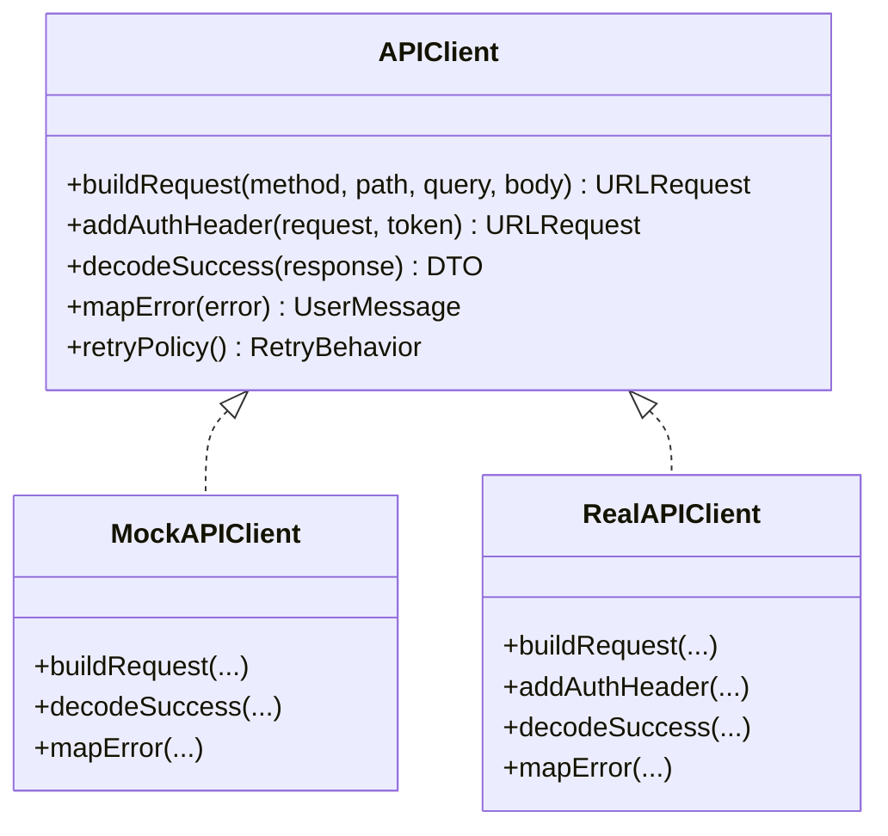
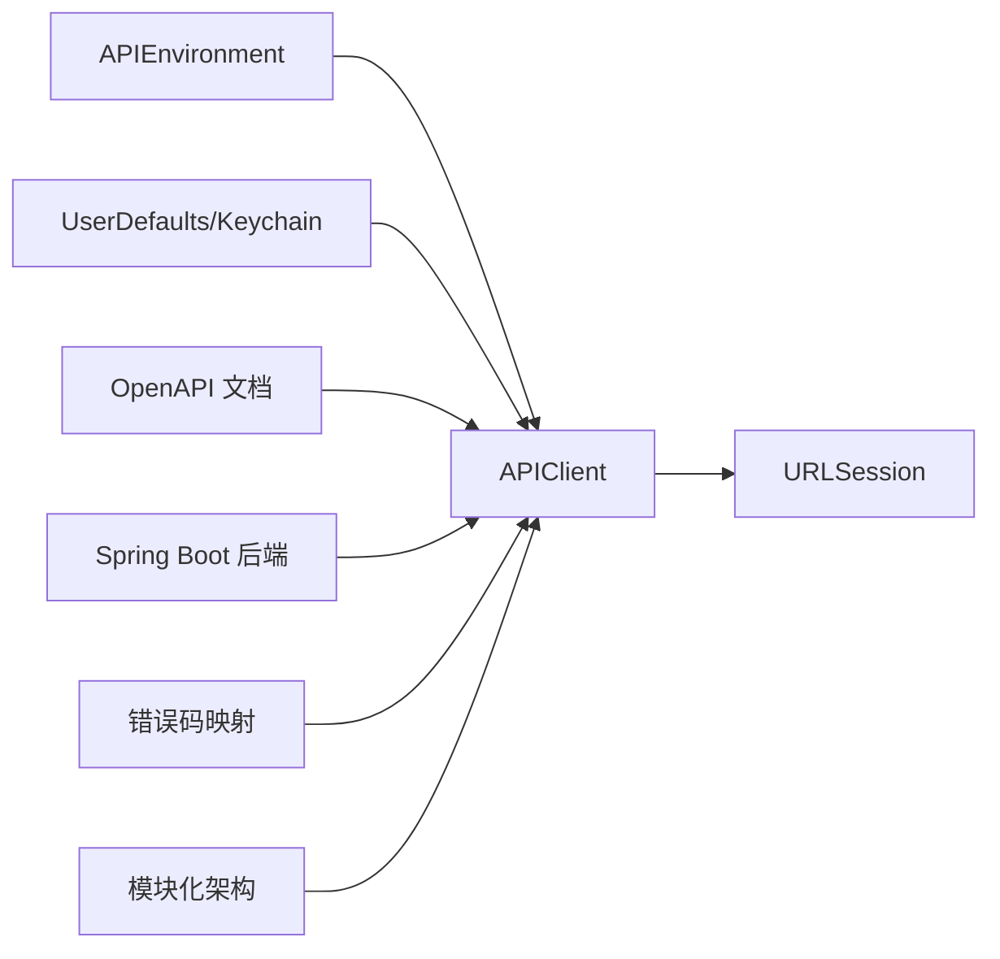

# API 环境配置

<cite>
**本文引用的文件**
- [blindRunApp.swift](file://blindRun/blindRunApp.swift)
- [ContentView.swift](file://blindRun/ContentView.swift)
- [08-ios-architecture.md](file://docs/08-ios-architecture.md)
- [02-mvp-scope.md](file://docs/02-mvp-scope.md)
- [07-api-contract.openapi.yaml](file://docs/07-api-contract.openapi.yaml)
- [config.yaml](file://openspec/config.yaml)
- [AGENTS.md](file://AGENTS.md)
</cite>

## 更新摘要
**变更内容**
- 更新了后端规则和错误码约束，反映AGENTS.md中的技术要求
- 新增了详细的错误码映射表和处理机制
- 更新了iOS模块划分和后端模块组织结构
- 增强了环境配置的安全性和生产部署指南

## 目录
1. [简介](#简介)
2. [项目结构](#项目结构)
3. [核心组件](#核心组件)
4. [架构总览](#架构总览)
5. [详细组件分析](#详细组件分析)
6. [依赖关系分析](#依赖关系分析)
7. [性能考量](#性能考量)
8. [故障排查指南](#故障排查指南)
9. [结论](#结论)
10. [附录](#附录)

## 简介
本文件面向 blindRun 应用的 API 环境配置，围绕多环境设计与实现展开，明确 mock、localBackend、production 三类环境的配置与切换机制，阐述 APIClient 协议的设计思想与统一接口如何实现 Mock 与真实环境的无缝切换。同时，文档覆盖环境配置的存储方式、加载时机与安全性考量，提供调试方法与最佳实践，并给出生产部署前的配置迁移指南。

**更新** 本版本反映了AGENTS.md中关于后端规则、错误码和模块划分的新技术约束，增强了错误码处理和模块化架构的详细说明。

## 项目结构
blindRun 为 SwiftUI 应用，当前仓库中与 API 环境配置直接相关的文件主要集中在文档与示例配置中。应用入口文件负责启动界面，而网络层与环境配置的实现细节在文档中已有明确指导。

**图表来源**
- [blindRunApp.swift:1-18](file://blindRun/blindRunApp.swift#L1-L18)
- [ContentView.swift:1-25](file://blindRun/ContentView.swift#L1-L25)
- [08-ios-architecture.md:1-165](file://docs/08-ios-architecture.md#L1-L165)
- [02-mvp-scope.md:1-216](file://docs/02-mvp-scope.md#L1-L216)
- [07-api-contract.openapi.yaml:1-800](file://docs/07-api-contract.openapi.yaml#L1-L800)
- [config.yaml:1-21](file://openspec/config.yaml#L1-L21)
- [AGENTS.md:1-443](file://AGENTS.md#L1-L443)

**章节来源**
- [blindRunApp.swift:1-18](file://blindRun/blindRunApp.swift#L1-L18)
- [ContentView.swift:1-25](file://blindRun/ContentView.swift#L1-L25)
- [08-ios-architecture.md:1-165](file://docs/08-ios-architecture.md#L1-L165)
- [02-mvp-scope.md:1-216](file://docs/02-mvp-scope.md#L1-L216)
- [07-api-contract.openapi.yaml:1-800](file://docs/07-api-contract.openapi.yaml#L1-L800)
- [config.yaml:1-21](file://openspec/config.yaml#L1-L21)
- [AGENTS.md:1-443](file://AGENTS.md#L1-L443)

## 核心组件
- API 环境枚举与基础配置
  - 三类环境：mock、localBackend、production
  - 每个环境包含基础 URL 与显示名称
  - localBackend 支持局域网 IP（如 192.168.x.x:8080），便于开发者在 Mac 上运行后端并通过局域网联调
- APIClient 协议
  - 统一请求构建（方法、路径、查询参数、JSON Body）
  - 统一鉴权头注入（受保护端点附加 Bearer Token）
  - 统一响应解码（成功 DTO 与错误封装）
  - 错误码映射至用户提示与 TTS 提示
  - 简化重试策略，避免引入复杂离线队列
- 令牌持久化
  - MVP 使用 UserDefaults 存取 JWT 与当前环境设置
  - 正式发布前需迁移到 Keychain
- 后端模块化架构
  - 后端采用 Spring Boot + REST 架构
  - 前端模块划分：Core、Auth、Role、BlindRunner、Volunteer、Orders、Map、Voice、Safety、Profile
  - 后端模块划分：auth、user、profile、order、location、safety、volunteer

**更新** 新增了后端模块化架构和前端模块划分的详细说明，以及基于AGENTS.md的错误码处理要求。

**章节来源**
- [08-ios-architecture.md:50-82](file://docs/08-ios-architecture.md#L50-L82)
- [02-mvp-scope.md:119-153](file://docs/02-mvp-scope.md#L119-L153)
- [AGENTS.md:200-222](file://AGENTS.md#L200-L222)
- [AGENTS.md:240-252](file://AGENTS.md#L240-L252)

## 架构总览
下图展示了 API 环境配置在应用中的位置与交互关系。应用通过统一的 APIClient 协议发起网络请求，请求目标由当前激活的 API 环境决定；令牌与环境设置存储于 UserDefaults，Debug 构建下提供环境切换入口。

**图表来源**
- [08-ios-architecture.md:50-82](file://docs/08-ios-architecture.md#L50-L82)
- [02-mvp-scope.md:119-153](file://docs/02-mvp-scope.md#L119-L153)
- [AGENTS.md:182-222](file://AGENTS.md#L182-L222)

## 详细组件分析

### API 环境枚举与切换机制
- 设计要点
  - 以枚举形式定义三类环境，每项包含基础 URL 与显示名称
  - 在 Debug 构建中暴露小的环境选择器，便于在设置或启动配置中切换
  - localBackend 的 URL 示例覆盖常见局域网地址格式，确保开发者在不同网络环境下可用
- 切换流程
  - 应用启动时读取 UserDefaults 中的当前环境设置
  - Debug 下允许用户在设置页或启动配置中修改环境
  - 修改后立即生效，后续所有网络请求均基于新环境的 baseURL

**图表来源**
- [08-ios-architecture.md:50-66](file://docs/08-ios-architecture.md#L50-L66)
- [02-mvp-scope.md:136-153](file://docs/02-mvp-scope.md#L136-L153)

**章节来源**
- [08-ios-architecture.md:50-66](file://docs/08-ios-architecture.md#L50-L66)
- [02-mvp-scope.md:136-153](file://docs/02-mvp-scope.md#L136-L153)

### APIClient 协议设计与实现
- 协议职责
  - 构建 URLRequest（方法、路径、查询、JSON Body）
  - 对受保护端点附加 Authorization: Bearer <accessToken>
  - 解码成功 DTO 与错误封装
  - 将后端错误码映射为用户提示与 TTS 提示
  - 保持重试行为简单，避免复杂离线队列
- 统一接口的优势
  - Mock 与真实实现共享同一调用站点，便于替换
  - 降低耦合，提升可测试性与可维护性
- 令牌持久化
  - MVP 使用 UserDefaults 存取 JWT 与当前环境设置
  - 正式发布前需迁移到 Keychain，增强安全性

**图表来源**
- [08-ios-architecture.md:68-82](file://docs/08-ios-architecture.md#L68-L82)
- [02-mvp-scope.md:119-127](file://docs/02-mvp-scope.md#L119-L127)

**章节来源**
- [08-ios-architecture.md:68-82](file://docs/08-ios-architecture.md#L68-L82)
- [02-mvp-scope.md:119-127](file://docs/02-mvp-scope.md#L119-L127)

### 错误码处理与映射机制
- 统一错误响应结构
  - 后端使用统一的 ErrorResponse 结构体
  - 包含 code 和 message 字段
  - 支持所有预定义的错误码
- 错误码映射表
  - INVALID_VERIFICATION_CODE: 验证码错误
  - PROFILE_INCOMPLETE: 资料不完整
  - LOCATION_PERMISSION_REQUIRED: 需要定位权限
  - ORDER_NOT_FOUND: 订单不存在
  - ORDER_ALREADY_ACCEPTED: 订单已被其他志愿者接单
  - INVALID_ORDER_STATUS: 订单状态不允许当前操作
  - ACTIVE_ORDER_ROLE_SWITCH_BLOCKED: 存在活跃订单，禁止切换角色
  - VOLUNTEER_NOT_AVAILABLE: 请先开启可服务状态
  - VOLUNTEER_NOT_APPROVED: 请先完成志愿者认证
  - APPOINTMENT_TOO_SOON: 预约时间至少需要在 30 分钟后
  - UNAUTHORIZED: 请先登录
- 错误处理策略
  - 将后端错误码映射为用户友好的提示
  - 结合 TTS 提供语音反馈
  - 区分可恢复错误和不可恢复错误

**更新** 新增了详细的错误码处理机制，基于AGENTS.md和OpenAPI文档的要求。

**章节来源**
- [07-api-contract.openapi.yaml:543-567](file://docs/07-api-contract.openapi.yaml#L543-L567)
- [07-api-contract.openapi.yaml:469-542](file://docs/07-api-contract.openapi.yaml#L469-L542)
- [AGENTS.md:210-222](file://AGENTS.md#L210-L222)

### 环境配置存储与加载时机
- 存储位置
  - 环境设置与 JWT 令牌：UserDefaults
  - 高德地图密钥：LocalConfig.xcconfig 或本地 plist（加入 .gitignore，示例文件提供密钥清单）
- 加载时机
  - 应用启动时读取 UserDefaults 中的环境设置
  - Debug 构建下在设置页或启动配置中允许用户修改
  - 修改后立即保存并应用新配置
- 安全性考虑
  - MVP 使用 UserDefaults 存储令牌，正式发布前必须迁移到 Keychain
  - 本地配置文件（如 LocalConfig.xcconfig）不纳入版本控制，避免泄露敏感信息
  - 所有环境 URL 在生产环境前必须替换为实际域名

**更新** 强调了生产环境URL的安全性和最终配置要求。

**章节来源**
- [08-ios-architecture.md:78-82](file://docs/08-ios-architecture.md#L78-L82)
- [02-mvp-scope.md:146-150](file://docs/02-mvp-scope.md#L146-L150)
- [AGENTS.md:233-238](file://AGENTS.md#L233-L238)

### 生产部署前的配置迁移指南
- 令牌存储迁移
  - 将 UserDefaults 中的 JWT 迁移至 Keychain，确保更安全的本地存储
  - 在迁移前后提供兼容逻辑，保证用户会话连续性
- 环境 URL 占位符清理
  - production 环境的 URL 在 MVP 阶段可为占位符，部署前替换为实际域名
  - 确保 DNS 与证书配置正确，避免 TLS 握手失败
- 配置注入与打包
  - 通过构建配置（Build Settings）或运行时注入方式传入生产环境 URL
  - 在 CI/CD 流水线中区分构建类型（Debug/Release），确保 Debug 不暴露敏感配置
- 后端契约验证
  - 使用 OpenAPI 文档校验生产后端的端点与错误码一致性
  - 通过自动化测试覆盖关键流程，确保环境切换不影响业务逻辑
- 模块化架构验证
  - 确保前端模块划分符合 AGENTS.md 要求
  - 验证后端模块边界和职责分离
  - 检查错误码处理的一致性

**更新** 新增了模块化架构验证和错误码处理验证的要求。

**章节来源**
- [08-ios-architecture.md:78-82](file://docs/08-ios-architecture.md#L78-L82)
- [07-api-contract.openapi.yaml:1-800](file://docs/07-api-contract.openapi.yaml#L1-L800)
- [AGENTS.md:200-252](file://AGENTS.md#L200-L252)

## 依赖关系分析
- 组件耦合
  - APIClient 与 APIEnvironment 解耦，通过协议与配置对象传递依赖
  - 令牌存储与网络层分离，便于替换实现（Mock/Keychain）
  - 错误处理与业务逻辑分离，通过统一的错误码映射机制
- 外部依赖
  - URLSession 作为底层网络传输
  - OpenAPI 文档作为后端契约，指导前端实现与测试
  - Spring Boot 后端提供 REST API 服务
- 潜在风险
  - 环境切换未持久化或持久化失败会导致请求指向错误后端
  - 令牌未加密存储可能在设备丢失时带来安全风险
  - 错误码映射不一致可能导致用户体验问题

**图表来源**
- [08-ios-architecture.md:50-82](file://docs/08-ios-architecture.md#L50-L82)
- [07-api-contract.openapi.yaml:1-800](file://docs/07-api-contract.openapi.yaml#L1-L800)
- [AGENTS.md:182-252](file://AGENTS.md#L182-L252)

**章节来源**
- [08-ios-architecture.md:50-82](file://docs/08-ios-architecture.md#L50-L82)
- [07-api-contract.openapi.yaml:1-800](file://docs/07-api-contract.openapi.yaml#L1-L800)
- [AGENTS.md:182-252](file://AGENTS.md#L182-L252)

## 性能考量
- 请求构建与鉴权
  - 统一的 URLRequest 构建与鉴权头注入减少重复代码，提升可维护性
- 错误处理与重试
  - 简化重试策略，避免在网络不稳定时引入复杂队列
- 轮询与状态更新
  - 订单状态轮询间隔与停止条件已在文档中明确，有助于控制网络开销
- 模块化优化
  - 前后端模块划分清晰，便于独立开发和测试
  - 错误码处理集中化，减少重复逻辑

**更新** 新增了模块化优化的性能考量。

## 故障排查指南
- 环境切换无效
  - 检查 UserDefaults 中的环境设置是否被正确读取与保存
  - 确认 Debug 下的环境选择器是否启用
- 请求失败或返回错误
  - 核对当前环境的 baseURL 是否正确
  - 检查令牌是否过期或未注入
  - 验证错误码映射是否正确
- 本地联调问题
  - 确认 localBackend 的局域网 IP 与后端监听地址一致
  - 检查防火墙与网络权限设置
- 模块化问题
  - 验证前端模块划分是否符合架构要求
  - 检查后端模块边界和职责分离
  - 确认错误码处理的一致性

**更新** 新增了模块化问题和错误码处理问题的排查指南。

**章节来源**
- [08-ios-architecture.md:50-82](file://docs/08-ios-architecture.md#L50-L82)
- [02-mvp-scope.md:136-153](file://docs/02-mvp-scope.md#L136-L153)
- [AGENTS.md:200-252](file://AGENTS.md#L200-L252)

## 结论
blindRun 的 API 环境配置以清晰的三环境模型与统一的 APIClient 协议为核心，实现了 Mock、localBackend 与 production 的灵活切换。通过 UserDefaults 存储环境与令牌，结合 Debug 下的环境选择器，开发者能够在不同阶段高效联调。基于 AGENTS.md 的技术约束，系统还提供了完善的错误码处理机制和模块化架构支持。

**更新** 结论部分强调了新引入的错误码处理和模块化架构的重要性。

建议在生产部署前完成令牌存储的安全迁移与环境 URL 的最终配置，并持续以 OpenAPI 文档为依据保障契约一致性。同时，确保模块化架构和错误码处理机制符合 AGENTS.md 的技术要求。

## 附录
- 相关文档与配置
  - iOS 架构与 API 环境说明
  - MVP 范围与技术栈决策
  - OpenAPI 合同与服务器示例
  - 项目规范配置
  - AGENTS.md 技术约束与规则

**更新** 新增了 AGENTS.md 作为重要参考文档。

**章节来源**
- [08-ios-architecture.md:1-165](file://docs/08-ios-architecture.md#L1-L165)
- [02-mvp-scope.md:1-216](file://docs/02-mvp-scope.md#L1-L216)
- [07-api-contract.openapi.yaml:1-800](file://docs/07-api-contract.openapi.yaml#L1-L800)
- [config.yaml:1-21](file://openspec/config.yaml#L1-L21)
- [AGENTS.md:1-443](file://AGENTS.md#L1-L443)