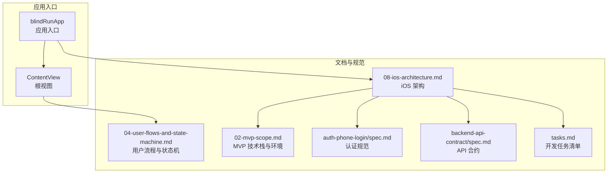
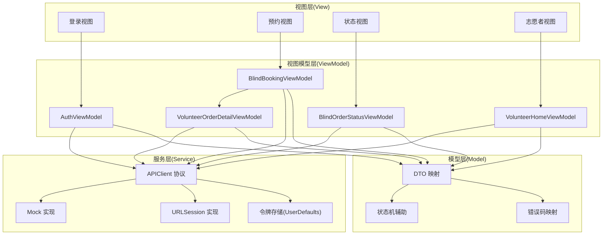
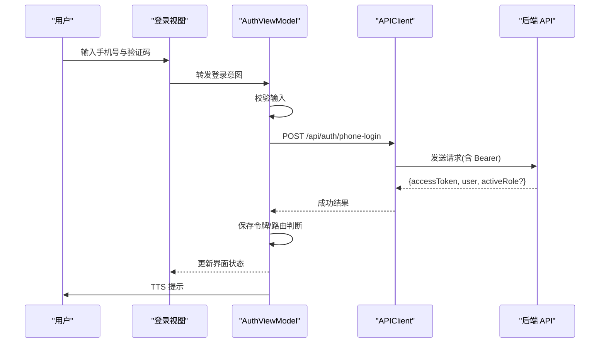
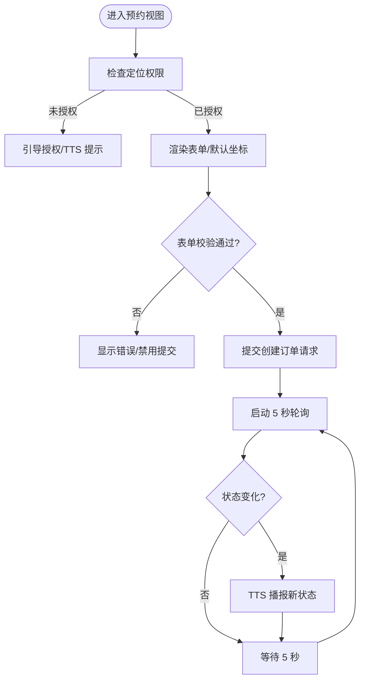
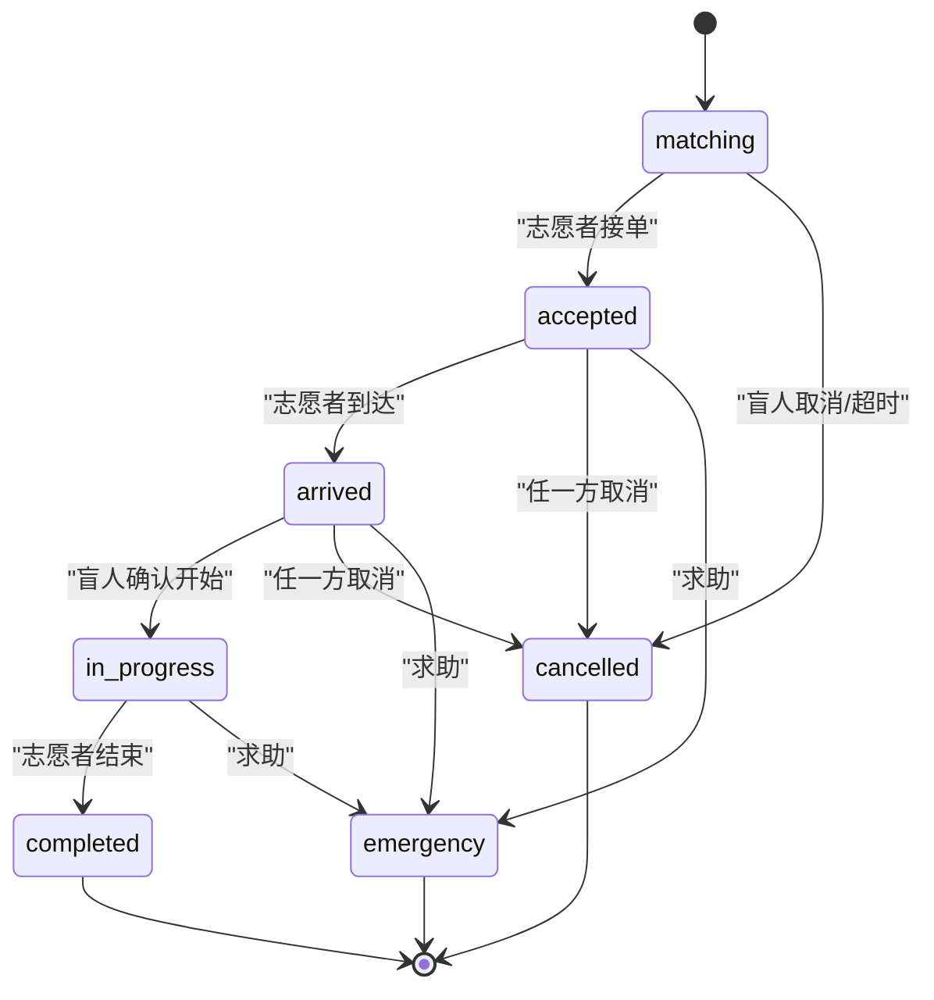
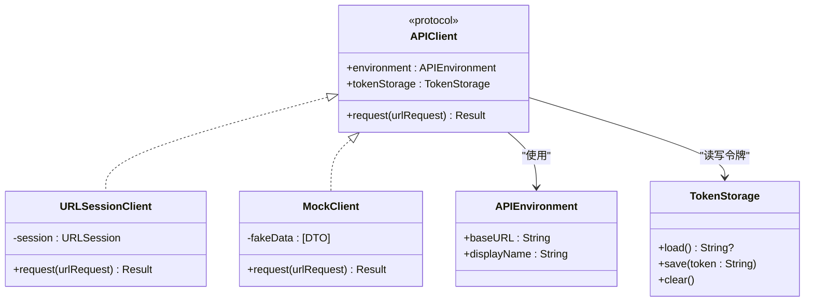
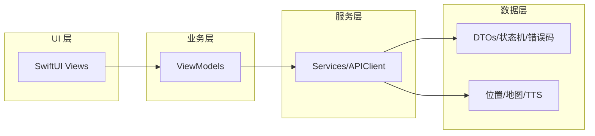

# MVVM 模式实现

<cite>
**本文引用的文件**
- [blindRunApp.swift](file://blindRun/blindRun/blindRunApp.swift)
- [ContentView.swift](file://blindRun/blindRun/ContentView.swift)
- [08-ios-architecture.md](file://docs/08-ios-architecture.md)
- [04-user-flows-and-state-machine.md](file://docs/04-user-flows-and-state-machine.md)
- [02-mvp-scope.md](file://docs/02-mvp-scope.md)
- [spec.md](file://openspec/changes/add-aidrun-ios-spring-mvp/specs/backend-api-contract/spec.md)
- [spec.md](file://openspec/changes/add-aidrun-ios-spring-mvp/specs/auth-phone-login/spec.md)
- [tasks.md](file://openspec/changes/add-aidrun-ios-spring-mvp/tasks.md)
</cite>

## 目录
1. [简介](#简介)
2. [项目结构](#项目结构)
3. [核心组件](#核心组件)
4. [架构总览](#架构总览)
5. [详细组件分析](#详细组件分析)
6. [依赖关系分析](#依赖关系分析)
7. [性能考虑](#性能考虑)
8. [故障排除指南](#故障排除指南)
9. [结论](#结论)
10. [附录](#附录)

## 简介
本文件面向 blindRun 应用的 MVVM 架构实现，系统性阐述 SwiftUI View、ViewModel、Service、Model 四层架构的设计理念与职责分离。结合项目文档与任务规划，重点说明：
- View 层如何保持简洁，仅负责渲染状态与转发用户意图
- ViewModel 如何管理状态、业务逻辑、异步操作与轮询
- Service 层如何封装 API 与平台能力边界
- Model 层如何映射 OpenAPI DTO 并提供领域辅助
- 异步编程模式、状态管理模式与数据绑定机制
- 典型 ViewModel 示例：AuthViewModel、BlindBookingViewModel、BlindOrderStatusViewModel 的设计要点
- 最佳实践与常见陷阱

## 项目结构
当前仓库包含最小化的 SwiftUI 应用骨架，以及完整的 iOS 架构与用户流程文档。项目采用模块化分组建议，MVVM 作为核心架构模式贯穿各模块。

图表来源
- [blindRunApp.swift:1-17](file://blindRun/blindRun/blindRunApp.swift#L1-L17)
- [ContentView.swift:1-24](file://blindRun/blindRun/ContentView.swift#L1-L24)
- [08-ios-architecture.md:1-165](file://docs/08-ios-architecture.md#L1-L165)
- [04-user-flows-and-state-machine.md:1-309](file://docs/04-user-flows-and-state-machine.md#L1-L309)
- [02-mvp-scope.md:119-153](file://docs/02-mvp-scope.md#L119-L153)
- [spec.md:1-34](file://openspec/changes/add-aidrun-ios-spring-mvp/specs/backend-api-contract/spec.md#L1-L34)
- [spec.md:1-30](file://openspec/changes/add-aidrun-ios-spring-mvp/specs/auth-phone-login/spec.md#L1-L30)
- [tasks.md:28-53](file://openspec/changes/add-aidrun-ios-spring-mvp/tasks.md#L28-L53)

章节来源
- [blindRunApp.swift:1-17](file://blindRun/blindRun/blindRunApp.swift#L1-L17)
- [ContentView.swift:1-24](file://blindRun/blindRun/ContentView.swift#L1-L24)
- [08-ios-architecture.md:1-165](file://docs/08-ios-architecture.md#L1-L165)
- [04-user-flows-and-state-machine.md:1-309](file://docs/04-user-flows-and-state-machine.md#L1-L309)
- [02-mvp-scope.md:119-153](file://docs/02-mvp-scope.md#L119-L153)
- [spec.md:1-34](file://openspec/changes/add-aidrun-ios-spring-mvp/specs/backend-api-contract/spec.md#L1-L34)
- [spec.md:1-30](file://openspec/changes/add-aidrun-ios-spring-mvp/specs/auth-phone-login/spec.md#L1-L30)
- [tasks.md:28-53](file://openspec/changes/add-aidrun-ios-spring-mvp/tasks.md#L28-L53)

## 核心组件
- View（视图层）
  - 保持极简：仅渲染状态、响应用户交互并转发意图给 ViewModel
  - 通过 @State、@ObservableObject、@StateObject 等绑定机制与 ViewModel 通信
- ViewModel（视图模型层）
  - 负责加载状态、验证状态、发起网络调用、处理轮询、触发 TTS
  - 将业务规则与 UI 解耦，便于单元测试
- Service（服务层）
  - 封装 API 客户端、令牌持久化、错误映射、环境切换
  - 通过统一协议屏蔽 Mock 与真实实现差异
- Model（模型层）
  - 映射 OpenAPI DTO，提供显示文本与状态转换辅助
  - 保持领域无关的数据结构，避免 UI 直接依赖

章节来源
- [08-ios-architecture.md:33-82](file://docs/08-ios-architecture.md#L33-L82)
- [04-user-flows-and-state-machine.md:120-178](file://docs/04-user-flows-and-state-machine.md#L120-L178)
- [spec.md:27-33](file://openspec/changes/add-aidrun-ios-spring-mvp/specs/backend-api-contract/spec.md#L27-L33)

## 架构总览
下图展示了 MVVM 在 blindRun 中的整体交互：View 仅负责渲染与事件转发；ViewModel 协调 Service 与 Model；Service 负责网络与平台能力；Model 提供领域数据与辅助。

图表来源
- [08-ios-architecture.md:33-82](file://docs/08-ios-architecture.md#L33-L82)
- [04-user-flows-and-state-machine.md:72-96](file://docs/04-user-flows-and-state-machine.md#L72-L96)
- [spec.md:19-33](file://openspec/changes/add-aidrun-ios-spring-mvp/specs/backend-api-contract/spec.md#L19-L33)

## 详细组件分析

### AuthViewModel 设计要点
职责分离与交互流程
- 输入校验：手机号格式、验证码固定值
- 登录流程：调用 APIClient 发起 phone-login 请求
- 令牌管理：保存 JWT 至 UserDefaults，并在后续请求中附加 Authorization 头
- 错误映射：将后端错误码映射为用户提示与 TTS 文案
- 路由控制：根据是否已有 activeRole 决定跳转角色选择或首页

图表来源
- [08-ios-architecture.md:68-82](file://docs/08-ios-architecture.md#L68-L82)
- [spec.md:3-29](file://openspec/changes/add-aidrun-ios-spring-mvp/specs/auth-phone-login/spec.md#L3-L29)

章节来源
- [08-ios-architecture.md:42-49](file://docs/08-ios-architecture.md#L42-L49)
- [spec.md:1-30](file://openspec/changes/add-aidrun-ios-spring-mvp/specs/auth-phone-login/spec.md#L1-L30)

### BlindBookingViewModel 设计要点
职责分离与交互流程
- 位置权限：前置校验，引导用户授权
- 默认坐标：提供演示回退坐标，确保模拟器可用
- 表单校验：出发地、预约时间、备注等字段校验
- 创建订单：调用 APIClient 创建订单，获取初始状态
- 轮询策略：在特定状态下启动轮询，状态变化时播报 TTS

图表来源
- [08-ios-architecture.md:125-139](file://docs/08-ios-architecture.md#L125-L139)
- [04-user-flows-and-state-machine.md:275-299](file://docs/04-user-flows-and-state-machine.md#L275-L299)

章节来源
- [08-ios-architecture.md:45-46](file://docs/08-ios-architecture.md#L45-L46)
- [04-user-flows-and-state-machine.md:120-178](file://docs/04-user-flows-and-state-machine.md#L120-L178)

### BlindOrderStatusViewModel 设计要点
职责分离与交互流程
- 轮询控制：仅在匹配中、已接单、已到达、进行中阶段启用
- 状态播报：状态变化时触发 TTS 与 UI 更新
- 危险操作：取消、紧急求助需二次确认
- 终态处理：完成、取消、紧急后停止轮询并返回首页

图表来源
- [04-user-flows-and-state-machine.md:72-96](file://docs/04-user-flows-and-state-machine.md#L72-L96)
- [08-ios-architecture.md:125-139](file://docs/08-ios-architecture.md#L125-L139)

章节来源
- [08-ios-architecture.md:46-46](file://docs/08-ios-architecture.md#L46-L46)
- [04-user-flows-and-state-machine.md:230-257](file://docs/04-user-flows-and-state-machine.md#L230-L257)

### APIClient 与 Service 边界
- 协议抽象：定义统一的 APIClient 协议，Mock 与 URLSession 实现共享调用点
- 环境切换：通过 APIEnvironment 支持 mock/localBackend/production 三类环境
- 令牌持久化：UserDefaults 存取 JWT，注释提醒生产迁移至 Keychain
- 错误映射：将后端稳定错误码映射为用户提示与 TTS 文案

图表来源
- [08-ios-architecture.md:50-82](file://docs/08-ios-architecture.md#L50-L82)
- [02-mvp-scope.md:136-153](file://docs/02-mvp-scope.md#L136-L153)

章节来源
- [08-ios-architecture.md:50-82](file://docs/08-ios-architecture.md#L50-L82)
- [02-mvp-scope.md:136-153](file://docs/02-mvp-scope.md#L136-L153)

## 依赖关系分析
- 模块分组：Core、Auth、Role、BlindRunner、Volunteer、Orders、Map、Voice、Safety、Profile
- 依赖方向：View 仅依赖 ViewModel；ViewModel 依赖 Service；Service 依赖 Model 与平台能力
- 循环依赖：通过协议与分层避免循环依赖
- 外部依赖：URLSession、UserDefaults、高德地图 SDK、AVSpeechSynthesizer

图表来源
- [08-ios-architecture.md:18-32](file://docs/08-ios-architecture.md#L18-L32)

章节来源
- [08-ios-architecture.md:18-32](file://docs/08-ios-architecture.md#L18-L32)

## 性能考虑
- 轮询频率：每 5 秒一次，仅在订单相关页面启用，离开页面即停止
- 网络重试：MVP 保持简单，不引入复杂离线队列
- UI 渲染：View 保持轻量，避免在 View 中执行网络与计算
- 令牌存储：UserDefaults 简化开发，生产迁移 Keychain 降低安全风险

## 故障排除指南
- 令牌缺失：检查 UserDefaults 是否存在有效 JWT，必要时重新登录
- 环境配置：确认 APIEnvironment 正确，localBackend 支持局域网地址
- 权限问题：定位权限被拒会导致预约与订单列表不可用，引导用户授权
- 状态异常：emergency 终态不可恢复，需在 UI 中明确提示并保持只读

章节来源
- [08-ios-architecture.md:78-82](file://docs/08-ios-architecture.md#L78-L82)
- [04-user-flows-and-state-machine.md:259-273](file://docs/04-user-flows-and-state-machine.md#L259-L273)

## 结论
blindRun 采用 SwiftUI + MVVM 架构，清晰划分 View、ViewModel、Service、Model 四层职责。通过协议抽象与模块化分组，既满足 MVP 快速交付需求，又为后续演进（如 Keychain 迁移、WebSocket 替代轮询）预留空间。建议在实现过程中严格遵循职责分离与错误映射规范，确保可维护性与可测试性。

## 附录
- 开发任务清单：按模块推进 Auth、BlindRunner、Volunteer、Map/Voice/Safety/Profile 的实现
- 技术栈与环境：SwiftUI、URLSession、UserDefaults、高德地图、AVSpeechSynthesizer
- API 合约：覆盖认证、用户、资料、志愿者、订单等端点

章节来源
- [tasks.md:28-53](file://openspec/changes/add-aidrun-ios-spring-mvp/tasks.md#L28-L53)
- [02-mvp-scope.md:119-153](file://docs/02-mvp-scope.md#L119-L153)
- [spec.md:27-33](file://openspec/changes/add-aidrun-ios-spring-mvp/specs/backend-api-contract/spec.md#L27-L33)