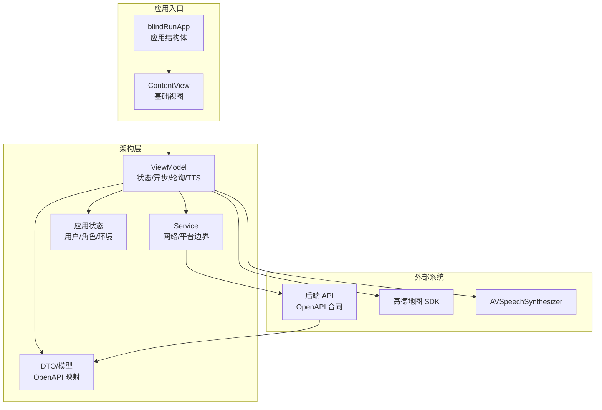
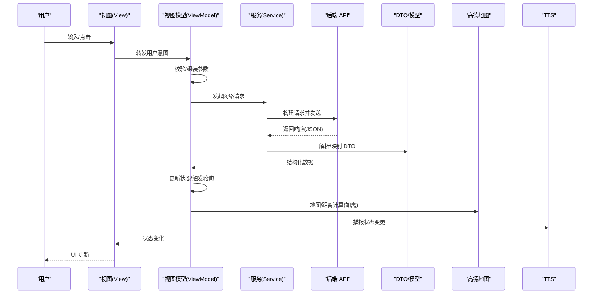
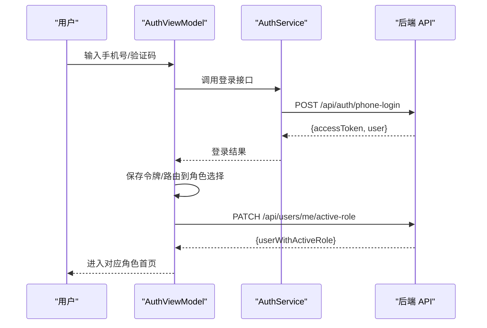
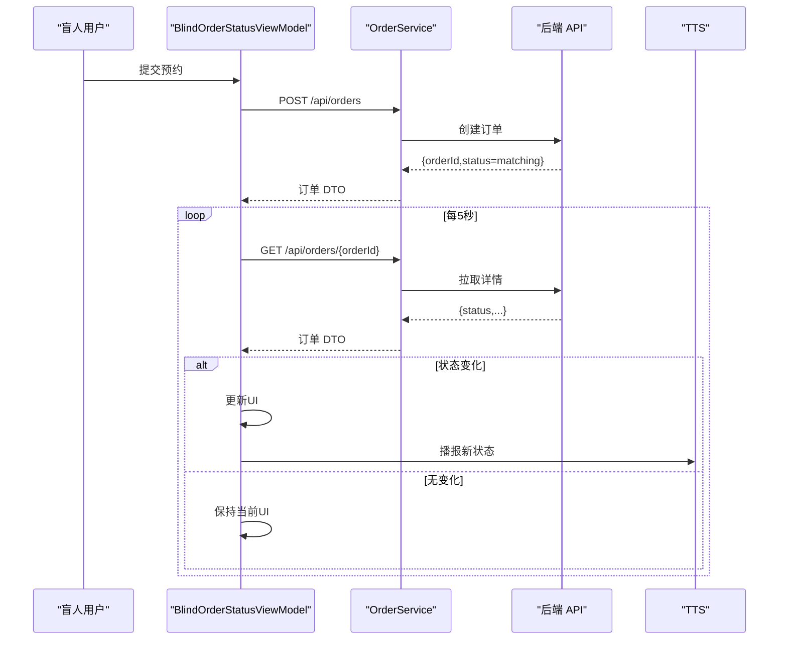
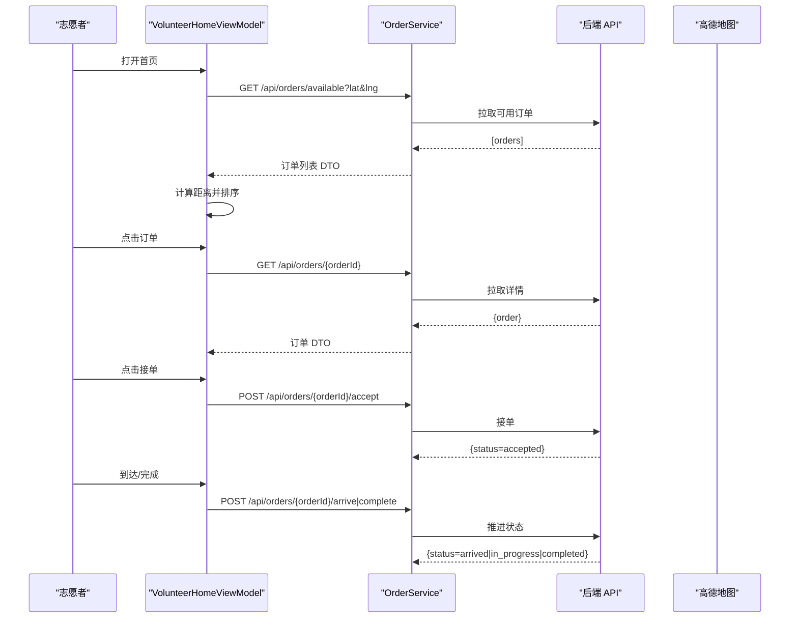
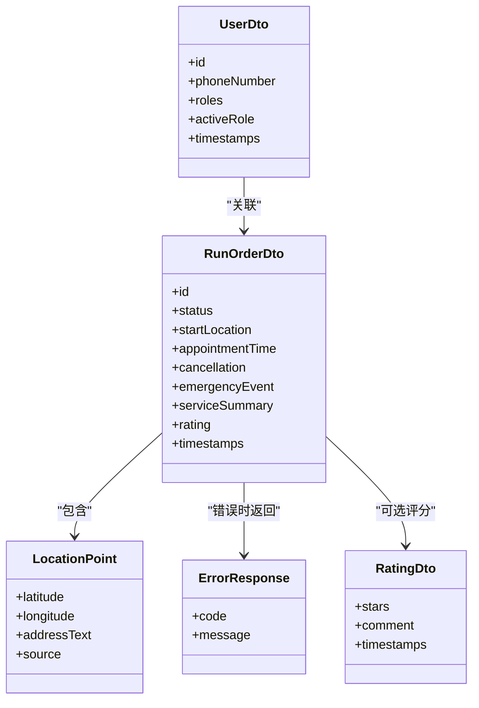
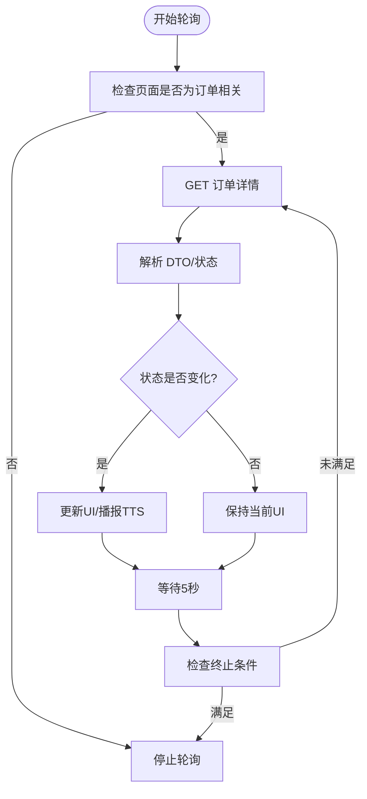
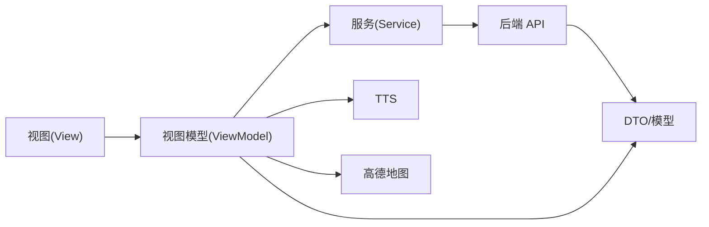

# 数据流设计

<cite>
**本文引用的文件**
- [blindRunApp.swift](file://blindRun/blindRun/blindRunApp.swift)
- [ContentView.swift](file://blindRun/blindRun/ContentView.swift)
- [08-ios-architecture.md](file://docs/08-ios-architecture.md)
- [04-user-flows-and-state-machine.md](file://docs/04-user-flows-and-state-machine.md)
- [07-api-contract.openapi.yaml](file://docs/07-api-contract.openapi.yaml)
- [01-product-requirements.md](file://docs/01-product-requirements.md)
- [02-mvp-scope.md](file://docs/02-mvp-scope.md)
</cite>

## 目录
1. [简介](#简介)
2. [项目结构](#项目结构)
3. [核心组件](#核心组件)
4. [架构总览](#架构总览)
5. [详细组件分析](#详细组件分析)
6. [依赖关系分析](#依赖关系分析)
7. [性能考量](#性能考量)
8. [故障排查指南](#故障排查指南)
9. [结论](#结论)
10. [附录](#附录)

## 简介
本文件围绕 blindRun 应用的数据流设计，系统阐述从用户输入、网络请求、后端响应、DTO 解析、状态更新到 UI 渲染的完整数据流；解释异步加载、轮询机制与实时更新策略；梳理 DTO 设计、数据验证、错误映射与用户提示；并给出缓存策略、数据同步与离线处理建议，以及数据流优化与性能监控方法。

## 项目结构
blindRun 为 SwiftUI + MVVM 架构的 iOS 应用，核心入口为应用结构体，内容视图承载基础 UI。业务层通过 ViewModel 负责状态管理、异步加载、轮询与 TTS 触发；服务层封装网络边界；DTO 与状态机由 OpenAPI 合同定义。

图表来源
- [blindRunApp.swift:10-17](file://blindRun/blindRun/blindRunApp.swift#L10-L17)
- [ContentView.swift:10-20](file://blindRun/blindRun/ContentView.swift#L10-L20)
- [08-ios-architecture.md:33-49](file://docs/08-ios-architecture.md#L33-L49)
- [07-api-contract.openapi.yaml:25-50](file://docs/07-api-contract.openapi.yaml#L25-L50)

章节来源
- [blindRunApp.swift:10-17](file://blindRun/blindRun/blindRunApp.swift#L10-L17)
- [ContentView.swift:10-20](file://blindRun/blindRun/ContentView.swift#L10-L20)
- [08-ios-architecture.md:18-49](file://docs/08-ios-architecture.md#L18-L49)

## 核心组件
- 视图层（View）：保持薄层，负责渲染状态与转发用户意图。
- 视图模型（ViewModel）：持有加载/校验状态、执行 API 调用、控制轮询、触发 TTS。
- 服务层（Service）：封装网络与平台能力边界，统一请求构建与响应解码。
- DTO/模型：严格映射 OpenAPI Schema，包含订单、用户、位置、评分等实体。
- 应用状态：用户信息、角色、令牌、环境配置等。

章节来源
- [08-ios-architecture.md:33-49](file://docs/08-ios-architecture.md#L33-L49)
- [07-api-contract.openapi.yaml:543-582](file://docs/07-api-contract.openapi.yaml#L543-L582)

## 架构总览
下图展示从用户输入到 API 调用再到 UI 更新的总体数据流，涵盖登录、角色切换、盲人预约、志愿者接单、状态轮询与 TTS 提示。

图表来源
- [08-ios-architecture.md:68-82](file://docs/08-ios-architecture.md#L68-L82)
- [07-api-contract.openapi.yaml:25-50](file://docs/07-api-contract.openapi.yaml#L25-L50)
- [04-user-flows-and-state-machine.md:123-178](file://docs/04-user-flows-and-state-machine.md#L123-L178)

## 详细组件分析

### 登录与角色切换数据流
- 登录：手机号+验证码（MVP 固定验证码）换取 JWT，返回用户与令牌；首次登录可能无 activeRole，引导角色选择。
- 角色切换：同一 JWT 下切换 activeRole；若存在活跃订单则拦截并提示。

图表来源
- [07-api-contract.openapi.yaml:25-81](file://docs/07-api-contract.openapi.yaml#L25-L81)
- [08-ios-architecture.md:84-96](file://docs/08-ios-architecture.md#L84-L96)

章节来源
- [07-api-contract.openapi.yaml:25-81](file://docs/07-api-contract.openapi.yaml#L25-L81)
- [08-ios-architecture.md:84-96](file://docs/08-ios-architecture.md#L84-L96)

### 盲人预约与状态轮询数据流
- 预约：校验定位权限与资料完整性，提交创建订单请求。
- 轮询：在匹配中/已接单/已到达/进行中期间，每 5 秒拉取订单详情；状态变化时更新 UI 并播报。

图表来源
- [07-api-contract.openapi.yaml:150-255](file://docs/07-api-contract.openapi.yaml#L150-L255)
- [04-user-flows-and-state-machine.md:275-299](file://docs/04-user-flows-and-state-machine.md#L275-L299)
- [08-ios-architecture.md:125-138](file://docs/08-ios-architecture.md#L125-L138)

章节来源
- [07-api-contract.openapi.yaml:150-255](file://docs/07-api-contract.openapi.yaml#L150-L255)
- [04-user-flows-and-state-machine.md:275-299](file://docs/04-user-flows-and-state-machine.md#L275-L299)
- [08-ios-architecture.md:125-138](file://docs/08-ios-architecture.md#L125-L138)

### 志愿者接单与服务中数据流
- 可接订单：获取匹配订单列表，基于当前位置在 iOS 侧计算并排序。
- 接单/到达/完成：根据状态机推进，完成后志愿者获得积分。

图表来源
- [07-api-contract.openapi.yaml:209-342](file://docs/07-api-contract.openapi.yaml#L209-L342)
- [04-user-flows-and-state-machine.md:180-228](file://docs/04-user-flows-and-state-machine.md#L180-L228)
- [08-ios-architecture.md:46-48](file://docs/08-ios-architecture.md#L46-L48)

章节来源
- [07-api-contract.openapi.yaml:209-342](file://docs/07-api-contract.openapi.yaml#L209-L342)
- [04-user-flows-and-state-machine.md:180-228](file://docs/04-user-flows-and-state-machine.md#L180-L228)

### DTO 设计与数据验证
- DTO 严格映射 OpenAPI Schema，包含用户、订单、位置、评分、取消事件、紧急事件、服务摘要、积分流水等。
- 错误映射：后端返回稳定错误码，前端映射为用户可见消息与 TTS 提示。
- 校验：表单与业务规则在 ViewModel 层执行，结合后端返回的错误码进行反馈。

图表来源
- [07-api-contract.openapi.yaml:811-914](file://docs/07-api-contract.openapi.yaml#L811-L914)
- [07-api-contract.openapi.yaml:559-567](file://docs/07-api-contract.openapi.yaml#L559-L567)
- [07-api-contract.openapi.yaml:1012-1048](file://docs/07-api-contract.openapi.yaml#L1012-L1048)

章节来源
- [07-api-contract.openapi.yaml:559-567](file://docs/07-api-contract.openapi.yaml#L559-L567)
- [07-api-contract.openapi.yaml:811-914](file://docs/07-api-contract.openapi.yaml#L811-L914)
- [07-api-contract.openapi.yaml:1012-1048](file://docs/07-api-contract.openapi.yaml#L1012-L1048)

### 轮询机制与实时更新策略
- 轮询周期：5 秒。
- 触发条件：仅在订单相关页面且订单处于进行中状态时持续轮询。
- 终止条件：订单进入终态（完成/取消/紧急）、页面消失、用户登出。
- 实时性权衡：相比 WebSocket，轮询实现简单，但存在最多 5 秒延迟。

图表来源
- [04-user-flows-and-state-machine.md:275-299](file://docs/04-user-flows-and-state-machine.md#L275-L299)
- [08-ios-architecture.md:125-138](file://docs/08-ios-architecture.md#L125-L138)

章节来源
- [04-user-flows-and-state-machine.md:275-299](file://docs/04-user-flows-and-state-machine.md#L275-L299)
- [08-ios-architecture.md:125-138](file://docs/08-ios-architecture.md#L125-L138)

### 缓存策略、数据同步与离线处理
- 缓存策略：MVP 不引入复杂离线队列；建议在 ViewModel 层对热点数据（如可用订单列表、当前订单）做轻量内存缓存，避免重复请求。
- 数据同步：通过轮询与显式刷新（如接单/完成后的立即刷新）维持一致性。
- 离线处理：定位权限缺失时阻断关键流程（如盲人预约、志愿者距离排序），提供 TTS 引导与演示坐标兜底。

章节来源
- [08-ios-architecture.md:68-82](file://docs/08-ios-architecture.md#L68-L82)
- [08-ios-architecture.md:125-138](file://docs/08-ios-architecture.md#L125-L138)
- [08-ios-architecture.md:98-117](file://docs/08-ios-architecture.md#L98-L117)

## 依赖关系分析
- 视图依赖视图模型的状态与命令。
- 视图模型依赖服务层进行网络请求与平台能力调用。
- 服务层依赖后端 API，返回 DTO。
- DTO 严格来自 OpenAPI 合同，确保前后端契约一致。
- 地图与 TTS 作为平台能力由服务层桥接到视图模型。

图表来源
- [08-ios-architecture.md:33-49](file://docs/08-ios-architecture.md#L33-L49)
- [07-api-contract.openapi.yaml:25-50](file://docs/07-api-contract.openapi.yaml#L25-L50)

章节来源
- [08-ios-architecture.md:33-49](file://docs/08-ios-architecture.md#L33-L49)
- [07-api-contract.openapi.yaml:25-50](file://docs/07-api-contract.openapi.yaml#L25-L50)

## 性能考量
- 减少网络往返：合并必要的查询参数（如可用订单带经纬度），降低请求次数。
- 控制轮询频率：在非关键页面禁用轮询，仅在订单相关页面启用。
- UI 去抖与节流：对频繁触发的用户操作（如滚动/输入）进行去抖，避免过度刷新。
- 图片与地图资源：延迟加载、复用地图实例，减少内存占用。
- 错误快速失败：对明显无效请求尽早返回，避免无意义的轮询。

## 故障排查指南
- 登录失败：检查验证码是否为固定值，确认网络可达与环境配置正确。
- 角色切换被拦截：若存在活跃订单，系统会阻止切换，需先完成或取消订单。
- 定位权限问题：盲人预约与志愿者距离排序均需定位权限；无权限时阻断流程并播报提示。
- 轮询无更新：确认页面处于订单相关且订单未进入终态；检查网络与后端状态。
- 错误码映射：依据后端返回的稳定错误码，统一映射为用户提示与 TTS 语音。

章节来源
- [08-ios-architecture.md:78-82](file://docs/08-ios-architecture.md#L78-L82)
- [08-ios-architecture.md:92-96](file://docs/08-ios-architecture.md#L92-L96)
- [08-ios-architecture.md:107-117](file://docs/08-ios-architecture.md#L107-L117)
- [07-api-contract.openapi.yaml:469-541](file://docs/07-api-contract.openapi.yaml#L469-L541)

## 结论
blindRun 的数据流以 MVVM 为核心，通过 ViewModel 统一编排异步加载、轮询与 UI 更新；服务层封装网络边界，DTO 严格映射 OpenAPI；轮询机制在保证实现简洁的同时兼顾演示需求。建议在现有基础上强化缓存与错误映射，持续优化轮询策略与 UI 响应，以提升整体用户体验与稳定性。

## 附录
- 环境配置：支持 Mock、Local Backend、Production 三类环境，便于本地联调与演示。
- 地图与定位：集成高德地图，要求定位权限，提供演示坐标兜底。
- 无障碍与语音：TTS 与 VoiceOver 优先，关键节点提供重复状态播报。

章节来源
- [08-ios-architecture.md:50-66](file://docs/08-ios-architecture.md#L50-L66)
- [08-ios-architecture.md:98-124](file://docs/08-ios-architecture.md#L98-L124)
- [01-product-requirements.md:96-115](file://docs/01-product-requirements.md#L96-L115)
- [02-mvp-scope.md:136-151](file://docs/02-mvp-scope.md#L136-L151)