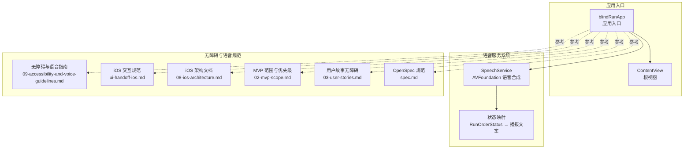
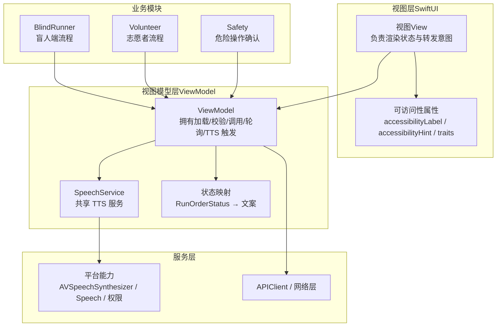
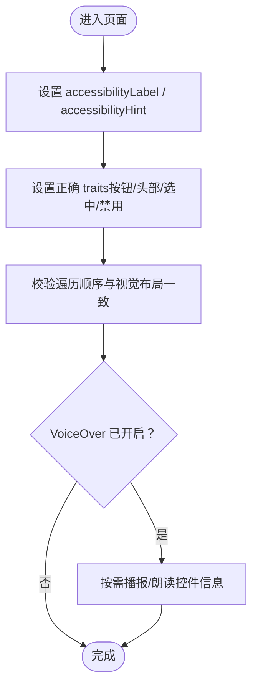
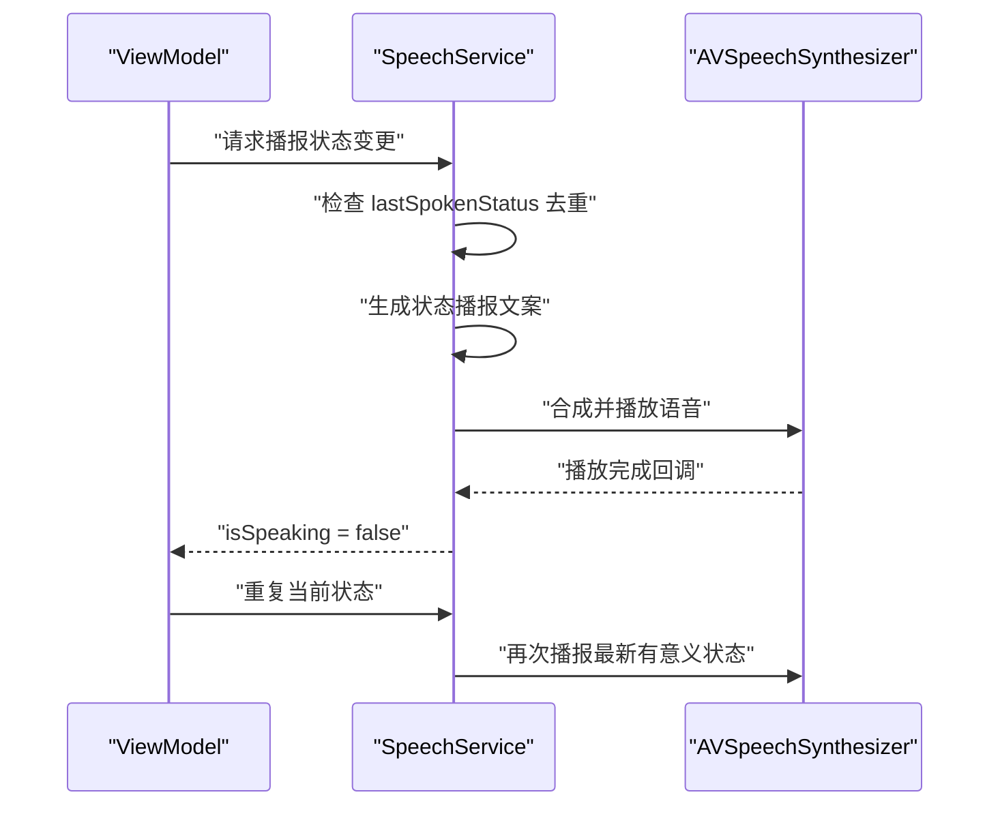
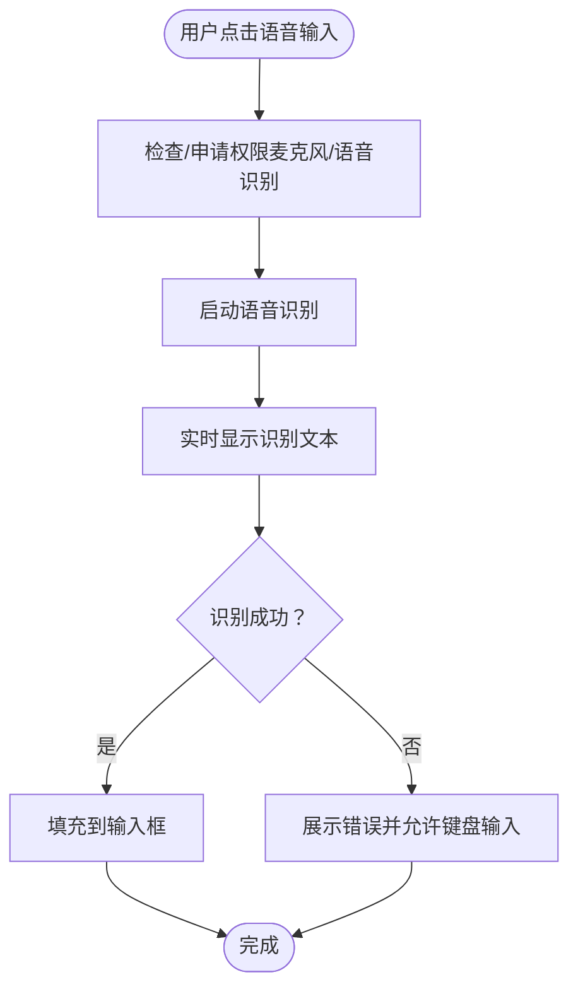
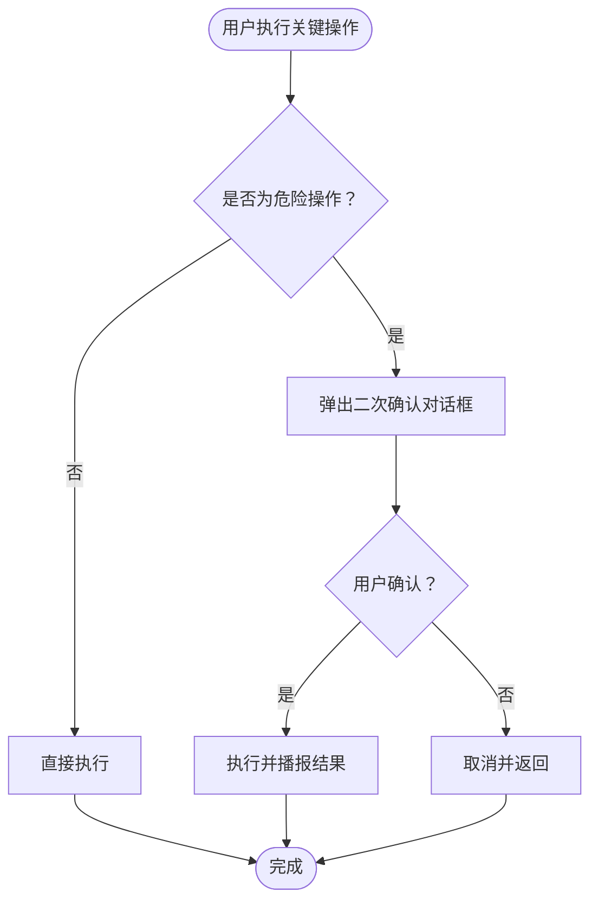
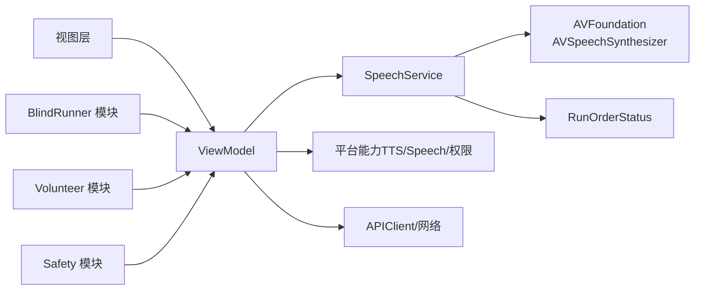

# 无障碍集成设计

<cite>
**本文引用的文件**
- [SpeechService.swift](file://blindRun/blindRun/Voice/SpeechService.swift)
- [blindRunApp.swift](file://blindRun/blindRun/blindRunApp.swift)
- [ContentView.swift](file://blindRun/blindRun/ContentView.swift)
- [09-accessibility-and-voice-guidelines.md](file://docs/09-accessibility-and-voice-guidelines.md)
- [ui-handoff-ios.md](file://docs/ui-handoff-ios.md)
- [08-ios-architecture.md](file://docs/08-ios-architecture.md)
- [02-mvp-scope.md](file://docs/02-mvp-scope.md)
- [03-user-stories.md](file://docs/03-user-stories.md)
- [spec.md](file://openspec/changes/add-aidrun-ios-spring-mvp/specs/accessibility-voice-ui/spec.md)
- [blindRunUITests.swift](file://blindRunUITests/blindRunUITests.swift)
- [blindRunUITestsLaunchTests.swift](file://blindRunUITests/blindRunUITestsLaunchTests.swift)
</cite>

## 更新摘要
**所做更改**
- 新增 AVFoundation 语音合成服务实现章节
- 更新订单状态播报功能的详细实现
- 增强语音服务系统架构说明
- 补充状态映射和播报策略的代码级实现

## 目录
1. [简介](#简介)
2. [项目结构](#项目结构)
3. [核心组件](#核心组件)
4. [架构总览](#架构总览)
5. [详细组件分析](#详细组件分析)
6. [依赖关系分析](#依赖关系分析)
7. [性能考量](#性能考量)
8. [故障排查指南](#故障排查指南)
9. [结论](#结论)
10. [附录](#附录)

## 简介
本文件面向 blindRun 应用的无障碍集成设计，聚焦 VoiceOver 支持、TTS 语音播报、语音输入等无障碍功能的实现原则与落地路径。文档基于现有需求与规范，结合 iOS 平台的可访问性要求，给出设计建议、实现要点、测试方法与性能优化策略，确保盲人端体验优先，并满足 3 天内可演示的安全订单闭环。

**更新** 本版本重点反映了新增的语音服务系统实现，包括基于 AVFoundation 的语音合成服务和完整的订单状态播报功能。

## 项目结构
blindRun 当前为 SwiftUI + MVVM 架构的 iOS 应用，入口为应用结构体，根视图为简单示例内容视图。无障碍与语音相关的设计与规范由文档统一定义，指导各业务模块在视图层、ViewModel 层与平台服务层协同实现。

**图表来源**
- [blindRunApp.swift:10-20](file://blindRun/blindRun/blindRunApp.swift#L10-L20)
- [SpeechService.swift:7-18](file://blindRun/blindRun/Voice/SpeechService.swift#L7-L18)
- [09-accessibility-and-voice-guidelines.md:1-143](file://docs/09-accessibility-and-voice-guidelines.md#L1-L143)
- [ui-handoff-ios.md:376-420](file://docs/ui-handoff-ios.md#L376-L420)

**章节来源**
- [blindRunApp.swift:10-20](file://blindRun/blindRun/blindRunApp.swift#L10-L20)
- [SpeechService.swift:7-18](file://blindRun/blindRun/Voice/SpeechService.swift#L7-L18)
- [09-accessibility-and-voice-guidelines.md:1-143](file://docs/09-accessibility-and-voice-guidelines.md#L1-L143)
- [ui-handoff-ios.md:376-420](file://docs/ui-handoff-ios.md#L376-L420)

## 核心组件
- VoiceOver 支持：要求所有关键按钮、输入框、状态文本具备可访问性标签与提示，并设置正确的可访问性特征；遍历顺序需与视觉布局一致。
- TTS 语音播报：使用系统 AVSpeechSynthesizer，在关键流程节点进行播报；采用单一共享 SpeechService；避免轮询期间重复播报；每页提供"重复当前状态"按钮。
- 语音输入：使用 iOS Speech 框架，仅限于文本输入场景（如起点/终点描述、备注、可选摘要）；失败时展示错误并允许键盘输入；仅在用户发起时申请麦克风与识别权限。
- 极简大按钮：盲人端关键主按钮最小高度 64pt，高对比度与清晰文案，减少层级与复杂表单。
- 危险操作二次确认：取消订单、进入求助、结束服务、登出等操作需二次确认。
- 状态文案：使用简洁直白的中文，提供推荐的状态播报语句。

**更新** 新增 AVFoundation 语音合成服务的完整实现，包括状态映射和去重机制。

**章节来源**
- [09-accessibility-and-voice-guidelines.md:5-143](file://docs/09-accessibility-and-voice-guidelines.md#L5-L143)
- [SpeechService.swift:7-83](file://blindRun/blindRun/Voice/SpeechService.swift#L7-L83)
- [ui-handoff-ios.md:745-751](file://docs/ui-handoff-ios.md#L745-L751)

## 架构总览
blindRun 采用 SwiftUI + MVVM 架构，无障碍与语音能力贯穿视图层（可访问性属性）、ViewModel 层（状态变更与 TTS 触发）、服务层（SpeechService、平台能力封装）。架构文档明确了模块划分与职责边界，确保无障碍功能在各模块中统一接入。

**图表来源**
- [08-ios-architecture.md:33-49](file://docs/08-ios-architecture.md#L33-L49)
- [SpeechService.swift:85-104](file://blindRun/blindRun/Voice/SpeechService.swift#L85-L104)

**章节来源**
- [08-ios-architecture.md:1-165](file://docs/08-ios-architecture.md#L1-L165)
- [SpeechService.swift:85-104](file://blindRun/blindRun/Voice/SpeechService.swift#L85-L104)

## 详细组件分析

### 组件一：VoiceOver 支持
- 设计原则
  - 所有关键控件均需设置 accessibilityLabel 与 accessibilityHint。
  - 正确设置可访问性特征（按钮、头部、选中、禁用等）。
  - 遍历顺序与视觉布局一致。
- 覆盖范围
  - 登录手机号与验证码输入、角色切换、盲人首页状态文本、预约表单字段、位置权限提示、提交预约按钮、取消订单、紧急按钮、确认开始、重复当前状态、志愿者可用性开关、可接订单行、接受/到达/完成/取消/紧急等操作、评分控件等。
- 实施建议
  - 在视图层为每个关键元素配置可访问性属性。
  - 使用 SwiftUI 的可访问性修饰符统一管理。
  - 在 ViewModel 中根据状态变化决定是否需要播报或更新可访问性提示。

**图表来源**
- [09-accessibility-and-voice-guidelines.md:37-61](file://docs/09-accessibility-and-voice-guidelines.md#L37-L61)

**章节来源**
- [09-accessibility-and-voice-guidelines.md:37-61](file://docs/09-accessibility-and-voice-guidelines.md#L37-L61)
- [03-user-stories.md:703-720](file://docs/03-user-stories.md#L703-L720)
- [spec.md:3-10](file://openspec/changes/add-aidrun-ios-spring-mvp/specs/accessibility-voice-ui/spec.md#L3-L10)

### 组件二：TTS 语音播报（SpeechService）

**更新** SpeechService 已完全实现，基于 AVFoundation 提供完整的语音合成服务。

- 设计与使用
  - 使用系统 AVSpeechSynthesizer。
  - 采用单一共享 SpeechService。
  - ViewModel 在状态变化时决定播报内容，避免轮询期间重复播报。
  - 每个关键盲人端页面提供"重复当前状态"按钮。
- 核心功能实现
  - `speak(_:)`：播放任意文本
  - `speakStatusChange(_:)`：播报订单状态变化（防重复）
  - `repeatCurrentStatus()`：重复播报当前状态
  - `speakError(_:)`：播报错误信息
  - `stop()`：立即停止播放
  - `resetLastStatus()`：重置最后播报状态
- 状态映射实现
  - 完整的 RunOrderStatus → 中文播报文案映射
  - 支持所有订单状态：matching、accepted、arrived、inProgress、completed、cancelled、emergency
- 去重机制
  - 记录最后一次播报的状态
  - 轮询期间避免重复播报相同状态
  - 提供手动重复播报功能

**图表来源**
- [SpeechService.swift:32-47](file://blindRun/blindRun/Voice/SpeechService.swift#L32-L47)
- [SpeechService.swift:87-103](file://blindRun/blindRun/Voice/SpeechService.swift#L87-L103)

**章节来源**
- [SpeechService.swift:7-104](file://blindRun/blindRun/Voice/SpeechService.swift#L7-L104)
- [09-accessibility-and-voice-guidelines.md:13-36](file://docs/09-accessibility-and-voice-guidelines.md#L13-L36)
- [08-ios-architecture.md:140-147](file://docs/08-ios-architecture.md#L140-L147)
- [ui-handoff-ios.md:745-751](file://docs/ui-handoff-ios.md#L745-L751)

### 组件三：语音输入（Speech Framework）
- 使用范围
  - 仅用于文本输入场景：起点/终点描述、路线备注、可选志愿者服务摘要。
- 行为规范
  - 不构建全局 AI 助手；不解析自然语言时间作为核心功能；预约时间仍使用 DatePicker。
  - 识别失败时展示错误并允许键盘输入；仅在用户发起时申请麦克风与语音识别权限。
- 用户体验
  - 提供"麦克风"按钮，点击后启动识别，实时显示识别文本，结束后自动填充到输入框。

**图表来源**
- [09-accessibility-and-voice-guidelines.md:71-87](file://docs/09-accessibility-and-voice-guidelines.md#L71-L87)

**章节来源**
- [09-accessibility-and-voice-guidelines.md:71-87](file://docs/09-accessibility-and-voice-guidelines.md#L71-L87)
- [03-user-stories.md:738-758](file://docs/03-user-stories.md#L738-L758)
- [spec.md:35-41](file://openspec/changes/add-aidrun-ios-spring-mvp/specs/accessibility-voice-ui/spec.md#L35-L41)

### 组件四：极简大按钮与危险操作二次确认
- 极简大按钮
  - 盲人端关键主按钮最小高度 64pt，高对比度与清晰文案；每屏仅保留一个主要动作；避免密集表格。
- 危险操作二次确认
  - 取消订单、进入求助、结束服务、登出等操作需二次确认；紧急确认文案明确异常记录与状态变更。

**图表来源**
- [09-accessibility-and-voice-guidelines.md:88-107](file://docs/09-accessibility-and-voice-guidelines.md#L88-L107)
- [08-ios-architecture.md:140-147](file://docs/08-ios-architecture.md#L140-L147)

**章节来源**
- [09-accessibility-and-voice-guidelines.md:88-107](file://docs/09-accessibility-and-voice-guidelines.md#L88-L107)
- [08-ios-architecture.md:140-147](file://docs/08-ios-architecture.md#L140-L147)

### 组件五：状态复制与可读性
- 状态复制
  - 使用简洁直白的中文；提供推荐的状态播报语句，确保用户无需看屏幕即可理解当前状态。
- 可读性
  - 支持系统浅/深色模式，优先保证可读性、对比度与按钮清晰度。

**章节来源**
- [09-accessibility-and-voice-guidelines.md:108-121](file://docs/09-accessibility-and-voice-guidelines.md#L108-L121)
- [09-accessibility-and-voice-guidelines.md:62-70](file://docs/09-accessibility-and-voice-guidelines.md#L62-L70)

## 依赖关系分析

**更新** 新增 SpeechService 作为核心依赖组件。

- 模块耦合
  - 视图层仅负责渲染与事件转发，可访问性属性集中配置，降低与业务逻辑耦合。
  - ViewModel 负责状态与 TTS 触发，避免在视图层直接调用平台能力。
  - SpeechService 作为共享服务，被多个 ViewModel 复用，避免重复初始化与资源竞争。
- 外部依赖
  - AVSpeechSynthesizer：用于 TTS。
  - Speech：用于语音输入。
  - 权限系统：位置、麦克风、语音识别权限需在用户发起时申请。
- 内部依赖
  - SpeechService → AVFoundation（语音合成）
  - SpeechService → RunOrderStatus（状态映射）
  - ViewModel → SpeechService（状态播报）
- 潜在风险
  - 重复播报与轮询噪音：需在 ViewModel 中做去重与节流。
  - 语音识别失败处理：需提供错误提示与键盘输入降级方案。
  - 语音服务状态同步：isSpeaking 状态需正确更新。

**图表来源**
- [08-ios-architecture.md:33-49](file://docs/08-ios-architecture.md#L33-L49)
- [SpeechService.swift:11](file://blindRun/blindRun/Voice/SpeechService.swift#L11)
- [SpeechService.swift:66-83](file://blindRun/blindRun/Voice/SpeechService.swift#L66-83)

**章节来源**
- [08-ios-architecture.md:33-49](file://docs/08-ios-architecture.md#L33-L49)
- [SpeechService.swift:11](file://blindRun/blindRun/Voice/SpeechService.swift#L11)
- [SpeechService.swift:66-83](file://blindRun/blindRun/Voice/SpeechService.swift#L66-83)

## 性能考量

**更新** 新增语音服务系统的性能优化策略。

- TTS 抖动与重复播报
  - 在 ViewModel 中缓存最近播报的状态标识，轮询期间避免重复播报。
  - 对 TTS 请求做节流，避免短时间内多次触发。
  - SpeechService 内置去重机制，防止状态变化时的重复播报。
- 语音输入延迟
  - 识别过程尽量异步，避免阻塞主线程；提供实时文本预览与最终确认。
  - 识别失败时快速回退到键盘输入，减少用户等待。
- 可访问性渲染
  - 避免在热路径频繁修改大量可访问性属性；批量更新或延迟更新。
- 内存与资源
  - SpeechService 单例化，避免重复创建与释放造成抖动。
  - 权限申请与识别会话生命周期短，及时释放资源。
  - AVSpeechSynthesizer 自动管理音频资源，避免内存泄漏。
- 状态播报优化
  - 语音服务状态监控：isSpeaking 状态实时反映播放状态。
  - 最后播报状态缓存：避免重复播报同一状态。
  - 语音合成参数优化：使用默认语速和中文语音。

**章节来源**
- [SpeechService.swift:13](file://blindRun/blindRun/Voice/SpeechService.swift#L13)
- [SpeechService.swift:87-103](file://blindRun/blindRun/Voice/SpeechService.swift#L87-L103)

## 故障排查指南

**更新** 新增语音服务系统的故障排查方法。

- VoiceOver 无法朗读或顺序异常
  - 检查关键控件是否设置了 accessibilityLabel 与 accessibilityHint。
  - 校验 traits 设置是否正确（按钮/头部/选中/禁用）。
  - 使用 VoiceOver 的"转到下一个/上一个"手势验证遍历顺序。
- TTS 未播报或重复播报
  - 确认 ViewModel 是否在状态变更时调用 SpeechService。
  - 检查去重逻辑与轮询节流是否生效。
  - 确认"重复当前状态"按钮是否可用并能正常播报。
  - 检查 SpeechService 的 isSpeaking 状态是否正确更新。
  - 验证状态映射是否正确返回相应的播报文案。
- 语音输入失败
  - 检查权限是否已授权；若失败，应展示错误并允许键盘输入。
  - 确认仅在用户主动发起时申请麦克风与语音识别权限。
- 语音服务异常
  - 检查 AVSpeechSynthesizer 是否正常初始化。
  - 验证状态枚举转换是否正确。
  - 确认语音合成参数（语言、语速、音调）设置合理。
  - 检查 delegate 回调是否正常工作。
- 危险操作未二次确认
  - 检查确认对话框是否弹出；确认文案是否清晰明确。
- 启动与界面测试
  - 使用 UI 测试框架启动应用，验证启动性能与基本交互。
  - 可在测试中启用 VoiceOver，验证关键页面的可访问性覆盖。

**章节来源**
- [09-accessibility-and-voice-guidelines.md:37-107](file://docs/09-accessibility-and-voice-guidelines.md#L37-L107)
- [SpeechService.swift:87-103](file://blindRun/blindRun/Voice/SpeechService.swift#L87-L103)
- [blindRunUITests.swift:25-42](file://blindRunUITests/blindRunUITests.swift#L25-L42)
- [blindRunUITestsLaunchTests.swift:20-34](file://blindRunUITests/blindRunUITestsLaunchTests.swift#L20-L34)

## 结论
blindRun 的无障碍集成以 VoiceOver、TTS 与语音输入为核心，遵循"盲人端语音优先"的原则，强调简洁、可读与可确认。通过统一的 SpeechService 与严格的可访问性规范，可在 SwiftUI + MVVM 架构下高效实现无障碍能力。

**更新** 新的语音服务系统基于 AVFoundation 提供了完整的语音合成能力，包括状态映射、去重机制和状态监控，为订单状态播报提供了可靠的基础设施。建议在后续开发中持续完善状态播报语句、优化轮询节流与语音识别降级路径，并加强 UI 自动化测试对可访问性的覆盖。

## 附录
- 验收清单（摘自无障碍指南）
  - 盲人端完整路径可在 VoiceOver 开启下完成。
  - 所有关键 TTS 节点在正确状态变更时播报一次。
  - "重复当前状态"能播报最新有意义状态。
  - 位置权限拒绝时阻断预约与志愿者按距离接单。
  - 危险操作在后端变更前显示确认。
  - 文字与控件在浅/深色模式下保持可读性。
  - 语音服务系统稳定运行，无内存泄漏。
  - 状态播报准确反映订单真实状态。

**章节来源**
- [09-accessibility-and-voice-guidelines.md:131-139](file://docs/09-accessibility-and-voice-guidelines.md#L131-L139)
- [SpeechService.swift:66-83](file://blindRun/blindRun/Voice/SpeechService.swift#L66-83)