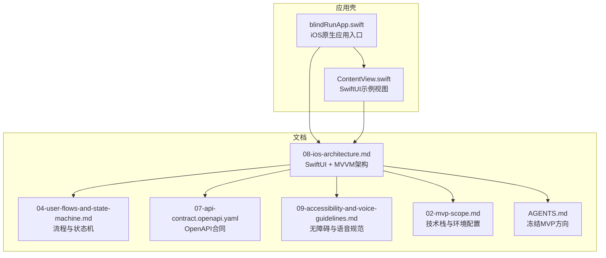
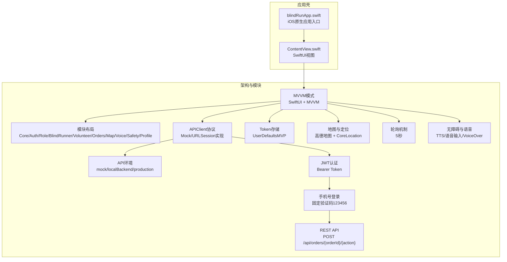
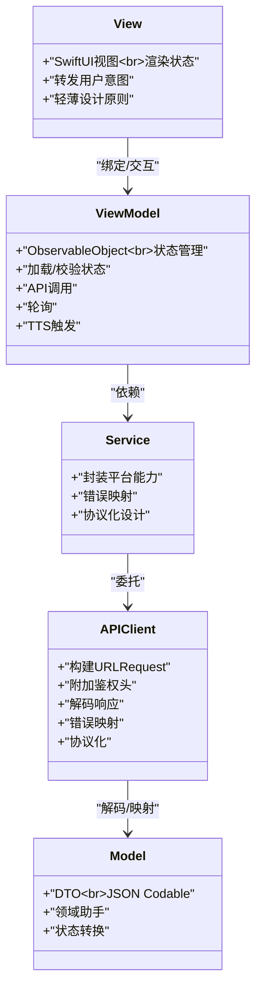
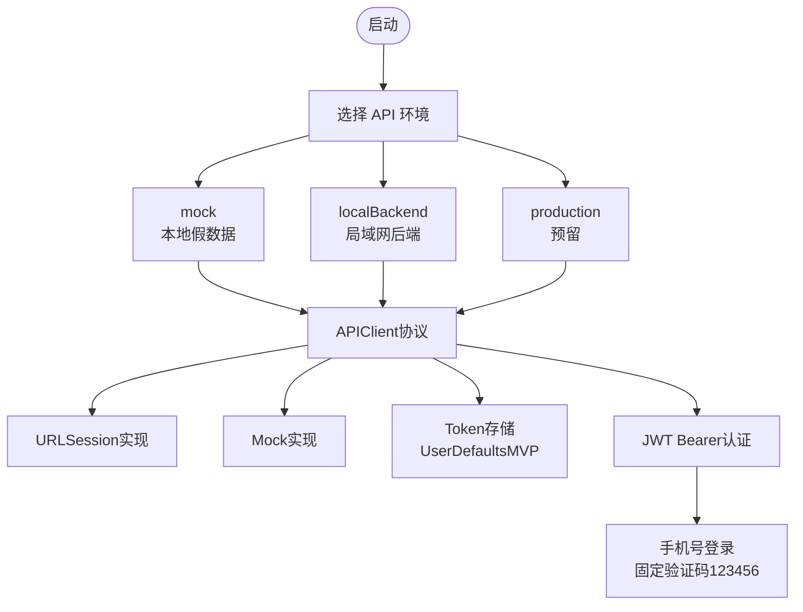
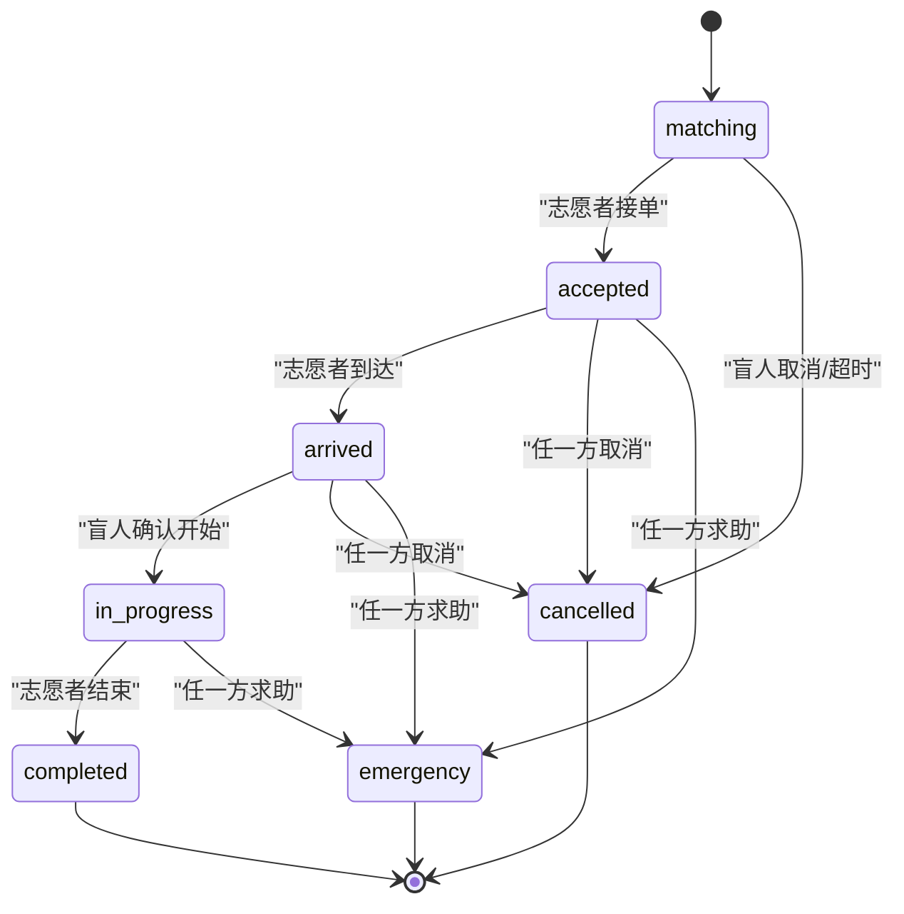
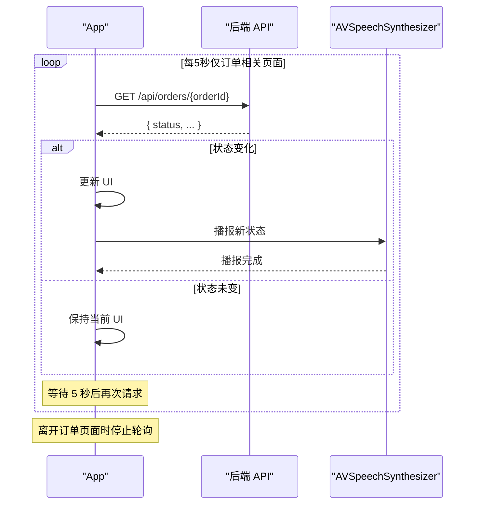
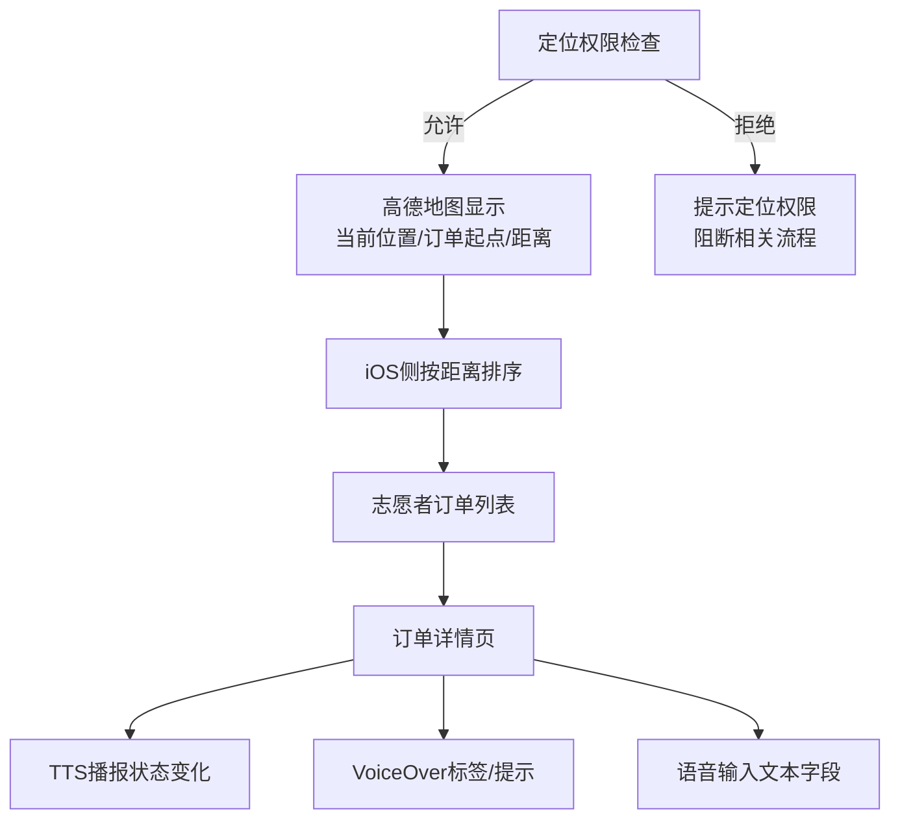
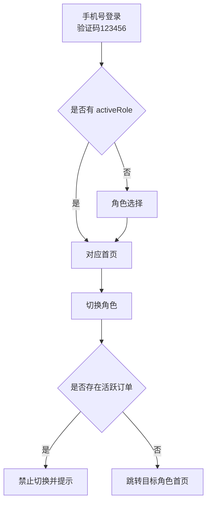
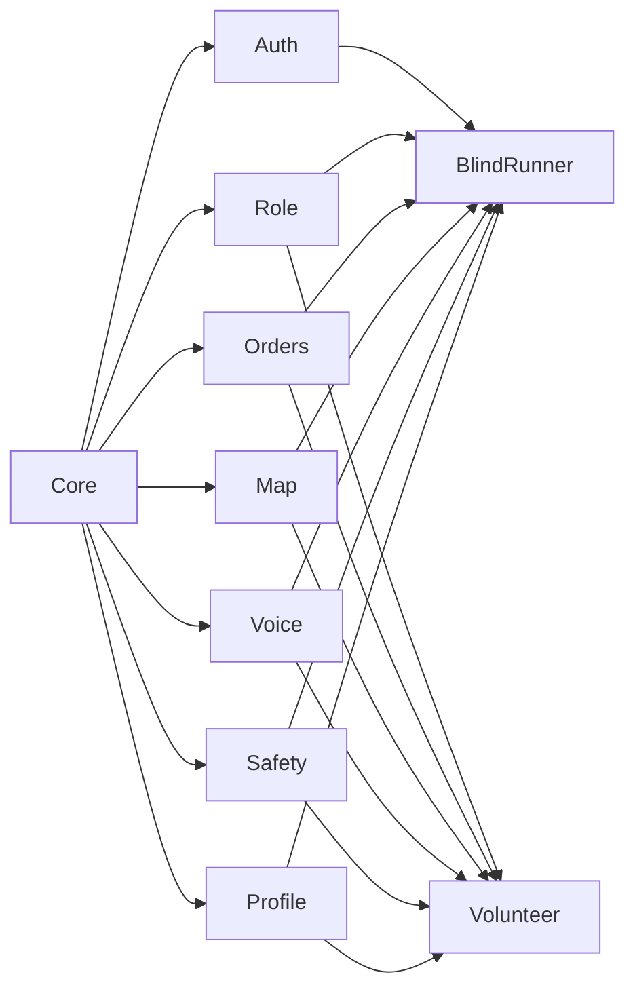

# 架构设计

<cite>
**本文引用的文件**
- [blindRunApp.swift](file://blindRun/blindRunApp.swift)
- [ContentView.swift](file://blindRun/ContentView.swift)
- [08-ios-architecture.md](file://docs/08-ios-architecture.md)
- [04-user-flows-and-state-machine.md](file://docs/04-user-flows-and-state-machine.md)
- [07-api-contract.openapi.yaml](file://docs/07-api-contract.openapi.yaml)
- [09-accessibility-and-voice-guidelines.md](file://docs/09-accessibility-and-voice-guidelines.md)
- [02-mvp-scope.md](file://docs/02-mvp-scope.md)
- [AGENTS.md](file://AGENTS.md)
- [blindRunTests.swift](file://blindRunTests/blindRunTests.swift)
- [blindRunUITests.swift](file://blindRunUITests/blindRunUITests.swift)
- [blindRunUITestsLaunchTests.swift](file://blindRunUITests/blindRunUITestsLaunchTests.swift)
</cite>

## 更新摘要
**变更内容**
- 更新技术栈约束以反映iOS-only和SwiftUI-first架构
- 强调JWT认证和固定验证码登录流程
- 明确禁止Android、WebSocket、真实SMS等非MVP功能
- 更新高德地图和真实定位的技术要求
- 强化TTS和语音输入的实现约束
- 更新轮询机制和状态管理策略

## 目录
1. [引言](#引言)
2. [项目结构](#项目结构)
3. [核心组件](#核心组件)
4. [架构总览](#架构总览)
5. [详细组件分析](#详细组件分析)
6. [依赖分析](#依赖分析)
7. [性能考虑](#性能考虑)
8. [故障排查指南](#故障排查指南)
9. [结论](#结论)
10. [附录](#附录)

## 引言
本文件面向架构师与高级开发者，系统化阐述 blindRun 应用的 SwiftUI + MVVM 架构设计。文档基于AGENTS.md中冻结的MVP方向，聚焦以下主题：
- iOS-only原生Swift开发与SwiftUI-first架构
- JWT认证与固定验证码登录流程
- View、ViewModel、Service、Model 的职责分离与交互关系
- 模块化架构设计与功能模块间的依赖与通信
- 异步编程模式、状态管理与数据流设计
- 架构决策的技术考量、权衡与约束
- 系统边界与组件交互图
- 跨平台兼容性、性能优化与可扩展性设计

## 项目结构
blindRun 当前仓库包含应用壳与文档两大部分，严格遵循iOS-only和SwiftUI-first约束：
- 应用壳：最小可运行的SwiftUI应用入口与基础视图
- 文档：iOS架构、用户流程与状态机、API合同、无障碍与语音规范等

**图表来源**
- [blindRunApp.swift:1-18](file://blindRun/blindRunApp.swift#L1-L18)
- [ContentView.swift:1-25](file://blindRun/ContentView.swift#L1-L25)
- [08-ios-architecture.md:1-165](file://docs/08-ios-architecture.md#L1-L165)
- [04-user-flows-and-state-machine.md:1-309](file://docs/04-user-flows-and-state-machine.md#L1-L309)
- [07-api-contract.openapi.yaml:1-800](file://docs/07-api-contract.openapi.yaml#L1-L800)
- [09-accessibility-and-voice-guidelines.md:1-143](file://docs/09-accessibility-and-voice-guidelines.md#L1-L143)
- [02-mvp-scope.md:119-153](file://docs/02-mvp-scope.md#L119-L153)
- [AGENTS.md:27-48](file://AGENTS.md#L27-L48)

**章节来源**
- [blindRunApp.swift:1-18](file://blindRun/blindRunApp.swift#L1-L18)
- [ContentView.swift:1-25](file://blindRun/ContentView.swift#L1-L25)
- [08-ios-architecture.md:18-49](file://docs/08-ios-architecture.md#L18-L49)
- [AGENTS.md:27-48](file://AGENTS.md#L27-L48)

## 核心组件
根据AGENTS.md中冻结的MVP方向，blindRun的SwiftUI + MVVM实现要点如下：

- **平台约束**
  - iOS-only原生Swift开发，SwiftUI-first架构
  - iOS 16+最低系统版本要求
  - 禁止Android、Flutter等其他平台实现

- **View（视图）**
  - 保持轻薄：仅负责渲染状态与转发用户意图
  - 与ViewModel解耦，不直接持有业务逻辑
  - 遵循SwiftUI最佳实践，使用@State、@ObservableObject等现代特性
  - 示例参考：[ContentView.swift:10-20](file://blindRun/ContentView.swift#L10-L20)

- **ViewModel（视图模型）**
  - 负责加载状态、校验状态、API调用、轮询与TTS触发
  - 遵循MVVM模式，使用ObservableObject管理状态
  - 示例参考：Auth、BlindBooking、BlindOrderStatus、VolunteerHome、VolunteerOrderDetail等推荐VM
    - [08-ios-architecture.md:44-48](file://docs/08-ios-architecture.md#L44-L48)

- **Service（服务）**
  - 封装API与平台能力边界
  - APIClient负责构建请求、附加鉴权头、解码响应、错误映射与简单重试策略
  - 遵循协议化设计，支持Mock与真实实现
  - 参考：[08-ios-architecture.md:68-82](file://docs/08-ios-architecture.md#L68-L82)

- **Model（模型）**
  - DTO与领域助手：DTO对齐OpenAPI；领域助手处理展示文本与状态转换
  - 遵循JSON Codable协议，支持序列化与反序列化
  - 参考：[08-ios-architecture.md:40](file://docs/08-ios-architecture.md#L40)

**章节来源**
- [08-ios-architecture.md:33-49](file://docs/08-ios-architecture.md#L33-L49)
- [ContentView.swift:10-20](file://blindRun/ContentView.swift#L10-L20)
- [AGENTS.md:27-48](file://AGENTS.md#L27-L48)

## 架构总览
下图展示了应用壳与文档对架构的总体要求：SwiftUI + MVVM、模块化分组、API环境切换、APIClient协议、Token持久化、地图与定位、轮询与无障碍语音集成。严格遵循iOS-only和SwiftUI-first约束。

**图表来源**
- [08-ios-architecture.md:5-16](file://docs/08-ios-architecture.md#L5-L16)
- [08-ios-architecture.md:18-31](file://docs/08-ios-architecture.md#L18-L31)
- [08-ios-architecture.md:50-66](file://docs/08-ios-architecture.md#L50-L66)
- [08-ios-architecture.md:68-82](file://docs/08-ios-architecture.md#L68-L82)
- [08-ios-architecture.md:98-124](file://docs/08-ios-architecture.md#L98-L124)
- [08-ios-architecture.md:125-138](file://docs/08-ios-architecture.md#L125-L138)
- [09-accessibility-and-voice-guidelines.md:13-35](file://docs/09-accessibility-and-voice-guidelines.md#L13-L35)
- [AGENTS.md:27-48](file://AGENTS.md#L27-L48)

## 详细组件分析

### 组件A：SwiftUI + MVVM与模块化架构
- **职责分离**
  - View：渲染状态、转发用户意图，严格遵循SwiftUI轻薄原则
  - ViewModel：加载/校验状态、API调用、轮询、TTS触发，使用ObservableObject管理状态
  - Service/APIClient：网络边界、错误映射、鉴权头，协议化设计支持Mock
  - Model：DTO与领域助手，遵循JSON Codable协议

- **模块布局**
  - Core、Auth、Role、BlindRunner、Volunteer、Orders、Map、Voice、Safety、Profile
  - 每个模块专注于特定业务领域，避免交叉耦合

- **通信机制**
  - ViewModel通过Service/APIClient访问后端
  - ViewModel通过共享服务（如SpeechService）驱动TTS
  - ViewModel通过依赖注入容器管理模块间协作
  - 遵循iOS原生架构模式，避免跨平台抽象

**图表来源**
- [08-ios-architecture.md:33-49](file://docs/08-ios-architecture.md#L33-L49)
- [08-ios-architecture.md:68-82](file://docs/08-ios-architecture.md#L68-L82)
- [AGENTS.md:27-48](file://AGENTS.md#L27-L48)

**章节来源**
- [08-ios-architecture.md:18-31](file://docs/08-ios-architecture.md#L18-L31)
- [08-ios-architecture.md:33-49](file://docs/08-ios-architecture.md#L33-L49)
- [AGENTS.md:27-48](file://AGENTS.md#L27-L48)

### 组件B：API环境切换与APIClient
- **环境配置**
  - mock、localBackend、production三种环境
  - 在Debug构建暴露小环境选择器
  - 遵循AGENTS.md的硬约束，禁止Android、WebSocket等非MVP功能

- **APIClient设计**
  - 协议化，Mock与URLSession实现共享调用点
  - 鉴权头、错误映射、简单重试策略
  - 支持REST API，使用POST /api/orders/{orderId}/{action}状态流转

- **Token存储**
  - MVP使用UserDefaults；生产需迁移到Keychain
  - 遵循JWT Bearer认证标准

**图表来源**
- [08-ios-architecture.md:50-66](file://docs/08-ios-architecture.md#L50-L66)
- [08-ios-architecture.md:68-82](file://docs/08-ios-architecture.md#L68-L82)
- [AGENTS.md:40-42](file://AGENTS.md#L40-L42)

**章节来源**
- [08-ios-architecture.md:50-66](file://docs/08-ios-architecture.md#L50-L66)
- [08-ios-architecture.md:78-82](file://docs/08-ios-architecture.md#L78-L82)
- [02-mvp-scope.md:136-151](file://docs/02-mvp-scope.md#L136-L151)
- [AGENTS.md:40-42](file://AGENTS.md#L40-L42)

### 组件C：用户流程与状态机（轮询与TTS）
- **订单状态机**
  - matching → accepted → arrived → in_progress → completed
  - emergency为异常终态，不支持恢复
  - 严格遵循AGENTS.md的状态定义，禁止使用submit、contacted等状态

- **轮询机制**
  - 盲人端与志愿者端在相关页面按5秒轮询
  - 状态变化时播报TTS，避免轮询噪音
  - 遵循AGENTS.md的轮询约束，不使用WebSocket

- **TTS与无障碍**
  - 关键节点播报：进入首页、订单提交、匹配中、志愿者已接单、到达、确认开始、服务开始、完成、求助、错误
  - 每个关键盲人页面提供"重复当前状态"按钮
  - 使用AVSpeechSynthesizer，遵循无障碍规范

**图表来源**
- [04-user-flows-and-state-machine.md:72-96](file://docs/04-user-flows-and-state-machine.md#L72-L96)

**图表来源**
- [04-user-flows-and-state-machine.md:275-299](file://docs/04-user-flows-and-state-machine.md#L275-L299)
- [09-accessibility-and-voice-guidelines.md:13-35](file://docs/09-accessibility-and-voice-guidelines.md#L13-L35)
- [AGENTS.md:126-139](file://AGENTS.md#L126-L139)

**章节来源**
- [04-user-flows-and-state-machine.md:72-96](file://docs/04-user-flows-and-state-machine.md#L72-L96)
- [04-user-flows-and-state-machine.md:275-299](file://docs/04-user-flows-and-state-machine.md#L275-L299)
- [09-accessibility-and-voice-guidelines.md:13-35](file://docs/09-accessibility-and-voice-guidelines.md#L13-L35)
- [AGENTS.md:126-139](file://AGENTS.md#L126-L139)

### 组件D：地图与定位、语音与无障碍
- **地图与定位**
  - 高德地图显示真实地图、当前位置、订单起点标记
  - iOS侧计算志愿者到起点的距离并排序
  - 模拟器回退坐标，但需提示真实定位权限要求
  - 遵循AGENTS.md的地图约束，不使用Apple MapKit

- **语音与无障碍**
  - TTS播报关键节点；每个关键盲人页面提供"重复当前状态"
  - VoiceOver标签与提示；大按钮（≥64pt）；危险操作二次确认
  - 语音输入限于文本字段，失败时允许键盘输入
  - 使用AVSpeechSynthesizer和iOS Speech框架

**图表来源**
- [08-ios-architecture.md:98-124](file://docs/08-ios-architecture.md#L98-L124)
- [09-accessibility-and-voice-guidelines.md:13-35](file://docs/09-accessibility-and-voice-guidelines.md#L13-L35)
- [AGENTS.md:253-273](file://AGENTS.md#L253-L273)

**章节来源**
- [08-ios-architecture.md:98-124](file://docs/08-ios-architecture.md#L98-L124)
- [09-accessibility-and-voice-guidelines.md:37-107](file://docs/09-accessibility-and-voice-guidelines.md#L37-L107)
- [AGENTS.md:253-273](file://AGENTS.md#L253-L273)

### 组件E：认证与角色切换
- **认证流程**
  - 手机号登录 + 固定验证码123456；JWT返回与持久化
  - 首次登录可能无activeRole，引导角色选择
  - 遵循AGENTS.md的认证约束，不使用真实SMS服务

- **角色切换**
  - 共享JWT；仅切换activeRole
  - 若存在活跃订单，禁止切换并提示
  - 遵循AGENTS.md的角色约束，只支持blind_runner和volunteer两个角色

**图表来源**
- [08-ios-architecture.md:84-96](file://docs/08-ios-architecture.md#L84-L96)
- [AGENTS.md:94-107](file://AGENTS.md#L94-L107)

**章节来源**
- [08-ios-architecture.md:84-96](file://docs/08-ios-architecture.md#L84-L96)
- [AGENTS.md:94-107](file://AGENTS.md#L94-L107)

## 依赖分析
- **模块内聚与耦合**
  - Core：应用环境、依赖容器、共享模型、应用状态
  - Auth/Role：认证与会话、角色切换与守卫
  - BlindRunner/Volunteer：各自功能域的视图、VM、Service
  - Orders：订单DTO、状态机辅助、轮询
  - Map：高德桥接、定位、标记、距离计算
  - Voice：TTS、重复状态、语音输入
  - Safety：紧急确认与取消确认流程
  - Profile：盲人与志愿者资料表单

- **外部依赖**
  - 平台：SwiftUI、UIKit（必要时桥接）、URLSession、UserDefaults、Keychain（生产）
  - 第三方：高德地图 SDK、AVSpeechSynthesizer、Speech框架
  - 遵循AGENTS.md的硬约束，禁止WebSocket、真实SMS等

- **依赖方向**
  - View → ViewModel（单向）
  - ViewModel → Service（单向）
  - Service → APIClient（单向）
  - APIClient → 后端（外部）

**图表来源**
- [08-ios-architecture.md:18-31](file://docs/08-ios-architecture.md#L18-L31)
- [AGENTS.md:64-92](file://AGENTS.md#L64-L92)

**章节来源**
- [08-ios-architecture.md:18-31](file://docs/08-ios-architecture.md#L18-L31)
- [AGENTS.md:64-92](file://AGENTS.md#L64-L92)

## 性能考虑
- **轮询节流**
  - 5秒间隔，仅在相关页面启用；页面消失或订单进入终态即停止
  - 遵循AGENTS.md的轮询约束，不使用WebSocket

- **网络与解析**
  - URLSession原生实现，避免额外依赖；错误映射与简单重试
  - 支持REST API，使用统一的错误响应结构

- **UI响应**
  - ViewModel负责状态与异步，View保持轻薄，降低主线程压力
  - 遵循SwiftUI最佳实践，使用@MainActor确保UI更新

- **无障碍与语音**
  - 避免重复播报；"重复当前状态"按钮减少不必要的TTS调用
  - 使用AVSpeechSynthesizer，遵循iOS语音框架规范

- **存储与安全**
  - MVP使用UserDefaults；生产迁移Keychain，提升安全性与稳定性
  - 遵循AGENTS.md的安全约束，不使用真实SMS服务

**章节来源**
- [04-user-flows-and-state-machine.md:275-299](file://docs/04-user-flows-and-state-machine.md#L275-L299)
- [08-ios-architecture.md:68-82](file://docs/08-ios-architecture.md#L68-L82)
- [09-accessibility-and-voice-guidelines.md:30-35](file://docs/09-accessibility-and-voice-guidelines.md#L30-L35)
- [02-mvp-scope.md:127](file://docs/02-mvp-scope.md#L127)
- [AGENTS.md:223-238](file://AGENTS.md#L223-L238)

## 故障排查指南
- **环境配置**
  - 确认API环境选择与baseURL设置；localBackend支持局域网IP
  - 遵循AGENTS.md的环境约束，不使用Android或WebSocket

- **认证与会话**
  - 检查UserDefaults中JWT是否存在；登录失败时核对验证码与后端错误码
  - 验证码固定为123456，不使用真实SMS服务

- **轮询与状态**
  - 确认轮询仅在相关页面启用；状态变化时TTS是否播报；页面消失后轮询是否停止
  - 遵循AGENTS.md的轮询约束，每5秒轮询一次

- **地图与定位**
  - 定位权限被拒时阻断相关流程；模拟器回退坐标仅用于演示
  - 遵循AGENTS.md的地图约束，使用高德地图而非Apple MapKit

- **无障碍与语音**
  - VoiceOver标签与提示是否完整；TTS是否覆盖关键节点；"重复当前状态"是否可用
  - 使用AVSpeechSynthesizer和iOS Speech框架

**章节来源**
- [08-ios-architecture.md:50-66](file://docs/08-ios-architecture.md#L50-L66)
- [08-ios-architecture.md:78-82](file://docs/08-ios-architecture.md#L78-L82)
- [04-user-flows-and-state-machine.md:275-299](file://docs/04-user-flows-and-state-machine.md#L275-L299)
- [08-ios-architecture.md:107-117](file://docs/08-ios-architecture.md#L107-L117)
- [09-accessibility-and-voice-guidelines.md:37-69](file://docs/09-accessibility-and-voice-guidelines.md#L37-L69)
- [AGENTS.md:40-46](file://AGENTS.md#L40-L46)

## 结论
blindRun的SwiftUI + MVVM架构以清晰的职责分离与模块化设计为基础，严格遵循AGENTS.md中冻结的MVP方向，结合iOS-only开发、SwiftUI-first架构、JWT认证、高德地图与真实定位、轮询与无障碍语音等关键能力，满足3天内可演示版本的需求。未来演进方向包括：
- 完成各模块的ViewModel、Service与DTO实现
- 生产环境迁移Token存储至Keychain
- 基于OpenAPI合同生成客户端代码，统一数据契约
- 逐步引入更完善的错误处理与重试策略
- 扩展模块边界与跨模块通信协议
- 遵循AGENTS.md的硬约束，不引入Android、WebSocket、真实SMS等功能

## 附录
- **测试与验证**
  - 单元测试与UI测试模板位于blindRunTests与blindRunUITests
  - Launch性能测试用于评估启动耗时
  - 遵循AGENTS.md的验证命令，使用openspec validate和xcodebuild

- **API合同**
  - OpenAPI合同定义了认证、用户、资料、志愿者、订单等端点与错误码
  - 支持REST API，使用POST /api/orders/{orderId}/{action}状态流转
  - 遵循AGENTS.md的后端约束，使用Spring Boot和H2数据库

**章节来源**
- [blindRunTests.swift:1-39](file://blindRunTests/blindRunTests.swift#L1-L39)
- [blindRunUITests.swift:1-44](file://blindRunUITests/blindRunUITests.swift#L1-L44)
- [blindRunUITestsLaunchTests.swift:1-36](file://blindRunUITests/blindRunUITestsLaunchTests.swift#L1-L36)
- [07-api-contract.openapi.yaml:25-452](file://docs/07-api-contract.openapi.yaml#L25-L452)
- [AGENTS.md:378-415](file://AGENTS.md#L378-L415)