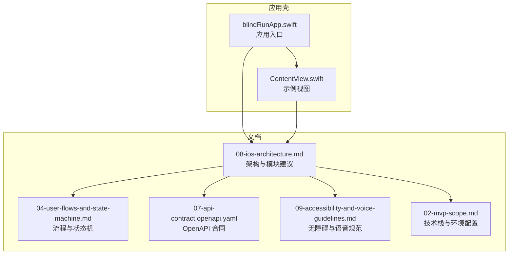
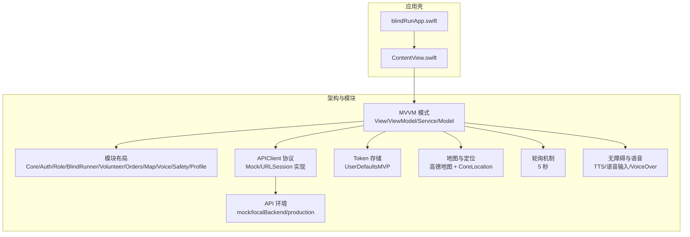
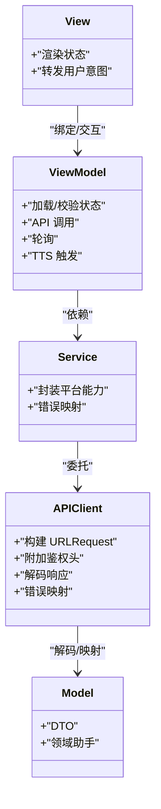
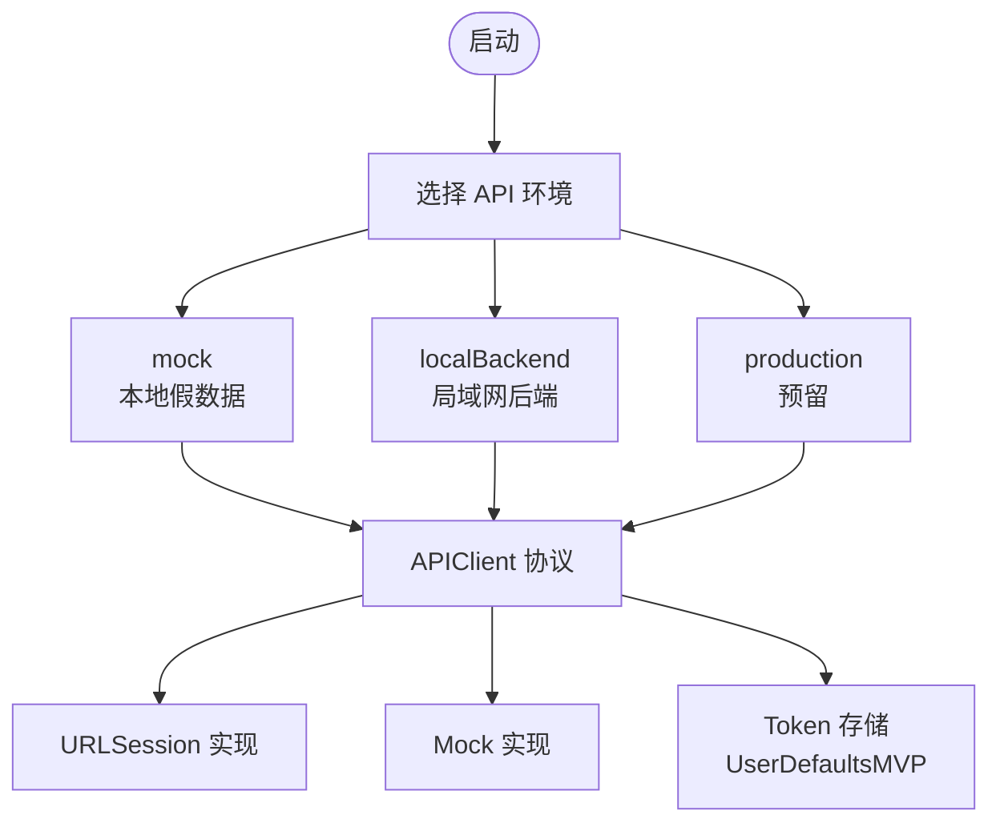
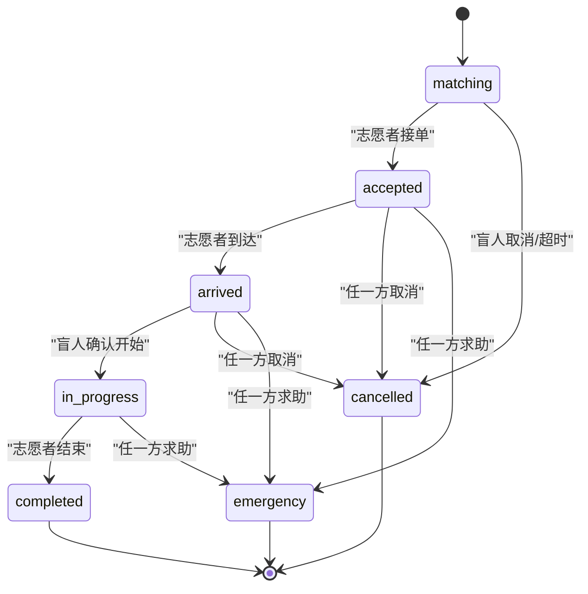
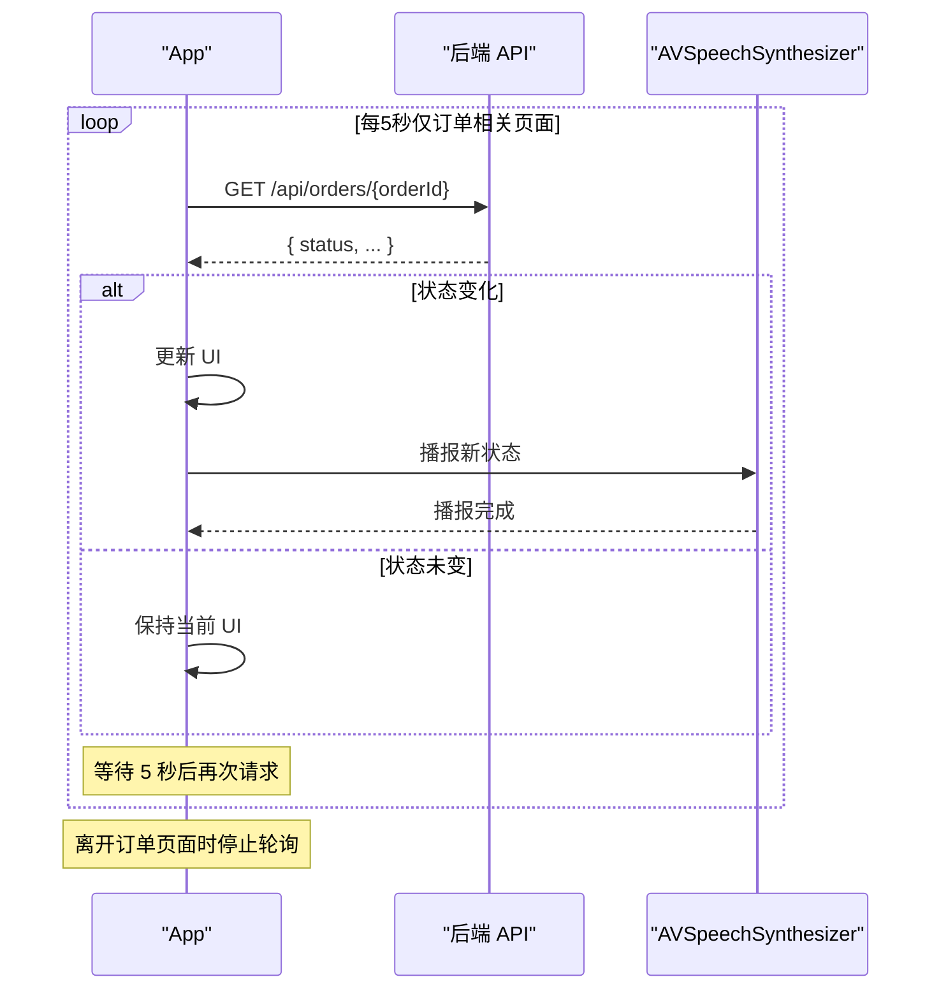
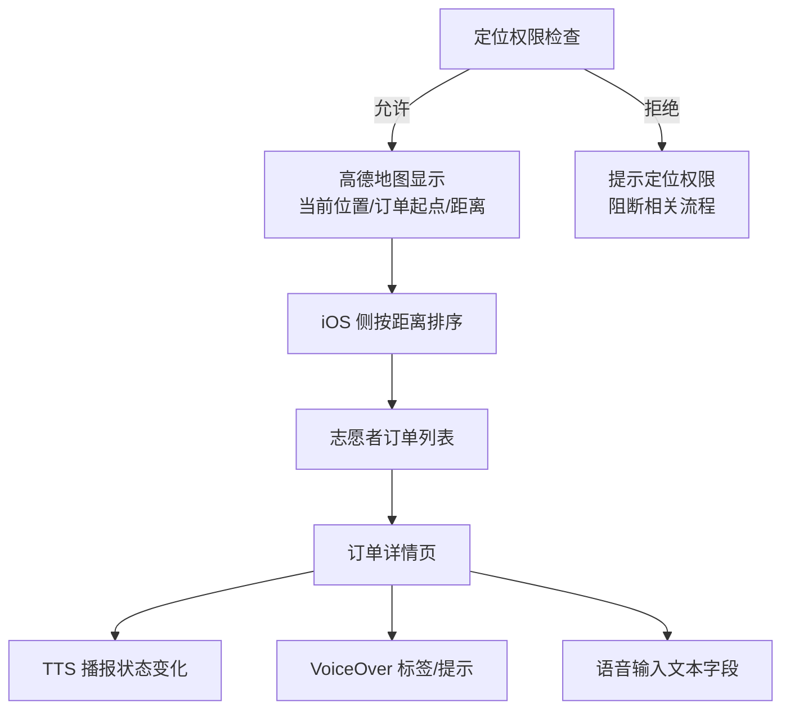
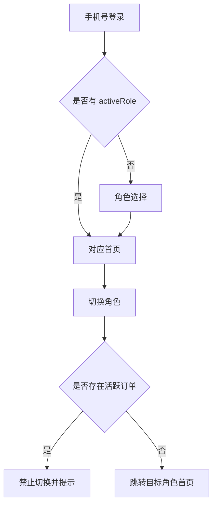
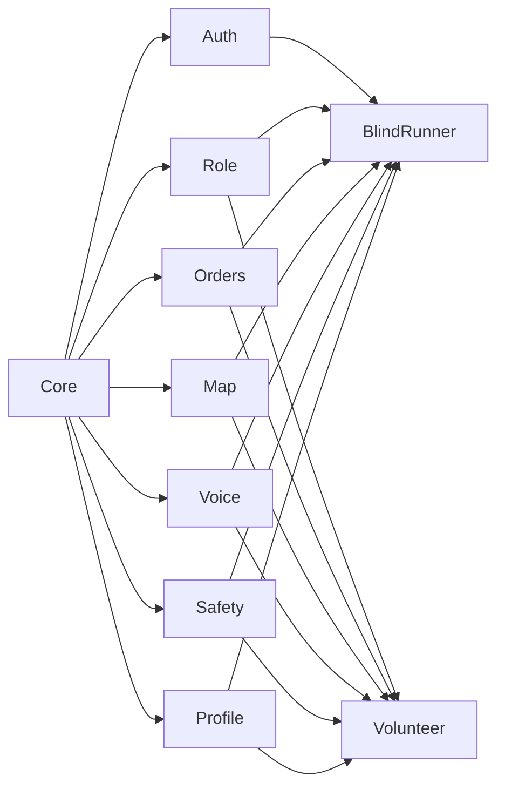

# 架构设计

<cite>
**本文引用的文件**
- [blindRunApp.swift](file://blindRun/blindRunApp.swift)
- [ContentView.swift](file://blindRun/ContentView.swift)
- [08-ios-architecture.md](file://docs/08-ios-architecture.md)
- [04-user-flows-and-state-machine.md](file://docs/04-user-flows-and-state-machine.md)
- [07-api-contract.openapi.yaml](file://docs/07-api-contract.openapi.yaml)
- [09-accessibility-and-voice-guidelines.md](file://docs/09-accessibility-and-voice-guidelines.md)
- [02-mvp-scope.md](file://docs/02-mvp-scope.md)
- [blindRunTests.swift](file://blindRunTests/blindRunTests.swift)
- [blindRunUITests.swift](file://blindRunUITests/blindRunUITests.swift)
- [blindRunUITestsLaunchTests.swift](file://blindRunUITests/blindRunUITestsLaunchTests.swift)
</cite>

## 目录
1. [引言](#引言)
2. [项目结构](#项目结构)
3. [核心组件](#核心组件)
4. [架构总览](#架构总览)
5. [详细组件分析](#详细组件分析)
6. [依赖分析](#依赖分析)
7. [性能考虑](#性能考虑)
8. [故障排查指南](#故障排查指南)
9. [结论](#结论)
10. [附录](#附录)

## 引言
本文件面向架构师与高级开发者，系统化阐述 blindRun 应用的 SwiftUI + MVVM 架构设计。文档基于现有架构与产品文档，聚焦以下主题：
- View、ViewModel、Service、Model 的职责分离与交互关系
- 模块化架构设计与功能模块间的依赖与通信
- 异步编程模式、状态管理与数据流设计
- 架构决策的技术考量、权衡与约束
- 系统边界与组件交互图
- 跨平台兼容性、性能优化与可扩展性设计

## 项目结构
blindRun 当前仓库包含应用壳与文档两大部分：
- 应用壳：最小可运行的 SwiftUI 应用入口与基础视图
- 文档：iOS 架构、用户流程与状态机、API 合同、无障碍与语音规范等

图表来源
- [blindRunApp.swift:1-18](file://blindRun/blindRunApp.swift#L1-L18)
- [ContentView.swift:1-25](file://blindRun/ContentView.swift#L1-L25)
- [08-ios-architecture.md:1-165](file://docs/08-ios-architecture.md#L1-L165)
- [04-user-flows-and-state-machine.md:1-309](file://docs/04-user-flows-and-state-machine.md#L1-L309)
- [07-api-contract.openapi.yaml:1-800](file://docs/07-api-contract.openapi.yaml#L1-L800)
- [09-accessibility-and-voice-guidelines.md:1-143](file://docs/09-accessibility-and-voice-guidelines.md#L1-L143)
- [02-mvp-scope.md:119-153](file://docs/02-mvp-scope.md#L119-L153)

章节来源
- [blindRunApp.swift:1-18](file://blindRun/blindRunApp.swift#L1-L18)
- [ContentView.swift:1-25](file://blindRun/ContentView.swift#L1-L25)
- [08-ios-architecture.md:18-49](file://docs/08-ios-architecture.md#L18-L49)

## 核心组件
根据架构文档，blindRun 的 SwiftUI + MVVM 实现要点如下：

- View（视图）
  - 保持轻薄：仅负责渲染状态与转发用户意图
  - 与 ViewModel 解耦，不直接持有业务逻辑
  - 示例参考：[ContentView.swift:10-20](file://blindRun/ContentView.swift#L10-L20)

- ViewModel（视图模型）
  - 负责加载状态、校验状态、API 调用、轮询与 TTS 触发
  - 示例参考：Auth、BlindBooking、BlindOrderStatus、VolunteerHome、VolunteerOrderDetail 等推荐 VM
    - [08-ios-architecture.md:44-48](file://docs/08-ios-architecture.md#L44-L48)

- Service（服务）
  - 封装 API 与平台能力边界
  - APIClient 负责构建请求、附加鉴权头、解码响应、错误映射与简单重试策略
  - 参考：[08-ios-architecture.md:68-82](file://docs/08-ios-architecture.md#L68-L82)

- Model（模型）
  - DTO 与领域助手：DTO 对齐 OpenAPI；领域助手处理展示文本与状态转换
  - 参考：[08-ios-architecture.md:40](file://docs/08-ios-architecture.md#L40)

章节来源
- [08-ios-architecture.md:33-49](file://docs/08-ios-architecture.md#L33-L49)
- [ContentView.swift:10-20](file://blindRun/ContentView.swift#L10-L20)

## 架构总览
下图展示了应用壳与文档对架构的总体要求：SwiftUI + MVVM、模块化分组、API 环境切换、APIClient 协议、Token 持久化、地图与定位、轮询与无障碍语音集成。

图表来源
- [08-ios-architecture.md:5-16](file://docs/08-ios-architecture.md#L5-L16)
- [08-ios-architecture.md:18-31](file://docs/08-ios-architecture.md#L18-L31)
- [08-ios-architecture.md:50-66](file://docs/08-ios-architecture.md#L50-L66)
- [08-ios-architecture.md:68-82](file://docs/08-ios-architecture.md#L68-L82)
- [08-ios-architecture.md:98-124](file://docs/08-ios-architecture.md#L98-L124)
- [08-ios-architecture.md:125-138](file://docs/08-ios-architecture.md#L125-L138)
- [09-accessibility-and-voice-guidelines.md:13-35](file://docs/09-accessibility-and-voice-guidelines.md#L13-L35)

## 详细组件分析

### 组件 A：MVVM 与模块化架构
- 职责分离
  - View：渲染状态、转发用户意图
  - ViewModel：加载/校验状态、API 调用、轮询、TTS 触发
  - Service/APIClient：网络边界、错误映射、鉴权头
  - Model：DTO 与领域助手
- 模块布局
  - Core、Auth、Role、BlindRunner、Volunteer、Orders、Map、Voice、Safety、Profile
- 通信机制
  - ViewModel 通过 Service/APIClient 访问后端
  - ViewModel 通过共享服务（如 SpeechService）驱动 TTS
  - ViewModel 通过依赖注入容器管理模块间协作

图表来源
- [08-ios-architecture.md:33-49](file://docs/08-ios-architecture.md#L33-L49)
- [08-ios-architecture.md:68-82](file://docs/08-ios-architecture.md#L68-L82)

章节来源
- [08-ios-architecture.md:18-31](file://docs/08-ios-architecture.md#L18-L31)
- [08-ios-architecture.md:33-49](file://docs/08-ios-architecture.md#L33-L49)

### 组件 B：API 环境切换与 APIClient
- 环境
  - mock、localBackend、production
  - 在 Debug 构建暴露小环境选择器
- APIClient
  - 协议化，Mock 与 URLSession 实现共享调用点
  - 鉴权头、错误映射、简单重试策略
- Token 存储
  - MVP 使用 UserDefaults；生产需迁移到 Keychain

图表来源
- [08-ios-architecture.md:50-66](file://docs/08-ios-architecture.md#L50-L66)
- [08-ios-architecture.md:68-82](file://docs/08-ios-architecture.md#L68-L82)

章节来源
- [08-ios-architecture.md:50-66](file://docs/08-ios-architecture.md#L50-L66)
- [08-ios-architecture.md:78-82](file://docs/08-ios-architecture.md#L78-L82)
- [02-mvp-scope.md:136-151](file://docs/02-mvp-scope.md#L136-L151)

### 组件 C：用户流程与状态机（轮询与 TTS）
- 订单状态机
  - matching → accepted → arrived → in_progress → completed
  - emergency 为异常终态，不支持恢复
- 轮询
  - 盲人端与志愿者端在相关页面按 5 秒轮询
  - 状态变化时播报 TTS，避免轮询噪音
- TTS 与无障碍
  - 关键节点播报：进入首页、订单提交、匹配中、志愿者已接单、到达、确认开始、服务开始、完成、求助、错误
  - 每个关键盲人页面提供“重复当前状态”按钮

图表来源
- [04-user-flows-and-state-machine.md:72-96](file://docs/04-user-flows-and-state-machine.md#L72-L96)

图表来源
- [04-user-flows-and-state-machine.md:275-299](file://docs/04-user-flows-and-state-machine.md#L275-L299)
- [09-accessibility-and-voice-guidelines.md:13-35](file://docs/09-accessibility-and-voice-guidelines.md#L13-L35)

章节来源
- [04-user-flows-and-state-machine.md:72-96](file://docs/04-user-flows-and-state-machine.md#L72-L96)
- [04-user-flows-and-state-machine.md:275-299](file://docs/04-user-flows-and-state-machine.md#L275-L299)
- [09-accessibility-and-voice-guidelines.md:13-35](file://docs/09-accessibility-and-voice-guidelines.md#L13-L35)

### 组件 D：地图与定位、语音与无障碍
- 地图与定位
  - 高德地图显示真实地图、当前位置、订单起点标记
  - iOS 侧计算志愿者到起点的距离并排序
  - 模拟器回退坐标，但需提示真实定位权限要求
- 语音与无障碍
  - TTS 播报关键节点；每个关键盲人页面提供“重复当前状态”
  - VoiceOver 标签与提示；大按钮（≥64pt）；危险操作二次确认
  - 语音输入限于文本字段，失败时允许键盘输入

图表来源
- [08-ios-architecture.md:98-124](file://docs/08-ios-architecture.md#L98-L124)
- [09-accessibility-and-voice-guidelines.md:13-35](file://docs/09-accessibility-and-voice-guidelines.md#L13-L35)

章节来源
- [08-ios-architecture.md:98-124](file://docs/08-ios-architecture.md#L98-L124)
- [09-accessibility-and-voice-guidelines.md:37-107](file://docs/09-accessibility-and-voice-guidelines.md#L37-L107)

### 组件 E：认证与角色切换
- 认证
  - 手机号登录 + 固定验证码；JWT 返回与持久化
  - 首次登录可能无 activeRole，引导角色选择
- 角色切换
  - 共享 JWT；仅切换 activeRole
  - 若存在活跃订单，禁止切换并提示

图表来源
- [08-ios-architecture.md:84-96](file://docs/08-ios-architecture.md#L84-L96)

章节来源
- [08-ios-architecture.md:84-96](file://docs/08-ios-architecture.md#L84-L96)

## 依赖分析
- 模块内聚与耦合
  - Core：应用环境、依赖容器、共享模型、应用状态
  - Auth/Role：认证与会话、角色切换与守卫
  - BlindRunner/Volunteer：各自功能域的视图、VM、Service
  - Orders：订单 DTO、状态机辅助、轮询
  - Map：高德桥接、定位、标记、距离计算
  - Voice：TTS、重复状态、语音输入
  - Safety：紧急确认与取消确认流程
  - Profile：盲人与志愿者资料表单
- 外部依赖
  - 平台：SwiftUI、UIKit（必要时桥接）、URLSession、UserDefaults、Keychain（生产）
  - 第三方：高德地图 SDK、AVSpeechSynthesizer、Speech 框架
- 依赖方向
  - View → ViewModel（单向）
  - ViewModel → Service（单向）
  - Service → APIClient（单向）
  - APIClient → 后端（外部）

图表来源
- [08-ios-architecture.md:18-31](file://docs/08-ios-architecture.md#L18-L31)

章节来源
- [08-ios-architecture.md:18-31](file://docs/08-ios-architecture.md#L18-L31)

## 性能考虑
- 轮询节流
  - 5 秒间隔，仅在相关页面启用；页面消失或订单进入终态即停止
- 网络与解析
  - URLSession 原生实现，避免额外依赖；错误映射与简单重试
- UI 响应
  - ViewModel 负责状态与异步，View 保持轻薄，降低主线程压力
- 无障碍与语音
  - 避免重复播报；“重复当前状态”按钮减少不必要的 TTS 调用
- 存储与安全
  - MVP 使用 UserDefaults；生产迁移 Keychain，提升安全性与稳定性

章节来源
- [04-user-flows-and-state-machine.md:275-299](file://docs/04-user-flows-and-state-machine.md#L275-L299)
- [08-ios-architecture.md:68-82](file://docs/08-ios-architecture.md#L68-L82)
- [09-accessibility-and-voice-guidelines.md:30-35](file://docs/09-accessibility-and-voice-guidelines.md#L30-L35)
- [02-mvp-scope.md:127](file://docs/02-mvp-scope.md#L127)

## 故障排查指南
- 环境配置
  - 确认 API 环境选择与 baseURL 设置；localBackend 支持局域网 IP
  - 参考：[08-ios-architecture.md:50-66](file://docs/08-ios-architecture.md#L50-L66)
- 认证与会话
  - 检查 UserDefaults 中 JWT 是否存在；登录失败时核对验证码与后端错误码
  - 参考：[08-ios-architecture.md:78-82](file://docs/08-ios-architecture.md#L78-L82)
- 轮询与状态
  - 确认轮询仅在相关页面启用；状态变化时 TTS 是否播报；页面消失后轮询是否停止
  - 参考：[04-user-flows-and-state-machine.md:275-299](file://docs/04-user-flows-and-state-machine.md#L275-L299)
- 地图与定位
  - 定位权限被拒时阻断相关流程；模拟器回退坐标仅用于演示
  - 参考：[08-ios-architecture.md:107-117](file://docs/08-ios-architecture.md#L107-L117)
- 无障碍与语音
  - VoiceOver 标签与提示是否完整；TTS 是否覆盖关键节点；“重复当前状态”是否可用
  - 参考：[09-accessibility-and-voice-guidelines.md:37-69](file://docs/09-accessibility-and-voice-guidelines.md#L37-L69)

章节来源
- [08-ios-architecture.md:50-66](file://docs/08-ios-architecture.md#L50-L66)
- [08-ios-architecture.md:78-82](file://docs/08-ios-architecture.md#L78-L82)
- [04-user-flows-and-state-machine.md:275-299](file://docs/04-user-flows-and-state-machine.md#L275-L299)
- [08-ios-architecture.md:107-117](file://docs/08-ios-architecture.md#L107-L117)
- [09-accessibility-and-voice-guidelines.md:37-69](file://docs/09-accessibility-and-voice-guidelines.md#L37-L69)

## 结论
blindRun 的 SwiftUI + MVVM 架构以清晰的职责分离与模块化设计为基础，结合 APIClient 协议化、环境切换、Token 持久化、地图与定位、轮询与无障碍语音等关键能力，满足 MVP 的演示需求。未来演进方向包括：
- 完成各模块的 ViewModel、Service 与 DTO 实现
- 生产环境迁移 Token 存储至 Keychain
- 基于 OpenAPI 合同生成客户端代码，统一数据契约
- 逐步引入更完善的错误处理与重试策略
- 扩展模块边界与跨模块通信协议

## 附录
- 测试与验证
  - 单元测试与 UI 测试模板位于 blindRunTests 与 blindRunUITests
  - Launch 性能测试用于评估启动耗时
- API 合同
  - OpenAPI 合同定义了认证、用户、资料、志愿者、订单等端点与错误码
  - 参考：[07-api-contract.openapi.yaml:25-452](file://docs/07-api-contract.openapi.yaml#L25-L452)

章节来源
- [blindRunTests.swift:1-39](file://blindRunTests/blindRunTests.swift#L1-L39)
- [blindRunUITests.swift:1-44](file://blindRunUITests/blindRunUITests.swift#L1-L44)
- [blindRunUITestsLaunchTests.swift:1-36](file://blindRunUITests/blindRunUITestsLaunchTests.swift#L1-L36)
- [07-api-contract.openapi.yaml:25-452](file://docs/07-api-contract.openapi.yaml#L25-L452)