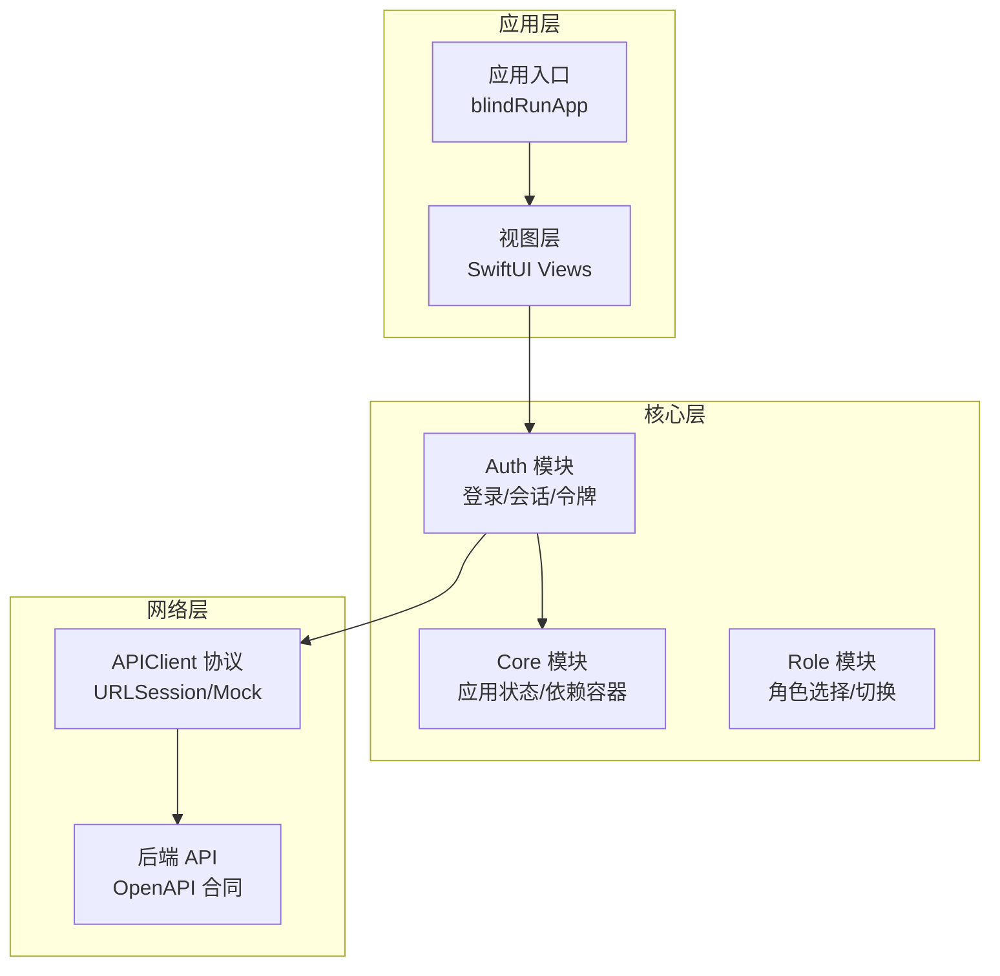
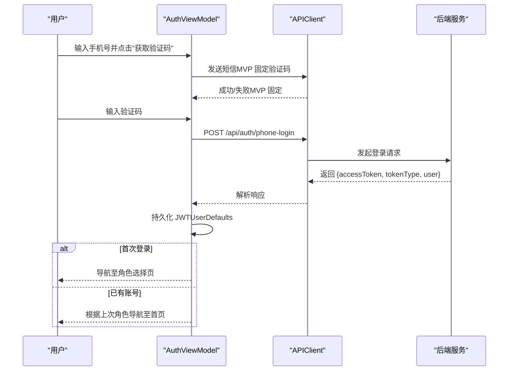
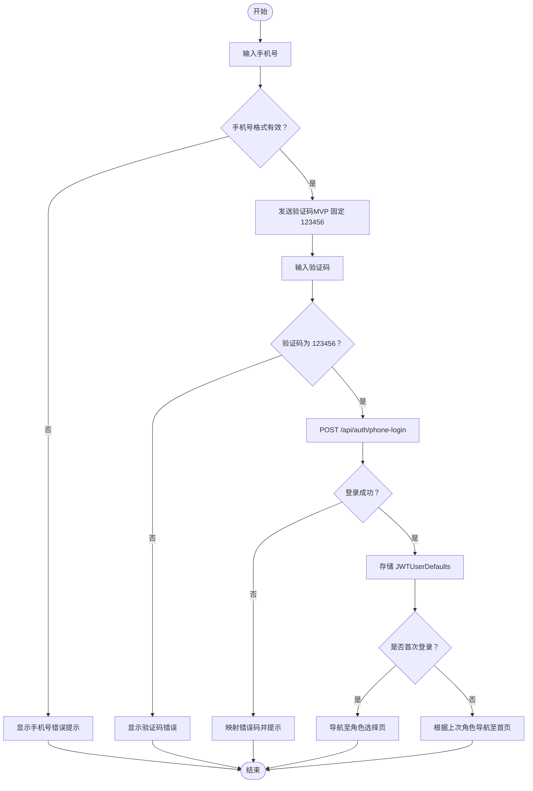
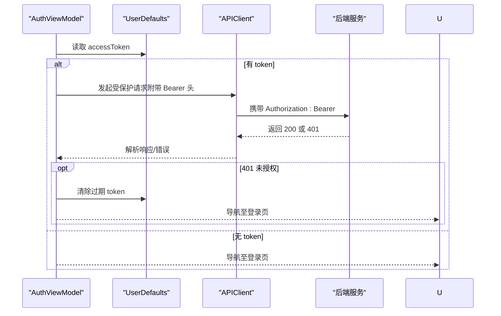
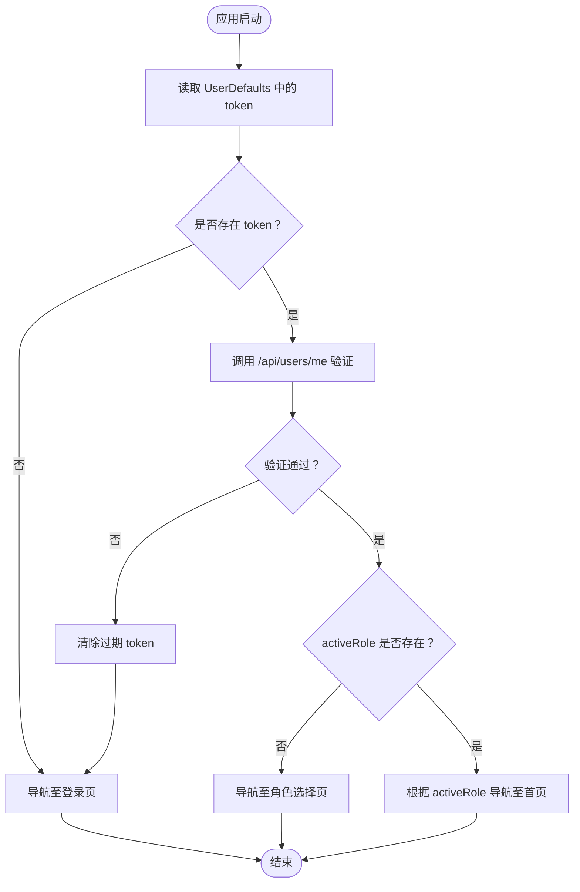
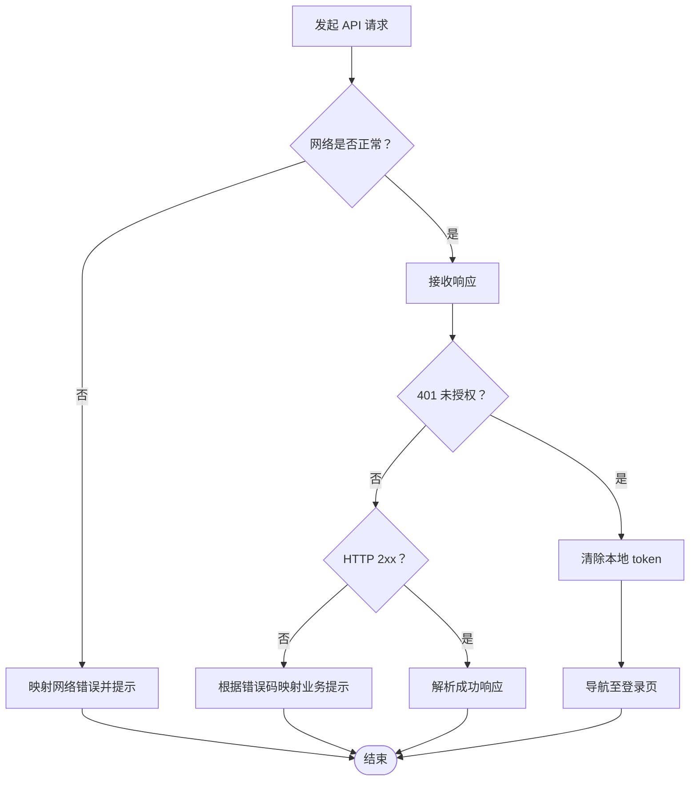
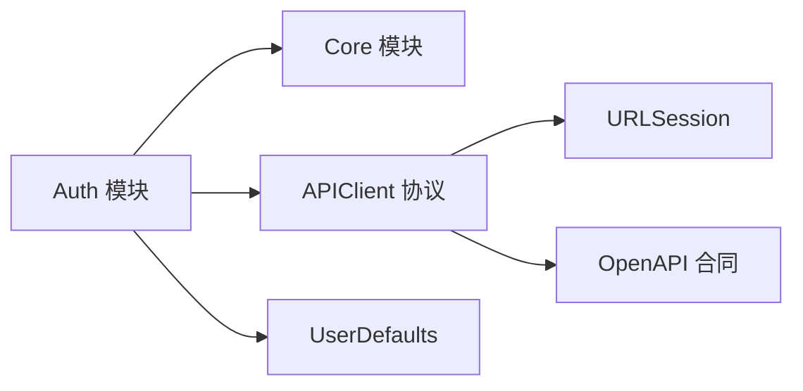

# Auth 认证模块

<cite>
**本文档引用的文件**
- [08-ios-架构.md](file://docs/08-ios-architecture.md)
- [07-api-契约.openapi.yaml](file://docs/07-api-contract.openapi.yaml)
- [03-用户故事.md](file://docs/03-user-stories.md)
- [02-mvp-范围.md](file://docs/02-mvp-scope.md)
- [01-产品需求.md](file://docs/01-product-requirements.md)
- [auth-手机登录.spec.md](file://openspec/changes/add-aidrun-ios-spring-mvp/specs/auth-phone-login/spec.md)
- [tasks.md](file://openspec/changes/add-aidrun-ios-spring-mvp/tasks.md)
- [blindRunApp.swift](file://blindRun/blindRun/blindRunApp.swift)
- [ContentView.swift](file://blindRun/blindRun/ContentView.swift)
</cite>

## 目录
1. [简介](#简介)
2. [项目结构](#项目结构)
3. [核心组件](#核心组件)
4. [架构总览](#架构总览)
5. [详细组件分析](#详细组件分析)
6. [依赖关系分析](#依赖关系分析)
7. [性能考虑](#性能考虑)
8. [故障排查指南](#故障排查指南)
9. [结论](#结论)
10. [附录](#附录)

## 简介
本文件为 AidRun iOS MVP v0.3 的 Auth 认证模块技术文档，聚焦手机号登录与 JWT 会话管理的完整实现路径。文档涵盖验证码发送/验证与用户注册的合并处理、JWT 的生成/存储/刷新机制、会话状态管理（登录态检查、自动登录、登出）、全局认证状态通知与监听、以及错误处理策略（网络异常、验证码错误、账户不存在等）。同时给出基于现有规范的架构图、序列图与流程图，帮助开发者快速理解与落地。

## 项目结构
Auth 模块在工程中采用 MVVM 架构，配合 Core 模块提供应用状态与依赖容器，Auth 专注于登录、注册、会话与令牌持久化。API 通过统一的 APIClient 协议抽象，支持 Mock 与真实后端切换。

**图表来源**
- [08-ios-架构.md:18-32](file://docs/08-ios-architecture.md#L18-L32)
- [08-ios-架构.md:42-49](file://docs/08-ios-architecture.md#L42-L49)

**章节来源**
- [08-ios-架构.md:18-32](file://docs/08-ios-architecture.md#L18-L32)
- [08-ios-架构.md:42-49](file://docs/08-ios-architecture.md#L42-L49)

## 核心组件
- AuthViewModel：负责手机号登录与验证码流程，合并首次登录注册与后续登录，维护加载/验证状态，调用 APIClient 发起 /api/auth/phone-login 请求，处理响应并持久化 JWT。
- APIClient：统一构建 URLRequest、附加 Authorization: Bearer 头、解码响应、映射错误码为用户提示。
- UserDefaults 存储：MVP 阶段存储 JWT 与当前环境标识；生产环境需迁移到 Keychain。
- 会话管理：应用启动时读取 UserDefaults 中的 JWT，验证有效性并决定自动登录或跳转登录页。
- 角色选择：首次登录返回 JWT 且 activeRole 为空时，引导进入角色选择页；后续登录根据上次角色直接导航。

**章节来源**
- [08-ios-架构.md:44](file://docs/08-ios-architecture.md#L44)
- [08-ios-架构.md:78-82](file://docs/08-ios-architecture.md#L78-L82)
- [03-用户故事.md:61-80](file://docs/03-user-stories.md#L61-L80)
- [03-用户故事.md:83-96](file://docs/03-user故事.md#L83-L96)

## 架构总览
认证流程围绕手机号登录与 JWT 令牌展开，结合 OpenAPI 合同定义的端点与错误码，形成端到端的登录闭环。

**图表来源**
- [07-api-契约.openapi.yaml:25-46](file://docs/07-api-contract.openapi.yaml#L25-L46)
- [03-用户故事.md:15-58](file://docs/03-user-stories.md#L15-L58)
- [auth-手机登录.spec.md:3-21](file://openspec/changes/add-aidrun-ios-spring-mvp/specs/auth-phone-login/spec.md#L3-L21)

**章节来源**
- [07-api-契约.openapi.yaml:25-46](file://docs/07-api-contract.openapi.yaml#L25-L46)
- [03-用户故事.md:15-58](file://docs/03-user-stories.md#L15-L58)
- [auth-手机登录.spec.md:3-21](file://openspec/changes/add-aidrun-ios-spring-mvp/specs/auth-phone-login/spec.md#L3-L21)

## 详细组件分析

### 手机号登录与验证码流程
- 验证码发送：输入 11 位手机号后触发发送（MVP 固定验证码 123456，不接入真实短信）。
- 验证码验证：输入验证码后调用 /api/auth/phone-login，成功返回 JWT 与用户信息。
- 首次登录：后端自动创建用户并返回 JWT，前端导航至角色选择页。
- 后续登录：返回 JWT，根据上次角色直接导航至对应首页。

**图表来源**
- [03-用户故事.md:15-58](file://docs/03-user-stories.md#L15-L58)
- [07-api-契约.openapi.yaml:25-46](file://docs/07-api-contract.openapi.yaml#L25-L46)
- [auth-手机登录.spec.md:15-21](file://openspec/changes/add-aidrun-ios-spring-mvp/specs/auth-phone-login/spec.md#L15-L21)

**章节来源**
- [03-用户故事.md:15-58](file://docs/03-user-stories.md#L15-L58)
- [07-api-契约.openapi.yaml:25-46](file://docs/07-api-contract.openapi.yaml#L25-L46)
- [auth-手机登录.spec.md:15-21](file://openspec/changes/add-aidrun-ios-spring-mvp/specs/auth-phone-login/spec.md#L15-L21)

### JWT 生成、存储与刷新机制
- 生成与携带：后端签发 JWT，前端在后续受保护请求中通过 Authorization: Bearer 头携带。
- 存储：MVP 使用 UserDefaults 存储 accessToken；生产环境需迁移到 Keychain。
- 刷新：当前合同未定义 refresh_token 端点，建议在生产环境引入刷新令牌或在前端实现基于过期时间的静默续签（需后端配合）。

**图表来源**
- [08-ios-架构.md:78-82](file://docs/08-ios-architecture.md#L78-L82)
- [07-api-契约.openapi.yaml:22-23](file://docs/07-api-contract.openapi.yaml#L22-L23)
- [03-用户故事.md:71-79](file://docs/03-user-stories.md#L71-L79)

**章节来源**
- [08-ios-架构.md:78-82](file://docs/08-ios-architecture.md#L78-L82)
- [07-api-契约.openapi.yaml:22-23](file://docs/07-api-contract.openapi.yaml#L22-L23)
- [03-用户故事.md:71-79](file://docs/03-user-stories.md#L71-L79)

### 认证会话管理（登录态检查、自动登录、登出）
- 登录态检查：应用启动时读取 UserDefaults 中的 JWT，调用 /api/users/me 验证有效性，成功则进入对应角色首页。
- 自动登录：若 token 有效且 activeRole 已设定，直接导航至首页；若 activeRole 为空，导航至角色选择页。
- 登出：清除 UserDefaults 中的 token，导航至登录页。

**图表来源**
- [03-用户故事.md:71-79](file://docs/03-user-stories.md#L71-L79)
- [07-api-契约.openapi.yaml:47-59](file://docs/07-api-contract.openapi.yaml#L47-L59)

**章节来源**
- [03-用户故事.md:71-79](file://docs/03-user-stories.md#L71-L79)
- [07-api-契约.openapi.yaml:47-59](file://docs/07-api-contract.openapi.yaml#L47-L59)

### 全局认证状态管理与通知
- 状态变化：登录成功、token 过期、登出等事件应触发全局状态广播，供各模块订阅。
- 监听方式：可通过 Combine Publisher 或自定义通知中心在 Core 模块集中管理认证状态变更。
- 使用场景：当认证状态改变时，自动刷新导航、停止轮询、清理缓存等。

**章节来源**
- [08-ios-架构.md:33-49](file://docs/08-ios-architecture.md#L33-L49)

### 错误处理策略
- 网络异常：统一捕获 URLSession 错误，映射为用户可理解的提示（如“网络不可用，请稍后再试”）。
- 验证码错误：INVALID_VERIFICATION_CODE 映射为“验证码错误，请重新输入”，不清除已输入内容。
- 账户不存在：首次登录返回 JWT 且 activeRole 为空时，引导进入角色选择页。
- 未登录/令牌无效：401 Unauthorized，清除本地 token 并导航至登录页。
- 其他业务错误：根据 OpenAPI 合同中的错误码映射为具体提示（如 PROFILE_INCOMPLETE、LOCATION_PERMISSION_REQUIRED 等）。

**图表来源**
- [07-api-契约.openapi.yaml:470-541](file://docs/07-api-contract.openapi.yaml#L470-L541)
- [03-用户故事.md:43-46](file://docs/03-user-stories.md#L43-L46)

**章节来源**
- [07-api-契约.openapi.yaml:470-541](file://docs/07-api-contract.openapi.yaml#L470-L541)
- [03-用户故事.md:43-46](file://docs/03-user-stories.md#L43-L46)

## 依赖关系分析
- Auth 依赖 Core 提供的应用状态与依赖注入容器。
- Auth 通过 APIClient 抽象访问后端 API，支持 Mock 与真实实现共享调用点。
- APIClient 依赖 URLSession 构建请求并附加 Bearer 头。
- UserDefaults 作为 MVP 的轻量存储介质，承载 JWT 与环境配置。

**图表来源**
- [08-ios-架构.md:68-82](file://docs/08-ios-architecture.md#L68-L82)
- [07-api-契约.openapi.yaml:25-46](file://docs/07-api-contract.openapi.yaml#L25-L46)

**章节来源**
- [08-ios-架构.md:68-82](file://docs/08-ios-architecture.md#L68-L82)
- [07-api-契约.openapi.yaml:25-46](file://docs/07-api-contract.openapi.yaml#L25-L46)

## 性能考虑
- 网络层：使用 URLSession + async/await，避免阻塞主线程；对受保护端点统一附加 Bearer 头，减少重复逻辑。
- 轮询策略：认证相关页面不建议频繁轮询，避免不必要的网络开销。
- 存储策略：UserDefaults 读写轻量、简单可靠；生产环境迁移至 Keychain，兼顾安全性与性能。
- 错误重试：MVP 不引入复杂重试队列，保持简单可靠。

**章节来源**
- [08-ios-架构.md:68-77](file://docs/08-ios-architecture.md#L68-L77)
- [02-mvp-范围.md:119-133](file://docs/02-mvp-scope.md#L119-L133)

## 故障排查指南
- 无法登录/验证码错误
  - 确认输入手机号格式正确（11 位，1 开头）。
  - 确认验证码为固定值 123456。
  - 查看网络状态与后端连通性。
- token 过期或无效
  - 清除 UserDefaults 中的 token，重新登录。
  - 检查 /api/users/me 是否返回 401。
- 自动登录失败
  - 检查 UserDefaults 中是否存在 token。
  - 验证 activeRole 是否为空（首次登录）。
- 登出后仍显示登录态
  - 确认登出流程已清除 token 并导航至登录页。
- 生产环境迁移
  - 将 UserDefaults 替换为 Keychain，确保敏感信息加密存储。

**章节来源**
- [03-用户故事.md:21-24](file://docs/03-user-stories.md#L21-L24)
- [03-用户故事.md:43-46](file://docs/03-user-stories.md#L43-L46)
- [03-用户故事.md:77-79](file://docs/03-user-stories.md#L77-L79)
- [03-用户故事.md:93-96](file://docs/03-user-stories.md#L93-L96)
- [08-ios-架构.md:80-82](file://docs/08-ios-architecture.md#L80-L82)

## 结论
Auth 认证模块以手机号登录为核心，结合 JWT 令牌与 UserDefaults 存储，实现了从验证码发送、验证到用户注册与会话管理的完整闭环。MVP 阶段通过固定验证码与简化存储满足快速演示需求，同时在架构层面预留了生产环境迁移路径（Keychain、refresh 机制）。配合统一的 APIClient 与 OpenAPI 合同，认证流程具备良好的可维护性与扩展性。

## 附录
- 相关任务与进度
  - iOS Core 与 Auth PR：创建模块分组、实现 APIClient、Phone Login、UserDefaults 令牌存储、会话恢复与登出、Keychain 迁移注释。
  - 后端基础与 Auth：Spring Boot 项目、JWT 安全、H2 与种子数据、固定验证码登录。

**章节来源**
- [tasks.md:28-33](file://openspec/changes/add-aidrun-ios-spring-mvp/tasks.md#L28-L33)
- [tasks.md:1-7](file://openspec/changes/add-aidrun-ios-spring-mvp/tasks.md#L1-L7)