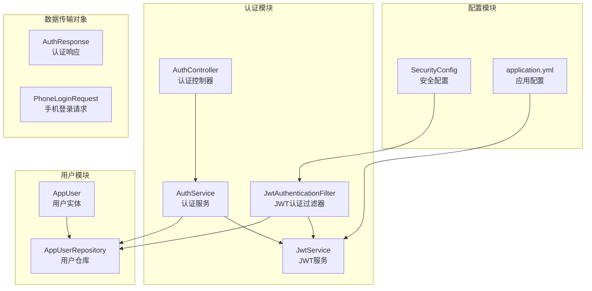
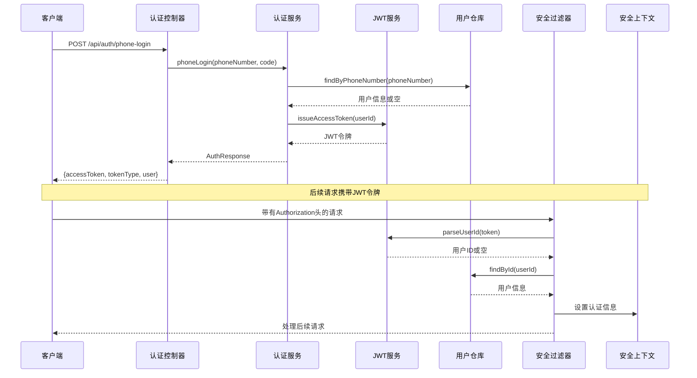
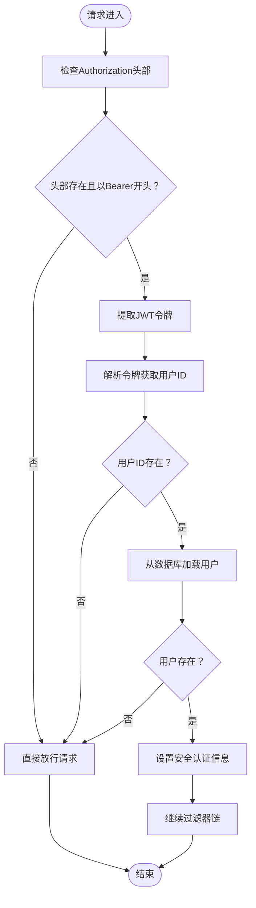
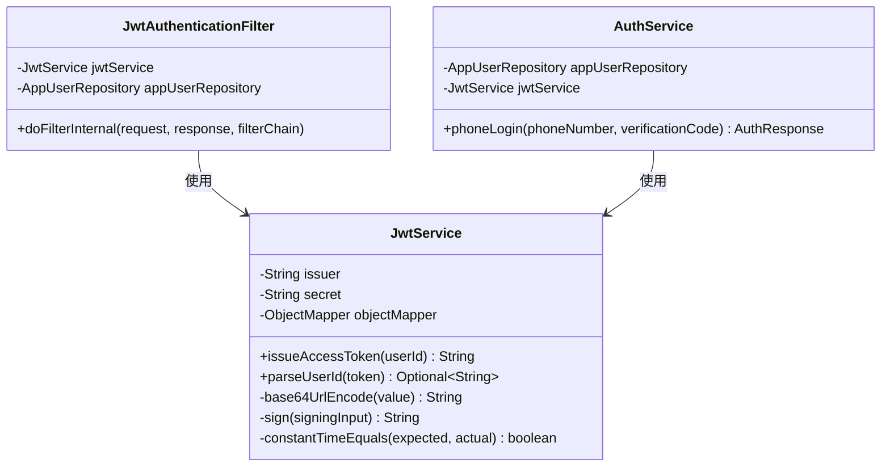
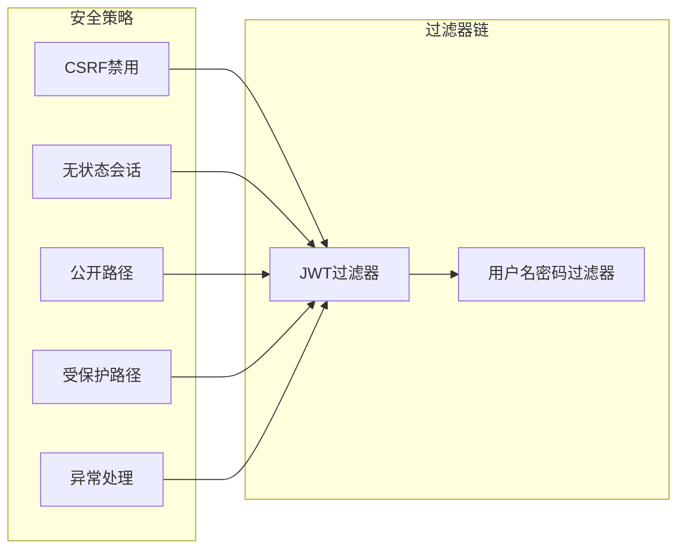
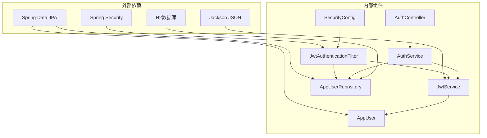

# JWT认证过滤器

<cite>
**本文档引用的文件**
- [JwtAuthenticationFilter.java](file://backend/src/main/java/com/aidrun/backend/auth/JwtAuthenticationFilter.java)
- [JwtService.java](file://backend/src/main/java/com/aidrun/backend/auth/JwtService.java)
- [SecurityConfig.java](file://backend/src/main/java/com/aidrun/backend/config/SecurityConfig.java)
- [AuthService.java](file://backend/src/main/java/com/aidrun/backend/auth/AuthService.java)
- [AuthController.java](file://backend/src/main/java/com/aidrun/backend/auth/AuthController.java)
- [application.yml](file://backend/src/main/resources/application.yml)
- [AppUser.java](file://backend/src/main/java/com/aidrun/backend/user/AppUser.java)
- [AppUserRepository.java](file://backend/src/main/java/com/aidrun/backend/user/AppUserRepository.java)
- [AuthResponse.java](file://backend/src/main/java/com/aidrun/backend/auth/dto/AuthResponse.java)
- [PhoneLoginRequest.java](file://backend/src/main/java/com/aidrun/backend/auth/dto/PhoneLoginRequest.java)
- [ApiErrorResponse.java](file://backend/src/main/java/com/aidrun/backend/common/error/ApiErrorResponse.java)
- [pom.xml](file://backend/pom.xml)
</cite>

## 目录
1. [简介](#简介)
2. [项目结构](#项目结构)
3. [核心组件](#核心组件)
4. [架构概览](#架构概览)
5. [详细组件分析](#详细组件分析)
6. [依赖关系分析](#依赖关系分析)
7. [性能考虑](#性能考虑)
8. [故障排除指南](#故障排除指南)
9. [结论](#结论)

## 简介

本文件详细分析了AidRun项目中的JWT认证过滤器系统。该系统实现了基于Spring Security的无状态认证机制，通过JWT令牌进行用户身份验证和授权。系统采用Bearer Token认证模式，支持手机号一键登录功能，并提供了完整的安全配置和异常处理机制。

## 项目结构

JWT认证系统主要分布在以下模块中：

**图表来源**
- [JwtAuthenticationFilter.java:1-63](file://backend/src/main/java/com/aidrun/backend/auth/JwtAuthenticationFilter.java#L1-L63)
- [JwtService.java:1-108](file://backend/src/main/java/com/aidrun/backend/auth/JwtService.java#L1-L108)
- [SecurityConfig.java:1-55](file://backend/src/main/java/com/aidrun/backend/config/SecurityConfig.java#L1-L55)

**章节来源**
- [pom.xml:1-80](file://backend/pom.xml#L1-L80)

## 核心组件

### JWT认证过滤器 (JwtAuthenticationFilter)

JWT认证过滤器是整个认证系统的核心组件，继承自Spring Security的OncePerRequestFilter基类。其主要职责包括：

- **令牌提取**：从HTTP请求头中提取Authorization头部的Bearer令牌
- **令牌验证**：使用JwtService验证JWT令牌的有效性
- **用户加载**：根据令牌中的用户ID从数据库加载用户信息
- **安全上下文设置**：将认证信息设置到Spring Security的Context中

### JWT服务 (JwtService)

JWT服务负责JWT令牌的创建、解析和验证：

- **令牌签发**：生成包含用户ID、发行者信息和时间戳的JWT令牌
- **令牌解析**：解析JWT令牌并验证签名完整性
- **用户ID提取**：从有效令牌中提取用户标识符
- **安全签名**：使用HMAC-SHA256算法进行数字签名

### 安全配置 (SecurityConfig)

安全配置定义了整个Web应用的安全策略：

- **无状态会话**：禁用会话管理，实现RESTful无状态认证
- **路径匹配**：配置公开访问路径和受保护路径
- **异常处理**：统一处理认证失败的异常情况
- **过滤器链**：配置JWT过滤器在认证过滤器之前执行

**章节来源**
- [JwtAuthenticationFilter.java:17-62](file://backend/src/main/java/com/aidrun/backend/auth/JwtAuthenticationFilter.java#L17-L62)
- [JwtService.java:17-108](file://backend/src/main/java/com/aidrun/backend/auth/JwtService.java#L17-L108)
- [SecurityConfig.java:17-54](file://backend/src/main/java/com/aidrun/backend/config/SecurityConfig.java#L17-L54)

## 架构概览

JWT认证系统的整体架构如下：

**图表来源**
- [AuthController.java:12-27](file://backend/src/main/java/com/aidrun/backend/auth/AuthController.java#L12-L27)
- [AuthService.java:29-47](file://backend/src/main/java/com/aidrun/backend/auth/AuthService.java#L29-L47)
- [JwtAuthenticationFilter.java:30-61](file://backend/src/main/java/com/aidrun/backend/auth/JwtAuthenticationFilter.java#L30-L61)

## 详细组件分析

### JWT认证过滤器实现

JWT认证过滤器采用三阶段验证流程：

**图表来源**
- [JwtAuthenticationFilter.java:30-61](file://backend/src/main/java/com/aidrun/backend/auth/JwtAuthenticationFilter.java#L30-L61)

#### 关键实现细节

1. **令牌格式验证**：严格检查Authorization头部是否以"Bearer "前缀开头
2. **空值处理**：对空令牌和无效令牌进行优雅降级处理
3. **用户存在性检查**：确保令牌中的用户ID对应的实际用户存在
4. **安全上下文设置**：正确设置Spring Security的认证状态

**章节来源**
- [JwtAuthenticationFilter.java:18-28](file://backend/src/main/java/com/aidrun/backend/auth/JwtAuthenticationFilter.java#L18-L28)
- [JwtAuthenticationFilter.java:34-58](file://backend/src/main/java/com/aidrun/backend/auth/JwtAuthenticationFilter.java#L34-L58)

### JWT服务实现

JWT服务实现了完整的JWT生命周期管理：

**图表来源**
- [JwtService.java:17-36](file://backend/src/main/java/com/aidrun/backend/auth/JwtService.java#L17-L36)
- [JwtAuthenticationFilter.java:22-27](file://backend/src/main/java/com/aidrun/backend/auth/JwtAuthenticationFilter.java#L22-L27)
- [AuthService.java:21-26](file://backend/src/main/java/com/aidrun/backend/auth/AuthService.java#L21-L26)

#### 令牌结构设计

JWT令牌采用标准的三段式结构：
- **头部 (Header)**：包含算法和令牌类型信息
- **载荷 (Payload)**：包含发行者、主题(用户ID)、签发时间等声明
- **签名 (Signature)**：基于头部和载荷的HMAC-SHA256签名

**章节来源**
- [JwtService.java:38-54](file://backend/src/main/java/com/aidrun/backend/auth/JwtService.java#L38-L54)
- [JwtService.java:56-78](file://backend/src/main/java/com/aidrun/backend/auth/JwtService.java#L56-L78)

### 安全配置分析

安全配置定义了系统的整体安全策略：

**图表来源**
- [SecurityConfig.java:28-50](file://backend/src/main/java/com/aidrun/backend/config/SecurityConfig.java#L28-L50)

#### 路径权限控制

系统采用灵活的路径权限控制策略：
- **完全开放**：认证接口、Swagger文档、H2控制台
- **需要认证**：所有其他API端点
- **细粒度控制**：支持针对特定端点的权限配置

**章节来源**
- [SecurityConfig.java:34-49](file://backend/src/main/java/com/aidrun/backend/config/SecurityConfig.java#L34-L49)

## 依赖关系分析

JWT认证系统的依赖关系如下：

**图表来源**
- [pom.xml:25-68](file://backend/pom.xml#L25-L68)
- [JwtAuthenticationFilter.java:3-4](file://backend/src/main/java/com/aidrun/backend/auth/JwtAuthenticationFilter.java#L3-L4)

### 核心依赖特性

1. **Spring Security集成**：深度集成Spring Security框架，利用其强大的认证和授权能力
2. **JPA持久化**：使用Spring Data JPA进行用户数据的持久化管理
3. **JSON序列化**：使用Jackson库处理JWT载荷的JSON序列化和反序列化
4. **H2内存数据库**：开发环境使用H2内存数据库，便于测试和演示

**章节来源**
- [pom.xml:26-57](file://backend/pom.xml#L26-L57)

## 性能考虑

### 过滤器性能优化

JWT认证过滤器采用了多项性能优化措施：

1. **一次性过滤**：继承OncePerRequestFilter，避免重复执行
2. **短路评估**：在发现无效令牌时立即放行，减少不必要的数据库查询
3. **内存友好**：使用Optional类型避免空指针异常和不必要的对象创建

### 数据库访问优化

1. **懒加载策略**：用户角色采用EAGER加载，减少后续查询次数
2. **索引优化**：用户ID作为主键，提供高效的查找性能
3. **连接池**：利用Spring Boot自动配置的数据库连接池

### 缓存策略建议

虽然当前实现没有内置缓存，但可以考虑以下优化：
- **令牌黑名单缓存**：存储已撤销的令牌，快速检测
- **用户信息缓存**：缓存活跃用户的认证信息
- **配置参数缓存**：缓存JWT配置参数，减少配置读取开销

## 故障排除指南

### 常见问题及解决方案

#### 1. 认证失败问题

**症状**：返回401未授权错误

**可能原因**：
- Authorization头部格式不正确
- JWT令牌过期或格式错误
- 用户不存在或已被删除

**排查步骤**：
1. 检查请求头格式：`Authorization: Bearer YOUR_TOKEN`
2. 验证令牌格式是否为三段式
3. 确认用户ID对应的用户是否存在

#### 2. 令牌验证失败

**症状**：令牌解析返回空值

**可能原因**：
- 令牌签名不匹配
- 发行者不正确
- 用户ID为空或格式错误

**排查步骤**：
1. 验证JWT密钥配置
2. 检查令牌的iss和sub声明
3. 确认用户ID格式正确

#### 3. 数据库连接问题

**症状**：用户查询失败

**可能原因**：
- 数据库连接配置错误
- 用户表结构不匹配
- 数据库服务不可用

**排查步骤**：
1. 检查application.yml中的数据库配置
2. 验证用户表结构和索引
3. 确认数据库服务运行状态

**章节来源**
- [ApiErrorResponse.java:5-14](file://backend/src/main/java/com/aidrun/backend/common/error/ApiErrorResponse.java#L5-L14)
- [SecurityConfig.java:44-49](file://backend/src/main/java/com/aidrun/backend/config/SecurityConfig.java#L44-L49)

### 日志和监控

建议添加以下监控点：
1. **认证成功率统计**：跟踪认证请求的成功率
2. **令牌验证耗时**：监控JWT解析的性能
3. **数据库查询延迟**：监控用户查询的响应时间
4. **异常类型统计**：分类统计不同类型的认证错误

## 结论

JWT认证过滤器系统是一个设计精良、实现严谨的认证解决方案。系统具有以下特点：

### 优势

1. **安全性**：采用标准的JWT认证模式，支持数字签名验证
2. **可扩展性**：模块化设计，易于扩展新的认证方式
3. **易维护性**：清晰的代码结构和完善的异常处理机制
4. **性能优化**：采用多种优化策略，确保高并发下的稳定性能

### 改进建议

1. **令牌刷新机制**：实现短期访问令牌和长期刷新令牌的组合
2. **多租户支持**：扩展支持多租户场景下的用户隔离
3. **审计日志**：添加详细的认证审计日志
4. **监控指标**：集成Prometheus等监控工具

该系统为AidRun项目提供了坚实的身份认证基础，能够满足移动应用的认证需求，并为未来的功能扩展奠定了良好的技术基础。