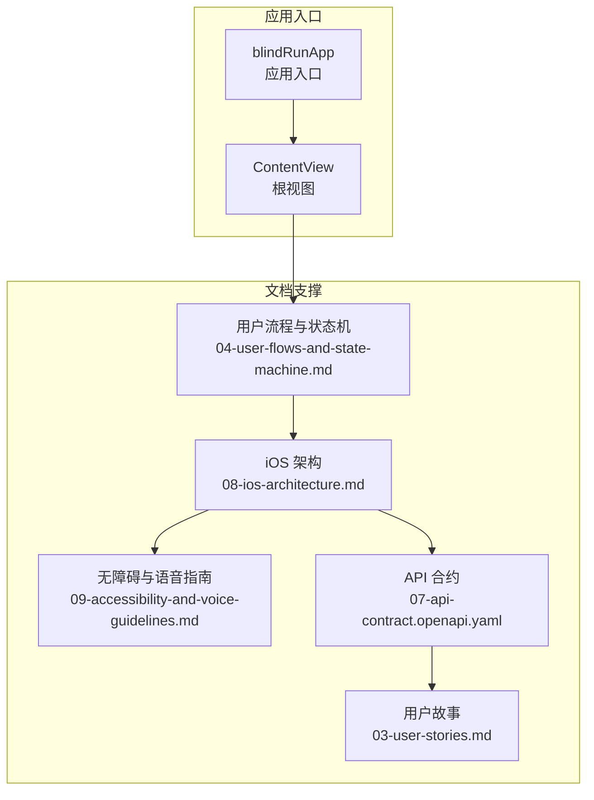
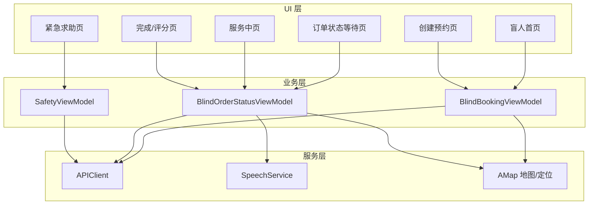
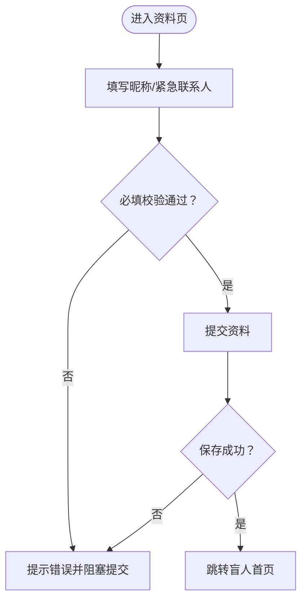
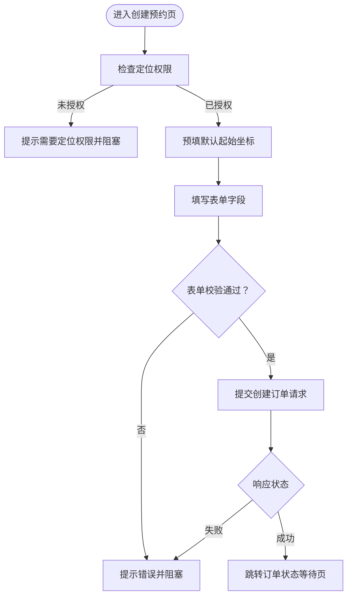
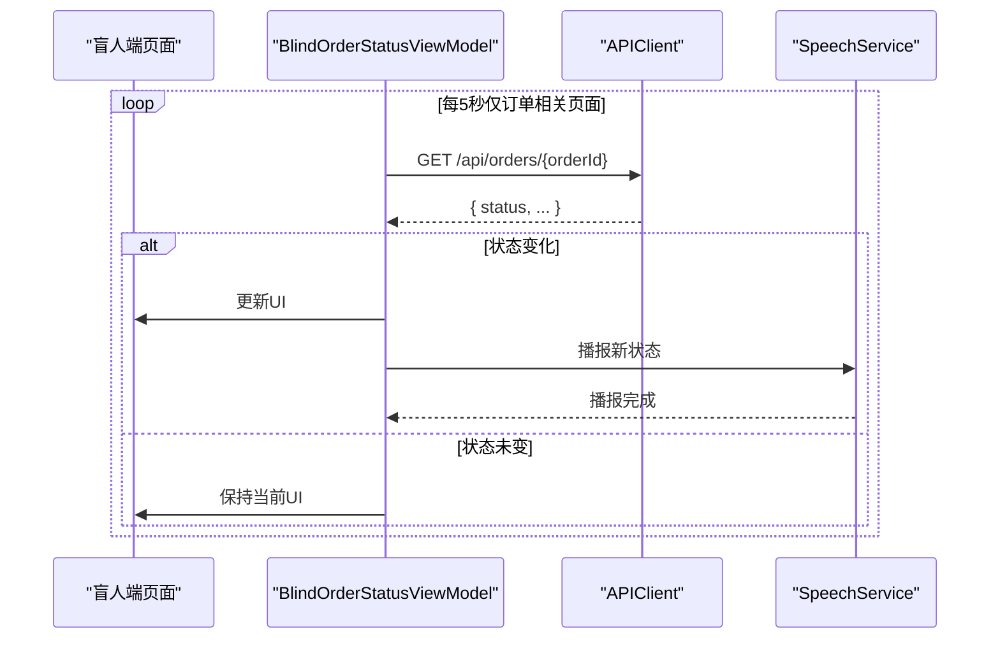
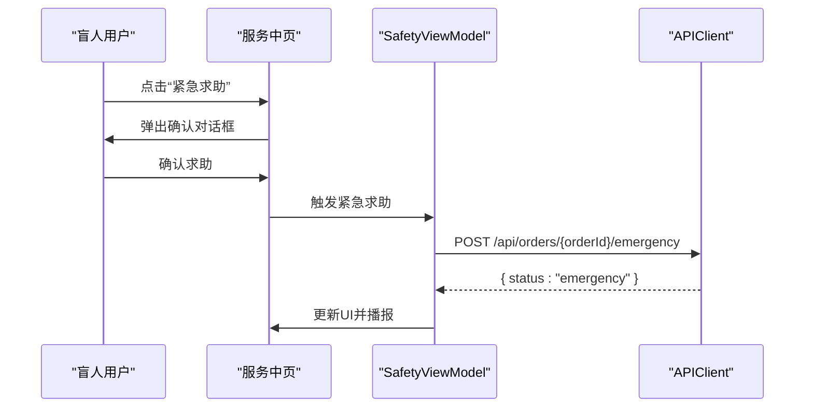
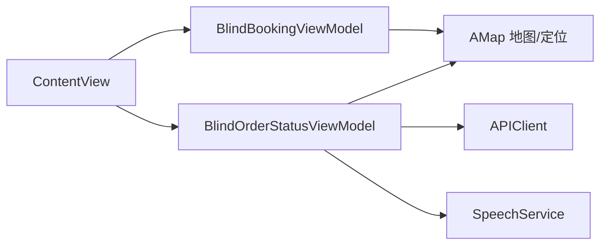

# BlindRunner 盲人跑者模块

<cite>
**本文引用的文件**
- [blindRunApp.swift](file://blindRun/blindRunApp.swift)
- [ContentView.swift](file://blindRun/ContentView.swift)
- [04-user-flows-and-state-machine.md](file://docs/04-user-flows-and-state-machine.md)
- [08-ios-architecture.md](file://docs/08-ios-architecture.md)
- [09-accessibility-and-voice-guidelines.md](file://docs/09-accessibility-and-voice-guidelines.md)
- [07-api-contract.openapi.yaml](file://docs/07-api-contract.openapi.yaml)
- [03-user-stories.md](file://docs/03-user-stories.md)
</cite>

## 目录
1. [简介](#简介)
2. [项目结构](#项目结构)
3. [核心组件](#核心组件)
4. [架构总览](#架构总览)
5. [详细组件分析](#详细组件分析)
6. [依赖关系分析](#依赖关系分析)
7. [性能考虑](#性能考虑)
8. [故障排查指南](#故障排查指南)
9. [结论](#结论)
10. [附录](#附录)

## 简介
本文件面向 BlindRunner 盲人跑者模块，系统化梳理其核心功能与实现要点，覆盖以下主题：
- 个人资料管理：首次注册时的盲人资料创建与更新流程
- 预约创建流程：位置权限处理、默认起始坐标、表单验证与提交
- 订单状态跟踪：5 秒轮询机制、状态变化监听与 UI 更新策略
- 紧急求助：紧急按钮设计、确认对话框与求助流程
- 无障碍优化：大按钮设计、辅助功能标签与语音播报集成
- 完整用户流程示例与错误处理策略

## 项目结构
当前仓库包含最小可运行的 SwiftUI 应用骨架（应用入口与根视图），以及完整的业务与技术文档。BlindRunner 模块的功能蓝图与交互规范由文档定义，实际代码实现需在后续迭代中落地。

图表来源
- [blindRunApp.swift:10-17](file://blindRun/blindRunApp.swift#L10-L17)
- [ContentView.swift:10-20](file://blindRun/ContentView.swift#L10-L20)
- [04-user-flows-and-state-machine.md:1-70](file://docs/04-user-flows-and-state-machine.md#L1-L70)
- [08-ios-architecture.md:18-32](file://docs/08-ios-architecture.md#L18-L32)
- [09-accessibility-and-voice-guidelines.md:1-143](file://docs/09-accessibility-and-voice-guidelines.md#L1-L143)
- [07-api-contract.openapi.yaml:150-252](file://docs/07-api-contract.openapi.yaml#L150-L252)
- [03-user-stories.md:161-250](file://docs/03-user-stories.md#L161-L250)

章节来源
- [blindRunApp.swift:10-17](file://blindRun/blindRunApp.swift#L10-L17)
- [ContentView.swift:10-20](file://blindRun/ContentView.swift#L10-L20)

## 核心组件
- 应用入口与根视图：负责应用生命周期与根界面渲染
- 文档驱动的功能蓝图：定义了盲人跑者端的用户流程、状态机、API 行为与无障碍要求
- 服务契约：OpenAPI 描述了订单生命周期、状态转换与错误码

章节来源
- [04-user-flows-and-state-machine.md:120-178](file://docs/04-user-flows-and-state-machine.md#L120-L178)
- [08-ios-architecture.md:25-48](file://docs/08-ios-architecture.md#L25-L48)
- [07-api-contract.openapi.yaml:150-387](file://docs/07-api-contract.openapi.yaml#L150-L387)

## 架构总览
BlindRunner 模块遵循 SwiftUI + MVVM 架构，结合真实地图与定位能力，配合语音播报与无障碍设计，确保盲人用户在关键流程中“无需视觉即可完成”。

图表来源
- [08-ios-architecture.md:33-48](file://docs/08-ios-architecture.md#L33-L48)
- [04-user-flows-and-state-machine.md:275-299](file://docs/04-user-flows-and-state-machine.md#L275-L299)
- [09-accessibility-and-voice-guidelines.md:13-36](file://docs/09-accessibility-and-voice-guidelines.md#L13-L36)

## 详细组件分析

### 个人资料管理
- 首次选择角色后，盲人跑者需完善个人资料（昵称、紧急联系人等），资料创建/更新接口由后端提供
- 表单字段校验：必填项校验、紧急联系人电话格式校验
- 提交后进入盲人首页，TTS 播报欢迎语

图表来源
- [03-user-stories.md:163-188](file://docs/03-user-stories.md#L163-L188)
- [07-api-contract.openapi.yaml:82-116](file://docs/07-api-contract.openapi.yaml#L82-L116)

章节来源
- [03-user-stories.md:163-188](file://docs/03-user-stories.md#L163-L188)
- [07-api-contract.openapi.yaml:82-116](file://docs/07-api-contract.openapi.yaml#L82-L116)

### 预约创建流程
- 位置权限处理：定位权限被拒时，无法创建预约；需引导用户前往系统设置
- 默认起始坐标：建议在模拟器或无权限场景下提供演示用默认坐标，但需明确提示真实定位需求
- 表单验证机制：
  - 出发地点：支持设备定位、手动输入或演示默认值
  - 预约时间：至少在当前时间 30 分钟之后
  - 其他可选项：目的地、预计时长、备注等
- 提交后进入订单状态等待页，TTS 播报“订单提交成功，等待志愿者接单”

图表来源
- [03-user-stories.md:225-251](file://docs/03-user-stories.md#L225-L251)
- [07-api-contract.openapi.yaml:150-187](file://docs/07-api-contract.openapi.yaml#L150-L187)
- [08-ios-architecture.md:107-118](file://docs/08-ios-architecture.md#L107-L118)

章节来源
- [03-user-stories.md:225-251](file://docs/03-user-stories.md#L225-L251)
- [07-api-contract.openapi.yaml:150-187](file://docs/07-api-contract.openapi.yaml#L150-L187)
- [08-ios-architecture.md:107-118](file://docs/08-ios-architecture.md#L107-L118)

### 订单状态跟踪（轮询机制）
- 轮询频率：每 5 秒请求一次订单详情接口
- 轮询范围：matching、accepted、arrived、in_progress 页面
- 状态变化监听：当状态改变时，更新 UI 并触发 TTS 播报
- 终止条件：订单进入 completed、cancelled、emergency，或页面离开、用户登出

图表来源
- [04-user-flows-and-state-machine.md:275-299](file://docs/04-user-flows-and-state-machine.md#L275-L299)
- [08-ios-architecture.md:125-139](file://docs/08-ios-architecture.md#L125-L139)
- [09-accessibility-and-voice-guidelines.md:13-36](file://docs/09-accessibility-and-voice-guidelines.md#L13-L36)

章节来源
- [04-user-flows-and-state-machine.md:275-299](file://docs/04-user-flows-and-state-machine.md#L275-L299)
- [08-ios-architecture.md:125-139](file://docs/08-ios-architecture.md#L125-L139)
- [09-accessibility-and-voice-guidelines.md:13-36](file://docs/09-accessibility-and-voice-guidelines.md#L13-L36)

### 紧急求助功能
- 触发条件：订单处于 accepted、arrived、in_progress 任一状态
- 紧急按钮设计：醒目样式（如红色），最小高度 ≥ 64pt
- 确认对话框：明确提示“确认进入求助状态？确认后，本次服务将标记为异常”
- 流程：提交 /api/orders/{orderId}/emergency，状态进入 emergency，TTS 播报“已进入求助状态”，页面显示紧急联系人信息

图表来源
- [03-user-stories.md:323-350](file://docs/03-user-stories.md#L323-L350)
- [04-user-flows-and-state-machine.md:230-257](file://docs/04-user-flows-and-state-machine.md#L230-L257)
- [09-accessibility-and-voice-guidelines.md:97-107](file://docs/09-accessibility-and-voice-guidelines.md#L97-L107)

章节来源
- [03-user-stories.md:323-350](file://docs/03-user-stories.md#L323-L350)
- [04-user-flows-and-state-machine.md:230-257](file://docs/04-user-flows-and-state-machine.md#L230-L257)
- [09-accessibility-and-voice-guidelines.md:97-107](file://docs/09-accessibility-and-voice-guidelines.md#L97-L107)

### 无障碍优化
- 大按钮设计：关键主按钮最小高度 ≥ 64pt
- 辅助功能标签：每个关键按钮、输入框、状态文本均需设置 accessibilityLabel 与 accessibilityHint
- 语音播报：共享 SpeechService，在状态变化、关键提示、错误信息时播报
- 危险操作二次确认：取消订单、紧急求助、结束服务、退出登录均需二次确认
- “重复当前状态”按钮：每个关键页面提供重复播报当前状态的能力

章节来源
- [09-accessibility-and-voice-guidelines.md:6-12](file://docs/09-accessibility-and-voice-guidelines.md#L6-L12)
- [09-accessibility-and-voice-guidelines.md:62-70](file://docs/09-accessibility-and-voice-guidelines.md#L62-L70)
- [09-accessibility-and-voice-guidelines.md:88-107](file://docs/09-accessibility-and-voice-guidelines.md#L88-L107)
- [09-accessibility-and-voice-guidelines.md:13-36](file://docs/09-accessibility-and-voice-guidelines.md#L13-L36)

## 依赖关系分析
- UI 与 ViewModel：薄视图、厚 ViewModel，ViewModel 负责状态、验证、API 调用与轮询
- ViewModel 与 Service：ViewModel 通过 APIClient 封装网络调用，统一错误映射与 TTS 触发
- 地图与定位：AMap 提供地图与定位能力，定位权限缺失时阻断预约创建
- 语音服务：AVSpeechSynthesizer 与 SpeechService 协作，确保状态播报与错误提示

图表来源
- [08-ios-architecture.md:33-48](file://docs/08-ios-architecture.md#L33-L48)
- [08-ios-architecture.md:98-124](file://docs/08-ios-architecture.md#L98-L124)
- [09-accessibility-and-voice-guidelines.md:13-36](file://docs/09-accessibility-and-voice-guidelines.md#L13-L36)

章节来源
- [08-ios-architecture.md:33-48](file://docs/08-ios-architecture.md#L33-L48)
- [08-ios-architecture.md:98-124](file://docs/08-ios-architecture.md#L98-L124)
- [09-accessibility-and-voice-guidelines.md:13-36](file://docs/09-accessibility-and-voice-guidelines.md#L13-L36)

## 性能考虑
- 轮询节流：仅在订单相关页面启用 5 秒轮询，页面离开即停止，避免无谓请求
- 状态缓存：轮询结果与 UI 状态解耦，仅在状态变化时更新 UI 与播报
- 网络重试：MVP 阶段保持简单重试策略，避免复杂离线队列
- 地图与定位：仅在需要时启用，避免后台频繁定位

## 故障排查指南
- 定位权限被拒
  - 现象：创建预约页无法选择出发地点或提示需要定位权限
  - 处理：引导用户前往系统设置开启定位权限；在无权限场景下提供演示默认坐标，但需明确提示真实定位需求
- 订单创建失败
  - 现象：预约时间过近、资料不完整、定位权限缺失导致创建失败
  - 处理：根据后端错误码映射提示，引导用户修正预约时间或完善资料
- 轮询无更新
  - 现象：页面长时间无状态变化
  - 处理：检查页面是否仍在轮询范围内、是否已进入终态、是否离开页面或登出
- 紧急求助未生效
  - 现象：点击紧急求助后状态未进入 emergency
  - 处理：确认当前订单状态是否允许进入 emergency，检查网络请求与后端响应

章节来源
- [07-api-contract.openapi.yaml:150-187](file://docs/07-api-contract.openapi.yaml#L150-L187)
- [04-user-flows-and-state-machine.md:275-299](file://docs/04-user-flows-and-state-machine.md#L275-L299)
- [03-user-stories.md:323-350](file://docs/03-user-stories.md#L323-L350)

## 结论
BlindRunner 盲人跑者模块以文档为驱动，围绕“语音优先、无障碍优先”的原则构建核心流程：从个人资料完善、预约创建、订单状态轮询到紧急求助，形成闭环。实际开发中应严格遵循 MVVM 架构与无障碍规范，确保关键节点具备清晰的语音播报与二次确认机制，保障盲人用户在无视觉情况下也能顺利完成服务闭环。

## 附录
- 用户流程与状态机（正向路径与紧急求助）
- iOS 架构与模块划分
- 无障碍与语音播报指南
- API 合约（订单生命周期与错误码）
- 用户故事（功能验收标准）

章节来源
- [04-user-flows-and-state-machine.md:120-178](file://docs/04-user-flows-and-state-machine.md#L120-L178)
- [08-ios-architecture.md:18-32](file://docs/08-ios-architecture.md#L18-L32)
- [09-accessibility-and-voice-guidelines.md:108-121](file://docs/09-accessibility-and-voice-guidelines.md#L108-L121)
- [07-api-contract.openapi.yaml:580-582](file://docs/07-api-contract.openapi.yaml#L580-L582)
- [03-user-stories.md:595-652](file://docs/03-user-stories.md#L595-L652)