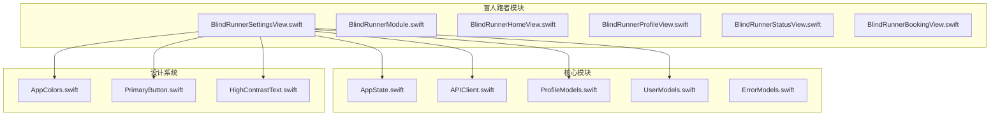
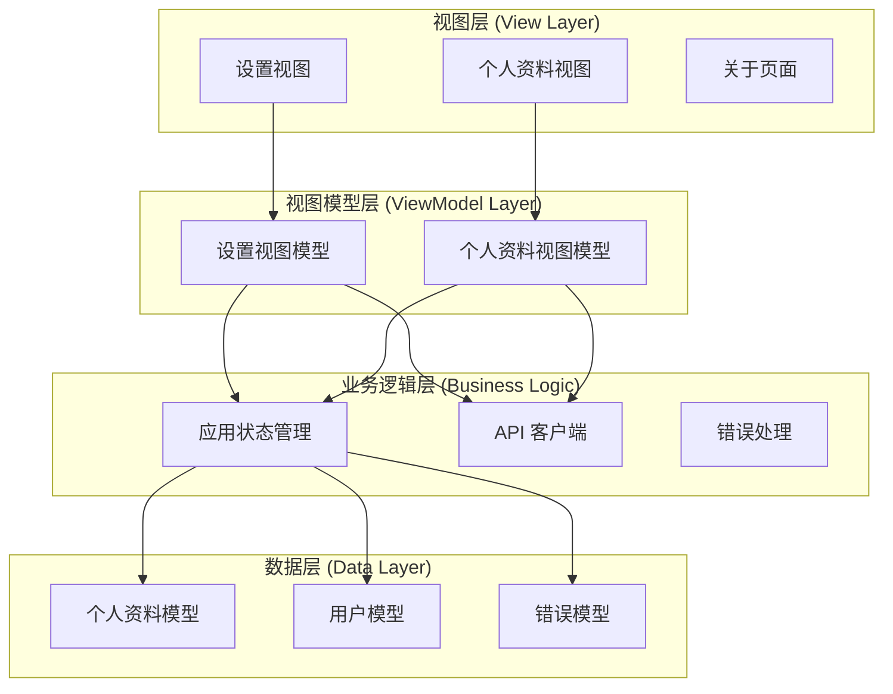
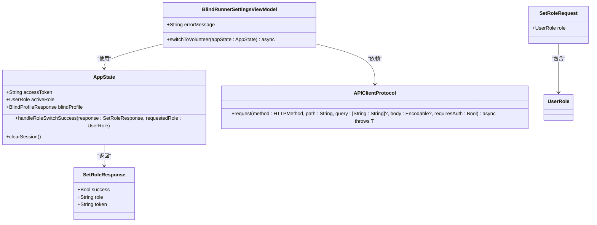
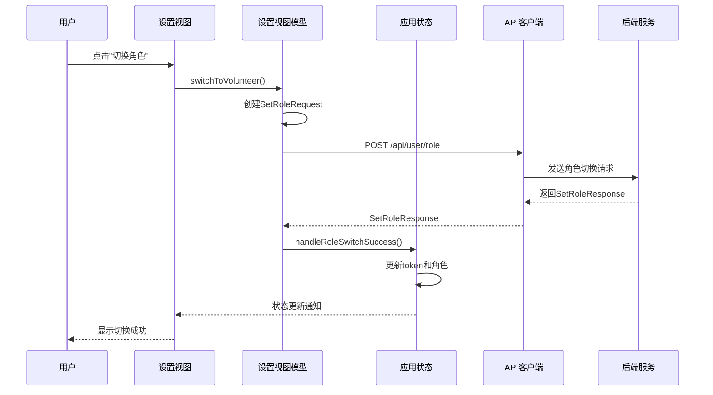
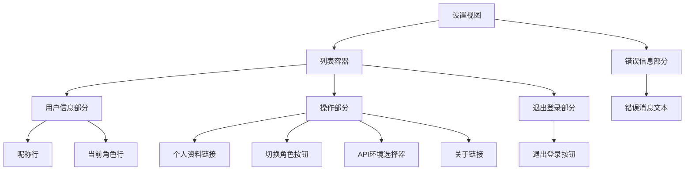
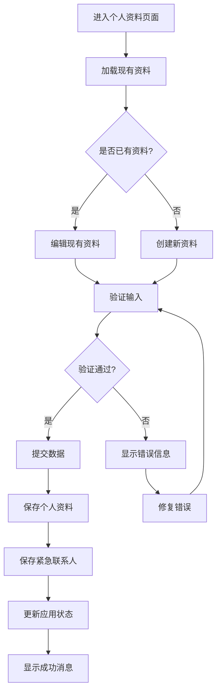
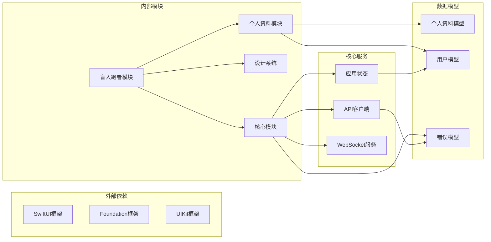

# 盲人跑者设置界面

<cite>
**本文档引用的文件**
- [BlindRunnerSettingsView.swift](file://blindRun/BlindRunner/BlindRunnerSettingsView.swift)
- [BlindRunnerModule.swift](file://blindRun/BlindRunner/BlindRunnerModule.swift)
- [ProfileModels.swift](file://blindRun/Core/Models/ProfileModels.swift)
- [ProfileModule.swift](file://blindRun/Profile/ProfileModule.swift)
- [UserModels.swift](file://blindRun/Core/Models/UserModels.swift)
- [ErrorModels.swift](file://blindRun/Core/Models/ErrorModels.swift)
- [AppState.swift](file://blindRun/Core/AppState.swift)
- [APIClient.swift](file://blindRun/Core/APIClient.swift)
- [AppColors.swift](file://blindRun/Core/DesignSystem/AppColors.swift)
- [PrimaryButton.swift](file://blindRun/Core/DesignSystem/PrimaryButton.swift)
- [HighContrastText.swift](file://blindRun/Core/DesignSystem/HighContrastText.swift)
- [ContentView.swift](file://blindRun/ContentView.swift)
- [LoginView.swift](file://blindRun/Auth/LoginView.swift)
</cite>

## 目录
1. [简介](#简介)
2. [项目结构](#项目结构)
3. [核心组件](#核心组件)
4. [架构概览](#架构概览)
5. [详细组件分析](#详细组件分析)
6. [依赖关系分析](#依赖关系分析)
7. [性能考虑](#性能考虑)
8. [故障排除指南](#故障排除指南)
9. [结论](#结论)

## 简介

盲人跑者设置界面是 AidRun 应用中视障跑者用户的核心功能模块之一。该界面提供了用户管理、角色切换、个人资料编辑以及应用配置等功能。基于 SwiftUI 和 MVVM 架构设计，采用响应式编程模型，提供无障碍友好的用户体验。

本设置界面主要服务于视障跑者用户群体，支持语音播报、高对比度显示、大字体等无障碍特性，确保视觉障碍用户能够独立完成各种操作。

## 项目结构

盲人跑者设置界面位于 iOS 应用的特定模块化架构中，采用功能导向的文件组织方式：

**图表来源**
- [BlindRunnerSettingsView.swift:1-123](file://blindRun/BlindRunner/BlindRunnerSettingsView.swift#L1-L123)
- [BlindRunnerModule.swift:1-3](file://blindRun/BlindRunner/BlindRunnerModule.swift#L1-L3)
- [AppState.swift:1-313](file://blindRun/Core/AppState.swift#L1-L313)

**章节来源**
- [BlindRunnerSettingsView.swift:1-123](file://blindRun/BlindRunner/BlindRunnerSettingsView.swift#L1-L123)
- [BlindRunnerModule.swift:1-3](file://blindRun/BlindRunner/BlindRunnerModule.swift#L1-L3)

## 核心组件

盲人跑者设置界面包含以下核心组件：

### 设置视图模型 (BlindRunnerSettingsViewModel)
负责处理设置相关的业务逻辑，包括角色切换、错误处理等。

### 设置视图 (BlindRunnerSettingsView)
基于 SwiftUI 的响应式视图，提供用户交互界面。

### 个人资料视图 (BlindRunnerProfileView)
允许用户查看和编辑个人资料信息。

### 设计系统组件
- **高对比度文本**：确保在不同主题下的可读性
- **主按钮**：提供统一的操作按钮样式
- **颜色系统**：定义应用的色彩规范

**章节来源**
- [BlindRunnerSettingsView.swift:6-22](file://blindRun/BlindRunner/BlindRunnerSettingsView.swift#L6-L22)
- [BlindRunnerSettingsView.swift:26-113](file://blindRun/BlindRunner/BlindRunnerSettingsView.swift#L26-L113)
- [AppColors.swift:1-39](file://blindRun/Core/DesignSystem/AppColors.swift#L1-L39)
- [PrimaryButton.swift:1-56](file://blindRun/Core/DesignSystem/PrimaryButton.swift#L1-L56)
- [HighContrastText.swift:1-59](file://blindRun/Core/DesignSystem/HighContrastText.swift#L1-L59)

## 架构概览

设置界面采用 MVVM（Model-View-ViewModel）架构模式，实现了清晰的关注点分离：

**图表来源**
- [BlindRunnerSettingsView.swift:6-22](file://blindRun/BlindRunner/BlindRunnerSettingsView.swift#L6-L22)
- [ProfileModule.swift:6-164](file://blindRun/Profile/ProfileModule.swift#L6-L164)
- [AppState.swift:9-313](file://blindRun/Core/AppState.swift#L9-L313)
- [APIClient.swift:103-269](file://blindRun/Core/APIClient.swift#L103-L269)

## 详细组件分析

### 设置视图模型分析

设置视图模型实现了角色切换的核心功能：

**图表来源**
- [BlindRunnerSettingsView.swift:6-22](file://blindRun/BlindRunner/BlindRunnerSettingsView.swift#L6-L22)
- [AppState.swift:146-152](file://blindRun/Core/AppState.swift#L146-L152)
- [UserModels.swift:43-52](file://blindRun/Core/Models/UserModels.swift#L43-L52)

#### 角色切换流程

**图表来源**
- [BlindRunnerSettingsView.swift:10-21](file://blindRun/BlindRunner/BlindRunnerSettingsView.swift#L10-L21)
- [AppState.swift:146-152](file://blindRun/Core/AppState.swift#L146-L152)
- [UserModels.swift:43-52](file://blindRun/Core/Models/UserModels.swift#L43-L52)

**章节来源**
- [BlindRunnerSettingsView.swift:6-22](file://blindRun/BlindRunner/BlindRunnerSettingsView.swift#L6-L22)

### 设置视图界面分析

设置视图提供了完整的用户界面层次结构：

**图表来源**
- [BlindRunnerSettingsView.swift:32-101](file://blindRun/BlindRunner/BlindRunnerSettingsView.swift#L32-L101)

#### 无障碍特性实现

设置界面充分考虑了无障碍访问需求：

- **语音播报**：所有重要操作都有相应的语音提示
- **高对比度**：使用 AppColors 系统确保文本可读性
- **大字体支持**：支持动态字体大小调整
- **语义化标签**：为每个元素提供清晰的可访问性标签

**章节来源**
- [BlindRunnerSettingsView.swift:26-113](file://blindRun/BlindRunner/BlindRunnerSettingsView.swift#L26-L113)
- [AppColors.swift:5-14](file://blindRun/Core/DesignSystem/AppColors.swift#L5-L14)
- [HighContrastText.swift:7-48](file://blindRun/Core/DesignSystem/HighContrastText.swift#L7-L48)

### 个人资料管理

个人资料视图提供了完整的资料编辑功能：

**图表来源**
- [ProfileModule.swift:69-131](file://blindRun/Profile/ProfileModule.swift#L69-L131)
- [ProfileModule.swift:133-163](file://blindRun/Profile/ProfileModule.swift#L133-L163)

**章节来源**
- [ProfileModule.swift:6-164](file://blindRun/Profile/ProfileModule.swift#L6-L164)

## 依赖关系分析

设置界面的依赖关系体现了清晰的分层架构：

**图表来源**
- [BlindRunnerSettingsView.swift:1-3](file://blindRun/BlindRunner/BlindRunnerSettingsView.swift#L1-L3)
- [AppState.swift:1-313](file://blindRun/Core/AppState.swift#L1-L313)
- [APIClient.swift:1-269](file://blindRun/Core/APIClient.swift#L1-L269)

### 关键依赖关系

1. **状态管理依赖**：所有视图都依赖 AppState 进行状态同步
2. **网络通信依赖**：通过 APIClient 处理所有 API 请求
3. **设计系统依赖**：统一的颜色、字体和组件样式
4. **模型依赖**：类型安全的数据传输和验证

**章节来源**
- [AppState.swift:87-105](file://blindRun/Core/AppState.swift#L87-L105)
- [APIClient.swift:46-99](file://blindRun/Core/APIClient.swift#L46-L99)

## 性能考虑

设置界面在性能优化方面采用了多项策略：

### 响应式更新优化
- 使用 @Published 属性实现细粒度的状态更新
- 避免不必要的视图重绘
- 合理使用 @StateObject 和 @EnvironmentObject

### 网络请求优化
- 统一的 API 客户端封装
- 错误处理和重试机制
- 超时控制和连接池管理

### 内存管理
- 弱引用避免循环引用
- 及时清理定时器和观察者
- 合理的生命周期管理

## 故障排除指南

### 常见问题及解决方案

#### 角色切换失败
**问题描述**：用户尝试切换角色时收到错误提示
**可能原因**：
- 存在进行中的订单
- 网络连接异常
- 服务器端验证失败

**解决步骤**：
1. 检查是否有进行中的订单
2. 确认网络连接状态
3. 查看具体的错误消息
4. 重新尝试操作

#### 个人资料保存失败
**问题描述**：个人资料修改后无法保存
**可能原因**：
- 必填字段为空
- 手机号码格式不正确
- 服务器端验证失败

**解决步骤**：
1. 检查所有必填字段是否完整
2. 验证手机号码格式
3. 查看错误提示信息
4. 重新提交表单

#### 退出登录问题
**问题描述**：退出登录后仍然保持登录状态
**可能原因**：
- 会话清理失败
- 缓存数据未清除
- WebSocket 连接未断开

**解决步骤**：
1. 确认会话清理调用
2. 检查本地存储清理
3. 断开 WebSocket 连接
4. 重启应用验证

**章节来源**
- [ErrorModels.swift:5-51](file://blindRun/Core/Models/ErrorModels.swift#L5-L51)
- [BlindRunnerSettingsView.swift:76-82](file://blindRun/BlindRunner/BlindRunnerSettingsView.swift#L76-L82)

## 结论

盲人跑者设置界面展现了现代 iOS 应用开发的最佳实践：

### 技术优势
- **架构清晰**：MVVM 模式确保了良好的代码组织
- **无障碍友好**：全面的无障碍特性支持
- **响应式设计**：基于 SwiftUI 的现代化界面
- **类型安全**：强类型的模型定义和验证

### 用户体验特点
- **简洁直观**：符合视障用户认知习惯的设计
- **语音支持**：完整的语音播报系统
- **高对比度**：优化的视觉可读性
- **大按钮**：适合触觉操作的界面元素

### 扩展性考虑
- **模块化设计**：便于功能扩展和维护
- **协议抽象**：良好的接口设计支持测试和模拟
- **状态管理**：集中式的状态管理简化复杂场景

该设置界面为 AidRun 应用提供了坚实的基础，为视障跑者用户群体提供了专业、易用的服务体验。通过持续的优化和改进，该界面将继续提升用户体验并支持更多的功能需求。