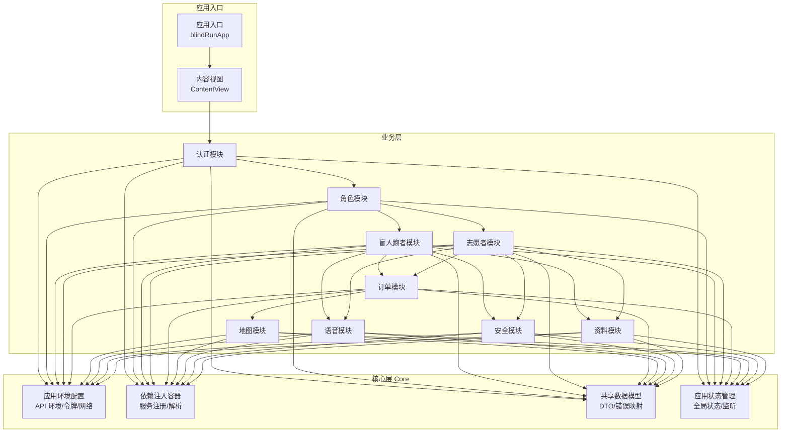
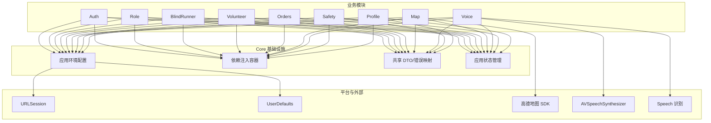
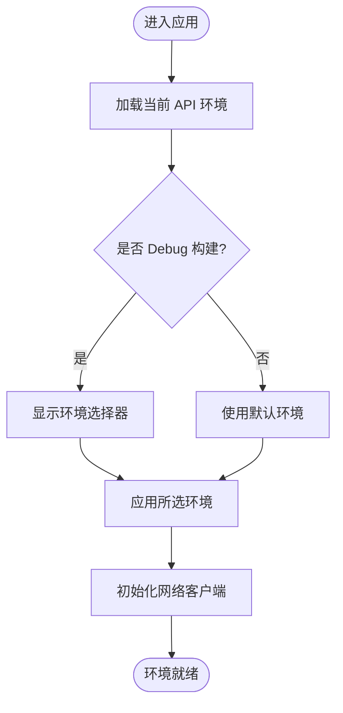
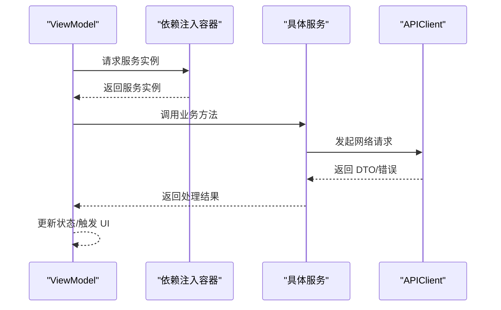
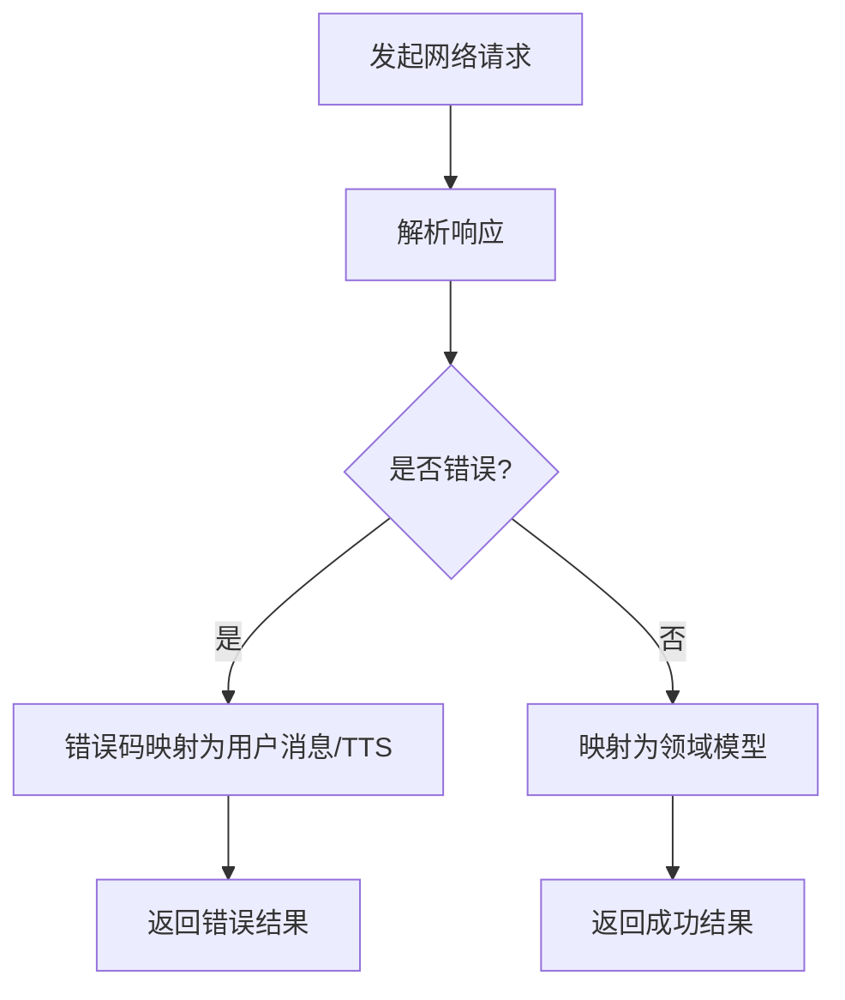
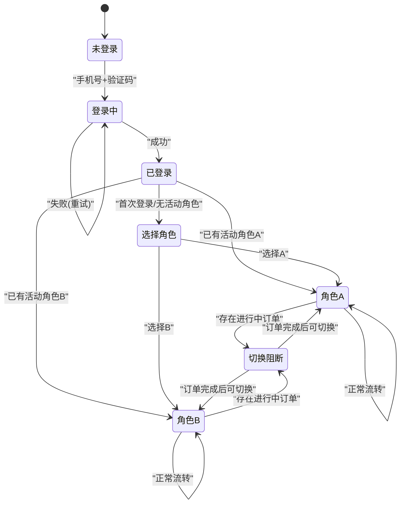
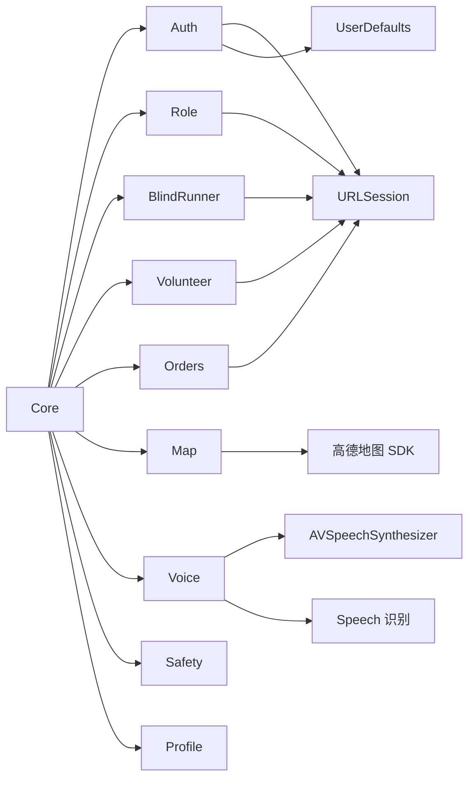

# Core 核心模块

<cite>
**本文引用的文件**
- [blindRunApp.swift](file://blindRun/blindRunApp.swift)
- [ContentView.swift](file://blindRun/ContentView.swift)
- [08-ios-architecture.md](file://docs/08-ios-architecture.md)
- [04-user-flows-and-state-machine.md](file://docs/04-user-flows-and-state-machine.md)
- [tasks.md](file://openspec/changes/add-aidrun-ios-spring-mvp/tasks.md)
- [design.md](file://openspec/changes/add-aidrun-ios-spring-mvp/design.md)
- [proposal.md](file://openspec/changes/add-aidrun-ios-spring-mvp/proposal.md)
</cite>

## 目录
1. [简介](#简介)
2. [项目结构](#项目结构)
3. [核心组件](#核心组件)
4. [架构总览](#架构总览)
5. [详细组件分析](#详细组件分析)
6. [依赖分析](#依赖分析)
7. [性能考虑](#性能考虑)
8. [故障排查指南](#故障排查指南)
9. [结论](#结论)
10. [附录](#附录)

## 简介
本文件面向 Core 核心模块，系统化阐述其在应用基础设施中的职责与实现要点，包括：
- 应用环境配置（API 环境切换）
- 依赖注入容器与模块间解耦
- 共享数据模型（DTO）与状态管理
- 全局状态的存储、更新与监听
- 在其他模块中使用 Core 提供的服务与模型
- 模块初始化流程与配置最佳实践

根据现有仓库信息，Core 模块被明确定义为“应用环境、依赖容器、共享模型、应用状态”的基础设施层；同时，文档还明确了 API 客户端协议、环境切换、令牌持久化等关键能力边界。

## 项目结构
当前仓库处于 MVP 设计与规划阶段，尚未包含具体实现代码。但已通过文档明确模块分组与职责划分，Core 位于模块树的中心位置，为 Auth、Role、BlindRunner、Volunteer、Orders、Map、Voice、Safety、Profile 等模块提供基础能力。

图表来源
- [08-ios-architecture.md:18-32](file://docs/08-ios-architecture.md#L18-L32)
- [tasks.md:28-33](file://openspec/changes/add-aidrun-ios-spring-mvp/tasks.md#L28-L33)

章节来源
- [08-ios-architecture.md:18-32](file://docs/08-ios-architecture.md#L18-L32)
- [tasks.md:28-33](file://openspec/changes/add-aidrun-ios-spring-mvp/tasks.md#L28-L33)

## 核心组件
本节从职责与协作角度，对 Core 的四大支柱进行说明，并给出与业务模块的交互关系。

- 应用环境配置
  - 职责：统一管理 API 环境（mock/localBackend/production）、基础 URL、显示名称与调试态环境切换入口。
  - 与业务模块的关系：所有网络调用均通过统一的环境配置生成请求，避免硬编码与分散配置。
  - 参考路径：[API 环境切换:50-66](file://docs/08-ios-architecture.md#L50-L66)

- 依赖注入容器
  - 职责：集中注册与解析服务实例，屏蔽模块间直接依赖，支持 Mock 与真实实现的无缝切换。
  - 与业务模块的关系：业务模块仅依赖抽象协议或容器解析结果，降低耦合度。
  - 参考路径：[APIClient 协议与实现共享调用点:68-76](file://docs/08-ios-architecture.md#L68-L76)

- 共享数据模型（DTO）
  - 职责：与后端 OpenAPI 合约保持一致的数据结构，承载成功响应与错误封装；提供错误码到用户提示与 TTS 的映射。
  - 与业务模块的关系：业务层通过 DTO 进行序列化/反序列化与错误处理，确保跨模块一致性。
  - 参考路径：[APIClient 责任与 DTO 使用:68-76](file://docs/08-ios-architecture.md#L68-L76)

- 应用状态管理
  - 职责：维护全局状态（如登录态、活动角色、当前页面状态），提供状态变更通知与订阅机制。
  - 与业务模块的关系：各 ViewModel 订阅状态变化并驱动 UI 更新；状态变更由 Core 统一调度。
  - 参考路径：[认证与角色状态:84-96](file://docs/08-ios-architecture.md#L84-L96)

章节来源
- [08-ios-architecture.md:50-96](file://docs/08-ios-architecture.md#L50-L96)

## 架构总览
下图展示了 Core 在整体架构中的定位与与其他模块的交互方式。Core 作为基础设施层，向上提供环境、容器、模型与状态，向下对接平台能力（URLSession、UserDefaults、高德地图等）。

图表来源
- [08-ios-architecture.md:1-17](file://docs/08-ios-architecture.md#L1-L17)
- [08-ios-architecture.md:50-96](file://docs/08-ios-architecture.md#L50-L96)

## 详细组件分析

### 组件一：应用环境配置
- 设计原则
  - 环境枚举包含 baseURL 与显示名，便于在调试构建中暴露小环境选择器。
  - 支持 mock（本地假数据）、localBackend（本机/局域网后端）、production（保留）三类环境。
  - 本地后端应兼容常见局域网地址格式，便于联调。
- 关键行为
  - 在 Debug 构建中提供环境切换入口；生产构建保持占位 URL。
  - 令牌持久化采用 UserDefaults（MVP），后续迁移至 Keychain。
- 与业务模块的交互
  - 所有网络请求基于当前环境构造 URL 与请求头。
  - 认证模块负责读写令牌；其他模块仅消费令牌。
- 参考路径
  - [API 环境与实现指引:50-66](file://docs/08-ios-architecture.md#L50-L66)
  - [令牌持久化与迁移提示:78-82](file://docs/08-ios-architecture.md#L78-L82)

图表来源
- [08-ios-architecture.md:50-66](file://docs/08-ios-architecture.md#L50-L66)

章节来源
- [08-ios-architecture.md:50-82](file://docs/08-ios-architecture.md#L50-L82)

### 组件二：依赖注入容器
- 设计原则
  - 通过协议抽象服务边界，容器负责注册与解析，业务模块仅依赖协议。
  - 支持 Mock 与真实实现的切换，保证测试与调试灵活性。
- 关键行为
  - 注册阶段：将协议实现绑定到容器，支持单例或多例策略。
  - 解析阶段：按需获取服务实例，避免模块间直接 import。
- 与业务模块的交互
  - ViewModel 通过容器获取 Service 实例；Service 再调用 APIClient 与平台能力。
- 参考路径
  - [APIClient 协议与统一调用点:68-76](file://docs/08-ios-architecture.md#L68-L76)

图表来源
- [08-ios-architecture.md:68-76](file://docs/08-ios-architecture.md#L68-L76)

章节来源
- [08-ios-architecture.md:68-76](file://docs/08-ios-architecture.md#L68-L76)

### 组件三：共享数据模型（DTO）
- 设计原则
  - DTO 严格遵循 OpenAPI 合约，确保前后端契约稳定。
  - 错误封装统一返回错误码，映射为用户提示与 TTS 文案。
- 关键行为
  - 成功响应：按 DTO 结构解析为领域对象。
  - 失败响应：解析错误码并转换为用户可理解的消息。
- 与业务模块的交互
  - ViewModel 接收 DTO 并驱动 UI；Service 层负责网络与解析。
- 参考路径
  - [APIClient 责任与 DTO 使用:68-76](file://docs/08-ios-architecture.md#L68-L76)

图表来源
- [08-ios-architecture.md:68-76](file://docs/08-ios-architecture.md#L68-L76)

章节来源
- [08-ios-architecture.md:68-76](file://docs/08-ios-architecture.md#L68-L76)

### 组件四：应用状态管理
- 设计原则
  - 全局状态集中管理，提供订阅/通知机制，确保多模块状态一致性。
  - 登录态与活动角色独立管理，支持角色切换与阻断逻辑。
- 关键行为
  - 登录成功后保存令牌与当前用户；首次登录可能无活动角色，引导角色选择。
  - 角色切换仅改变 activeRole，若存在进行中订单则阻断切换。
- 与业务模块的交互
  - ViewModel 订阅状态变化，驱动导航与 UI 更新；业务逻辑围绕状态机推进。
- 参考路径
  - [认证与角色状态:84-96](file://docs/08-ios-architecture.md#L84-L96)
  - [用户流程与状态机:1-70](file://docs/04-user-flows-and-state-machine.md#L1-L70)

图表来源
- [08-ios-architecture.md:84-96](file://docs/08-ios-architecture.md#L84-L96)
- [04-user-flows-and-state-machine.md:1-70](file://docs/04-user-flows-and-state-machine.md#L1-L70)

章节来源
- [08-ios-architecture.md:84-96](file://docs/08-ios-architecture.md#L84-L96)
- [04-user-flows-and-state-machine.md:1-70](file://docs/04-user-flows-and-state-machine.md#L1-L70)

## 依赖分析
- 模块内聚与耦合
  - Core 与业务模块之间通过协议与容器解耦，降低直接依赖。
  - 业务模块仅感知抽象接口，不关心具体实现与环境差异。
- 外部依赖
  - 网络：URLSession
  - 存储：UserDefaults（MVP）
  - 地图：高德地图 SDK
  - 语音：AVSpeechSynthesizer、Speech 识别
- 循环依赖规避
  - 通过容器与协议抽象避免循环导入；业务模块不直接 import Core 实现。

图表来源
- [08-ios-architecture.md:1-17](file://docs/08-ios-architecture.md#L1-L17)
- [08-ios-architecture.md:50-96](file://docs/08-ios-architecture.md#L50-L96)

章节来源
- [08-ios-architecture.md:1-17](file://docs/08-ios-architecture.md#L1-L17)
- [08-ios-architecture.md:50-96](file://docs/08-ios-architecture.md#L50-L96)

## 性能考虑
- 网络层
  - 简化重试策略，避免复杂离线队列；减少不必要的并发请求。
  - 对于长耗时操作（如订单轮询）采用 5 秒间隔，避免过度拉取。
- 存储层
  - UserDefaults 适合 MVP；生产前迁移至 Keychain，提升安全性与可靠性。
- 地图与语音
  - 地图渲染与语音合成按需触发，避免频繁重建与重复播报。
- 状态更新
  - 状态变更采用批量更新与去抖策略，减少 UI 重绘频率。

## 故障排查指南
- 环境配置问题
  - 症状：网络请求失败或返回假数据。
  - 排查：确认当前环境是否为 mock/localBackend/production；检查 baseURL 是否正确。
  - 参考路径：[API 环境与实现指引:50-66](file://docs/08-ios-architecture.md#L50-L66)
- 令牌相关问题
  - 症状：登录成功但后续接口报未授权。
  - 排查：检查 UserDefaults 中是否存在有效 JWT；确认是否在 Debug 构建中正确选择了环境。
  - 参考路径：[令牌持久化与迁移提示:78-82](file://docs/08-ios-architecture.md#L78-L82)
- 角色切换阻断
  - 症状：尝试切换角色时报错或无法切换。
  - 排查：确认当前是否存在进行中订单；若存在，需等待订单完成后再切换。
  - 参考路径：[认证与角色状态:84-96](file://docs/08-ios-architecture.md#L84-L96)
- DTO 映射异常
  - 症状：解析失败或字段缺失。
  - 排查：核对后端 OpenAPI 合约；确保 DTO 字段与后端一致；检查错误码映射逻辑。
  - 参考路径：[APIClient 责任与 DTO 使用:68-76](file://docs/08-ios-architecture.md#L68-L76)

章节来源
- [08-ios-architecture.md:50-96](file://docs/08-ios-architecture.md#L50-L96)

## 结论
Core 核心模块在 AidRun MVP 中承担基础设施职责，通过统一的环境配置、依赖注入容器、共享 DTO 与应用状态管理，为各业务模块提供稳定、可扩展且易于测试的基础能力。结合文档中的模块分组与职责边界，Core 与业务模块之间形成清晰的协议与容器解耦，既满足 MVP 快速迭代需求，也为后续演进（如 Keychain 迁移、WebSocket 替代轮询等）预留了空间。

## 附录

### 模块初始化流程与配置最佳实践
- 初始化步骤
  - 加载应用环境（Debug 暴露环境选择器，Release 使用默认值）。
  - 注册依赖注入容器（协议实现绑定，支持 Mock/真实切换）。
  - 初始化状态管理（登录态恢复、活动角色恢复）。
  - 启动业务模块（ViewModel 订阅状态，触发首屏渲染）。
- 最佳实践
  - 将环境配置与令牌持久化集中在 Core，业务模块只读不写。
  - 使用协议抽象服务，容器统一解析，避免直接 import 实现。
  - DTO 与后端合约强一致，错误映射集中处理，保障用户体验一致性。
  - 状态变更最小化，订阅粒度合理，避免过度刷新。

章节来源
- [08-ios-architecture.md:50-96](file://docs/08-ios-architecture.md#L50-L96)
- [tasks.md:28-33](file://openspec/changes/add-aidrun-ios-spring-mvp/tasks.md#L28-L33)
- [design.md:18-37](file://openspec/changes/add-aidrun-ios-spring-mvp/design.md#L18-L37)
- [proposal.md:1-37](file://openspec/changes/add-aidrun-ios-spring-mvp/proposal.md#L1-L37)