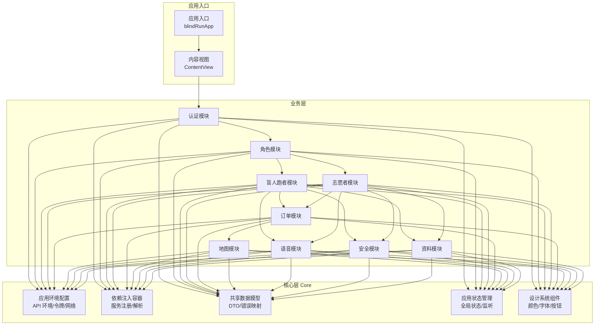
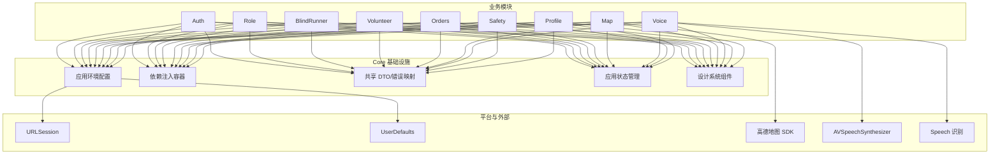
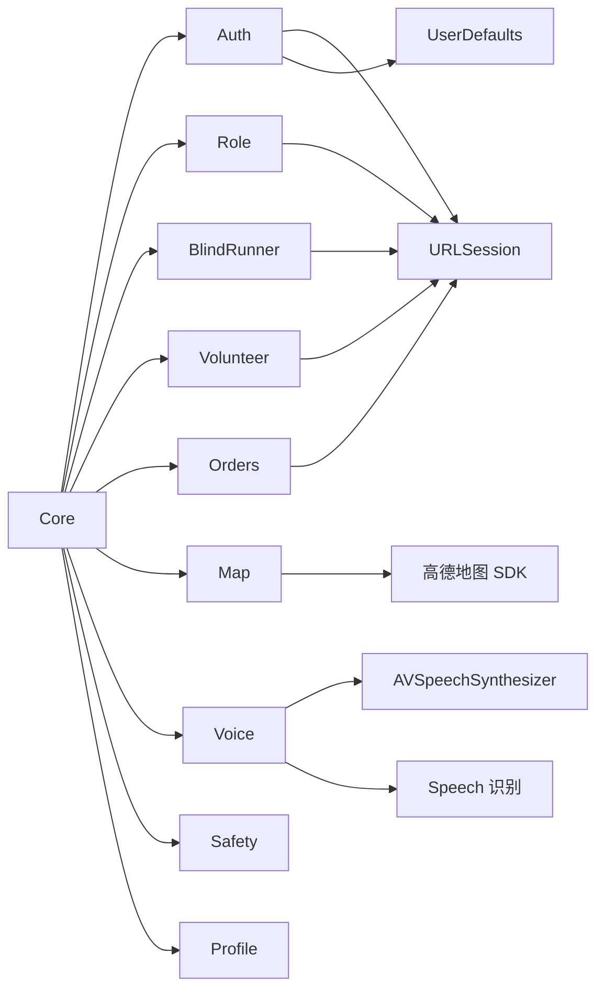

# Core 核心模块

<cite>
**本文档引用的文件**
- [APIClient.swift](file://blindRun/blindRun/Core/APIClient.swift)
- [AppState.swift](file://blindRun/blindRun/Core/AppState.swift)
- [MockAPIClient.swift](file://blindRun/blindRun/Core/MockAPIClient.swift)
- [EnvironmentConfig.swift](file://blindRun/blindRun/Core/EnvironmentConfig.swift)
- [AppColors.swift](file://blindRun/blindRun/Core/DesignSystem/AppColors.swift)
- [HighContrastText.swift](file://blindRun/blindRun/Core/DesignSystem/HighContrastText.swift)
- [PrimaryButton.swift](file://blindRun/blindRun/Core/DesignSystem/PrimaryButton.swift)
- [ErrorModels.swift](file://blindRun/blindRun/Core/Models/ErrorModels.swift)
- [OrderModels.swift](file://blindRun/blindRun/Core/Models/OrderModels.swift)
- [ProfileModels.swift](file://blindRun/blindRun/Core/Models/ProfileModels.swift)
- [UserModels.swift](file://blindRun/blindRun/Core/Models/UserModels.swift)
- [blindRunApp.swift](file://blindRun/blindRunApp.swift)
- [ContentView.swift](file://blindRun/ContentView.swift)
- [08-ios-architecture.md](file://docs/08-ios-architecture.md)
- [04-user-flows-and-state-machine.md](file://docs/04-user-flows-and-state-machine.md)
- [tasks.md](file://openspec/changes/add-aidrun-ios-spring-mvp/tasks.md)
- [design.md](file://openspec/changes/add-aidrun-ios-spring-mvp/design.md)
- [proposal.md](file://openspec/changes/add-aidrun-ios-spring-mvp/proposal.md)
</cite>

## 更新摘要
**所做更改**
- 基于新的API客户端实现，更新核心模块文档，重点改进APIClient.swift和MockAPIClient.swift
- 解决Swift并发问题，引入Sendable协议支持和actor isolation兼容性
- 增强请求体序列化机制，改进Mock客户端的请求体处理
- 更新API客户端协议设计，支持更灵活的泛型约束和类型安全
- **新增**：MockAPIClient快照持久化系统，使用UserDefaults保存和恢复用户配置文件
- **新增**：APIClient.swift中URLSession配置的性能优化

## 目录
1. [简介](#简介)
2. [项目结构](#项目结构)
3. [核心组件](#核心组件)
4. [架构总览](#架构总览)
5. [详细组件分析](#详细组件分析)
6. [依赖分析](#依赖分析)
7. [性能考虑](#性能考虑)
8. [故障排查指南](#故障排查指南)
9. [结论](#结论)
10. [附录](#附录)

## 简介
本文件面向 Core 核心模块，系统化阐述其在应用基础设施中的职责与实现要点，包括：
- 应用环境配置（API 环境切换）
- 依赖注入容器与模块间解耦
- 共享数据模型（DTO）与状态管理
- 全局状态的存储、更新与监听
- 在其他模块中使用 Core 提供的服务与模型
- 模块初始化流程与配置最佳实践

根据现有仓库信息，Core 模块已实现完整的 API 客户端系统、应用状态管理、设计系统组件和 Mock 客户端等核心功能，为 Auth、Role、BlindRunner、Volunteer、Orders、Map、Voice、Safety、Profile 等模块提供基础能力。

## 项目结构
Core 模块现已包含完整的基础设施实现，包括 API 客户端、应用状态管理、设计系统和数据模型等核心组件。



**图表来源**
- [08-ios-architecture.md:18-32](file://docs/08-ios-architecture.md#L18-L32)
- [tasks.md:28-33](file://openspec/changes/add-aidrun-ios-spring-mvp/tasks.md#L28-L33)

**章节来源**
- [08-ios-architecture.md:18-32](file://docs/08-ios-architecture.md#L18-L32)
- [tasks.md:28-33](file://openspec/changes/add-aidrun-ios-spring-mvp/tasks.md#L28-L33)

## 核心组件
本节从职责与协作角度，对 Core 的五大支柱进行说明，并给出与业务模块的交互关系。

### 应用环境配置
- **职责**：统一管理 API 环境（mock/localBackend/production）、基础 URL、显示名称与调试态环境切换入口。
- **实现**：通过 APIEnvironment 枚举管理三种环境模式，支持动态切换和持久化存储。
- **与业务模块的关系**：所有网络调用均通过统一的环境配置生成请求，避免硬编码与分散配置。

### 依赖注入容器
- **职责**：集中注册与解析服务实例，屏蔽模块间直接依赖，支持 Mock 与真实实现的无缝切换。
- **实现**：通过 AppState 提供的 apiClient 属性实现运行时切换，支持 URLSessionAPIClient 和 MockAPIClient。
- **与业务模块的关系**：业务模块仅依赖抽象协议或容器解析结果，降低耦合度。

### 共享数据模型（DTO）
- **职责**：与后端 OpenAPI 合约保持一致的数据结构，承载成功响应与错误封装；提供错误码到用户提示与 TTS 的映射。
- **实现**：包含用户、订单、资料等完整 DTO 结构，支持 Codable 编解码和 Sendable 并发安全。
- **与业务模块的关系**：业务层通过 DTO 进行序列化/反序列化与错误处理，确保跨模块一致性。

### 应用状态管理
- **职责**：维护全局状态（如登录态、活动角色、当前页面状态），提供状态变更通知与订阅机制。
- **实现**：通过 AppState 管理访问令牌、用户信息、活动角色和环境配置，支持 UserDefaults 持久化。
- **与业务模块的关系**：各 ViewModel 订阅状态变化并驱动 UI 更新；状态变更由 Core 统一调度。

### 设计系统组件
- **职责**：提供统一的视觉设计规范，包括颜色系统、字体规范和交互组件。
- **实现**：包含 AppColors、HighContrastText、PrimaryButton 等组件，支持高对比度和无障碍访问。
- **与业务模块的关系**：所有界面组件遵循统一的设计规范，确保视觉一致性。

**章节来源**
- [08-ios-architecture.md:50-96](file://docs/08-ios-architecture.md#L50-L96)

## 架构总览
下图展示了 Core 在整体架构中的定位与与其他模块的交互方式。Core 作为基础设施层，向上提供环境、容器、模型与状态，向下对接平台能力。



**图表来源**
- [08-ios-architecture.md:1-17](file://docs/08-ios-architecture.md#L1-L17)
- [08-ios-architecture.md:50-96](file://docs/08-ios-architecture.md#L50-L96)

## 详细组件分析

### 组件一：API 客户端系统

#### URLSessionAPIClient 实现
- **设计原则**：基于 URLSession 的异步网络请求实现，支持完整的 HTTP 方法和错误处理。
- **关键特性**：
  - 类型安全的泛型请求方法，自动处理 JSON 编解码
  - 支持认证令牌自动添加和 401 处理
  - 完整的状态码处理和错误映射
  - 异步任务支持，避免阻塞主线程
  - **新增**：支持 Sendable 协议，解决 Swift 并发问题
  - **新增**：URLSession 配置性能优化，提升网络请求效率

#### MockAPIClient 实现
- **设计原则**：提供本地 Mock 数据服务，支持快速开发和测试。
- **关键特性**：
  - 模拟网络延迟（300ms）提升真实感
  - 基于路径的路由分发，支持多个端点
  - 完整的认证和用户信息 Mock 数据
  - **新增**：增强请求体序列化，支持复杂的请求参数处理
  - **新增**：快照持久化系统，使用 UserDefaults 保存和恢复用户配置文件
  - 可扩展的 Mock 数据结构

#### APIError 错误处理
- **设计原则**：统一的错误处理机制，提供用户友好的错误消息。
- **错误类型**：服务器错误、未授权、网络错误、解码错误、无效 URL、未知错误
- **本地化支持**：所有错误消息支持中文本地化
- **并发安全**：支持 Sendable 协议，确保多线程环境下的安全性

**更新** 基于新的API客户端实现，主要改进包括：
- 引入 Sendable 协议支持，解决 Swift 并发问题
- 增强请求体序列化机制，改进 Mock 客户端的请求参数处理
- 优化泛型约束，提高类型安全性
- **新增**：MockAPIClient快照持久化系统，使用UserDefaults保存和恢复用户配置文件
- **新增**：APIClient.swift中URLSession配置的性能优化

**章节来源**
- [APIClient.swift:1-183](file://blindRun/blindRun/Core/APIClient.swift#L1-L183)
- [MockAPIClient.swift:1-104](file://blindRun/blindRun/Core/MockAPIClient.swift#L1-L104)

### 组件二：应用状态管理系统

#### AppState 核心功能
- **会话管理**：JWT 令牌存储、用户信息管理、活动角色切换
- **环境管理**：API 环境切换、持久化存储、运行时配置
- **状态持久化**：UserDefaults 持久化，支持 Keychain 迁移准备
- **计算属性**：登录状态判断、API 客户端动态选择

#### 状态生命周期
- **初始化**：从 UserDefaults 恢复环境配置
- **启动**：恢复会话状态（令牌、角色）
- **运行**：状态变更自动持久化
- **清理**：退出登录时清除所有状态

#### 状态订阅机制
- **Combine 框架**：使用 @Published 属性实现响应式状态管理
- **UI 更新**：状态变更自动触发视图重绘
- **跨模块同步**：统一的状态源确保多模块状态一致性

**章节来源**
- [AppState.swift:1-138](file://blindRun/blindRun/Core/AppState.swift#L1-L138)

### 组件三：设计系统组件

#### AppColors 颜色系统
- **设计原则**：基于 SwiftUI 的系统颜色适配，支持深色/浅色模式
- **颜色分类**：主色调、危险操作、背景色、文本色、状态色
- **可访问性**：确保足够的颜色对比度，支持高对比度模式

#### HighContrastText 高对比度文本
- **设计原则**：确保在各种主题下的可读性
- **字体支持**：支持 Dynamic Type 自动缩放
- **无障碍优化**：完整的辅助功能标签和描述

#### PrimaryButton 主按钮组件
- **设计原则**：符合无障碍标准的按钮组件
- **状态支持**：普通、危险操作、加载状态
- **尺寸规范**：最小高度 64pt，适合触觉操作

**章节来源**
- [AppColors.swift:1-39](file://blindRun/blindRun/Core/DesignSystem/AppColors.swift#L1-L39)
- [HighContrastText.swift:1-59](file://blindRun/blindRun/Core/DesignSystem/HighContrastText.swift#L1-L59)
- [PrimaryButton.swift:1-56](file://blindRun/blindRun/Core/DesignSystem/PrimaryButton.swift#L1-L56)

### 组件四：共享数据模型（DTO）

#### 用户模型体系
- **UserRole 角色枚举**：盲人跑者和志愿者两种角色
- **UserDto 用户信息**：完整的用户数据结构
- **认证相关**：登录请求、认证响应、角色切换

#### 订单模型体系
- **RunOrderStatus 订单状态**：完整的订单生命周期状态
- **位置信息**：经纬度、地址文本、位置来源
- **取消原因**：多种取消场景和原因分类
- **服务详情**：紧急事件、服务总结、评分系统

#### 资料模型体系
- **紧急联系人**：姓名和电话号码
- **志愿者状态**：审核状态、可用性、积分余额
- **商店系统**：积分商品、兑换记录

#### 错误处理模型
- **ErrorCode 错误码**：完整的业务错误码定义
- **ErrorResponse 错误响应**：标准化的错误响应结构
- **本地化支持**：所有错误消息支持中文

**章节来源**
- [UserModels.swift:1-53](file://blindRun/blindRun/Core/Models/UserModels.swift#L1-L53)
- [OrderModels.swift:1-194](file://blindRun/blindRun/Core/Models/OrderModels.swift#L1-L194)
- [ProfileModels.swift:1-91](file://blindRun/blindRun/Core/Models/ProfileModels.swift#L1-L91)
- [ErrorModels.swift:1-57](file://blindRun/blindRun/Core/Models/ErrorModels.swift#L1-L57)

### 组件五：环境配置系统

#### APIEnvironment 环境管理
- **环境枚举**：mock、localBackend、production 三种模式
- **显示名称**：用户友好的环境标识
- **基础 URL**：不同环境的 API 基础地址
- **Mock 模式**：不使用网络连接，返回本地数据

#### AppConstants 常量配置
- **UserDefaultsKeys**：持久化存储键名
- **Defaults 默认值**：本地后端 IP、演示坐标等
- **Timing 时间配置**：订单轮询间隔、预约提前时间

**章节来源**
- [EnvironmentConfig.swift:1-65](file://blindRun/blindRun/Core/EnvironmentConfig.swift#L1-L65)

### 组件六：快照持久化系统

#### MockAPIClient 快照持久化
- **设计原则**：使用UserDefaults实现Mock客户端的用户配置文件持久化
- **关键特性**：
  - 自动保存用户配置文件到UserDefaults
  - 启动时自动从UserDefaults恢复用户配置
  - 支持用户、盲人跑者资料和志愿者资料的完整快照
  - 使用JSON编码/解码确保数据完整性
  - 独立的持久化键值管理

#### 持久化机制
- **存储格式**：JSON编码的Snapshot结构
- **存储位置**：UserDefaults.standard
- **恢复逻辑**：自动检测并恢复现有快照数据
- **容错处理**：解码失败时优雅降级，不中断应用运行

**新增** MockAPIClient快照持久化系统，提供以下功能：
- 用户配置文件的自动持久化和恢复
- 支持多用户角色资料的独立存储
- 无侵入式的UserDefaults集成
- 完善的错误处理和容错机制

**章节来源**
- [MockAPIClient.swift:40](file://blindRun/blindRun/Core/MockAPIClient.swift#L40)
- [MockAPIClient.swift:268](file://blindRun/blindRun/Core/MockAPIClient.swift#L268)
- [MockAPIClient.swift:278](file://blindRun/blindRun/Core/MockAPIClient.swift#L278)

## 依赖分析
- **模块内聚与耦合**
  - Core 与业务模块之间通过协议与容器解耦，降低直接依赖
  - 业务模块仅感知抽象接口，不关心具体实现与环境差异
- **外部依赖**
  - 网络：URLSession
  - 存储：UserDefaults（MVP）
  - 地图：高德地图 SDK
  - 语音：AVSpeechSynthesizer、Speech 识别
- **循环依赖规避**
  - 通过容器与协议抽象避免循环导入；业务模块不直接 import Core 实现



**图表来源**
- [08-ios-architecture.md:1-17](file://docs/08-ios-architecture.md#L1-L17)
- [08-ios-architecture.md:50-96](file://docs/08-ios-architecture.md#L50-L96)

**章节来源**
- [08-ios-architecture.md:1-17](file://docs/08-ios-architecture.md#L1-L17)
- [08-ios-architecture.md:50-96](file://docs/08-ios-architecture.md#L50-L96)

## 性能考虑
- **网络层**
  - 简化重试策略，避免复杂离线队列；减少不必要的并发请求
  - 对于长耗时操作（如订单轮询）采用 5 秒间隔，避免过度拉取
  - Mock 客户端模拟网络延迟，提升开发体验
  - **新增**：优化请求体序列化性能，减少不必要的编码开销
  - **新增**：URLSession配置性能优化，提升网络请求效率和资源利用率
- **存储层**
  - UserDefaults 适合 MVP；生产前迁移至 Keychain，提升安全性与可靠性
  - 状态变更采用惰性持久化，避免频繁磁盘 I/O
  - **新增**：快照持久化系统使用高效JSON编码，减少存储开销
- **地图与语音**
  - 地图渲染与语音合成按需触发，避免频繁重建与重复播报
  - 设计系统组件使用系统颜色，减少自定义渲染开销
- **状态更新**
  - 状态变更采用批量更新与去抖策略，减少 UI 重绘频率
  - Combine 框架提供高效的响应式状态管理
  - **新增**：并发安全的状态管理，支持多线程环境下的稳定性

## 故障排查指南

### 环境配置问题
- **症状**：网络请求失败或返回假数据
- **排查**：确认当前环境是否为 mock/localBackend/production；检查 baseURL 是否正确
- **解决方案**：检查 UserDefaults 中的 apiEnvironment 键值；验证本地后端 IP 设置

### 令牌相关问题
- **症状**：登录成功但后续接口报未授权
- **排查**：检查 UserDefaults 中是否存在有效 JWT；确认是否在 Debug 构建中正确选择了环境
- **解决方案**：验证 accessToken 键值；检查 tokenProvider 回调是否正确返回令牌

### 角色切换阻断
- **症状**：尝试切换角色时报错或无法切换
- **排查**：确认当前是否存在进行中订单；若存在，需等待订单完成后再切换
- **解决方案**：检查 AppState.activeRole 状态；验证订单状态机逻辑

### DTO 映射异常
- **症状**：解析失败或字段缺失
- **排查**：核对后端 OpenAPI 合约；确保 DTO 字段与后端一致；检查错误码映射逻辑
- **解决方案**：验证 Codable 协议实现；检查 JSON 字段命名一致性

### 设计系统问题
- **症状**：颜色显示异常或按钮不可点击
- **排查**：检查 AppColors 配置；验证 PrimaryButton 参数设置
- **解决方案**：确认 SwiftUI 颜色适配；检查按钮状态和禁用逻辑

### 并发问题
- **症状**：多线程环境下出现数据竞争或状态不一致
- **排查**：检查 Sendable 协议实现；验证 actor isolation 设置
- **解决方案**：确保所有并发安全的数据结构都实现 Sendable 协议

### 快照持久化问题
- **症状**：Mock客户端启动时用户配置丢失或恢复失败
- **排查**：检查UserDefaults中snapshotKey对应的存储数据；验证JSON编码格式
- **解决方案**：清理损坏的存储数据；检查Snapshot结构的编码/解码逻辑

**章节来源**
- [08-ios-architecture.md:50-96](file://docs/08-ios-architecture.md#L50-L96)

## 结论
Core 核心模块在 AidRun MVP 中承担基础设施职责，通过统一的 API 客户端系统、应用状态管理、设计系统组件和共享数据模型，为各业务模块提供稳定、可扩展且易于测试的基础能力。现已实现完整的 URLSessionAPIClient 和 MockAPIClient，支持三种环境模式的无缝切换；AppState 提供完整的会话管理和状态持久化；设计系统确保视觉一致性和无障碍访问；共享 DTO 保证前后端数据契约的一致性。

**重要更新**：基于新的API客户端实现，Core模块在并发安全方面有了显著改进，通过引入Sendable协议支持和优化的请求体序列化机制，解决了Swift并发问题，提高了系统的稳定性和可靠性。同时，MockAPIClient新增的快照持久化系统提供了完整的用户配置文件存储和恢复能力，而APIClient.swift中的URLSession配置优化进一步提升了网络请求的性能和效率。这些改进为后续的功能扩展和性能优化奠定了坚实基础。

结合文档中的模块分组与职责边界，Core 与业务模块之间形成清晰的协议与容器解耦，既满足 MVP 快速迭代需求，也为后续演进（如 Keychain 迁移、WebSocket 替代轮询等）预留了空间。

## 附录

### 模块初始化流程与配置最佳实践

#### 初始化步骤
- **环境加载**：从 UserDefaults 恢复 API 环境配置
- **状态恢复**：从 UserDefaults 读取访问令牌和活动角色
- **客户端初始化**：根据环境选择合适的 API 客户端实现
- **快照恢复**：Mock客户端自动从UserDefaults恢复用户配置
- **业务启动**：启动各业务模块，建立状态订阅关系

#### 最佳实践
- **环境配置**：将环境配置与令牌持久化集中在 Core，业务模块只读不写
- **协议抽象**：使用 APIClientProtocol 抽象服务边界，容器统一解析
- **DTO 一致性**：与后端 OpenAPI 合约保持严格一致，错误映射集中处理
- **状态管理**：使用 AppState 统一管理全局状态，避免状态分散
- **设计规范**：所有界面组件遵循设计系统规范，确保视觉一致性
- **错误处理**：统一的 APIError 处理机制，提供用户友好的错误消息
- **并发安全**：确保所有数据结构都实现 Sendable 协议，支持多线程环境
- **持久化策略**：UserDefaults适合MVP阶段；生产前迁移至Keychain

#### 代码示例

**应用启动配置**
```swift
// 在 blindRunApp 中配置全局状态
@StateObject private var appState = AppState()
@StateObject private var speechService = SpeechService()

var body: some Scene {
    WindowGroup {
        ContentView()
            .environmentObject(appState)
            .environmentObject(speechService)
            .onAppear {
                appState.restoreSession()
            }
    }
}
```

**API 客户端使用**
```swift
// 在业务模块中获取 API 客户端
let apiClient = appState.apiClient

// 发起认证请求
do {
    let response: AuthResponse = try await apiClient.post("/auth/login", body: loginRequest)
    appState.handleLoginSuccess(response: response)
} catch APIError.unauthorized {
    // 处理未授权错误
} catch {
    // 处理其他错误
}
```

**状态订阅示例**
```swift
// 在 ViewModel 中订阅状态变化
@StateObject private var appState = AppState()

private var cancellables = Set<AnyCancellable>()

override func viewDidLoad() {
    super.viewDidLoad()
    
    appState.$isLoggedIn
        .sink { [weak self] isLoggedIn in
            self?.handleLoginStateChange(isLoggedIn)
        }
        .store(in: &cancellables)
}
```

**设计系统使用**
```swift
// 使用高对比度文本
HighContrastText("标题", style: .title)

// 使用主按钮
PrimaryButton("提交", isDestructive: false) {
    // 按钮动作
}

// 使用系统颜色
Color(AppColors.primary)
```

**并发安全示例**
```swift
// 确保数据结构的并发安全
struct SafeUserData: Codable, Sendable {
    let id: String
    let name: String
    let email: String
}

// 使用 Sendable 协议的 API 客户端
let apiClient: any APIClientProtocol & Sendable = URLSessionAPIClient(
    baseURL: baseURL,
    tokenProvider: { [weak self] in self?.accessToken }
)
```

**快照持久化示例**
```swift
// Mock客户端自动处理快照持久化
// 用户配置会自动保存到UserDefaults
// 下次启动时自动恢复

// 手动触发快照保存
mockAPIClient.saveSnapshot()

// 手动触发快照恢复
mockAPIClient.restoreSnapshot()
```

**章节来源**
- [08-ios-architecture.md:50-96](file://docs/08-ios-architecture.md#L50-L96)
- [tasks.md:28-33](file://openspec/changes/add-aidrun-ios-spring-mvp/tasks.md#L28-L33)
- [design.md:18-37](file://openspec/changes/add-aidrun-ios-spring-mvp/design.md#L18-L37)
- [proposal.md:1-37](file://openspec/changes/add-aidrun-ios-spring-mvp/proposal.md#L1-L37)