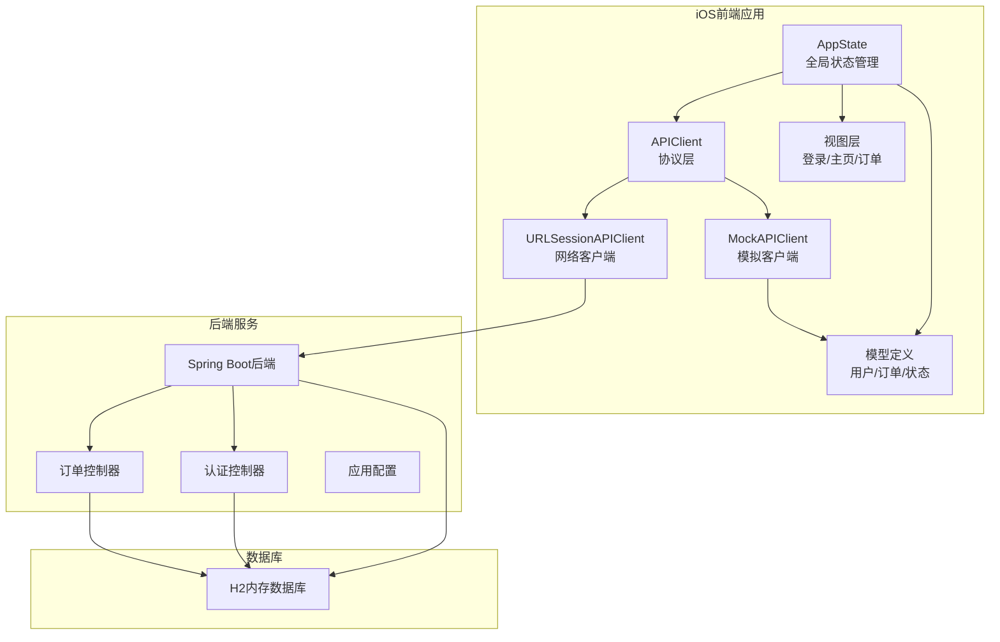
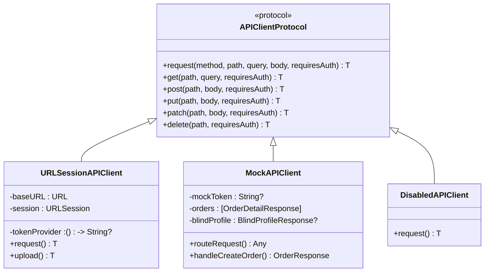
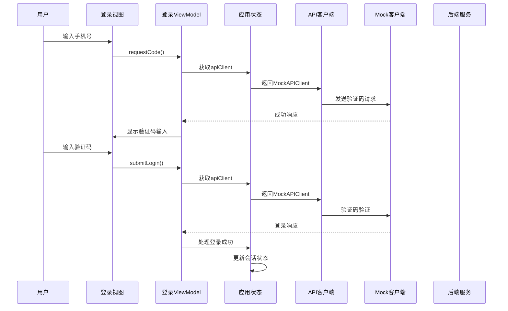
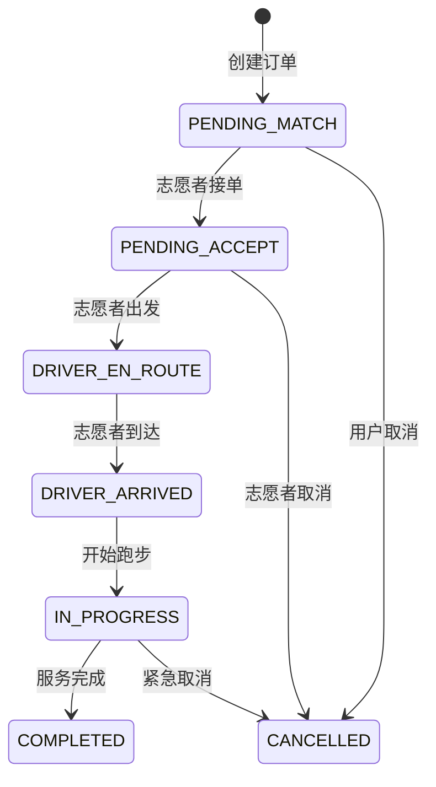
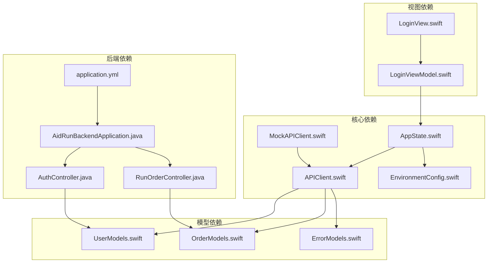

# Mock API 客户端功能增强

<cite>
**本文档引用的文件**
- [APIClient.swift](file://blindRun/Core/APIClient.swift)
- [MockAPIClient.swift](file://blindRun/Core/MockAPIClient.swift)
- [AppState.swift](file://blindRun/Core/AppState.swift)
- [EnvironmentConfig.swift](file://blindRun/Core/EnvironmentConfig.swift)
- [UserModels.swift](file://blindRun/Core/Models/UserModels.swift)
- [OrderModels.swift](file://blindRun/Core/Models/OrderModels.swift)
- [LoginView.swift](file://blindRun/Auth/LoginView.swift)
- [LoginViewModel.swift](file://blindRun/Auth/LoginViewModel.swift)
- [AidRunBackendApplication.java](file://backend/src/main/java/com/aidrun/backend/AidRunBackendApplication.java)
- [application.yml](file://backend/src/main/resources/application.yml)
- [AuthController.java](file://backend/src/main/java/com/aidrun/backend/auth/AuthController.java)
- [RunOrderController.java](file://backend/src/main/java/com/aidrun/backend/order/RunOrderController.java)
- [07-api-contract.openapi.yaml](file://docs/07-api-contract.openapi.yaml)
</cite>

## 目录
1. [项目概述](#项目概述)
2. [项目结构](#项目结构)
3. [核心组件](#核心组件)
4. [架构概览](#架构概览)
5. [详细组件分析](#详细组件分析)
6. [依赖关系分析](#依赖关系分析)
7. [性能考虑](#性能考虑)
8. [故障排除指南](#故障排除指南)
9. [结论](#结论)

## 项目概述

本项目是一个为视障人士设计的跑步辅助应用，包含完整的前后端架构。项目的核心功能是提供Mock API客户端功能增强，支持离线开发和演示，模拟真实的API交互流程。

项目采用SwiftUI框架构建iOS前端应用，Spring Boot构建后端服务，实现了从手机号登录到订单管理的完整业务流程。Mock API客户端作为核心组件，提供了完整的订单生命周期管理和状态转换功能。

## 项目结构

**图表来源**
- [AppState.swift:87-105](file://blindRun/Core/AppState.swift#L87-L105)
- [APIClient.swift:46-58](file://blindRun/Core/APIClient.swift#L46-L58)
- [MockAPIClient.swift:7-27](file://blindRun/Core/MockAPIClient.swift#L7-L27)

**章节来源**
- [AppState.swift:1-313](file://blindRun/Core/AppState.swift#L1-L313)
- [APIClient.swift:1-269](file://blindRun/Core/APIClient.swift#L1-L269)
- [MockAPIClient.swift:1-642](file://blindRun/Core/MockAPIClient.swift#L1-L642)

## 核心组件

### API客户端协议体系

项目实现了统一的API客户端协议，支持多种实现方式：

**图表来源**
- [APIClient.swift:46-58](file://blindRun/Core/APIClient.swift#L46-L58)
- [APIClient.swift:103-133](file://blindRun/Core/APIClient.swift#L103-L133)
- [MockAPIClient.swift:7-27](file://blindRun/Core/MockAPIClient.swift#L7-L27)
- [AppState.swift:302-312](file://blindRun/Core/AppState.swift#L302-L312)

### 状态管理系统

全局状态管理器负责协调各个模块的工作：

- **会话管理**：JWT令牌存储、用户身份验证
- **环境配置**：支持开发、演示、生产三种环境
- **WebSocket连接**：实时通信支持
- **数据持久化**：UserDefaults存储关键配置

**章节来源**
- [AppState.swift:9-313](file://blindRun/Core/AppState.swift#L9-L313)
- [EnvironmentConfig.swift:5-89](file://blindRun/Core/EnvironmentConfig.swift#L5-L89)

## 架构概览

**图表来源**
- [LoginView.swift:150-200](file://blindRun/Auth/LoginView.swift#L150-L200)
- [LoginViewModel.swift:149-213](file://blindRun/Auth/LoginViewModel.swift#L149-L213)
- [AppState.swift:87-105](file://blindRun/Core/AppState.swift#L87-L105)

## 详细组件分析

### Mock API客户端增强功能

Mock API客户端实现了完整的订单生命周期管理：

#### 订单状态流转

**图表来源**
- [OrderModels.swift:5-68](file://blindRun/Core/Models/OrderModels.swift#L5-L68)
- [MockAPIClient.swift:393-451](file://blindRun/Core/MockAPIClient.swift#L393-L451)

#### 认证流程

Mock客户端支持完整的认证机制：

- **手机号验证**：支持中国大陆手机号格式验证
- **验证码系统**：固定验证码123456用于演示
- **JWT令牌管理**：模拟令牌生成和刷新
- **角色切换**：支持盲人和志愿者角色切换

**章节来源**
- [MockAPIClient.swift:162-198](file://blindRun/Core/MockAPIClient.swift#L162-L198)
- [UserModels.swift:24-52](file://blindRun/Core/Models/UserModels.swift#L24-L52)

### 环境配置管理

应用支持四种运行环境：

| 环境类型 | 用途 | 特点 |
|---------|------|------|
| Mock | 本地开发 | 完全离线，模拟所有API |
| Local Backend | 本地联调 | 连接本地Spring Boot服务 |
| Demo Cloud | 演示环境 | 连接云端演示服务 |
| Production | 生产环境 | 连接正式生产服务 |

**章节来源**
- [EnvironmentConfig.swift:49-89](file://blindRun/Core/EnvironmentConfig.swift#L49-L89)
- [AppState.swift:87-105](file://blindRun/Core/AppState.swift#L87-L105)

### 数据模型设计

项目实现了完整的数据模型体系：

#### 用户模型
- **UserRole**：盲人、志愿者、未设置三种角色
- **认证请求**：手机号登录、验证码验证
- **响应模型**：登录响应、角色切换响应

#### 订单模型
- **RunOrderStatus**：完整的订单状态枚举
- **偏好设置**：配速偏好、路线偏好
- **分页响应**：支持后端返回的分页数据

**章节来源**
- [UserModels.swift:5-60](file://blindRun/Core/Models/UserModels.swift#L5-L60)
- [OrderModels.swift:108-195](file://blindRun/Core/Models/OrderModels.swift#L108-L195)

## 依赖关系分析

**图表来源**
- [APIClient.swift:1-269](file://blindRun/Core/APIClient.swift#L1-L269)
- [MockAPIClient.swift:1-642](file://blindRun/Core/MockAPIClient.swift#L1-L642)
- [AppState.swift:1-313](file://blindRun/Core/AppState.swift#L1-L313)

**章节来源**
- [AuthController.java:1-28](file://backend/src/main/java/com/aidrun/backend/auth/AuthController.java#L1-L28)
- [RunOrderController.java:1-140](file://backend/src/main/java/com/aidrun/backend/order/RunOrderController.java#L1-L140)

## 性能考虑

### Mock客户端优化策略

1. **网络延迟模拟**：300ms延迟模拟真实网络环境
2. **内存管理**：使用结构体而非类减少内存分配
3. **类型安全**：严格的类型检查避免运行时错误
4. **异步处理**：全面使用async/await提升并发性能

### 缓存策略

- **会话缓存**：UserDefaults存储令牌和用户信息
- **配置缓存**：环境配置持久化
- **状态缓存**：订单状态本地缓存

## 故障排除指南

### 常见问题及解决方案

#### 认证相关问题
- **验证码错误**：检查Mock客户端中的固定验证码123456
- **手机号格式错误**：验证11位数字格式
- **登录失败**：检查Mock客户端状态初始化

#### 订单相关问题
- **订单创建失败**：确认盲人资料和紧急联系人完整性
- **状态转换异常**：验证订单状态转换规则
- **查询结果为空**：检查Mock数据种子配置

#### 环境配置问题
- **无法连接后端**：检查本地IP配置和防火墙设置
- **环境切换失效**：验证构建通道配置
- **演示数据缺失**：检查环境变量设置

**章节来源**
- [MockAPIClient.swift:302-353](file://blindRun/Core/MockAPIClient.swift#L302-L353)
- [AppState.swift:207-228](file://blindRun/Core/AppState.swift#L207-L228)

## 结论

Mock API客户端功能增强项目成功实现了以下目标：

1. **完整的离线开发支持**：Mock客户端提供完整的API模拟功能
2. **灵活的环境配置**：支持多种运行环境的无缝切换
3. **健壮的状态管理**：完善的订单生命周期管理
4. **优秀的用户体验**：符合视障用户需求的界面设计

该项目为后续的功能扩展奠定了坚实的基础，特别是在订单管理、用户认证和实时通信方面的实现，为完整的业务流程提供了可靠的支撑。