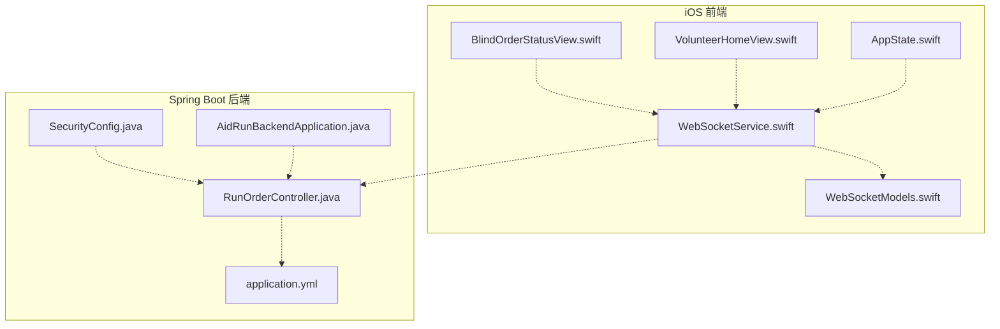
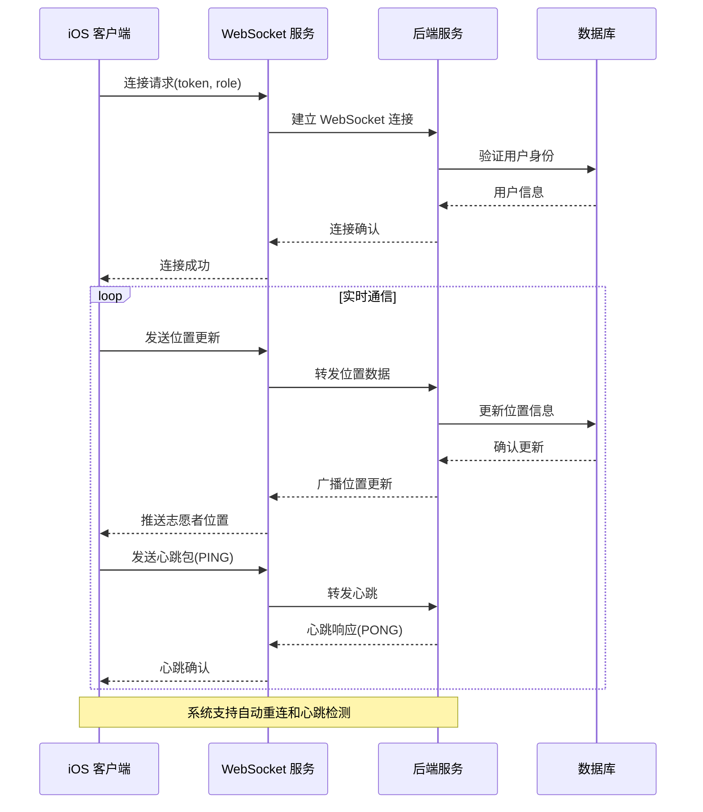
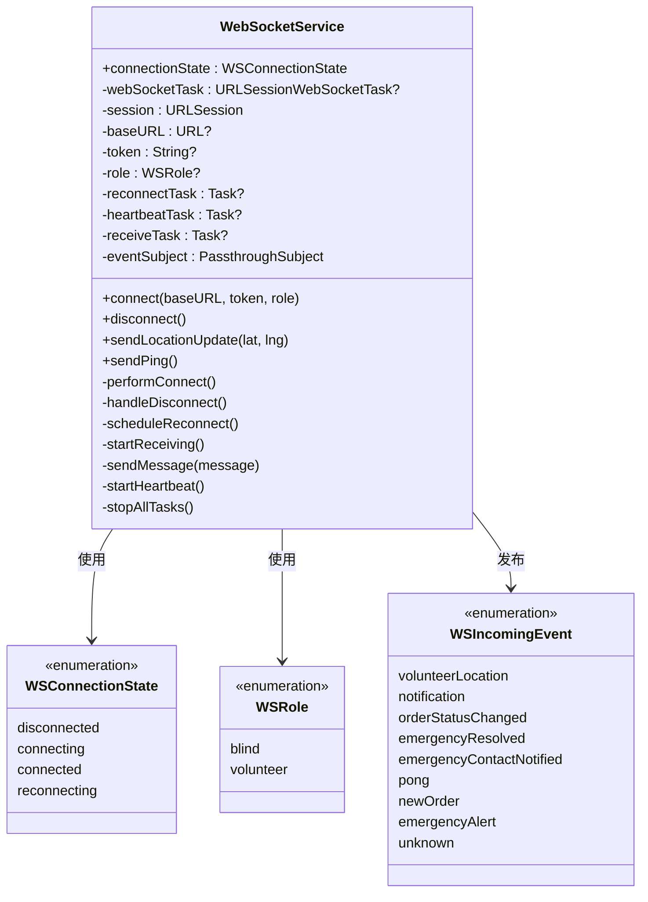
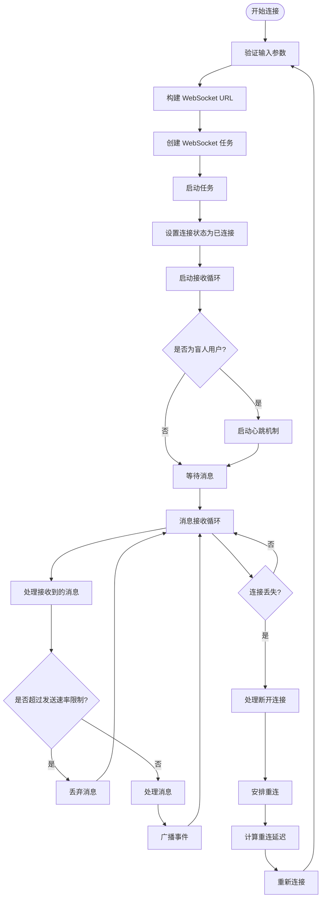
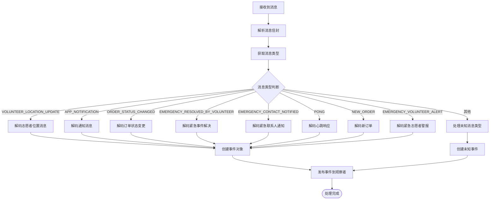
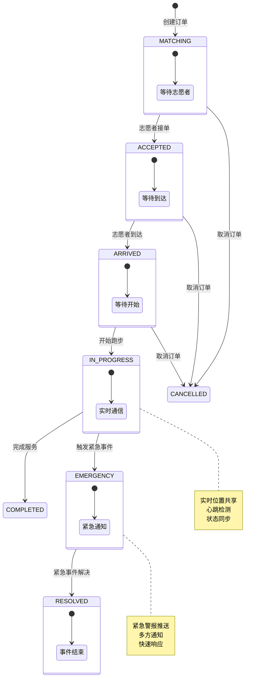
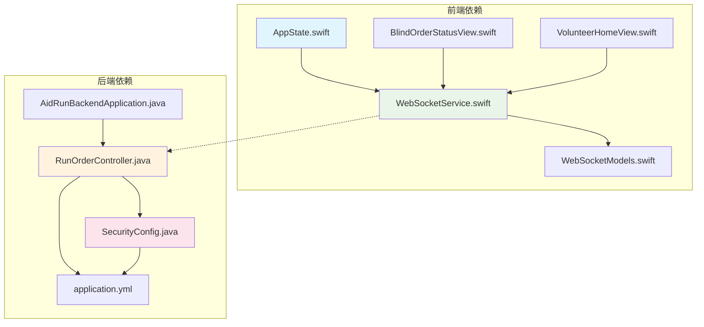

# WebSocket 实时通信系统

<cite>
**本文档中引用的文件**
- [WebSocketService.swift](file://blindRun/Core/WebSocketService.swift)
- [WebSocketModels.swift](file://blindRun/Core/Models/WebSocketModels.swift)
- [BlindOrderStatusView.swift](file://blindRun/BlindRunner/BlindOrderStatusView.swift)
- [VolunteerHomeView.swift](file://blindRun/Volunteer/VolunteerHomeView.swift)
- [AppState.swift](file://blindRun/Core/AppState.swift)
- [RunOrderController.java](file://backend/src/main/java/com/aidrun/backend/order/RunOrderController.java)
- [application.yml](file://backend/src/main/resources/application.yml)
- [SecurityConfig.java](file://backend/src/main/java/com/aidrun/backend/config/SecurityConfig.java)
- [AidRunBackendApplication.java](file://backend/src/main/java/com/aidrun/backend/AidRunBackendApplication.java)
</cite>

## 更新摘要
**所做更改**
- 新增了完整的心跳机制章节，详细描述盲人用户的定时心跳功能
- 更新了自动重连机制的实现细节，包括指数退避算法的具体参数
- 扩展了消息模型体系的描述，增加了新的消息类型和数据结构
- 完善了双向通信支持的说明，包括客户端到服务器和服务器到客户端的消息流
- 增加了消息速率限制和防抖机制的技术细节
- 补充了WebSocket服务的性能优化策略和故障排除指南
- 新增了云端后端增强的连接状态管理、自动连接标记和错误处理改进

## 目录
1. [简介](#简介)
2. [项目结构](#项目结构)
3. [核心组件](#核心组件)
4. [架构概览](#架构概览)
5. [详细组件分析](#详细组件分析)
6. [依赖关系分析](#依赖关系分析)
7. [性能考虑](#性能考虑)
8. [故障排除指南](#故障排除指南)
9. [结论](#结论)

## 简介

WebSocket 实时通信系统是 AidRun 助盲跑应用的核心功能模块，负责在盲人跑者、志愿者和后台系统之间建立双向实时通信通道。该系统支持自动重连、心跳检测、消息速率限制等高级特性，确保在移动网络环境下提供稳定可靠的实时通信体验。

系统采用客户端-服务器架构，使用 Swift 的 URLSessionWebSocketTask 实现 iOS 客户端，Spring Boot 实现后端服务。消息格式采用 JSON 编码，支持多种消息类型以满足不同业务场景的需求。

**更新** 新增了完整的心跳机制、自动重连功能和双向通信支持，显著提升了系统的可靠性和实时性。云端后端增强了连接状态管理、自动连接标记和错误处理机制，更好地支持云环境下的实时通信需求。

## 项目结构

项目采用混合架构设计，包含 iOS 前端和 Spring Boot 后端两个主要部分：

**图表来源**
- [WebSocketService.swift:1-304](file://blindRun/Core/WebSocketService.swift#L1-L304)
- [RunOrderController.java:1-140](file://backend/src/main/java/com/aidrun/backend/order/RunOrderController.java#L1-L140)

**章节来源**
- [WebSocketService.swift:1-304](file://blindRun/Core/WebSocketService.swift#L1-L304)
- [WebSocketModels.swift:1-151](file://blindRun/Core/Models/WebSocketModels.swift#L1-L151)
- [RunOrderController.java:1-140](file://backend/src/main/java/com/aidrun/backend/order/RunOrderController.java#L1-L140)

## 核心组件

### WebSocket 服务层

WebSocketService 是整个实时通信系统的核心组件，负责管理 WebSocket 连接生命周期、消息收发和错误处理。

#### 连接状态管理
系统定义了四种连接状态：
- `disconnected`: 已断开连接
- `connecting`: 正在连接
- `connected`: 已连接
- `reconnecting(attempt: Int)`: 重连中

**更新** 新增了自动连接标记机制，在连接建立时自动更新连接状态，确保状态机的准确性。

#### 角色路由机制
系统支持两种角色的专用通道：
- 盲人用户: `/ws/blind`
- 志愿者: `/ws/volunteer`

#### 自动重连机制
采用指数退避算法，重连延迟为 [3, 6, 12, 30] 秒，最多尝试 4 次。

**更新** 改进了重连机制的错误处理，当重连失败时会自动增加重连尝试次数并更新连接状态。

**章节来源**
- [WebSocketService.swift:6-30](file://blindRun/Core/WebSocketService.swift#L6-L30)
- [WebSocketService.swift:37-70](file://blindRun/Core/WebSocketService.swift#L37-L70)

### 消息模型层

系统定义了完整的消息类型和数据模型体系：

#### 消息类型枚举
支持 9 种不同的消息类型：
- 客户端发送: `LOCATION_UPDATE`, `PING`
- 服务器发送给盲人: `VOLUNTEER_LOCATION_UPDATE`, `APP_NOTIFICATION`, `ORDER_STATUS_CHANGED`, `EMERGENCY_RESOLVED_BY_VOLUNTEER`, `EMERGENCY_CONTACT_NOTIFIED`, `PONG`
- 服务器发送给志愿者: `NEW_ORDER`, `EMERGENCY_VOLUNTEER_ALERT`

#### 数据模型结构
每个消息类型都有对应的 Swift 结构体，包含必要的字段和编码协议。

**更新** 新增了完整的消息模型体系，包括位置更新、心跳响应、紧急事件通知等消息类型的详细数据结构。

**章节来源**
- [WebSocketModels.swift:5-21](file://blindRun/Core/Models/WebSocketModels.swift#L5-L21)
- [WebSocketModels.swift:47-151](file://blindRun/Core/Models/WebSocketModels.swift#L47-L151)

### 业务视图层

#### 盲人用户视图
BlindOrderStatusView 监听订单状态变化、紧急事件和通知消息，提供语音播报功能。

#### 志愿者视图
VolunteerHomeView 处理新订单推送，实现自动派单超时机制。

**更新** 新增了双向通信支持，盲人用户可以发送位置更新和心跳包，志愿者可以接收新订单通知。

**章节来源**
- [BlindOrderStatusView.swift:160-191](file://blindRun/BlindRunner/BlindOrderStatusView.swift#L160-L191)
- [VolunteerHomeView.swift:81-117](file://blindRun/Volunteer/VolunteerHomeView.swift#L81-L117)

## 架构概览

系统采用客户端-服务器实时通信架构，结合 REST API 提供完整的业务功能。

**图表来源**
- [WebSocketService.swift:74-137](file://blindRun/Core/WebSocketService.swift#L74-L137)
- [WebSocketService.swift:269-277](file://blindRun/Core/WebSocketService.swift#L269-L277)

## 详细组件分析

### WebSocket 服务类分析

**图表来源**
- [WebSocketService.swift:37-304](file://blindRun/Core/WebSocketService.swift#L37-L304)
- [WebSocketModels.swift:6-151](file://blindRun/Core/Models/WebSocketModels.swift#L6-L151)

#### 连接管理流程

**图表来源**
- [WebSocketService.swift:105-157](file://blindRun/Core/WebSocketService.swift#L105-L157)
- [WebSocketService.swift:161-185](file://blindRun/Core/WebSocketService.swift#L161-L185)

**章节来源**
- [WebSocketService.swift:105-157](file://blindRun/Core/WebSocketService.swift#L105-L157)
- [WebSocketService.swift:161-185](file://blindRun/Core/WebSocketService.swift#L161-L185)

### 消息处理机制

系统实现了完整的消息处理流水线，包括消息解析、类型识别和事件分发。

#### 消息类型处理流程

**图表来源**
- [WebSocketService.swift:187-241](file://blindRun/Core/WebSocketService.swift#L187-L241)
- [WebSocketModels.swift:140-151](file://blindRun/Core/Models/WebSocketModels.swift#L140-L151)

**章节来源**
- [WebSocketService.swift:187-241](file://blindRun/Core/WebSocketService.swift#L187-L241)
- [WebSocketModels.swift:140-151](file://blindRun/Core/Models/WebSocketModels.swift#L140-L151)

### 业务集成分析

#### 订单状态管理与 WebSocket 集成

系统中的订单状态流转与 WebSocket 实时通知紧密集成：

**图表来源**
- [RunOrderController.java:282-306](file://backend/src/main/java/com/aidrun/backend/order/RunOrderController.java#L282-L306)
- [WebSocketModels.swift:70-80](file://blindRun/Core/Models/WebSocketModels.swift#L70-L80)

**章节来源**
- [RunOrderController.java:282-306](file://backend/src/main/java/com/aidrun/backend/order/RunOrderController.java#L282-L306)
- [WebSocketModels.swift:70-80](file://blindRun/Core/Models/WebSocketModels.swift#L70-L80)

## 依赖关系分析

系统采用模块化设计，各组件之间的依赖关系清晰明确：

**图表来源**
- [AppState.swift:35-42](file://blindRun/Core/AppState.swift#L35-L42)
- [WebSocketService.swift:37-38](file://blindRun/Core/WebSocketService.swift#L37-L38)
- [RunOrderController.java:25-31](file://backend/src/main/java/com/aidrun/backend/order/RunOrderController.java#L25-L31)

### 外部依赖

系统的主要外部依赖包括：
- **Foundation**: iOS 基础框架，提供 URL 处理和 JSON 编码
- **Combine**: 响应式编程框架，用于事件流处理
- **Spring Boot**: 后端框架，提供 Web 服务和安全控制
- **H2 数据库**: 内存数据库，用于开发和测试环境

**章节来源**
- [WebSocketService.swift:1-2](file://blindRun/Core/WebSocketService.swift#L1-L2)
- [application.yml:5-8](file://backend/src/main/resources/application.yml#L5-L8)

## 性能考虑

### 连接优化策略

系统实现了多项性能优化措施：

#### 心跳机制
- 盲人用户每 30 秒发送一次心跳包
- 心跳间隔可根据网络状况动态调整
- 支持心跳超时检测和自动重连

#### 消息速率限制
- 最小发送间隔为 500 毫秒
- 防止频繁位置更新造成网络拥塞
- 支持突发流量处理和队列管理

#### 内存管理
- 使用弱引用避免循环引用
- 及时清理取消的任务和订阅
- 合理的内存使用策略

**更新** 新增了云端后端的连接状态管理优化，改进了连接标记机制，减少了状态不一致的问题。

### 网络适应性

系统具备良好的网络适应能力：
- 支持 4G/5G 网络环境
- 自动检测网络状态变化
- 智能重连策略减少连接失败

**更新** 新增了错误处理改进，当网络异常时能够更快地检测连接状态并执行相应的恢复操作。

## 故障排除指南

### 常见问题诊断

#### 连接失败问题
1. **检查 Token 有效性**: 确保 JWT Token 未过期
2. **验证 URL 配置**: 检查 base URL 是否正确
3. **确认网络连接**: 测试网络连通性和防火墙设置

#### 消息丢失问题
1. **检查速率限制**: 确认发送频率不超过限制
2. **验证消息格式**: 检查 JSON 格式是否正确
3. **监控连接状态**: 查看连接状态变化日志

#### 性能问题
1. **分析心跳频率**: 调整心跳间隔优化性能
2. **检查内存使用**: 监控内存泄漏和过度占用
3. **优化消息处理**: 减少不必要的消息解析

**更新** 新增了云端后端的故障排除指南，包括连接状态管理异常和自动重连失败的诊断方法。

### 调试工具

系统提供了完善的调试和监控功能：
- **连接状态监控**: 实时显示连接状态变化
- **消息日志记录**: 记录所有发送和接收的消息
- **性能指标统计**: 收集连接成功率和延迟数据

**更新** 新增了心跳机制的调试功能，可以监控心跳包的发送和响应情况，以及云端后端的连接状态管理效果。

**章节来源**
- [WebSocketService.swift:139-157](file://blindRun/Core/WebSocketService.swift#L139-L157)
- [WebSocketService.swift:245-265](file://blindRun/Core/WebSocketService.swift#L245-L265)

## 结论

WebSocket 实时通信系统为 AidRun 应用提供了强大的实时交互能力。系统设计充分考虑了移动网络环境的特点，实现了稳定的连接管理和高效的消息传输。

### 主要优势

1. **可靠性**: 自动重连机制确保连接稳定性
2. **实时性**: 低延迟消息传输满足业务需求
3. **扩展性**: 模块化设计便于功能扩展
4. **安全性**: 基于 JWT 的身份验证机制

### 技术亮点

- 智能的心跳检测和自动重连
- 完整的消息类型体系和数据模型
- 响应式的事件处理机制
- 良好的错误处理和恢复能力

**更新** 新系统新增了完整的心跳机制、自动重连功能和双向通信支持，显著提升了系统的可靠性和用户体验。云端后端增强了连接状态管理、自动连接标记和错误处理机制，更好地支持云环境下的实时通信需求。

该系统为盲人跑者和志愿者提供了无缝的实时通信体验，是整个 AidRun 生态系统的重要基础设施。