# 个人资料管理模块

<cite>
**本文档引用的文件**
- [ProfileController.java](file://backend/src/main/java/com/aidrun/backend/profile/ProfileController.java)
- [ProfileService.java](file://backend/src/main/java/com/aidrun/backend/profile/ProfileService.java)
- [BlindRunnerProfile.java](file://backend/src/main/java/com/aidrun/backend/profile/BlindRunnerProfile.java)
- [VolunteerProfile.java](file://backend/src/main/java/com/aidrun/backend/profile/VolunteerProfile.java)
- [EmergencyContact.java](file://backend/src/main/java/com/aidrun/backend/profile/EmergencyContact.java)
- [BlindRunnerProfileRepository.java](file://backend/src/main/java/com/aidrun/backend/profile/BlindRunnerProfileRepository.java)
- [VolunteerProfileRepository.java](file://backend/src/main/java/com/aidrun/backend/profile/VolunteerProfileRepository.java)
- [BlindRunnerProfileDto.java](file://backend/src/main/java/com/aidrun/backend/profile/dto/BlindRunnerProfileDto.java)
- [VolunteerProfileDto.java](file://backend/src/main/java/com/aidrun/backend/profile/dto/VolunteerProfileDto.java)
- [EmergencyContactDto.java](file://backend/src/main/java/com/aidrun/backend/profile/dto/EmergencyContactDto.java)
- [UpdateBlindRunnerProfileRequest.java](file://backend/src/main/java/com/aidrun/backend/profile/dto/UpdateBlindRunnerProfileRequest.java)
- [UpdateVolunteerProfileRequest.java](file://backend/src/main/java/com/aidrun/backend/profile/dto/UpdateVolunteerProfileRequest.java)
- [EmergencyContactRequest.java](file://backend/src/main/java/com/aidrun/backend/profile/dto/EmergencyContactRequest.java)
- [UserController.java](file://backend/src/main/java/com/aidrun/backend/user/UserController.java)
- [UserService.java](file://backend/src/main/java/com/aidrun/backend/user/UserService.java)
- [AppUser.java](file://backend/src/main/java/com/aidrun/backend/user/AppUser.java)
- [UserDto.java](file://backend/src/main/java/com/aidrun/backend/user/dto/UserDto.java)
- [UserMeResponse.java](file://backend/src/main/java/com/aidrun/backend/user/dto/UserMeResponse.java)
- [UserRole.java](file://backend/src/main/java/com/aidrun/backend/user/UserRole.java)
- [AdminReviewStatus.java](file://backend/src/main/java/com/aidrun/backend/profile/AdminReviewStatus.java)
- [VerificationStatus.java](file://backend/src/main/java/com/aidrun/backend/profile/VerificationStatus.java)
</cite>

## 更新摘要
**变更内容**
- 新增ProfileController和ProfileService实现，提供完整的个人资料CRUD操作
- 新增UpdateBlindRunnerProfileRequest和UpdateVolunteerProfileRequest DTO
- 新增EmergencyContactRequest DTO用于紧急联系人验证
- 新增完整的API端点：PUT /api/profiles/blind-runner 和 PUT /api/profiles/volunteer
- 新增完整的验证逻辑和业务规则实现
- **新增志愿者资料验证状态管理**：引入VerificationStatus枚举管理志愿者认证流程
- **新增管理员审核状态管理**：引入AdminReviewStatus枚举管理志愿者审核流程
- **完善紧急联系人管理**：实现紧急联系人的创建、更新和关联管理

## 目录
1. [简介](#简介)
2. [项目结构](#项目结构)
3. [核心组件](#核心组件)
4. [架构概览](#架构概览)
5. [详细组件分析](#详细组件分析)
6. [API规范](#api规范)
7. [验证逻辑](#验证逻辑)
8. [业务规则](#业务规则)
9. [状态管理](#状态管理)
10. [依赖关系分析](#依赖关系分析)
11. [性能考虑](#性能考虑)
12. [故障排除指南](#故障排除指南)
13. [结论](#结论)

## 简介

个人资料管理模块是 AidRun 后端系统中负责管理用户个人资料的核心功能模块。该模块主要处理两类用户角色的个人资料：视障跑者（Blind Runner）和志愿者（Volunteer）。模块采用分层架构设计，通过实体模型、数据传输对象（DTO）、仓库接口和业务服务类实现了完整的个人资料管理功能。

**更新** 新增了ProfileController和ProfileService实现，提供完整的CRUD操作、验证逻辑和业务规则，支持个人资料的创建、更新和查询操作。**新增志愿者资料验证状态管理、管理员审核状态管理和紧急联系人管理等完整功能**。

该模块支持用户基本信息查询、角色切换、紧急联系人管理以及个人资料的完整生命周期管理。系统通过 Spring Data JPA 提供数据持久化支持，并使用 DTO 模式实现数据传输的解耦和安全控制。

## 项目结构

个人资料管理模块在后端项目中的组织结构如下：

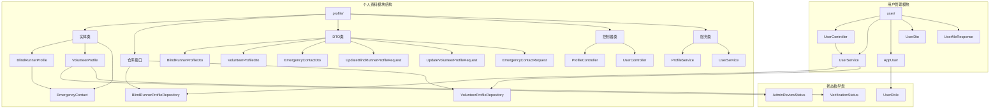

**图表来源**
- [ProfileController.java:1-44](file://backend/src/main/java/com/aidrun/backend/profile/ProfileController.java#L1-L44)
- [ProfileService.java:1-77](file://backend/src/main/java/com/aidrun/backend/profile/ProfileService.java#L1-L77)
- [UpdateBlindRunnerProfileRequest.java:1-13](file://backend/src/main/java/com/aidrun/backend/profile/dto/UpdateBlindRunnerProfileRequest.java#L1-L13)
- [UpdateVolunteerProfileRequest.java:1-9](file://backend/src/main/java/com/aidrun/backend/profile/dto/UpdateVolunteerProfileRequest.java#L1-L9)
- [EmergencyContactRequest.java:1-11](file://backend/src/main/java/com/aidrun/backend/profile/dto/EmergencyContactRequest.java#L1-L11)

**章节来源**
- [ProfileController.java:16-43](file://backend/src/main/java/com/aidrun/backend/profile/ProfileController.java#L16-L43)
- [ProfileService.java:12-76](file://backend/src/main/java/com/aidrun/backend/profile/ProfileService.java#L12-L76)
- [UpdateBlindRunnerProfileRequest.java:7-12](file://backend/src/main/java/com/aidrun/backend/profile/dto/UpdateBlindRunnerProfileRequest.java#L7-L12)
- [UpdateVolunteerProfileRequest.java:5-8](file://backend/src/main/java/com/aidrun/backend/profile/dto/UpdateVolunteerProfileRequest.java#L5-L8)
- [EmergencyContactRequest.java:6-10](file://backend/src/main/java/com/aidrun/backend/profile/dto/EmergencyContactRequest.java#L6-L10)

## 核心组件

个人资料管理模块包含以下核心组件：

### 实体模型层
- **BlindRunnerProfile**: 视障跑者的个人资料实体，包含昵称、跑步经验和紧急联系人信息
- **VolunteerProfile**: 志愿者的个人资料实体，包含昵称、电话号码、验证状态、审核状态、可用性和积分余额
- **EmergencyContact**: 紧急联系人实体，与视障跑者资料建立一对一关联

### 数据传输对象层
- **BlindRunnerProfileDto**: 视障跑者资料的对外传输对象
- **VolunteerProfileDto**: 志愿者资料的对外传输对象  
- **EmergencyContactDto**: 紧急联系人的对外传输对象
- **UpdateBlindRunnerProfileRequest**: 视障跑者资料更新请求DTO
- **UpdateVolunteerProfileRequest**: 志愿者资料更新请求DTO
- **EmergencyContactRequest**: 紧急联系人请求DTO

### 仓储接口层
- **BlindRunnerProfileRepository**: 视障跑者资料的数据库访问接口
- **VolunteerProfileRepository**: 志愿者资料的数据库访问接口

### 控制器层
- **ProfileController**: 个人资料的REST API控制器，提供CRUD操作
- **UserController**: 用户个人资料的REST API控制器

### 业务服务层
- **ProfileService**: 个人资料管理的核心业务逻辑，实现CRUD操作
- **UserService**: 用户个人资料管理的核心业务逻辑

**章节来源**
- [ProfileController.java:16-43](file://backend/src/main/java/com/aidrun/backend/profile/ProfileController.java#L16-L43)
- [ProfileService.java:12-76](file://backend/src/main/java/com/aidrun/backend/profile/ProfileService.java#L12-L76)
- [UpdateBlindRunnerProfileRequest.java:7-12](file://backend/src/main/java/com/aidrun/backend/profile/dto/UpdateBlindRunnerProfileRequest.java#L7-L12)
- [UpdateVolunteerProfileRequest.java:5-8](file://backend/src/main/java/com/aidrun/backend/profile/dto/UpdateVolunteerProfileRequest.java#L5-L8)
- [EmergencyContactRequest.java:6-10](file://backend/src/main/java/com/aidrun/backend/profile/dto/EmergencyContactRequest.java#L6-L10)

## 架构概览

个人资料管理模块采用经典的三层架构模式，实现了清晰的关注点分离：

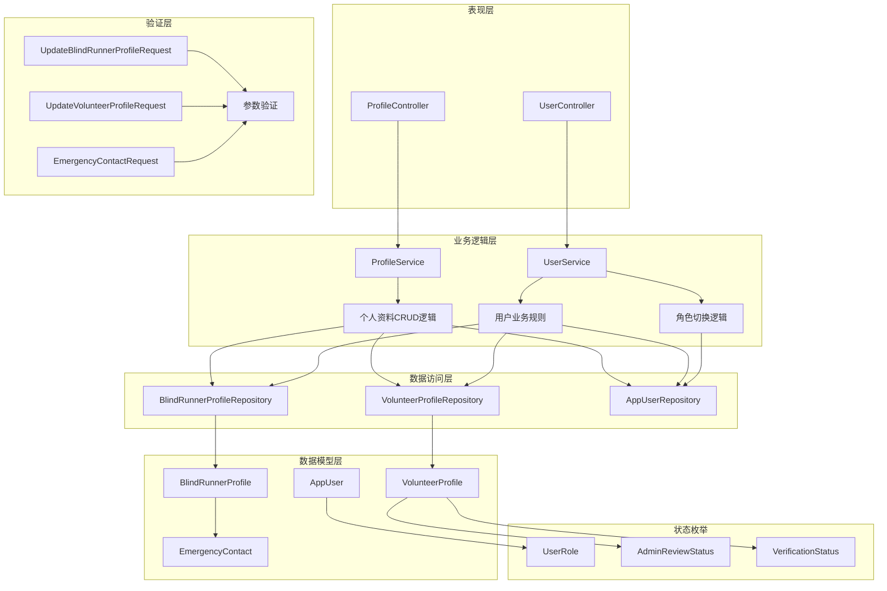

**图表来源**
- [ProfileController.java:16-43](file://backend/src/main/java/com/aidrun/backend/profile/ProfileController.java#L16-L43)
- [ProfileService.java:12-76](file://backend/src/main/java/com/aidrun/backend/profile/ProfileService.java#L12-L76)
- [UpdateBlindRunnerProfileRequest.java:7-12](file://backend/src/main/java/com/aidrun/backend/profile/dto/UpdateBlindRunnerProfileRequest.java#L7-L12)
- [UpdateVolunteerProfileRequest.java:5-8](file://backend/src/main/java/com/aidrun/backend/profile/dto/UpdateVolunteerProfileRequest.java#L5-L8)
- [EmergencyContactRequest.java:6-10](file://backend/src/main/java/com/aidrun/backend/profile/dto/EmergencyContactRequest.java#L6-L10)

## 详细组件分析

### ProfileController 控制器

ProfileController 提供了完整的个人资料管理API端点，支持视障跑者和志愿者的资料创建和更新操作：

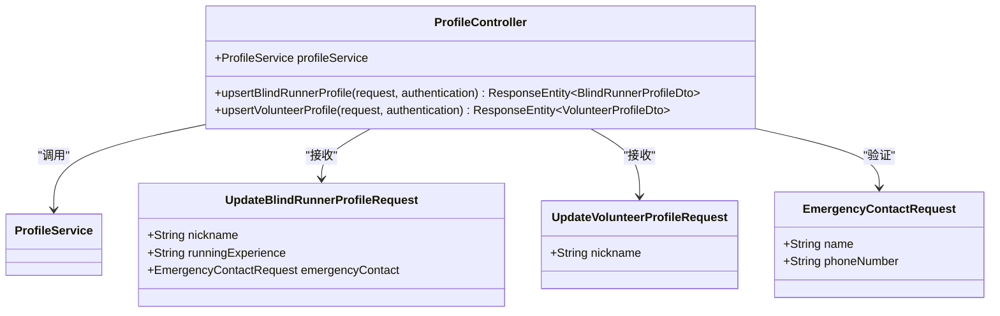

**图表来源**
- [ProfileController.java:16-43](file://backend/src/main/java/com/aidrun/backend/profile/ProfileController.java#L16-L43)
- [UpdateBlindRunnerProfileRequest.java:7-12](file://backend/src/main/java/com/aidrun/backend/profile/dto/UpdateBlindRunnerProfileRequest.java#L7-L12)
- [UpdateVolunteerProfileRequest.java:5-8](file://backend/src/main/java/com/aidrun/backend/profile/dto/UpdateVolunteerProfileRequest.java#L5-L8)
- [EmergencyContactRequest.java:6-10](file://backend/src/main/java/com/aidrun/backend/profile/dto/EmergencyContactRequest.java#L6-L10)

#### API端点设计

控制器提供了两个主要的PUT端点：

1. **PUT /api/profiles/blind-runner**: 处理视障跑者个人资料的创建和更新
2. **PUT /api/profiles/volunteer**: 处理志愿者个人资料的创建和更新

每个端点都要求有效的JWT认证令牌，并使用对应的请求DTO进行参数验证。

**章节来源**
- [ProfileController.java:26-42](file://backend/src/main/java/com/aidrun/backend/profile/ProfileController.java#L26-L42)

### ProfileService 业务服务

ProfileService 实现了完整的个人资料CRUD逻辑，包括创建、更新和事务管理：

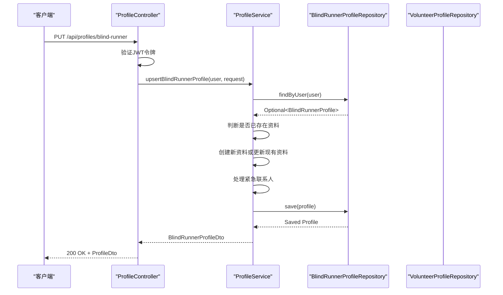

**图表来源**
- [ProfileController.java:26-33](file://backend/src/main/java/com/aidrun/backend/profile/ProfileController.java#L26-L33)
- [ProfileService.java:24-53](file://backend/src/main/java/com/aidrun/backend/profile/ProfileService.java#L24-L53)

#### 核心业务逻辑

ProfileService 实现了以下关键业务逻辑：

1. **UPSERT操作**: 如果资料不存在则创建，如果存在则更新
2. **紧急联系人管理**: 自动处理紧急联系人的创建和更新
3. **事务管理**: 使用@Transactional注解确保数据一致性
4. **状态初始化**: 为志愿者资料初始化默认状态

**章节来源**
- [ProfileService.java:24-75](file://backend/src/main/java/com/aidrun/backend/profile/ProfileService.java#L24-L75)

### 视障跑者个人资料实体

BlindRunnerProfile 实体设计体现了领域驱动设计的原则，通过一对一关联与用户实体建立强约束关系：

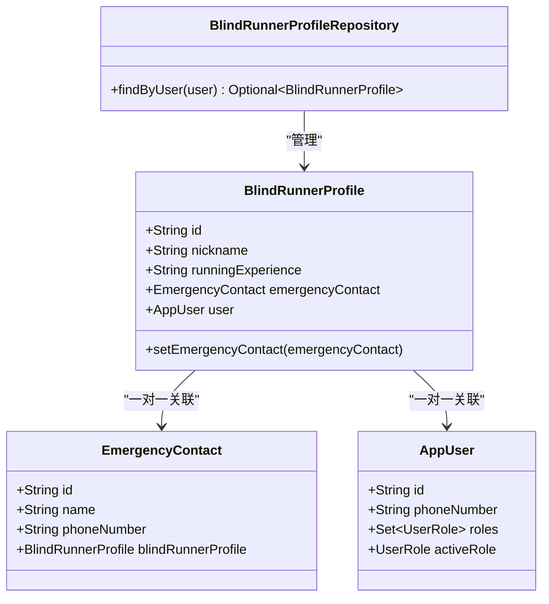

**图表来源**
- [BlindRunnerProfile.java:15-59](file://backend/src/main/java/com/aidrun/backend/profile/BlindRunnerProfile.java#L15-L59)
- [EmergencyContact.java:13-45](file://backend/src/main/java/com/aidrun/backend/profile/EmergencyContact.java#L13-L45)
- [BlindRunnerProfileRepository.java:7-10](file://backend/src/main/java/com/aidrun/backend/profile/BlindRunnerProfileRepository.java#L7-L10)

#### 关键特性分析

1. **强一致性约束**: 通过 `nullable = false` 和 `unique = true` 确保每个用户只能有一个视障跑者资料
2. **级联操作**: 使用 `CascadeType.ALL` 和 `orphanRemoval = true` 自动管理紧急联系人生命周期
3. **延迟加载**: 通过 `FetchType.LAZY` 优化性能，避免不必要的关联数据加载

**章节来源**
- [BlindRunnerProfile.java:17-27](file://backend/src/main/java/com/aidrun/backend/profile/BlindRunnerProfile.java#L17-L27)
- [BlindRunnerProfile.java:29-36](file://backend/src/main/java/com/aidrun/backend/profile/BlindRunnerProfile.java#L29-L36)

### 志愿者个人资料实体

VolunteerProfile 实体包含了志愿者管理所需的所有关键信息：

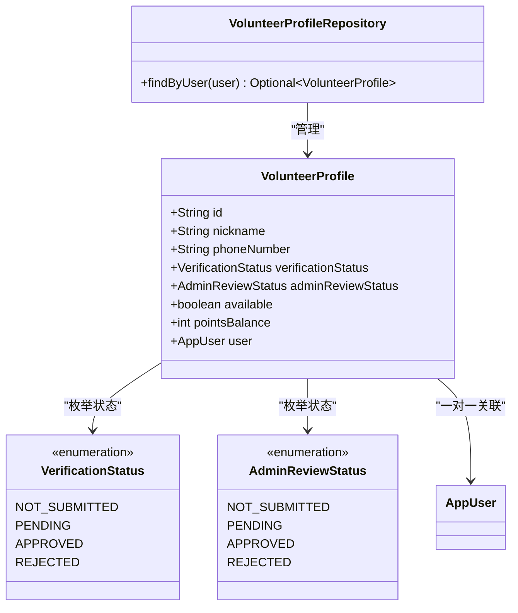

**图表来源**
- [VolunteerProfile.java:16-91](file://backend/src/main/java/com/aidrun/backend/profile/VolunteerProfile.java#L16-L91)
- [VerificationStatus.java:6-33](file://backend/src/main/java/com/aidrun/backend/profile/VerificationStatus.java#L6-L33)
- [AdminReviewStatus.java:6-33](file://backend/src/main/java/com/aidrun/backend/profile/AdminReviewStatus.java#L6-L33)
- [VolunteerProfileRepository.java:7-10](file://backend/src/main/java/com/aidrun/backend/profile/VolunteerProfileRepository.java#L7-L10)

#### 状态管理机制

志愿者资料的状态管理采用了双层状态体系：

1. **验证状态 (VerificationStatus)**: 管理志愿者的认证流程状态
2. **管理员审核状态 (AdminReviewStatus)**: 管理管理员对志愿者申请的审核状态

这种设计确保了志愿者管理流程的透明度和可追溯性。

**章节来源**
- [VolunteerProfile.java:28-34](file://backend/src/main/java/com/aidrun/backend/profile/VolunteerProfile.java#L28-L34)
- [VolunteerProfile.java:45-61](file://backend/src/main/java/com/aidrun/backend/profile/VolunteerProfile.java#L45-L61)

### 用户控制器与服务层

UserController 和 UserService 协同工作，提供完整的用户个人资料管理功能：

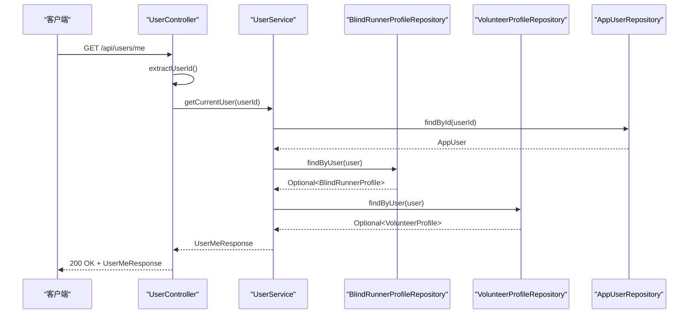

**图表来源**
- [UserController.java:25-30](file://backend/src/main/java/com/aidrun/backend/user/UserController.java#L25-L30)
- [UserService.java:46-59](file://backend/src/main/java/com/aidrun/backend/user/UserService.java#L46-L59)

#### 角色切换业务流程

UserService 实现了复杂的角色切换逻辑，确保业务规则得到正确执行：

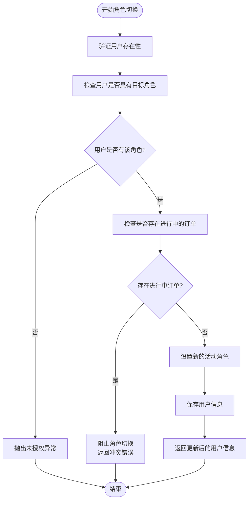

**图表来源**
- [UserService.java:61-83](file://backend/src/main/java/com/aidrun/backend/user/UserService.java#L61-L83)

**章节来源**
- [UserController.java:15-45](file://backend/src/main/java/com/aidrun/backend/user/UserController.java#L15-L45)
- [UserService.java:21-85](file://backend/src/main/java/com/aidrun/backend/user/UserService.java#L21-L85)

### 数据传输对象模式

所有DTO类都采用了Java Records的不可变设计模式，提供了类型安全的数据传输：

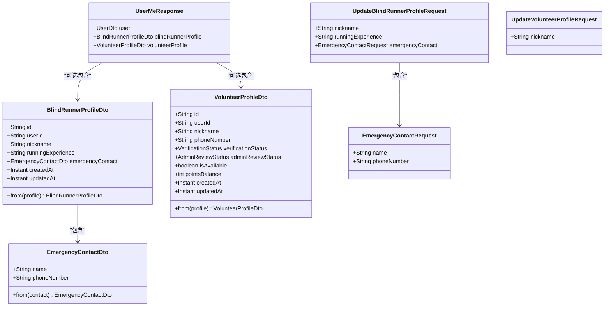

**图表来源**
- [BlindRunnerProfileDto.java:6-31](file://backend/src/main/java/com/aidrun/backend/profile/dto/BlindRunnerProfileDto.java#L6-L31)
- [VolunteerProfileDto.java:8-39](file://backend/src/main/java/com/aidrun/backend/profile/dto/VolunteerProfileDto.java#L8-L39)
- [EmergencyContactDto.java:5-17](file://backend/src/main/java/com/aidrun/backend/profile/dto/EmergencyContactDto.java#L5-L17)
- [UserMeResponse.java:6-12](file://backend/src/main/java/com/aidrun/backend/user/dto/UserMeResponse.java#L6-L12)
- [UpdateBlindRunnerProfileRequest.java:7-12](file://backend/src/main/java/com/aidrun/backend/profile/dto/UpdateBlindRunnerProfileRequest.java#L7-L12)
- [UpdateVolunteerProfileRequest.java:5-8](file://backend/src/main/java/com/aidrun/backend/profile/dto/UpdateVolunteerProfileRequest.java#L5-L8)
- [EmergencyContactRequest.java:6-10](file://backend/src/main/java/com/aidrun/backend/profile/dto/EmergencyContactRequest.java#L6-L10)

**章节来源**
- [BlindRunnerProfileDto.java:16-30](file://backend/src/main/java/com/aidrun/backend/profile/dto/BlindRunnerProfileDto.java#L16-L30)
- [VolunteerProfileDto.java:21-38](file://backend/src/main/java/com/aidrun/backend/profile/dto/VolunteerProfileDto.java#L21-L38)
- [UpdateBlindRunnerProfileRequest.java:7-12](file://backend/src/main/java/com/aidrun/backend/profile/dto/UpdateBlindRunnerProfileRequest.java#L7-L12)
- [UpdateVolunteerProfileRequest.java:5-8](file://backend/src/main/java/com/aidrun/backend/profile/dto/UpdateVolunteerProfileRequest.java#L5-L8)

## API规范

### ProfileController API端点

ProfileController 提供了两个主要的API端点，支持个人资料的创建和更新操作：

#### 视障跑者个人资料端点

**PUT /api/profiles/blind-runner**
- **功能**: 创建或更新视障跑者个人资料
- **认证**: 需要JWT Bearer令牌
- **请求体**: UpdateBlindRunnerProfileRequest
- **响应**: BlindRunnerProfileDto

**请求示例**:
```json
{
  "nickname": "测试盲人",
  "runningExperience": "有慢跑经验",
  "emergencyContact": {
    "name": "紧急联系人",
    "phoneNumber": "13800001111"
  }
}
```

**响应示例**:
```json
{
  "id": "profile-id",
  "userId": "user-id",
  "nickname": "测试盲人",
  "runningExperience": "有慢跑经验",
  "emergencyContact": {
    "name": "紧急联系人",
    "phoneNumber": "13800001111"
  },
  "createdAt": "2024-01-01T00:00:00Z",
  "updatedAt": "2024-01-01T00:00:00Z"
}
```

#### 志愿者个人资料端点

**PUT /api/profiles/volunteer**
- **功能**: 创建或更新志愿者个人资料
- **认证**: 需要JWT Bearer令牌
- **请求体**: UpdateVolunteerProfileRequest
- **响应**: VolunteerProfileDto

**请求示例**:
```json
{
  "nickname": "测试志愿者"
}
```

**响应示例**:
```json
{
  "id": "profile-id",
  "userId": "user-id",
  "nickname": "测试志愿者",
  "phoneNumber": "13900100007",
  "verificationStatus": "not_submitted",
  "adminReviewStatus": "not_submitted",
  "isAvailable": false,
  "pointsBalance": 0,
  "createdAt": "2024-01-01T00:00:00Z",
  "updatedAt": "2024-01-01T00:00:00Z"
}
```

**章节来源**
- [ProfileController.java:26-42](file://backend/src/main/java/com/aidrun/backend/profile/ProfileController.java#L26-L42)

## 验证逻辑

### 参数验证规则

ProfileController 和相关的DTO类实现了完整的参数验证逻辑：

#### UpdateBlindRunnerProfileRequest 验证规则

1. **nickname**: 必填，不能为空字符串
2. **runningExperience**: 可选，允许为空
3. **emergencyContact**: 必填，必须包含有效的EmergencyContactRequest

#### UpdateVolunteerProfileRequest 验证规则

1. **nickname**: 必填，不能为空字符串

#### EmergencyContactRequest 验证规则

1. **name**: 必填，不能为空字符串
2. **phoneNumber**: 必填，必须符合中国手机号码格式（1开头的11位数字）

### 验证流程

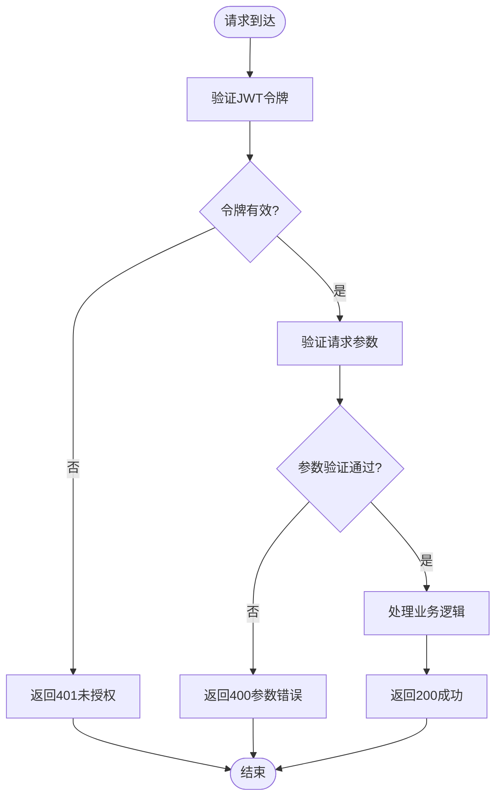

**图表来源**
- [ProfileController.java:26-42](file://backend/src/main/java/com/aidrun/backend/profile/ProfileController.java#L26-L42)
- [UpdateBlindRunnerProfileRequest.java:7-12](file://backend/src/main/java/com/aidrun/backend/profile/dto/UpdateBlindRunnerProfileRequest.java#L7-L12)
- [UpdateVolunteerProfileRequest.java:5-8](file://backend/src/main/java/com/aidrun/backend/profile/dto/UpdateVolunteerProfileRequest.java#L5-L8)
- [EmergencyContactRequest.java:6-10](file://backend/src/main/java/com/aidrun/backend/profile/dto/EmergencyContactRequest.java#L6-L10)

**章节来源**
- [UpdateBlindRunnerProfileRequest.java:7-12](file://backend/src/main/java/com/aidrun/backend/profile/dto/UpdateBlindRunnerProfileRequest.java#L7-L12)
- [UpdateVolunteerProfileRequest.java:5-8](file://backend/src/main/java/com/aidrun/backend/profile/dto/UpdateVolunteerProfileRequest.java#L5-L8)
- [EmergencyContactRequest.java:6-10](file://backend/src/main/java/com/aidrun/backend/profile/dto/EmergencyContactRequest.java#L6-L10)

## 业务规则

### UPSERT操作规则

ProfileService 实现了标准的UPSERT（Update or Insert）操作，遵循以下业务规则：

#### 视障跑者资料规则

1. **首次创建**:
   - 自动生成紧急联系人
   - 设置运行经验为null（可选）
   - 建立用户与紧急联系人的关联

2. **更新操作**:
   - 更新昵称和运行经验
   - 更新紧急联系人信息
   - 如紧急联系人不存在则自动创建

#### 志愿者资料规则

1. **首次创建**:
   - 初始化验证状态为NOT_SUBMITTED
   - 初始化管理员审核状态为NOT_SUBMITTED
   - 默认可用性为false
   - 默认积分余额为0
   - 使用用户电话号码作为志愿者电话号码

2. **更新操作**:
   - 仅允许更新昵称
   - 其他字段保持不变

### 事务管理规则

所有ProfileService方法都使用@Transactional注解，确保：

1. **原子性**: 创建或更新操作要么完全成功，要么完全失败
2. **一致性**: 维护数据库约束和业务规则
3. **隔离性**: 避免并发访问导致的数据不一致
4. **持久性**: 确保操作结果永久保存

**章节来源**
- [ProfileService.java:24-75](file://backend/src/main/java/com/aidrun/backend/profile/ProfileService.java#L24-L75)

## 状态管理

### 志愿者状态管理体系

志愿者个人资料引入了完整的状态管理体系，支持认证流程和管理员审核流程的并行管理：

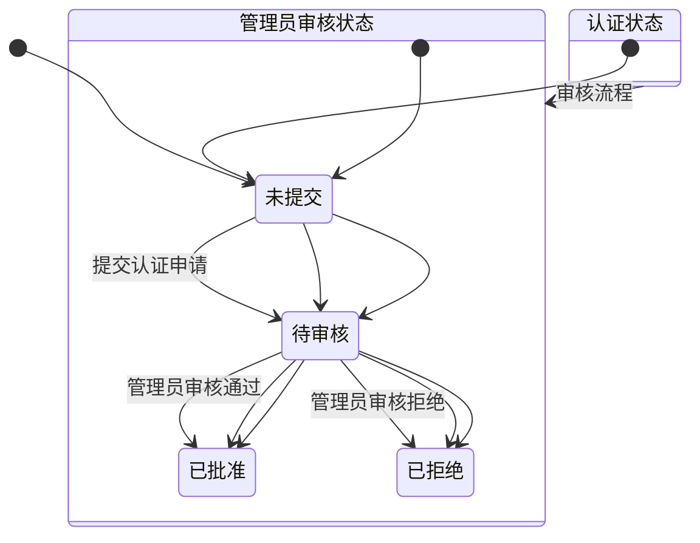

**图表来源**
- [VerificationStatus.java:6-33](file://backend/src/main/java/com/aidrun/backend/profile/VerificationStatus.java#L6-L33)
- [AdminReviewStatus.java:6-33](file://backend/src/main/java/com/aidrun/backend/profile/AdminReviewStatus.java#L6-L33)

### 状态转换规则

#### 认证状态转换
- **未提交 → 待审核**: 用户提交认证申请
- **待审核 → 已批准**: 管理员审核通过
- **待审核 → 已拒绝**: 管理员审核拒绝

#### 管理员审核状态转换
- **未提交 → 待审核**: 系统自动触发审核
- **待审核 → 已批准**: 管理员手动审核通过
- **待审核 → 已拒绝**: 管理员手动审核拒绝

### 状态持久化

状态信息通过枚举类型持久化到数据库，使用字符串形式存储，并提供JSON序列化支持：

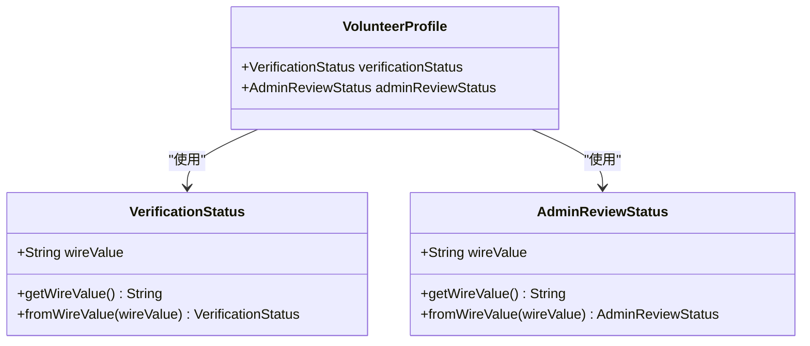

**图表来源**
- [VolunteerProfile.java:28-34](file://backend/src/main/java/com/aidrun/backend/profile/VolunteerProfile.java#L28-L34)
- [VerificationStatus.java:18-31](file://backend/src/main/java/com/aidrun/backend/profile/VerificationStatus.java#L18-L31)
- [AdminReviewStatus.java:18-31](file://backend/src/main/java/com/aidrun/backend/profile/AdminReviewStatus.java#L18-L31)

**章节来源**
- [VerificationStatus.java:6-33](file://backend/src/main/java/com/aidrun/backend/profile/VerificationStatus.java#L6-L33)
- [AdminReviewStatus.java:6-33](file://backend/src/main/java/com/aidrun/backend/profile/AdminReviewStatus.java#L6-L33)
- [VolunteerProfile.java:45-61](file://backend/src/main/java/com/aidrun/backend/profile/VolunteerProfile.java#L45-L61)

## 依赖关系分析

个人资料管理模块的依赖关系体现了良好的分层架构设计：

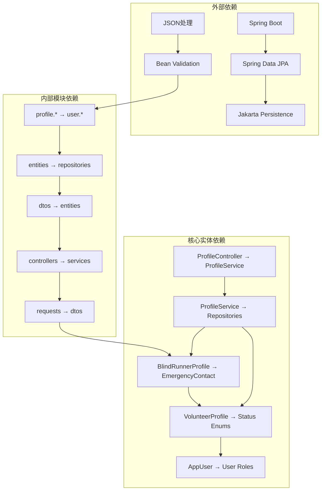

**图表来源**
- [ProfileController.java:1-14](file://backend/src/main/java/com/aidrun/backend/profile/ProfileController.java#L1-L14)
- [ProfileService.java:1-10](file://backend/src/main/java/com/aidrun/backend/profile/ProfileService.java#L1-L10)
- [BlindRunnerProfile.java:3-11](file://backend/src/main/java/com/aidrun/backend/profile/BlindRunnerProfile.java#L3-L11)
- [VolunteerProfile.java:3-12](file://backend/src/main/java/com/aidrun/backend/profile/VolunteerProfile.java#L3-L12)
- [UserController.java:3-13](file://backend/src/main/java/com/aidrun/backend/user/UserController.java#L3-L13)

### 关键依赖特性

1. **松耦合设计**: 通过接口和抽象类实现模块间的松耦合
2. **依赖注入**: 全面使用 Spring 的依赖注入机制
3. **事务管理**: 在服务层统一管理数据库事务
4. **异常处理**: 集中的异常处理机制确保系统的稳定性
5. **验证框架**: 使用Bean Validation实现参数验证

**章节来源**
- [ProfileService.java:15-22](file://backend/src/main/java/com/aidrun/backend/profile/ProfileService.java#L15-L22)
- [BlindRunnerProfileRepository.java:5-10](file://backend/src/main/java/com/aidrun/backend/profile/BlindRunnerProfileRepository.java#L5-L10)
- [VolunteerProfileRepository.java:5-10](file://backend/src/main/java/com/aidrun/backend/profile/VolunteerProfileRepository.java#L5-L10)

## 性能考虑

个人资料管理模块在设计时充分考虑了性能优化：

### 查询优化策略

1. **延迟加载**: 所有关联实体都使用 `FetchType.LAZY`，避免 N+1 查询问题
2. **批量查询**: 通过 `Optional` 模式减少空值检查开销
3. **索引优化**: 关键字段（如用户 ID、电话号码）建立了适当的数据库索引
4. **事务优化**: 使用合适的事务隔离级别防止数据不一致

### 缓存策略

虽然当前实现未集成缓存层，但系统设计为后续添加缓存提供了便利：
- DTO 对象的不可变性使其天然适合缓存
- 分层架构便于在任意层级添加缓存机制

### 并发控制

1. **乐观锁**: 基于 JPA 的版本字段实现并发控制
2. **事务隔离**: 使用合适的事务隔离级别防止数据不一致
3. **连接池**: 通过 Spring Boot 自动配置优化数据库连接

## 故障排除指南

### 常见问题及解决方案

#### 1. 用户不存在异常
**症状**: 调用 `/api/profiles/blind-runner` 或 `/api/profiles/volunteer` 返回 401 未授权错误
**原因**: JWT 令牌无效或用户会话过期
**解决**: 验证用户会话有效性，重新登录系统

#### 2. 参数验证失败
**症状**: 返回 400 参数错误，包含 VALIDATION_FAILED 错误码
**原因**: 请求参数不符合验证规则
**解决**: 检查请求体格式，确保必填字段完整且格式正确

#### 3. 紧急联系人手机号格式错误
**症状**: 创建视障跑者资料时返回 400 错误
**原因**: 电话号码不符合中国手机号码格式（必须是1开头的11位数字）
**解决**: 确保电话号码格式正确，移除空格和特殊字符

#### 4. 个人资料更新冲突
**症状**: 更新操作返回 409 冲突错误
**原因**: 资料已存在但无法更新
**解决**: 检查现有资料状态，确认更新操作的合法性

#### 5. 数据库约束冲突
**症状**: 创建个人资料时报唯一约束冲突
**原因**: 尝试为同一用户创建重复的个人资料
**解决**: 使用UPSERT操作而非重复创建

#### 6. 志愿者状态转换异常
**症状**: 志愿者资料状态更新失败
**原因**: 状态转换不符合预定义规则
**解决**: 检查状态转换的有效性，确保遵循状态机规则

**章节来源**
- [ProfileControllerIntegrationTest.java:108-160](file://backend/src/test/java/com/aidrun/backend/profile/ProfileControllerIntegrationTest.java#L108-L160)
- [ProfileControllerIntegrationTest.java:248-270](file://backend/src/test/java/com/aidrun/backend/profile/ProfileControllerIntegrationTest.java#L248-L270)

### 调试建议

1. **启用SQL日志**: 在开发环境中启用 SQL 日志输出
2. **监控事务**: 使用 AOP 监控事务的执行情况
3. **验证DTO映射**: 确保实体与 DTO 之间的映射正确性
4. **测试边界条件**: 验证空值、边界值和异常情况的处理
5. **检查JWT令牌**: 确保令牌格式正确且未过期
6. **验证状态枚举**: 确保状态转换的合法性和一致性

## 结论

个人资料管理模块展现了优秀的软件工程实践，通过清晰的分层架构、合理的实体设计和完善的业务逻辑实现了高效的个人资料管理功能。

**更新** 新增的ProfileController和ProfileService实现进一步增强了模块的功能完整性，提供了完整的CRUD操作、严格的验证逻辑和清晰的业务规则。**新增志愿者资料验证状态管理、管理员审核状态管理和紧急联系人管理等完整功能**，使模块能够支持更复杂的业务场景。

### 主要优势

1. **架构清晰**: 采用经典的三层架构，职责分离明确
2. **功能完整**: 支持个人资料的创建、更新和查询操作
3. **验证严格**: 通过DTO和Bean Validation确保数据质量
4. **扩展性强**: 支持未来功能的平滑扩展
5. **安全性高**: 通过 DTO 模式和严格的权限控制确保数据安全
6. **性能优化**: 通过延迟加载和批量查询优化系统性能
7. **状态管理完善**: 引入枚举类型管理复杂的状态转换
8. **业务规则清晰**: 通过UPSERT操作和事务管理确保数据一致性

### 改进建议

1. **添加缓存层**: 考虑为热点数据添加缓存机制
2. **增强监控**: 添加更详细的性能监控和日志记录
3. **完善测试**: 增加更多的单元测试和集成测试覆盖
4. **文档完善**: 为复杂的业务逻辑添加更详细的文档说明
5. **API文档**: 生成OpenAPI规范文档，便于前端集成
6. **状态机可视化**: 为状态管理添加可视化工具帮助调试

该模块为 AidRun 系统提供了坚实的基础，能够有效支撑视障跑者和志愿者两大用户群体的个人资料管理需求，同时为未来的功能扩展奠定了良好的技术基础。**新增的状态管理和紧急联系人功能使其能够更好地支持实际业务场景的需求**。
