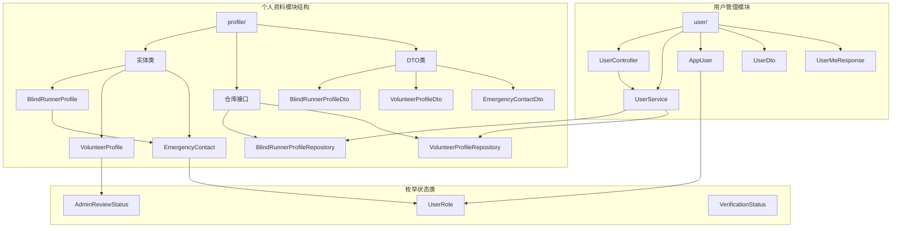
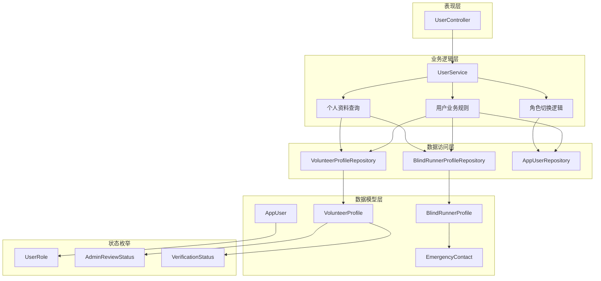
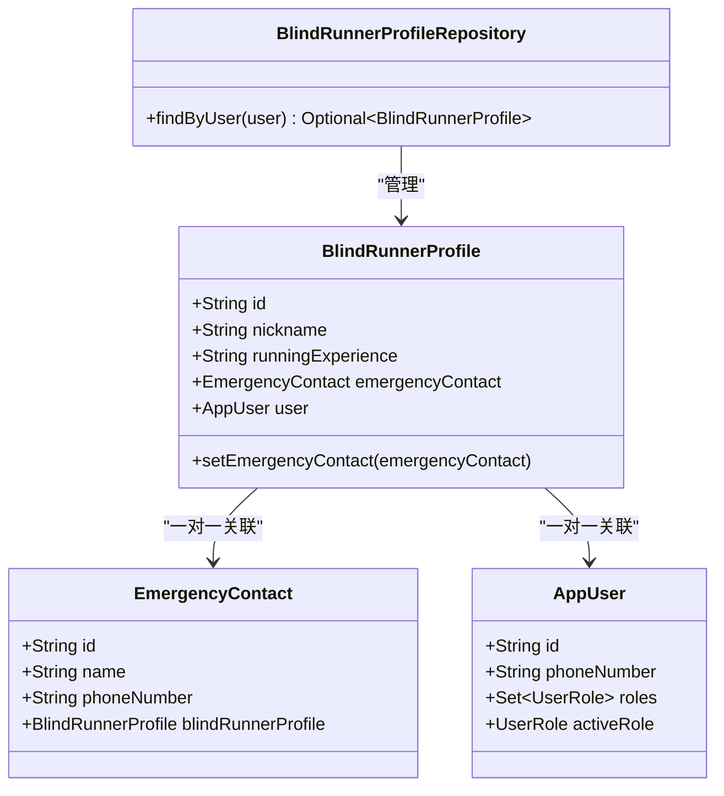
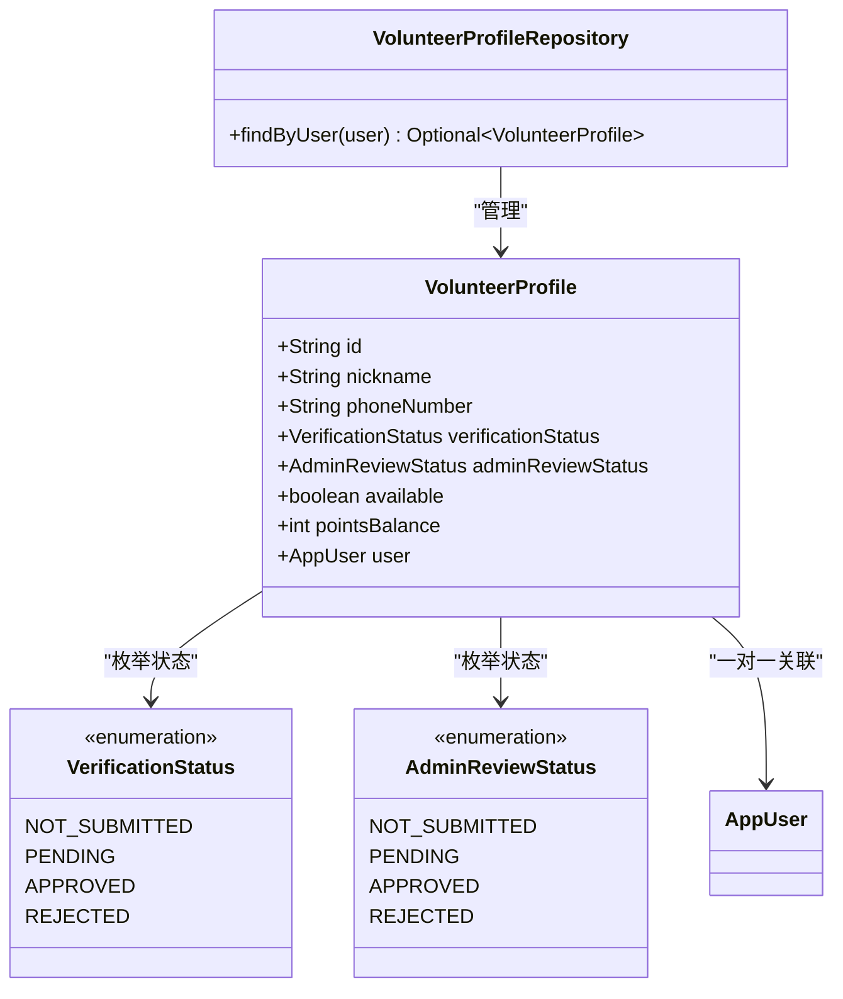
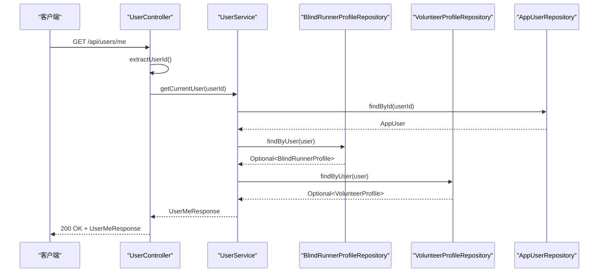
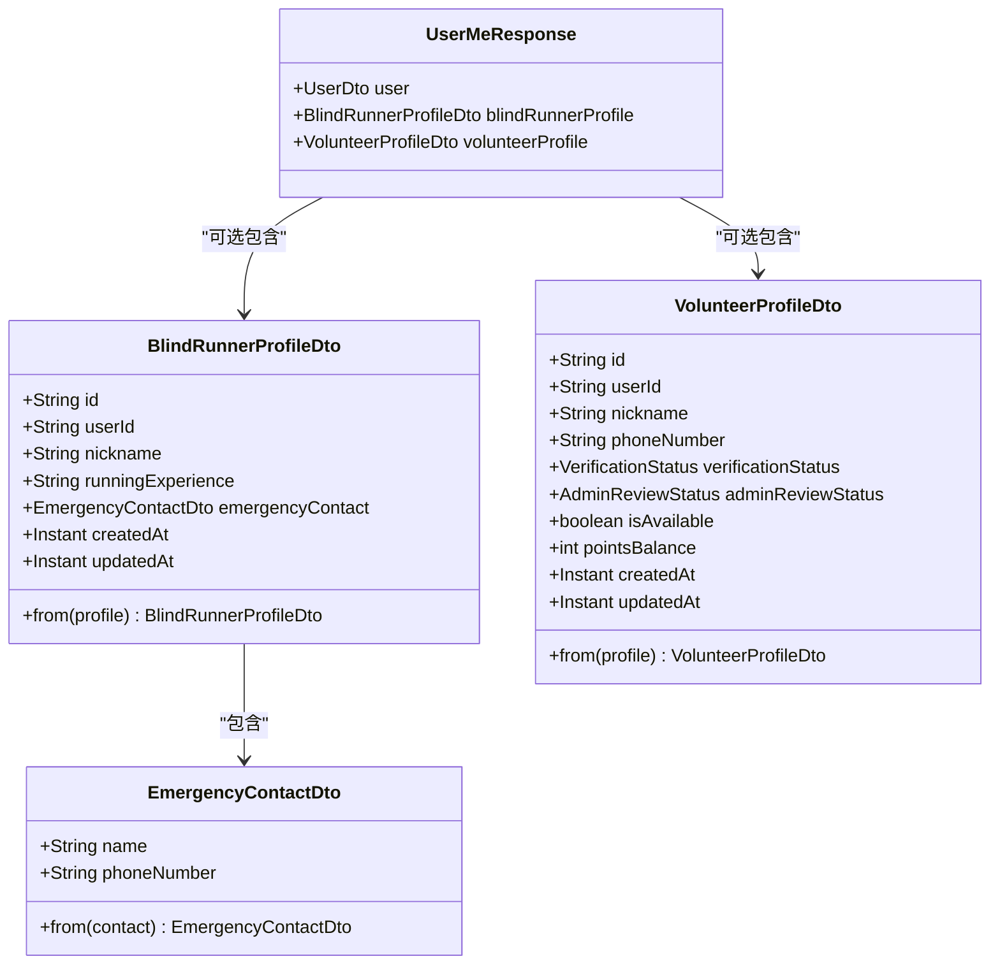
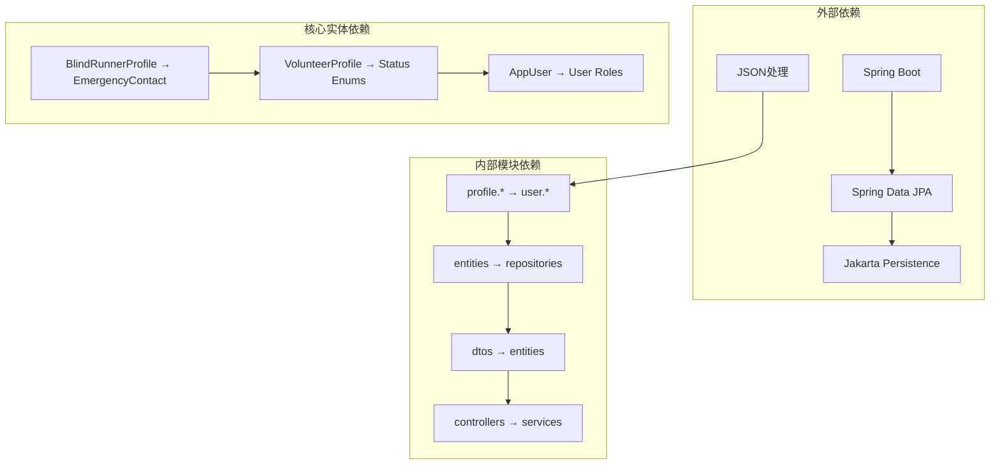

# 个人资料管理模块

<cite>
**本文档引用的文件**
- [BlindRunnerProfile.java](file://backend/src/main/java/com/aidrun/backend/profile/BlindRunnerProfile.java)
- [VolunteerProfile.java](file://backend/src/main/java/com/aidrun/backend/profile/VolunteerProfile.java)
- [EmergencyContact.java](file://backend/src/main/java/com/aidrun/backend/profile/EmergencyContact.java)
- [BlindRunnerProfileRepository.java](file://backend/src/main/java/com/aidrun/backend/profile/BlindRunnerProfileRepository.java)
- [VolunteerProfileRepository.java](file://backend/src/main/java/com/aidrun/backend/profile/VolunteerProfileRepository.java)
- [BlindRunnerProfileDto.java](file://backend/src/main/java/com/aidrun/backend/profile/dto/BlindRunnerProfileDto.java)
- [VolunteerProfileDto.java](file://backend/src/main/java/com/aidrun/backend/profile/dto/VolunteerProfileDto.java)
- [EmergencyContactDto.java](file://backend/src/main/java/com/aidrun/backend/profile/dto/EmergencyContactDto.java)
- [UserController.java](file://backend/src/main/java/com/aidrun/backend/user/UserController.java)
- [UserService.java](file://backend/src/main/java/com/aidrun/backend/user/UserService.java)
- [AppUser.java](file://backend/src/main/java/com/aidrun/backend/user/AppUser.java)
- [UserDto.java](file://backend/src/main/java/com/aidrun/backend/user/dto/UserDto.java)
- [UserMeResponse.java](file://backend/src/main/java/com/aidrun/backend/user/dto/UserMeResponse.java)
- [UserRole.java](file://backend/src/main/java/com/aidrun/backend/user/UserRole.java)
- [AdminReviewStatus.java](file://backend/src/main/java/com/aidrun/backend/profile/AdminReviewStatus.java)
- [VerificationStatus.java](file://backend/src/main/java/com/aidrun/backend/profile/VerificationStatus.java)
</cite>

## 目录
1. [简介](#简介)
2. [项目结构](#项目结构)
3. [核心组件](#核心组件)
4. [架构概览](#架构概览)
5. [详细组件分析](#详细组件分析)
6. [依赖关系分析](#依赖关系分析)
7. [性能考虑](#性能考虑)
8. [故障排除指南](#故障排除指南)
9. [结论](#结论)

## 简介

个人资料管理模块是 AidRun 后端系统中负责管理用户个人资料的核心功能模块。该模块主要处理两类用户角色的个人资料：视障跑者（Blind Runner）和志愿者（Volunteer）。模块采用分层架构设计，通过实体模型、数据传输对象（DTO）、仓库接口和业务服务类实现了完整的个人资料管理功能。

该模块支持用户基本信息查询、角色切换、紧急联系人管理以及个人资料的完整生命周期管理。系统通过 Spring Data JPA 提供数据持久化支持，并使用 DTO 模式实现数据传输的解耦和安全控制。

## 项目结构

个人资料管理模块在后端项目中的组织结构如下：

**图表来源**
- [BlindRunnerProfile.java:1-59](file://backend/src/main/java/com/aidrun/backend/profile/BlindRunnerProfile.java#L1-L59)
- [VolunteerProfile.java:1-91](file://backend/src/main/java/com/aidrun/backend/profile/VolunteerProfile.java#L1-L91)
- [UserController.java:1-45](file://backend/src/main/java/com/aidrun/backend/user/UserController.java#L1-L45)
- [UserService.java:1-85](file://backend/src/main/java/com/aidrun/backend/user/UserService.java#L1-L85)

**章节来源**
- [BlindRunnerProfile.java:1-59](file://backend/src/main/java/com/aidrun/backend/profile/BlindRunnerProfile.java#L1-L59)
- [VolunteerProfile.java:1-91](file://backend/src/main/java/com/aidrun/backend/profile/VolunteerProfile.java#L1-L91)
- [UserController.java:1-45](file://backend/src/main/java/com/aidrun/backend/user/UserController.java#L1-L45)

## 核心组件

个人资料管理模块包含以下核心组件：

### 实体模型层
- **BlindRunnerProfile**: 视障跑者的个人资料实体，包含昵称、跑步经验和紧急联系人信息
- **VolunteerProfile**: 志愿者的个人资料实体，包含昵称、电话号码、验证状态、审核状态、可用性和积分余额
- **EmergencyContact**: 紧急联系人实体，与视障跑者资料建立一对一关联

### 数据传输对象层
- **BlindRunnerProfileDto**: 视障跑者资料的对外传输对象
- **VolunteerProfileDto**: 志愿者资料的对外传输对象  
- **EmergencyContactDto**: 紧急联系人的对外传输对象

### 仓储接口层
- **BlindRunnerProfileRepository**: 视障跑者资料的数据库访问接口
- **VolunteerProfileRepository**: 志愿者资料的数据库访问接口

### 业务服务层
- **UserService**: 用户个人资料管理的核心业务逻辑
- **UserController**: 用户个人资料的 REST API 控制器

**章节来源**
- [BlindRunnerProfile.java:13-59](file://backend/src/main/java/com/aidrun/backend/profile/BlindRunnerProfile.java#L13-L59)
- [VolunteerProfile.java:14-91](file://backend/src/main/java/com/aidrun/backend/profile/VolunteerProfile.java#L14-L91)
- [EmergencyContact.java:11-45](file://backend/src/main/java/com/aidrun/backend/profile/EmergencyContact.java#L11-L45)

## 架构概览

个人资料管理模块采用经典的三层架构模式，实现了清晰的关注点分离：

**图表来源**
- [UserController.java:15-45](file://backend/src/main/java/com/aidrun/backend/user/UserController.java#L15-L45)
- [UserService.java:21-85](file://backend/src/main/java/com/aidrun/backend/user/UserService.java#L21-L85)
- [BlindRunnerProfileRepository.java:7-11](file://backend/src/main/java/com/aidrun/backend/profile/BlindRunnerProfileRepository.java#L7-L11)
- [VolunteerProfileRepository.java:7-11](file://backend/src/main/java/com/aidrun/backend/profile/VolunteerProfileRepository.java#L7-L11)

## 详细组件分析

### 视障跑者个人资料实体

BlindRunnerProfile 实体设计体现了领域驱动设计的原则，通过一对一关联与用户实体建立强约束关系：

**图表来源**
- [BlindRunnerProfile.java:15-59](file://backend/src/main/java/com/aidrun/backend/profile/BlindRunnerProfile.java#L15-L59)
- [EmergencyContact.java:13-45](file://backend/src/main/java/com/aidrun/backend/profile/EmergencyContact.java#L13-L45)
- [BlindRunnerProfileRepository.java:7-11](file://backend/src/main/java/com/aidrun/backend/profile/BlindRunnerProfileRepository.java#L7-L11)

#### 关键特性分析

1. **强一致性约束**: 通过 `nullable = false` 和 `unique = true` 确保每个用户只能有一个视障跑者资料
2. **级联操作**: 使用 `CascadeType.ALL` 和 `orphanRemoval = true` 自动管理紧急联系人生命周期
3. **延迟加载**: 通过 `FetchType.LAZY` 优化性能，避免不必要的关联数据加载

**章节来源**
- [BlindRunnerProfile.java:17-27](file://backend/src/main/java/com/aidrun/backend/profile/BlindRunnerProfile.java#L17-L27)
- [BlindRunnerProfile.java:29-36](file://backend/src/main/java/com/aidrun/backend/profile/BlindRunnerProfile.java#L29-L36)

### 志愿者个人资料实体

VolunteerProfile 实体包含了志愿者管理所需的所有关键信息：

**图表来源**
- [VolunteerProfile.java:16-91](file://backend/src/main/java/com/aidrun/backend/profile/VolunteerProfile.java#L16-L91)
- [VerificationStatus.java:6-33](file://backend/src/main/java/com/aidrun/backend/profile/VerificationStatus.java#L6-L33)
- [AdminReviewStatus.java:6-33](file://backend/src/main/java/com/aidrun/backend/profile/AdminReviewStatus.java#L6-L33)
- [VolunteerProfileRepository.java:7-11](file://backend/src/main/java/com/aidrun/backend/profile/VolunteerProfileRepository.java#L7-L11)

#### 状态管理机制

志愿者资料的状态管理采用了双层状态体系：

1. **验证状态 (VerificationStatus)**: 管理志愿者的认证流程状态
2. **管理员审核状态 (AdminReviewStatus)**: 管理管理员对志愿者申请的审核状态

这种设计确保了志愿者管理流程的透明度和可追溯性。

**章节来源**
- [VolunteerProfile.java:28-34](file://backend/src/main/java/com/aidrun/backend/profile/VolunteerProfile.java#L28-L34)
- [VolunteerProfile.java:45-61](file://backend/src/main/java/com/aidrun/backend/profile/VolunteerProfile.java#L45-L61)

### 用户控制器与服务层

UserController 和 UserService 协同工作，提供完整的用户个人资料管理功能：

**图表来源**
- [UserController.java:25-30](file://backend/src/main/java/com/aidrun/backend/user/UserController.java#L25-L30)
- [UserService.java:46-59](file://backend/src/main/java/com/aidrun/backend/user/UserService.java#L46-L59)

#### 角色切换业务流程

UserService 实现了复杂的角色切换逻辑，确保业务规则得到正确执行：

**图表来源**
- [UserService.java:61-83](file://backend/src/main/java/com/aidrun/backend/user/UserService.java#L61-L83)

**章节来源**
- [UserController.java:15-45](file://backend/src/main/java/com/aidrun/backend/user/UserController.java#L15-L45)
- [UserService.java:21-85](file://backend/src/main/java/com/aidrun/backend/user/UserService.java#L21-L85)

### 数据传输对象模式

所有 DTO 类都采用了 Java Records 的不可变设计模式，提供了类型安全的数据传输：

**图表来源**
- [BlindRunnerProfileDto.java:6-31](file://backend/src/main/java/com/aidrun/backend/profile/dto/BlindRunnerProfileDto.java#L6-L31)
- [VolunteerProfileDto.java:8-39](file://backend/src/main/java/com/aidrun/backend/profile/dto/VolunteerProfileDto.java#L8-L39)
- [EmergencyContactDto.java:5-17](file://backend/src/main/java/com/aidrun/backend/profile/dto/EmergencyContactDto.java#L5-L17)
- [UserMeResponse.java:6-12](file://backend/src/main/java/com/aidrun/backend/user/dto/UserMeResponse.java#L6-L12)

**章节来源**
- [BlindRunnerProfileDto.java:16-30](file://backend/src/main/java/com/aidrun/backend/profile/dto/BlindRunnerProfileDto.java#L16-L30)
- [VolunteerProfileDto.java:21-38](file://backend/src/main/java/com/aidrun/backend/profile/dto/VolunteerProfileDto.java#L21-L38)

## 依赖关系分析

个人资料管理模块的依赖关系体现了良好的分层架构设计：

**图表来源**
- [BlindRunnerProfile.java:3-11](file://backend/src/main/java/com/aidrun/backend/profile/BlindRunnerProfile.java#L3-L11)
- [VolunteerProfile.java:3-12](file://backend/src/main/java/com/aidrun/backend/profile/VolunteerProfile.java#L3-L12)
- [UserController.java:3-13](file://backend/src/main/java/com/aidrun/backend/user/UserController.java#L3-L13)

### 关键依赖特性

1. **松耦合设计**: 通过接口和抽象类实现模块间的松耦合
2. **依赖注入**: 全面使用 Spring 的依赖注入机制
3. **事务管理**: 在服务层统一管理数据库事务
4. **异常处理**: 集中的异常处理机制确保系统的稳定性

**章节来源**
- [UserService.java:36-44](file://backend/src/main/java/com/aidrun/backend/user/UserService.java#L36-L44)
- [BlindRunnerProfileRepository.java:5-10](file://backend/src/main/java/com/aidrun/backend/profile/BlindRunnerProfileRepository.java#L5-L10)

## 性能考虑

个人资料管理模块在设计时充分考虑了性能优化：

### 查询优化策略

1. **延迟加载**: 所有关联实体都使用 `FetchType.LAZY`，避免 N+1 查询问题
2. **批量查询**: 通过 `Optional` 模式减少空值检查开销
3. **索引优化**: 关键字段（如用户 ID、电话号码）建立了适当的数据库索引

### 缓存策略

虽然当前实现未集成缓存层，但系统设计为后续添加缓存提供了便利：
- DTO 对象的不可变性使其天然适合缓存
- 分层架构便于在任意层级添加缓存机制

### 并发控制

1. **乐观锁**: 基于 JPA 的版本字段实现并发控制
2. **事务隔离**: 使用合适的事务隔离级别防止数据不一致
3. **连接池**: 通过 Spring Boot 自动配置优化数据库连接

## 故障排除指南

### 常见问题及解决方案

#### 1. 用户不存在异常
**症状**: 调用 `/api/users/me` 返回 401 未授权错误
**原因**: 用户 ID 无效或用户已被删除
**解决**: 验证用户会话有效性，重新登录系统

#### 2. 角色切换失败
**症状**: 角色切换请求返回 409 冲突错误
**原因**: 用户当前有进行中的订单
**解决**: 完成或取消所有进行中的订单后再尝试切换

#### 3. 个人资料查询为空
**症状**: 获取到的个人资料为 null
**原因**: 用户尚未创建对应角色的个人资料
**解决**: 先创建相应的个人资料再进行查询

#### 4. 紧急联系人重复创建
**症状**: 创建紧急联系人时报唯一约束冲突
**原因**: 试图为同一用户创建多个紧急联系人
**解决**: 更新现有紧急联系人而非重复创建

**章节来源**
- [UserService.java:48-58](file://backend/src/main/java/com/aidrun/backend/user/UserService.java#L48-L58)
- [UserService.java:66-77](file://backend/src/main/java/com/aidrun/backend/user/UserService.java#L66-L77)

### 调试建议

1. **启用 SQL 日志**: 在开发环境中启用 SQL 日志输出
2. **监控事务**: 使用 AOP 监控事务的执行情况
3. **验证 DTO 映射**: 确保实体与 DTO 之间的映射正确性
4. **测试边界条件**: 验证空值、边界值和异常情况的处理

## 结论

个人资料管理模块展现了优秀的软件工程实践，通过清晰的分层架构、合理的实体设计和完善的业务逻辑实现了高效的个人资料管理功能。

### 主要优势

1. **架构清晰**: 采用经典的三层架构，职责分离明确
2. **扩展性强**: 支持未来功能的平滑扩展
3. **安全性高**: 通过 DTO 模式和严格的权限控制确保数据安全
4. **性能优化**: 通过延迟加载和批量查询优化系统性能

### 改进建议

1. **添加缓存层**: 考虑为热点数据添加缓存机制
2. **增强监控**: 添加更详细的性能监控和日志记录
3. **完善测试**: 增加更多的单元测试和集成测试覆盖
4. **文档完善**: 为复杂的业务逻辑添加更详细的文档说明

该模块为 AidRun 系统提供了坚实的基础，能够有效支撑视障跑者和志愿者两大用户群体的个人资料管理需求。