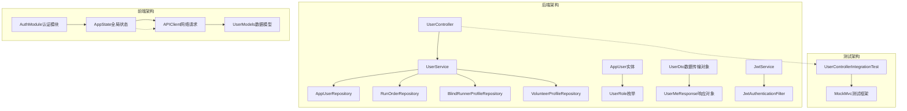
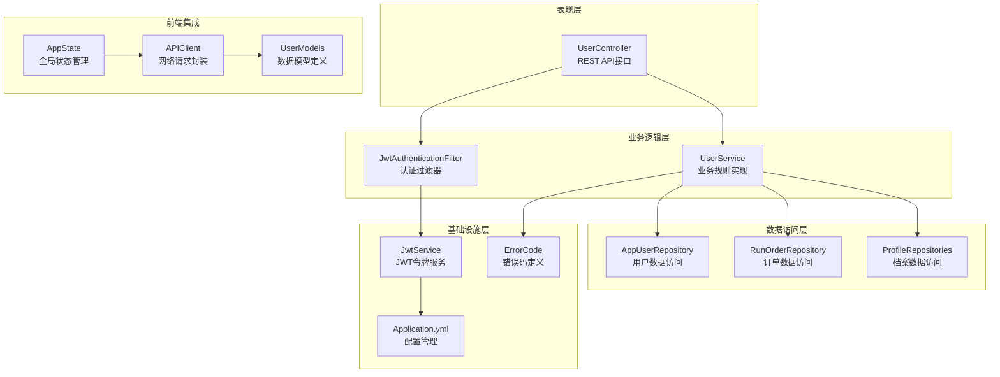
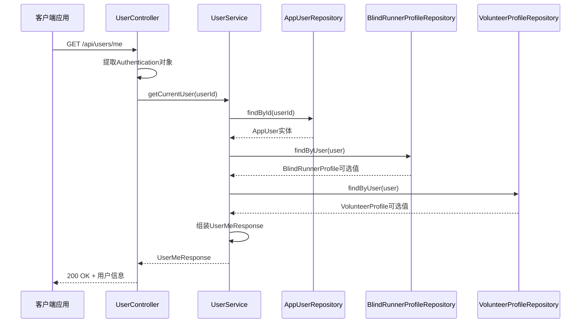
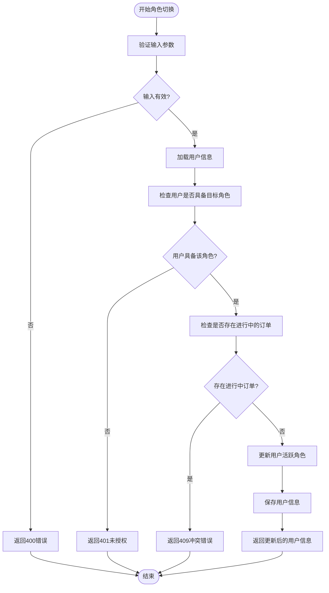
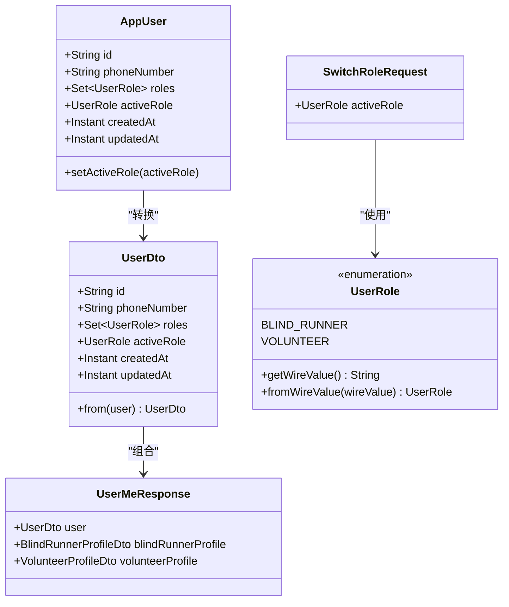
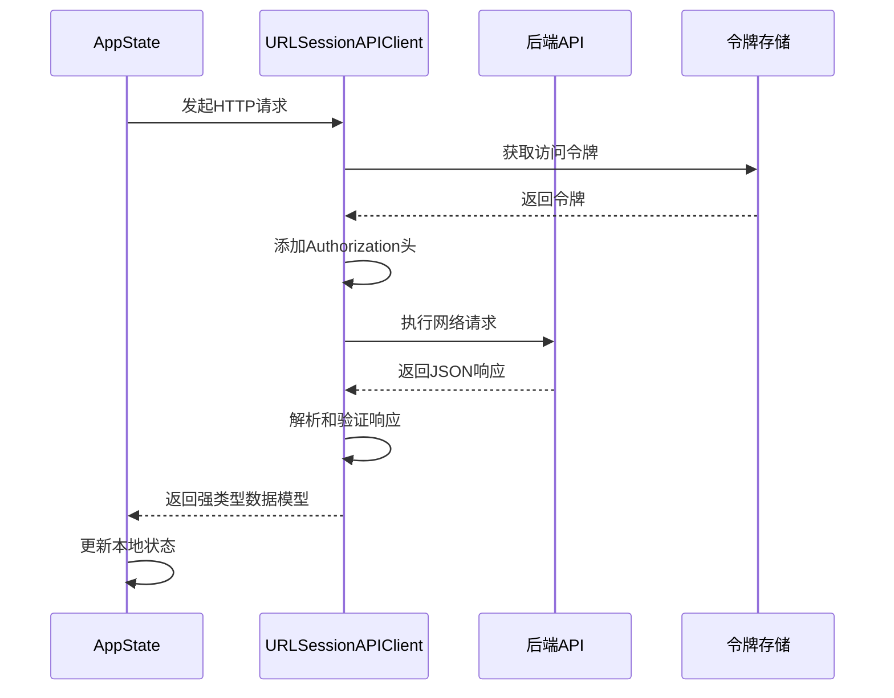
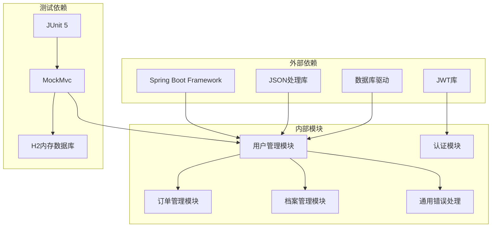

# 用户管理模块

<cite>
**本文档引用的文件**
- [UserController.java](file://backend/src/main/java/com/aidrun/backend/user/UserController.java)
- [UserService.java](file://backend/src/main/java/com/aidrun/backend/user/UserService.java)
- [AppUser.java](file://backend/src/main/java/com/aidrun/backend/user/AppUser.java)
- [AppUserRepository.java](file://backend/src/main/java/com/aidrun/backend/user/AppUserRepository.java)
- [UserRole.java](file://backend/src/main/java/com/aidrun/backend/user/UserRole.java)
- [UserDto.java](file://backend/src/main/java/com/aidrun/backend/user/dto/UserDto.java)
- [UserMeResponse.java](file://backend/src/main/java/com/aidrun/backend/user/dto/UserMeResponse.java)
- [SwitchRoleRequest.java](file://backend/src/main/java/com/aidrun/backend/user/dto/SwitchRoleRequest.java)
- [UserControllerIntegrationTest.java](file://backend/src/test/java/com/aidrun/backend/user/UserControllerIntegrationTest.java)
- [ErrorCode.java](file://backend/src/main/java/com/aidrun/backend/common/error/ErrorCode.java)
- [RunOrderStatus.java](file://backend/src/main/java/com/aidrun/backend/order/RunOrderStatus.java)
- [application.yml](file://backend/src/main/resources/application.yml)
- [JwtService.java](file://backend/src/main/java/com/aidrun/backend/auth/JwtService.java)
- [JwtAuthenticationFilter.java](file://backend/src/main/java/com/aidrun/backend/auth/JwtAuthenticationFilter.java)
- [AppState.swift](file://blindRun/Core/AppState.swift)
- [UserModels.swift](file://blindRun/Core/Models/UserModels.swift)
- [APIClient.swift](file://blindRun/Core/APIClient.swift)
</cite>

## 目录
1. [简介](#简介)
2. [项目结构](#项目结构)
3. [核心组件](#核心组件)
4. [架构概览](#架构概览)
5. [详细组件分析](#详细组件分析)
6. [依赖关系分析](#依赖关系分析)
7. [性能考虑](#性能考虑)
8. [故障排除指南](#故障排除指南)
9. [结论](#结论)

## 简介

用户管理模块是 AidRun 无障碍跑步服务系统的核心功能之一，负责处理用户的认证、授权、角色管理和个人信息管理。该模块实现了基于 JWT 的认证机制，支持多角色用户体系（视障跑者和志愿者），并提供了完整的用户信息查询和角色切换功能。

系统采用前后端分离架构，后端使用 Spring Boot 构建 RESTful API，前端使用 Swift 开发 iOS 应用。用户管理模块通过清晰的分层架构实现了业务逻辑的封装和数据访问的抽象。

## 项目结构

用户管理模块在项目中采用按功能域划分的组织方式：

**图表来源**
- [UserController.java:1-45](file://backend/src/main/java/com/aidrun/backend/user/UserController.java#L1-L45)
- [UserService.java:1-85](file://backend/src/main/java/com/aidrun/backend/user/UserService.java#L1-L85)
- [AppState.swift:1-38](file://blindRun/Core/AppState.swift#L1-L38)
- [APIClient.swift:1-179](file://blindRun/Core/APIClient.swift#L1-L179)

**章节来源**
- [UserController.java:1-45](file://backend/src/main/java/com/aidrun/backend/user/UserController.java#L1-L45)
- [UserService.java:1-85](file://backend/src/main/java/com/aidrun/backend/user/UserService.java#L1-L85)
- [AppState.swift:1-38](file://blindRun/Core/AppState.swift#L1-L38)

## 核心组件

### 用户控制器 (UserController)

用户控制器是用户管理模块的入口点，提供以下 REST API 接口：

- `GET /api/users/me` - 获取当前用户信息
- `PATCH /api/users/me/active-role` - 切换用户活跃角色

控制器通过依赖注入 UserService 实现业务逻辑处理，并使用 Spring Security 的 Authentication 对象提取用户身份信息。

### 用户服务 (UserService)

用户服务是业务逻辑的核心实现，包含以下主要功能：

- **用户信息获取**：根据用户 ID 查询用户详情，包括基础信息和相关档案
- **角色切换**：安全地在用户的不同角色间切换
- **业务规则验证**：确保角色切换不会影响正在进行的订单

服务层使用事务性操作保证数据一致性，并通过异常处理机制提供清晰的错误信息。

### 用户实体 (AppUser)

用户实体定义了用户的基本属性和行为：

- **标识属性**：唯一用户 ID 和手机号码
- **角色管理**：支持多角色分配和活跃角色设置
- **继承关系**：继承自通用 BaseEntity，获得创建和更新时间戳

### 角色枚举 (UserRole)

系统支持两种核心角色：

- **BLIND_RUNNER**：视障跑者角色
- **VOLUNTEER**：志愿者角色

每个角色都有对应的字符串表示形式，用于 API 通信和数据库存储。

**章节来源**
- [UserController.java:15-44](file://backend/src/main/java/com/aidrun/backend/user/UserController.java#L15-L44)
- [UserService.java:21-84](file://backend/src/main/java/com/aidrun/backend/user/UserService.java#L21-L84)
- [AppUser.java:16-57](file://backend/src/main/java/com/aidrun/backend/user/AppUser.java#L16-L57)
- [UserRole.java:6-31](file://backend/src/main/java/com/aidrun/backend/user/UserRole.java#L6-L31)

## 架构概览

用户管理模块采用经典的三层架构设计，实现了关注点分离和职责明确的系统结构：

**图表来源**
- [UserController.java:15-44](file://backend/src/main/java/com/aidrun/backend/user/UserController.java#L15-L44)
- [UserService.java:31-44](file://backend/src/main/java/com/aidrun/backend/user/UserService.java#L31-L44)
- [JwtAuthenticationFilter.java:17-34](file://backend/src/main/java/com/aidrun/backend/auth/JwtAuthenticationFilter.java#L17-L34)
- [JwtService.java:17-107](file://backend/src/main/java/com/aidrun/backend/auth/JwtService.java#L17-L107)
- [AppState.swift:9-38](file://blindRun/Core/AppState.swift#L9-L38)
- [APIClient.swift:99-179](file://blindRun/Core/APIClient.swift#L99-L179)

## 详细组件分析

### 用户信息获取流程

用户信息获取是用户管理模块最常用的 API 操作，涉及完整的数据组装过程：

**图表来源**
- [UserController.java:25-30](file://backend/src/main/java/com/aidrun/backend/user/UserController.java#L25-L30)
- [UserService.java:46-59](file://backend/src/main/java/com/aidrun/backend/user/UserService.java#L46-L59)

### 角色切换业务流程

角色切换功能实现了复杂的状态管理和业务规则验证：

**图表来源**
- [UserService.java:61-83](file://backend/src/main/java/com/aidrun/backend/user/UserService.java#L61-L83)
- [SwitchRoleRequest.java:6-9](file://backend/src/main/java/com/aidrun/backend/user/dto/SwitchRoleRequest.java#L6-L9)

### 数据模型设计

用户管理模块采用了清晰的数据传输对象设计模式：

**图表来源**
- [AppUser.java:18-57](file://backend/src/main/java/com/aidrun/backend/user/AppUser.java#L18-L57)
- [UserDto.java:8-27](file://backend/src/main/java/com/aidrun/backend/user/dto/UserDto.java#L8-L27)
- [UserMeResponse.java:6-11](file://backend/src/main/java/com/aidrun/backend/user/dto/UserMeResponse.java#L6-L11)
- [SwitchRoleRequest.java:6-9](file://backend/src/main/java/com/aidrun/backend/user/dto/SwitchRoleRequest.java#L6-L9)
- [UserRole.java:6-31](file://backend/src/main/java/com/aidrun/backend/user/UserRole.java#L6-L31)

**章节来源**
- [UserDto.java:8-27](file://backend/src/main/java/com/aidrun/backend/user/dto/UserDto.java#L8-L27)
- [UserMeResponse.java:6-11](file://backend/src/main/java/com/aidrun/backend/user/dto/UserMeResponse.java#L6-L11)
- [SwitchRoleRequest.java:6-9](file://backend/src/main/java/com/aidrun/backend/user/dto/SwitchRoleRequest.java#L6-L9)

### 前端集成架构

前端应用通过统一的 API 客户端与后端交互，实现了类型安全的数据传输：

**图表来源**
- [AppState.swift:9-38](file://blindRun/Core/AppState.swift#L9-L38)
- [APIClient.swift:120-178](file://blindRun/Core/APIClient.swift#L120-L178)
- [UserModels.swift:21-53](file://blindRun/Core/Models/UserModels.swift#L21-L53)

**章节来源**
- [AppState.swift:9-38](file://blindRun/Core/AppState.swift#L9-L38)
- [APIClient.swift:99-179](file://blindRun/Core/APIClient.swift#L99-L179)
- [UserModels.swift:21-53](file://blindRun/Core/Models/UserModels.swift#L21-L53)

## 依赖关系分析

用户管理模块的依赖关系体现了良好的分层架构原则：

**图表来源**
- [UserService.java:31-44](file://backend/src/main/java/com/aidrun/backend/user/UserService.java#L31-L44)
- [UserControllerIntegrationTest.java:23-25](file://backend/src/test/java/com/aidrun/backend/user/UserControllerIntegrationTest.java#L23-L25)

**章节来源**
- [UserService.java:31-44](file://backend/src/main/java/com/aidrun/backend/user/UserService.java#L31-L44)
- [UserControllerIntegrationTest.java:23-25](file://backend/src/test/java/com/aidrun/backend/user/UserControllerIntegrationTest.java#L23-L25)

## 性能考虑

用户管理模块在设计时充分考虑了性能优化：

### 数据访问优化
- **延迟加载策略**：用户角色使用 EAGER 加载，确保角色信息的快速访问
- **查询优化**：通过专用的 findByPhoneNumber 查询减少数据库访问次数
- **缓存友好**：用户信息查询结果适合缓存策略

### 网络传输优化
- **数据压缩**：前端使用高效的 JSON 序列化机制
- **连接复用**：URLSession 自动管理连接池
- **错误快速失败**：网络错误和认证失败能够快速响应

### 业务逻辑优化
- **原子性操作**：角色切换在单个事务中完成，避免中间状态
- **早期验证**：在进入业务逻辑前进行参数验证
- **批量查询**：用户信息获取时一次性加载所有相关数据

## 故障排除指南

### 常见错误场景及解决方案

#### 认证相关问题
- **401 未授权错误**：检查 JWT 令牌的有效性和过期时间
- **令牌格式错误**：确保 Authorization 头部正确格式化为 "Bearer {token}"
- **令牌签名验证失败**：检查服务器密钥配置和客户端实现

#### 业务逻辑错误
- **ACTIVE_ORDER_ROLE_SWITCH_BLOCKED**：先完成或取消进行中的订单再切换角色
- **UNAUTHORIZED**：确认用户是否具有目标角色权限
- **PROFILE_INCOMPLETE**：完善相关档案信息后再执行某些操作

#### 前端集成问题
- **网络请求失败**：检查 API 基础 URL 配置和网络连接状态
- **数据解析错误**：验证响应数据格式与前端模型定义的一致性
- **状态同步问题**：确保前端状态与后端状态保持一致

**章节来源**
- [ErrorCode.java:6-41](file://backend/src/main/java/com/aidrun/backend/common/error/ErrorCode.java#L6-L41)
- [UserControllerIntegrationTest.java:94-105](file://backend/src/test/java/com/aidrun/backend/user/UserControllerIntegrationTest.java#L94-L105)

## 结论

用户管理模块成功实现了完整的用户生命周期管理功能，包括认证、授权、角色管理和信息维护。模块采用清晰的分层架构设计，实现了高内聚低耦合的系统结构。

### 主要优势
- **架构清晰**：层次分明，职责明确
- **扩展性强**：易于添加新的用户角色和功能
- **安全性高**：完善的认证授权机制
- **用户体验好**：简洁的 API 设计和错误处理

### 改进建议
- **监控增强**：添加详细的日志记录和性能监控
- **缓存策略**：实现用户信息的智能缓存机制
- **异步处理**：对耗时操作进行异步化处理
- **测试覆盖**：增加更多的单元测试和集成测试

该模块为 AidRun 无障碍跑步服务系统奠定了坚实的用户管理基础，为后续功能扩展提供了良好的技术支撑。