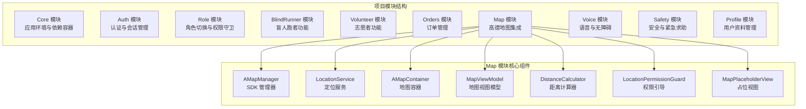
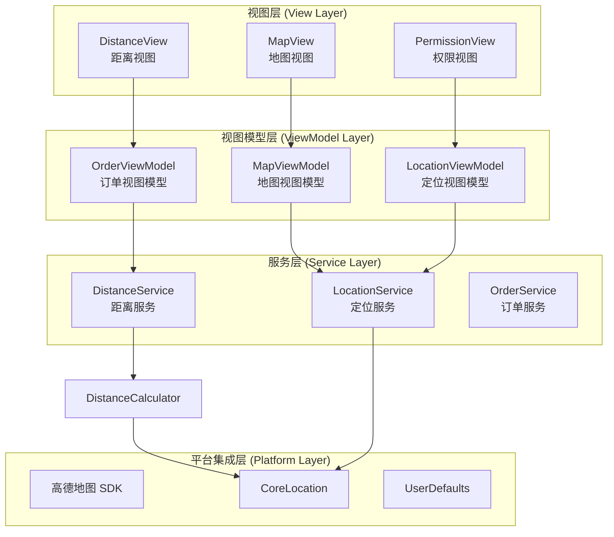
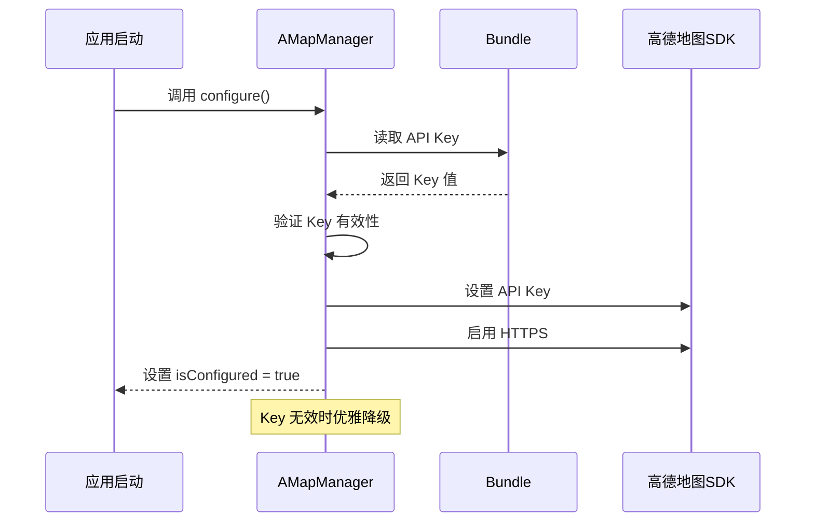
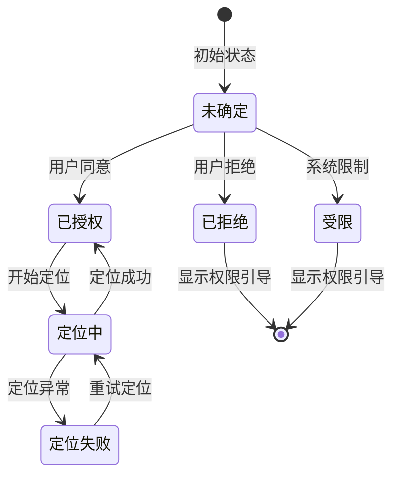
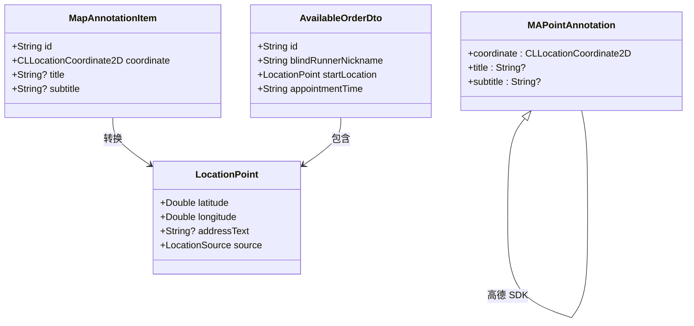
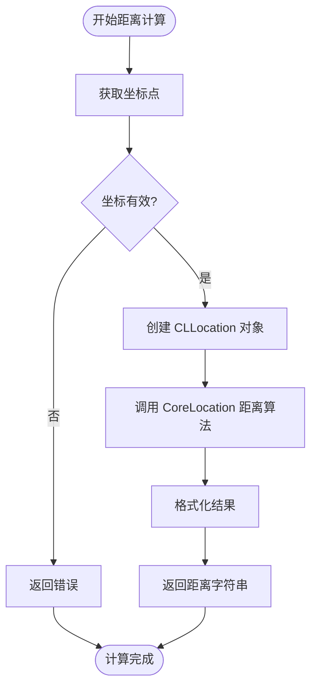
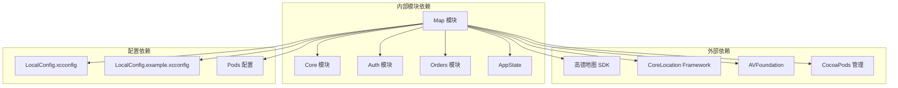

# Map 地图模块

<cite>
**本文档引用的文件**
- [MapViewModel.swift](file://blindRun/blindRun/Map/MapViewModel.swift)
- [LocationPermissionGuard.swift](file://blindRun/blindRun/Map/LocationPermissionGuard.swift)
- [DistanceCalculator.swift](file://blindRun/blindRun/Map/DistanceCalculator.swift)
- [MapPlaceholderView.swift](file://blindRun/blindRun/Map/MapPlaceholderView.swift)
- [AMapManager.swift](file://blindRun/blindRun/Map/AMapManager.swift)
- [LocationService.swift](file://blindRun/blindRun/Map/LocationService.swift)
- [AMapContainer.swift](file://blindRun/blindRun/Map/AMapContainer.swift)
- [MapModule.swift](file://blindRun/blindRun/Map/MapModule.swift)
- [Podfile](file://blindRun/Podfile)
- [LocalConfig.xcconfig.example](file://LocalConfig.xcconfig.example)
- [AppColors.swift](file://blindRun/blindRun/Core/DesignSystem/AppColors.swift)
- [UserModels.swift](file://blindRun/blindRun/Core/Models/UserModels.swift)
- [OrderModels.swift](file://blindRun/blindRun/Core/Models/OrderModels.swift)
- [08-ios-architecture.md](file://docs/08-ios-architecture.md)
- [02-mvp-scope.md](file://docs/02-mvp-scope.md)
- [04-user-flows-and-state-machine.md](file://docs/04-user-flows-and-state-machine.md)
- [spec.md](file://openspec/changes/add-aidrun-ios-spring-mvp/specs/amap-location/spec.md)
- [tasks.md](file://openspec/changes/add-aidrun-ios-spring-mvp/tasks.md)
</cite>

## 更新摘要
**所做更改**
- 新增完整的 MVVM 架构实现分析
- 添加 LocationPermissionGuard.swift 权限引导组件详解
- 新增 DistanceCalculator.swift 距离计算工具分析
- 新增 MapPlaceholderView.swift 占位视图组件说明
- 更新 CocoaPods 集成配置和依赖管理
- 完善定位服务和地图管理器的架构分析
- 增强权限处理和降级方案的技术细节

## 目录
1. [简介](#简介)
2. [项目结构](#项目结构)
3. [核心组件](#核心组件)
4. [MVVM 架构实现](#mvvm-架构实现)
5. [详细组件分析](#详细组件分析)
6. [CocoaPods 依赖集成](#cocoapods-依赖集成)
7. [权限处理策略](#权限处理策略)
8. [依赖关系分析](#依赖关系分析)
9. [性能考虑](#性能考虑)
10. [故障排除指南](#故障排除指南)
11. [结论](#结论)
12. [附录](#附录)

## 简介

Map 地图模块是 AidRun iOS 应用的核心功能模块之一，负责集成高德地图 SDK 实现真实地图显示、实时定位和位置标记管理。该模块已完整实现 MVVM 架构设计，采用 SwiftUI + MVVM 架构模式，确保代码的可维护性和可测试性。

根据项目需求，Map 模块需要实现以下核心功能：
- 高德地图 SDK 集成与地图初始化
- 实时定位功能与权限处理
- 地图标记管理（订单起点标记、志愿者当前位置标记）
- 距离计算与排序算法
- 地图交互功能（缩放控制、拖拽响应、用户位置定位）
- 完整的权限处理和降级方案

## 项目结构

基于项目文档分析，Map 模块在项目中的组织结构如下：



**图表来源**
- [MapModule.swift:6-31](file://blindRun/blindRun/Map/MapModule.swift#L6-L31)
- [08-ios-architecture.md:28](file://docs/08-ios-architecture.md#L28)
- [02-mvp-scope.md:54](file://docs/02-mvp-scope.md#L54)

**章节来源**
- [MapModule.swift:6-31](file://blindRun/blindRun/Map/MapModule.swift#L6-L31)
- [08-ios-architecture.md:18-32](file://docs/08-ios-architecture.md#L18-L32)
- [02-mvp-scope.md:54-63](file://docs/02-mvp-scope.md#L54-L63)

## 核心组件

### 高德地图 SDK 管理器 (AMapManager)

AMapManager 负责高德地图 SDK 的初始化和配置管理：
- SDK 初始化与 API Key 验证
- HTTPS 加密连接启用
- 优雅降级机制（Key 未配置时不崩溃）
- 配置状态跟踪和状态查询

### 定位服务 (LocationService)

定位服务模块提供完整的设备定位功能：
- CoreLocation 封装与生命周期管理
- 位置权限状态跟踪
- 实时位置更新监听
- 位置有效性判断和降级处理
- 错误状态管理和用户反馈

### 地图容器 (AMapContainer)

地图容器组件实现 SwiftUI 与高德地图 SDK 的桥接：
- UIViewRepresentable 协议实现
- 地图视图生命周期管理
- 标注同步和更新机制
- 用户位置显示控制
- 地图交互事件处理

### 地图视图模型 (MapViewModel)

MVVM 架构中的视图模型层：
- 发布状态管理（@Published 属性）
- 地图中心坐标跟踪
- 标注列表管理
- 用户位置跟踪
- 依赖注入和配置管理

### 距离计算器 (DistanceCalculator)

专用的距离计算工具：
- 两点间距离计算（WGS84 椭球体算法）
- 人类可读的距离格式化
- 订单按距离排序功能
- 批量距离计算优化

### 权限引导组件 (LocationPermissionGuard)

专门的权限处理 UI 组件：
- 角色特定的权限提示信息
- 系统设置页面跳转
- Demo 位置使用提示
- 无障碍访问支持

### 占位视图组件 (MapPlaceholderView)

SDK 未配置时的优雅降级：
- 清晰的错误提示信息
- 配置引导说明
- 调试模式下的额外信息
- 无障碍访问支持

**章节来源**
- [AMapManager.swift:9-34](file://blindRun/blindRun/Map/AMapManager.swift#L9-L34)
- [LocationService.swift:18-57](file://blindRun/blindRun/Map/LocationService.swift#L18-L57)
- [AMapContainer.swift:19-54](file://blindRun/blindRun/Map/AMapContainer.swift#L19-L54)
- [MapViewModel.swift:10-29](file://blindRun/blindRun/Map/MapViewModel.swift#L10-L29)
- [DistanceCalculator.swift:8-52](file://blindRun/blindRun/Map/DistanceCalculator.swift#L8-L52)
- [LocationPermissionGuard.swift:7-57](file://blindRun/blindRun/Map/LocationPermissionGuard.swift#L7-L57)
- [MapPlaceholderView.swift:7-38](file://blindRun/blindRun/Map/MapPlaceholderView.swift#L7-L38)

## MVVM 架构实现

Map 模块已完整实现 MVVM 架构模式，确保关注点分离和代码可维护性：



**图表来源**
- [MapViewModel.swift:45-59](file://blindRun/blindRun/Map/MapViewModel.swift#L45-L59)
- [LocationService.swift:18-117](file://blindRun/blindRun/Map/LocationService.swift#L18-L117)
- [DistanceCalculator.swift:8-52](file://blindRun/blindRun/Map/DistanceCalculator.swift#L8-L52)

### 依赖注入模式

模块采用显式依赖注入模式，通过 `configure(with:)` 方法注入依赖：
- LocationService 作为 @EnvironmentObject 注入
- 依赖关系清晰明确
- 便于单元测试和模拟对象替换
- 遵循 SOLID 原则

### 状态管理机制

使用 Combine 框架实现响应式状态管理：
- @Published 属性自动触发视图更新
- Combine 订阅链管理
- 主线程调度确保 UI 安全更新
- 内存泄漏防护（弱引用和取消令牌）

**章节来源**
- [MapViewModel.swift:45-59](file://blindRun/blindRun/Map/MapViewModel.swift#L45-L59)
- [MapViewModel.swift:28-29](file://blindRun/blindRun/Map/MapViewModel.swift#L28-L29)

## 详细组件分析

### 地图初始化与配置

#### SDK 初始化流程



**图表来源**
- [AMapManager.swift:16-34](file://blindRun/blindRun/Map/AMapManager.swift#L16-L34)
- [Podfile:6-9](file://blindRun/Podfile#L6-L9)

#### 地图容器配置参数

AMapContainer 提供灵活的地图配置选项：
- 用户位置显示控制 (`showsUserLocation`)
- 地图缩放级别设置 (`zoomLevel`)
- 标注同步和更新机制
- 地图代理委托处理
- 无障碍访问支持

### 实时定位功能实现

#### 定位权限状态管理



**图表来源**
- [LocationService.swift:142-159](file://blindRun/blindRun/Map/LocationService.swift#L142-L159)
- [LocationService.swift:54-57](file://blindRun/blindRun/Map/LocationService.swift#L54-L57)

#### 位置更新监听机制

定位服务通过以下机制实现可靠的位置更新：
- 位置精度过滤（kCLLocationAccuracyBest）
- 距离过滤（distanceFilter = 10 米）
- 自动重试和错误处理
- 后台运行时的权限适配
- 位置有效性验证

### 地图标记管理

#### 标记数据模型



**图表来源**
- [AMapContainer.swift:8-13](file://blindRun/blindRun/Map/AMapContainer.swift#L8-L13)
- [OrderModels.swift:130-142](file://blindRun/blindRun/Core/Models/OrderModels.swift#L130-L142)

#### 标记同步机制

AMapContainer 实现高效的标注同步：
- 旧标注清理和新标注添加
- 标注复用机制优化性能
- 用户位置标注特殊处理
- 标注视图自定义样式
- 动画效果和用户体验优化

### 距离计算功能实现

#### 距离计算算法优化



**图表来源**
- [DistanceCalculator.swift:11-18](file://blindRun/blindRun/Map/DistanceCalculator.swift#L11-L18)
- [DistanceCalculator.swift:23-31](file://blindRun/blindRun/Map/DistanceCalculator.swift#L23-L31)

#### 订单排序算法

距离排序采用稳定的排序算法：
- 批量计算订单距离
- 元组形式保持订单和距离关联
- 升序排列（最近优先）
- 性能优化的单次遍历
- 内存使用优化

### 地图交互功能

#### 用户位置定位

用户位置定位功能实现：
- 自动定位到用户当前位置
- 定位精度指示器
- 定位失败处理与提示
- 模拟器定位降级方案
- 无障碍访问支持

#### 地图缩放控制

地图缩放控制包括：
- 手势缩放（双指捏合）
- 按钮缩放控制
- 最小/最大缩放级别限制
- 动画过渡效果
- 用户体验优化

**章节来源**
- [LocationService.swift:34-47](file://blindRun/blindRun/Map/LocationService.swift#L34-L47)
- [AMapContainer.swift:31-35](file://blindRun/blindRun/Map/AMapContainer.swift#L31-L35)
- [MapViewModel.swift:64-67](file://blindRun/blindRun/Map/MapViewModel.swift#L64-L67)

## CocoaPods 依赖集成

### 依赖配置

项目使用 CocoaPods 管理高德地图 SDK 依赖：

```ruby
# 高德地图 SDK (NO-IDFA 版本，避免审核问题)
pod 'AMap3DMap-NO-IDFA'
pod 'AMapLocation-NO-IDFA'
pod 'AMapSearch-NO-IDFA'
```

### 构建设置优化

CocoaPods 集成包含以下优化设置：
- 禁用脚本沙箱以支持资源复制
- 排除 arm64 模拟器架构支持 Rosetta
- 统一部署目标版本设置
- 自动配置构建设置

### 依赖版本管理

| 依赖包 | 版本要求 | 用途 | 配置方式 |
|--------|----------|------|----------|
| AMap3DMap-NO-IDFA | 最新稳定版 | 地图显示 | CocoaPods 管理 |
| AMapLocation-NO-IDFA | 最新稳定版 | 定位服务 | CocoaPods 管理 |
| AMapSearch-NO-IDFA | 最新稳定版 | 地图搜索 | CocoaPods 管理 |

**章节来源**
- [Podfile:1-32](file://blindRun/Podfile#L1-L32)
- [LocalConfig.xcconfig.example:16-21](file://LocalConfig.xcconfig.example#L16-L21)

## 权限处理策略

### 权限引导组件

LocationPermissionGuard 提供角色特定的权限处理：
- 盲人跑者：阻止预约创建功能
- 志愿者：阻止距离排序和接单功能
- 系统设置页面跳转
- 清晰的使用指导信息
- 无障碍访问支持

### Demo 降级方案

当定位权限被拒绝或模拟器运行时：
- 使用默认北京坐标 (39.9042, 116.4074)
- DemoLocationBanner 提示用户
- 功能降级但不完全阻塞
- 用户可以手动配置真实位置

### 权限状态跟踪

LocationService 提供完整的权限状态管理：
- 授权状态枚举值跟踪
- 位置有效性判断
- 错误状态管理和用户反馈
- 自动权限状态更新

**章节来源**
- [LocationPermissionGuard.swift:42-56](file://blindRun/blindRun/Map/LocationPermissionGuard.swift#L42-L56)
- [LocationService.swift:34-57](file://blindRun/blindRun/Map/LocationService.swift#L34-L57)
- [MapModule.swift:23-31](file://blindRun/blindRun/Map/MapModule.swift#L23-L31)

## 依赖关系分析

### 组件依赖关系



**图表来源**
- [MapModule.swift:8-21](file://blindRun/blindRun/Map/MapModule.swift#L8-L21)
- [Podfile:3-10](file://blindRun/Podfile#L3-L10)

### 关键依赖项说明

| 依赖项 | 版本要求 | 用途 | 配置方式 |
|--------|----------|------|----------|
| 高德地图 SDK | NO-IDFA 版本 | 地图显示与交互 | CocoaPods 管理 |
| CoreLocation | iOS 16+ | 位置服务 | 系统框架 |
| AVFoundation | iOS 16+ | 语音播报 | 系统框架 |
| SwiftUI | iOS 16+ | UI 框架 | 系统框架 |
| Combine | iOS 16+ | 响应式编程 | 系统框架 |

**章节来源**
- [MapModule.swift:8-21](file://blindRun/blindRun/Map/MapModule.swift#L8-L21)
- [Podfile:1-10](file://blindRun/Podfile#L1-L10)

## 性能考虑

### 地图渲染优化

- **标记批处理**：合并多个标记更新操作，减少地图重绘次数
- **延迟加载**：按需加载远距离标记，避免一次性加载过多标记
- **缓存策略**：缓存已加载的地图瓦片和标记资源
- **内存管理**：及时释放不再使用的地图资源和标记对象
- **坐标阈值更新**：避免频繁的地图中心移动

### 定位性能优化

- **更新频率控制**：合理设置定位更新间隔，平衡精度与性能
- **位置过滤**：过滤低精度位置更新，减少无效计算
- **后台处理**：将耗时的地理计算放在后台队列执行
- **电量优化**：在保证功能的前提下降低定位功耗
- **权限状态优化**：避免不必要的权限请求

### 距离计算优化

- **批量计算**：支持批量订单距离计算，提高效率
- **索引优化**：对常用坐标建立索引，加速计算过程
- **缓存结果**：缓存已计算的距离结果，避免重复计算
- **算法优化**：使用 CoreLocation 内置优化算法

### 内存管理优化

- **弱引用使用**：防止循环引用
- **取消令牌**：及时取消 Combine 订阅
- **对象池**：标注视图复用机制
- **资源释放**：及时释放不再使用的资源

**章节来源**
- [AMapContainer.swift:44-50](file://blindRun/blindRun/Map/AMapContainer.swift#L44-L50)
- [LocationService.swift:77-78](file://blindRun/blindRun/Map/LocationService.swift#L77-L78)
- [DistanceCalculator.swift:42-51](file://blindRun/blindRun/Map/DistanceCalculator.swift#L42-L51)

## 故障排除指南

### 常见问题与解决方案

#### 地图无法显示

**症状**：应用启动后地图空白或显示异常

**可能原因**：
- 高德地图密钥配置错误
- CocoaPods 依赖安装问题
- 网络连接问题
- 设备兼容性问题

**解决步骤**：
1. 检查 LocalConfig.xcconfig 文件配置
2. 运行 `pod install` 重新安装依赖
3. 验证网络连接状态
4. 确认设备 iOS 版本满足要求
5. 重新初始化地图实例

#### 定位权限被拒绝

**症状**：应用无法获取用户位置信息

**处理策略**：
1. 显示清晰的权限说明
2. 提供设置页面跳转
3. 实施降级方案（使用默认坐标）
4. 记录权限拒绝历史
5. 提供 Demo 位置提示

#### 距离计算异常

**症状**：订单距离显示错误或排序异常

**排查步骤**：
1. 验证坐标格式与精度
2. 检查距离计算算法实现
3. 确认排序逻辑正确性
4. 验证边界条件处理
5. 检查 CoreLocation 服务状态

#### CocoaPods 集成问题

**症状**：编译时找不到高德地图 SDK

**解决步骤**：
1. 确认 Podfile 配置正确
2. 运行 `pod repo update` 更新仓库
3. 运行 `pod install --repo-update`
4. 清理 Derived Data
5. 重启 Xcode

### 调试最佳实践

#### 日志记录策略

- **关键路径日志**：记录地图初始化、定位更新、标记操作等关键事件
- **错误日志**：详细记录异常情况和错误堆栈
- **性能日志**：监控地图渲染和定位性能指标
- **用户行为日志**：记录用户与地图交互行为

#### 性能监控

- **内存使用监控**：定期检查内存占用情况
- **CPU 使用率监控**：监控定位和地图计算的 CPU 占用
- **网络请求监控**：跟踪地图相关的网络请求
- **电池消耗监控**：评估定位功能的电池影响

**章节来源**
- [AMapManager.swift:21-24](file://blindRun/blindRun/Map/AMapManager.swift#L21-L24)
- [LocationPermissionGuard.swift:51-56](file://blindRun/blindRun/Map/LocationPermissionGuard.swift#L51-L56)
- [Podfile:12-31](file://blindRun/Podfile#L12-L31)

## 结论

Map 地图模块作为 AidRun iOS 应用的核心功能模块，已成功实现完整的 MVVM 架构设计，提供了高度模块化和可维护的代码结构。模块集成了高德地图 SDK，实现了完整的地图显示、实时定位和位置标记管理功能。

通过引入新的辅助组件（LocationPermissionGuard.swift, DistanceCalculator.swift, MapPlaceholderView.swift），模块在用户体验和功能完整性方面都有显著提升。CocoaPods 的完整集成确保了依赖管理的标准化和自动化。

模块设计充分考虑了权限处理、降级方案和性能优化，展现了良好的工程实践和技术实现能力。MVVM 架构的采用为未来的功能扩展和维护奠定了坚实的基础。

## 附录

### 配置文件说明

#### LocalConfig.example.xcconfig

示例配置文件包含以下关键配置项：
- AMapAPIKey：高德地图 API 密钥
- AMapLocationKey：定位服务密钥
- AMapSearchKey：地图搜索密钥
- AMAP_API_KEY：环境变量配置

#### CocoaPods 配置最佳实践

- **依赖管理**：使用 CocoaPods 管理第三方库
- **版本锁定**：固定依赖版本确保一致性
- **构建设置**：自动配置构建参数
- **脚本优化**：禁用脚本沙箱提升构建速度

### 开发任务清单

根据项目规划，Map 模块的开发任务包括：
- [x] 高德地图 SDK 集成与配置
- [x] 地图视图与标记系统实现
- [x] 实时定位功能开发
- [x] 距离计算与排序算法
- [x] 权限处理与降级方案
- [x] MVVM 架构完整实现
- [x] CocoaPods 依赖管理
- [x] 辅助组件开发
- [x] 性能优化与测试

**章节来源**
- [MapModule.swift:6-31](file://blindRun/blindRun/Map/MapModule.swift#L6-L31)
- [LocalConfig.xcconfig.example:16-21](file://LocalConfig.xcconfig.example#L16-L21)
- [tasks.md:48-53](file://openspec/changes/add-aidrun-ios-spring-mvp/tasks.md#L48-L53)