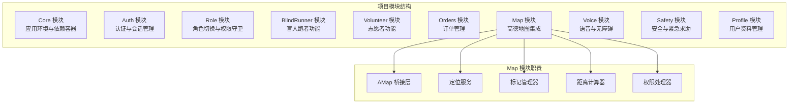
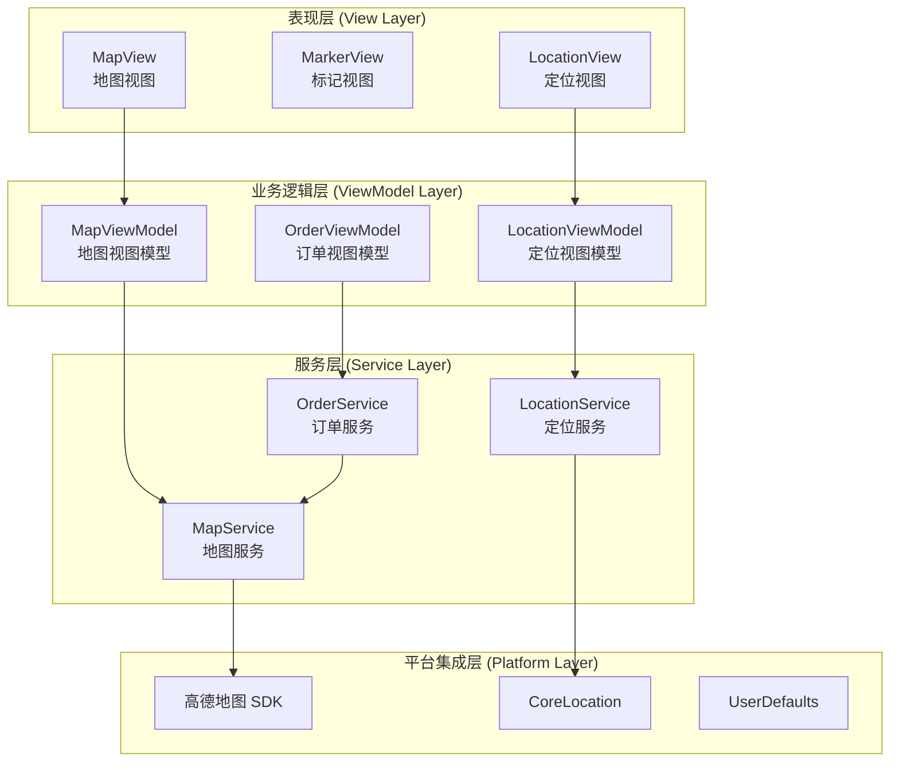
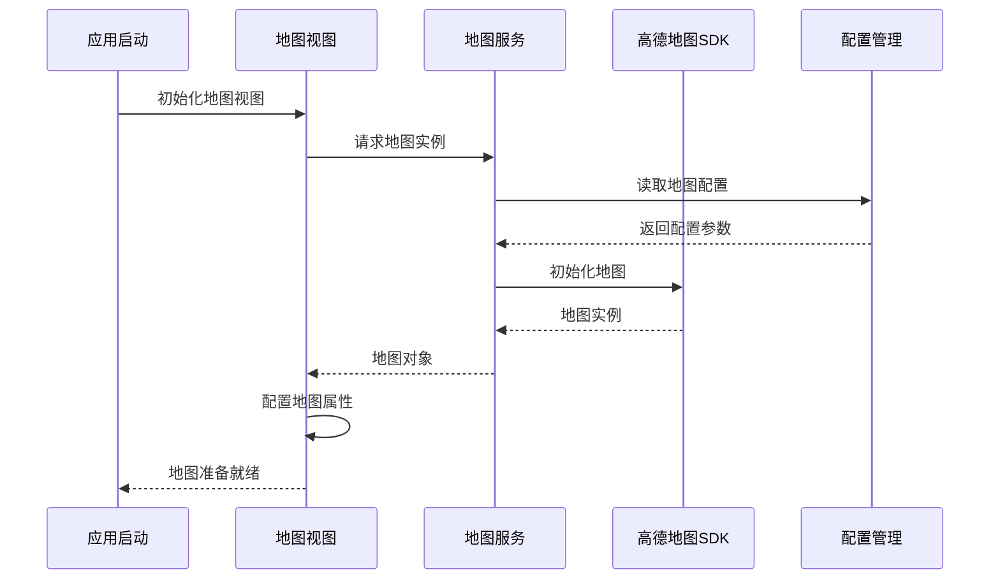
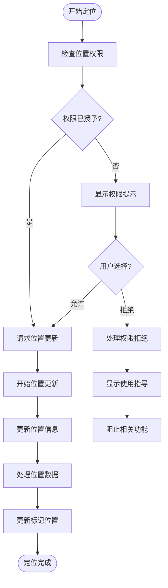
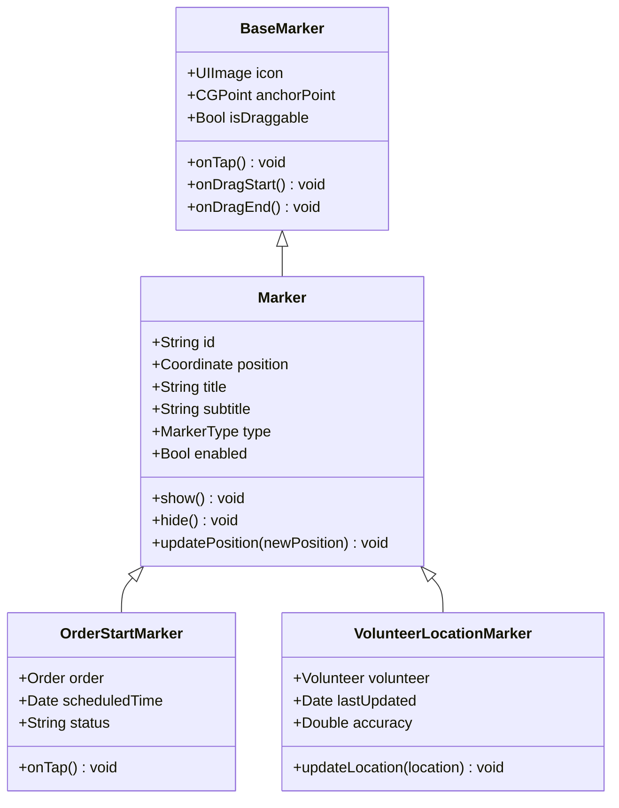
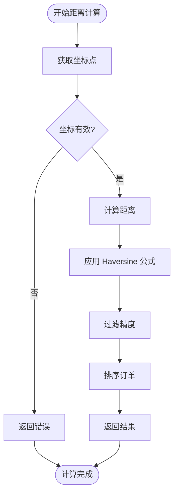
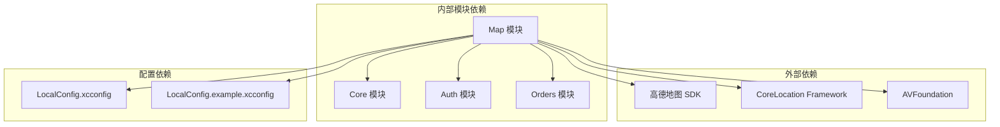

# Map 地图模块

<cite>
**本文档引用的文件**
- [blindRunApp.swift](file://blindRun/blindRun/blindRunApp.swift)
- [ContentView.swift](file://blindRun/blindRun/blindRunApp.swift)
- [08-ios-architecture.md](file://docs/08-ios-architecture.md)
- [02-mvp-scope.md](file://docs/02-mvp-scope.md)
- [04-user-flows-and-state-machine.md](file://docs/04-user-flows-and-state-machine.md)
- [spec.md](file://openspec/changes/add-aidrun-ios-spring-mvp/specs/amap-location/spec.md)
- [tasks.md](file://openspec/changes/add-aidrun-ios-spring-mvp/tasks.md)
- [LocalConfig.example.xcconfig](file://LocalConfig.example.xcconfig)
</cite>

## 目录
1. [简介](#简介)
2. [项目结构](#项目结构)
3. [核心组件](#核心组件)
4. [架构概览](#架构概览)
5. [详细组件分析](#详细组件分析)
6. [依赖关系分析](#依赖关系分析)
7. [性能考虑](#性能考虑)
8. [故障排除指南](#故障排除指南)
9. [结论](#结论)
10. [附录](#附录)

## 简介

Map 地图模块是 AidRun iOS 应用的核心功能模块之一，负责集成高德地图 SDK 实现真实地图显示、实时定位和位置标记管理。该模块严格遵循 MVP 架构设计，采用 SwiftUI + MVVM 架构模式，确保代码的可维护性和可测试性。

根据项目需求，Map 模块需要实现以下核心功能：
- 高德地图 SDK 集成与地图初始化
- 实时定位功能与权限处理
- 地图标记管理（订单起点标记、志愿者当前位置标记）
- 距离计算与排序算法
- 地图交互功能（缩放控制、拖拽响应、用户位置定位）

## 项目结构

基于项目文档分析，Map 模块在项目中的组织结构如下：

**图表来源**
- [08-ios-architecture.md:28](file://docs/08-ios-architecture.md#L28)
- [02-mvp-scope.md:54](file://docs/02-mvp-scope.md#L54)

**章节来源**
- [08-ios-architecture.md:18-32](file://docs/08-ios-architecture.md#L18-L32)
- [02-mvp-scope.md:54-63](file://docs/02-mvp-scope.md#L54-L63)

## 核心组件

### 高德地图桥接层 (AMap Bridge Layer)

AMap 桥接层负责封装高德地图 SDK 的核心功能，包括：
- 地图初始化与配置
- 视图控制器集成
- 地图事件监听
- 基础地图操作接口

### 定位服务 (Location Service)

定位服务模块提供实时位置获取和管理功能：
- CoreLocation 与高德定位 SDK 集成
- 位置权限检查与处理
- 定位更新监听
- 位置精度处理

### 标记管理器 (Marker Manager)

标记管理器负责地图标记的生命周期管理：
- 订单起点标记显示
- 志愿者当前位置标记
- 标记点击事件处理
- 标记样式与图标管理

### 距离计算器 (Distance Calculator)

距离计算器实现 iOS 端的地理距离计算：
- 志愿者到订单起点距离计算
- 订单列表本地排序算法
- 性能优化的批量距离计算

### 权限处理器 (Permission Handler)

权限处理器管理位置权限的获取与处理：
- 位置权限请求与检查
- 权限拒绝时的降级处理
- 用户体验优化策略

**章节来源**
- [08-ios-architecture.md:98-124](file://docs/08-ios-architecture.md#L98-L124)
- [spec.md:3-38](file://openspec/changes/add-aidrun-ios-spring-mvp/specs/amap-location/spec.md#L3-L38)

## 架构概览

Map 模块采用分层架构设计，确保各组件间的松耦合和高内聚：

**图表来源**
- [08-ios-architecture.md:33-49](file://docs/08-ios-architecture.md#L33-L49)
- [08-ios-architecture.md:98-124](file://docs/08-ios-architecture.md#L98-L124)

## 详细组件分析

### 地图初始化与配置

#### 地图初始化流程

**图表来源**
- [08-ios-architecture.md:119-124](file://docs/08-ios-architecture.md#L119-L124)
- [LocalConfig.example.xcconfig](file://LocalConfig.example.xcconfig)

#### 视图配置参数

地图初始化时需要配置的关键参数包括：
- 地图类型与样式
- 缩放级别范围
- 指南针显示设置
- 比例尺显示配置
- 定位按钮样式

### 实时定位功能实现

#### 位置权限检查流程

**图表来源**
- [08-ios-architecture.md:107-112](file://docs/08-ios-architecture.md#L107-L112)
- [spec.md:11-22](file://openspec/changes/add-aidrun-ios-spring-mvp/specs/amap-location/spec.md#L11-L22)

#### 定位更新监听机制

定位服务通过以下机制实现持续的位置更新：
- 定位更新频率控制（建议 1-2 秒间隔）
- 位置精度过滤（只接受高精度位置）
- 位置缓存与去抖动处理
- 错误处理与重试机制

### 地图标记管理

#### 标记类型与用途

**图表来源**
- [08-ios-architecture.md:100-105](file://docs/08-ios-architecture.md#L100-L105)
- [spec.md:7-9](file://openspec/changes/add-aidrun-ios-spring-mvp/specs/amap-location/spec.md#L7-L9)

#### 标记点击事件处理

标记点击事件的处理流程：
- 标记触摸检测
- 事件冒泡与传递
- 业务逻辑触发（如订单详情显示）
- 用户反馈与视觉反馈

### 距离计算功能实现

#### 距离计算算法

**图表来源**
- [08-ios-architecture.md:105](file://docs/08-ios-architecture.md#L105)
- [spec.md:23-29](file://openspec/changes/add-aidrun-ios-spring-mvp/specs/amap-location/spec.md#L23-L29)

#### 距离排序算法

iOS 端订单距离排序采用以下策略：
- 使用地理位置坐标进行精确计算
- 支持批量距离计算优化
- 实时更新排序结果
- 性能监控与优化

### 地图交互功能

#### 缩放控制实现

地图缩放控制包括：
- 手势缩放（双指捏合）
- 按钮缩放控制
- 最小/最大缩放级别限制
- 动画过渡效果

#### 拖拽响应机制

拖拽功能实现要点：
- 视图拖拽检测
- 地图平移响应
- 边界限制与回弹效果
- 用户交互反馈

#### 用户位置定位

用户位置定位功能：
- 自动定位到用户当前位置
- 定位精度指示器
- 定位失败处理与提示
- 模拟器定位降级方案

**章节来源**
- [08-ios-architecture.md:98-117](file://docs/08-ios-architecture.md#L98-L117)
- [spec.md:31-37](file://openspec/changes/add-aidrun-ios-spring-mvp/specs/amap-location/spec.md#L31-L37)

## 依赖关系分析

### 组件依赖关系

**图表来源**
- [08-ios-architecture.md:13](file://docs/08-ios-architecture.md#L13)
- [02-mvp-scope.md:146-151](file://docs/02-mvp-scope.md#L146-L151)

### 关键依赖项说明

| 依赖项 | 版本要求 | 用途 | 配置方式 |
|--------|----------|------|----------|
| 高德地图 SDK | 最新稳定版 | 地图显示与交互 | LocalConfig.xcconfig |
| CoreLocation | iOS 16+ | 位置服务 | 系统框架 |
| AVFoundation | iOS 16+ | 语音播报 | 系统框架 |
| SwiftUI | iOS 16+ | UI 框架 | 系统框架 |

**章节来源**
- [08-ios-architecture.md:7-16](file://docs/08-ios-architecture.md#L7-L16)
- [02-mvp-scope.md:146-151](file://docs/02-mvp-scope.md#L146-L151)

## 性能考虑

### 地图渲染优化

- **标记批处理**：合并多个标记更新操作，减少地图重绘次数
- **延迟加载**：按需加载远距离标记，避免一次性加载过多标记
- **缓存策略**：缓存已加载的地图瓦片和标记资源
- **内存管理**：及时释放不再使用的地图资源和标记对象

### 定位性能优化

- **更新频率控制**：合理设置定位更新间隔，平衡精度与性能
- **位置过滤**：过滤低精度位置更新，减少无效计算
- **后台处理**：将耗时的地理计算放在后台队列执行
- **电量优化**：在保证功能的前提下降低定位功耗

### 距离计算优化

- **批量计算**：支持批量订单距离计算，提高效率
- **索引优化**：对常用坐标建立索引，加速计算过程
- **缓存结果**：缓存已计算的距离结果，避免重复计算

## 故障排除指南

### 常见问题与解决方案

#### 地图无法显示

**症状**：应用启动后地图空白或显示异常

**可能原因**：
- 高德地图密钥配置错误
- 网络连接问题
- 设备兼容性问题

**解决步骤**：
1. 检查 LocalConfig.xcconfig 文件配置
2. 验证网络连接状态
3. 确认设备 iOS 版本满足要求
4. 重新初始化地图实例

#### 定位权限被拒绝

**症状**：应用无法获取用户位置信息

**处理策略**：
1. 显示清晰的权限说明
2. 提供设置页面跳转
3. 实施降级方案（使用默认坐标）
4. 记录权限拒绝历史

#### 距离计算异常

**症状**：订单距离显示错误或排序异常

**排查步骤**：
1. 验证坐标格式与精度
2. 检查距离计算算法实现
3. 确认排序逻辑正确性
4. 验证边界条件处理

### 调试最佳实践

#### 日志记录策略

- **关键路径日志**：记录地图初始化、定位更新、标记操作等关键事件
- **错误日志**：详细记录异常情况和错误堆栈
- **性能日志**：监控地图渲染和定位性能指标
- **用户行为日志**：记录用户与地图交互行为

#### 性能监控

- **内存使用监控**：定期检查内存占用情况
- **CPU 使用率监控**：监控定位和地图计算的 CPU 占用
- **网络请求监控**：跟踪地图相关的网络请求
- **电池消耗监控**：评估定位功能的电池影响

**章节来源**
- [08-ios-architecture.md:114-117](file://docs/08-ios-architecture.md#L114-L117)
- [tasks.md:48-53](file://openspec/changes/add-aidrun-ios-spring-mvp/tasks.md#L48-L53)

## 结论

Map 地图模块作为 AidRun iOS 应用的核心功能模块，成功实现了高德地图 SDK 的深度集成，提供了完整的地图显示、实时定位和位置标记管理功能。模块设计遵循了 MVVM 架构模式，确保了代码的可维护性和可测试性。

通过合理的组件划分和依赖管理，Map 模块不仅满足了 MVP 的功能需求，还为未来的功能扩展奠定了坚实的基础。特别是在定位权限处理、距离计算优化和用户体验提升方面，模块展现了良好的设计思维和技术实现能力。

## 附录

### 配置文件说明

#### LocalConfig.example.xcconfig

示例配置文件包含以下关键配置项：
- AMapAPIKey：高德地图 API 密钥
- AMapLocationKey：定位服务密钥
- AMapSearchKey：地图搜索密钥

#### 配置管理最佳实践

- **本地配置**：使用 LocalConfig.xcconfig 存储敏感配置
- **示例配置**：提交 LocalConfig.example.xcconfig 作为配置模板
- **Git 忽略**：将 LocalConfig.xcconfig 添加到 .gitignore
- **环境分离**：支持开发、测试、生产环境的不同配置

### 开发任务清单

根据项目规划，Map 模块的开发任务包括：
- [ ] 高德地图 SDK 集成与配置
- [ ] 地图视图与标记系统实现
- [ ] 实时定位功能开发
- [ ] 距离计算与排序算法
- [ ] 权限处理与降级方案
- [ ] 无障碍与语音集成
- [ ] 性能优化与测试

**章节来源**
- [tasks.md:48-53](file://openspec/changes/add-aidrun-ios-spring-mvp/tasks.md#L48-L53)
- [LocalConfig.example.xcconfig](file://LocalConfig.example.xcconfig)