# Orders 订单模块

<cite>
**本文引用的文件**
- [用户流程与状态机.md](file://docs/04-user-flows-and-state-machine.md)
- [API 合同.openapi.yaml](file://docs/07-api-contract.openapi.yaml)
- [iOS 架构.md](file://docs/08-ios-architecture.md)
- [无障碍与语音指南.md](file://docs/09-accessibility-and-voice-guidelines.md)
- [任务清单.md](file://openspec/changes/add-aidrun-ios-spring-mvp/tasks.md)
- [订单状态生命周期.spec.md](file://openspec/changes/add-aidrun-ios-spring-mvp/specs/order-status-lifecycle/spec.md)
- [盲人跑者预订.spec.md](file://openspec/changes/add-aidrun-ios-spring-mvp/specs/blind-runner-booking/spec.md)
- [后台 API 合同.spec.md](file://openspec/changes/add-aidrun-ios-spring-mvp/specs/backend-api-contract/spec.md)
- [RunOrder.java](file://backend/src/main/java/com/aidrun/backend/order/RunOrder.java)
- [RunOrderService.java](file://backend/src/main/java/com/aidrun/backend/order/RunOrderService.java)
- [RunOrderController.java](file://backend/src/main/java/com/aidrun/backend/order/RunOrderController.java)
- [RunOrderRepository.java](file://backend/src/main/java/com/aidrun/backend/order/RunOrderRepository.java)
- [RunOrderDto.java](file://backend/src/main/java/com/aidrun/backend/order/dto/RunOrderDto.java)
- [CreateOrderRequest.java](file://backend/src/main/java/com/aidrun/backend/order/dto/CreateOrderRequest.java)
- [RunOrderStatus.java](file://backend/src/main/java/com/aidrun/backend/order/RunOrderStatus.java)
- [Cancellation.java](file://backend/src/main/java/com/aidrun/backend/order/Cancellation.java)
- [EmergencyEvent.java](file://backend/src/main/java/com/aidrun/backend/order/EmergencyEvent.java)
- [ServiceSummary.java](file://backend/src/main/java/com/aidrun/backend/order/ServiceSummary.java)
- [CancelledBy.java](file://backend/src/main/java/com/aidrun/backend/order/CancelledBy.java)
- [CancellationReason.java](file://backend/src/main/java/com/aidrun/backend/order/CancellationReason.java)
- [OrderRating.java](file://backend/src/main/java/com/aidrun/backend/order/OrderRating.java)
</cite>

## 目录
1. [简介](#简介)
2. [项目结构](#项目结构)
3. [核心组件](#核心组件)
4. [架构总览](#架构总览)
5. [详细组件分析](#详细组件分析)
6. [后端实现详解](#后端实现详解)
7. [依赖关系分析](#依赖关系分析)
8. [性能考虑](#性能考虑)
9. [故障排查指南](#故障排查指南)
10. [结论](#结论)
11. [附录](#附录)

## 简介
本文件面向 iOS 端 Orders 订单模块，基于冻结的 MVP 规格与 API 合同，系统化阐述订单状态机设计与实现、数据传输对象（DTO）定义与校验、轮询机制与并发控制策略、订单生命周期管理、事件处理与跨模块同步、以及缓存与本地存储方案。文档同时提供状态机图与关键流程序列图，帮助开发者快速理解与落地实现。

**更新** 新增完整的后端订单管理系统实现，包括实体模型、业务逻辑、控制器和数据传输对象的详细分析。

## 项目结构
根据 iOS 架构文档，Orders 模块属于独立的业务域，职责包括：
- 订单 DTO 定义与映射
- 订单状态机辅助逻辑
- 订单轮询与状态变更事件处理
- 与 API 层、视图模型层、语音服务层的协作

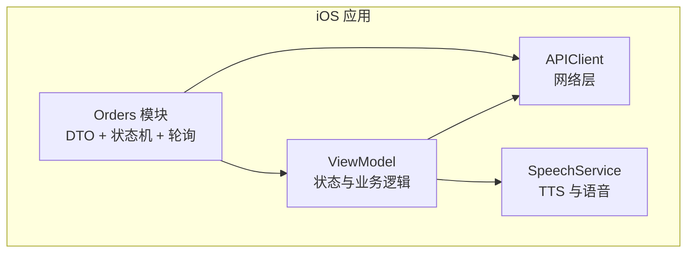

**章节来源**
- [iOS 架构.md: 27](file://docs/08-ios-architecture.md#L27)
- [iOS 架构.md: 46–48:46-48](file://docs/08-ios-architecture.md#L46-L48)

## 核心组件
- 订单状态机：定义从创建到完成的严格状态序列与禁止转换
- 订单 DTO：承载订单实体、状态、时间戳、取消/紧急事件等字段
- 轮询器：在关键页面按固定周期拉取订单详情，驱动 UI 与 TTS
- 并发控制：通过后端乐观锁与状态校验，防止竞态
- 事件处理：状态变化时触发 UI 更新与语音播报
- 缓存与本地存储：UserDefaults（MVP）持久化令牌与环境配置

**章节来源**
- [用户流程与状态机.md: 72–119:72-119](file://docs/04-user-flows-and-state-machine.md#L72-L119)
- [API 合同.openapi.yaml: 811–914:811-914](file://docs/07-api-contract.openapi.yaml#L811-L914)
- [无障碍与语音指南.md: 13–35:13-35](file://docs/09-accessibility-and-voice-guidelines.md#L13-L35)
- [iOS 架构.md: 78–82:78-82](file://docs/08-ios-architecture.md#L78-L82)

## 架构总览
下图展示 Orders 模块在整体应用中的位置与交互关系：

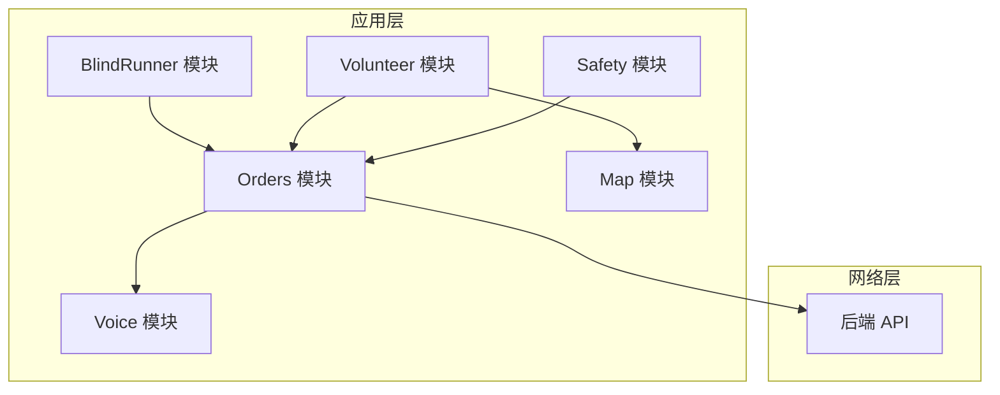

**图示来源**
- [iOS 架构.md: 22–31:22-31](file://docs/08-ios-architecture.md#L22-L31)
- [API 合同.openapi.yaml: 24–387:24-387](file://docs/07-api-contract.openapi.yaml#L24-L387)

## 详细组件分析

### 订单状态机设计与实现
- 状态集合：matching、accepted、arrived、in_progress、completed、cancelled、emergency
- 正常生命周期：matching → accepted → arrived → in_progress → completed
- 禁止转换：
  - in_progress → cancelled（服务开始后不支持普通取消）
  - emergency → 任何其他状态（MVP 不支持恢复）
  - completed/cancelled → 任何状态（终态）
- 触发条件：
  - 志愿者接单、到达、确认开始、结束服务
  - 盲人取消、确认开始、求助
  - 系统超时自动取消（预约时间不足 30 分钟且无人接单）

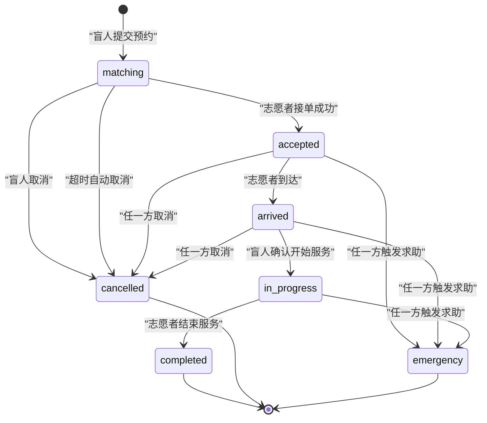

**图示来源**
- [用户流程与状态机.md: 74–96:74-96](file://docs/04-user-flows-and-state-machine.md#L74-L96)
- [订单状态生命周期.spec.md: 3–29:3-29](file://openspec/changes/add-aidrun-ios-spring-mvp/specs/order-status-lifecycle/spec.md#L3-L29)

**章节来源**
- [用户流程与状态机.md: 72–119:72-119](file://docs/04-user-flows-and-state-machine.md#L72-L119)
- [订单状态生命周期.spec.md: 3–29:3-29](file://openspec/changes/add-aidrun-ios-spring-mvp/specs/order-status-lifecycle/spec.md#L3-L29)

### 订单数据传输对象（DTO）定义与使用
- 核心模型：RunOrderDto
  - 字段要点：id、状态、起始/目的位置、预约时间、估计时长/距离、偏好与备注、取消/紧急事件、服务摘要、评分、各阶段时间戳
  - 可见性：志愿者接单后才暴露盲人电话
- 可用订单模型：AvailableOrderDto（扩展 RunOrderDto，隐藏盲人电话）
- 请求体与事件：
  - 取消请求：包含取消方与原因枚举
  - 紧急请求：可携带备注
  - 服务摘要：可选文本
- 错误码：INVALID_ORDER_STATUS、ORDER_ALREADY_ACCEPTED、ACTIVE_ORDER_ROLE_SWITCH_BLOCKED 等

```mermaid
erDiagram
RUN_ORDER_DTO {
uuid id PK
enum status
json startLocation
datetime appointmentTime
int estimatedDurationMinutes
double estimatedDistanceKm
string pacePreference
boolean preferSameGender
string remark
json cancellation
json emergencyEvent
json serviceSummary
json rating
datetime createdAt
datetime acceptedAt
datetime arrivedAt
datetime startedAt
datetime completedAt
datetime cancelledAt
datetime emergencyAt
datetime updatedAt
}
AVAILABLE_ORDER_DTO {
uuid id PK
string blindRunnerPhone
}
CANCELLATION_DTO {
uuid id PK
uuid orderId FK
enum cancelledBy
enum cancelledReason
datetime createdAt
}
EMERGENCY_EVENT_DTO {
uuid id PK
uuid orderId FK
enum triggeredByRole
enum previousStatus
datetime createdAt
}
SERVICE_SUMMARY_DTO {
uuid id PK
uuid orderId FK
uuid volunteerUserId FK
string summaryText
datetime createdAt
}
RATING_DTO {
uuid id PK
uuid orderId FK
uuid blindRunnerUserId FK
uuid volunteerUserId FK
int stars
string comment
datetime createdAt
}
RUN_ORDER_DTO ||--|| CANCELLATION_DTO : "包含"
RUN_ORDER_DTO ||--|| EMERGENCY_EVENT_DTO : "包含"
RUN_ORDER_DTO ||--|| SERVICE_SUMMARY_DTO : "包含"
RUN_ORDER_DTO ||--|| RATING_DTO : "包含"
RUN_ORDER_DTO ||--o{ AVAILABLE_ORDER_DTO : "扩展"
```

**图示来源**
- [API 合同.openapi.yaml: 811–914:811-914](file://docs/07-api-contract.openapi.yaml#L811-L914)
- [API 合同.openapi.yaml: 915–1067:915-1067](file://docs/07-api-contract.openapi.yaml#L915-L1067)

**章节来源**
- [API 合同.openapi.yaml: 811–914:811-914](file://docs/07-api-contract.openapi.yaml#L811-L914)
- [API 合同.openapi.yaml: 915–1067:915-1067](file://docs/07-api-contract.openapi.yaml#L915-L1067)

### 轮询机制实现
- 轮询频率：每 5 秒
- 触发场景：盲人端"等待/已接单/已到达/服务中"页面
- 停止条件：
  - 订单进入终态（completed、cancelled、emergency）
  - 页面消失
  - 用户登出
- 并发控制：
  - 后端乐观锁：接单仅允许 matching → accepted，冲突返回 ORDER_ALREADY_ACCEPTED
  - 状态校验：非预期状态返回 INVALID_ORDER_STATUS
- 事件处理：
  - 状态变化：更新 UI、触发 TTS 播报
  - 状态未变：保持当前 UI

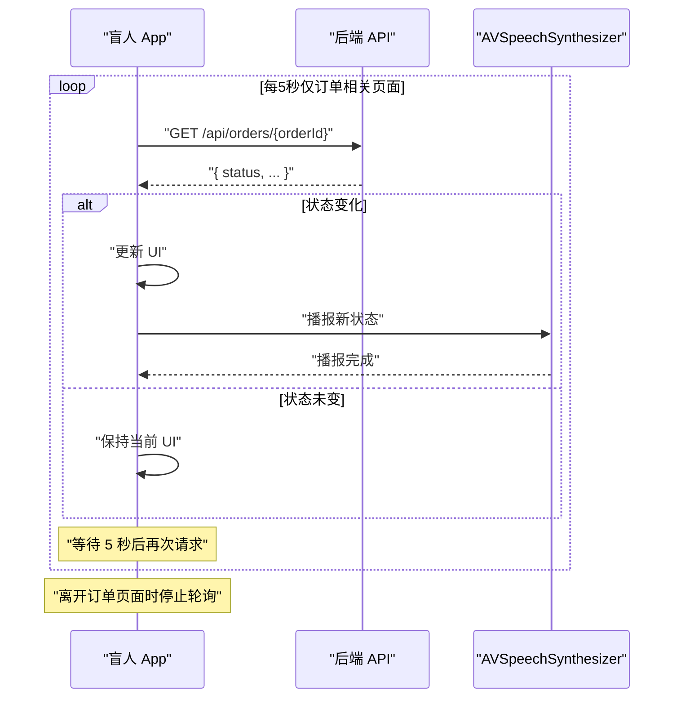

**图示来源**
- [用户流程与状态机.md: 277–299:277-299](file://docs/04-user-flows-and-state-machine.md#L277-L299)
- [无障碍与语音指南.md: 13–35:13-35](file://docs/09-accessibility-and-voice-guidelines.md#L13-L35)
- [iOS 架构.md: 125–139:125-139](file://docs/08-ios-architecture.md#L125-L139)

**章节来源**
- [用户流程与状态机.md: 275–309:275-309](file://docs/04-user-flows-and-state-machine.md#L275-L309)
- [无障碍与语音指南.md: 13–35:13-35](file://docs/09-accessibility-and-voice-guidelines.md#L13-L35)
- [iOS 架构.md: 125–139:125-139](file://docs/08-ios-architecture.md#L125-L139)

### 订单生命周期管理
- 创建预约：盲人填写起始地、时间、备注，提交后初始状态 matching
- 匹配与接单：志愿者可接单，状态 accepted；若 30 分钟内无人接单，系统自动取消
- 到达与确认：志愿者到达，状态 arrived；盲人确认开始，状态 in_progress
- 结束与评价：志愿者结束服务，状态 completed；盲人可选评分
- 异常处理：任一方触发 emergency，进入异常终态，MVP 不恢复

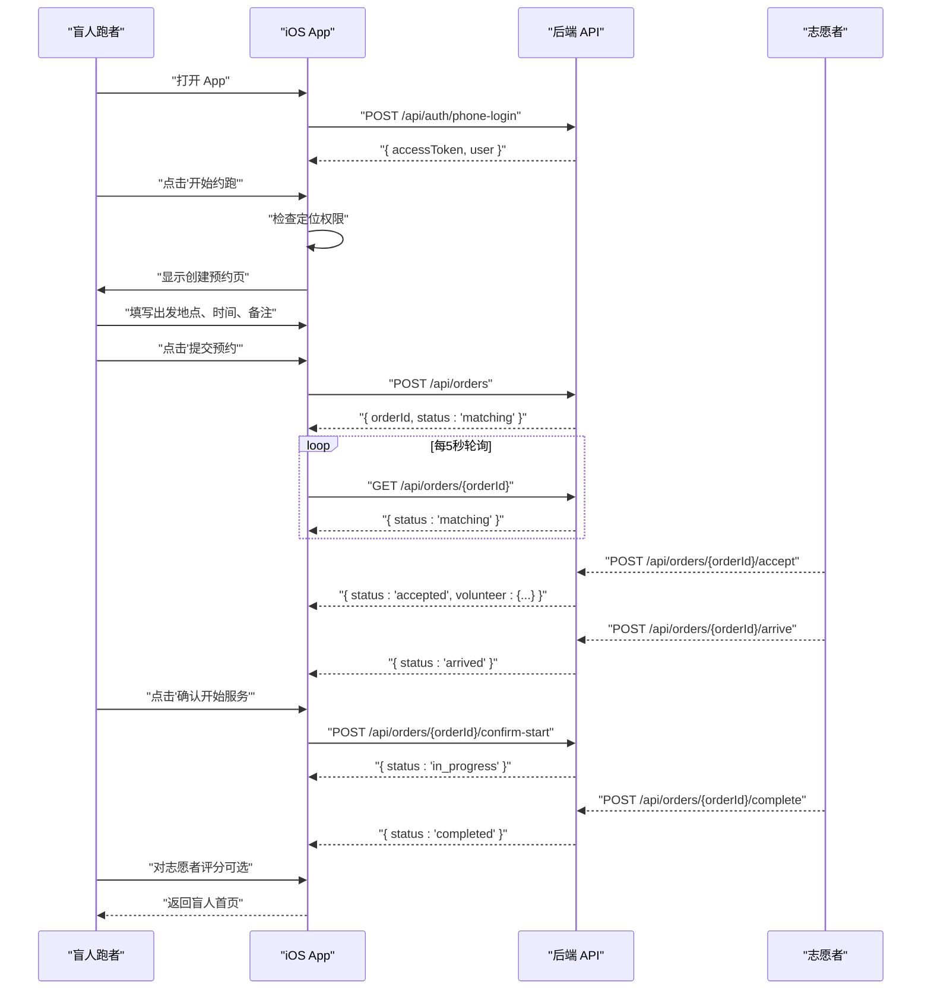

**图示来源**
- [用户流程与状态机.md: 122–178:122-178](file://docs/04-user-flows-and-state-machine.md#L122-L178)
- [API 合同.openapi.yaml: 150–387:150-387](file://docs/07-api-contract.openapi.yaml#L150-L387)

**章节来源**
- [用户流程与状态机.md: 120–178:120-178](file://docs/04-user-flows-and-state-machine.md#L120-L178)
- [API 合同.openapi.yaml: 150–387:150-387](file://docs/07-api-contract.openapi.yaml#L150-L387)

### 紧急求助流程与跨模块同步
- 触发条件：accepted / arrived / in_progress 任一方
- 行为：POST /api/orders/{orderId}/emergency，状态 emergency
- 同步：另一方持续轮询，观察到 emergency 状态并更新 UI 与 TTS
- MVP 设计：不恢复原状态，不自动通知管理员

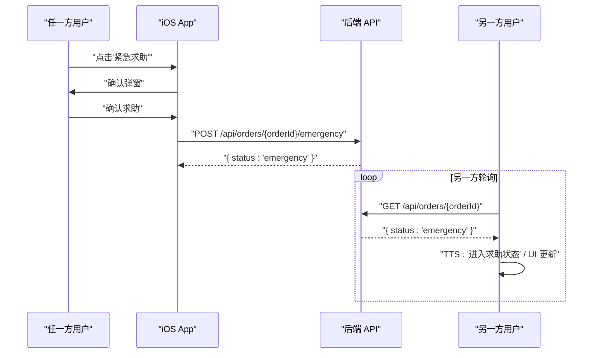

**图示来源**
- [用户流程与状态机.md: 232–257:232-257](file://docs/04-user-flows-and-state-machine.md#L232-L257)
- [无障碍与语音指南.md: 97–107:97-107](file://docs/09-accessibility-and-voice-guidelines.md#L97-L107)

**章节来源**
- [用户流程与状态机.md: 230–257:230-257](file://docs/04-user-flows-and-state-machine.md#L230-L257)
- [无障碍与语音指南.md: 97–107:97-107](file://docs/09-accessibility-and-voice-guidelines.md#L97-L107)

### 缓存策略与本地存储
- 令牌存储：UserDefaults（MVP），生产需迁移到 Keychain
- 环境配置：支持 mock/localBackend/production 三档环境，Debug 构建暴露环境选择
- 本地回退：保留默认测试坐标，便于模拟器演示

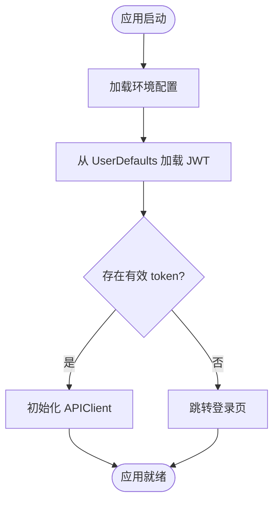

**图示来源**
- [iOS 架构.md: 50–83:50-83](file://docs/08-ios-architecture.md#L50-L83)

**章节来源**
- [iOS 架构.md: 50–83:50-83](file://docs/08-ios-architecture.md#L50-L83)

## 后端实现详解

### RunOrder 实体模型
RunOrder 是订单的核心实体，负责维护订单的所有状态信息和业务逻辑：

- **核心属性**：
  - 用户关联：盲人跑者和志愿者的用户信息
  - 位置信息：起始位置、目的地文本
  - 时间信息：预约时间、各阶段时间戳
  - 配置信息：预计时长、距离、配速偏好、性别偏好
  - 状态管理：当前状态和完整的状态转换方法

- **状态转换方法**：
  - assignVolunteer：分配志愿者（用于接单流程）
  - markAccepted/markArrived/markStarted/markCompleted/markCancelled/markEmergency：各种状态转换
  - 自动记录时间戳：每个状态转换都会记录对应的时间

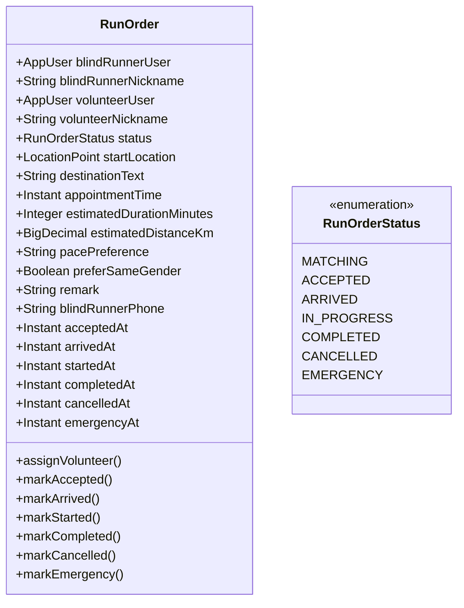

**图示来源**
- [RunOrder.java:20-131](file://backend/src/main/java/com/aidrun/backend/order/RunOrder.java#L20-L131)
- [RunOrderStatus.java:6-35](file://backend/src/main/java/com/aidrun/backend/order/RunOrderStatus.java#L6-L35)

**章节来源**
- [RunOrder.java:20-261](file://backend/src/main/java/com/aidrun/backend/order/RunOrder.java#L20-L261)
- [RunOrderStatus.java:6-35](file://backend/src/main/java/com/aidrun/backend/order/RunOrderStatus.java#L6-L35)

### RunOrderService 业务逻辑
RunOrderService 是订单业务的核心处理器，实现了完整的订单生命周期管理：

- **核心功能**：
  - 订单创建：验证用户资料、位置权限、预约时间
  - 订单查询：我的订单、可用订单、订单详情
  - 状态转换：接单、到达、确认开始、完成、取消、紧急求助
  - 评分管理：订单完成后提交评分
  - 积分奖励：完成订单后给志愿者加分

- **并发控制**：
  - 接单使用数据库级乐观锁：`acceptOrderAtomically` 方法确保原子性
  - 状态转换前进行严格的权限验证和状态检查
  - 使用 `@Transactional` 注解保证事务一致性

- **业务规则**：
  - 最小预约时间：至少30分钟后
  - 取消限制：只允许在特定状态下取消
  - 紧急求助限制：只允许在特定状态下触发
  - 评分限制：只有完成的订单才能评分

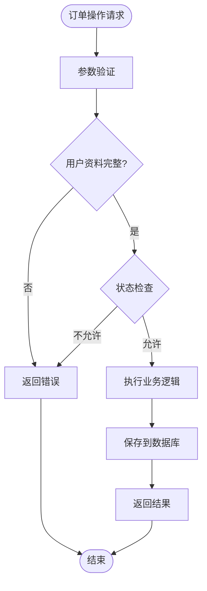

**图示来源**
- [RunOrderService.java:73-126](file://backend/src/main/java/com/aidrun/backend/order/RunOrderService.java#L73-L126)
- [RunOrderService.java:150-182](file://backend/src/main/java/com/aidrun/backend/order/RunOrderService.java#L150-L182)

**章节来源**
- [RunOrderService.java:29-402](file://backend/src/main/java/com/aidrun/backend/order/RunOrderService.java#L29-L402)

### RunOrderController API 控制器
RunOrderController 提供了完整的 RESTful API 接口：

- **主要接口**：
  - POST `/api/orders`：创建订单
  - GET `/api/orders/my`：获取我的订单列表
  - GET `/api/orders/available`：获取可用订单列表
  - GET `/api/orders/{orderId}`：获取订单详情
  - POST `/api/orders/{orderId}/accept`：接单
  - POST `/api/orders/{orderId}/arrive`：到达
  - POST `/api/orders/{orderId}/start`：确认开始
  - POST `/api/orders/{orderId}/complete`：完成
  - POST `/api/orders/{orderId}/cancel`：取消
  - POST `/api/orders/{orderId}/emergency`：紧急求助
  - POST `/api/orders/{orderId}/rating`：评分

- **安全控制**：
  - 所有接口都需要认证
  - 使用 Spring Security 进行权限验证
  - 自动注入当前用户信息

**章节来源**
- [RunOrderController.java:23-140](file://backend/src/main/java/com/aidrun/backend/order/RunOrderController.java#L23-L140)

### 数据传输对象（DTO）系统
后端实现了完整的 DTO 系统来处理数据传输：

- **请求 DTO**：
  - CreateOrderRequest：创建订单请求
  - CancelOrderRequest：取消订单请求
  - CompleteOrderRequest：完成订单请求
  - EmergencyRequest：紧急请求
  - RatingRequest：评分请求

- **响应 DTO**：
  - RunOrderDto：订单详情响应
  - CancellationDto：取消信息响应
  - EmergencyEventDto：紧急事件响应
  - ServiceSummaryDto：服务摘要响应
  - RatingDto：评分响应

- **数据映射**：
  - 所有 DTO 都有静态工厂方法 `from()` 用于实体到 DTO 的转换
  - 支持敏感信息的条件显示（如盲人电话）

**章节来源**
- [RunOrderDto.java:8-69](file://backend/src/main/java/com/aidrun/backend/order/dto/RunOrderDto.java#L8-L69)
- [CreateOrderRequest.java:8-19](file://backend/src/main/java/com/aidrun/backend/order/dto/CreateOrderRequest.java#L8-L19)

### 关联实体与数据模型
订单系统还包含多个关联实体来支持完整的业务功能：

- **Cancellation 取消实体**：
  - 记录取消原因和取消方
  - 支持多种取消原因枚举
  - 记录取消时间

- **EmergencyEvent 紧急事件实体**：
  - 记录紧急事件的触发方和前一状态
  - 支持事件备注
  - 用于紧急状态追踪

- **ServiceSummary 服务摘要实体**：
  - 志愿者提交的服务总结
  - 与订单一对一关联

- **OrderRating 评分实体**：
  - 盲人对志愿者的评分
  - 支持星级和评论
  - 与订单一对一关联

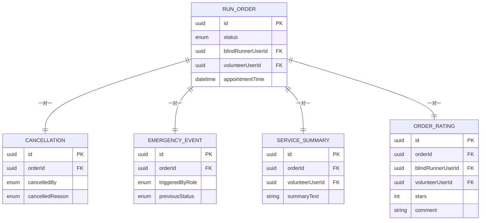

**图示来源**
- [Cancellation.java:13-56](file://backend/src/main/java/com/aidrun/backend/order/Cancellation.java#L13-L56)
- [EmergencyEvent.java:14-58](file://backend/src/main/java/com/aidrun/backend/order/EmergencyEvent.java#L14-L58)
- [ServiceSummary.java:12-47](file://backend/src/main/java/com/aidrun/backend/order/ServiceSummary.java#L12-L47)
- [OrderRating.java:13-65](file://backend/src/main/java/com/aidrun/backend/order/OrderRating.java#L13-L65)

**章节来源**
- [Cancellation.java:13-56](file://backend/src/main/java/com/aidrun/backend/order/Cancellation.java#L13-L56)
- [EmergencyEvent.java:14-58](file://backend/src/main/java/com/aidrun/backend/order/EmergencyEvent.java#L14-L58)
- [ServiceSummary.java:12-47](file://backend/src/main/java/com/aidrun/backend/order/ServiceSummary.java#L12-L47)
- [OrderRating.java:13-65](file://backend/src/main/java/com/aidrun/backend/order/OrderRating.java#L13-L65)

## 依赖关系分析
- Orders 模块依赖：
  - API 层：REST 调用与 DTO 解析
  - ViewModel：状态管理、轮询调度、TTS 触发
  - 语音服务：状态播报与重复播报
  - 地图模块：志愿者导航与距离计算（在志愿者侧）
- 外部依赖：
  - 后端 API：遵循 OpenAPI 合同，返回稳定错误码
  - 系统框架：URLSession、AVSpeechSynthesizer、CoreLocation

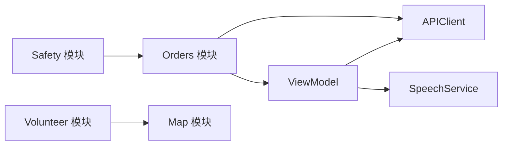

**图示来源**
- [iOS 架构.md: 22–31:22-31](file://docs/08-ios-architecture.md#L22-L31)
- [后台 API 合同.spec.md: 3–33:3-33](file://openspec/changes/add-aidrun-ios-spring-mvp/specs/backend-api-contract/spec.md#L3-L33)

**章节来源**
- [iOS 架构.md: 22–31:22-31](file://docs/08-ios-architecture.md#L22-L31)
- [后台 API 合同.spec.md: 3–33:3-33](file://openspec/changes/add-aidrun-ios-spring-mvp/specs/backend-api-contract/spec.md#L3-L33)

## 性能考虑
- 轮询节流：仅在关键页面启用，避免无谓网络与 CPU 开销
- 状态去抖：轮询期间比较前后状态，仅在变化时更新 UI 与 TTS，降低语音噪音
- DTO 尺寸：避免在轮询响应中传输冗余字段，保持响应体精简
- 网络重试：MVP 不引入复杂重试队列，保持简单可靠
- 数据库优化：使用乐观锁和状态检查减少数据库竞争

## 故障排查指南
- 常见错误码与处理建议：
  - ORDER_ALREADY_ACCEPTED：提示"订单已被其他志愿者接单"，引导重新选择订单或稍后再试
  - INVALID_ORDER_STATUS：提示"当前订单状态不允许该操作"，检查当前状态与可用动作
  - ACTIVE_ORDER_ROLE_SWITCH_BLOCKED：提示"当前存在进行中的订单，暂时不能切换身份"，引导先结束或取消订单
  - ORDER_NOT_FOUND：提示"订单不存在"，检查订单 ID 或刷新页面
  - PROFILE_INCOMPLETE：提示"请先完善资料"，引导前往个人资料页面
  - LOCATION_PERMISSION_REQUIRED：提示"需要提供位置信息"，检查定位权限
- 轮询问题：
  - 无状态变化：检查页面是否仍在关键状态或是否已进入终态
  - 频繁失败：检查网络连通性与环境配置（localBackend 地址）
- 语音播报：
  - 重复播报：确认是否已记忆上次播报状态，避免轮询期间重复播报
  - 无播报：检查 TTS 权限与设备音量

**章节来源**
- [API 合同.openapi.yaml: 469–542:469-542](file://docs/07-api-contract.openapi.yaml#L469-L542)
- [无障碍与语音指南.md: 30–35:30-35](file://docs/09-accessibility-and-voice-guidelines.md#L30-L35)

## 结论
Orders 订单模块以严格的有限状态机为核心，结合后端乐观锁与状态校验，确保生命周期动作的正确性与一致性。通过每 5 秒轮询与 TTS 事件驱动，实现盲人端的低负担实时体验。MVP 阶段采用 UserDefaults 存储与简单网络层，满足演示需求；后续可按架构文档逐步演进到更健壮的缓存与离线策略。

**更新** 后端实现了完整的订单管理系统，包括实体模型、业务逻辑、控制器和 DTO 系统，提供了可靠的订单生命周期管理和状态转换控制。

## 附录
- 任务清单（与 Orders 相关的关键项）
  - iOS Orders 模块：实现订单 DTO、状态机辅助、轮询与事件处理
  - iOS 盲人端：实现订单状态页、5 秒轮询、取消与求助、确认开始与完成展示
  - iOS 志愿者端：实现订单详情页动作（接单、到达、完成、取消、求助）
  - 后端订单系统：实现完整的订单生命周期管理、状态转换和数据模型
- 相关规范
  - 订单状态生命周期约束
  - 盲人跑者预订与预约时间守恒
  - 后台 API 合同与错误码
  - 数据库实体关系与约束

**章节来源**
- [任务清单.md: 35–46:35-46](file://openspec/changes/add-aidrun-ios-spring-mvp/tasks.md#L35-L46)
- [订单状态生命周期.spec.md: 1–37:1-37](file://openspec/changes/add-aidrun-ios-spring-mvp/specs/order-status-lifecycle/spec.md#L1-L37)
- [盲人跑者预订.spec.md: 1–200:1-200](file://openspec/changes/add-aidrun-ios-spring-mvp/specs/blind-runner-booking/spec.md#L1-L200)
- [后台 API 合同.spec.md: 1–34:1-34](file://openspec/changes/add-aidrun-ios-spring-mvp/specs/backend-api-contract/spec.md#L1-L34)