# Profile 个人资料模块

<cite>
**本文档引用的文件**
- [07-api-contract.openapi.yaml](file://docs/07-api-contract.openapi.yaml)
- [08-ios-architecture.md](file://docs/08-ios-architecture.md)
- [09-accessibility-and-voice-guidelines.md](file://docs/09-accessibility-and-voice-guidelines.md)
- [04-user-flows-and-state-machine.md](file://docs/04-user-flows-and-state-machine.md)
- [03-user-stories.md](file://docs/03-user-stories.md)
- [02-mvp-scope.md](file://docs/02-mvp-scope.md)
- [design.md](file://openspec/changes/add-aidrun-ios-spring-mvp/design.md)
- [tasks.md](file://openspec/changes/add-aidrun-ios-spring-mvp/tasks.md)
- [ContentView.swift](file://blindRun/ContentView.swift)
- [blindRunApp.swift](file://blindRun/blindRunApp.swift)
- [ProfileModule.swift](file://blindRun/Profile/ProfileModule.swift)
- [AppState.swift](file://blindRun/Core/AppState.swift)
- [BlindRunnerSettingsView.swift](file://blindRun/BlindRunner/BlindRunnerSettingsView.swift)
- [VolunteerModule.swift](file://blindRun/Volunteer/VolunteerModule.swift)
</cite>

## 更新摘要
**变更内容**
- 新增登出确认对话框功能，提升用户体验和安全性
- 扩展了Profile模块的安全性设计，防止意外登出操作
- 增强了用户界面的交互安全保障机制

## 目录
1. [简介](#简介)
2. [项目结构](#项目结构)
3. [核心组件](#核心组件)
4. [架构概览](#架构概览)
5. [详细组件分析](#详细组件分析)
6. [依赖关系分析](#依赖关系分析)
7. [性能考虑](#性能考虑)
8. [故障排除指南](#故障排除指南)
9. [结论](#结论)
10. [附录](#附录)

## 简介

Profile 个人资料模块是 AidRun iOS 应用的核心功能模块之一，负责管理用户的基本信息和个人资料。该模块支持两种用户角色：盲人跑者（Blind Runner）和志愿者（Volunteer），为每个角色提供定制化的资料表单和验证规则。

本模块遵循 MVVM 架构模式，采用 SwiftUI 作为用户界面框架，结合 URLSession 进行网络通信。模块设计充分考虑了无障碍访问需求，特别针对视障用户的语音交互进行了优化。

**更新** 新增登出确认对话框功能，通过二次确认机制防止意外登出操作，提升用户操作的安全性和体验质量。

## 项目结构

根据架构文档，Profile 模块属于独立的功能模块组，与其他核心模块并列：

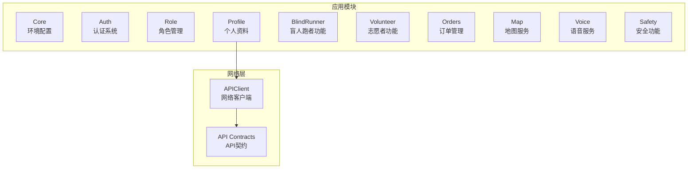

**图表来源**
- [08-ios-architecture.md:18-31](file://docs/08-ios-architecture.md#L18-L31)
- [08-ios-architecture.md:68-82](file://docs/08-ios-architecture.md#L68-L82)

**章节来源**
- [08-ios-architecture.md:18-31](file://docs/08-ios-architecture.md#L18-L31)
- [08-ios-architecture.md:68-82](file://docs/08-ios-architecture.md#L68-L82)

## 核心组件

### 角色驱动的资料结构

Profile 模块基于用户角色提供不同的资料字段和验证规则：

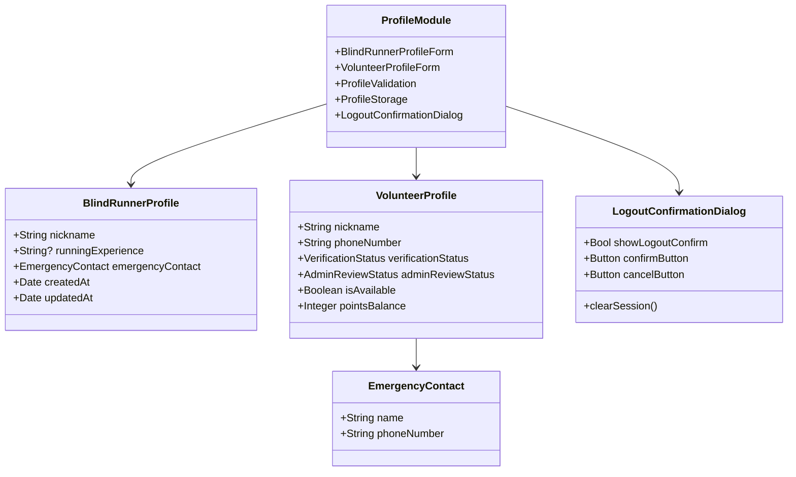

**图表来源**
- [07-api-contract.openapi.yaml:689-761](file://docs/07-api-contract.openapi.yaml#L689-L761)

### API 端点设计

模块提供专门的资料管理端点：

| 端点 | 方法 | 描述 | 鉴权要求 |
|------|------|------|----------|
| `/api/profiles/blind-runner` | PUT | 盲人资料创建/更新 | 是 |
| `/api/profiles/volunteer` | PUT | 志愿者资料创建/更新 | 是 |

**章节来源**
- [07-api-contract.openapi.yaml:82-116](file://docs/07-api-contract.openapi.yaml#L82-L116)

## 架构概览

Profile 模块采用 MVVM 架构模式，实现数据绑定和业务逻辑分离：

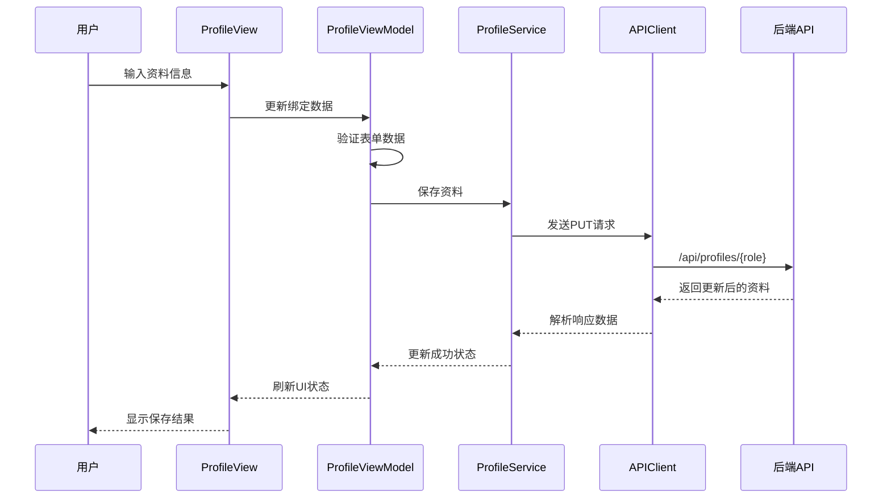

**图表来源**
- [08-ios-architecture.md:33-40](file://docs/08-ios-architecture.md#L33-L40)
- [07-api-contract.openapi.yaml:82-116](file://docs/07-api-contract.openapi.yaml#L82-L116)

### 数据流架构

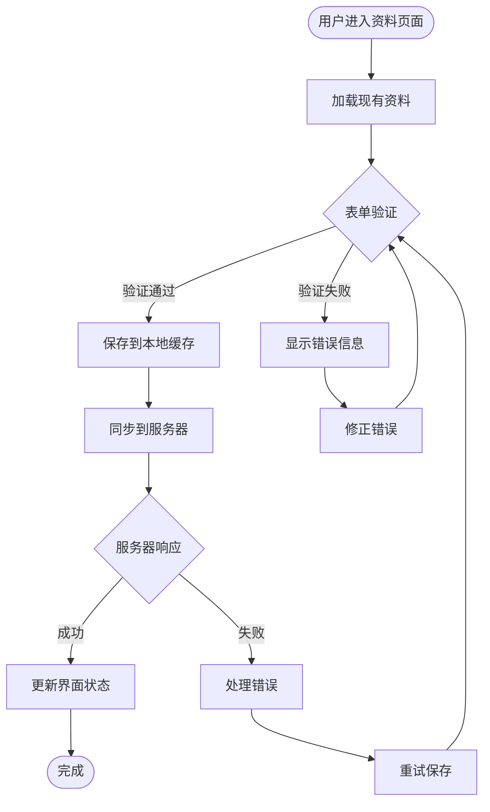

**图表来源**
- [08-ios-architecture.md:78-82](file://docs/08-ios-architecture.md#L78-L82)
- [07-api-contract.openapi.yaml:82-116](file://docs/07-api-contract.openapi.yaml#L82-L116)

## 详细组件分析

### 盲人跑者资料表单

盲人跑者资料表单包含以下核心字段：

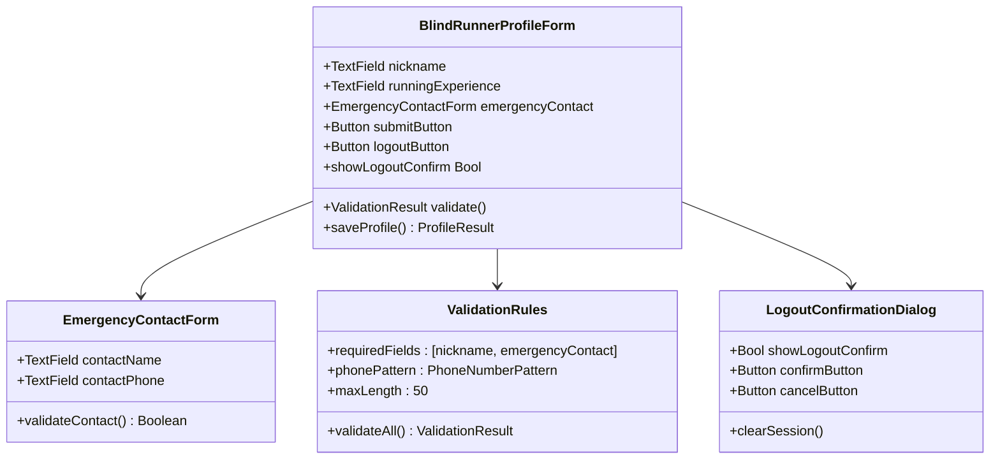

**图表来源**
- [07-api-contract.openapi.yaml:689-722](file://docs/07-api-contract.openapi.yaml#L689-L722)

#### 字段规范

| 字段 | 类型 | 必填 | 长度限制 | 验证规则 |
|------|------|------|----------|----------|
| nickname | String | 是 | 最大50字符 | 非空，去除首尾空格 |
| runningExperience | String | 否 | 最大200字符 | 可选文本内容 |
| emergencyContact.name | String | 是 | 最大50字符 | 非空，中文字符 |
| emergencyContact.phoneNumber | String | 是 | 11位数字 | 中国手机号格式 |

**章节来源**
- [07-api-contract.openapi.yaml:689-722](file://docs/07-api-contract.openapi.yaml#L689-L722)

### 志愿者资料表单

志愿者资料表单相对简化，主要包含基础信息：

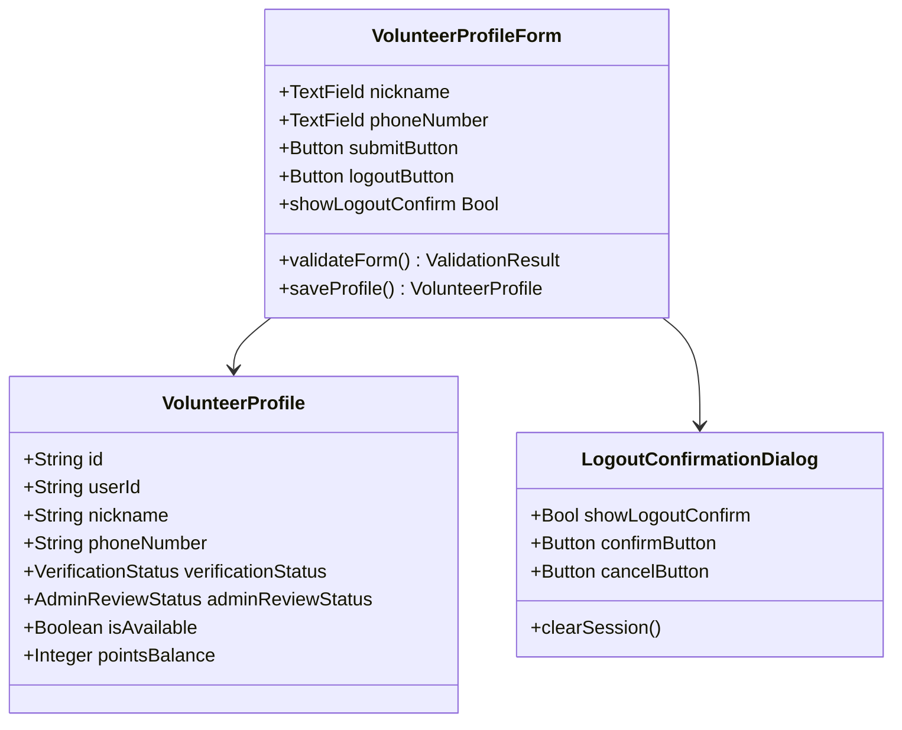

**图表来源**
- [07-api-contract.openapi.yaml:724-761](file://docs/07-api-contract.openapi.yaml#L724-L761)

#### 字段规范

| 字段 | 类型 | 必填 | 长度限制 | 验证规则 |
|------|------|------|----------|----------|
| nickname | String | 是 | 最大50字符 | 非空，去除首尾空格 |
| phoneNumber | String | 是 | 11位数字 | 中国手机号格式 |

**章节来源**
- [07-api-contract.openapi.yaml:724-761](file://docs/07-api-contract.openapi.yaml#L724-L761)

### 登出确认对话框功能

**新增** Profile 模块现在包含登出确认对话框功能，通过二次确认机制防止意外登出操作：

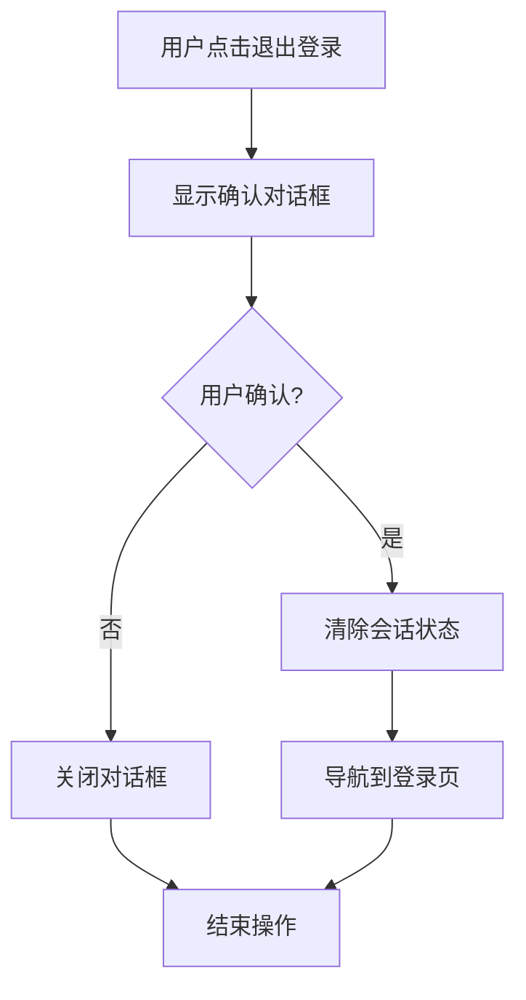

**图表来源**
- [ProfileModule.swift:207-214](file://blindRun/Profile/ProfileModule.swift#L207-L214)
- [BlindRunnerSettingsView.swift:85-92](file://blindRun/BlindRunner/BlindRunnerSettingsView.swift#L85-L92)

#### 对话框特性

| 特性 | 描述 | 实现方式 |
|------|------|----------|
| 标题 | "确认退出" | 使用 `.alert()` SwiftUI modifier |
| 确认按钮 | "确认退出"，破坏性样式 | `role: .destructive` |
| 取消按钮 | "取消"，取消样式 | `role: .cancel` |
| 提示信息 | "确认后将清除当前登录状态，返回登录页" | 自定义消息文本 |
| 触发条件 | 用户点击登出按钮 | `showLogoutConfirm = true` |
| 清除操作 | 调用 `appState.clearSession()` | 清除所有会话数据 |

**章节来源**
- [ProfileModule.swift:207-214](file://blindRun/Profile/ProfileModule.swift#L207-L214)
- [BlindRunnerSettingsView.swift:85-92](file://blindRun/BlindRunner/BlindRunnerSettingsView.swift#L85-L92)
- [VolunteerModule.swift:197-204](file://blindRun/Volunteer/VolunteerModule.swift#L197-L204)

### 表单验证机制

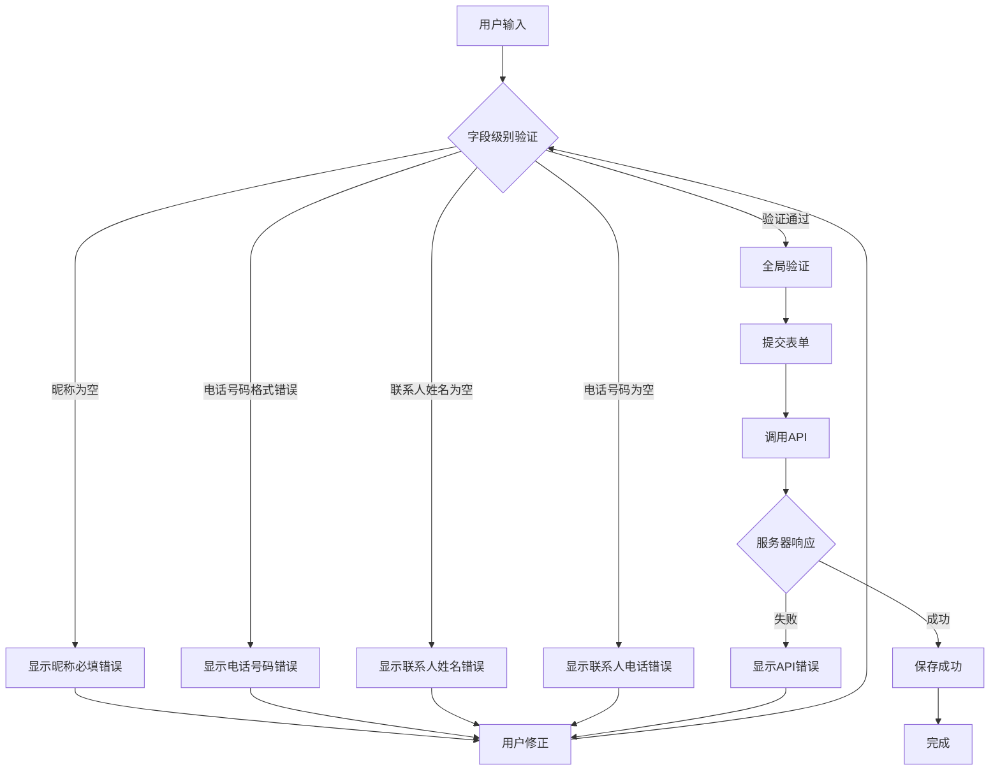

**图表来源**
- [07-api-contract.openapi.yaml:82-116](file://docs/07-api-contract.openapi.yaml#L82-L116)

### 数据存储策略

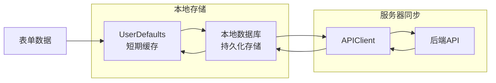

**图表来源**
- [08-ios-architecture.md:78-82](file://docs/08-ios-architecture.md#L78-L82)

#### 存储层次结构

1. **UserDefaults**：临时缓存，用于应用运行期间的数据保存
2. **本地数据库**：持久化存储，确保数据在应用重启后仍然可用
3. **服务器同步**：最终一致性的数据源，保证多设备间的数据同步

**章节来源**
- [08-ios-architecture.md:78-82](file://docs/08-ios-architecture.md#L78-L82)

### 资料预览和确认流程

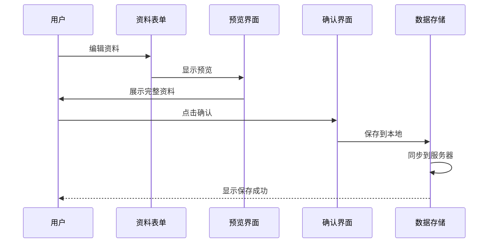

**图表来源**
- [04-user-flows-and-state-machine.md:11-11](file://docs/04-user-flows-and-state-machine.md#L11-L11)

## 依赖关系分析

### 组件耦合度

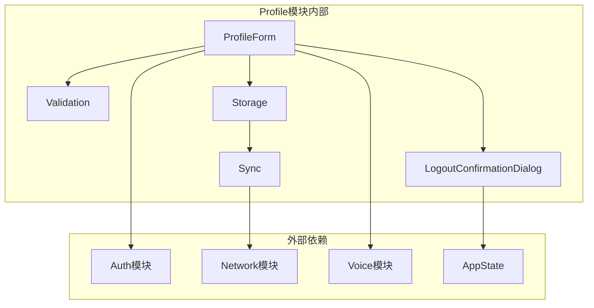

**图表来源**
- [08-ios-architecture.md:33-40](file://docs/08-ios-architecture.md#L33-L40)

### 外部依赖关系

| 依赖模块 | 用途 | 版本要求 |
|----------|------|----------|
| Auth | 用户认证和会话管理 | iOS 16+ |
| Network | 网络请求和API调用 | URLSession |
| Voice | 无障碍语音服务 | AVSpeechSynthesizer |
| Map | 地理位置服务 | 高德地图SDK |
| AppState | 全局状态管理和会话控制 | 全局应用状态 |

**章节来源**
- [08-ios-architecture.md:5-16](file://docs/08-ios-architecture.md#L5-L16)

## 性能考虑

### 实时保存优化

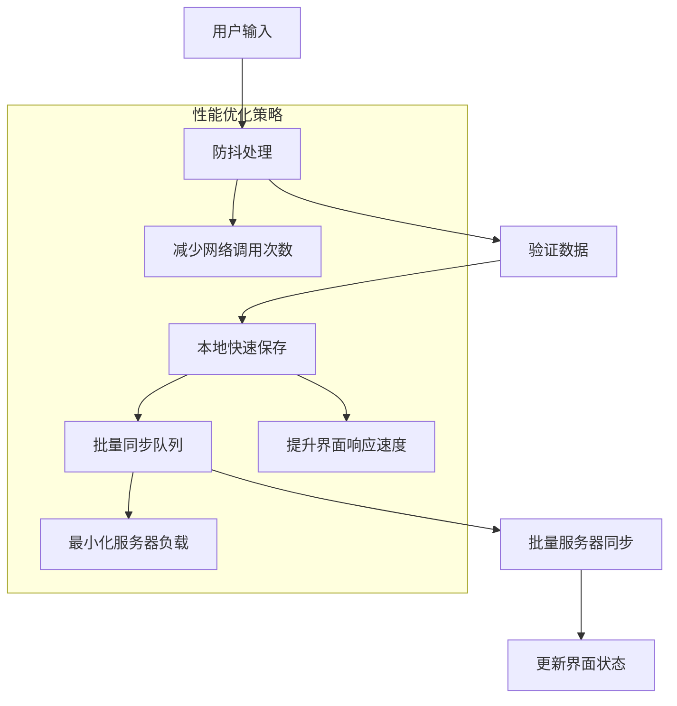

### 缓存策略

1. **智能缓存**：只缓存有效的用户输入，避免缓存错误数据
2. **增量同步**：只同步变更的数据，减少网络传输量
3. **离线优先**：在网络不佳时提供完整的离线功能

### 登出确认对话框性能优化

**新增** 登出确认对话框采用轻量级实现，不会影响主界面性能：

- 使用 SwiftUI 的 `.alert()` modifier，系统自动管理内存
- 对话框状态仅在用户触发时存在，不占用持续资源
- 清除会话操作在确认后执行，避免不必要的延迟

## 故障排除指南

### 常见问题及解决方案

| 问题类型 | 症状 | 解决方案 |
|----------|------|----------|
| 表单验证失败 | 提交按钮灰色，显示错误信息 | 检查必填字段是否完整，符合格式要求 |
| 网络同步失败 | 保存后立即显示错误 | 检查网络连接，重试同步，查看错误日志 |
| 数据不一致 | 本地和服务器显示不同 | 清除缓存，重新登录，检查同步状态 |
| 无障碍功能异常 | 语音播报不正常 | 检查系统语音设置，重新授权相关权限 |
| 登出确认对话框无响应 | 点击按钮无反应 | 检查状态绑定，确认 `showLogoutConfirm` 是否正确更新 |

### 错误处理流程

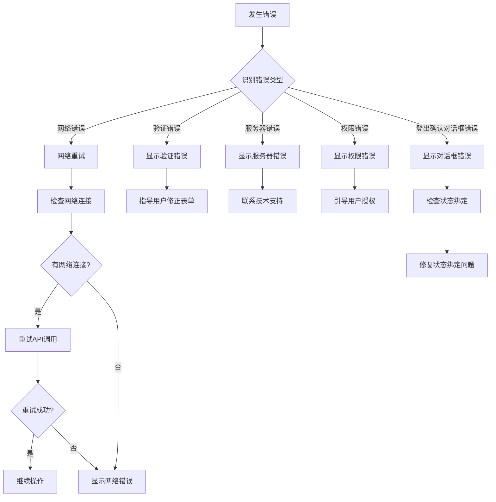

**章节来源**
- [07-api-contract.openapi.yaml:489-541](file://docs/07-api-contract.openapi.yaml#L489-L541)

## 结论

Profile 个人资料模块通过精心设计的表单架构和严格的验证机制，为 AidRun 应用提供了可靠的用户资料管理功能。模块支持双角色差异化设计，既满足了功能需求，又保持了良好的用户体验。

**更新** 新增的登出确认对话框功能显著提升了应用的安全性和用户体验。通过二次确认机制，有效防止了意外登出操作，同时保持了简洁直观的操作流程。

关键优势包括：
- **角色适配**：为盲人跑者和志愿者提供定制化的资料表单
- **数据安全**：采用多层验证和错误处理机制
- **无障碍优化**：深度集成语音服务和无障碍功能
- **安全性增强**：新增登出确认对话框，防止意外操作
- **性能优化**：智能缓存和批量同步策略
- **扩展性强**：模块化设计便于后续功能扩展

## 附录

### API 错误码参考

| 错误码 | 描述 | 处理建议 |
|--------|------|----------|
| PROFILE_INCOMPLETE | 资料不完整 | 完善必填字段后再提交 |
| INVALID_VERIFICATION_CODE | 验证码错误 | 检查验证码是否正确 |
| UNAUTHORIZED | 未登录或令牌无效 | 重新登录获取有效令牌 |

### 开发任务清单

- [x] 实现盲人跑者资料表单
- [x] 实现志愿者资料表单  
- [x] 实现表单验证逻辑
- [x] 实现本地数据缓存
- [x] 实现服务器同步机制
- [x] 实现无障碍语音支持
- [x] 实现错误处理和用户提示
- [x] 实现登出确认对话框功能

**章节来源**
- [tasks.md:37-46](file://openspec/changes/add-aidrun-ios-spring-mvp/tasks.md#L37-L46)

### 登出确认对话框实现细节

**新增** 登出确认对话框的具体实现：

```swift
.alert("确认退出", isPresented: $showLogoutConfirm) {
    Button("确认退出", role: .destructive) {
        appState.clearSession()
    }
    Button("取消", role: .cancel) {}
} message: {
    Text("确认后将清除当前登录状态，返回登录页。")
}
```

该实现位于多个模块中：
- **Profile 模块**：在资料编辑页面提供登出选项
- **志愿者模块**：在志愿者认证页面提供登出选项  
- **盲人跑者设置**：在设置页面提供登出选项

**章节来源**
- [ProfileModule.swift:207-214](file://blindRun/Profile/ProfileModule.swift#L207-L214)
- [VolunteerModule.swift:197-204](file://blindRun/Volunteer/VolunteerModule.swift#L197-L204)
- [BlindRunnerSettingsView.swift:85-92](file://blindRun/BlindRunner/BlindRunnerSettingsView.swift#L85-L92)