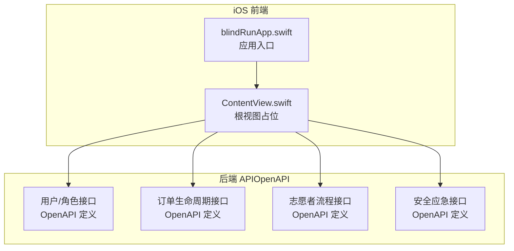
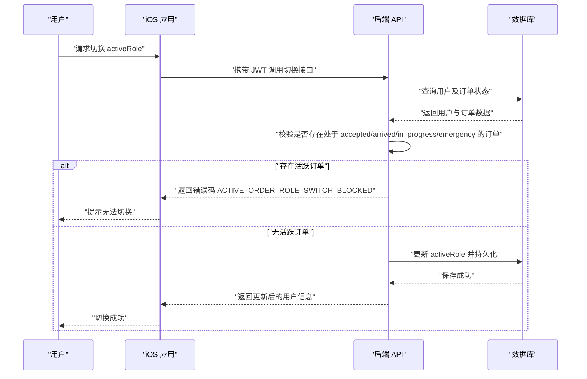
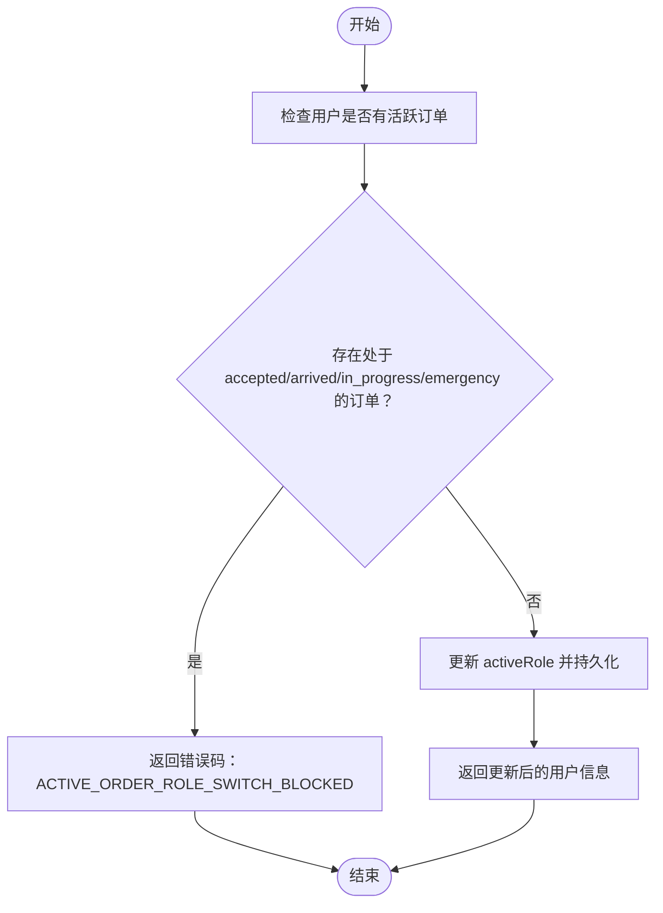
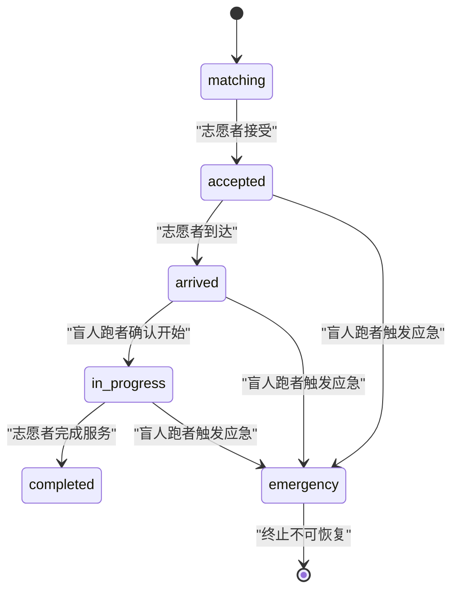
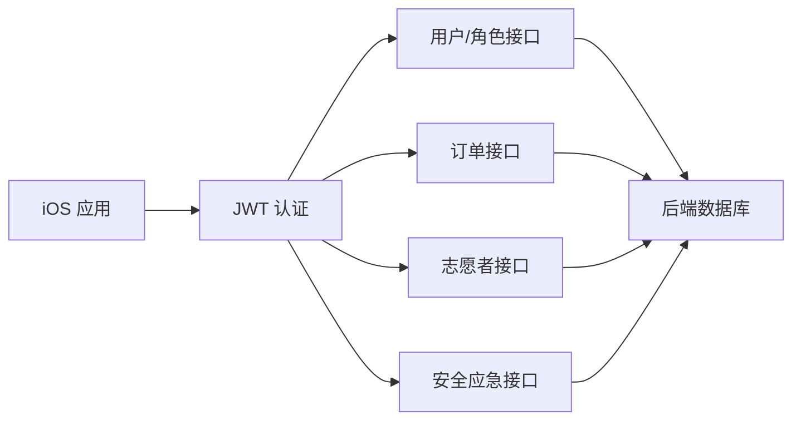

# Role 角色模块

<cite>
**本文档引用的文件**
- [role-switching/spec.md](file://openspec/changes/add-aidrun-ios-spring-mvp/specs/role-switching/spec.md)
- [backend-api-contract/spec.md](file://openspec/changes/add-aidrun-ios-spring-mvp/specs/backend-api-contract/spec.md)
- [order-status-lifecycle/spec.md](file://openspec/changes/add-aidrun-ios-spring-mvp/specs/order-status-lifecycle/spec.md)
- [blind-runner-booking/spec.md](file://openspec/changes/add-aidrun-ios-spring-mvp/specs/blind-runner-booking/spec.md)
- [volunteer-order-flow/spec.md](file://openspec/changes/add-aidrun-ios-spring-mvp/specs/volunteer-order-flow/spec.md)
- [volunteer-points/spec.md](file://openspec/changes/add-aidrun-ios-spring-mvp/specs/volunteer-points/spec.md)
- [safety-basic-emergency/spec.md](file://openspec/changes/add-aidrun-ios-spring-mvp/specs/safety-basic-emergency/spec.md)
- [auth-phone-login/spec.md](file://openspec/changes/add-aidrun-ios-spring-mvp/specs/auth-phone-login/spec.md)
- [ContentView.swift](file://blindRun/ContentView.swift)
- [blindRunApp.swift](file://blindRun/blindRunApp.swift)
</cite>

## 目录
1. [简介](#简介)
2. [项目结构](#项目结构)
3. [核心组件](#核心组件)
4. [架构总览](#架构总览)
5. [详细组件分析](#详细组件分析)
6. [依赖关系分析](#依赖关系分析)
7. [性能考量](#性能考量)
8. [故障排查指南](#故障排查指南)
9. [结论](#结论)
10. [附录](#附录)

## 简介
本文件面向 Role 角色模块的技术文档，聚焦于“盲人跑者”和“志愿者”两类角色的定义、权限差异、角色切换机制（含条件检查、活跃订单拦截）、单一 JWT 在多角色间的共享策略（activeRole 字段）、角色状态持久化与同步策略、UI 设计考虑（角色选择与切换确认流程），以及在各业务模块中基于角色的动态权限控制。所有需求均来源于项目内规范文件，确保实现与产品目标一致。

## 项目结构
iOS 前端采用 SwiftUI 应用骨架，当前内容视图与应用入口位于 ContentView.swift 和 blindRunApp.swift；角色相关的行为与约束主要由后端 API 合约与业务规范定义，并通过 OpenAPI 文档暴露给前端调用。

**图表来源**
- [blindRunApp.swift:10-17](file://blindRun/blindRunApp.swift#L10-L17)
- [ContentView.swift:10-20](file://blindRun/ContentView.swift#L10-L20)

**章节来源**
- [blindRunApp.swift:1-18](file://blindRun/blindRunApp.swift#L1-L18)
- [ContentView.swift:1-25](file://blindRun/ContentView.swift#L1-L25)

## 核心组件
- 角色模型与切换
  - 单一账户可同时持有“盲人跑者”和“志愿者”角色，通过 activeRole 切换当前角色，不产生新的 JWT。
  - 切换条件：无处于特定状态的活跃订单时允许切换。
  - 活跃订单拦截：当存在处于 accepted、arrived、in_progress 或 emergency 状态的订单时，禁止切换并返回错误码。
- JWT 与认证
  - 所有受保护的用户、资料、志愿者、订单相关 API 均需携带 Bearer JWT。
  - 首次登录自动创建用户并返回 JWT；后续登录返回现有用户的新 JWT。
- 订单生命周期与角色权限
  - 订单状态流转严格限定，不同角色在不同状态下具备的操作权限不同。
  - 志愿者仅能接受处于 matching 状态的订单；完成服务需在 in_progress 状态下进行。
- 安全应急
  - 应急状态仅在 accepted、arrived、in_progress 三态之间触发，且不可恢复。
- 积分与服务记录
  - 完成服务后志愿者获得积分，支持查看服务记录。

**章节来源**
- [role-switching/spec.md:3-25](file://openspec/changes/add-aidrun-ios-spring-mvp/specs/role-switching/spec.md#L3-L25)
- [auth-phone-login/spec.md:3-29](file://openspec/changes/add-aidrun-ios-spring-mvp/specs/auth-phone-login/spec.md#L3-L29)
- [order-status-lifecycle/spec.md:3-66](file://openspec/changes/add-aidrun-ios-spring-mvp/specs/order-status-lifecycle/spec.md#L3-L66)
- [volunteer-order-flow/spec.md:3-38](file://openspec/changes/add-aidrun-ios-spring-mvp/specs/volunteer-order-flow/spec.md#L3-L38)
- [volunteer-points/spec.md:3-26](file://openspec/changes/add-aidrun-ios-spring-mvp/specs/volunteer-points/spec.md#L3-L26)
- [safety-basic-emergency/spec.md:11-42](file://openspec/changes/add-aidrun-ios-spring-mvp/specs/safety-basic-emergency/spec.md#L11-L42)

## 架构总览
角色系统围绕“单一 JWT + activeRole”的设计展开：前端在本地维护当前 activeRole，后续所有 API 调用均携带同一 JWT，后端据此判定当前角色并执行相应权限校验。

**图表来源**
- [role-switching/spec.md:7-17](file://openspec/changes/add-aidrun-ios-spring-mvp/specs/role-switching/spec.md#L7-L17)
- [backend-api-contract/spec.md:19-25](file://openspec/changes/add-aidrun-ios-spring-mvp/specs/backend-api-contract/spec.md#L19-L25)

## 详细组件分析

### 角色切换机制
- 切换前提
  - 用户必须已认证（持有 JWT）。
  - 当前不存在处于 accepted、arrived、in_progress 或 emergency 状态的订单。
- 切换流程
  - 前端调用切换接口，携带 JWT。
  - 后端验证订单状态，若满足条件则更新 activeRole 并返回最新用户信息；否则返回错误码并保持原 activeRole。
- 错误处理
  - 返回统一错误码 ACTIVE_ORDER_ROLE_SWITCH_BLOCKED，前端据此提示用户。

**图表来源**
- [role-switching/spec.md:11-17](file://openspec/changes/add-aidrun-ios-spring-mvp/specs/role-switching/spec.md#L11-L17)
- [backend-api-contract/spec.md:19-25](file://openspec/changes/add-aidrun-ios-spring-mvp/specs/backend-api-contract/spec.md#L19-L25)

**章节来源**
- [role-switching/spec.md:3-25](file://openspec/changes/add-aidrun-ios-spring-mvp/specs/role-switching/spec.md#L3-L25)

### JWT 共享与 activeRole 字段
- 单一 JWT：切换角色不生成新令牌，保持会话连续性。
- activeRole：后端依据该字段决定当前操作的权限范围，前端负责在本地维护该值并在后续请求中透传。
- 认证要求：所有受保护 API 均需携带 Bearer JWT。

**章节来源**
- [role-switching/spec.md:5](file://openspec/changes/add-aidrun-ios-spring-mvp/specs/role-switching/spec.md#L5)
- [auth-phone-login/spec.md:23-29](file://openspec/changes/add-aidrun-ios-spring-mvp/specs/auth-phone-login/spec.md#L23-L29)

### 订单生命周期与角色权限
- 状态机
  - 正常流程：matching → accepted → arrived → in_progress → completed。
  - 紧急状态：emergency 为终止态，不可恢复。
- 角色权限
  - 志愿者仅能接受处于 matching 的订单；完成服务需在 in_progress 状态下进行。
  - 盲人跑者可在等待与服务过程中轮询订单状态，取消权限受限于订单所处阶段。
- 轮询策略
  - 盲人跑者在等待与活动页面每 5 秒轮询一次订单详情。

**图表来源**
- [order-status-lifecycle/spec.md:3-29](file://openspec/changes/add-aidrun-ios-spring-mvp/specs/order-status-lifecycle/spec.md#L3-L29)
- [volunteer-order-flow/spec.md:11-37](file://openspec/changes/add-aidrun-ios-spring-mvp/specs/volunteer-order-flow/spec.md#L11-L37)

**章节来源**
- [order-status-lifecycle/spec.md:3-66](file://openspec/changes/add-aidrun-ios-spring-mvp/specs/order-status-lifecycle/spec.md#L3-L66)
- [volunteer-order-flow/spec.md:3-38](file://openspec/changes/add-aidrun-ios-spring-mvp/specs/volunteer-order-flow/spec.md#L3-L38)

### 安全应急与 UI 提示
- 触发条件：仅在 accepted、arrived、in_progress 三态之间允许进入 emergency。
- UI 行为：触发前需弹窗确认，明确告知进入应急状态后本次服务将标记为异常并记录当前订单状态。
- 数据存储：记录应急事件与联系人信息，但不触发真实通知。

**章节来源**
- [safety-basic-emergency/spec.md:11-42](file://openspec/changes/add-aidrun-ios-spring-mvp/specs/safety-basic-emergency/spec.md#L11-L42)

### 志愿者积分与服务记录
- 完成服务后获得固定积分，支持查看服务记录（时间、盲人昵称、起点、状态、积分）。
- MVP 阶段积分商店为展示用途，不支持兑换。

**章节来源**
- [volunteer-points/spec.md:3-26](file://openspec/changes/add-aidrun-ios-spring-mvp/specs/volunteer-points/spec.md#L3-L26)

### 盲人跑者预约与 UI 限制
- 预约前置条件：需完善个人资料（昵称、紧急联系人姓名与电话）。
- 时间限制：预约时间至少距离当前时间 30 分钟以后。
- 可选路线字段：仅作为元数据，不会触发导航或自动路径规划。

**章节来源**
- [blind-runner-booking/spec.md:3-34](file://openspec/changes/add-aidrun-ios-spring-mvp/specs/blind-runner-booking/spec.md#L3-L34)

## 依赖关系分析
- 前端依赖后端通过 OpenAPI 暴露的用户、订单、志愿者、安全等接口。
- 认证层依赖 JWT Bearer 认证，所有受保护接口均需携带有效令牌。
- 角色切换依赖后端对用户活跃订单状态的校验，防止在关键阶段切换角色。

**图表来源**
- [backend-api-contract/spec.md:3-34](file://openspec/changes/add-aidrun-ios-spring-mvp/specs/backend-api-contract/spec.md#L3-L34)
- [auth-phone-login/spec.md:23-29](file://openspec/changes/add-aidrun-ios-spring-mvp/specs/auth-phone-login/spec.md#L23-L29)

**章节来源**
- [backend-api-contract/spec.md:19-34](file://openspec/changes/add-aidrun-ios-spring-mvp/specs/backend-api-contract/spec.md#L19-L34)
- [auth-phone-login/spec.md:3-29](file://openspec/changes/add-aidrun-ios-spring-mvp/specs/auth-phone-login/spec.md#L3-L29)

## 性能考量
- 订单轮询：盲人跑者在等待与活动页面每 5 秒轮询一次订单详情，建议在页面不可见或后台时降低轮询频率或暂停轮询，避免不必要的网络开销。
- JWT 复用：单一 JWT 减少重复登录与令牌刷新成本，前端应避免频繁重建会话。
- 状态一致性：前端本地 activeRole 与后端状态需保持最终一致，建议在每次关键网络请求后进行状态校验与同步。

## 故障排查指南
- 切换失败
  - 现象：点击切换角色后立即失败。
  - 排查：确认是否存在处于 accepted、arrived、in_progress 或 emergency 的订单；若存在，需先处理订单或等待其结束。
  - 参考：错误码 ACTIVE_ORDER_ROLE_SWITCH_BLOCKED。
- 认证失败
  - 现象：访问受保护接口返回未授权。
  - 排查：确认请求头中携带有效的 Bearer JWT；如已过期，需重新登录获取新令牌。
- 订单状态异常
  - 现象：志愿者无法接受订单或无法完成服务。
  - 排查：核对订单当前状态是否符合匹配/接受/到达/进行中/完成的流程；若处于 emergency，需等待其结束或按规则处理。
- 应急触发
  - 现象：触发应急后无法继续常规流程。
  - 排查：确认当前状态是否为 accepted、arrived 或 in_progress；emergency 为终止态，不可恢复。

**章节来源**
- [role-switching/spec.md:11-17](file://openspec/changes/add-aidrun-ios-spring-mvp/specs/role-switching/spec.md#L11-L17)
- [backend-api-contract/spec.md:19-25](file://openspec/changes/add-aidrun-ios-spring-mvp/specs/backend-api-contract/spec.md#L19-L25)
- [order-status-lifecycle/spec.md:19-37](file://openspec/changes/add-aidrun-ios-spring-mvp/specs/order-status-lifecycle/spec.md#L19-L37)
- [safety-basic-emergency/spec.md:27-33](file://openspec/changes/add-aidrun-ios-spring-mvp/specs/safety-basic-emergency/spec.md#L27-L33)

## 结论
本角色模块以“单一 JWT + activeRole”为核心，实现了同一账户在“盲人跑者”和“志愿者”之间的无缝切换，同时通过后端对活跃订单的严格拦截，保证了业务流程的正确性与安全性。前端应遵循规范，在 UI 层明确提示切换条件与应急流程，并在关键节点进行状态校验与同步，确保用户体验与系统一致性。

## 附录
- 使用示例
  - 新用户首次登录：提交固定验证码完成登录，系统创建用户并返回 JWT；随后进入角色选择界面，设置 activeRole。
  - 已有用户登录：直接返回现有用户的新 JWT；若尚未设置 activeRole，则引导进入角色选择。
  - 切换角色：在无活跃订单的前提下，选择目标角色并提交切换请求；成功后后续 API 自动以新角色身份执行。
- 边界情况
  - 存在活跃订单时禁止切换，需等待或完成订单。
  - emergency 状态不可恢复，需按规则处理。
  - 志愿者仅能在 matching 状态接受订单，完成服务需在 in_progress 状态下进行。
  - 盲人跑者预约需满足资料完整与时间间隔要求。