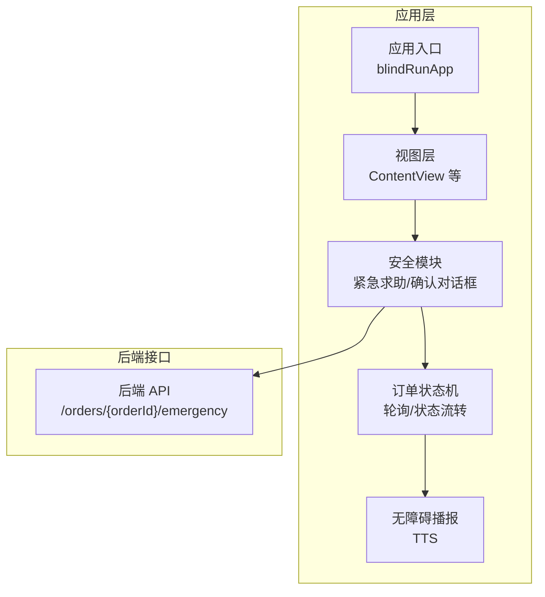
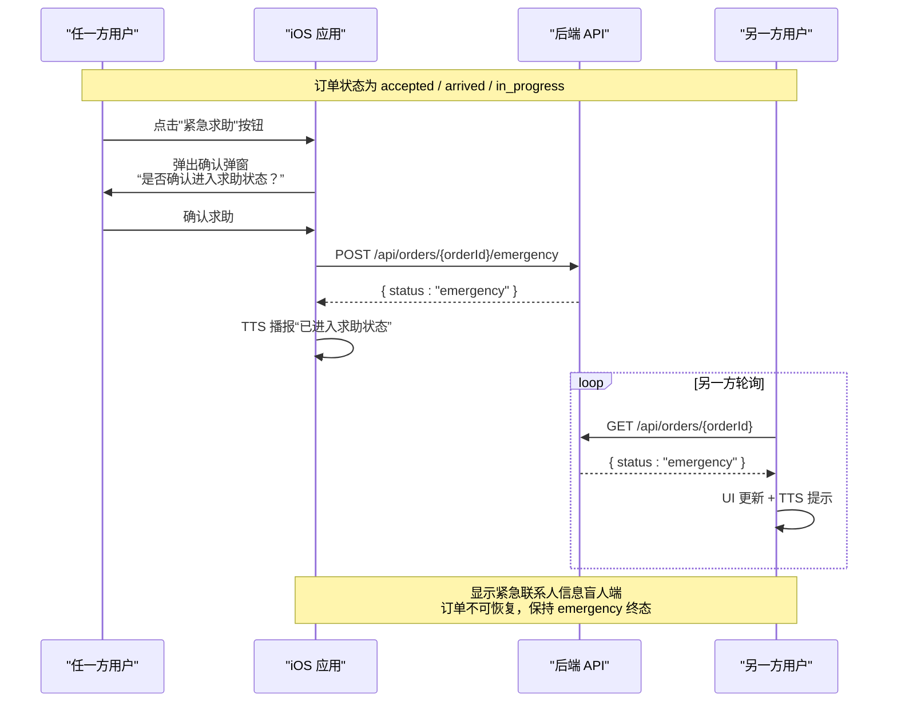
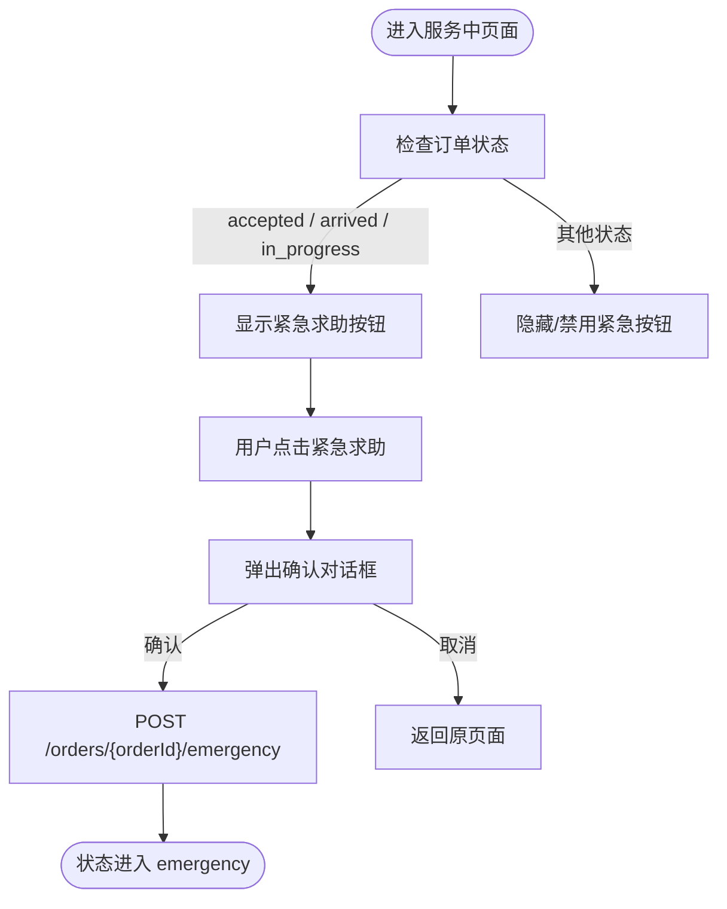
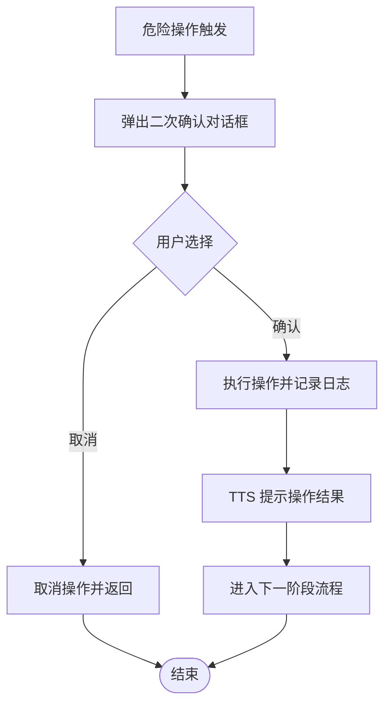
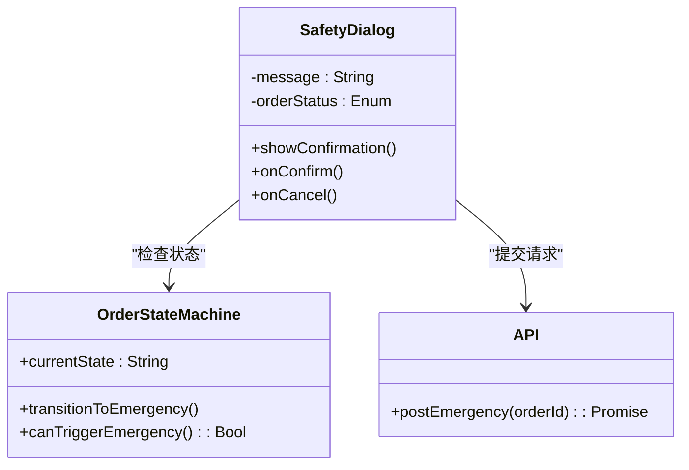
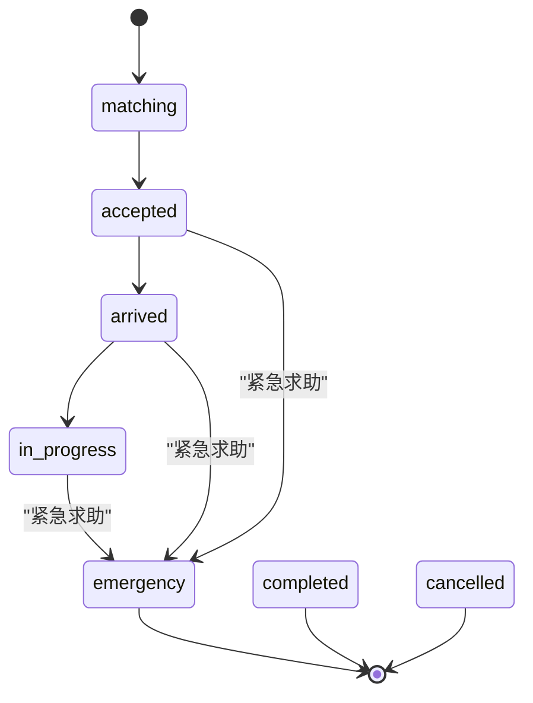
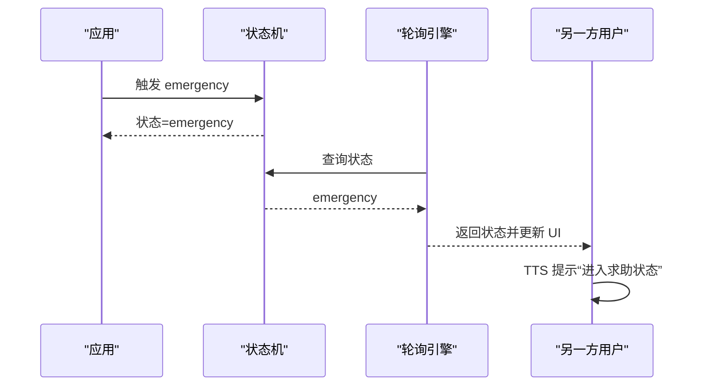
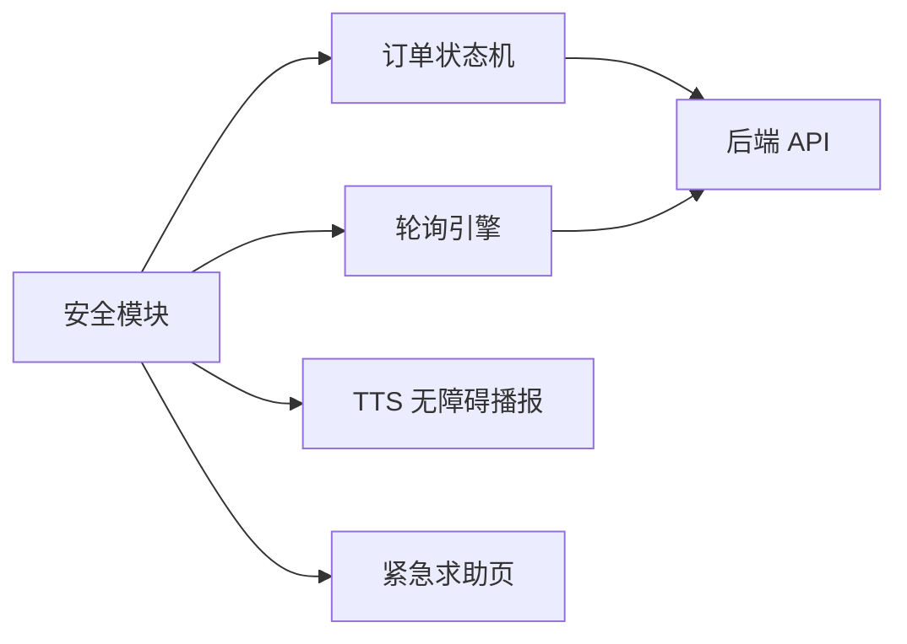

# Safety 安全模块

<cite>
**本文引用的文件**
- [safety-basic-emergency/spec.md](file://openspec/changes/add-aidrun-ios-spring-mvp/specs/safety-basic-emergency/spec.md)
- [04-user-flows-and-state-machine.md](file://docs/04-user-flows-and-state-machine.md)
- [02-mvp-scope.md](file://docs/02-mvp-scope.md)
- [09-accessibility-and-voice-guidelines.md](file://docs/09-accessibility-and-voice-guidelines.md)
- [blindRunApp.swift](file://blindRun/blindRunApp.swift)
- [ContentView.swift](file://blindRun/ContentView.swift)
- [03-user-stories.md](file://docs/03-user-stories.md)
- [01-product-requirements.md](file://docs/01-product-requirements.md)
</cite>

## 目录
1. [简介](#简介)
2. [项目结构](#项目结构)
3. [核心组件](#核心组件)
4. [架构总览](#架构总览)
5. [详细组件分析](#详细组件分析)
6. [依赖关系分析](#依赖关系分析)
7. [性能考虑](#性能考虑)
8. [故障排查指南](#故障排查指南)
9. [结论](#结论)
10. [附录](#附录)

## 简介
本文件面向 iOS 安全模块（Safety），聚焦紧急求助功能的实现与规范，包括紧急按钮设计、触发条件、求助流程、危险操作的双重确认机制、安全确认对话框的交互与逻辑、安全状态的全局管理、紧急情况下的备用通信与故障转移策略、与订单状态机的集成方式，以及测试策略与边界情况处理。文档严格基于仓库内的规格与需求文档，确保实现与产品目标一致。

## 项目结构
- 安全模块位于 iOS 应用的业务边界内，与订单状态机、轮询机制、无障碍播报（TTS）协同工作。
- 当前仓库中 iOS 应用骨架（SwiftUI）尚未包含具体安全实现代码，但安全模块的需求与流程已在文档中明确，可据此指导实现。

**图表来源**
- [blindRunApp.swift:10-17](file://blindRun/blindRunApp.swift#L10-L17)
- [ContentView.swift:10-20](file://blindRun/ContentView.swift#L10-L20)
- [04-user-flows-and-state-machine.md:230-257](file://docs/04-user-flows-and-state-machine.md#L230-L257)

**章节来源**
- [blindRunApp.swift:10-17](file://blindRun/blindRunApp.swift#L10-L17)
- [ContentView.swift:10-20](file://blindRun/ContentView.swift#L10-L20)
- [04-user-flows-and-state-machine.md:1-70](file://docs/04-user-flows-and-state-machine.md#L1-L70)

## 核心组件
- 紧急求助触发器：在订单处于 accepted / arrived / in_progress 时可用，任一方（盲人/志愿者）均可触发。
- 确认对话框：触发紧急求助前弹出二次确认，确认文案与行为在无障碍与安全规范中有明确规定。
- 订单状态机：紧急求助导致状态进入 emergency，MVP 终态，不可恢复。
- 无障碍播报：进入 emergency 后，应用通过 TTS 播报状态变化。
- 全局安全状态管理：通过订单状态与页面状态联动，确保在紧急状态下关键流程被阻断。

**章节来源**
- [safety-basic-emergency/spec.md:11-17](file://openspec/changes/add-aidrun-ios-spring-mvp/specs/safety-basic-emergency/spec.md#L11-L17)
- [04-user-flows-and-state-machine.md:72-96](file://docs/04-user-flows-and-state-machine.md#L72-L96)
- [09-accessibility-and-voice-guidelines.md:97-106](file://docs/09-accessibility-and-voice-guidelines.md#L97-L106)

## 架构总览
安全模块与订单状态机紧密耦合，紧急求助作为状态机的一个外部事件源，驱动状态从 accepted / arrived / in_progress 转入 emergency，并通过轮询与 TTS 通知另一方用户。

**图表来源**
- [04-user-flows-and-state-machine.md:230-257](file://docs/04-user-flows-and-state-machine.md#L230-L257)

## 详细组件分析

### 紧急按钮与触发条件
- 触发条件：仅当订单状态为 accepted / arrived / in_progress 时，紧急按钮可用。
- 触发主体：盲人与志愿者任一方均可触发。
- 触发结果：状态进入 emergency，记录前序状态，MVP 终态。

**图表来源**
- [04-user-flows-and-state-machine.md:19-21](file://docs/04-user-flows-and-state-machine.md#L19-L21)
- [04-user-flows-and-state-machine.md:82-91](file://docs/04-user-flows-and-state-machine.md#L82-L91)

**章节来源**
- [safety-basic-emergency/spec.md:19-25](file://openspec/changes/add-aidrun-ios-spring-mvp/specs/safety-basic-emergency/spec.md#L19-L25)
- [04-user-flows-and-state-machine.md:19-21](file://docs/04-user-flows-and-state-machine.md#L19-L21)

### 危险操作的双重确认策略
- 需要二次确认的操作清单：取消订单、进入紧急状态、志愿者结束服务、退出登录。
- 紧急求助确认文案与提示：明确告知“确认后本次服务将标记为异常，系统会记录当前订单状态”，并伴随 TTS 提示。
- 确认后行为：立即发起 API 请求，进入 emergency 状态；MVP 不自动通知真实管理员或发送短信。

**图表来源**
- [09-accessibility-and-voice-guidelines.md:88-106](file://docs/09-accessibility-and-voice-guidelines.md#L88-L106)
- [02-mvp-scope.md:73](file://docs/02-mvp-scope.md#L73)

**章节来源**
- [09-accessibility-and-voice-guidelines.md:88-106](file://docs/09-accessibility-and-voice-guidelines.md#L88-L106)
- [02-mvp-scope.md:73](file://docs/02-mvp-scope.md#L73)

### 安全确认对话框实现
- 用户界面设计：简洁明确的确认文案，突出风险提示；按钮采用高对比度与大尺寸，符合无障碍规范。
- 确认逻辑：仅在订单处于 active 状态（accepted / arrived / in_progress）时出现；确认后立即发起 API 请求。
- 取消处理：取消后回到原页面，不改变订单状态；确保用户不会误触。

**图表来源**
- [04-user-flows-and-state-machine.md:230-257](file://docs/04-user-flows-and-state-machine.md#L230-L257)
- [safety-basic-emergency/spec.md:11-17](file://openspec/changes/add-aidrun-ios-spring-mvp/specs/safety-basic-emergency/spec.md#L11-L17)

**章节来源**
- [safety-basic-emergency/spec.md:11-17](file://openspec/changes/add-aidrun-ios-spring-mvp/specs/safety-basic-emergency/spec.md#L11-L17)
- [09-accessibility-and-voice-guidelines.md:62-70](file://docs/09-accessibility-and-voice-guidelines.md#L62-L70)

### 安全状态的全局管理
- 启用时机：任一方在 accepted / arrived / in_progress 状态下触发紧急求助。
- 禁用时机：订单进入 emergency、completed、cancelled 任一终态后，紧急按钮不再可用。
- 全局一致性：emergency 为 MVP 终态，不可恢复；另一方轮询到状态变化后，UI 与 TTS 同步更新。

**图表来源**
- [04-user-flows-and-state-machine.md:72-96](file://docs/04-user-flows-and-state-machine.md#L72-L96)
- [01-product-requirements.md:154](file://docs/01-product-requirements.md#L154)

**章节来源**
- [04-user-flows-and-state-machine.md:72-96](file://docs/04-user-flows-and-state-machine.md#L72-L96)
- [01-product-requirements.md:154](file://docs/01-product-requirements.md#L154)

### 备用通信与故障转移策略
- MVP 不自动拨打电话、发送短信或通知真实管理员；紧急事件仅记录在系统中。
- 建议的备用通信方案（概念性）：在应用内提供“显示紧急联系人信息”的页面，供盲人端展示；若网络异常，仍可通过应用内提示与 TTS 提醒维持基本可用性。
- 故障转移：若 API 请求失败，应用应保留当前页面状态，允许用户重试或稍后重试；TTS 提示错误信息，避免用户误以为操作已生效。

**章节来源**
- [safety-basic-emergency/spec.md:35-41](file://openspec/changes/add-aidrun-ios-spring-mvp/specs/safety-basic-emergency/spec.md#L35-L41)
- [09-accessibility-and-voice-guidelines.md:101-106](file://docs/09-accessibility-and-voice-guidelines.md#L101-L106)

### 与订单状态机的集成
- 紧急求助作为外部事件，直接驱动状态机从 active 状态转入 emergency。
- 与轮询机制协同：另一方持续轮询订单状态，一旦进入 emergency，立即 UI 更新与 TTS 提示。
- 与角色切换拦截配合：若存在 emergency 订单，阻止用户切换角色，避免干扰应急流程。

**图表来源**
- [04-user-flows-and-state-machine.md:275-299](file://docs/04-user-flows-and-state-machine.md#L275-L299)
- [04-user-flows-and-state-machine.md:250-257](file://docs/04-user-flows-and-state-machine.md#L250-L257)

**章节来源**
- [04-user-flows-and-state-machine.md:275-299](file://docs/04-user-flows-and-state-machine.md#L275-L299)
- [04-user-flows-and-state-machine.md:250-257](file://docs/04-user-flows-and-state-machine.md#L250-L257)

## 依赖关系分析
- 安全模块依赖订单状态机与轮询机制，确保紧急状态能被及时感知与传播。
- 与无障碍模块（TTS）强耦合，保证状态变化与风险提示同步传达。
- 与 UI 导航（紧急求助页）协作，确保在 emergency 终态下用户路径清晰。

**图表来源**
- [04-user-flows-and-state-machine.md:230-257](file://docs/04-user-flows-and-state-machine.md#L230-L257)
- [09-accessibility-and-voice-guidelines.md:97-106](file://docs/09-accessibility-and-voice-guidelines.md#L97-L106)

**章节来源**
- [04-user-flows-and-state-machine.md:230-257](file://docs/04-user-flows-and-state-machine.md#L230-L257)
- [09-accessibility-and-voice-guidelines.md:97-106](file://docs/09-accessibility-and-voice-guidelines.md#L97-L106)

## 性能考虑
- 紧急求助请求应尽量短路：仅包含必要的订单 ID 与上下文，避免额外网络开销。
- 轮询频率与紧急状态下的 UI 更新需平衡：紧急状态下可提高轮询频率以缩短感知延迟，但应避免过度频繁导致电量消耗。
- TTS 播报应简洁高效，避免冗长文本影响紧急响应速度。

## 故障排查指南
- 紧急求助无响应
  - 检查订单状态是否为 accepted / arrived / in_progress。
  - 检查网络请求是否成功，必要时重试。
  - 检查 TTS 是否正常工作。
- 状态未更新
  - 检查轮询是否仍在运行（仅限订单相关页面）。
  - 检查另一方是否收到状态变更通知。
- 确认对话框未出现
  - 检查当前页面是否为服务中页面。
  - 检查紧急按钮是否被禁用（非 active 状态）。

**章节来源**
- [04-user-flows-and-state-machine.md:275-299](file://docs/04-user-flows-and-state-machine.md#L275-L299)
- [09-accessibility-and-voice-guidelines.md:97-106](file://docs/09-accessibility-and-voice-guidelines.md#L97-L106)

## 结论
安全模块围绕紧急求助展开，强调“仅在服务中可用、二次确认、MVP 终态不可恢复”。其实现需与订单状态机、轮询与 TTS 无缝集成，确保在关键时刻能够中断常规流程并准确传达状态变化。当前仓库中 iOS 应用骨架尚未包含具体实现代码，但安全需求与流程已在文档中明确，可据此进行开发与测试。

## 附录
- 相关用户故事与演示场景可参考用户故事与状态机文档中的相应章节，以验证端到端流程。

**章节来源**
- [03-user-stories.md:148](file://docs/03-user-stories.md#L148)
- [03-user-stories.md:340](file://docs/03-user-stories.md#L340)
- [03-user-stories.md:644](file://docs/03-user-stories.md#L644)
- [02-mvp-scope.md:178-186](file://docs/02-mvp-scope.md#L178-L186)