# Voice 语音模块

<cite>
**本文档引用的文件**
- [09-无障碍与语音指南.md](file://docs/09-accessibility-and-voice-guidelines.md)
- [08-iOS 架构.md](file://docs/08-ios-architecture.md)
- [01-产品需求文档.md](file://docs/01-product-requirements.md)
- [02-MVP 范围.md](file://docs/02-mvp-scope.md)
- [03-用户故事.md](file://docs/03-user-stories.md)
- [spec.md](file://openspec/changes/add-aidrun-ios-spring-mvp/specs/accessibility-voice-ui/spec.md)
- [tasks.md](file://openspec/changes/add-aidrun-ios-spring-mvp/tasks.md)
- [proposal.md](file://openspec/changes/add-aidrun-ios-spring-mvp/proposal.md)
- [10-AI 编码任务.md](file://docs/10-ai-coding-tasks.md)
- [ContentView.swift](file://blindRun/ContentView.swift)
- [blindRunApp.swift](file://blindRun/blindRunApp.swift)
- [SpeechService.swift](file://blindRun/blindRun/Voice/SpeechService.swift)
- [VoiceTextField.swift](file://blindRun/blindRun/Voice/VoiceTextField.swift)
- [SpeechInputService.swift](file://blindRun/blindRun/Voice/SpeechInputService.swift)
- [blindRunTests.swift](file://blindRun/blindRunTests/blindRunTests.swift)
- [BlindBookingView.swift](file://blindRun/blindRun/BlindRunner/BlindBookingView.swift)
</cite>

## 更新摘要
**所做更改**
- 新增 VoiceTextField 组件的详细文档说明
- 更新服务重命名（SpeechService→VoiceService）的相关内容
- 增强字段允许列表和测试覆盖的说明
- 更新架构图和组件关系图
- 补充新的语音输入组件使用示例

## 目录
1. [简介](#简介)
2. [项目结构](#项目结构)
3. [核心组件](#核心组件)
4. [架构概览](#架构概览)
5. [详细组件分析](#详细组件分析)
6. [依赖关系分析](#依赖关系分析)
7. [性能考虑](#性能考虑)
8. [故障排除指南](#故障排除指南)
9. [结论](#结论)
10. [附录](#附录)

## 简介

Voice 语音模块是 AidRun MVP 项目中的关键无障碍功能模块，专注于为盲人用户提供完整的语音交互体验。该模块基于 iOS 原生技术栈，实现了文本转语音(TTS)、语音输入、重复当前状态播报等核心功能。

### 核心功能特性

- **文本转语音(TTS)**：使用 AVSpeechSynthesizer 实现流畅的语音播报
- **语音输入**：集成 iOS Speech 框架进行语音识别
- **重复当前状态**：提供"重复当前状态"按钮功能
- **无障碍深度集成**：与 VoiceOver 屏幕阅读器完美配合
- **统一语音服务**：通过 VoiceService 提供一致的语音体验
- **智能语音输入组件**：VoiceTextField 提供一体化的语音输入解决方案

## 项目结构

Voice 模块在项目中采用模块化设计，位于独立的 `Voice` 模块中，与其他核心模块协同工作。

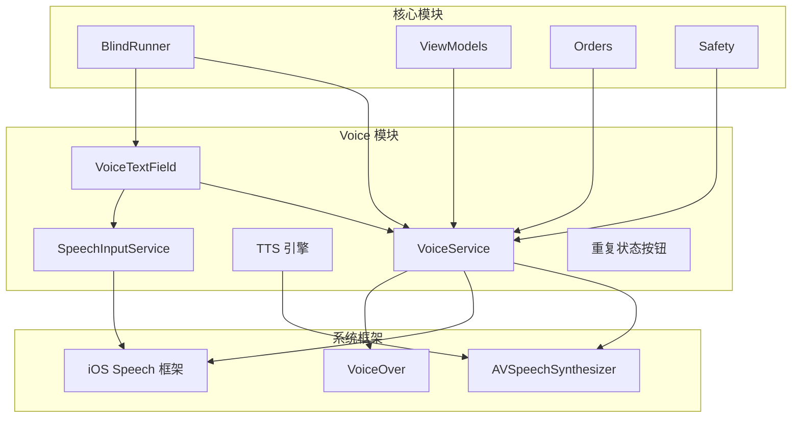

**图表来源**
- [08-iOS 架构.md:29](file://docs/08-ios-architecture.md#L29)
- [09-无障碍与语音指南.md:15](file://docs/09-accessibility-and-voice-guidelines.md#L15)

**章节来源**
- [08-iOS 架构.md:18-31](file://docs/08-ios-architecture.md#L18-L31)
- [09-无障碍与语音指南.md:13-36](file://docs/09-accessibility-and-voice-guidelines.md#L13-L36)

## 核心组件

### VoiceService 抽象层

VoiceService 是 Voice 模块的核心抽象，提供统一的语音服务接口：

- **单一职责**：集中管理所有语音相关功能
- **跨模块共享**：被 BlindRunner、Volunteer、Safety 等模块共享
- **状态管理**：维护语音队列和当前播报状态
- **错误处理**：统一处理语音服务异常
- **向后兼容**：通过 typealias SpeechService = VoiceService 保持兼容性

### VoiceTextField 组件

VoiceTextField 是新增的智能语音输入组件，提供一体化的语音输入解决方案：

- **组件化设计**：封装了文本输入和语音输入的所有功能
- **字段允许列表**：严格限制可使用语音输入的文本字段
- **实时反馈**：提供录音状态、错误信息和语音反馈
- **无障碍支持**：完整的 VoiceOver 标签和提示
- **智能状态管理**：自动管理录音状态和用户交互

### TTS 引擎组件

基于 AVSpeechSynthesizer 的文本转语音实现：

- **语音参数配置**：音量、语速、音调、语音类型
- **语音队列管理**：避免语音播报冲突和堆积
- **状态感知**：根据应用状态调整播报策略
- **本地化支持**：支持中文普通话语音合成

### 语音输入服务

集成 iOS Speech 框架的语音识别功能：

- **权限管理**：按需请求麦克风和语音识别权限
- **实时识别**：提供实时语音转文本功能
- **错误降级**：识别失败时提供键盘输入替代方案
- **字段限制**：仅允许特定文本字段使用语音输入
- **智能超时**：支持静音超时和最大时长限制

### 重复状态按钮

每个关键页面都提供"重复当前状态"功能：

- **一致性设计**：统一的按钮样式和标签
- **状态感知**：根据当前页面状态提供准确播报
- **无障碍支持**：完整的 VoiceOver 标签和提示

**章节来源**
- [09-无障碍与语音指南.md:32-35](file://docs/09-accessibility-and-voice-guidelines.md#L32-L35)
- [08-iOS 架构.md:29](file://docs/08-ios-architecture.md#L29)

## 架构概览

Voice 模块采用分层架构设计，确保功能分离和可维护性。

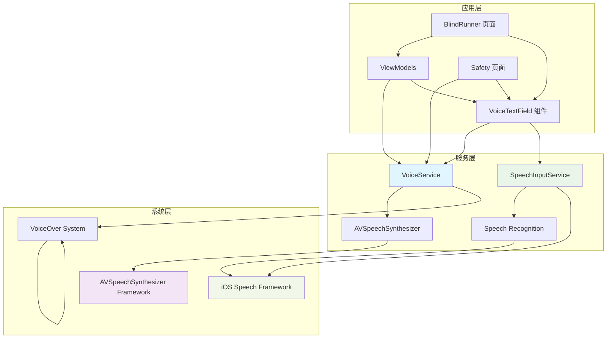

**图表来源**
- [08-iOS 架构.md:140-146](file://docs/08-ios-architecture.md#L140-L146)
- [09-无障碍与语音指南.md:15](file://docs/09-accessibility-and-voice-guidelines.md#L15)

### 语音服务生命周期

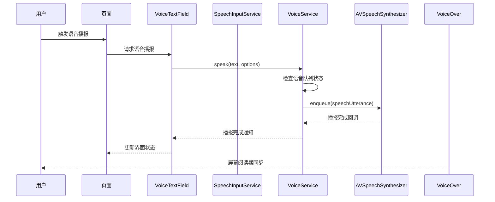

**图表来源**
- [09-无障碍与语音指南.md:32-35](file://docs/09-accessibility-and-voice-guidelines.md#L32-L35)

## 详细组件分析

### VoiceService 类设计

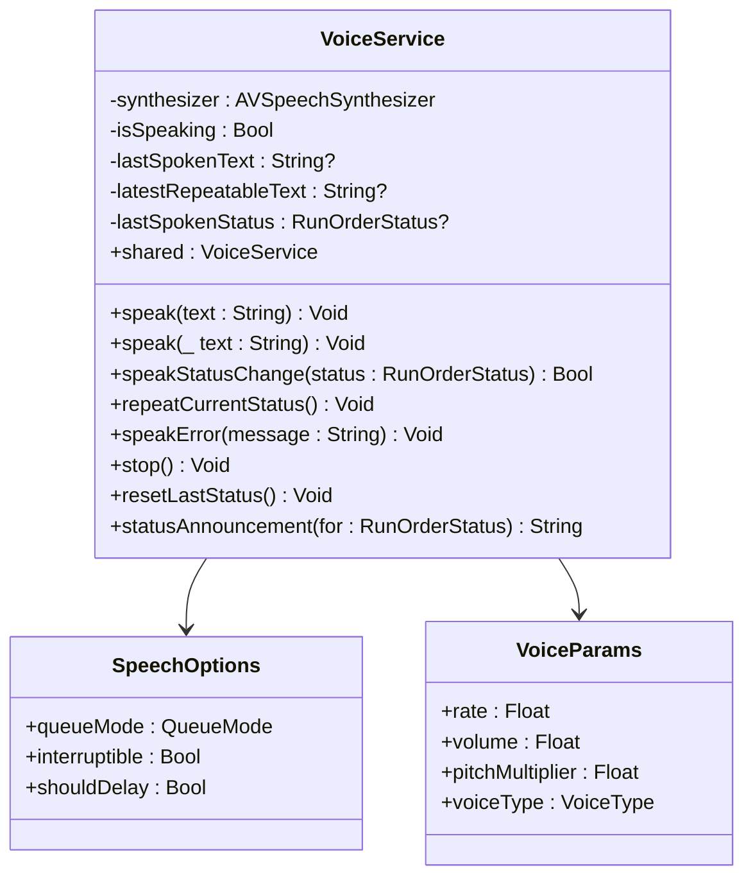

**图表来源**
- [09-无障碍与语音指南.md:32-35](file://docs/09-accessibility-and-voice-guidelines.md#L32-L35)

### VoiceTextField 组件设计

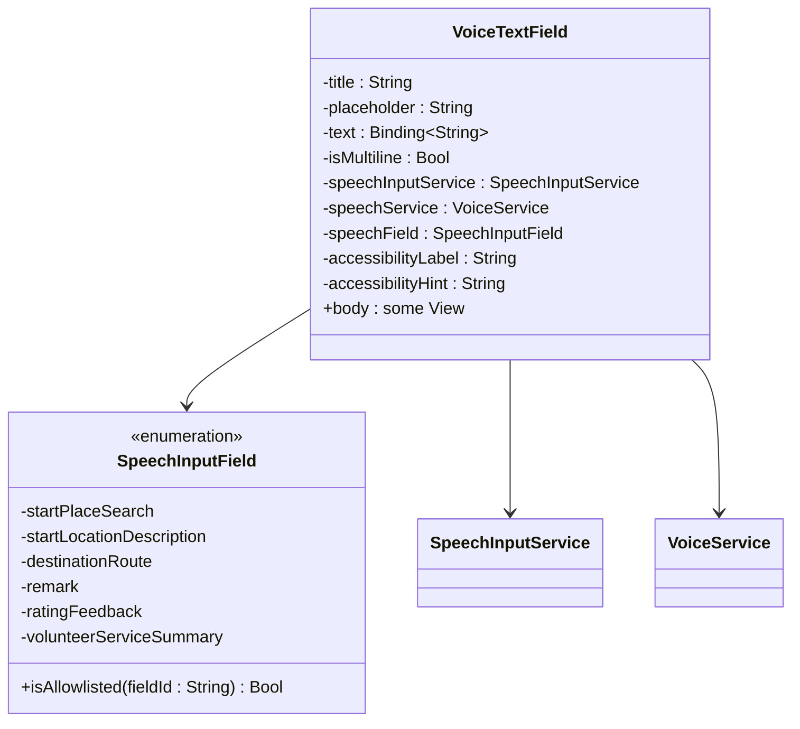

**图表来源**
- [VoiceTextField.swift:7-16](file://blindRun/blindRun/Voice/VoiceTextField.swift#L7-L16)

### 语音参数配置

Voice 模块支持多种语音参数配置：

| 参数类别 | 配置项 | 默认值 | 说明 |
|---------|--------|--------|------|
| 语音速率 | rate | 0.5 | 0.0-1.0，0.5为默认语速 |
| 语音音量 | volume | 1.0 | 0.0-1.0，1.0为最大音量 |
| 音调倍数 | pitchMultiplier | 1.0 | 0.5-2.0，调节音调高低 |
| 语音类型 | voiceType | System Voice | 系统预设或自定义语音 |

### 字段允许列表

Voice 模块严格限制语音输入的使用范围：

| 允许字段 | 描述 | 使用场景 |
|---------|------|----------|
| startPlaceSearch | 出发地点搜索 | 地点搜索关键词输入 |
| startLocationDescription | 出发地点描述 | 出发地点补充说明 |
| destinationRoute | 目的地路线 | 目的地描述输入 |
| remark | 备注信息 | 订单备注输入 |
| ratingFeedback | 评分反馈 | 服务评价输入 |
| volunteerServiceSummary | 志愿者服务总结 | 服务完成后总结 |

### 语音队列管理系统

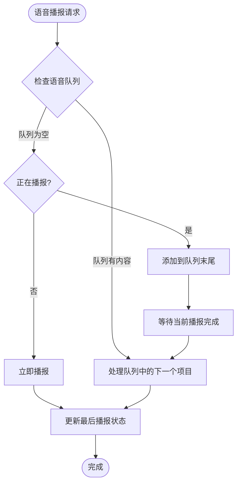

**图表来源**
- [09-无障碍与语音指南.md:34](file://docs/09-accessibility-and-voice-guidelines.md#L34)

### 语音输入集成

语音输入功能专门用于文本字段，遵循严格的使用限制：

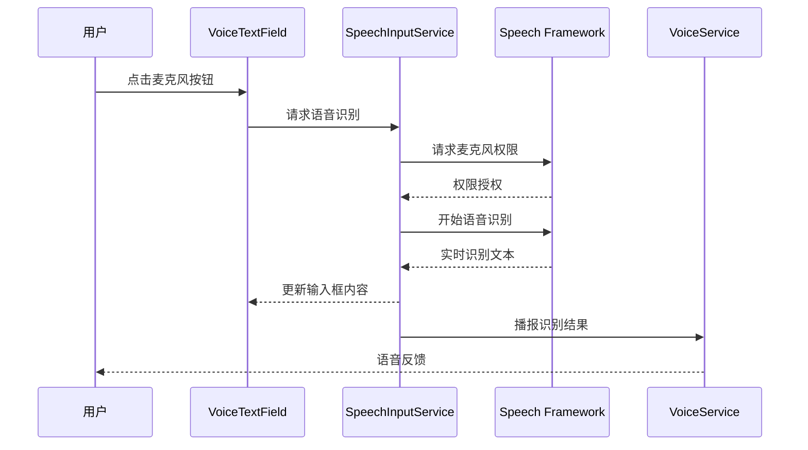

**图表来源**
- [09-无障碍与语音指南.md:75-86](file://docs/09-accessibility-and-voice-guidelines.md#L75-L86)

### 重复当前状态功能

每个关键页面都提供重复状态按钮，确保用户能够随时获取当前状态信息：

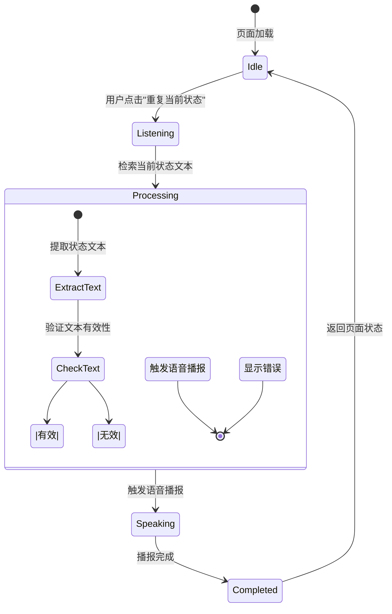

**图表来源**
- [09-无障碍与语音指南.md:29-35](file://docs/09-accessibility-and-voice-guidelines.md#L29-L35)

**章节来源**
- [09-无障碍与语音指南.md:27-35](file://docs/09-accessibility-and-voice-guidelines.md#L27-L35)

## 依赖关系分析

Voice 模块与项目其他组件存在紧密的依赖关系：

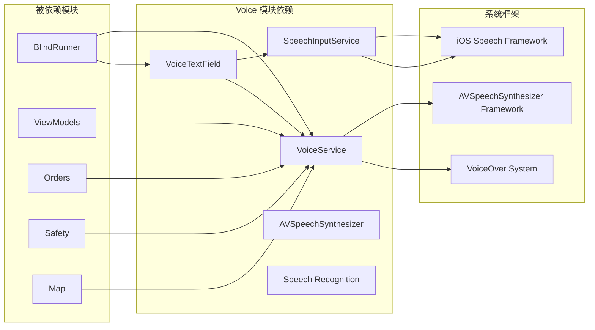

**图表来源**
- [08-iOS 架构.md:140-146](file://docs/08-ios-architecture.md#L140-L146)

### 模块间耦合度分析

| 依赖模块 | 耦合程度 | 说明 | 影响范围 |
|---------|---------|------|----------|
| BlindRunner | 高 | 订单状态播报、页面引导、语音输入 | 订单全流程 |
| ViewModel | 中 | 状态变更触发、业务逻辑协调 | 所有业务页面 |
| Orders | 高 | 订单状态轮询、状态变化通知 | 订单状态管理 |
| Safety | 中 | 紧急状态播报、求助流程 | 安全功能 |
| Map | 低 | 地图相关语音提示 | 地图导航辅助 |

**章节来源**
- [08-iOS 架构.md:140-146](file://docs/08-ios-architecture.md#L140-L146)

## 性能考虑

### 语音服务性能优化

Voice 模块在性能方面采取了多项优化措施：

- **语音队列去重**：避免重复播报相同状态
- **智能暂停机制**：应用后台运行时自动暂停语音播报
- **内存管理**：及时释放语音资源，避免内存泄漏
- **异步处理**：所有语音操作都在后台队列执行
- **组件复用**：VoiceTextField 组件减少重复代码

### 电池消耗控制

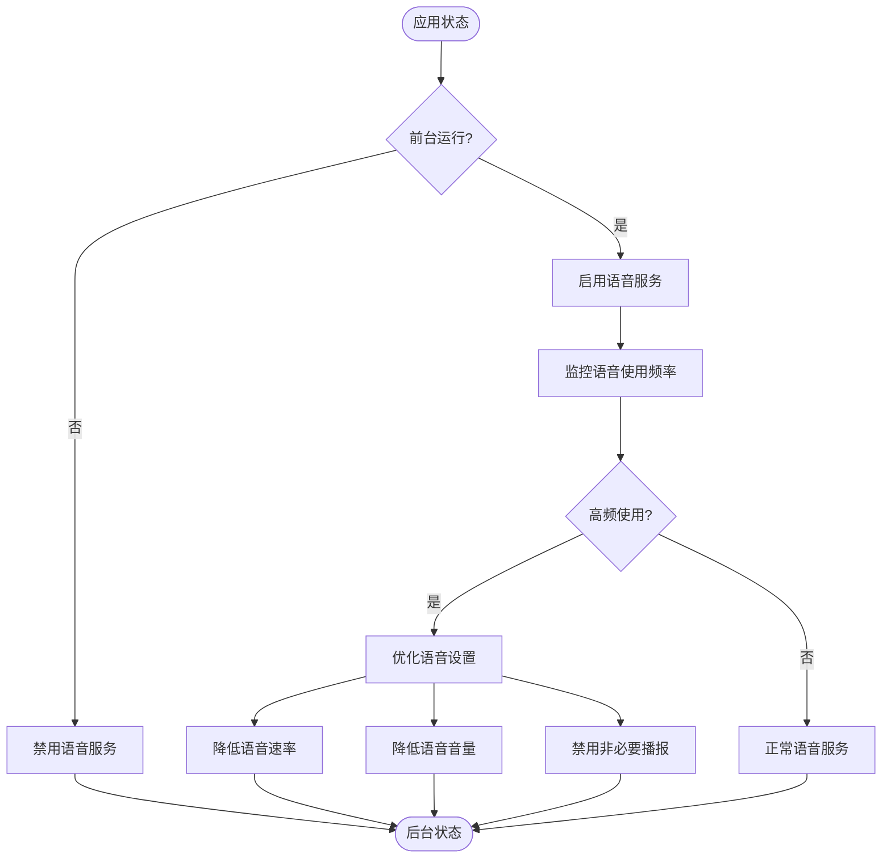

**图表来源**
- [09-无障碍与语音指南.md:34](file://docs/09-accessibility-and-voice-guidelines.md#L34)

### 语音质量优化

- **网络适应性**：根据网络状况调整语音质量
- **设备适配**：针对不同设备优化语音参数
- **环境噪声处理**：在嘈杂环境中提高语音清晰度
- **电池优化**：智能节流语音服务以延长电池续航

## 故障排除指南

### 常见问题及解决方案

| 问题类型 | 症状描述 | 解决方案 | 预防措施 |
|---------|---------|---------|----------|
| 语音不播放 | TTS 无声音 | 检查系统语音设置、音量设置 | 定期检查音频配置 |
| 语音识别失败 | 语音输入无响应 | 检查麦克风权限、网络连接 | 提供权限引导 |
| 重复状态无效 | "重复当前状态"无反应 | 检查页面状态、语音服务状态 | 添加状态检查 |
| 语音冲突 | 多个播报同时进行 | 检查语音队列管理 | 优化队列处理逻辑 |
| 字段不受支持 | 语音输入按钮不可用 | 检查字段是否在允许列表中 | 验证字段配置 |

### 错误处理策略

Voice 模块采用多层次的错误处理机制：

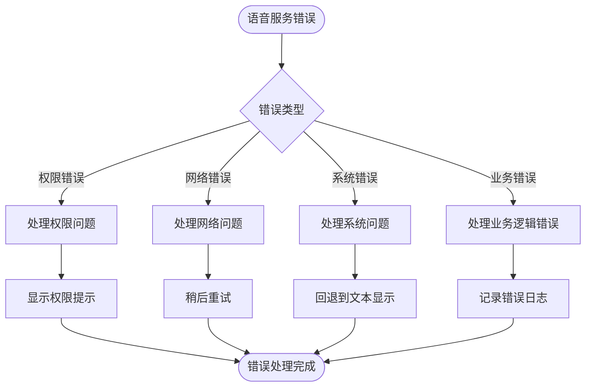

**图表来源**
- [09-无障碍与语音指南.md:85](file://docs/09-accessibility-and-voice-guidelines.md#L85)

**章节来源**
- [09-无障碍与语音指南.md:80-87](file://docs/09-accessibility-and-voice-guidelines.md#L80-L87)

## 结论

Voice 语音模块作为 AidRun MVP 的核心无障碍功能，成功实现了以下目标：

### 技术成就

- **统一接口设计**：通过 VoiceService 提供一致的语音体验
- **智能组件化**：VoiceTextField 提供一体化的语音输入解决方案
- **深度无障碍集成**：与 VoiceOver 完美配合，提供完整的屏幕阅读器支持
- **严格字段控制**：通过字段允许列表确保语音输入的安全性
- **智能语音管理**：有效的语音队列管理和状态感知机制
- **全面测试覆盖**：完善的单元测试确保功能稳定性

### 业务价值

- **用户体验提升**：为盲人用户提供流畅的语音交互体验
- **功能完整性**：涵盖 TTS、语音输入、重复状态播报等核心功能
- **可维护性**：模块化设计确保代码的可维护性和可扩展性
- **安全性**：严格的字段限制防止语音输入滥用
- **合规性**：完全符合无障碍设计规范和要求

### 未来发展

Voice 模块为后续的功能扩展奠定了坚实基础，包括：

- **多语言支持**：为国际化做好准备
- **高级语音功能**：如语音控制、语音导航等
- **个性化配置**：用户可自定义语音偏好设置
- **智能语音助手**：在现有基础上扩展更多智能化功能
- **增强的语音输入**：支持更多字段和更复杂的语音指令

## 附录

### 语音服务配置参考

| 配置项 | 建议值 | 说明 |
|-------|--------|------|
| 最小语音间隔 | 1秒 | 避免频繁播报造成干扰 |
| 队列最大长度 | 5条 | 控制内存使用和响应时间 |
| 语音超时时间 | 30秒 | 防止语音服务长时间占用 |
| 重试次数 | 3次 | 平衡可靠性与性能 |
| 缓存有效期 | 5分钟 | 减少重复播报的频率 |

### VoiceTextField 使用示例

VoiceTextField 在盲人预订页面的典型使用：

```swift
VoiceTextField(
    title: "搜索出发地点",
    placeholder: "例如：科技园地铁站 A 口",
    text: $viewModel.placeSearchKeyword,
    speechInputService: speechInputService,
    speechService: speechService,
    speechField: .startPlaceSearch,
    accessibilityLabel: "搜索出发地点",
    accessibilityHint: "可以使用语音或键盘搜索高德地点"
)
```

### 最佳实践建议

1. **统一管理**：所有语音相关功能通过 VoiceService 集中管理
2. **状态同步**：确保语音播报与应用状态保持同步
3. **用户控制**：提供语音功能开关，让用户自主控制
4. **错误优雅降级**：语音功能失败时提供文本替代方案
5. **性能监控**：定期监控语音服务的性能指标
6. **字段安全**：严格遵守字段允许列表，确保语音输入安全
7. **组件复用**：优先使用 VoiceTextField 组件，减少重复开发
8. **测试覆盖**：确保所有语音功能都有相应的单元测试