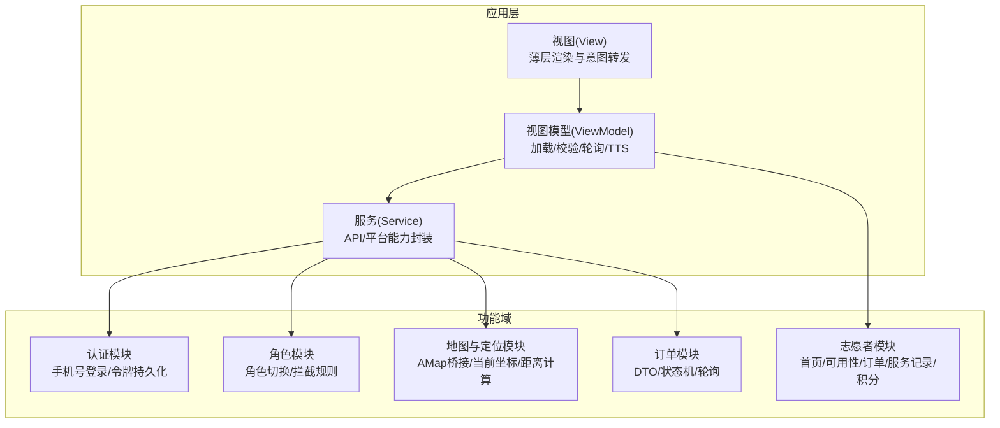
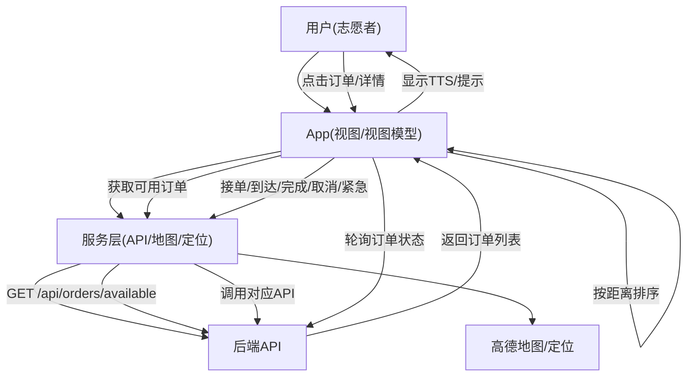
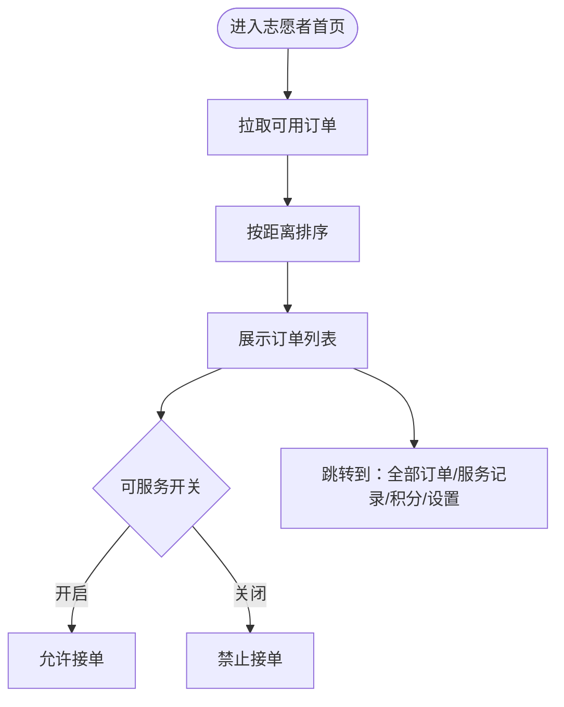
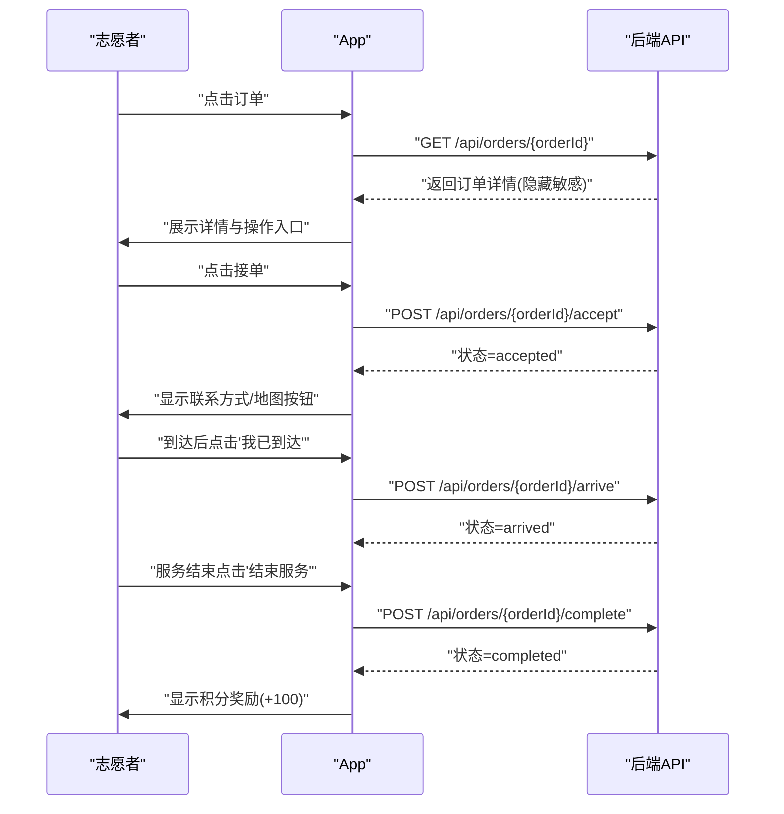
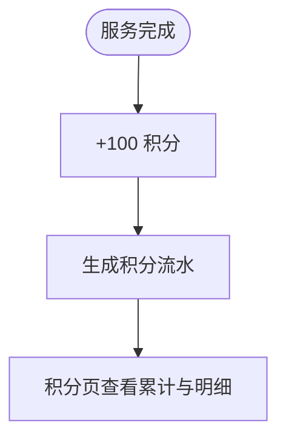
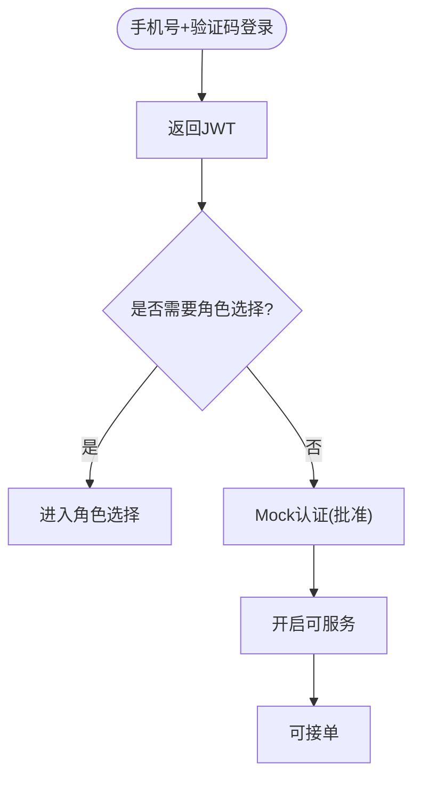
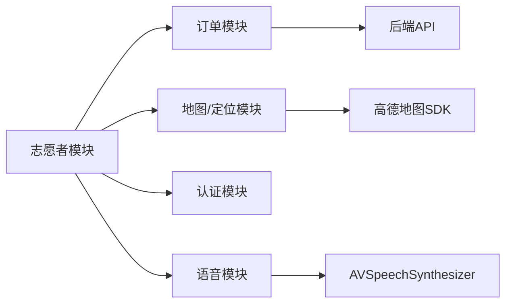

# Volunteer 志愿者模块

<cite>
**本文引用的文件**
- [04-user-flows-and-state-machine.md](file://docs/04-user-flows-and-state-machine.md)
- [08-ios-architecture.md](file://docs/08-ios-architecture.md)
- [volunteer-order-flow/spec.md](file://openspec/changes/add-aidrun-ios-spring-mvp/specs/volunteer-order-flow/spec.md)
- [volunteer-points/spec.md](file://openspec/changes/add-aidrun-ios-spring-mvp/specs/volunteer-points/spec.md)
- [amap-location/spec.md](file://openspec/changes/add-aidrun-ios-spring-mvp/specs/amap-location/spec.md)
- [auth-phone-login/spec.md](file://openspec/changes/add-aidrun-ios-spring-mvp/specs/auth-phone-login/spec.md)
</cite>

## 目录
1. [简介](#简介)
2. [项目结构](#项目结构)
3. [核心组件](#核心组件)
4. [架构总览](#架构总览)
5. [详细组件分析](#详细组件分析)
6. [依赖关系分析](#依赖关系分析)
7. [性能考虑](#性能考虑)
8. [故障排查指南](#故障排查指南)
9. [结论](#结论)
10. [附录](#附录)

## 简介
本文件面向志愿者模块的功能与实现，围绕以下主题展开：志愿者主页、可用性管理与可接订单浏览；志愿者认证流程（含 Mock 审核与状态检查）；可接订单的获取与排序机制（基于距离的本地排序与当前位置处理）；订单详情页面的接单、到达确认、服务完成与取消流程；服务记录管理（历史订单查看与评价系统）；志愿者积分系统（奖励与查询）。同时提供完整的工作流程示例与状态管理策略，并通过可视化图表映射到实际需求与交互。

## 项目结构
志愿者模块在整体 iOS 架构中属于独立功能域，遵循 SwiftUI + MVVM 的设计，配合高德地图与定位能力，支撑志愿者端的认证、可用性开关、附近订单浏览、接单与服务流程。

**章节来源**
- [08-ios-architecture.md: 18-32:18-32](file://docs/08-ios-architecture.md#L18-L32)
- [08-ios-architecture.md: 42-49:42-49](file://docs/08-ios-architecture.md#L42-L49)

## 核心组件
- 志愿者首页（VOL_Home）
  - 展示“附近订单 + 可服务开关”，支持跳转到订单列表与服务记录、积分页、设置。
  - 关键职责：展示可用订单、控制可用性开关、引导进入订单详情与服务流程。
- 可用性管理
  - 志愿者需通过 Mock 认证并开启“可服务”才能接单。
  - 认证状态与可用性状态共同决定是否允许接单。
- 可接订单浏览
  - 获取后端返回的“匹配中”订单，按志愿者当前位置到起点的距离进行本地排序。
  - 隐藏敏感字段（如盲人电话），仅展示必要信息。
- 订单详情页（VOL_OrderDetail）
  - 展示订单信息与操作入口（接单、查看地图、到达、完成、取消、紧急）。
  - 支持与盲人端的状态同步轮询。
- 服务记录与评价
  - 完成服务后生成记录，包含服务时间、盲人昵称、起点、状态与积分。
  - 评价系统在 MVP 中作为可选步骤，不强制要求。
- 积分系统
  - 完成服务后奖励固定积分（例如 +100），并可在积分页查看历史记录与占位商品。

**章节来源**
- [04-user-flows-and-state-machine.md: 24-32:24-32](file://docs/04-user-flows-and-state-machine.md#L24-L32)
- [volunteer-order-flow/spec.md: 3-38:3-38](file://openspec/changes/add-aidrun-ios-spring-mvp/specs/volunteer-order-flow/spec.md#L3-L38)
- [volunteer-points/spec.md: 3-26:3-26](file://openspec/changes/add-aidrun-ios-spring-mvp/specs/volunteer-points/spec.md#L3-L26)
- [amap-location/spec.md: 23-38:23-38](file://openspec/changes/add-aidrun-ios-spring-mvp/specs/amap-location/spec.md#L23-L38)

## 架构总览
志愿者模块的交互与状态流由用户流程与状态机文档定义，结合 iOS 架构文档中的 MVVM、API 客户端与轮询策略，形成从认证到服务完成的闭环。

**图表来源**
- [04-user-flows-and-state-machine.md: 180-228:180-228](file://docs/04-user-flows-and-state-machine.md#L180-L228)
- [08-ios-architecture.md: 68-83:68-83](file://docs/08-ios-architecture.md#L68-L83)

**章节来源**
- [04-user-flows-and-state-machine.md: 180-228:180-228](file://docs/04-user-flows-and-state-machine.md#L180-L228)
- [08-ios-architecture.md: 68-83:68-83](file://docs/08-ios-architecture.md#L68-L83)

## 详细组件分析

### 志愿者主页（VOL_Home）
- 功能要点
  - 展示“附近订单”列表（按距离排序）与“可服务开关”。
  - 提供跳转入口：全部订单、服务记录、积分商城、设置。
- 交互与数据流
  - 进入页面后拉取可用订单并本地排序；根据可用性状态启用/禁用接单入口。
  - 与订单详情页联动，支持快速进入服务流程。
- 无障碍与语音
  - 关键按钮具备可访问性标签与提示；支持重复当前状态的语音播报。

**章节来源**
- [04-user-flows-and-state-machine.md: 24-32:24-32](file://docs/04-user-flows-and-state-machine.md#L24-L32)
- [08-ios-architecture.md: 47](file://docs/08-ios-architecture.md#L47)

### 可用性管理与认证流程
- 认证要求
  - 志愿者需完成 Mock 认证，使“验证状态”和“管理员复审状态”均变为“已批准”。
  - 仅当“可服务开关”开启时，才允许接单。
- 状态检查与错误处理
  - 若未通过 Mock 审核，尝试接单将收到“志愿者未审核通过”的错误。
  - 若已审核但未开启可服务，尝试接单将收到“志愿者不可用”的错误。
- Mock 认证
  - 提供一键 Mock 审批动作，用于演示与联调。

**章节来源**
- [volunteer-order-flow/spec.md: 3-22:3-22](file://openspec/changes/add-aidrun-ios-spring-mvp/specs/volunteer-order-flow/spec.md#L3-L22)

### 可接订单的获取与排序机制
- 数据来源
  - 通过“获取可用订单”接口返回处于“匹配中”的订单集合。
- 排序策略
  - 使用志愿者当前位置到订单起点坐标的距离进行本地排序，最近的订单排在最前面。
- 位置与权限
  - 需要定位权限；若拒绝则阻断距离排序与接单流程；提供演示用默认坐标以保证演示稳定性。
- 隐私保护
  - 返回的订单信息隐藏敏感字段（如盲人电话、紧急联系人），仅展示非敏感信息。

**章节来源**
- [amap-location/spec.md: 23-38:23-38](file://openspec/changes/add-aidrun-ios-spring-mvp/specs/amap-location/spec.md#L23-L38)
- [volunteer-order-flow/spec.md: 23-30:23-30](file://openspec/changes/add-aidrun-ios-spring-mvp/specs/volunteer-order-flow/spec.md#L23-L30)

### 订单详情页面与操作流程
- 页面内容
  - 展示订单基本信息（起点、预约时间、备注等），隐藏敏感信息。
  - 提供操作入口：接单、查看地图、到达、完成、取消、紧急。
- 接单流程
  - 成功接单后，状态从“匹配中”变为“已接单”，并显示盲人联系方式与“查看地图”按钮。
- 到达与服务开始
  - 志愿者点击“我已到达”，状态变为“已到达”；等待盲人确认开始服务。
- 服务完成与取消
  - 志愿者点击“结束服务”，调用完成接口，状态进入“已完成”；完成后可获得积分奖励。
  - 取消仅限服务开始前，服务开始后仅能触发“紧急”。
- 紧急求助
  - 任一方均可触发紧急求助，订单进入“紧急”终态，无法恢复。

**图表来源**
- [04-user-flows-and-state-machine.md: 180-228:180-228](file://docs/04-user-flows-and-state-machine.md#L180-L228)

**章节来源**
- [04-user-flows-and-state-machine.md: 180-228:180-228](file://docs/04-user-flows-and-state-machine.md#L180-L228)
- [volunteer-order-flow/spec.md: 31-38:31-38](file://openspec/changes/add-aidrun-ios-spring-mvp/specs/volunteer-order-flow/spec.md#L31-L38)

### 服务记录管理与评价系统
- 服务记录
  - 完成服务后生成记录，包含服务时间、盲人昵称、起点、状态与获得的积分。
  - 志愿者可在“服务记录页”查看历史订单。
- 评价系统
  - MVP 中提供可选的评价入口，不强制要求；后续版本可扩展为必填项。

**章节来源**
- [volunteer-points/spec.md: 11-26:11-26](file://openspec/changes/add-aidrun-ios-spring-mvp/specs/volunteer-points/spec.md#L11-L26)

### 志愿者积分系统
- 奖励规则
  - 完成一次服务后奖励固定积分（例如 +100）。
- 查询与展示
  - 在“积分/商城占位页”展示累计积分与历史明细；商品为占位展示，不支持兑换。

**章节来源**
- [volunteer-points/spec.md: 3-18:3-18](file://openspec/changes/add-aidrun-ios-spring-mvp/specs/volunteer-points/spec.md#L3-L18)

### 认证与登录（Mock 审核与状态检查）
- 登录与令牌
  - 支持手机号 + 固定验证码（123456）登录，返回 JWT；首次登录可能未设置 activeRole，需进入角色选择。
- Mock 审核
  - 提供 Mock 认证动作，将“验证状态”和“管理员复审状态”置为“已批准”，随后开启“可服务”即可接单。
- 状态检查
  - 尝试接单前检查 Mock 审核与可用性状态，不符合条件则提示并阻止接单。

**章节来源**
- [auth-phone-login/spec.md: 3-30:3-30](file://openspec/changes/add-aidrun-ios-spring-mvp/specs/auth-phone-login/spec.md#L3-L30)
- [volunteer-order-flow/spec.md: 15-22:15-22](file://openspec/changes/add-aidrun-ios-spring-mvp/specs/volunteer-order-flow/spec.md#L15-L22)

## 依赖关系分析
- 组件耦合
  - 志愿者首页依赖订单模块（获取可用订单）、地图模块（计算距离）、认证模块（检查 Mock 审核与可用性）。
- 外部依赖
  - 后端 API：订单 CRUD、状态变更、可用订单列表。
  - 高德地图：地图展示、定位、距离计算。
  - 语音服务：TTS 提示与状态播报。
- 轮询与状态机
  - 订单详情页在特定状态下（accepted/arrived/in_progress）进行轮询，确保双方状态一致。

**图表来源**
- [08-ios-architecture.md: 26-31:26-31](file://docs/08-ios-architecture.md#L26-L31)
- [04-user-flows-and-state-machine.md: 275-299:275-299](file://docs/04-user-flows-and-state-machine.md#L275-L299)

**章节来源**
- [08-ios-architecture.md: 26-31:26-31](file://docs/08-ios-architecture.md#L26-L31)
- [04-user-flows-and-state-machine.md: 275-299:275-299](file://docs/04-user-flows-and-state-machine.md#L275-L299)

## 性能考虑
- 轮询频率与范围
  - 仅在订单相关页面进行轮询，周期为 5 秒；状态稳定时不刷新 UI，减少不必要的重绘。
- 排序与计算
  - 距离计算在本地完成，避免频繁网络请求；建议对坐标缓存与去抖处理，降低计算开销。
- 地图与定位
  - 仅在需要时启用定位与地图渲染；在权限被拒时提前阻断，避免无效调用。
- 令牌与环境
  - 使用 UserDefaults 存储 JWT（MVP），生产环境需迁移到 Keychain；环境切换通过统一客户端抽象屏蔽。

**章节来源**
- [08-ios-architecture.md: 125-139:125-139](file://docs/08-ios-architecture.md#L125-L139)
- [08-ios-architecture.md: 78-83:78-83](file://docs/08-ios-architecture.md#L78-L83)

## 故障排查指南
- 无法接单
  - 检查 Mock 审核状态与“可服务开关”是否都已开启。
  - 若提示“志愿者未审核通过/不可用”，请先完成 Mock 审核并开启可服务。
- 订单列表为空或无排序
  - 确认已授予定位权限；若权限被拒，将无法计算距离与排序。
  - 检查网络与后端可用订单接口是否正常。
- 状态不同步
  - 确认当前页面处于轮询范围内；离开页面或订单进入终态（completed/cancelled/emergency）会停止轮询。
- 紧急状态
  - 一旦进入紧急状态，订单不可恢复；双方均会收到状态更新与语音提示。

**章节来源**
- [volunteer-order-flow/spec.md: 7-14:7-14](file://openspec/changes/add-aidrun-ios-spring-mvp/specs/volunteer-order-flow/spec.md#L7-L14)
- [04-user-flows-and-state-machine.md: 230-257:230-257](file://docs/04-user-flows-and-state-machine.md#L230-L257)
- [04-user-flows-and-state-machine.md: 301-309:301-309](file://docs/04-user-flows-and-state-machine.md#L301-L309)

## 结论
志愿者模块围绕“认证—可用性—附近订单—接单—服务—记录—积分”的完整闭环构建，结合 MVVM 架构与高德地图能力，实现了真实地图、定位与本地距离排序。通过明确的状态机与轮询策略，保障了双方状态一致性与用户体验。积分与服务记录在 MVP 中提供基础能力，为后续扩展留足空间。

## 附录
- 工作流程示例（志愿者正向流程）
  - 登录后进入志愿者首页，Mock 审核通过并开启可服务，查看附近订单并按距离排序，点击订单进入详情，接单后到达并等待盲人确认开始，服务结束后完成并获得积分。
- 状态管理策略
  - 使用状态机约束流转，禁止服务开始后的普通取消；紧急状态为终态，不支持恢复。
- API 与轮询清单
  - 获取可用订单、订单详情、接单、到达、确认开始、完成、紧急、轮询等。

**章节来源**
- [04-user-flows-and-state-machine.md: 180-228:180-228](file://docs/04-user-flows-and-state-machine.md#L180-L228)
- [04-user-flows-and-state-machine.md: 72-119:72-119](file://docs/04-user-flows-and-state-machine.md#L72-L119)
- [04-user-flows-and-state-machine.md: 275-299:275-299](file://docs/04-user-flows-and-state-machine.md#L275-L299)