# Volunteer 志愿者模块

<cite>
**本文引用的文件**
- [04-user-flows-and-state-machine.md](file://docs/04-user-flows-and-state-machine.md)
- [08-ios-architecture.md](file://docs/08-ios-architecture.md)
- [09-accessibility-and-voice-guidelines.md](file://docs/09-accessibility-and-voice-guidelines.md)
- [volunteer-order-flow/spec.md](file://openspec/changes/add-aidrun-ios-spring-mvp/specs/volunteer-order-flow/spec.md)
- [volunteer-points/spec.md](file://openspec/changes/add-aidrun-ios-spring-mvp/specs/volunteer-points/spec.md)
- [amap-location/spec.md](file://openspec/changes/add-aidrun-ios-spring-mvp/specs/amap-location/spec.md)
- [auth-phone-login/spec.md](file://openspec/changes/add-aidrun-ios-spring-mvp/specs/auth-phone-login/spec.md)
- [SpeechService.swift](file://blindRun/Voice/SpeechService.swift)
- [AppColors.swift](file://blindRun/Core/DesignSystem/AppColors.swift)
- [HighContrastText.swift](file://blindRun/Core/DesignSystem/HighContrastText.swift)
- [PrimaryButton.swift](file://blindRun/Core/DesignSystem/PrimaryButton.swift)
- [VolunteerHomeView.swift](file://blindRun/Volunteer/VolunteerHomeView.swift)
- [VolunteerOrderFlowViews.swift](file://blindRun/Volunteer/VolunteerOrderFlowViews.swift)
- [VolunteerModule.swift](file://blindRun/Volunteer/VolunteerModule.swift)
- [VolunteerController.java](file://backend/src/main/java/com/aidrun/backend/volunteer/VolunteerController.java)
- [VolunteerService.java](file://backend/src/main/java/com/aidrun/backend/volunteer/VolunteerService.java)
- [AvailabilityRequest.java](file://backend/src/main/java/com/aidrun/backend/volunteer/dto/AvailabilityRequest.java)
- [VolunteerControllerIntegrationTest.java](file://backend/src/test/java/com/aidrun/backend/volunteer/VolunteerControllerIntegrationTest.java)
- [VerificationStatus.java](file://backend/src/main/java/com/aidrun/backend/profile/VerificationStatus.java)
- [AdminReviewStatus.java](file://backend/src/main/java/com/aidrun/backend/profile/AdminReviewStatus.java)
- [VolunteerProfile.java](file://backend/src/main/java/com/aidrun/backend/profile/VolunteerProfile.java)
- [ErrorCode.java](file://backend/src/main/java/com/aidrun/backend/common/error/ErrorCode.java)
- [ApiException.java](file://backend/src/main/java/com/aidrun/backend/common/error/ApiException.java)
- [OrderModels.swift](file://blindRun/Core/Models/OrderModels.swift)
- [OrderDisplayHelpers.swift](file://blindRun/Core/Models/OrderDisplayHelpers.swift)
</cite>

## 更新摘要
**所做更改**
- 新增1778行VolunteerOrderFlowViews.swift，实现完整的志愿者侧订单管理体验
- 更新志愿者首页实现，从占位升级为完整的首页功能
- 新增志愿者订单流程的完整实现，包括订单发现、接受、到达确认、服务进行、完成处理等五个阶段
- 更新认证与登录章节，增加后端API接口说明和状态检查机制
- 新增志愿者认证流程的后端实现细节，包括API端点、状态枚举和错误处理
- 更新可用性管理章节，补充后端服务的具体实现逻辑
- 新增志愿者积分系统章节，包含积分流水和余额管理
- 更新架构总览图，反映新增的后端API接口和数据流

## 目录
1. [简介](#简介)
2. [项目结构](#项目结构)
3. [核心组件](#核心组件)
4. [架构总览](#架构总览)
5. [详细组件分析](#详细组件分析)
6. [后端志愿者服务实现](#后端志愿者服务实现)
7. [依赖关系分析](#依赖关系分析)
8. [性能考虑](#性能考虑)
9. [故障排查指南](#故障排查指南)
10. [结论](#结论)
11. [附录](#附录)

## 简介
本文件面向志愿者模块的功能与实现，围绕以下主题展开：志愿者主页、可用性管理与可接订单浏览；志愿者认证流程（含 Mock 审核与状态检查）；可接订单的获取与排序机制（基于距离的本地排序与当前位置处理）；订单详情页面的接单、到达确认、服务完成与取消流程；服务记录管理（历史订单查看与评价系统）；志愿者积分系统（奖励与查询）。同时提供完整的工作流程示例与状态管理策略，并通过可视化图表映射到实际需求与交互。

**更新** 志愿者模块现已实现完整的后端服务支持，包括志愿者认证管理、可用性控制和Mock验证功能。新增的1778行VolunteerOrderFlowViews.swift文件实现了完整的志愿者侧订单管理体验，涵盖订单发现、接受、到达确认、服务进行、完成处理等五个阶段的操作界面和状态管理。

## 项目结构
志愿者模块在整体 iOS 架构中属于独立功能域，遵循 SwiftUI + MVVM 的设计，配合高德地图与定位能力，支撑志愿者端的认证、可用性开关、附近订单浏览、接单与服务流程。当前模块包含完整的首页实现、志愿者订单流程视图、服务记录管理、积分系统和设置页面，以及后端的完整服务实现。

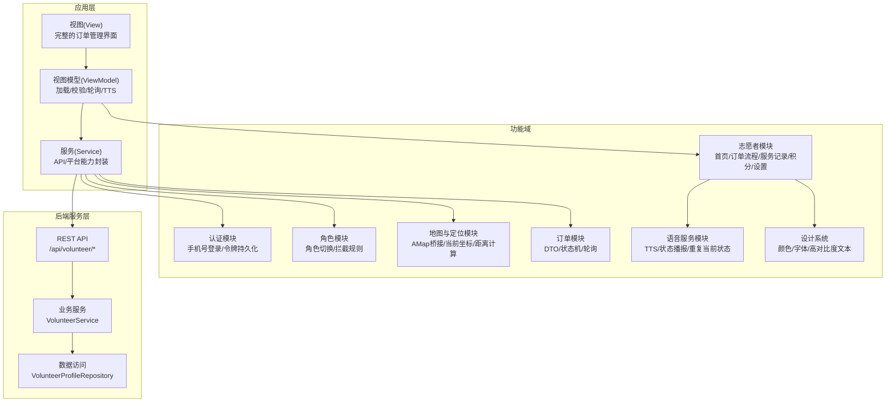

**章节来源**
- [08-ios-architecture.md: 18-32:18-32](file://docs/08-ios-architecture.md#L18-L32)
- [08-ios-architecture.md: 42-49:42-49](file://docs/08-ios-architecture.md#L42-L49)
- [VolunteerModule.swift: 1-3:1-3](file://blindRun/Volunteer/VolunteerModule.swift#L1-L3)

## 核心组件
- 志愿者首页（VOL_Home）
  - 完整实现的首页界面，包含地图展示、状态覆盖层、附近订单面板和底部导航入口。
  - 集成高对比度文本组件和设计系统样式。
  - 支持实时地图标注显示附近可接订单。
- 志愿者订单流程（VOL_OrderFlow）
  - **订单发现阶段**：获取可用订单列表，按距离排序，支持地图标注显示。
  - **接单阶段**：接单前状态检查，显示盲人联系方式，支持定位权限检查。
  - **到达确认阶段**：志愿者到达后确认到达，等待盲人确认开始服务。
  - **服务进行阶段**：服务进行中，支持紧急求助，轮询状态更新。
  - **完成处理阶段**：服务结束，输入服务总结，获得积分奖励。
- 可用性管理
  - 志愿者需通过 Mock 认证并开启"可服务"才能接单。
  - 认证状态与可用性状态共同决定是否允许接单。
  - 后端提供 `/api/volunteer/mock-verification/approve` 和 `/api/volunteer/availability` 接口支持。
- 可接订单浏览
  - 获取后端返回的"匹配中"订单，按志愿者当前位置到起点的距离进行本地排序。
  - 隐藏敏感字段（如盲人电话），仅展示必要信息。
  - 支持地图标注显示订单位置。
- 订单详情页（VOL_OrderDetail）
  - 展示订单信息与操作入口（接单、查看地图、到达、完成、取消、紧急）。
  - 支持与盲人端的状态同步轮询。
- 服务记录与评价
  - 完成服务后生成记录，包含服务时间、盲人昵称、起点、状态与积分。
  - 评价系统在 MVP 中作为可选步骤，不强制要求。
- 积分系统
  - 完成服务后奖励固定积分（例如 +100），并可在积分页查看历史记录与占位商品。
  - 后端维护志愿者积分余额和流水记录。
- 无障碍语音服务
  - 集中式 TTS 服务，使用 AVSpeechSynthesizer 播报状态变化和错误提示。
  - 支持重复当前状态播报，避免轮询时重复播报。

**章节来源**
- [04-user-flows-and-state-machine.md: 24-32:24-32](file://docs/04-user-flows-and-state-machine.md#L24-L32)
- [volunteer-order-flow/spec.md: 3-38:3-38](file://openspec/changes/add-aidrun-ios-spring-mvp/specs/volunteer-order-flow/spec.md#L3-L38)
- [volunteer-points/spec.md: 3-26:3-26](file://openspec/changes/add-aidrun-ios-spring-mvp/specs/volunteer-points/spec.md#L3-L26)
- [amap-location/spec.md: 23-38:23-38](file://openspec/changes/add-aidrun-ios-spring-mvp/specs/amap-location/spec.md#L23-L38)
- [SpeechService.swift: 7-104:7-104](file://blindRun/Voice/SpeechService.swift#L7-L104)

## 架构总览
志愿者模块的交互与状态流由用户流程与状态机文档定义，结合 iOS 架构文档中的 MVVM、API 客户端与轮询策略，形成从认证到服务完成的闭环。当前架构已集成完整的语音服务、设计系统支持和后端API接口。

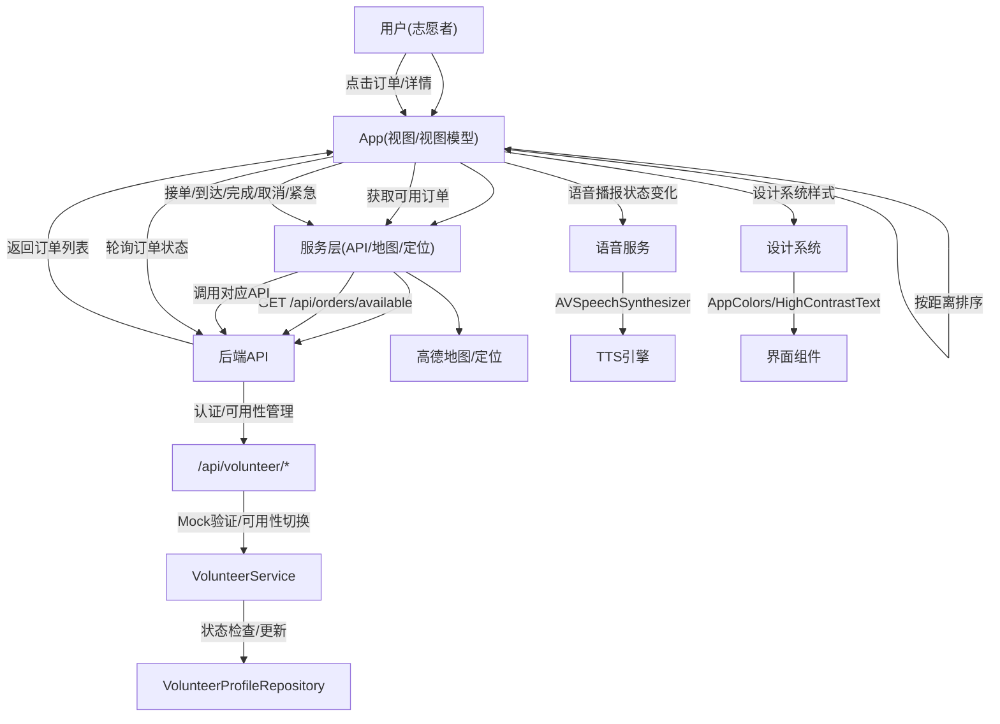

**图表来源**
- [04-user-flows-and-state-machine.md: 180-228:180-228](file://docs/04-user-flows-and-state-machine.md#L180-L228)
- [08-ios-architecture.md: 68-83:68-83](file://docs/08-ios-architecture.md#L68-L83)
- [SpeechService.swift: 87-103:87-103](file://blindRun/Voice/SpeechService.swift#L87-L103)

**章节来源**
- [04-user-flows-and-state-machine.md: 180-228:180-228](file://docs/04-user-flows-and-state-machine.md#L180-L228)
- [08-ios-architecture.md: 68-83:68-83](file://docs/08-ios-architecture.md#L68-L83)

## 详细组件分析

### 志愿者首页实现（VOL_Home）
- 功能要点
  - 完整实现的首页界面，包含地图背景、状态覆盖层、附近订单面板和底部导航入口。
  - 支持实时地图标注显示附近可接订单，标注包含盲人昵称和地址信息。
  - 集成高对比度文本组件，支持动态字体大小和无障碍标签。
  - 底部导航包含订单、记录、积分、设置四个入口。
- 技术实现
  - 采用 GeometryReader 和 ZStack 布局，实现地图背景和底部面板的层次结构。
  - 使用 MapViewWrapper 组件集成高德地图，支持用户位置显示和标注。
  - 通过 VolunteerHomeStatusOverlay 组件显示志愿者状态、积分、订单数量等信息。
  - 底部导航使用 HStack 和 NavigationLink 实现，支持无障碍访问。
- 核心功能
  - 实时加载附近可接订单，最多显示前3个订单。
  - 支持手动刷新和下拉刷新。
  - 可服务开关控制，需要认证通过后才能使用。
  - 定位权限检查，未授权时隐藏距离信息。

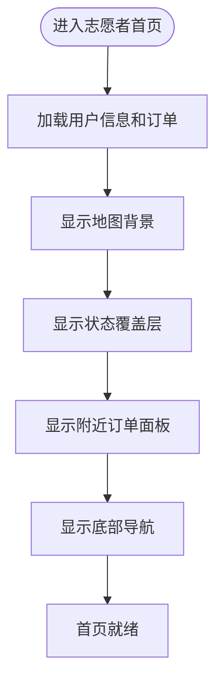

**章节来源**
- [VolunteerHomeView.swift: 111-489:111-489](file://blindRun/Volunteer/VolunteerHomeView.swift#L111-L489)

### 志愿者订单流程实现（VOL_OrderFlow）
- 订单发现阶段
  - 通过 `/api/orders/available` 接口获取所有可接订单。
  - 使用 `VolunteerAvailableOrderRow.sortedRows` 方法按距离排序。
  - 支持地图标注显示订单位置，标注包含盲人昵称和地址。
  - 未授权定位时显示"距离隐藏"，无法接单。
- 接单阶段
  - 接单前执行 `VolunteerOrderActionGuard.acceptBlockMessage` 状态检查。
  - 检查内容包括：资料完整性、认证状态、可用性状态、定位权限。
  - 接单成功后显示盲人联系方式，状态变更为 `accepted`。
- 到达确认阶段
  - 志愿者点击"我已到达"，调用 `/api/orders/{orderId}/arrive` 接口。
  - 状态变更为 `arrived`，等待盲人确认开始服务。
- 服务进行阶段
  - 支持紧急求助功能，调用 `/api/orders/{orderId}/emergency` 接口。
  - 实现轮询机制，每5秒检查一次订单状态。
  - 服务开始时语音播报"服务已开始"。
- 完成处理阶段
  - 志愿者点击"结束服务"，弹出服务总结输入框。
  - 输入完成后调用 `/api/orders/{orderId}/complete` 接口。
  - 状态变更为 `completed`，获得 +100 积分奖励。
  - 自动更新用户信息，包含新的积分余额。

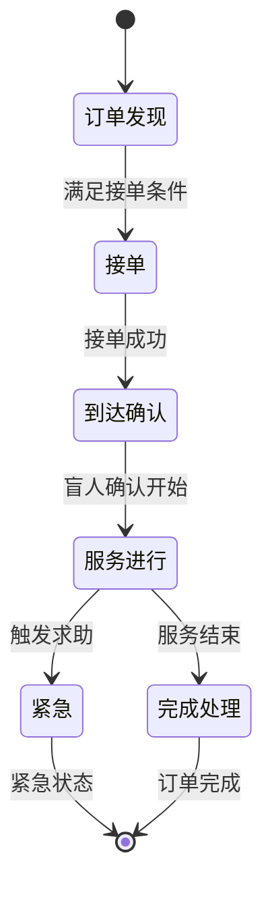

**章节来源**
- [VolunteerOrderFlowViews.swift: 156-412:156-412](file://blindRun/Volunteer/VolunteerOrderFlowViews.swift#L156-L412)
- [VolunteerOrderFlowViews.swift: 578-695:578-695](file://blindRun/Volunteer/VolunteerOrderFlowViews.swift#L578-L695)

### 无障碍语音服务集成（SpeechService）
- 服务架构
  - 集中式 TTS 服务，使用 AVSpeechSynthesizer 播报状态变化和错误提示。
  - 通过记录上次播报状态，避免轮询时重复播报同一状态。
  - 实现 AVSpeechSynthesizerDelegate 协议，监听播放状态变化。
- 核心功能
  - 文本播报：支持任意字符串的语音播报。
  - 状态播报：根据订单状态生成对应的中文播报内容。
  - 重复播报：支持"重复当前状态"按钮功能。
  - 错误播报：专门处理错误信息的语音提示。
- 状态映射
  - matching：预约已提交，正在等待志愿者接单。
  - accepted：志愿者已接单，请等待志愿者到达。
  - arrived：志愿者已到达，请确认开始服务。
  - inProgress：服务已开始，请注意安全。
  - completed：服务已完成，感谢使用助盲跑。
  - cancelled：本次预约已取消。
  - emergency：已进入求助状态，系统已记录本次异常。

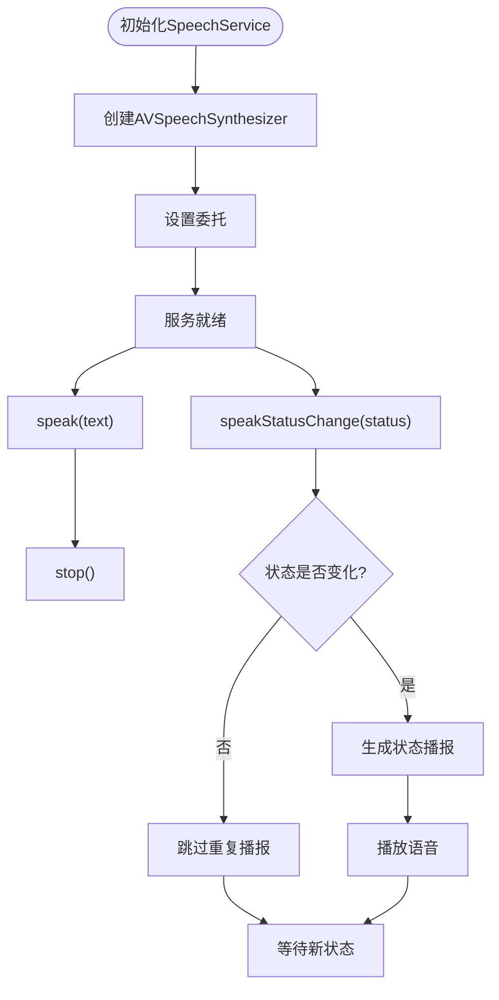

**图表来源**
- [SpeechService.swift: 87-103:87-103](file://blindRun/Voice/SpeechService.swift#L87-L103)

**章节来源**
- [SpeechService.swift: 7-104:7-104](file://blindRun/Voice/SpeechService.swift#L7-L104)
- [09-accessibility-and-voice-guidelines.md: 13-35:13-35](file://docs/09-accessibility-and-voice-guidelines.md#L13-L35)

### 设计系统样式保持（Design System）
- 颜色系统（AppColors）
  - 主色调：蓝色（primary）
  - 危险色：红色（destructive）
  - 背景色：系统背景色（background）
  - 次背景色：二级系统背景色（secondaryBackground）
  - 文本色：标签/次标签颜色（textPrimary/textSecondary）
  - 成功色：绿色（success）
  - 警告色：橙色（warning）
- 字体系统（AppFonts）
  - 大标题：largeTitle，加粗
  - 标题：title，加粗
  - 正文：body
  - 辅助说明：caption
  - 主按钮：title3，加粗
- 高对比度文本（HighContrastText）
  - 支持四种样式：title/body/status/caption
  - 自动适配系统深色/浅色模式
  - 支持动态字体大小（Accessibility 3号字）
  - 每个文本组件都有无障碍标签
- 主按钮（PrimaryButton）
  - 最小高度 64pt，符合无障碍要求
  - 支持普通和危险操作两种样式
  - 加载状态显示进度指示器
  - 完整的无障碍属性配置

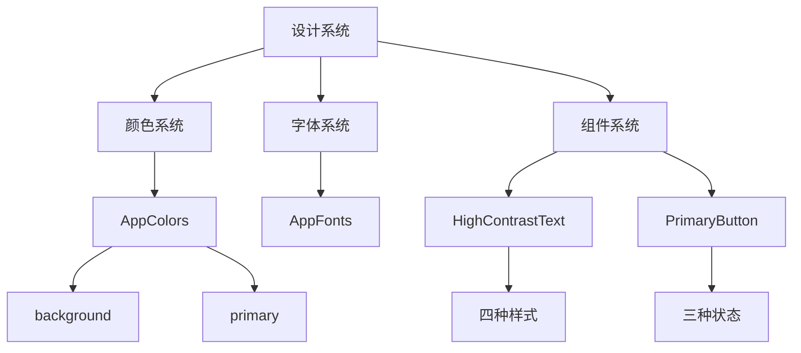

**图表来源**
- [AppColors.swift: 5-14:5-14](file://blindRun/Core/DesignSystem/AppColors.swift#L5-L14)
- [HighContrastText.swift: 11-34:11-34](file://blindRun/Core/DesignSystem/HighContrastText.swift#L11-L34)
- [PrimaryButton.swift: 7-45:7-45](file://blindRun/Core/DesignSystem/PrimaryButton.swift#L7-L45)

**章节来源**
- [AppColors.swift: 1-39:1-39](file://blindRun/Core/DesignSystem/AppColors.swift#L1-L39)
- [HighContrastText.swift: 1-59:1-59](file://blindRun/Core/DesignSystem/HighContrastText.swift#L1-L59)
- [PrimaryButton.swift: 1-56:1-56](file://blindRun/Core/DesignSystem/PrimaryButton.swift#L1-L56)

### 可用性管理与认证流程
- 认证要求
  - 志愿者需完成 Mock 认证，使"验证状态"和"管理员复审状态"均变为"已批准"。
  - 仅当"可服务开关"开启时，才允许接单。
- 状态检查与错误处理
  - 若未通过 Mock 审核，尝试接单将收到"志愿者未审核通过"的错误。
  - 若已审核但未开启可服务，尝试接单将收到"志愿者不可用"的错误。
- Mock 认证
  - 提供一键 Mock 审批动作，用于演示与联调。
  - 后端提供 `/api/volunteer/mock-verification/approve` 接口支持。

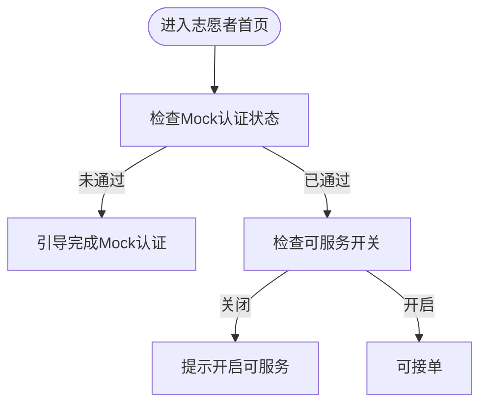

**章节来源**
- [volunteer-order-flow/spec.md: 3-22:3-22](file://openspec/changes/add-aidrun-ios-spring-mvp/specs/volunteer-order-flow/spec.md#L3-L22)

### 可接订单的获取与排序机制
- 数据来源
  - 通过"获取可用订单"接口返回处于"匹配中"的订单集合。
- 排序策略
  - 使用志愿者当前位置到订单起点坐标的距离进行本地排序，最近的订单排在最前面。
- 位置与权限
  - 需要定位权限；若拒绝则阻断距离排序与接单流程；提供演示用默认坐标以保证演示稳定性。
- 隐私保护
  - 返回的订单信息隐藏敏感字段（如盲人电话、紧急联系人），仅展示非敏感信息。

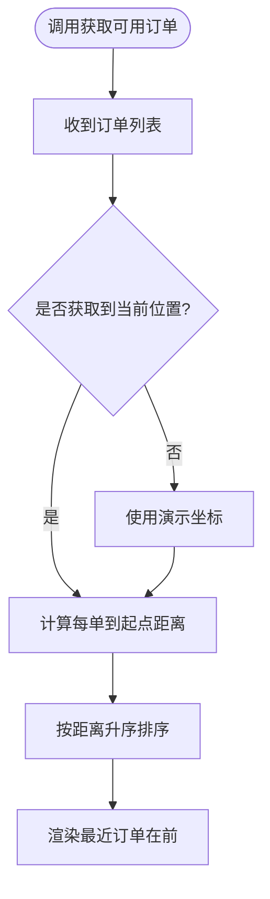

**章节来源**
- [amap-location/spec.md: 23-38:23-38](file://openspec/changes/add-aidrun-ios-spring-mvp/specs/amap-location/spec.md#L23-L38)
- [volunteer-order-flow/spec.md: 23-30:23-30](file://openspec/changes/add-aidrun-ios-spring-mvp/specs/volunteer-order-flow/spec.md#L23-L30)

### 订单详情页面与操作流程
- 页面内容
  - 展示订单基本信息（起点、预约时间、备注等），隐藏敏感信息。
  - 提供操作入口：接单、查看地图、到达、完成、取消、紧急。
- 接单流程
  - 成功接单后，状态从"匹配中"变为"已接单"，并显示盲人联系方式与"查看地图"按钮。
- 到达与服务开始
  - 志愿者点击"我已到达"，状态变为"已到达"；等待盲人确认开始服务。
- 服务完成与取消
  - 志愿者点击"结束服务"，调用完成接口，状态进入"已完成"；完成后可获得积分奖励。
  - 取消仅限服务开始前，服务开始后仅能触发"紧急"。
- 紧急求助
  - 任一方均可触发紧急求助，订单进入"紧急"终态，无法恢复。

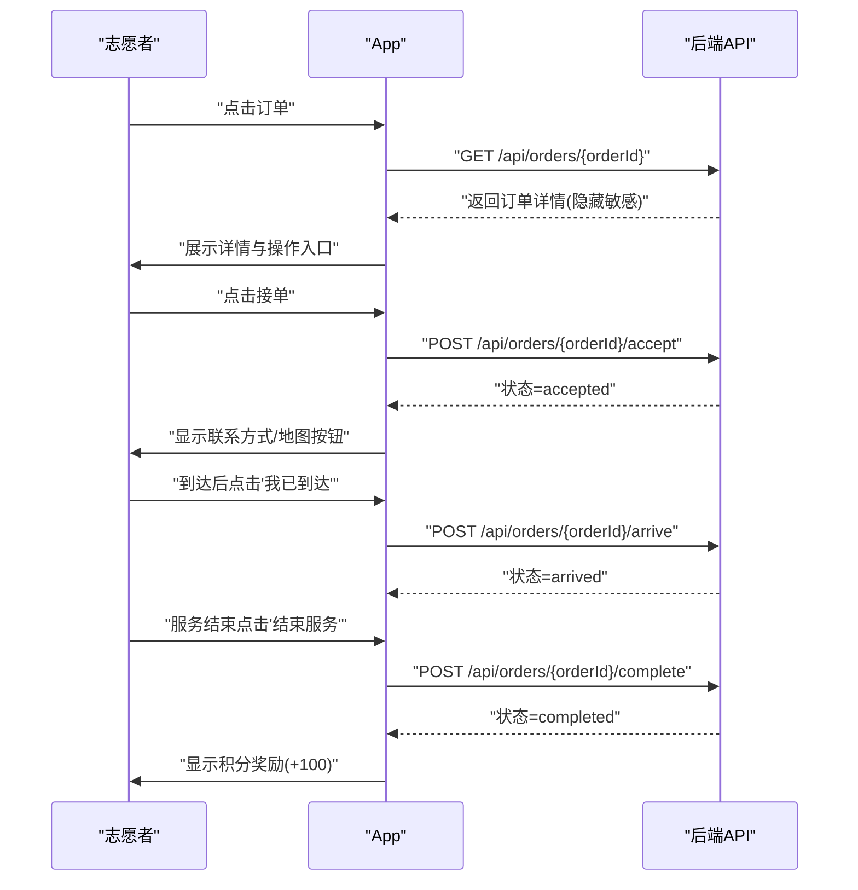

**图表来源**
- [04-user-flows-and-state-machine.md: 180-228:180-228](file://docs/04-user-flows-and-state-machine.md#L180-L228)

**章节来源**
- [04-user-flows-and-state-machine.md: 180-228:180-228](file://docs/04-user-flows-and-state-machine.md#L180-L228)
- [volunteer-order-flow/spec.md: 31-38:31-38](file://openspec/changes/add-aidrun-ios-spring-mvp/specs/volunteer-order-flow/spec.md#L31-L38)

### 服务记录管理与评价系统
- 服务记录
  - 完成服务后生成记录，包含服务时间、盲人昵称、起点、状态与获得的积分。
  - 志愿者可在"服务记录页"查看历史订单。
- 评价系统
  - MVP 中提供可选的评价入口，不强制要求；后续版本可扩展为必填项。

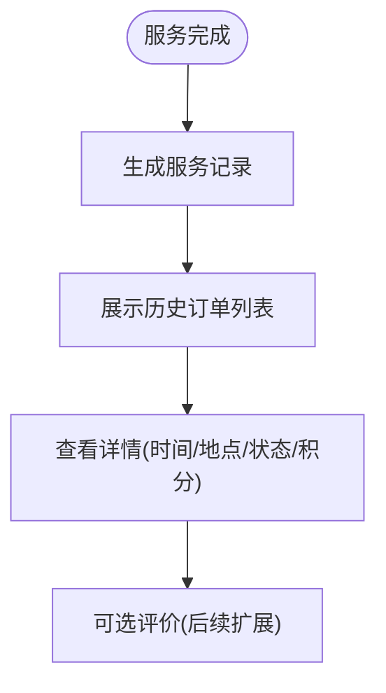

**章节来源**
- [volunteer-points/spec.md: 11-26:11-26](file://openspec/changes/add-aidrun-ios-spring-mvp/specs/volunteer-points/spec.md#L11-L26)

### 志愿者积分系统
- 奖励规则
  - 完成一次服务后奖励固定积分（例如 +100）。
- 查询与展示
  - 在"积分/商城占位页"展示累计积分与历史明细；商品为占位展示，不支持兑换。
- 积分管理
  - 后端维护志愿者积分余额和详细的积分流水记录。

**章节来源**
- [volunteer-points/spec.md: 3-18:3-18](file://openspec/changes/add-aidrun-ios-spring-mvp/specs/volunteer-points/spec.md#L3-L18)

### 认证与登录（Mock 审核与状态检查）
- 登录与令牌
  - 支持手机号 + 固定验证码（123456）登录，返回 JWT；首次登录可能未设置 activeRole，需进入角色选择。
- Mock 审核
  - 提供 Mock 认证动作，将"验证状态"和"管理员复审状态"置为"已批准"，随后开启"可服务"即可接单。
  - 后端提供 `/api/volunteer/mock-verification/approve` 接口支持。
- 状态检查
  - 尝试接单前检查 Mock 审核与可用性状态，不符合条件则提示并阻止接单。
  - 后端通过 `validateVolunteerCanAcceptOrder` 方法执行完整的状态检查。

**章节来源**
- [auth-phone-login/spec.md: 3-30:3-30](file://openspec/changes/add-aidrun-ios-spring-mvp/specs/auth-phone-login/spec.md#L3-L30)
- [volunteer-order-flow/spec.md: 15-22:15-22](file://openspec/changes/add-aidrun-ios-spring-mvp/specs/volunteer-order-flow/spec.md#L15-L22)

## 后端志愿者服务实现

### 志愿者控制器（VolunteerController）
- REST API 接口
  - POST `/api/volunteer/mock-verification/approve`：执行 Mock 认证审批
  - PATCH `/api/volunteer/availability`：更新志愿者可用性状态
- 安全控制
  - 所有接口都需要认证用户身份
  - 使用 Spring Security 进行权限验证
- 请求响应
  - 返回标准化的志愿者档案 DTO
  - 包含认证状态、可用性状态和基本信息

**章节来源**
- [VolunteerController.java: 15-40:15-40](file://backend/src/main/java/com/aidrun/backend/volunteer/VolunteerController.java#L15-L40)

### 志愿者服务（VolunteerService）
- Mock 认证审批
  - 将志愿者的验证状态和管理员复审状态都设置为 APPROVED
  - 支持幂等操作，重复调用不会产生副作用
- 可用性状态管理
  - 检查志愿者是否已通过认证
  - 更新志愿者的可用性标志位
  - 返回更新后的志愿者档案
- 状态验证
  - `validateVolunteerCanAcceptOrder` 方法执行完整的接单前验证
  - 检查认证状态和可用性状态
  - 抛出相应的业务异常

**章节来源**
- [VolunteerService.java: 15-89:15-89](file://backend/src/main/java/com/aidrun/backend/volunteer/VolunteerService.java#L15-L89)

### 数据模型与状态枚举

#### 志愿者档案（VolunteerProfile）
- 核心字段
  - 用户关联：一对一关联 AppUser
  - 昵称和电话号码
  - 验证状态：NOT_SUBMITTED/PENDING/APPROVED/REJECTED
  - 管理员复审状态：NOT_SUBMITTED/PENDING/APPROVED/REJECTED
  - 可用性标志位：true/false
  - 积分余额：整数类型
- 关系映射
  - 使用 JPA 注解定义实体关系
  - 设置唯一约束和非空约束

**章节来源**
- [VolunteerProfile.java: 14-107:14-107](file://backend/src/main/java/com/aidrun/backend/profile/VolunteerProfile.java#L14-L107)

#### 状态枚举
- VerificationStatus（验证状态）
  - wireValue：字符串表示形式
  - 支持 JSON 序列化和反序列化
  - 枚举值：not_submitted/pending/approved/rejected
- AdminReviewStatus（管理员复审状态）
  - wireValue：字符串表示形式
  - 支持 JSON 序列化和反序列化
  - 枚举值：not_submitted/pending/approved/rejected

**章节来源**
- [VerificationStatus.java: 6-33:6-33](file://backend/src/main/java/com/aidrun/backend/profile/VerificationStatus.java#L6-L33)
- [AdminReviewStatus.java: 6-33:6-33](file://backend/src/main/java/com/aidrun/backend/profile/AdminReviewStatus.java#L6-L33)

### 错误处理与业务异常

#### 错误码定义（ErrorCode）
- 业务错误码
  - PROFILE_INCOMPLETE：资料不完整
  - VOLUNTEER_NOT_APPROVED：志愿者未审核通过
  - VOLUNTEER_NOT_AVAILABLE：志愿者不可用
  - VALIDATION_FAILED：验证失败
  - UNAUTHORIZED：未授权
- 错误码特性
  - 支持 JSON 序列化和反序列化
  - 提供 wireValue 映射

#### API 异常（ApiException）
- 异常结构
  - 包含错误码和 HTTP 状态码
  - 继承 RuntimeException
- 使用场景
  - 业务规则违反时抛出
  - 与全局异常处理器配合使用

**章节来源**
- [ErrorCode.java: 6-41:6-41](file://backend/src/main/java/com/aidrun/backend/common/error/ErrorCode.java#L6-L41)
- [ApiException.java: 5-24:5-24](file://backend/src/main/java/com/aidrun/backend/common/error/ApiException.java#L5-L24)

### API 测试覆盖

#### Mock 验证测试
- 基本功能测试
  - 有档案的志愿者调用 Mock 验证返回 200
  - 无档案的志愿者调用返回 400 PROFILE_INCOMPLETE
  - 未携带令牌调用返回 401
- 幂等性测试
  - 重复调用返回相同结果
  - 不会产生副作用

#### 可用性状态测试
- 正常状态切换
  - 通过认证后开启可用性返回 200
  - 开启后再关闭返回 200
- 权限控制测试
  - 未通过认证调用返回 403 VOLUNTEER_NOT_APPROVED
  - 无档案调用返回 400 PROFILE_INCOMPLETE
  - 未携带令牌调用返回 401
- 参数验证测试
  - 缺少 isAvailable 参数返回 400 VALIDATION_FAILED

**章节来源**
- [VolunteerControllerIntegrationTest.java: 56-250:56-250](file://backend/src/test/java/com/aidrun/backend/volunteer/VolunteerControllerIntegrationTest.java#L56-L250)

## 依赖关系分析
- 组件耦合
  - 志愿者首页依赖设计系统（颜色、字体、文本组件）和语音服务模块。
  - 可用性管理依赖认证模块和订单模块。
  - 订单详情页依赖地图模块、语音服务和轮询机制。
  - 后端服务依赖用户认证、档案管理和错误处理框架。
- 外部依赖
  - 后端 API：订单 CRUD、状态变更、可用订单列表、志愿者认证管理。
  - 高德地图：地图展示、定位、距离计算。
  - 语音服务：AVSpeechSynthesizer 语音合成。
  - Spring Framework：依赖注入、事务管理、异常处理。
- 轮询与状态机
  - 订单详情页在特定状态下（accepted/arrived/in_progress）进行轮询，确保双方状态一致。

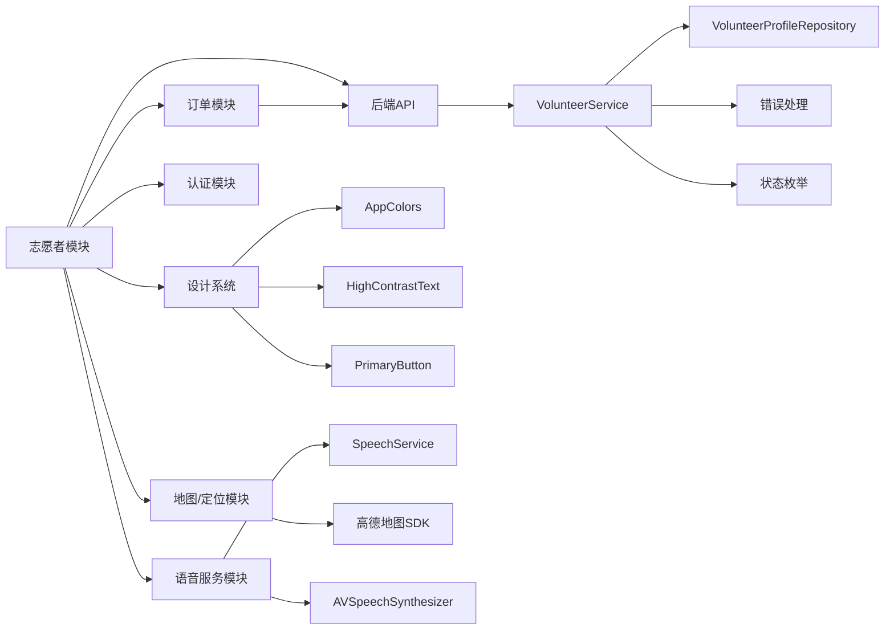

**图表来源**
- [08-ios-architecture.md: 26-31:26-31](file://docs/08-ios-architecture.md#L26-L31)
- [04-user-flows-and-state-machine.md: 275-299:275-299](file://docs/04-user-flows-and-state-machine.md#L275-L299)

**章节来源**
- [08-ios-architecture.md: 26-31:26-31](file://docs/08-ios-architecture.md#L26-L31)
- [04-user-flows-and-state-machine.md: 275-299:275-299](file://docs/04-user-flows-and-state-machine.md#L275-L299)

## 性能考虑
- 轮询频率与范围
  - 仅在订单相关页面进行轮询，周期为 5 秒；状态稳定时不刷新 UI，减少不必要的重绘。
- 排序与计算
  - 距离计算在本地完成，避免频繁网络请求；建议对坐标缓存与去抖处理，降低计算开销。
- 地图与定位
  - 仅在需要时启用定位与地图渲染；在权限被拒时提前阻断，避免无效调用。
- 令牌与环境
  - 使用 UserDefaults 存储 JWT（MVP），生产环境需迁移到 Keychain；环境切换通过统一客户端抽象屏蔽。
- 语音服务优化
  - 通过 lastSpokenStatus 避免重复播报，减少语音资源浪费。
  - 使用 stopSpeaking(at: .immediate) 及时中断不需要的语音播报。
- 后端性能优化
  - 事务管理确保数据一致性
  - 枚举类型减少数据库存储空间
  - 幂等操作设计避免重复处理

**章节来源**
- [08-ios-architecture.md: 125-139:125-139](file://docs/08-ios-architecture.md#L125-L139)
- [08-ios-architecture.md: 78-83:78-83](file://docs/08-ios-architecture.md#L78-L83)
- [SpeechService.swift: 34-38:34-38](file://blindRun/Voice/SpeechService.swift#L34-L38)

## 故障排查指南
- 无法接单
  - 检查 Mock 审核状态与"可服务开关"是否都已开启。
  - 若提示"志愿者未审核通过/不可用"，请先完成 Mock 审核并开启可服务。
  - 检查后端日志确认 API 调用是否成功。
- 订单列表为空或无排序
  - 确认已授予定位权限；若权限被拒，将无法计算距离与排序。
  - 检查网络与后端可用订单接口是否正常。
  - 验证志愿者档案是否完整。
- 状态不同步
  - 确认当前页面处于轮询范围内；离开页面或订单进入终态（completed/cancelled/emergency）会停止轮询。
- 紧急状态
  - 一旦进入紧急状态，订单不可恢复；双方均会收到状态更新与语音提示。
- 语音播报问题
  - 检查设备语音设置和系统无障碍功能。
  - 确认 SpeechService 初始化正确，lastSpokenStatus 未被意外重置。
- 设计系统样式问题
  - 检查 AppColors 配置是否正确。
  - 确认 HighContrastText 的样式参数和无障碍标签设置。
- 后端 API 问题
  - 检查认证令牌是否有效
  - 验证志愿者档案是否存在且完整
  - 查看错误码确定具体问题类型

**章节来源**
- [volunteer-order-flow/spec.md: 7-14:7-14](file://openspec/changes/add-aidrun-ios-spring-mvp/specs/volunteer-order-flow/spec.md#L7-L14)
- [04-user-flows-and-state-machine.md: 230-257:230-257](file://docs/04-user-flows-and-state-machine.md#L230-L257)
- [04-user-flows-and-state-machine.md: 301-309:301-309](file://docs/04-user-flows-and-state-machine.md#L301-L309)
- [SpeechService.swift: 40-62:40-62](file://blindRun/Voice/SpeechService.swift#L40-L62)

## 结论
志愿者模块现已实现完整的前后端协同功能，包括认证管理、可用性控制、Mock验证和积分系统。后端提供了完善的API接口和业务逻辑，前端集成了完整的UI组件和无障碍服务。模块围绕"认证—可用性—附近订单—接单—服务—记录—积分"的完整闭环构建，结合MVVM架构与高德地图能力，实现了真实地图、定位与本地距离排序。通过明确的状态机与轮询策略，保障了双方状态一致性与用户体验。

**更新** 随着后端志愿者服务的完善实现和新增的1778行VolunteerOrderFlowViews.swift文件，志愿者模块现在具备了完整的业务功能支持，包括完整的订单管理流程、状态检查机制、地图集成和语音服务，为后续的完整功能开发奠定了坚实基础。

## 附录
- 工作流程示例（志愿者正向流程）
  - 登录后进入志愿者首页，Mock 审核通过并开启可服务，查看附近订单并按距离排序，点击订单进入详情，接单后到达并等待盲人确认开始，服务结束后完成并获得积分。
- 状态管理策略
  - 使用状态机约束流转，禁止服务开始后的普通取消；紧急状态为终态，不支持恢复。
- API 与轮询清单
  - 获取可用订单、订单详情、接单、到达、确认开始、完成、紧急、轮询等。
  - 后端 API：`/api/volunteer/mock-verification/approve`、`/api/volunteer/availability`
- 设计系统使用规范
  - 颜色使用：primary/destructive/background/secondaryBackground/textPrimary/textSecondary/success/warning
  - 字体使用：largeTitle/title/body/caption/primaryButton
  - 组件使用：HighContrastText、PrimaryButton，确保无障碍兼容性。
- 语音服务集成规范
  - 使用单例 SpeechService，避免重复创建。
  - 状态播报通过状态映射表统一管理。
  - 重复当前状态功能通过 repeatCurrentStatus 方法实现。
- 后端服务规范
  - 使用 Spring Boot 注解驱动的 REST API
  - 事务管理确保数据一致性
  - 枚举类型提供类型安全的状态管理
  - 全面的单元测试覆盖关键业务场景

**章节来源**
- [04-user-flows-and-state-machine.md: 180-228:180-228](file://docs/04-user-flows-and-state-machine.md#L180-L228)
- [04-user-flows-and-state-machine.md: 72-119:72-119](file://docs/04-user-flows-and-state-machine.md#L72-L119)
- [04-user-flows-and-state-machine.md: 275-299:275-299](file://docs/04-user-flows-and-state-machine.md#L275-L299)
- [AppColors.swift: 5-14:5-14](file://blindRun/Core/DesignSystem/AppColors.swift#L5-L14)
- [HighContrastText.swift: 17-33:17-33](file://blindRun/Core/DesignSystem/HighContrastText.swift#L17-L33)
- [PrimaryButton.swift: 13-23:13-23](file://blindRun/Core/DesignSystem/PrimaryButton.swift#L13-L23)
- [SpeechService.swift: 32-47:32-47](file://blindRun/Voice/SpeechService.swift#L32-L47)
- [VolunteerController.java: 25-40:25-40](file://backend/src/main/java/com/aidrun/backend/volunteer/VolunteerController.java#L25-L40)
- [VolunteerService.java: 24-88:24-88](file://backend/src/main/java/com/aidrun/backend/volunteer/VolunteerService.java#L24-L88)