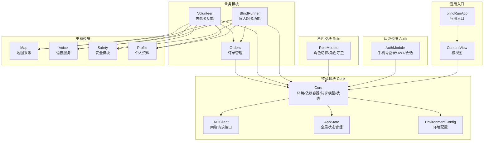
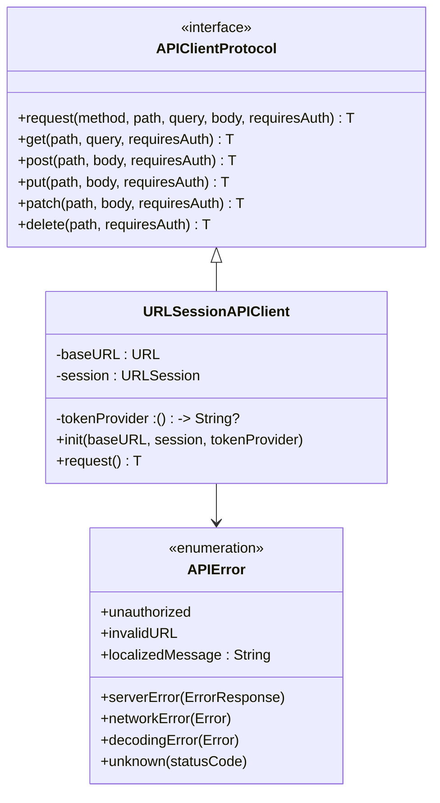
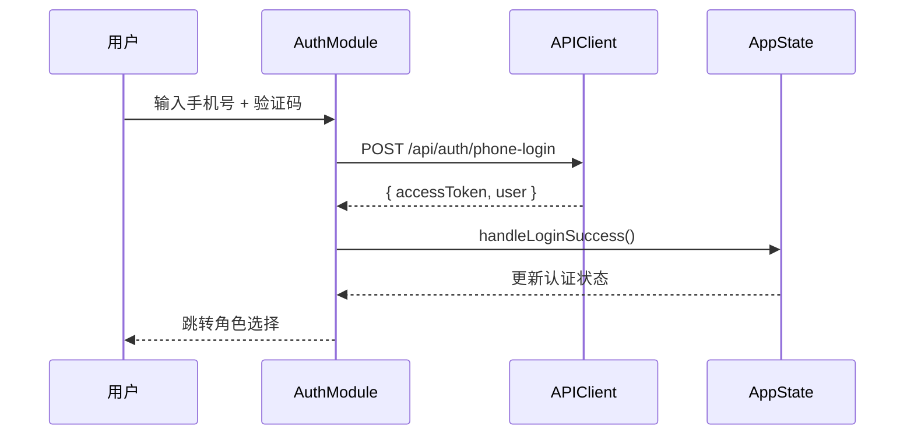
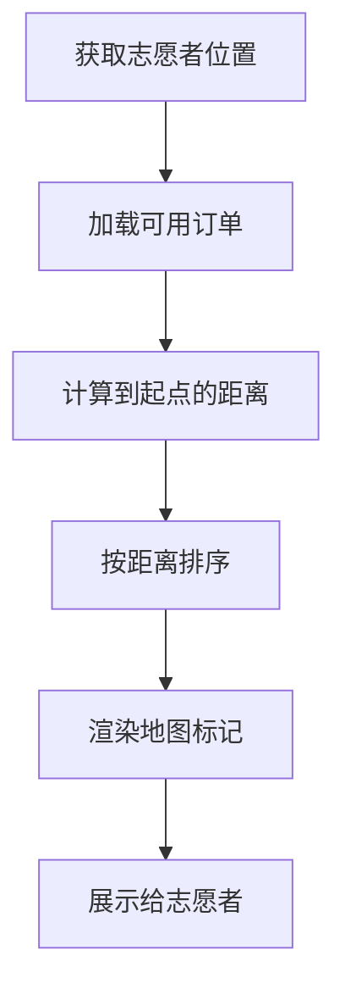
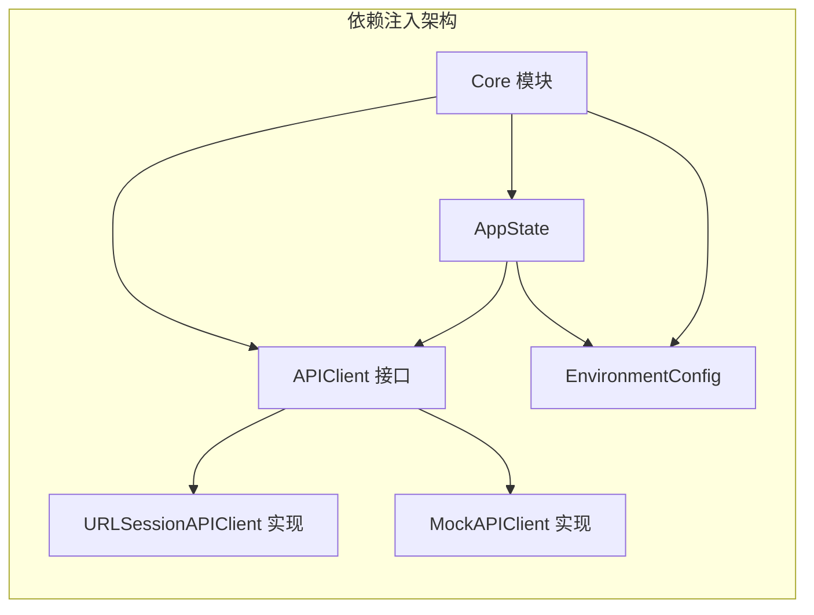
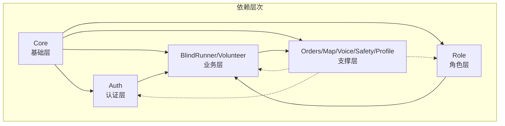

# 模块化架构设计

<cite>
**本文档引用的文件**
- [blindRunApp.swift](file://blindRun/blindRun/blindRunApp.swift)
- [ContentView.swift](file://blindRun/blindRun/ContentView.swift)
- [AuthModule.swift](file://blindRun/blindRun/Auth/AuthModule.swift)
- [RoleModule.swift](file://blindRun/blindRun/Role/RoleModule.swift)
- [BlindRunnerModule.swift](file://blindRun/blindRun/BlindRunner/BlindRunnerModule.swift)
- [VolunteerModule.swift](file://blindRun/blindRun/Volunteer/VolunteerModule.swift)
- [OrdersModule.swift](file://blindRun/blindRun/Orders/OrdersModule.swift)
- [MapModule.swift](file://blindRun/blindRun/Map/MapModule.swift)
- [SpeechService.swift](file://blindRun/blindRun/Voice/SpeechService.swift)
- [SafetyModule.swift](file://blindRun/blindRun/Safety/SafetyModule.swift)
- [ProfileModule.swift](file://blindRun/blindRun/Profile/ProfileModule.swift)
- [APIClient.swift](file://blindRun/blindRun/Core/APIClient.swift)
- [AppState.swift](file://blindRun/blindRun/Core/AppState.swift)
- [EnvironmentConfig.swift](file://blindRun/blindRun/Core/EnvironmentConfig.swift)
- [08-ios-architecture.md](file://docs/08-ios-architecture.md)
- [04-user-flows-and-state-machine.md](file://docs/04-user-flows-and-state-machine.md)
</cite>

## 更新摘要
**所做更改**
- 新增了完整的模块化架构实现分析，包括各个功能模块的命名空间标记文件
- 更新了模块边界定义和依赖关系图
- 补充了 Core 模块的核心组件实现细节
- 增强了模块间通信机制的技术实现说明

## 目录
1. [简介](#简介)
2. [模块化架构概览](#模块化架构概览)
3. [核心模块详解](#核心模块详解)
4. [业务模块架构](#业务模块架构)
5. [支撑模块设计](#支撑模块设计)
6. [模块间通信机制](#模块间通信机制)
7. [依赖关系分析](#依赖关系分析)
8. [性能优化策略](#性能优化策略)
9. [故障排除指南](#故障排除指南)
10. [最佳实践建议](#最佳实践建议)
11. [结论](#结论)

## 简介
本文件为 blindRun 应用的模块化架构设计综合文档，基于最新的模块化实现，系统性阐述各功能模块的划分原则、职责边界、模块间通信机制、接口定义与数据传递方式。文档详细分析了 Core、Auth、Role、BlindRunner、Volunteer、Orders、Map、Voice、Safety、Profile 等模块的设计理念和实现细节，解释了模块化带来的代码复用、职责分离、测试隔离与团队协作等优势。

## 模块化架构概览
blindRun 采用 Swift Package Manager 和目录结构实现的模块化架构，每个功能模块都有独立的命名空间标记文件，体现了清晰的模块边界和职责分离。

**图表来源**
- [blindRunApp.swift:10-17](file://blindRun/blindRun/blindRunApp.swift#L10-L17)
- [ContentView.swift:10-20](file://blindRun/blindRun/ContentView.swift#L10-L20)
- [AuthModule.swift:1-3](file://blindRun/blindRun/Auth/AuthModule.swift#L1-L3)
- [RoleModule.swift:1-3](file://blindRun/blindRun/Role/RoleModule.swift#L1-L3)

## 核心模块详解

### Core 模块架构
Core 模块作为应用的基础层，提供了统一的依赖注入、状态管理和环境配置功能。

#### APIClient 接口设计
APIClient 协议定义了统一的网络请求接口，支持多种 HTTP 方法和认证机制。

**图表来源**
- [APIClient.swift:46-95](file://blindRun/blindRun/Core/APIClient.swift#L46-L95)
- [APIClient.swift:15-42](file://blindRun/blindRun/Core/APIClient.swift#L15-L42)

#### AppState 全局状态管理
AppState 类提供了统一的应用状态管理，包括用户会话、角色切换和环境配置。

**章节来源**
- [AppState.swift:9-123](file://blindRun/blindRun/Core/AppState.swift#L9-L123)
- [EnvironmentConfig.swift:5-65](file://blindRun/blindRun/Core/EnvironmentConfig.swift#L5-L65)

### 环境配置管理
EnvironmentConfig 模块提供了多环境支持，包括 Mock、本地后端和生产环境。

**章节来源**
- [EnvironmentConfig.swift:5-39](file://blindRun/blindRun/Core/EnvironmentConfig.swift#L5-L39)

## 业务模块架构

### Auth 模块实现
Auth 模块负责手机号登录、JWT 令牌管理和认证会话维护。

**图表来源**
- [AuthModule.swift:1-3](file://blindRun/blindRun/Auth/AuthModule.swift#L1-L3)
- [AppState.swift:80-84](file://blindRun/blindRun/Core/AppState.swift#L80-L84)

### Role 模块设计
Role 模块处理角色切换和角色守卫规则，支持在同一个 JWT 下切换 activeRole。

**章节来源**
- [RoleModule.swift:1-3](file://blindRun/blindRun/Role/RoleModule.swift#L1-L3)
- [AppState.swift:95-98](file://blindRun/blindRun/Core/AppState.swift#L95-L98)

### BlindRunner 模块功能
BlindRunner 模块提供盲人跑者的完整功能集，包括首页、资料管理、预约创建和订单状态跟踪。

**章节来源**
- [BlindRunnerModule.swift:1-3](file://blindRun/blindRun/BlindRunner/BlindRunnerModule.swift#L1-L3)

### Volunteer 模块实现
Volunteer 模块专注于志愿者功能，包括可用性管理、订单接取和服务记录。

**章节来源**
- [VolunteerModule.swift:1-3](file://blindRun/blindRun/Volunteer/VolunteerModule.swift#L1-L3)

### Orders 模块设计
Orders 模块提供订单 DTO 定义、状态机辅助和轮询机制。

**章节来源**
- [OrdersModule.swift:1-3](file://blindRun/blindRun/Orders/OrdersModule.swift#L1-L3)

## 支撑模块设计

### Map 模块架构
Map 模块提供高德地图集成、当前位置获取、标记管理和距离计算功能。

**图表来源**
- [MapModule.swift:1-3](file://blindRun/blindRun/Map/MapModule.swift#L1-L3)

### Voice 模块实现
Voice 模块提供集中式的 TTS 服务，使用 AVSpeechSynthesizer 播报状态变化和错误提示。

**章节来源**
- [SpeechService.swift:9-105](file://blindRun/blindRun/Voice/SpeechService.swift#L9-L105)

### Safety 模块设计
Safety 模块处理紧急求助和取消确认流程，仅在活跃服务准备或服务期间可用。

**章节来源**
- [SafetyModule.swift:1-3](file://blindRun/blindRun/Safety/SafetyModule.swift#L1-L3)

### Profile 模块实现
Profile 模块提供盲人跑者和志愿者的资料表单管理。

**章节来源**
- [ProfileModule.swift:1-3](file://blindRun/blindRun/Profile/ProfileModule.swift#L1-L3)

## 模块间通信机制

### 依赖注入模式
应用采用依赖注入模式，通过 Core 模块统一管理所有依赖关系。

**图表来源**
- [AppState.swift:41-54](file://blindRun/blindRun/Core/AppState.swift#L41-L54)
- [APIClient.swift:99-179](file://blindRun/blindRun/Core/APIClient.swift#L99-L179)

### 状态共享机制
通过 Combine 框架实现状态共享，所有模块都可以访问和监听应用状态变化。

**章节来源**
- [AppState.swift:15-25](file://blindRun/blindRun/Core/AppState.swift#L15-L25)

## 依赖关系分析

### 模块耦合度分析
模块间遵循高内聚低耦合原则，通过接口和协议实现松耦合设计。

**图表来源**
- [APIClient.swift:46-54](file://blindRun/blindRun/Core/APIClient.swift#L46-L54)
- [AppState.swift:36-41](file://blindRun/blindRun/Core/AppState.swift#L36-L41)

### 关键依赖链路
- BlindRunner/Volunteer 依赖 Orders 模块进行业务编排
- 所有模块都依赖 Core 提供的基础服务
- 支撑模块为业务模块提供横切关注点

**章节来源**
- [AppState.swift:68-98](file://blindRun/blindRun/Core/AppState.swift#L68-L98)

## 性能优化策略

### 轮询优化
- 仅在相关页面启用 5 秒轮询
- 离开页面自动停止轮询
- 避免无谓的网络请求和 CPU 开销

### 本地计算优先
- 距离排序在 iOS 侧完成
- 减少不必要的网络往返
- 提升用户体验

### 缓存策略
- 使用 UserDefaults 存储 JWT（MVP 版本）
- 生产环境计划迁移到 Keychain
- 合理利用 TTS 缓存和错误映射

**章节来源**
- [EnvironmentConfig.swift:58-63](file://blindRun/blindRun/Core/EnvironmentConfig.swift#L58-L63)

## 故障排除指南

### 常见问题诊断
- **登录失败**：检查验证码格式、API 环境配置和 baseURL 设置
- **角色切换阻断**：确认是否存在活跃订单状态
- **订单轮询异常**：验证页面状态和网络连接
- **地图定位问题**：检查定位权限和高德密钥配置

### 调试技巧
- 使用 ContentView 中的环境切换按钮
- 通过 AppState 的日志输出调试状态变化
- 利用 Mock 模式进行离线开发

**章节来源**
- [ContentView.swift:33-50](file://blindRun/blindRun/ContentView.swift#L33-L50)
- [AppState.swift:71-77](file://blindRun/blindRun/Core/AppState.swift#L71-L77)

## 最佳实践建议

### 模块扩展策略
- 坚持单一职责原则，每个模块专注一个功能领域
- 通过协议抽象实现可测试性和可替换性
- 使用依赖注入确保模块间的松耦合

### 代码组织规范
- 每个模块使用独立的命名空间标记文件
- 统一的错误处理和状态管理模式
- 明确的模块边界和接口契约

### 测试策略
- ViewModel 使用可测试的依赖注入
- 对轮询、TTS、定位等外部依赖进行隔离测试
- 利用 Mock 模式进行单元测试

**章节来源**
- [APIClient.swift:46-95](file://blindRun/blindRun/Core/APIClient.swift#L46-L95)
- [SpeechService.swift:22-52](file://blindRun/blindRun/Voice/SpeechService.swift#L22-L52)

## 结论
blindRun 的模块化架构通过清晰的模块边界、统一的依赖注入和标准化的接口设计，实现了良好的代码复用、职责分离、测试隔离和团队协作。Core 模块提供统一的基础服务，Auth/Role 模块处理身份和角色管理，业务模块专注于具体功能实现，支撑模块提供横切关注点，整体架构具备优秀的扩展性和可维护性。随着各模块实现的逐步完善，应用将具备更强的功能完整性和更好的开发体验。