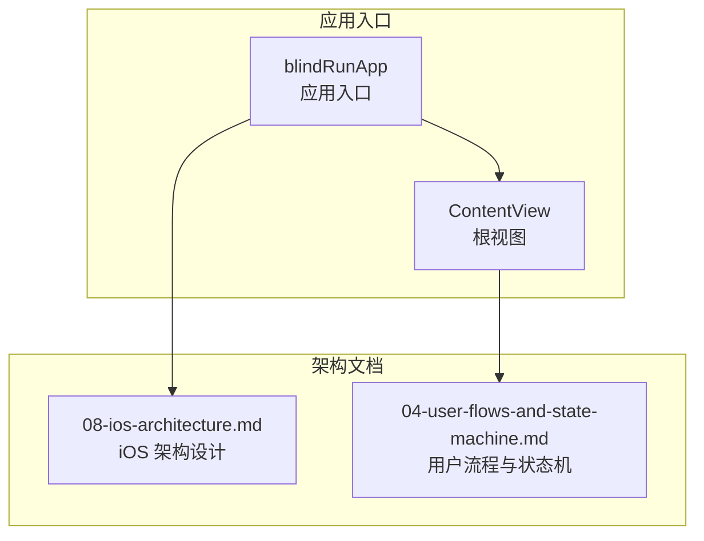
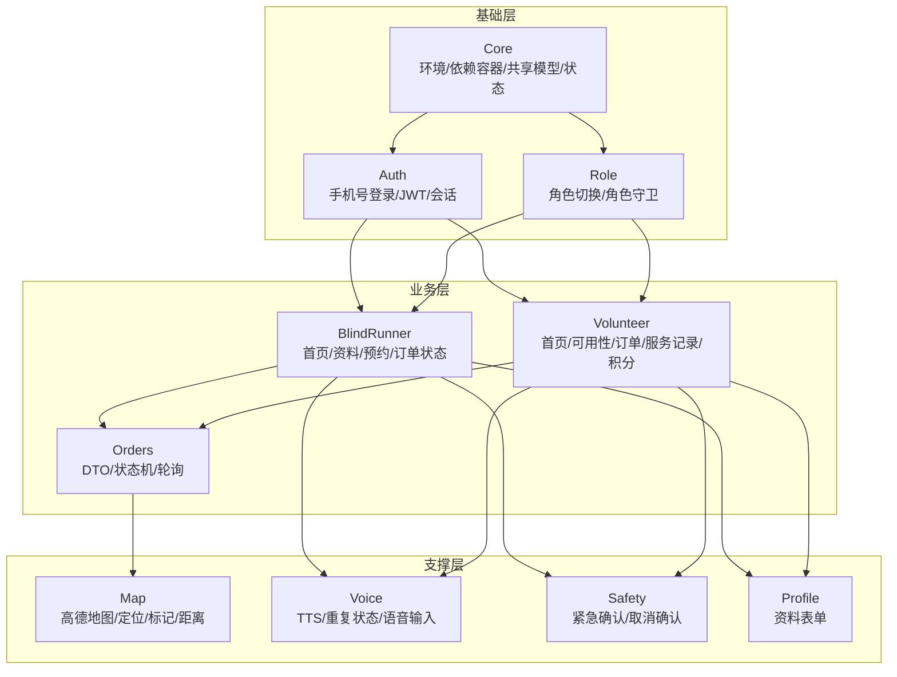
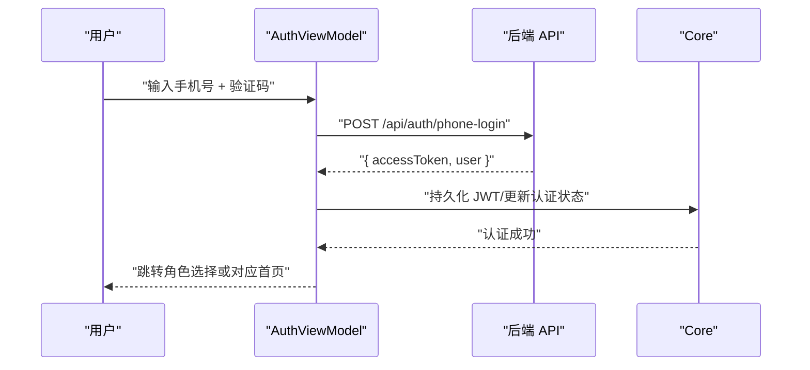
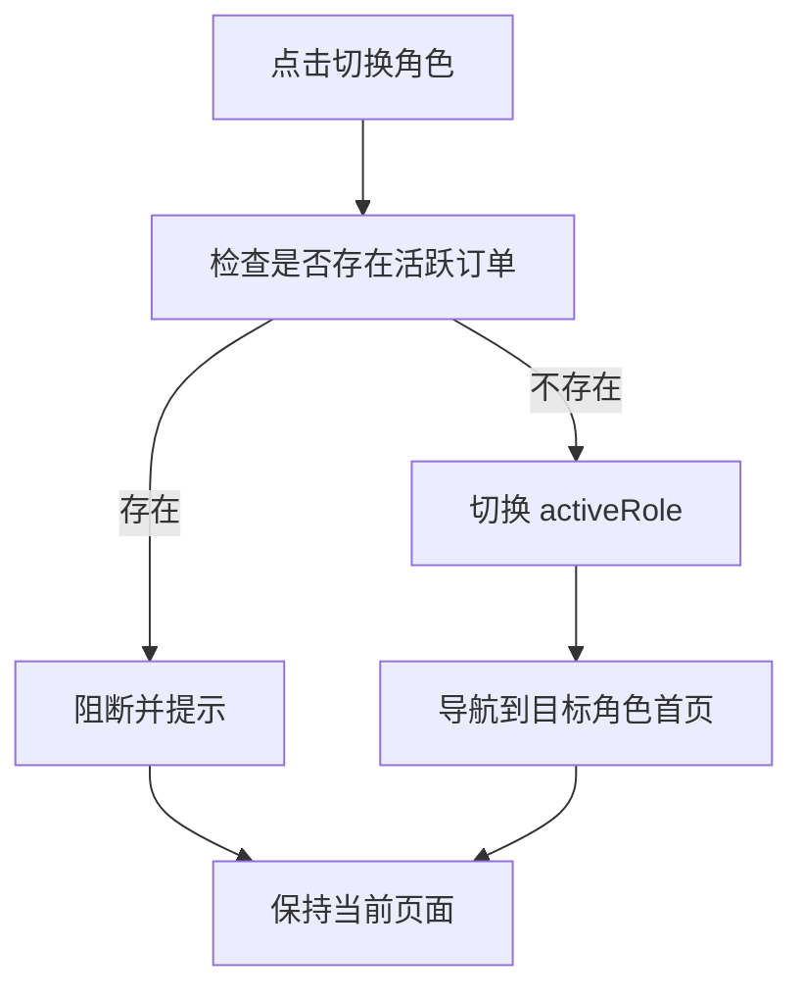
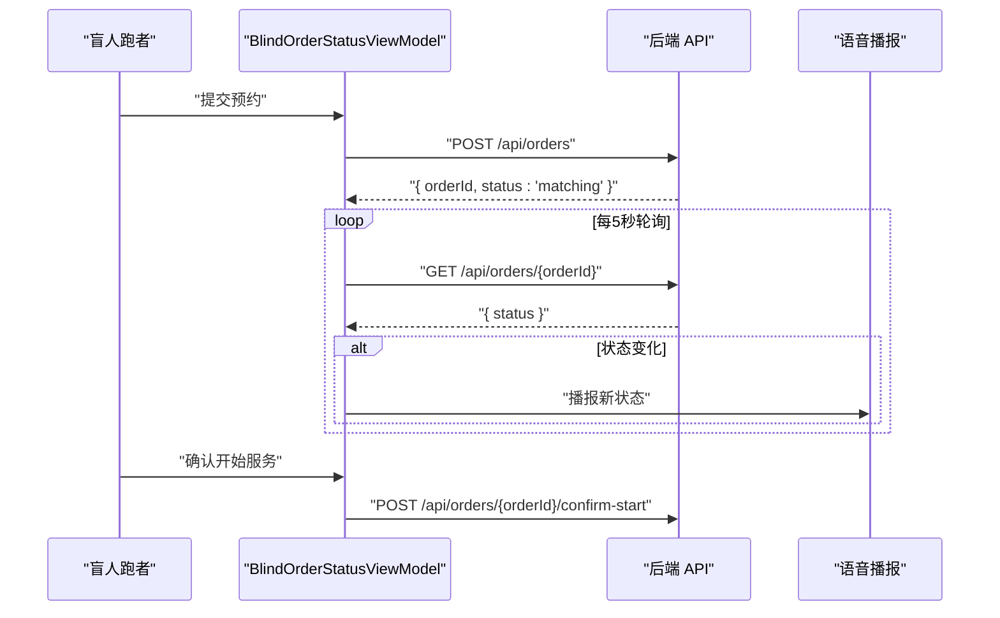
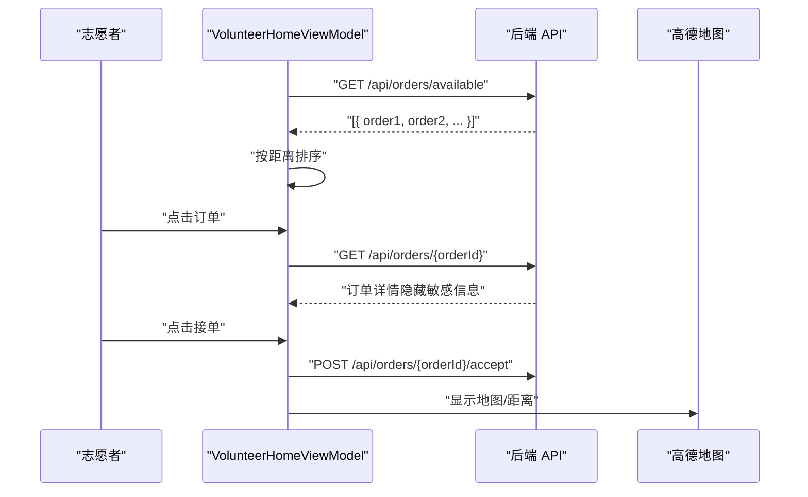
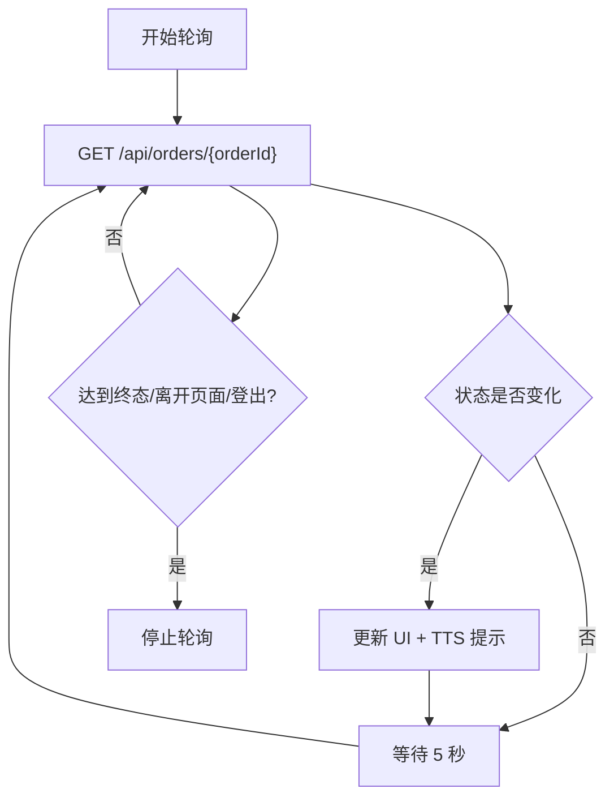
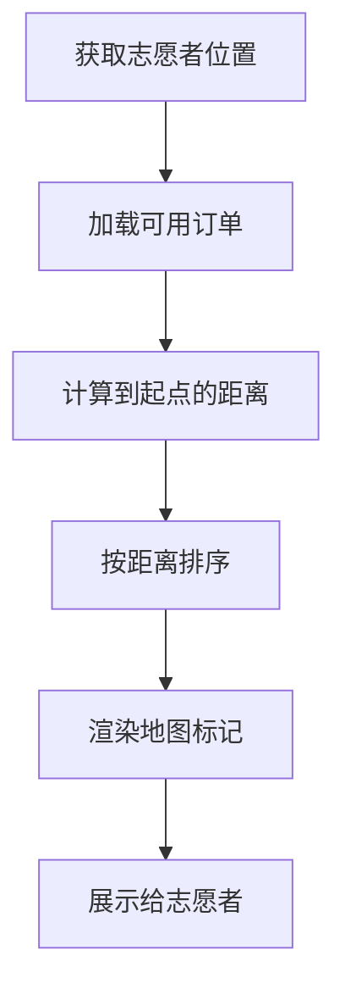
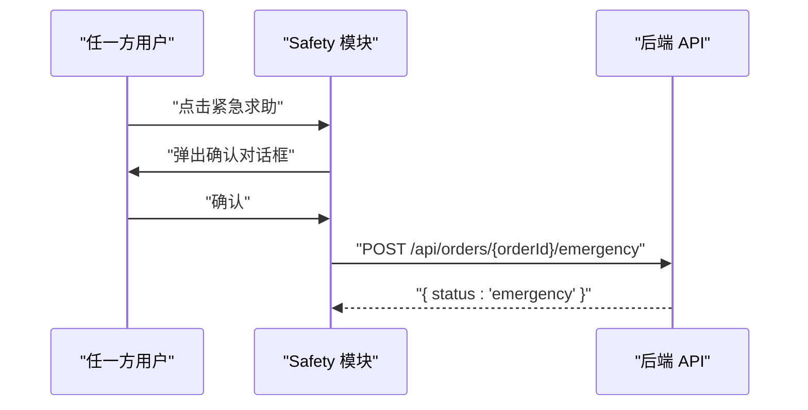
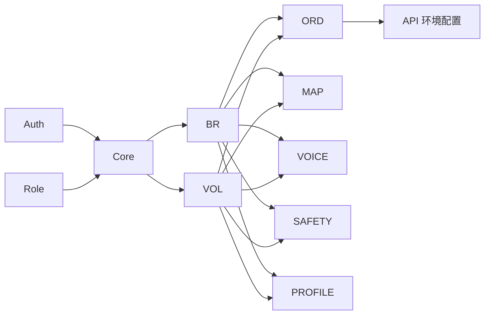

# 模块化架构设计

<cite>
**本文档引用的文件**
- [blindRunApp.swift](file://blindRun/blindRun/blindRunApp.swift)
- [ContentView.swift](file://blindRun/blindRun/ContentView.swift)
- [08-ios-architecture.md](file://docs/08-ios-architecture.md)
- [04-user-flows-and-state-machine.md](file://docs/04-user-flows-and-state-machine.md)
- [spec.md](file://openspec/changes/add-aidrun-ios-spring-mvp/specs/auth-phone-login/spec.md)
- [spec.md](file://openspec/changes/add-aidrun-ios-spring-mvp/specs/blind-runner-booking/spec.md)
- [spec.md](file://openspec/changes/add-aidrun-ios-spring-mvp/specs/role-switching/spec.md)
- [spec.md](file://openspec/changes/add-aidrun-ios-spring-mvp/specs/safety-basic-emergency/spec.md)
- [spec.md](file://openspec/changes/add-aidrun-ios-spring-mvp/specs/volunteer-order-flow/spec.md)
- [spec.md](file://openspec/changes/add-aidrun-ios-spring-mvp/specs/order-status-lifecycle/spec.md)
- [spec.md](file://openspec/changes/add-aidrun-ios-spring-mvp/specs/accessibility-voice-ui/spec.md)
- [spec.md](file://openspec/changes/add-aidrun-ios-spring-mvp/specs/amap-location/spec.md)
</cite>

## 目录
1. [简介](#简介)
2. [项目结构](#项目结构)
3. [核心组件](#核心组件)
4. [架构总览](#架构总览)
5. [详细组件分析](#详细组件分析)
6. [依赖分析](#依赖分析)
7. [性能考虑](#性能考虑)
8. [故障排除指南](#故障排除指南)
9. [结论](#结论)
10. [附录](#附录)

## 简介
本文件为 blindRun 应用的模块化架构设计综合文档，基于现有架构文档与需求规范，系统性阐述各功能模块的划分原则、职责边界、模块间通信机制、接口定义与数据传递方式，并总结模块化带来的代码复用、职责分离、测试隔离与团队协作等优势。同时提供模块依赖图与模块边界定义，给出模块扩展与维护的最佳实践建议。

## 项目结构
blindRun 采用 SwiftUI + MVVM 架构，应用入口通过 App 协议创建窗口组并展示根视图。当前仓库提供了完整的架构设计文档与多模块需求规范，为模块化落地提供了清晰的指导。

**图表来源**
- [blindRunApp.swift:10-17](file://blindRun/blindRun/blindRunApp.swift#L10-L17)
- [ContentView.swift:10-20](file://blindRun/blindRun/ContentView.swift#L10-L20)
- [08-ios-architecture.md:1-165](file://docs/08-ios-architecture.md#L1-L165)
- [04-user-flows-and-state-machine.md:1-70](file://docs/04-user-flows-and-state-machine.md#L1-L70)

**章节来源**
- [blindRunApp.swift:10-17](file://blindRun/blindRun/blindRunApp.swift#L10-L17)
- [ContentView.swift:10-20](file://blindRun/blindRun/ContentView.swift#L10-L20)
- [08-ios-architecture.md:18-32](file://docs/08-ios-architecture.md#L18-L32)

## 核心组件
根据架构文档，blindRun 的模块化布局建议如下：

- Core：应用环境、依赖容器、共享模型、应用状态
- Auth：手机号登录、JWT 持久化、认证会话
- Role：活动角色切换与角色守卫规则
- BlindRunner：盲人跑者首页、资料、预约、订单状态
- Volunteer：志愿者首页、可用性、可接订单、服务记录、积分
- Orders：订单 DTO、订单状态机辅助、轮询
- Map：高德地图桥接、当前位置、标记、距离计算
- Voice：TTS、重复当前状态、语音输入辅助
- Safety：紧急确认与取消确认流程
- Profile：盲人跑者与志愿者资料表单

这些模块共同支撑 MVVM 架构：View 保持轻薄，ViewModel 负责加载状态、校验状态、API 调用、轮询与 TTS 触发；Service 封装 API 与平台能力边界；DTO 与领域助手负责显示文本与状态转换。

**章节来源**
- [08-ios-architecture.md:22-31](file://docs/08-ios-architecture.md#L22-L31)
- [08-ios-architecture.md:33-49](file://docs/08-ios-architecture.md#L33-L49)

## 架构总览
下图展示了模块化架构下的高层交互关系：各业务模块围绕 Core 提供的基础能力协同工作，Auth/Role 为上下文提供身份与角色信息，BlindRunner/Volunteer 通过 Orders 进行业务编排，Map/Voice/Safety/Profile 作为支撑模块提供能力增强。

**图表来源**
- [08-ios-architecture.md:18-31](file://docs/08-ios-architecture.md#L18-L31)
- [04-user-flows-and-state-machine.md:3-70](file://docs/04-user-flows-and-state-machine.md#L3-L70)

## 详细组件分析

### Auth 模块
职责边界
- 处理手机号登录与注册合并逻辑
- 维护 JWT 令牌与认证会话
- 支持演示环境固定验证码

接口与数据传递
- 输入：手机号、验证码（演示固定值）
- 输出：JWT 令牌、用户信息
- 与 Core/Role/BlindRunner/Volunteer 的交互通过共享的认证状态与令牌传递

**图表来源**
- [08-ios-architecture.md:84-96](file://docs/08-ios-architecture.md#L84-L96)
- [spec.md:1-30](file://openspec/changes/add-aidrun-ios-spring-mvp/specs/auth-phone-login/spec.md#L1-L30)

**章节来源**
- [08-ios-architecture.md:84-96](file://docs/08-ios-architecture.md#L84-L96)
- [spec.md:1-30](file://openspec/changes/add-aidrun-ios-spring-mvp/specs/auth-phone-login/spec.md#L1-L30)

### Role 模块
职责边界
- 在同一 JWT 下切换 activeRole
- 活跃订单阻断角色切换
- 保持应用状态而非账户分离

接口与数据传递
- 输入：目标角色
- 输出：更新后的用户信息或阻断错误
- 与 Auth/BlindRunner/Volunteer 的交互通过共享的 activeRole 状态

**图表来源**
- [08-ios-architecture.md:92-96](file://docs/08-ios-architecture.md#L92-L96)
- [spec.md:11-26](file://openspec/changes/add-aidrun-ios-spring-mvp/specs/role-switching/spec.md#L11-L26)

**章节来源**
- [08-ios-architecture.md:92-96](file://docs/08-ios-architecture.md#L92-L96)
- [spec.md:11-26](file://openspec/changes/add-aidrun-ios-spring-mvp/specs/role-switching/spec.md#L11-L26)

### BlindRunner 模块
职责边界
- 盲人跑者首页与资料管理
- 预约创建与订单状态跟踪
- 与订单状态轮询、TTS 提示、紧急求助联动

接口与数据传递
- 输入：预约表单（起点、时间、备注等）
- 输出：订单状态变更、TTS 提示、轮询结果
- 依赖：Orders（状态机/DTO）、Voice（TTS）、Map（定位/距离）

**图表来源**
- [08-ios-architecture.md:45-47](file://docs/08-ios-architecture.md#L45-L47)
- [04-user-flows-and-state-machine.md:120-178](file://docs/04-user-flows-and-state-machine.md#L120-L178)

**章节来源**
- [08-ios-architecture.md:45-47](file://docs/08-ios-architecture.md#L45-L47)
- [04-user-flows-and-state-machine.md:120-178](file://docs/04-user-flows-and-state-machine.md#L120-L178)

### Volunteer 模块
职责边界
- 志愿者首页与可用性管理
- 可接订单列表与详情处理
- 服务过程推进（到达、完成、取消、紧急）

接口与数据传递
- 输入：可用性开关、订单操作指令
- 输出：订单状态变更、服务记录、积分变动
- 依赖：Orders（状态机/DTO）、Map（距离排序）、Voice（TTS）

**图表来源**
- [08-ios-architecture.md:47-48](file://docs/08-ios-architecture.md#L47-L48)
- [04-user-flows-and-state-machine.md:180-228](file://docs/04-user-flows-and-state-machine.md#L180-L228)

**章节来源**
- [08-ios-architecture.md:47-48](file://docs/08-ios-architecture.md#L47-L48)
- [04-user-flows-and-state-machine.md:180-228](file://docs/04-user-flows-and-state-machine.md#L180-L228)

### Orders 模块
职责边界
- 订单 DTO 定义与状态机辅助
- 轮询策略与状态转换控制
- 与 API 的契约对接

接口与数据传递
- 输入：订单 ID、操作指令
- 输出：订单详情、状态变更、错误码映射
- 依赖：API 环境配置、轮询调度器

**图表来源**
- [08-ios-architecture.md:125-139](file://docs/08-ios-architecture.md#L125-L139)
- [04-user-flows-and-state-machine.md:275-299](file://docs/04-user-flows-and-state-machine.md#L275-L299)

**章节来源**
- [08-ios-architecture.md:125-139](file://docs/08-ios-architecture.md#L125-L139)
- [04-user-flows-and-state-machine.md:275-299](file://docs/04-user-flows-and-state-machine.md#L275-L299)

### Map 模块
职责边界
- 高德地图集成与当前位置获取
- 订单起点标记与距离计算
- iOS 端本地距离排序

接口与数据传递
- 输入：订单坐标、志愿者位置
- 输出：地图标记、距离数值、排序结果
- 依赖：定位权限、高德 SDK

**图表来源**
- [08-ios-architecture.md:98-124](file://docs/08-ios-architecture.md#L98-L124)
- [spec.md:23-38](file://openspec/changes/add-aidrun-ios-spring-mvp/specs/amap-location/spec.md#L23-L38)

**章节来源**
- [08-ios-architecture.md:98-124](file://docs/08-ios-architecture.md#L98-L124)
- [spec.md:23-38](file://openspec/changes/add-aidrun-ios-spring-mvp/specs/amap-location/spec.md#L23-L38)

### Voice 模块
职责边界
- TTS 播报关键流程节点
- 重复当前状态按钮
- 文本字段的语音输入辅助

接口与数据传递
- 输入：状态文本、错误消息
- 输出：语音播报完成事件
- 依赖：AVSpeechSynthesizer、Speech 框架

**章节来源**
- [08-ios-architecture.md:140-147](file://docs/08-ios-architecture.md#L140-L147)
- [spec.md:19-42](file://openspec/changes/add-aidrun-ios-spring-mvp/specs/accessibility-voice-ui/spec.md#L19-L42)

### Safety 模块
职责边界
- 紧急求助与取消确认流程
- 仅在活跃服务准备或服务期间可用
- MVP 不支持从紧急态恢复

接口与数据传递
- 输入：紧急/取消操作指令
- 输出：状态变更、确认弹窗、TTS 提示
- 依赖：订单状态机、确认对话框

**图表来源**
- [04-user-flows-and-state-machine.md:230-257](file://docs/04-user-flows-and-state-machine.md#L230-L257)
- [spec.md:11-42](file://openspec/changes/add-aidrun-ios-spring-mvp/specs/safety-basic-emergency/spec.md#L11-L42)

**章节来源**
- [04-user-flows-and-state-machine.md:230-257](file://docs/04-user-flows-and-state-machine.md#L230-L257)
- [spec.md:11-42](file://openspec/changes/add-aidrun-ios-spring-mvp/specs/safety-basic-emergency/spec.md#L11-L42)

### Profile 模块
职责边界
- 盲人跑者与志愿者资料表单
- 资料完整性校验（如紧急联系人）
- 与预约创建前置校验联动

接口与数据传递
- 输入：表单数据
- 输出：校验结果、保存成功/失败
- 依赖：认证状态、API 保存接口

**章节来源**
- [spec.md:3-34](file://openspec/changes/add-aidrun-ios-spring-mvp/specs/blind-runner-booking/spec.md#L3-L34)
- [spec.md:3-10](file://openspec/changes/add-aidrun-ios-spring-mvp/specs/safety-basic-emergency/spec.md#L3-L10)

## 依赖分析
模块间耦合与内聚
- 高内聚低耦合：每个模块聚焦单一职责，如 Auth/Role 提供身份与角色上下文，Orders 提供状态机与轮询，Map/Voice/Safety/Profile 提供支撑能力。
- 松耦合：通过 Core 的共享状态与依赖注入降低直接耦合；ViewModel 作为中介协调 View 与 Service。
- 关键依赖链：BlindRunner/Volunteer 依赖 Orders；Orders 依赖 API 环境配置；Map/Voice/Safety/Profile 为横切关注点。

**图表来源**
- [08-ios-architecture.md:68-83](file://docs/08-ios-architecture.md#L68-L83)
- [08-ios-architecture.md:18-31](file://docs/08-ios-architecture.md#L18-L31)

**章节来源**
- [08-ios-architecture.md:68-83](file://docs/08-ios-architecture.md#L68-L83)
- [08-ios-architecture.md:18-31](file://docs/08-ios-architecture.md#L18-L31)

## 性能考虑
- 轮询优化：仅在相关页面启用 5 秒轮询，离开页面即停止，避免无谓网络与 CPU 开销。
- 本地计算：距离排序在 iOS 侧完成，减少不必要的网络往返。
- 令牌与缓存：使用 UserDefaults 存储 JWT（MVP），生产环境迁移至 Keychain；合理利用 TTS 缓存与错误映射减少重复播报与解析成本。
- UI 响应：ViewModel 中聚合状态与副作用，避免 View 层频繁刷新。

[本节为通用性能建议，无需特定文件来源]

## 故障排除指南
常见问题与排查
- 登录失败：检查验证码是否为演示固定值；确认 API 环境配置与 baseURL；验证 JWT 是否正确持久化。
- 角色切换被阻断：检查是否存在活跃订单；确保订单状态不在 accepted/arrived/in_progress/emergency。
- 订单轮询无响应：确认当前页面是否处于需要轮询的状态；检查网络连通性与 API 响应。
- 地图/定位异常：确认定位权限已授予；模拟器场景下使用演示坐标；检查高德密钥配置。
- 紧急求助无效：确认当前订单状态允许紧急；检查确认弹窗是否被遮挡。

**章节来源**
- [08-ios-architecture.md:50-66](file://docs/08-ios-architecture.md#L50-L66)
- [04-user-flows-and-state-machine.md:259-273](file://docs/04-user-flows-and-state-machine.md#L259-L273)

## 结论
blindRun 的模块化架构以 MVVM 为核心，结合明确的模块边界与职责划分，实现了良好的代码复用、职责分离、测试隔离与团队协作。通过 Core 提供统一的依赖与状态管理，Auth/Role 提供身份与角色上下文，BlindRunner/Volunteer 专注于业务流程，Orders/Map/Voice/Safety/Profile 提供横切能力，整体架构具备清晰的扩展性与可维护性。

[本节为总结性内容，无需特定文件来源]

## 附录

### 模块扩展与维护最佳实践
- 分层与解耦：坚持 View/ViewModel/Service 分层，避免跨模块直接耦合。
- 接口契约：统一 APIClient 协议与 DTO，便于 Mock 与真实实现替换。
- 环境与配置：通过 APIEnvironment 管理多环境 baseURL，Debug 构建暴露环境选择。
- 测试策略：ViewModel 使用可测试的依赖注入；对轮询、TTS、定位等外部依赖进行隔离测试。
- 文档与规范：沿用现有需求规范与架构文档，确保模块演进的一致性。

**章节来源**
- [08-ios-architecture.md:50-83](file://docs/08-ios-architecture.md#L50-L83)