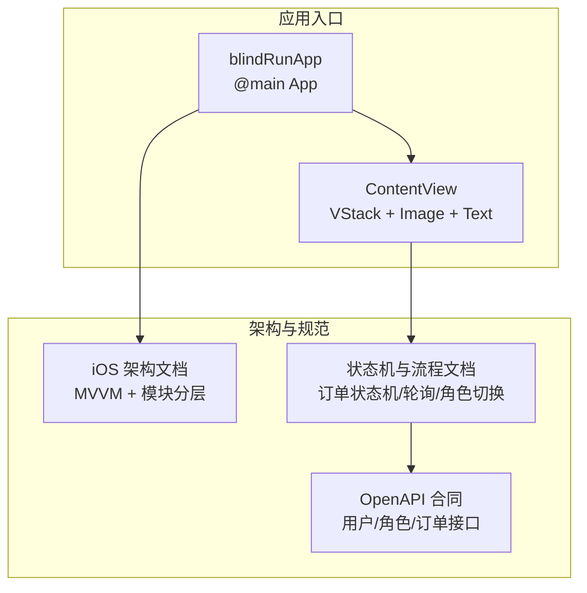
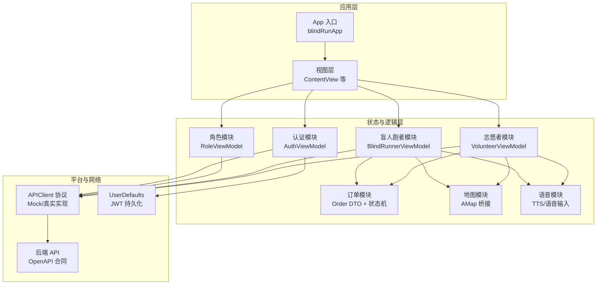
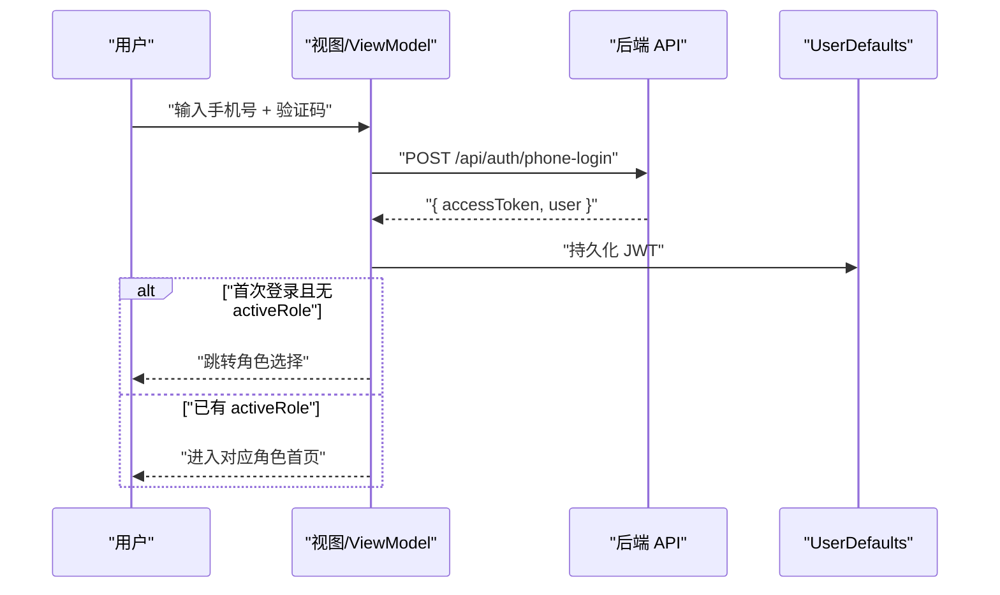
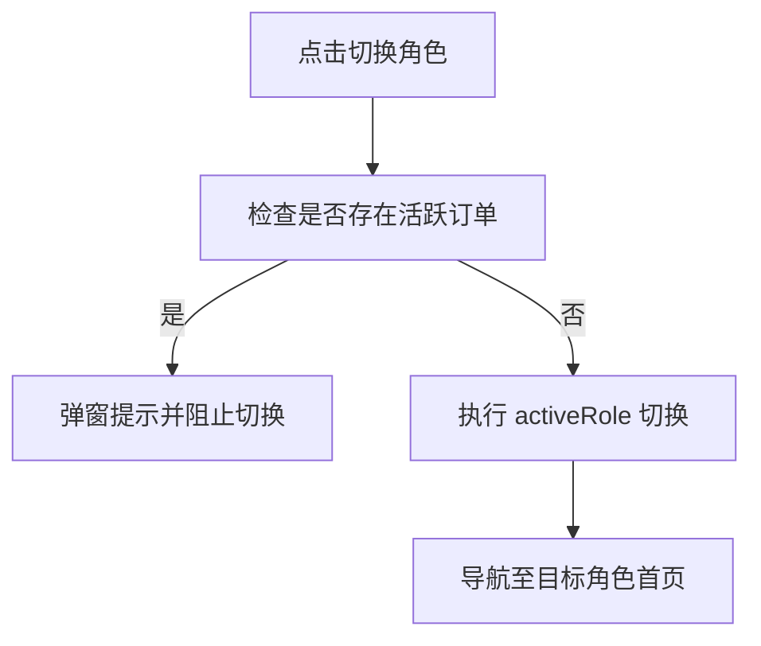
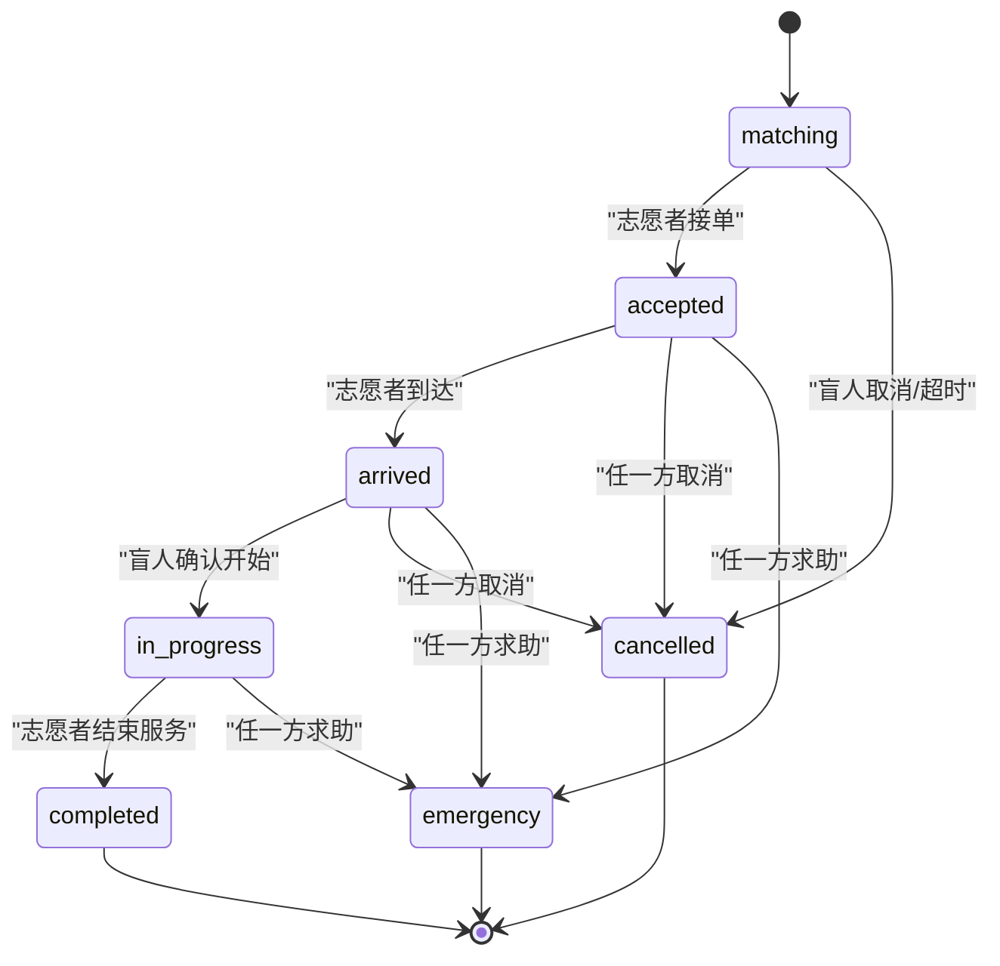
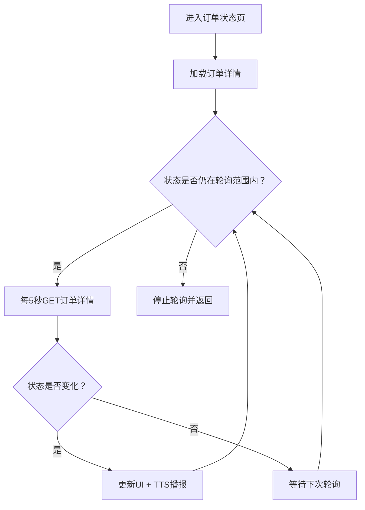
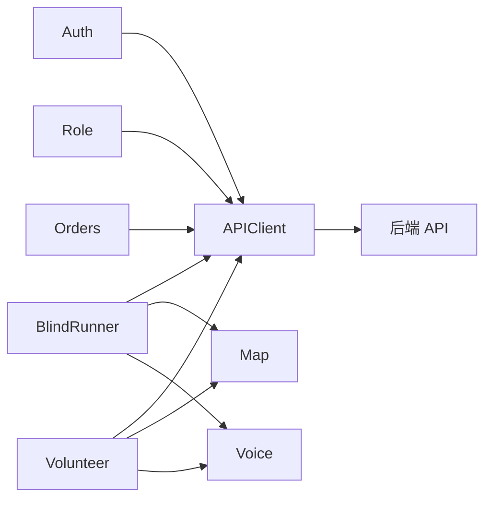

# 状态管理模式

<cite>
**本文引用的文件**
- [blindRunApp.swift](file://blindRun/blindRun/blindRunApp.swift)
- [ContentView.swift](file://blindRun/blindRun/ContentView.swift)
- [08-ios-architecture.md](file://docs/08-ios-architecture.md)
- [04-user-flows-and-state-machine.md](file://docs/04-user-flows-and-state-machine.md)
- [07-api-contract.openapi.yaml](file://docs/07-api-contract.openapi.yaml)
- [03-user-stories.md](file://docs/03-user-stories.md)
- [design.md](file://openspec/changes/add-aidrun-ios-spring-mvp/design.md)
- [tasks.md](file://openspec/changes/add-aidrun-ios-spring-mvp/tasks.md)
</cite>

## 目录
1. [引言](#引言)
2. [项目结构](#项目结构)
3. [核心组件](#核心组件)
4. [架构总览](#架构总览)
5. [详细组件分析](#详细组件分析)
6. [依赖关系分析](#依赖关系分析)
7. [性能考量](#性能考量)
8. [故障排查指南](#故障排查指南)
9. [结论](#结论)
10. [附录](#附录)

## 引言
本文件系统性梳理 blindRun 应用在 SwiftUI + MVVM 架构下的状态管理模式，重点覆盖以下方面：
- SwiftUI 状态修饰符在应用中的使用边界与职责划分（@State、@ObservableObject、@EnvironmentObject 等）
- 应用状态的组织方式：认证状态、角色状态、订单状态、地图状态等
- 状态更新的触发机制与数据流向：API 调用、轮询、事件驱动
- 订单状态机的设计与实现：状态转换规则、并发控制策略
- 最佳实践与性能优化建议

## 项目结构
blindRun 当前处于极简原型阶段，核心入口为 SwiftUI App，内容视图用于演示。实际业务状态与 ViewModel 尚未在仓库中落地，但架构文档与需求文档对状态管理有明确设计约束。

图表来源
- [blindRunApp.swift:10-17](file://blindRun/blindRun/blindRunApp.swift#L10-L17)
- [ContentView.swift:10-20](file://blindRun/blindRun/ContentView.swift#L10-L20)
- [08-ios-architecture.md:18-31](file://docs/08-ios-architecture.md#L18-L31)
- [04-user-flows-and-state-machine.md:1-70](file://docs/04-user-flows-and-state-machine.md#L1-L70)
- [07-api-contract.openapi.yaml:47-80](file://docs/07-api-contract.openapi.yaml#L47-L80)

章节来源
- [blindRunApp.swift:10-17](file://blindRun/blindRun/blindRunApp.swift#L10-L17)
- [ContentView.swift:10-20](file://blindRun/blindRun/ContentView.swift#L10-L20)
- [08-ios-architecture.md:18-31](file://docs/08-ios-architecture.md#L18-L31)

## 核心组件
基于架构文档与状态机文档，应用状态主要由以下模块承载：

- 认证与会话状态（Auth）
  - 作用：手机号 + 验证码登录、JWT 持久化、会话恢复、退出登录
  - 关键点：UserDefaults 存取 JWT；启动时验证 token 有效性；登录成功后根据是否已有 activeRole 决定进入角色选择或对应角色首页
- 角色状态（Role）
  - 作用：activeRole 切换、活跃订单拦截、同一 JWT 下的角色切换
  - 关键点：切换需满足无活跃订单；后端返回 ACTIVE_ORDER_ROLE_SWITCH_BLOCKED 时给出清晰提示
- 订单状态（Orders）
  - 作用：订单 DTO、状态机辅助、轮询控制
  - 关键点：5 秒轮询；仅在特定状态与页面停留时生效；紧急求助为异常终态
- 盲人跑者状态（BlindRunner）
  - 作用：首页、预约创建、订单状态页、服务中、完成/评分、紧急求助
  - 关键点：预约创建后进入 matching；等待期间轮询；志愿者到达后进入 in_progress
- 志愿者状态（Volunteer）
  - 作用：可用订单列表、详情页、接单、到达、完成、服务记录、积分
  - 关键点：按距离排序；接单采用乐观锁或事务校验，避免并发冲突
- 地图与位置（Map）
  - 作用：显示地图、当前位置、订单起点标记、距离计算
  - 关键点：需要位置权限；模拟坐标仅用于演示稳定性
- 语音与无障碍（Voice）
  - 作用：TTS 播报状态、重复当前状态、语音输入
  - 关键点：关键节点均需 TTS 提示；危险操作需二次确认

章节来源
- [08-ios-architecture.md:22-31](file://docs/08-ios-architecture.md#L22-L31)
- [08-ios-architecture.md:84-96](file://docs/08-ios-architecture.md#L84-L96)
- [04-user-flows-and-state-machine.md:72-118](file://docs/04-user-flows-and-state-machine.md#L72-L118)
- [04-user-flows-and-state-machine.md:259-273](file://docs/04-user-flows-and-state-machine.md#L259-L273)
- [07-api-contract.openapi.yaml:61-80](file://docs/07-api-contract.openapi.yaml#L61-L80)
- [design.md:20-28](file://openspec/changes/add-aidrun-ios-spring-mvp/design.md#L20-L28)

## 架构总览
应用采用 SwiftUI + MVVM 架构，模块化清晰，状态与行为分离。下图展示从 App 入口到各功能模块的状态流与交互。

图表来源
- [08-ios-architecture.md:33-49](file://docs/08-ios-architecture.md#L33-L49)
- [08-ios-architecture.md:68-82](file://docs/08-ios-architecture.md#L68-L82)
- [07-api-contract.openapi.yaml:47-80](file://docs/07-api-contract.openapi.yaml#L47-L80)
- [design.md:20-28](file://openspec/changes/add-aidrun-ios-spring-mvp/design.md#L20-L28)

## 详细组件分析

### SwiftUI 状态修饰符与职责边界
- @State
  - 适用：视图内部的局部状态，如表单字段、临时 UI 状态
  - 注意：避免跨视图共享复杂状态；大对象或频繁变更应下沉到 ViewModel
- @ObservableObject（推荐在 ViewModel 中使用）
  - 适用：封装业务状态与行为，统一响应式更新
  - 注意：确保对象生命周期与视图一致；避免强引用循环
- @EnvironmentObject
  - 适用：跨层级传递共享状态（如认证、角色、地图、语音服务）
  - 注意：注入时机与作用域；避免在深层视图中重复注入造成耦合

章节来源
- [08-ios-architecture.md:33-49](file://docs/08-ios-architecture.md#L33-L49)

### 认证与会话状态
- 登录流程
  - 输入手机号 + 验证码（演示固定验证码），调用登录接口获取 JWT
  - 成功后持久化 JWT；若首次登录且无 activeRole，跳转角色选择
- 会话恢复
  - 应用启动时读取 JWT 并验证有效性；无效则清空并回到登录
- 退出登录
  - 清除 JWT，回到登录页

图表来源
- [03-user-stories.md:71-95](file://docs/03-user-stories.md#L71-L95)
- [08-ios-architecture.md:78-82](file://docs/08-ios-architecture.md#L78-L82)

章节来源
- [03-user-stories.md:71-95](file://docs/03-user-stories.md#L71-L95)
- [08-ios-architecture.md:78-82](file://docs/08-ios-architecture.md#L78-L82)

### 角色状态与切换
- 切换规则
  - 共享同一 JWT；仅切换 activeRole
  - 若存在 accepted / arrived / in_progress / emergency，禁止切换
- 拦截流程
  - 切换前检查活跃订单；存在则弹窗提示并阻止切换

图表来源
- [04-user-flows-and-state-machine.md:259-273](file://docs/04-user-flows-and-state-machine.md#L259-L273)
- [07-api-contract.openapi.yaml:61-80](file://docs/07-api-contract.openapi.yaml#L61-L80)
- [design.md:20-24](file://openspec/changes/add-aidrun-ios-spring-mvp/design.md#L20-L24)

章节来源
- [04-user-flows-and-state-machine.md:259-273](file://docs/04-user-flows-and-state-machine.md#L259-L273)
- [07-api-contract.openapi.yaml:61-80](file://docs/07-api-contract.openapi.yaml#L61-L80)
- [design.md:20-24](file://openspec/changes/add-aidrun-ios-spring-mvp/design.md#L20-L24)

### 订单状态机与并发控制
- 状态集合与转换
  - matching → accepted（志愿者接单，乐观锁保护）
  - accepted → arrived（志愿者到达）
  - arrived → in_progress（盲人确认开始）
  - in_progress → completed（志愿者结束服务）
  - cancel/emergency 为异常路径，emergency 为终态
- 并发控制
  - matching → accepted 采用乐观锁或事务校验，避免并发接单
- 轮询策略
  - 仅在订单处于 waiting/in_progress 状态且页面可见时轮询
  - 5 秒一次；状态变化时触发 UI 更新与 TTS 播报

图表来源
- [04-user-flows-and-state-machine.md:72-118](file://docs/04-user-flows-and-state-machine.md#L72-L118)
- [design.md:24-25](file://openspec/changes/add-aidrun-ios-spring-mvp/design.md#L24-L25)
- [08-ios-architecture.md:125-139](file://docs/08-ios-architecture.md#L125-L139)

章节来源
- [04-user-flows-and-state-machine.md:72-118](file://docs/04-user-flows-and-state-machine.md#L72-L118)
- [design.md:24-25](file://openspec/changes/add-aidrun-ios-spring-mvp/design.md#L24-L25)
- [08-ios-architecture.md:125-139](file://docs/08-ios-architecture.md#L125-L139)

### 数据流向与处理逻辑
- 订单状态页（盲人/志愿者）
  - 初始化：加载订单详情
  - 轮询：每 5 秒拉取最新状态
  - 状态变化：更新 UI、播报 TTS
  - 终止条件：进入 completed/cancelled/emergency 或页面消失
- 危险操作
  - 取消订单、紧急求助、完成服务、退出登录均需二次确认弹窗

图表来源
- [08-ios-architecture.md:125-139](file://docs/08-ios-architecture.md#L125-L139)
- [04-user-flows-and-state-machine.md:275-299](file://docs/04-user-flows-and-state-machine.md#L275-L299)

章节来源
- [08-ios-architecture.md:125-139](file://docs/08-ios-architecture.md#L125-L139)
- [04-user-flows-and-state-machine.md:275-299](file://docs/04-user-flows-and-state-machine.md#L275-L299)

### 地图与位置状态
- 权限要求
  - 盲人：创建预约需位置权限
  - 志愿者：查看/排序附近订单需位置权限
- 功能要点
  - 显示地图、当前位置、订单起点标记
  - iOS 侧按距离排序（依赖当前定位）
  - 演示场景提供默认坐标，但需提示真实权限要求

章节来源
- [08-ios-architecture.md:98-117](file://docs/08-ios-architecture.md#L98-L117)
- [design.md:23-28](file://openspec/changes/add-aidrun-ios-spring-mvp/design.md#L23-L28)

### 语音与无障碍状态
- TTS 节点
  - 关键状态播报（如“志愿者已接单”、“服务已完成”等）
  - 提供“重复当前状态”按钮
- 语音输入
  - 文本字段支持语音输入
- 无障碍
  - 大按钮、高对比度、完整 VoiceOver 标签与提示

章节来源
- [08-ios-architecture.md:140-146](file://docs/08-ios-architecture.md#L140-L146)
- [design.md:27-28](file://openspec/changes/add-aidrun-ios-spring-mvp/design.md#L27-L28)

## 依赖关系分析
- 模块内聚与解耦
  - Core/模块化命名清晰，职责边界明确
  - ViewModel 通过 APIClient 与后端解耦
- 外部依赖
  - URLSession + async/await 网络层
  - UserDefaults（MVP）/Keychain（生产）
  - 高德地图 SDK、CoreLocation、AVSpeechSynthesizer

图表来源
- [08-ios-architecture.md:68-82](file://docs/08-ios-architecture.md#L68-L82)
- [08-ios-architecture.md:10-16](file://docs/08-ios-architecture.md#L10-L16)

章节来源
- [08-ios-architecture.md:68-82](file://docs/08-ios-architecture.md#L68-L82)
- [08-ios-architecture.md:10-16](file://docs/08-ios-architecture.md#L10-L16)

## 性能考量
- 轮询频率与范围
  - 5 秒一次，仅在必要页面与状态运行，降低网络与 CPU 开销
- 状态更新去抖
  - 状态未变化时不触发 UI/TTS 更新
- 网络与存储
  - URLSession + async/await；UserDefaults 仅用于 MVP，生产迁移 Keychain
- UI 渲染
  - 视图保持轻薄，复杂状态与逻辑下沉到 ViewModel，减少重组

章节来源
- [08-ios-architecture.md:125-139](file://docs/08-ios-architecture.md#L125-L139)
- [08-ios-architecture.md:78-82](file://docs/08-ios-architecture.md#L78-L82)

## 故障排查指南
- 登录失败/会话失效
  - 检查 UserDefaults 中 JWT 是否存在且未过期
  - 启动时验证 token，无效则清空并回到登录页
- 角色切换被拦截
  - 检查是否存在 accepted/arrived/in_progress/emergency 订单
  - 后端返回 ACTIVE_ORDER_ROLE_SWITCH_BLOCKED 时，提示用户先完成或取消订单
- 订单状态不更新
  - 确认页面是否仍在轮询范围内
  - 检查网络与 APIClient 请求头（Authorization）
- 紧急求助后另一方无反应
  - 确认轮询持续运行；检查后端状态变更与错误映射

章节来源
- [03-user-stories.md:71-95](file://docs/03-user-stories.md#L71-L95)
- [04-user-flows-and-state-machine.md:259-273](file://docs/04-user-flows-and-state-machine.md#L259-L273)
- [08-ios-architecture.md:78-82](file://docs/08-ios-architecture.md#L78-L82)

## 结论
blindRun 的状态管理模式遵循 SwiftUI + MVVM 的清晰分层：视图负责渲染与意图转发，ViewModel 负责状态、API、轮询与 TTS；服务层通过 APIClient 解耦网络细节。认证、角色、订单、地图与语音等状态分别由对应模块管理，并通过 @EnvironmentObject 在视图间传递共享状态。订单状态机以“轮询 + 乐观锁”为核心，兼顾简单性与一致性；紧急求助为异常终态，保证流程安全。后续可在现有基础上逐步引入更细粒度的状态封装与并发控制工具，同时将 UserDefaults 迁移至 Keychain，提升安全性与可靠性。

## 附录
- 任务与模块规划参考
  - iOS 模块分组与任务清单：Core、Auth、Role、BlindRunner、Volunteer、Orders、Map、Voice、Safety、Profile
  - 订单状态页、志愿者详情页、地图与语音等关键任务均已明确

章节来源
- [tasks.md:28-53](file://openspec/changes/add-aidrun-ios-spring-mvp/tasks.md#L28-L53)