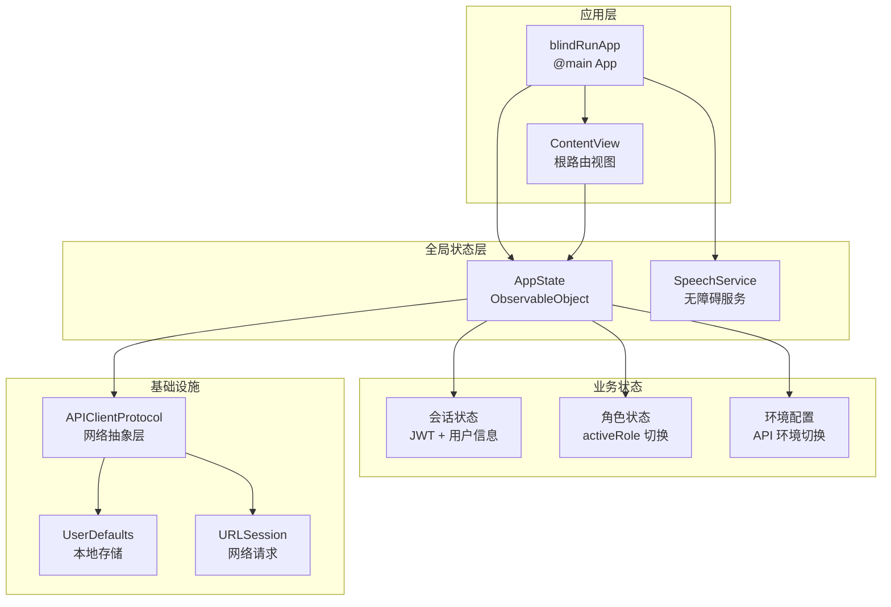
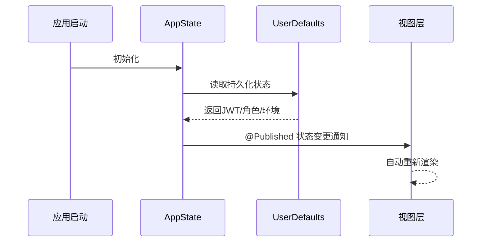
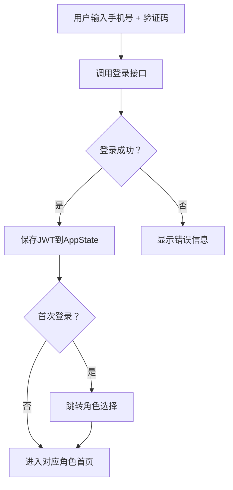
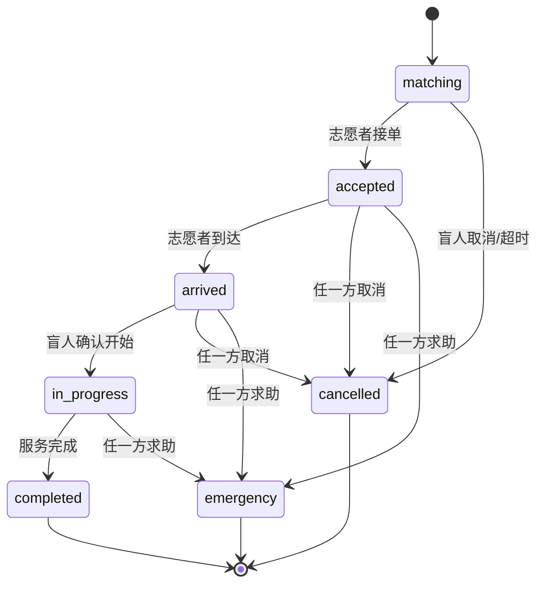

# 状态管理模式

<cite>
**本文档引用的文件**
- [AppState.swift](file://blindRun/blindRun/Core/AppState.swift)
- [EnvironmentConfig.swift](file://blindRun/blindRun/Core/EnvironmentConfig.swift)
- [blindRunApp.swift](file://blindRun/blindRun/blindRunApp.swift)
- [ContentView.swift](file://blindRun/blindRun/ContentView.swift)
- [UserModels.swift](file://blindRun/blindRun/Core/Models/UserModels.swift)
- [OrderModels.swift](file://blindRun/blindRun/Core/Models/OrderModels.swift)
- [ErrorModels.swift](file://blindRun/blindRun/Core/Models/ErrorModels.swift)
- [APIClient.swift](file://blindRun/blindRun/Core/APIClient.swift)
- [MockAPIClient.swift](file://blindRun/blindRun/Core/MockAPIClient.swift)
- [SpeechService.swift](file://blindRun/blindRun/Voice/SpeechService.swift)
- [08-ios-architecture.md](file://docs/08-ios-architecture.md)
- [04-user-flows-and-state-machine.md](file://docs/04-user-flows-and-state-machine.md)
</cite>

## 更新摘要
**所做更改**
- 新增完整的 AppState 全局状态管理系统实现
- 添加用户会话管理与 JWT 持久化机制
- 实现环境配置与多环境切换支持
- 集成 APIClient 抽象层与 Mock 实现
- 完善状态修饰符使用规范与最佳实践
- 更新订单状态机与并发控制策略

## 目录
1. [引言](#引言)
2. [全局状态管理架构](#全局状态管理架构)
3. [AppState 核心状态管理](#appstate-核心状态管理)
4. [用户会话与认证管理](#用户会话与认证管理)
5. [环境配置与多环境支持](#环境配置与多环境支持)
6. [API 客户端抽象层](#api-客户端抽象层)
7. [状态修饰符与响应式更新](#状态修饰符与响应式更新)
8. [订单状态机与并发控制](#订单状态机与并发控制)
9. [语音服务与无障碍支持](#语音服务与无障碍支持)
10. [性能优化与最佳实践](#性能优化与最佳实践)
11. [故障排查与调试指南](#故障排查与调试指南)
12. [总结与未来规划](#总结与未来规划)

## 引言

blindRun 应用采用 SwiftUI + MVVM 架构，实现了完整的状态管理模式。本文档详细阐述了应用的状态管理机制，包括全局状态管理、用户会话管理、环境配置、API 客户端抽象层以及响应式状态更新等核心组件。

应用状态管理的核心特点：
- **全局状态集中管理**：通过 AppState 统一管理用户会话、角色状态和环境配置
- **响应式状态更新**：利用 @Published 和 ObservableObject 实现自动状态同步
- **多环境支持**：支持 Mock、本地后端和生产环境的无缝切换
- **类型安全的 API 层**：通过协议抽象实现 Mock 和真实 API 的统一调用
- **完善的错误处理**：统一的错误映射和用户友好提示

## 全局状态管理架构

应用采用单一真相源（Single Source of Truth）原则，所有业务状态都由 AppState 统一管理。AppState 作为 @EnvironmentObject 注入到整个应用的视图层级，确保状态的一致性和可预测性。



**图表来源**
- [blindRunApp.swift:10-25](file://blindRun/blindRun/blindRunApp.swift#L10-L25)
- [AppState.swift:9-122](file://blindRun/blindRun/Core/AppState.swift#L9-L122)

**章节来源**
- [blindRunApp.swift:10-25](file://blindRun/blindRun/blindRunApp.swift#L10-L25)
- [AppState.swift:9-122](file://blindRun/blindRun/Core/AppState.swift#L9-L122)

## AppState 核心状态管理

AppState 是应用的核心状态容器，实现了 ObservableObject 协议，提供响应式的状态管理能力。它管理三个主要状态域：会话状态、角色状态和环境配置。

### 会话状态管理

会话状态包含 JWT 访问令牌、当前用户信息和激活角色。所有状态变更都会触发自动持久化和视图更新。



**图表来源**
- [AppState.swift:70-77](file://blindRun/blindRun/Core/AppState.swift#L70-L77)

### 状态持久化机制

AppState 实现了完整的状态持久化机制，使用 UserDefaults 存储关键状态信息。所有状态变更都通过 didSet 观察器自动触发持久化。

**章节来源**
- [AppState.swift:13-38](file://blindRun/blindRun/Core/AppState.swift#L13-L38)
- [AppState.swift:102-121](file://blindRun/blindRun/Core/AppState.swift#L102-L121)

## 用户会话与认证管理

应用实现了完整的用户会话管理机制，包括登录、会话恢复、角色切换和退出登录等功能。

### 登录流程

登录流程采用手机号 + 验证码的方式，成功后获取 JWT 令牌并建立会话。



**图表来源**
- [AppState.swift:80-84](file://blindRun/blindRun/Core/AppState.swift#L80-L84)

### 会话恢复机制

应用启动时自动尝试恢复之前的会话状态，确保用户体验的连续性。

**章节来源**
- [AppState.swift:70-77](file://blindRun/blindRun/Core/AppState.swift#L70-L77)
- [UserModels.swift:21-35](file://blindRun/blindRun/Core/Models/UserModels.swift#L21-L35)

## 环境配置与多环境支持

应用支持三种运行环境：Mock、本地后端和生产环境。通过 APIEnvironment 枚举统一管理环境配置。

### 环境类型定义

```swift
enum APIEnvironment: String, CaseIterable, Sendable {
    case mock          // 本地模拟数据
    case localBackend  // 本地Spring Boot后端
    case production    // 生产环境
}
```

### 环境配置特性

每个环境都有其特定的配置：
- **Mock 环境**：使用 MockAPIClient，无需网络连接
- **Local Backend**：支持可配置的本地 IP 地址
- **Production**：预留生产环境 URL，部署时替换

**章节来源**
- [EnvironmentConfig.swift:5-39](file://blindRun/blindRun/Core/EnvironmentConfig.swift#L5-L39)
- [EnvironmentConfig.swift:43-64](file://blindRun/blindRun/Core/EnvironmentConfig.swift#L43-L64)

## API 客户端抽象层

应用实现了统一的 API 客户端抽象层，通过 APIClientProtocol 协议定义网络请求接口，支持 Mock 和真实 API 的无缝切换。

### APIClientProtocol 设计

```swift
protocol APIClientProtocol: Sendable {
    func request<T: Decodable & Sendable>(
        method: HTTPMethod,
        path: String,
        query: [String: String]?,
        body: (any Encodable & Sendable)?,
        requiresAuth: Bool
    ) async throws -> T
}
```

### 客户端实现

应用提供了两种客户端实现：
- **URLSessionAPIClient**：真实的网络请求实现
- **MockAPIClient**：用于开发和测试的模拟实现

**章节来源**
- [APIClient.swift:46-95](file://blindRun/blindRun/Core/APIClient.swift#L46-L95)
- [MockAPIClient.swift:5-64](file://blindRun/blindRun/Core/MockAPIClient.swift#L5-L64)

## 状态修饰符与响应式更新

SwiftUI 的状态修饰符在应用中发挥着重要作用，确保状态变更能够自动触发视图更新。

### @State vs @ObservableObject vs @EnvironmentObject

- **@State**：适用于视图内部的局部状态，如表单字段、临时 UI 状态
- **@ObservableObject**：适用于封装复杂的业务状态和行为，提供响应式更新
- **@EnvironmentObject**：适用于跨层级传递共享状态，如认证、角色、地图、语音服务

### 响应式更新机制

AppState 使用 @Published 属性包装器实现自动状态通知，所有状态变更都会触发视图的重新渲染。

**章节来源**
- [AppState.swift:15-25](file://blindRun/blindRun/Core/AppState.swift#L15-L25)
- [08-ios-architecture.md:33-49](file://docs/08-ios-architecture.md#L33-L49)

## 订单状态机与并发控制

应用实现了完整的订单状态机，涵盖从预约创建到服务完成的全过程。

### 订单状态转换



**图表来源**
- [OrderModels.swift:5-34](file://blindRun/blindRun/Core/Models/OrderModels.swift#L5-L34)

### 并发控制策略

应用采用多种策略防止并发冲突：
- **乐观锁**：在订单状态转换时使用版本号或时间戳
- **状态检查**：在执行操作前验证当前状态
- **事务性操作**：使用后端事务确保数据一致性

**章节来源**
- [OrderModels.swift:5-34](file://blindRun/blindRun/Core/Models/OrderModels.swift#L5-L34)
- [04-user-flows-and-state-machine.md:72-118](file://docs/04-user-flows-and-state-machine.md#L72-L118)

## 语音服务与无障碍支持

应用集成了完整的语音服务系统，提供 TTS 播报和无障碍支持。

### SpeechService 架构

SpeechService 实现了 ObservableObject 协议，提供集中式的语音播报服务。

```swift
final class SpeechService: NSObject, ObservableObject, AVSpeechSynthesizerDelegate {
    @Published private(set) var isSpeaking = false
    private var lastSpokenStatus: RunOrderStatus?
    
    // 提供多种播报方法
    func speak(_ text: String)
    func speakStatusChange(_ status: RunOrderStatus)
    func repeatCurrentStatus()
    func speakError(_ message: String)
}
```

### 无障碍功能特性

- **状态播报**：自动播报订单状态变化
- **重复播放**：支持重复当前状态播报
- **错误提示**：友好的错误信息播报
- **音质控制**：可配置的语音参数

**章节来源**
- [SpeechService.swift:9-105](file://blindRun/blindRun/Voice/SpeechService.swift#L9-L105)

## 性能优化与最佳实践

应用在设计时充分考虑了性能优化和最佳实践。

### 状态更新优化

- **去抖处理**：避免频繁的状态更新触发不必要的视图重绘
- **条件更新**：只有在状态真正变化时才更新 UI
- **弱引用**：在闭包中使用 weak self 避免循环引用

### 网络请求优化

- **请求合并**：合并相似的网络请求
- **缓存策略**：合理使用内存和磁盘缓存
- **超时控制**：设置合理的请求超时时间

### 内存管理最佳实践

- **及时释放**：及时释放不再使用的资源
- **循环引用防护**：使用 weak/unowned 防止循环引用
- **异步处理**：合理使用 async/await 处理异步操作

**章节来源**
- [08-ios-architecture.md:125-139](file://docs/08-ios-architecture.md#L125-L139)
- [08-ios-architecture.md:78-82](file://docs/08-ios-architecture.md#L78-L82)

## 故障排查与调试指南

### 常见问题诊断

#### 登录失败问题

**症状**：用户无法登录或登录后立即掉线

**排查步骤**：
1. 检查网络连接状态
2. 验证 JWT 令牌格式和有效期
3. 确认服务器响应状态码
4. 查看 API 错误日志

#### 状态不同步问题

**症状**：UI 状态与实际业务状态不一致

**排查步骤**：
1. 检查 @Published 属性是否正确触发
2. 验证 AppState 的状态持久化
3. 确认视图绑定是否正确
4. 查看状态更新链路

#### 环境切换问题

**症状**：环境切换后 API 请求仍然指向旧环境

**排查步骤**：
1. 检查 APIEnvironment 的持久化值
2. 验证 baseURL 配置
3. 确认 APIClient 的实例化
4. 查看网络请求日志

### 调试工具和技巧

- **Xcode 调试器**：使用断点和变量查看器
- **Network Inspector**：监控网络请求和响应
- **Console Logs**：查看应用日志输出
- **State Debugger**：可视化状态树结构

**章节来源**
- [AppState.swift:70-93](file://blindRun/blindRun/Core/AppState.swift#L70-L93)
- [03-user-stories.md:71-95](file://docs/03-user-stories.md#L71-L95)

## 总结与未来规划

### 已实现的功能

blindRun 的状态管理模式已经实现了以下核心功能：

1. **完整的全局状态管理**：通过 AppState 统一管理所有业务状态
2. **响应式状态更新**：利用 SwiftUI 的响应式机制实现自动状态同步
3. **多环境支持**：支持开发、测试和生产的无缝切换
4. **类型安全的 API 层**：通过协议抽象实现 Mock 和真实 API 的统一调用
5. **完善的错误处理**：统一的错误映射和用户友好提示
6. **无障碍支持**：集成语音播报和 TTS 功能

### 未来改进方向

1. **Keychain 迁移**：将 UserDefaults 中的敏感信息迁移到 Keychain
2. **状态持久化增强**：实现更复杂的状态序列化和反序列化
3. **并发安全加强**：进一步完善并发控制和线程安全
4. **性能监控**：添加状态更新和网络请求的性能监控
5. **测试覆盖**：增加状态管理相关的单元测试和集成测试

### 技术债务与解决方案

- **TODO 注释**：正式版本需要将 UserDefaults 迁移到 Keychain
- **Mock 数据**：逐步完善 Mock 数据以支持更多测试场景
- **错误处理**：可以进一步细化错误分类和处理策略

通过这套完整的状态管理模式，blindRun 应用实现了清晰的架构分离、可靠的响应式更新和良好的用户体验。随着功能的不断完善，这套状态管理模式将继续演进以适应更复杂的需求。