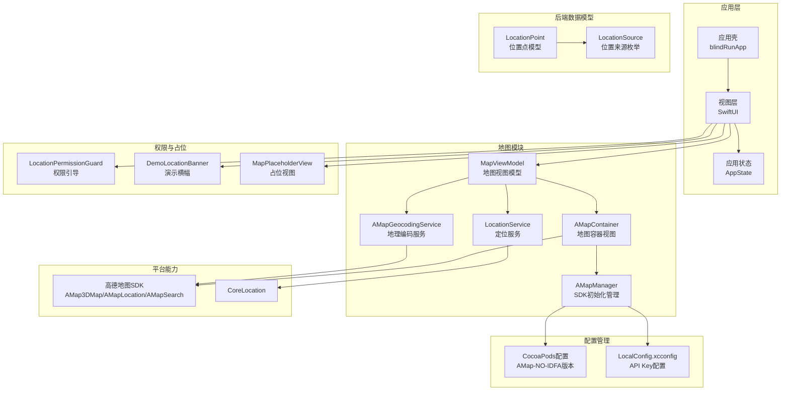
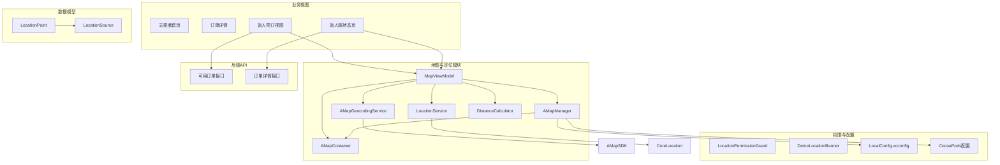
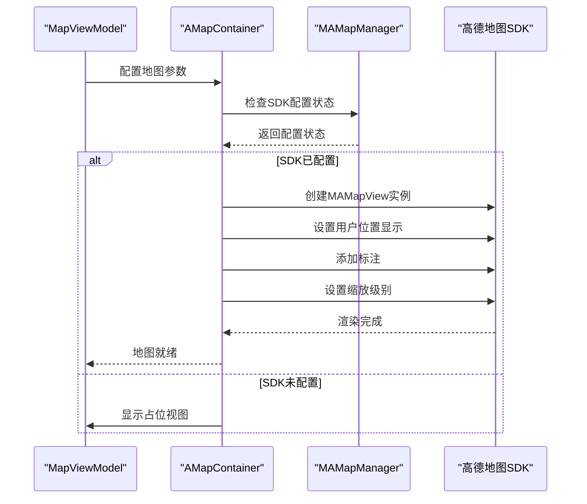
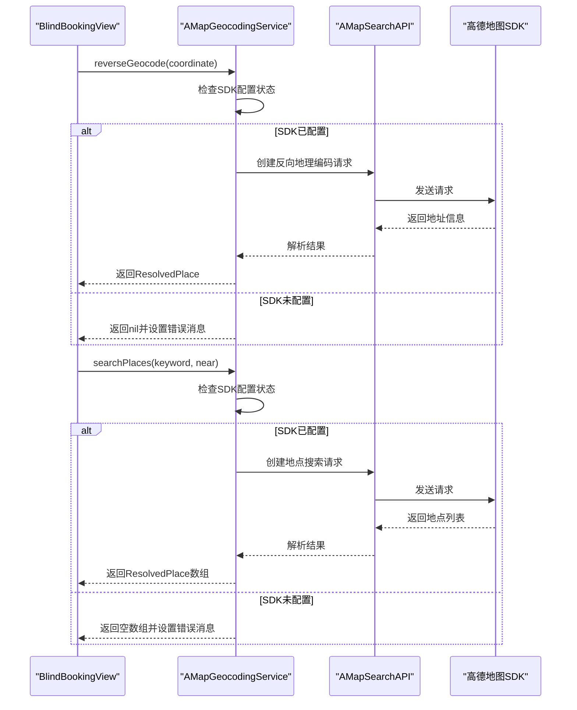
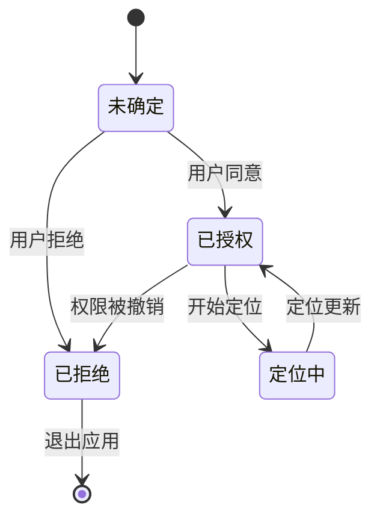
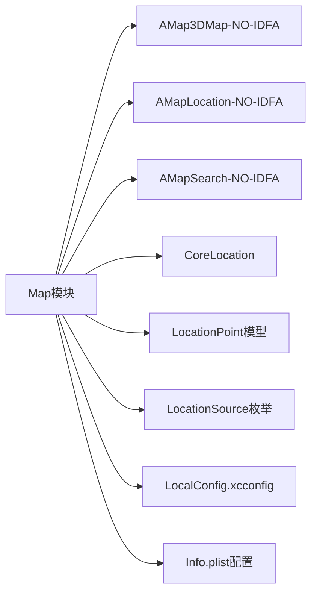

# 地图与定位服务

<cite>
**本文引用的文件**
- [AMapContainer.swift](file://blindRun/blindRun/Map/AMapContainer.swift)
- [AMapManager.swift](file://blindRun/blindRun/Map/AMapManager.swift)
- [AMapGeocodingService.swift](file://blindRun/blindRun/Map/AMapGeocodingService.swift)
- [LocationService.swift](file://blindRun/blindRun/Map/LocationService.swift)
- [MapViewModel.swift](file://blindRun/blindRun/Map/MapViewModel.swift)
- [DistanceCalculator.swift](file://blindRun/blindRun/Map/DistanceCalculator.swift)
- [LocationPermissionGuard.swift](file://blindRun/blindRun/Map/LocationPermissionGuard.swift)
- [MapPlaceholderView.swift](file://blindRun/blindRun/Map/MapPlaceholderView.swift)
- [BlindBookingView.swift](file://blindRun/blindRun/BlindRunner/BlindBookingView.swift)
- [Podfile](file://blindRun/Podfile)
- [Podfile.lock](file://blindRun/Podfile.lock)
- [LocalConfig.xcconfig.example](file://LocalConfig.xcconfig.example)
- [EnvironmentConfig.swift](file://blindRun/blindRun/Core/EnvironmentConfig.swift)
- [Info.plist](file://blindRun/blindRun/Info.plist)
- [blindRunApp.swift](file://blindRun/blindRun/blindRunApp.swift)
- [ContentView.swift](file://blindRun/blindRun/ContentView.swift)
- [LocationPoint.java](file://backend/src/main/java/com/aidrun/backend/location/LocationPoint.java)
- [LocationSource.java](file://backend/src/main/java/com/aidrun/backend/location/LocationSource.java)
- [08-ios-architecture.md](file://docs/08-ios-architecture.md)
- [02-mvp-scope.md](file://docs/02-mvp-scope.md)
- [01-product-requirements.md](file://docs/01-product-requirements.md)
- [06-data-model.md](file://docs/06-data-model.md)
- [07-api-contract.openapi.yaml](file://docs/07-api-contract.openapi.yaml)
- [spec.md](file://openspec/changes/add-aidrun-ios-spring-mvp/specs/amap-location/spec.md)
- [design.md](file://openspec/changes/add-aidrun-ios-spring-mvp/design.md)
- [tasks.md](file://openspec/changes/add-aidrun-ios-spring-mvp/tasks.md)
- [04-user-flows-and-state-machine.md](file://docs/04-user-flows-and-state-machine.md)
- [blindRunTests.swift](file://blindRunTests/blindRunTests.swift)
- [blindRunUITests.swift](file://blindRunUITests/blindRunUITests.swift)
- [AGENTS.md](file://AGENTS.md)
</cite>

## 更新摘要
**所做更改**
- 新增 AMapGeocodingService 组件，支持地点搜索和反向地理编码功能
- 更新盲人预订视图，集成地点解析和选择功能
- 增强位置权限管理，完善权限状态跟踪和降级处理
- 扩展 LocationSource 数据模型，支持多种位置来源标识
- 更新地图模块架构，增加地理编码服务的集成点

## 目录
1. [简介](#简介)
2. [项目结构](#项目结构)
3. [核心组件](#核心组件)
4. [架构总览](#架构总览)
5. [详细组件分析](#详细组件分析)
6. [依赖关系分析](#依赖关系分析)
7. [性能考量](#性能考量)
8. [故障排查指南](#故障排查指南)
9. [结论](#结论)
10. [附录](#附录)

## 简介
本文件面向"助盲跑 / AidRun"iOS端的地图与定位服务，围绕全新的高德地图SDK集成系统、地图渲染与交互、实时定位与精度优化、订单标记与动态更新、距离计算与排序、权限与隐私保护、错误处理与降级策略等方面，提供系统化技术文档。文档基于最新的 AMap 地图集成系统实现，确保与实际代码架构保持一致。

**更新** 新增 AMapGeocodingService 组件，提供完整的地点搜索和反向地理编码功能，支持盲人用户更便捷地选择出发地点。

## 项目结构
- iOS应用采用SwiftUI + MVVM架构，地图与定位能力通过独立的 Map 模块实现，职责边界清晰。
- 地图模块包含完整的 AMap 集成系统，包括地图容器、SDK管理、定位服务、地理编码服务、视图模型等核心组件。
- 项目已明确要求使用高德地图SDK而非Apple MapKit，并通过 CocoaPods 进行依赖管理。

**图表来源**
- [AMapContainer.swift:19-100](file://blindRun/blindRun/Map/AMapContainer.swift#L19-L100)
- [AMapManager.swift:9-34](file://blindRun/blindRun/Map/AMapManager.swift#L9-L34)
- [AMapGeocodingService.swift:23-36](file://blindRun/blindRun/Map/AMapGeocodingService.swift#L23-L36)
- [LocationService.swift:18-117](file://blindRun/blindRun/Map/LocationService.swift#L18-L117)
- [MapViewModel.swift:10-59](file://blindRun/blindRun/Map/MapViewModel.swift#L10-L59)
- [Podfile:7-9](file://blindRun/Podfile#L7-L9)
- [LocationPoint.java:8-48](file://backend/src/main/java/com/aidrun/backend/location/LocationPoint.java#L8-L48)
- [LocationSource.java:6-31](file://backend/src/main/java/com/aidrun/backend/location/LocationSource.java#L6-L31)

**章节来源**
- [AMapContainer.swift:1-126](file://blindRun/blindRun/Map/AMapContainer.swift#L1-L126)
- [AMapManager.swift:1-50](file://blindRun/blindRun/Map/AMapManager.swift#L1-L50)
- [AMapGeocodingService.swift:1-160](file://blindRun/blindRun/Map/AMapGeocodingService.swift#L1-L160)
- [LocationService.swift:1-161](file://blindRun/blindRun/Map/LocationService.swift#L1-L161)
- [MapViewModel.swift:1-103](file://blindRun/blindRun/Map/MapViewModel.swift#L1-L103)
- [Podfile:1-32](file://blindRun/Podfile#L1-L32)

## 核心组件
- **AMapManager** - 高德地图SDK初始化管理器，负责从配置文件读取API Key并初始化SDK，支持优雅降级
- **AMapGeocodingService** - 地理编码服务，提供地点搜索和反向地理编码功能，支持异步操作和错误处理
- **AMapContainer** - SwiftUI UIViewRepresentable桥接组件，封装MAMapView的使用，支持用户位置、标注和缩放控制
- **MapViewModel** - 地图视图模型，管理地图显示状态、标注和用户位置跟踪，通过Combine订阅定位更新
- **LocationService** - 设备定位服务封装，管理CLLocationManager生命周期、权限状态和当前位置，提供演示回退机制
- **MapViewWrapper** - 地图视图包装器，根据SDK配置状态自动选择显示地图或占位视图
- **权限与降级组件** - LocationPermissionGuard和DemoLocationBanner，提供权限引导和演示横幅显示

**更新** 新增 AMapGeocodingService 组件，支持地点搜索和反向地理编码，增强用户交互体验。

**章节来源**
- [AMapManager.swift:9-34](file://blindRun/blindRun/Map/AMapManager.swift#L9-L34)
- [AMapGeocodingService.swift:23-98](file://blindRun/blindRun/Map/AMapGeocodingService.swift#L23-L98)
- [AMapContainer.swift:19-100](file://blindRun/blindRun/Map/AMapContainer.swift#L19-L100)
- [MapViewModel.swift:10-59](file://blindRun/blindRun/Map/MapViewModel.swift#L10-L59)
- [LocationService.swift:18-117](file://blindRun/blindRun/Map/LocationService.swift#L18-L117)
- [LocationPermissionGuard.swift:7-57](file://blindRun/blindRun/Map/LocationPermissionGuard.swift#L7-L57)

## 架构总览
下图展示全新的 AMap 地图集成系统在整体架构中的位置与交互关系，包括与高德地图SDK、CoreLocation、业务模块及语音播报的协作。

**图表来源**
- [MapViewModel.swift:45-59](file://blindRun/blindRun/Map/MapViewModel.swift#L45-L59)
- [AMapManager.swift:16-34](file://blindRun/blindRun/Map/AMapManager.swift#L16-L34)
- [AMapGeocodingService.swift:100-156](file://blindRun/blindRun/Map/AMapGeocodingService.swift#L100-L156)
- [LocationService.swift:84-116](file://blindRun/blindRun/Map/LocationService.swift#L84-L116)

## 详细组件分析

### AMap 地图容器与视图包装器
- **AMapContainer** 作为 UIViewRepresentable 桥接组件，封装 MAMapView 的使用
- 支持用户位置显示、标注同步、缩放级别控制和地图中心更新
- 实现了智能标注同步机制，避免频繁的标注创建和销毁
- 提供 Coordinator 类处理地图委托事件，自定义标注视图样式

**图表来源**
- [AMapContainer.swift:26-54](file://blindRun/blindRun/Map/AMapContainer.swift#L26-L54)
- [AMapManager.swift:16-34](file://blindRun/blindRun/Map/AMapManager.swift#L16-L34)

**章节来源**
- [AMapContainer.swift:19-100](file://blindRun/blindRun/Map/AMapContainer.swift#L19-L100)
- [AMapManager.swift:9-34](file://blindRun/blindRun/Map/AMapManager.swift#L9-L34)

### 地理编码服务与地点解析
- **AMapGeocodingService** 提供完整的地点搜索和反向地理编码功能
- 支持异步操作，使用 CheckedContinuation 处理高德SDK回调
- 实现反向地理编码：将经纬度坐标转换为可读地址信息
- 提供地点搜索：基于关键词搜索周边地点，支持位置偏好
- 包含完整的错误处理机制，当SDK未配置时提供降级行为

**图表来源**
- [AMapGeocodingService.swift:42-87](file://blindRun/blindRun/Map/AMapGeocodingService.swift#L42-L87)
- [AMapGeocodingService.swift:100-156](file://blindRun/blindRun/Map/AMapGeocodingService.swift#L100-L156)

**章节来源**
- [AMapGeocodingService.swift:23-160](file://blindRun/blindRun/Map/AMapGeocodingService.swift#L23-L160)

### 高德地图SDK初始化管理
- **AMapManager** 负责从 Info.plist 读取 AMap API Key 并初始化 SDK
- 支持多种配置方式：AMapApiKey 和 AMAP_API_KEY 字段
- 实现优雅降级机制，当 Key 未配置时不会导致崩溃
- 提供 isConfigured 状态属性，供其他组件查询 SDK 配置状态

**章节来源**
- [AMapManager.swift:9-49](file://blindRun/blindRun/Map/AMapManager.swift#L9-L49)
- [Info.plist:5-6](file://blindRun/blindRun/Info.plist#L5-L6)

### 实时定位服务与权限管理
- **LocationService** 封装 CLLocationManager 生命周期和权限状态管理
- 提供有效的定位状态：优先使用真实位置，无真实位置时使用演示默认坐标
- 实现完整的权限状态跟踪：authorizedWhenInUse、authorizedAlways、denied、restricted、notDetermined
- 支持一次性定位和持续定位两种模式

**图表来源**
- [LocationService.swift:142-159](file://blindRun/blindRun/Map/LocationService.swift#L142-L159)

**章节来源**
- [LocationService.swift:18-161](file://blindRun/blindRun/Map/LocationService.swift#L18-L161)
- [LocationPermissionGuard.swift:7-57](file://blindRun/blindRun/Map/LocationPermissionGuard.swift#L7-L57)

### 地图视图模型与状态管理
- **MapViewModel** 管理地图显示状态、标注和用户位置跟踪
- 通过 Combine 订阅 LocationService 的位置更新来同步地图中心
- 提供地图中心移动到用户位置的功能
- 支持单个订单位置标注和多个订单位置标注的显示

**章节来源**
- [MapViewModel.swift:10-103](file://blindRun/blindRun/Map/MapViewModel.swift#L10-L103)

### 距离计算与排序算法
- **DistanceCalculator** 提供两点间距离计算、格式化显示和按距离排序功能
- 使用 CoreLocation 内置的 WGS84 椭球体距离算法
- 实现智能距离格式化：小于1000米显示米数，大于等于1000米显示公里数
- 支持按距离对可用订单列表进行排序

**章节来源**
- [DistanceCalculator.swift:8-52](file://blindRun/blindRun/Map/DistanceCalculator.swift#L8-L52)

### 权限引导与演示回退机制
- **LocationPermissionGuard** 根据用户角色显示不同的权限引导信息
- **DemoLocationBanner** 在使用演示默认位置时显示提示横幅
- **MapPlaceholderView** 当高德地图 API Key 未配置时显示占位视图
- 实现完整的权限处理流程：权限请求、权限状态跟踪、权限被拒绝时的降级处理

**章节来源**
- [LocationPermissionGuard.swift:7-96](file://blindRun/blindRun/Map/LocationPermissionGuard.swift#L7-L96)
- [MapPlaceholderView.swift:7-47](file://blindRun/blindRun/Map/MapPlaceholderView.swift#L7-L47)

### 盲人预订视图与地点选择
- **BlindBookingView** 集成地点搜索和选择功能
- 支持反向地理编码获取当前位置地址
- 提供地点搜索功能，支持关键词搜索和位置偏好
- 实现地点选择后的语音反馈和状态更新
- 包含完整的错误处理和用户提示机制

**章节来源**
- [BlindBookingView.swift:180-215](file://blindRun/blindRun/BlindRunner/BlindBookingView.swift#L180-L215)

## 依赖关系分析
- **模块耦合**：Map 模块内部组件高度内聚，与 Core、Orders、Volunteer、BlindRunner 模块松耦合
- **外部依赖**：通过 CocoaPods 管理高德地图 SDK 依赖，使用 NO-IDFA 版本避免审核问题
- **接口契约**：订单接口返回 LocationPoint 模型，Map 模块据此渲染标记与更新 UI
- **数据模型**：LocationPoint 和 LocationSource 枚举支持多种位置来源标识

**图表来源**
- [Podfile:7-9](file://blindRun/Podfile#L7-L9)
- [AMapManager.swift:38-48](file://blindRun/blindRun/Map/AMapManager.swift#L38-L48)
- [LocationPoint.java:8-48](file://backend/src/main/java/com/aidrun/backend/location/LocationPoint.java#L8-L48)
- [LocationSource.java:6-31](file://backend/src/main/java/com/aidrun/backend/location/LocationSource.java#L6-L31)

**章节来源**
- [Podfile:1-32](file://blindRun/Podfile#L1-L32)
- [Podfile.lock:1-31](file://blindRun/Podfile.lock#L1-L31)
- [AMapManager.swift:38-48](file://blindRun/blindRun/Map/AMapManager.swift#L38-L48)

## 性能考量
- **定位频率优化**：设置 desiredAccuracy 为 kCLLocationAccuracyBest，distanceFilter 为 10 米，平衡精度与功耗
- **地图渲染优化**：实现智能标注同步，避免频繁创建和销毁标注对象
- **内存管理**：使用弱引用管理 LocationService，防止循环引用
- **网络与缓存**：订单数据通过 API 获取，支持离线演示模式下的默认坐标显示
- **模拟定位性能**：利用 Xcode 模拟定位功能，减少真实设备依赖
- **地理编码性能**：使用异步操作避免阻塞主线程，实现合理的超时处理

## 故障排查指南
- **地图不显示**：检查 AMap API Key 配置，确认 LocalConfig.xcconfig 文件正确设置
- **定位无响应**：检查系统定位权限，确认 LocationService 正确初始化
- **权限被拒绝**：查看 LocationPermissionGuard 组件，确认权限引导正确显示
- **演示横幅显示**：确认 LocationService.isUsingDemoFallback 状态正确
- **CocoaPods 集成问题**：检查 Podfile 配置，确认 NO-IDFA 版本 SDK 正确安装
- **地理编码失败**：检查 AMapGeocodingService 的错误消息，确认SDK配置状态
- **地点搜索无结果**：验证关键词输入，检查网络连接和SDK配置

**章节来源**
- [AMapManager.swift:16-34](file://blindRun/blindRun/Map/AMapManager.swift#L16-L34)
- [LocationService.swift:84-116](file://blindRun/blindRun/Map/LocationService.swift#L84-L116)
- [AMapGeocodingService.swift:149-155](file://blindRun/blindRun/Map/AMapGeocodingService.swift#L149-L155)
- [Podfile:12-31](file://blindRun/Podfile#L12-L31)

## 结论
全新的 AMap 地图集成系统通过模块化的组件设计，实现了高德地图SDK与 SwiftUI 的无缝集成。系统具备完整的权限管理、演示回退、错误处理和降级策略，确保在各种环境下都能提供稳定的地图与定位服务。新增的 AMapGeocodingService 组件进一步增强了用户体验，提供了便捷的地点搜索和反向地理编码功能。通过 CocoaPods 的 NO-IDFA 版本 SDK，避免了应用审核问题，同时保持了完整的地图功能。

**更新** 新增的地理编码服务显著提升了盲人用户的使用体验，使他们能够更方便地选择和确认出发地点。

## 附录

### 高德地图 SDK 配置
- **CocoaPods 配置**：使用 AMap3DMap-NO-IDFA、AMapLocation-NO-IDFA、AMapSearch-NO-IDFA 三个 NO-IDFA 版本
- **API Key 管理**：通过 LocalConfig.xcconfig 文件管理，支持 Debug 和 Release 双配置
- **Info.plist 集成**：AMapApiKey 字段通过 Build Settings 注入

### 演示默认坐标配置
- **默认坐标**：北京坐标（39.9042°N, 116.4074°E）用于模拟器演示
- **坐标来源**：EnvironmentConfig.Defaults.demoLatitude 和 demoLongitude
- **使用场景**：定位权限被拒绝或定位失败时的演示回退

### 权限处理策略
- **权限类型**：支持 whenInUse 和 always 两种授权模式
- **权限状态跟踪**：完整跟踪授权状态变化，自动启动或停止定位
- **用户引导**：根据角色显示不同的权限引导信息

### 地理编码服务特性
- **反向地理编码**：将经纬度坐标转换为可读地址信息
- **地点搜索**：基于关键词搜索周边地点，支持位置偏好
- **错误处理**：完整的错误消息管理和降级策略
- **异步操作**：使用现代 Swift 异步编程模型

### 位置数据模型
- **LocationPoint**：包含纬度、经度、地址文本和位置来源
- **LocationSource**：支持 DEVICE_LOCATION、MANUAL、DEMO_DEFAULT 三种来源
- **数据传输**：与后端 API 兼容的 JSON 序列化格式

**章节来源**
- [Podfile:7-9](file://blindRun/Podfile#L7-L9)
- [LocalConfig.xcconfig.example:29-30](file://LocalConfig.xcconfig.example#L29-L30)
- [EnvironmentConfig.swift:57-58](file://blindRun/blindRun/Core/EnvironmentConfig.swift#L57-L58)
- [LocationPermissionGuard.swift:42-48](file://blindRun/blindRun/Map/LocationPermissionGuard.swift#L42-L48)
- [AMapGeocodingService.swift:8-19](file://blindRun/blindRun/Map/AMapGeocodingService.swift#L8-L19)
- [LocationPoint.java:8-48](file://backend/src/main/java/com/aidrun/backend/location/LocationPoint.java#L8-L48)
- [LocationSource.java:6-31](file://backend/src/main/java/com/aidrun/backend/location/LocationSource.java#L6-L31)