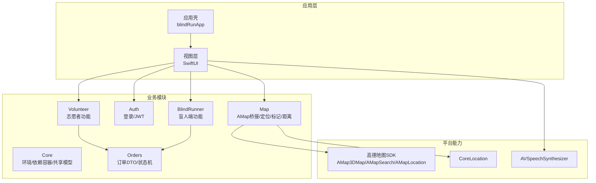
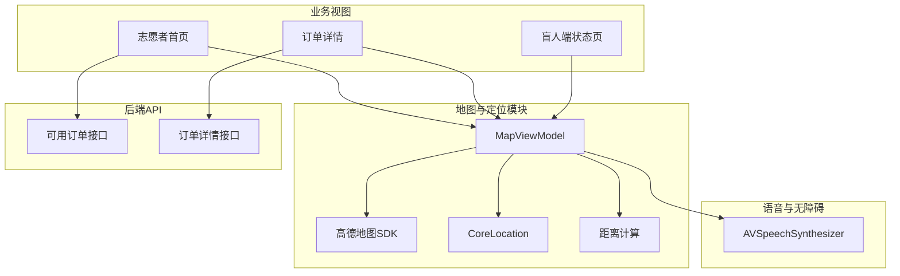
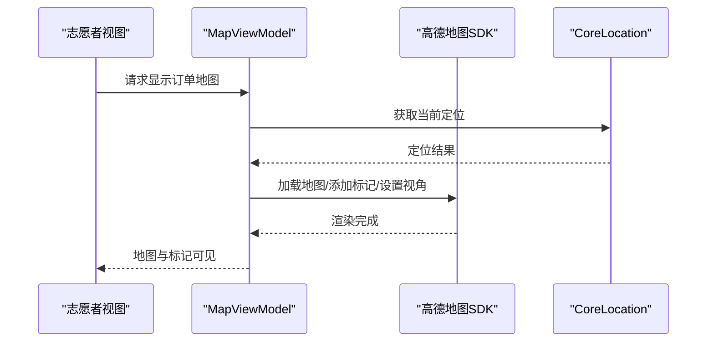
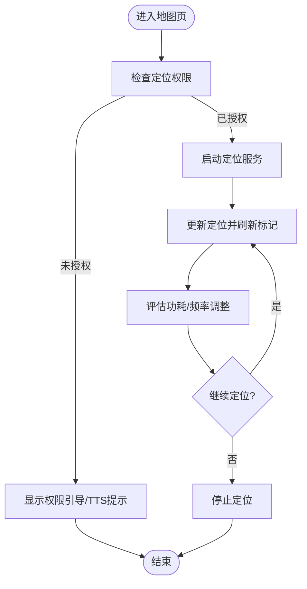
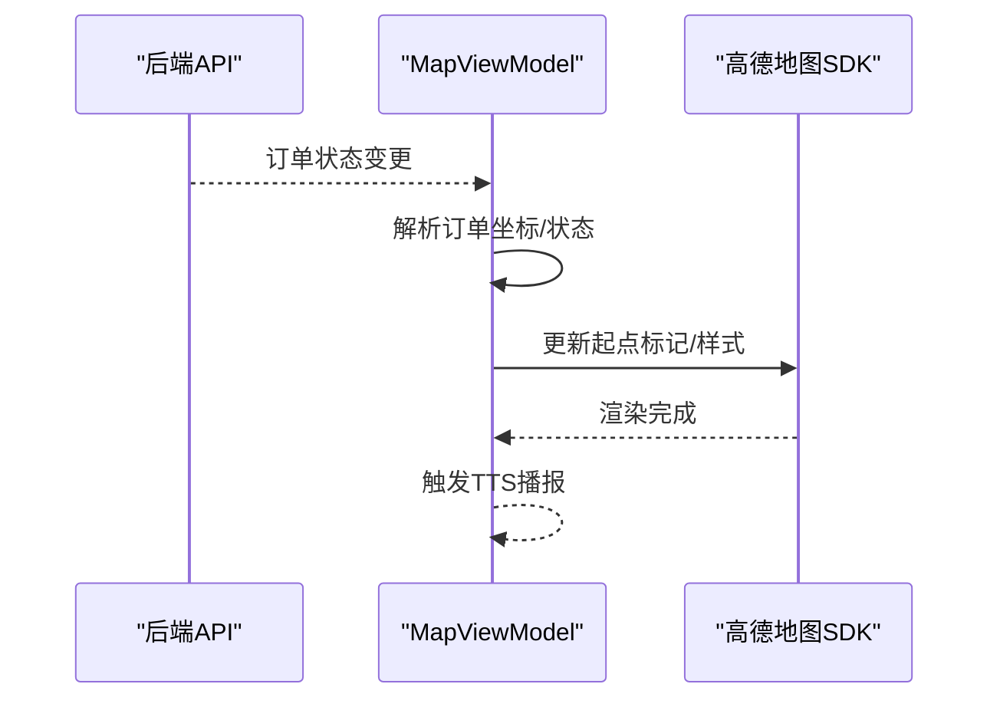
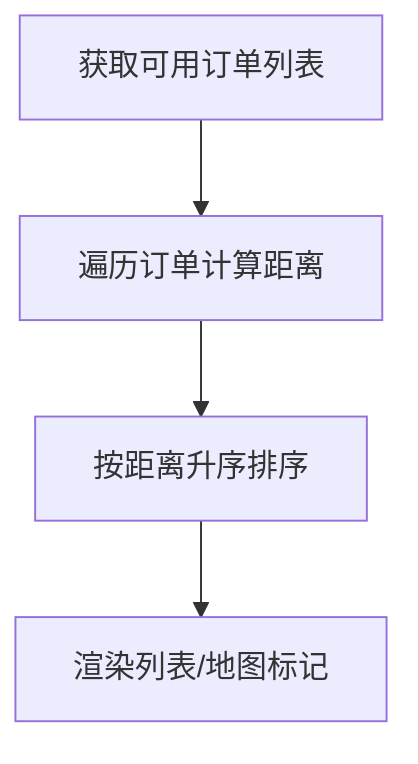
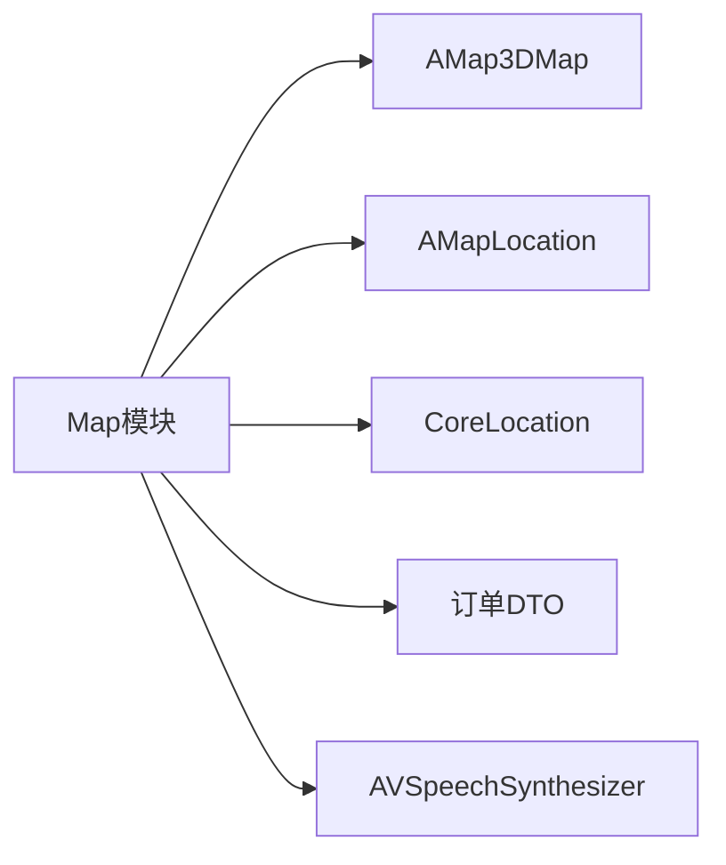

# 地图与定位服务

<cite>
**本文引用的文件**
- [blindRunApp.swift](file://blindRun/blindRun/blindRunApp.swift)
- [ContentView.swift](file://blindRun/blindRun/blindRun/ContentView.swift)
- [08-ios-architecture.md](file://docs/08-ios-architecture.md)
- [02-mvp-scope.md](file://docs/02-mvp-scope.md)
- [01-product-requirements.md](file://docs/01-product-requirements.md)
- [06-data-model.md](file://docs/06-data-model.md)
- [07-api-contract.openapi.yaml](file://docs/07-api-contract.openapi.yaml)
- [spec.md](file://openspec/changes/add-aidrun-ios-spring-mvp/specs/amap-location/spec.md)
- [design.md](file://openspec/changes/add-aidrun-ios-spring-mvp/design.md)
- [tasks.md](file://openspec/changes/add-aidrun-ios-spring-mvp/tasks.md)
- [04-user-flows-and-state-machine.md](file://docs/04-user-flows-and-state-machine.md)
- [blindRunTests.swift](file://blindRunTests/blindRunTests.swift)
- [blindRunUITests.swift](file://blindRunUITests/blindRunUITests.swift)
</cite>

## 目录
1. [简介](#简介)
2. [项目结构](#项目结构)
3. [核心组件](#核心组件)
4. [架构总览](#架构总览)
5. [详细组件分析](#详细组件分析)
6. [依赖关系分析](#依赖关系分析)
7. [性能考量](#性能考量)
8. [故障排查指南](#故障排查指南)
9. [结论](#结论)
10. [附录](#附录)

## 简介
本文件面向“助盲跑 / AidRun”iOS端的地图与定位服务，围绕高德地图SDK集成、地图渲染与交互、实时定位与精度优化、订单标记与动态更新、距离计算与排序、权限与隐私保护、错误处理与降级策略等方面，提供系统化技术文档。文档严格基于仓库现有规格与架构文档，确保实现与需求一致。

## 项目结构
- iOS应用采用SwiftUI + MVVM架构，地图与定位能力属于独立模块，职责边界清晰。
- 地图模块主要承担：高德地图桥接、当前定位获取、订单起点标记展示、iOS侧距离计算与排序、权限引导与降级提示。
- 项目已明确要求使用高德地图SDK而非Apple MapKit，并在架构文档中给出模块布局与职责划分。

图表来源
- [08-ios-architecture.md](file://docs/08-ios-architecture.md)
- [01-product-requirements.md](file://docs/01-product-requirements.md)

章节来源
- [08-ios-architecture.md](file://docs/08-ios-architecture.md)
- [02-mvp-scope.md](file://docs/02-mvp-scope.md)
- [01-product-requirements.md](file://docs/01-product-requirements.md)

## 核心组件
- 地图与定位模块（Map）
  - 高德地图桥接：负责地图渲染、标记展示、交互控制。
  - 定位服务：使用高德定位能力与CoreLocation结合，保障定位稳定性与精度。
  - 订单标记：在地图上展示订单起点标记，支持动态更新。
  - 距离计算与排序：基于志愿者当前位置与订单起点坐标，进行iOS侧距离计算与排序。
  - 权限与降级：统一处理定位权限请求、权限拒绝拦截、模拟器降级与演示坐标回退。
- 业务协同
  - 订单模块（Orders）提供订单DTO与状态机，Map模块消费订单坐标并渲染标记。
  - 志愿者模块（Volunteer）负责拉取可用订单、触发接单动作，Map模块在“查看地图”场景展示起点与当前定位。
  - 盲人端（BlindRunner）在订单状态页轮询展示服务进展，Map模块在“服务中”场景展示志愿者到达与开始服务后的路径标记。

章节来源
- [08-ios-architecture.md](file://docs/08-ios-architecture.md)
- [02-mvp-scope.md](file://docs/02-mvp-scope.md)
- [06-data-model.md](file://docs/06-data-model.md)
- [07-api-contract.openapi.yaml](file://docs/07-api-contract.openapi.yaml)

## 架构总览
下图展示地图与定位在整体架构中的位置与交互关系，包括与高德地图SDK、CoreLocation、业务模块及语音播报的协作。

图表来源
- [08-ios-architecture.md](file://docs/08-ios-architecture.md)
- [04-user-flows-and-state-machine.md](file://docs/04-user-flows-and-state-machine.md)

## 详细组件分析

### 地图渲染与交互控制
- 渲染目标
  - 展示真实地图、当前定位、订单起点标记。
  - 在志愿者“查看地图”场景中，同时展示志愿者当前位置与订单起点，便于判断距离。
- 交互控制
  - 支持缩放、平移、旋转等基础手势。
  - 标记点击反馈与TTS播报，提升无障碍体验。
- 与高德SDK集成
  - 使用高德地图3D地图、搜索与定位能力，确保渲染质量与定位精度。
  - 通过桥接层封装SDK调用，避免跨模块耦合。

图表来源
- [08-ios-architecture.md](file://docs/08-ios-architecture.md)
- [02-mvp-scope.md](file://docs/02-mvp-scope.md)

章节来源
- [08-ios-architecture.md](file://docs/08-ios-architecture.md)
- [02-mvp-scope.md](file://docs/02-mvp-scope.md)

### 实时定位与精度优化
- 定位来源
  - 结合高德定位能力与CoreLocation，优先使用设备GPS，室内弱信号场景下启用高德定位融合算法。
- 精度与功耗
  - 采用合理定位间隔与精度阈值，避免频繁更新导致电量消耗。
  - 在志愿者“查看地图”场景中，按需启动定位，减少后台持续扫描。
- 电池续航
  - 定位停止策略：离开地图页、进入后台、或无交互一段时间后暂停更新。
  - 提供定位失败提示与降级策略，避免阻塞用户操作。

图表来源
- [08-ios-architecture.md](file://docs/08-ios-architecture.md)
- [02-mvp-scope.md](file://docs/02-mvp-scope.md)

章节来源
- [08-ios-architecture.md](file://docs/08-ios-architecture.md)
- [02-mvp-scope.md](file://docs/02-mvp-scope.md)

### 订单标记样式定制与动态更新
- 样式定制
  - 订单起点标记采用高德SDK自定义图标，颜色与语义明确（如起点蓝点、志愿者红点）。
  - 标记点击后展示订单信息卡片，支持TTS播报关键信息。
- 动态更新
  - 订单状态变化时，Map模块监听并更新标记与地图视角。
  - 志愿者“我已到达”后，更新标记样式与提示，触发TTS播报。
- 用户界面适配
  - 在浅色/深色模式下保持高对比度，确保无障碍可用性。
  - 大尺寸按钮与清晰标签，配合VoiceOver与TTS。

图表来源
- [08-ios-architecture.md](file://docs/08-ios-architecture.md)
- [06-data-model.md](file://docs/06-data-model.md)

章节来源
- [08-ios-architecture.md](file://docs/08-ios-architecture.md)
- [06-data-model.md](file://docs/06-data-model.md)

### 距离计算算法与排序
- 计算方式
  - iOS侧使用当前志愿者定位与订单起点坐标，采用球面距离公式（Haversine）计算直线距离。
- 排序策略
  - 对后端返回的可用订单列表按距离升序排序，最近订单优先展示。
- 性能与准确性
  - 距离计算在主线程轻量执行，避免阻塞UI。
  - 对无效或异常坐标进行过滤与容错处理。

图表来源
- [08-ios-architecture.md](file://docs/08-ios-architecture.md)
- [02-mvp-scope.md](file://docs/02-mvp-scope.md)
- [07-api-contract.openapi.yaml](file://docs/07-api-contract.openapi.yaml)

章节来源
- [08-ios-architecture.md](file://docs/08-ios-architecture.md)
- [02-mvp-scope.md](file://docs/02-mvp-scope.md)
- [07-api-contract.openapi.yaml](file://docs/07-api-contract.openapi.yaml)

### 路线规划与导航集成
- 需求说明
  - MVP阶段不实现复杂路线导航与自动规划，采用“线下沟通 + 地图标记”的简单方案。
- 集成建议
  - 使用高德地图SDK的路径规划能力，仅在“查看地图”场景展示起点到终点的示意路径。
  - 导航按钮仅用于打开系统地图应用，不内置复杂导航UI。

章节来源
- [02-mvp-scope.md](file://docs/02-mvp-scope.md)

### 权限管理、隐私保护与数据安全
- 权限管理
  - 定位权限为必需权限，拒绝将阻断核心流程（盲人创建预约、志愿者查看/接单）。
  - 提供权限引导与TTS提示，帮助用户理解权限必要性。
- 隐私保护
  - 仅在用户授权前提下收集与使用位置信息；默认测试坐标仅用于演示，不上传。
  - 用户可随时在系统设置中撤销权限，应用需优雅降级。
- 数据安全
  - Token存储在UserDefaults（MVP），生产版本需迁移到Keychain。
  - 高德密钥通过本地配置文件管理，加入.gitignore，示例文件仅列出键名。

章节来源
- [08-ios-architecture.md](file://docs/08-ios-architecture.md)
- [02-mvp-scope.md](file://docs/02-mvp-scope.md)
- [01-product-requirements.md](file://docs/01-product-requirements.md)

### 错误处理、离线模式与降级策略
- 错误处理
  - 定位失败：提示用户检查权限/飞行模式/室内信号，提供重试与演示坐标回退。
  - 网络异常：对订单列表与详情接口增加错误映射与TTS播报，避免UI卡死。
- 离线模式
  - MVP不提供离线模式；定位失败时使用默认测试坐标维持演示闭环，强调真实定位的重要性。
- 降级策略
  - 无定位权限：阻止相关操作并引导开启权限。
  - 无网络：展示缓存数据与离线提示，支持重试。

章节来源
- [08-ios-architecture.md](file://docs/08-ios-architecture.md)
- [02-mvp-scope.md](file://docs/02-mvp-scope.md)
- [06-data-model.md](file://docs/06-data-model.md)

## 依赖关系分析
- 模块耦合
  - Map模块与Core、Orders、Volunteer、BlindRunner模块松耦合，通过协议与DTO交互。
- 外部依赖
  - 高德地图SDK：AMap3DMap（地图渲染）、AMapSearch（搜索）、AMapLocation（定位）。
  - CoreLocation：底层定位能力。
  - AVSpeechSynthesizer：无障碍播报。
- 接口契约
  - 订单接口返回订单坐标与状态，Map模块据此渲染标记与更新UI。

图表来源
- [08-ios-architecture.md](file://docs/08-ios-architecture.md)
- [01-product-requirements.md](file://docs/01-product-requirements.md)
- [06-data-model.md](file://docs/06-data-model.md)

章节来源
- [08-ios-architecture.md](file://docs/08-ios-architecture.md)
- [01-product-requirements.md](file://docs/01-product-requirements.md)
- [06-data-model.md](file://docs/06-data-model.md)

## 性能考量
- 定位频率与精度：根据场景动态调整更新频率，避免过度扫描。
- 渲染优化：批量更新标记、延迟加载远端图片资源、控制地图层级与视野范围。
- 内存管理：及时释放不再使用的地图与定位资源，避免内存泄漏。
- 网络与缓存：对订单列表与详情进行本地缓存，降低网络抖动影响。

## 故障排查指南
- 定位无响应
  - 检查系统定位权限与飞行模式；在模拟器中确认是否启用模拟定位。
  - 查看日志与TTS提示，确认是否触发了权限引导。
- 地图空白或崩溃
  - 核对高德密钥配置与网络连通性；确认初始化顺序正确。
- 订单标记不更新
  - 检查订单状态轮询与Map模块订阅逻辑；确认坐标字段有效。
- UI测试与性能
  - 使用XCTest与XCUITest进行功能与启动性能测试，关注主线程阻塞与内存峰值。

章节来源
- [blindRunTests.swift](file://blindRunTests/blindRunTests.swift)
- [blindRunUITests.swift](file://blindRunUITests/blindRunUITests.swift)

## 结论
本技术文档基于仓库现有规格与架构文档，系统阐述了地图与定位服务的设计思路、实现要点与最佳实践。通过高德地图SDK与CoreLocation的协同、严格的权限与隐私保护、完善的错误处理与降级策略，以及iOS侧的距离计算与排序，实现了符合MVP目标的地图与定位闭环。后续可在生产版本中进一步完善定位精度、导航集成与数据安全策略。

## 附录
- 高德地图Key管理
  - 使用本地配置文件存储密钥，加入.gitignore；提供示例配置文件说明所需键名。
- 任务与进度
  - iOS端Map、定位、语音与无障碍集成任务已在规划中，确保按时交付演示闭环。

章节来源
- [02-mvp-scope.md](file://docs/02-mvp-scope.md)
- [tasks.md](file://openspec/changes/add-aidrun-ios-spring-mvp/tasks.md)
- [design.md](file://openspec/changes/add-aidrun-ios-spring-mvp/design.md)
- [spec.md](file://openspec/changes/add-aidrun-ios-spring-mvp/specs/amap-location/spec.md)