# 地理信息服务

<cite>
**本文档引用的文件**
- [AMapContainer.swift](file://blindRun/Map/AMapContainer.swift)
- [AMapGeocodingService.swift](file://blindRun/Map/AMapGeocodingService.swift)
- [AMapManager.swift](file://blindRun/Map/AMapManager.swift)
- [LocationService.swift](file://blindRun/Map/LocationService.swift)
- [DistanceCalculator.swift](file://blindRun/Map/DistanceCalculator.swift)
- [LocationPermissionGuard.swift](file://blindRun/Map/LocationPermissionGuard.swift)
- [MapPlaceholderView.swift](file://blindRun/Map/MapPlaceholderView.swift)
- [MapViewModel.swift](file://blindRun/Map/MapViewModel.swift)
- [LocationPoint.java](file://backend/src/main/java/com/aidrun/backend/location/LocationPoint.java)
- [LocationSource.java](file://backend/src/main/java/com/aidrun/backend/location/LocationSource.java)
- [LocalConfig.xcconfig.example](file://LocalConfig.xcconfig.example)
- [AppColors.swift](file://blindRun/Core/DesignSystem/AppColors.swift)
- [UserModels.swift](file://blindRun/Core/Models/UserModels.swift)
- [application.yml](file://backend/src/main/resources/application.yml)
</cite>

## 目录
1. [简介](#简介)
2. [项目结构](#项目结构)
3. [核心组件](#核心组件)
4. [架构概览](#架构概览)
5. [详细组件分析](#详细组件分析)
6. [依赖关系分析](#依赖关系分析)
7. [性能考虑](#性能考虑)
8. [故障排除指南](#故障排除指南)
9. [结论](#结论)

## 简介

地理信息服务是 AidRun 无障碍跑腿服务应用的核心基础设施，负责处理位置数据、地图渲染、地理编码和距离计算等功能。该服务采用混合架构设计，结合了 iOS 原生 CoreLocation 框架、高德地图 SDK 以及 Spring Boot 后端服务。

本服务主要服务于两类用户角色：视障跑者和志愿者，为他们提供精确的位置定位、地图可视化和基于位置的服务功能。系统设计充分考虑了无障碍访问需求，提供了完整的权限管理和降级机制。

## 项目结构

地理信息服务在项目中采用模块化组织方式，主要分布在以下目录：

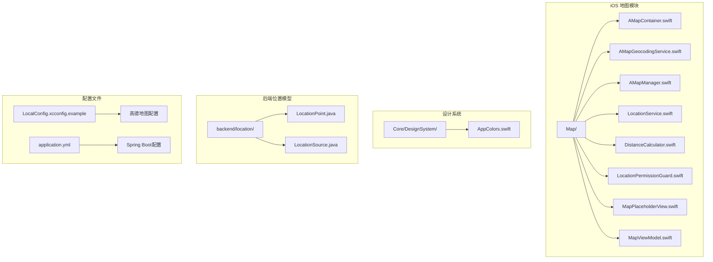

**图表来源**
- [AMapContainer.swift:1-133](file://blindRun/Map/AMapContainer.swift#L1-L133)
- [AMapGeocodingService.swift:1-256](file://blindRun/Map/AMapGeocodingService.swift#L1-L256)
- [AMapManager.swift:1-64](file://blindRun/Map/AMapManager.swift#L1-L64)

**章节来源**
- [AMapContainer.swift:1-133](file://blindRun/Map/AMapContainer.swift#L1-L133)
- [AMapGeocodingService.swift:1-256](file://blindRun/Map/AMapGeocodingService.swift#L1-L256)
- [AMapManager.swift:1-64](file://blindRun/Map/AMapManager.swift#L1-L64)

## 核心组件

地理信息服务包含以下核心组件：

### 1. 地图容器组件
- **AMapContainer**: SwiftUI 组件桥接高德地图视图
- **MapViewWrapper**: 条件渲染的地图包装器
- **MapViewModel**: 地图状态管理

### 2. 定位服务组件
- **LocationService**: 设备定位管理
- **LocationPermissionGuard**: 权限拒绝引导界面
- **DemoLocationBanner**: 演示模式提示

### 3. 地理编码组件
- **AMapGeocodingService**: 地点反向地理编码
- **DistanceCalculator**: 距离计算工具

### 4. 后端位置模型
- **LocationPoint**: 位置数据模型
- **LocationSource**: 位置来源枚举

**章节来源**
- [LocationService.swift:1-197](file://blindRun/Map/LocationService.swift#L1-L197)
- [AMapGeocodingService.swift:25-201](file://blindRun/Map/AMapGeocodingService.swift#L25-L201)
- [DistanceCalculator.swift:8-52](file://blindRun/Map/DistanceCalculator.swift#L8-L52)

## 架构概览

地理信息服务采用分层架构设计，实现了前端展示层、业务逻辑层和数据持久层的有效分离：

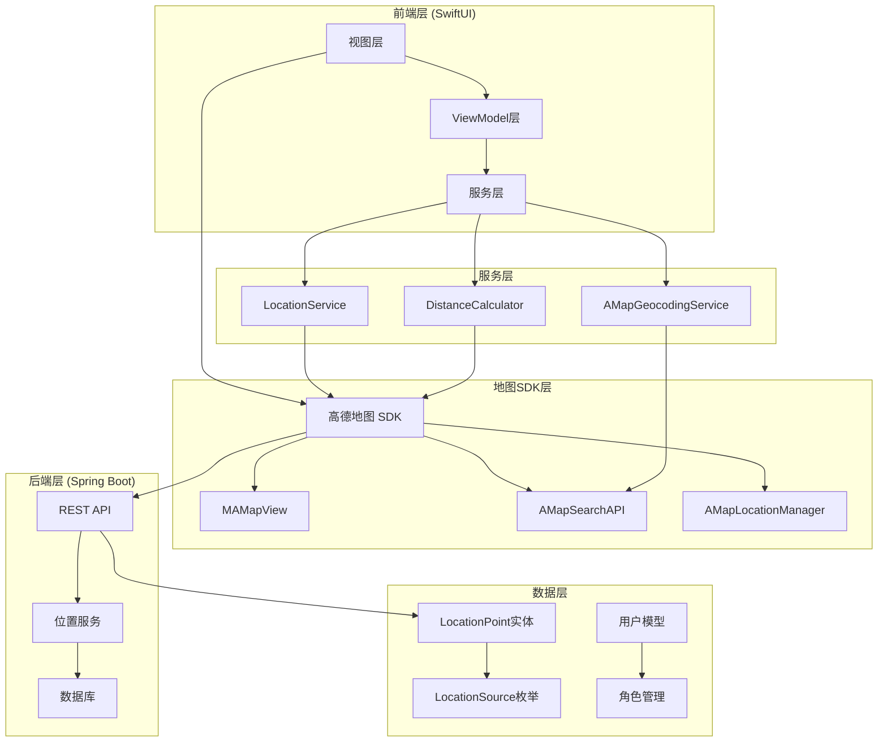

**图表来源**
- [LocationService.swift:18-153](file://blindRun/Map/LocationService.swift#L18-L153)
- [AMapGeocodingService.swift:26-40](file://blindRun/Map/AMapGeocodingService.swift#L26-L40)
- [AMapManager.swift:12-38](file://blindRun/Map/AMapManager.swift#L12-L38)

## 详细组件分析

### 地图容器组件分析

#### AMapContainer 类结构

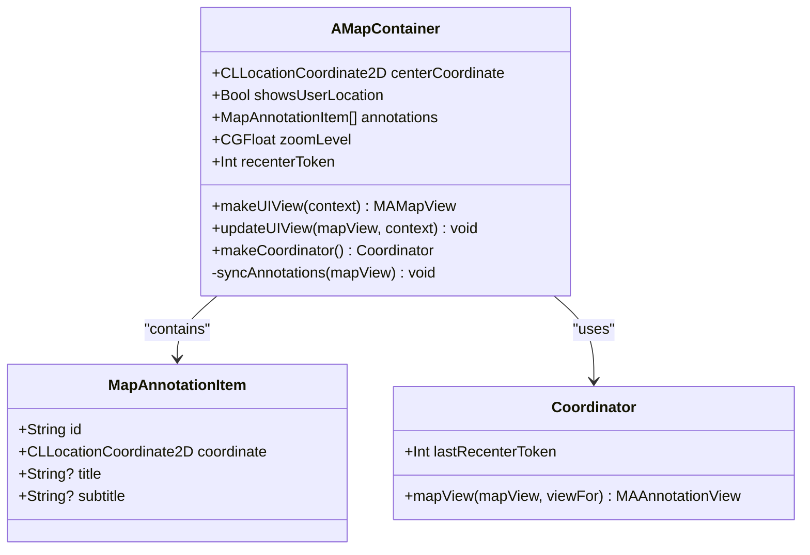

**图表来源**
- [AMapContainer.swift:19-104](file://blindRun/Map/AMapContainer.swift#L19-L104)

#### 地图初始化流程

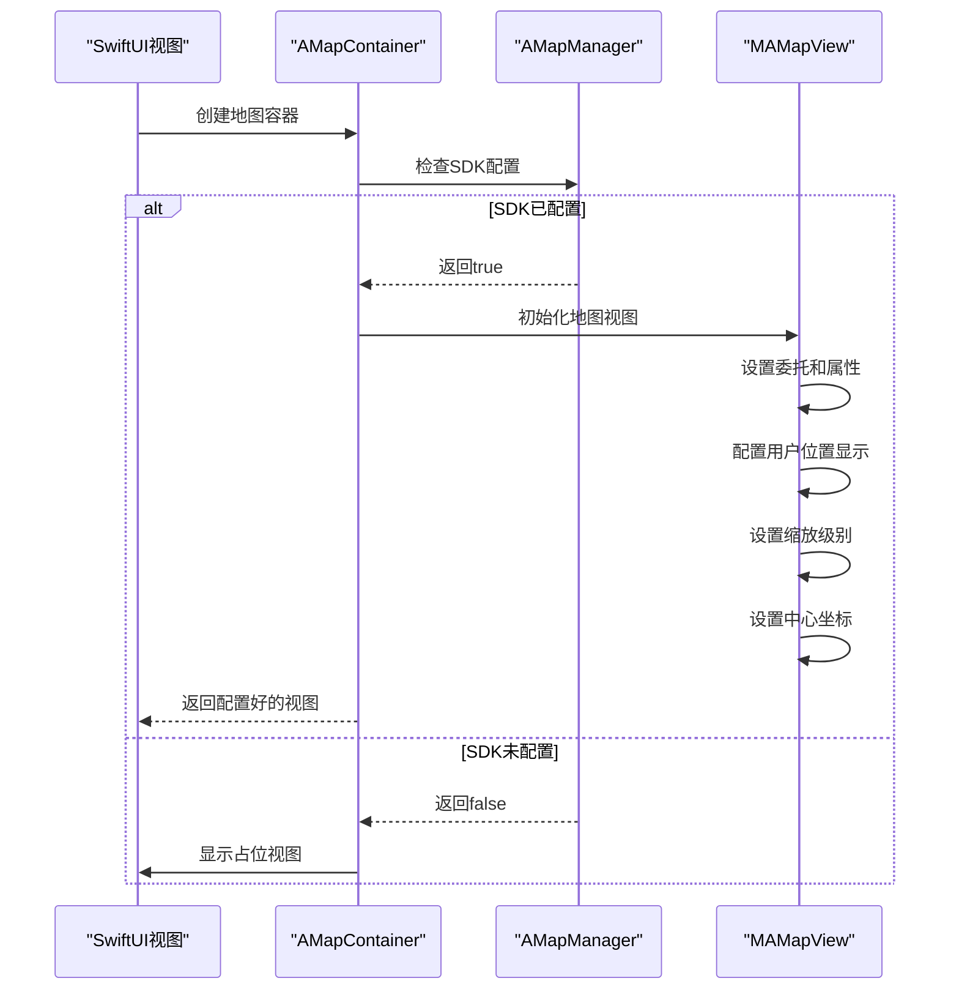

**图表来源**
- [AMapContainer.swift:27-58](file://blindRun/Map/AMapContainer.swift#L27-L58)
- [AMapManager.swift:19-38](file://blindRun/Map/AMapManager.swift#L19-L38)

**章节来源**
- [AMapContainer.swift:19-104](file://blindRun/Map/AMapContainer.swift#L19-L104)

### 定位服务组件分析

#### LocationService 类结构

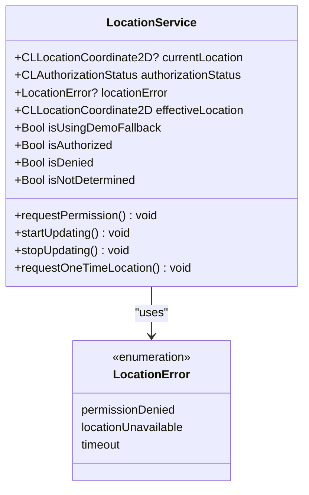

**图表来源**
- [LocationService.swift:18-153](file://blindRun/Map/LocationService.swift#L18-L153)

#### 定位权限管理流程

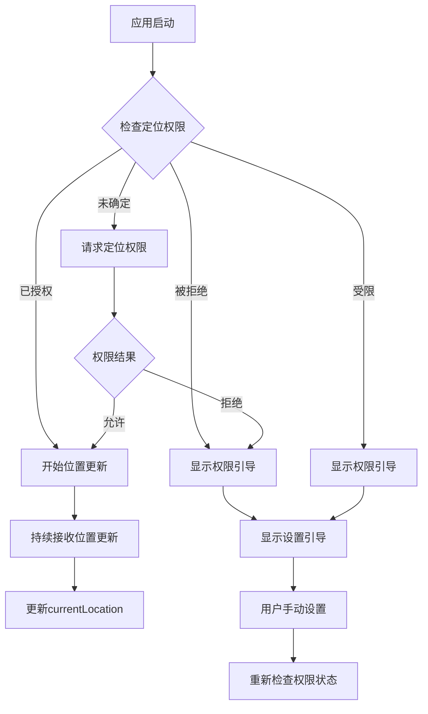

**图表来源**
- [LocationService.swift:157-196](file://blindRun/Map/LocationService.swift#L157-L196)

**章节来源**
- [LocationService.swift:18-197](file://blindRun/Map/LocationService.swift#L18-L197)

### 地理编码服务组件分析

#### AMapGeocodingService 类结构

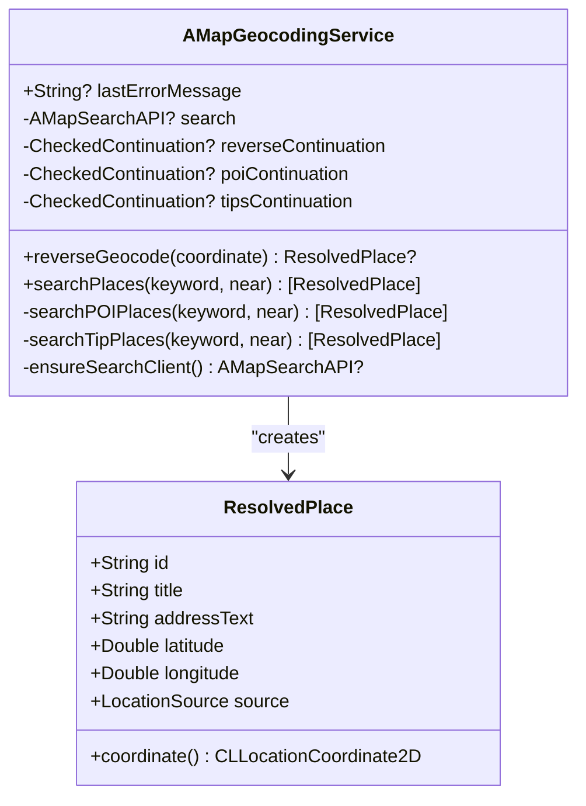

**图表来源**
- [AMapGeocodingService.swift:26-201](file://blindRun/Map/AMapGeocodingService.swift#L26-L201)

#### 地点搜索流程

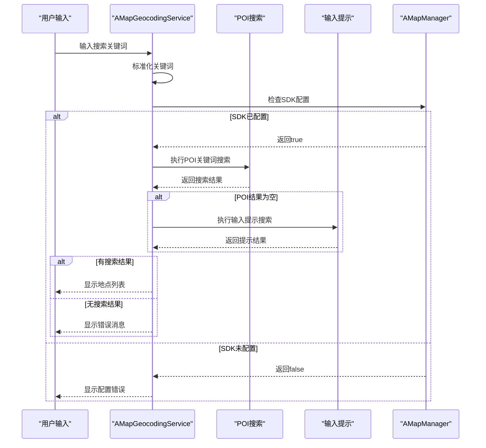

**图表来源**
- [AMapGeocodingService.swift:65-89](file://blindRun/Map/AMapGeocodingService.swift#L65-L89)

**章节来源**
- [AMapGeocodingService.swift:26-256](file://blindRun/Map/AMapGeocodingService.swift#L26-L256)

### 距离计算组件分析

#### DistanceCalculator 工具类

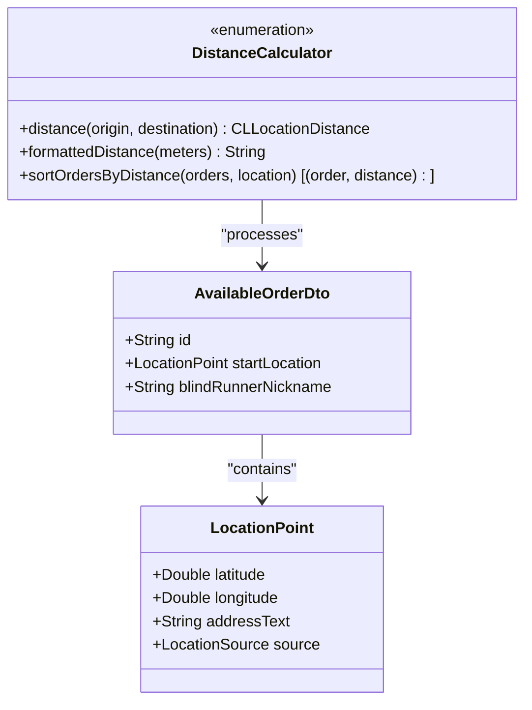

**图表来源**
- [DistanceCalculator.swift:8-52](file://blindRun/Map/DistanceCalculator.swift#L8-L52)

#### 距离计算算法

```mermaid
flowchart TD
A[输入坐标点] --> B[创建CLLocation对象]
B --> C[使用WGS84椭球体算法]
C --> D[计算直线距离]
D --> E{距离值判断}
E --> |< 1000米| F[格式化为米单位]
E --> |>= 1000米| G[格式化为公里单位]
F --> H[返回结果]
G --> H[返回结果]
I[订单排序] --> J[计算每个订单距离]
J --> K[创建(订单, 距离)元组]
K --> L[按距离升序排序]
L --> M[返回排序结果]
```

**图表来源**
- [DistanceCalculator.swift:11-51](file://blindRun/Map/DistanceCalculator.swift#L11-L51)

**章节来源**
- [DistanceCalculator.swift:8-53](file://blindRun/Map/DistanceCalculator.swift#L8-L53)

### 后端位置模型分析

#### 位置数据模型

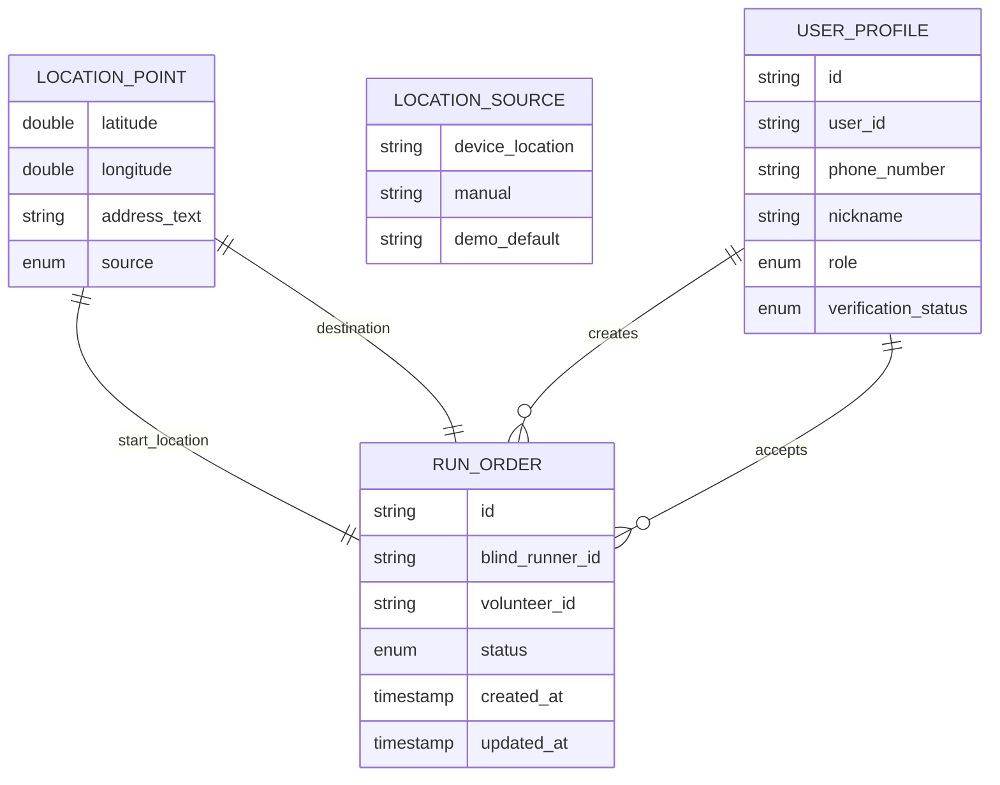

**图表来源**
- [LocationPoint.java:9-48](file://backend/src/main/java/com/aidrun/backend/location/LocationPoint.java#L9-L48)
- [LocationSource.java:6-31](file://backend/src/main/java/com/aidrun/backend/location/LocationSource.java#L6-L31)

**章节来源**
- [LocationPoint.java:1-49](file://backend/src/main/java/com/aidrun/backend/location/LocationPoint.java#L1-L49)
- [LocationSource.java:1-32](file://backend/src/main/java/com/aidrun/backend/location/LocationSource.java#L1-L32)

## 依赖关系分析

地理信息服务的依赖关系呈现清晰的分层结构：

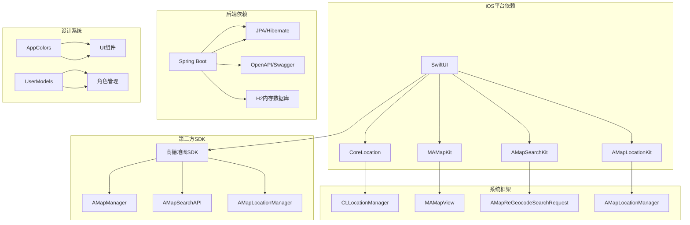

**图表来源**
- [AMapManager.swift:1-64](file://blindRun/Map/AMapManager.swift#L1-L64)
- [application.yml:1-34](file://backend/src/main/resources/application.yml#L1-L34)

**章节来源**
- [AMapManager.swift:1-64](file://blindRun/Map/AMapManager.swift#L1-L64)
- [application.yml:1-34](file://backend/src/main/resources/application.yml#L1-L34)

## 性能考虑

### 地图渲染优化

1. **延迟初始化**: 地图视图采用延迟初始化策略，只有在需要时才创建
2. **坐标更新节流**: 通过阈值检测避免频繁的地图中心重置
3. **标注复用**: 使用标注视图复用机制减少内存分配

### 定位精度优化

1. **精度配置**: 设置最佳定位精度和距离过滤器
2. **权限管理**: 实现智能权限状态检查和错误处理
3. **降级机制**: 当定位不可用时提供演示位置

### 网络请求优化

1. **异步处理**: 所有网络请求都采用异步方式处理
2. **错误恢复**: 实现完善的错误处理和重试机制
3. **资源清理**: 及时清理不再使用的搜索客户端

## 故障排除指南

### 地图功能问题

**问题**: 地图无法显示
**解决方案**: 
1. 检查高德地图 API Key 配置
2. 验证 LocalConfig.xcconfig 文件设置
3. 确认 Info.plist 中的隐私描述配置

**问题**: 地图显示占位符
**解决方案**:
1. 查看控制台输出的配置错误信息
2. 检查网络连接状态
3. 验证 API Key 有效性

### 定位权限问题

**问题**: 定位权限被拒绝
**解决方案**:
1. 检查系统设置中的应用权限
2. 引导用户前往设置页面启用定位
3. 提供清晰的权限说明

**问题**: 定位不准确
**解决方案**:
1. 确保设备在开阔环境中
2. 检查 GPS 信号强度
3. 重启定位服务

### 地理编码问题

**问题**: 地点搜索失败
**解决方案**:
1. 检查网络连接状态
2. 验证关键词输入
3. 尝试其他关键词或位置

**章节来源**
- [LocationPermissionGuard.swift:7-57](file://blindRun/Map/LocationPermissionGuard.swift#L7-L57)
- [MapPlaceholderView.swift:7-38](file://blindRun/Map/MapPlaceholderView.swift#L7-L38)

## 结论

地理信息服务通过精心设计的架构实现了高德地图 SDK 与 iOS 原生框架的无缝集成。系统具备以下特点：

1. **模块化设计**: 清晰的组件划分便于维护和扩展
2. **错误处理**: 完善的降级机制确保用户体验
3. **性能优化**: 多层次的性能优化策略
4. **无障碍支持**: 全面的无障碍访问功能

该服务为 AidRun 应用提供了坚实的基础地理服务能力，支持视障跑者和志愿者的日常使用需求。通过合理的架构设计和实现细节，系统能够在保证功能完整性的同时提供优秀的用户体验。