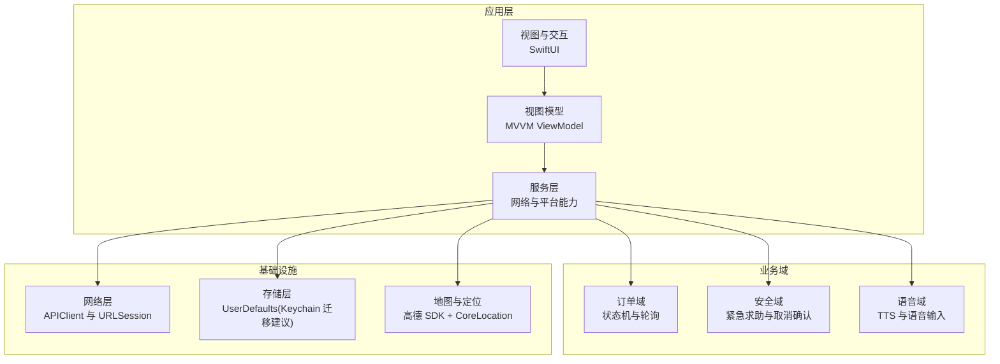
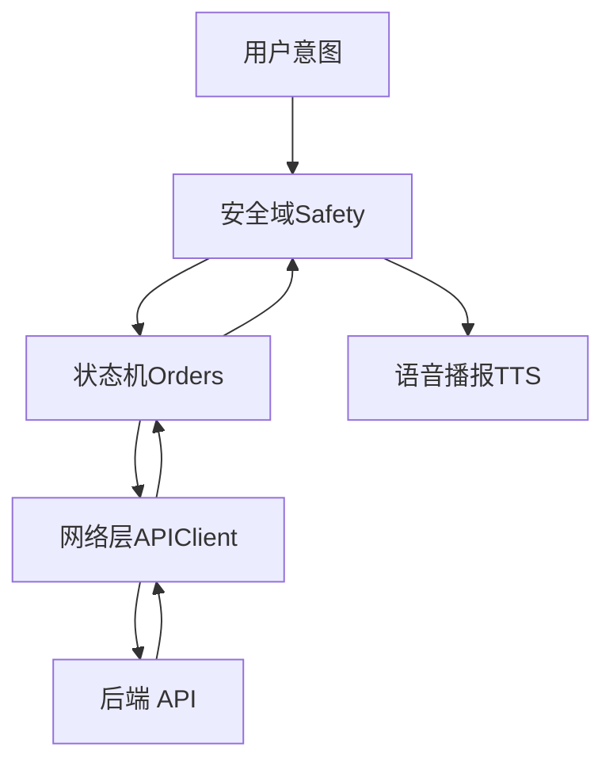
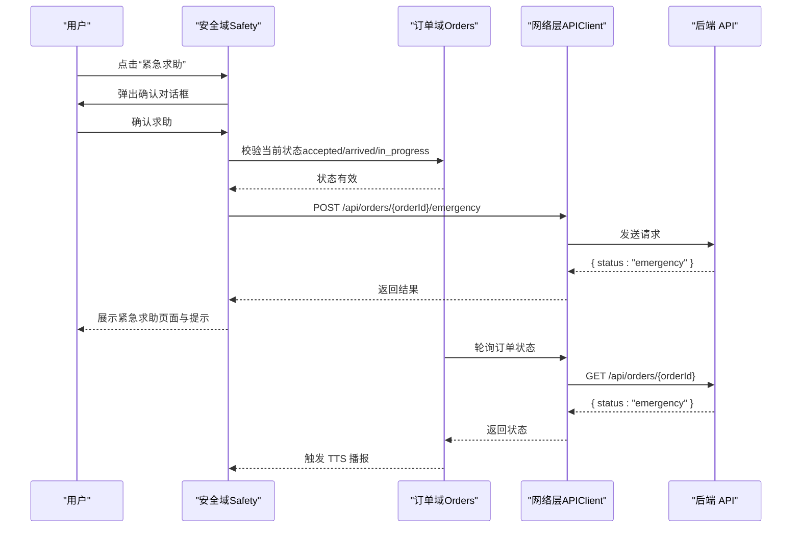
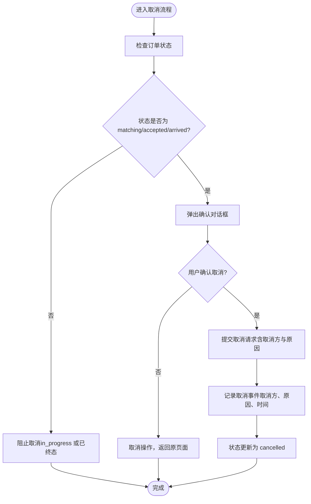
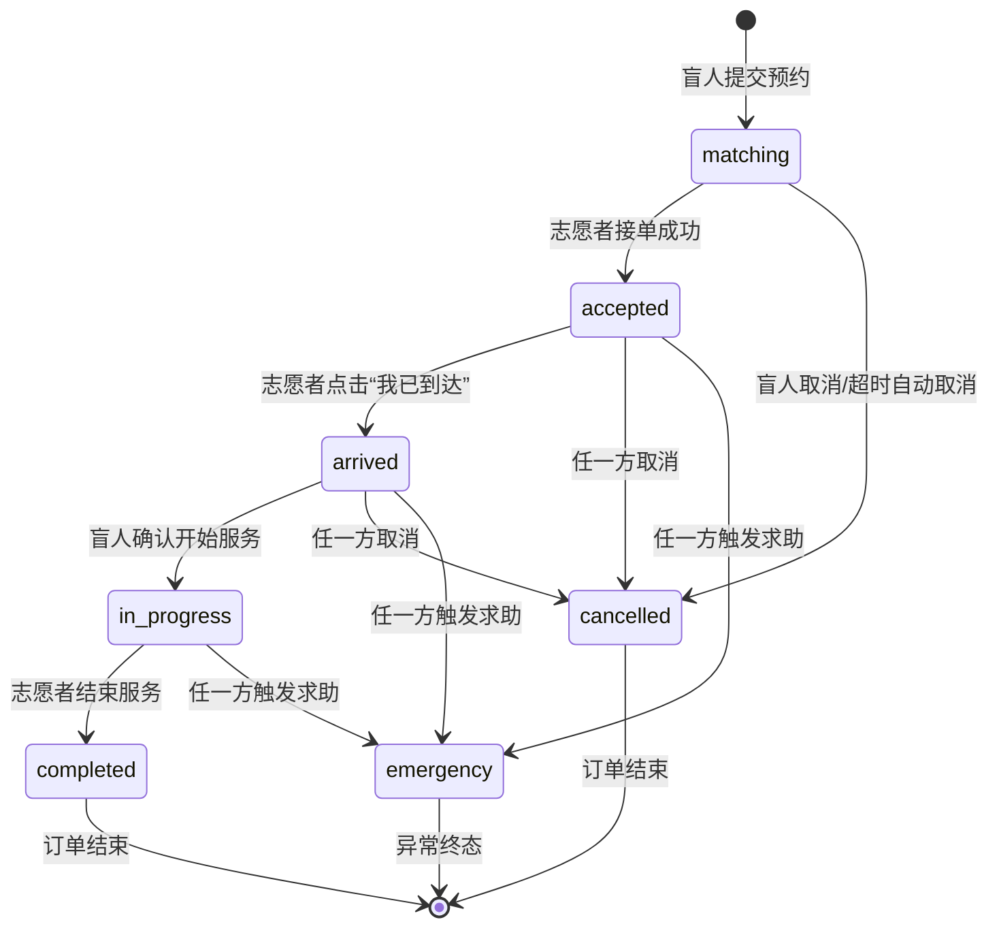
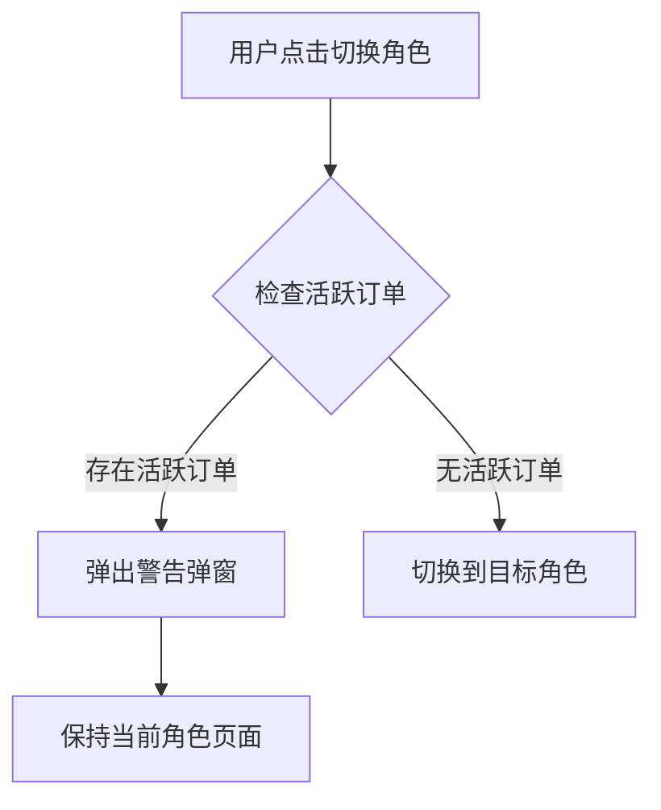
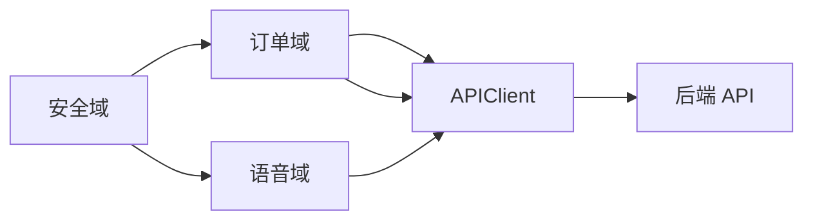

# 安全系统

<cite>
**本文引用的文件**
- [08-ios-architecture.md](file://docs/08-ios-architecture.md)
- [04-user-flows-and-state-machine.md](file://docs/04-user-flows-and-state-machine.md)
- [07-api-contract.openapi.yaml](file://docs/07-api-contract.openapi.yaml)
- [03-user-stories.md](file://docs/03-user-stories.md)
- [02-mvp-scope.md](file://docs/02-mvp-scope.md)
- [proposal.md](file://openspec/changes/add-aidrun-ios-spring-mvp/proposal.md)
- [spec.md](file://openspec/changes/add-aidrun-ios-spring-mvp/specs/safety-basic-emergency/spec.md)
- [order-status-lifecycle/spec.md](file://openspec/changes/add-aidrun-ios-spring-mvp/specs/order-status-lifecycle/spec.md)
- [blindRunApp.swift](file://blindRun/blindRun/blindRunApp.swift)
- [ContentView.swift](file://blindRun/blindRun/ContentView.swift)
</cite>

## 目录
1. [简介](#简介)
2. [项目结构](#项目结构)
3. [核心组件](#核心组件)
4. [架构总览](#架构总览)
5. [详细组件分析](#详细组件分析)
6. [依赖关系分析](#依赖关系分析)
7. [性能考虑](#性能考虑)
8. [故障排查指南](#故障排查指南)
9. [结论](#结论)
10. [附录](#附录)

## 简介
本文件面向安全系统，围绕紧急求助功能、取消订单保护、危险操作防护、监控告警与审计追踪、安全配置与权限控制、数据加密与隐私合规等方面，结合现有需求文档与架构说明，形成一套可落地的安全方案与实施指引。文档既适用于开发人员，也便于产品与测试团队理解与验证。

## 项目结构
- 应用采用 SwiftUI + MVVM 架构，模块化组织包括 Core、Auth、Role、BlindRunner、Volunteer、Orders、Map、Voice、Safety、Profile 等。
- 安全相关能力在 Safety 模块中体现，涵盖紧急求助与取消确认流程。
- 订单状态机与轮询机制由 Orders 与 Voice 模块配合实现，确保状态变更的可见性与可审计性。

**图表来源**
- [08-ios-architecture.md:18-31](file://docs/08-ios-architecture.md#L18-L31)
- [08-ios-architecture.md:68-83](file://docs/08-ios-architecture.md#L68-L83)

**章节来源**
- [08-ios-architecture.md:1-165](file://docs/08-ios-architecture.md#L1-L165)

## 核心组件
- 安全域（Safety）：负责紧急求助与取消确认的交互与校验，确保危险操作具备二次确认与状态约束。
- 订单域（Orders）：维护订单状态机与轮询逻辑，保障状态变更的原子性与一致性。
- 语音域（Voice）：通过 TTS 提示与播报，提升无障碍体验与安全提醒效率。
- 网络与存储：统一的 APIClient 与令牌持久化策略，为安全控制提供基础能力。

**章节来源**
- [08-ios-architecture.md:30-49](file://docs/08-ios-architecture.md#L30-L49)
- [08-ios-architecture.md:68-83](file://docs/08-ios-architecture.md#L68-L83)

## 架构总览
安全系统在应用中的位置与职责如下：
- 紧急求助：仅在特定状态触发，需二次确认，状态进入 emergency 后不可恢复。
- 取消订单：限定在服务开始前，记录取消方与固定原因，服务进行中禁止普通取消。
- 危险操作保护：所有危险操作均需用户确认对话框，且受状态机约束。
- 监控与审计：通过 API 合同与状态机约束记录关键事件，支持后续扩展告警与审计。

**图表来源**
- [04-user-flows-and-state-machine.md:72-118](file://docs/04-user-flows-and-state-machine.md#L72-L118)
- [07-api-contract.openapi.yaml:343-363](file://docs/07-api-contract.openapi.yaml#L343-L363)

## 详细组件分析

### 紧急求助功能
- 触发条件
  - 仅当订单状态为 accepted、arrived 或 in_progress 时允许触发紧急求助。
  - 若订单已处于 emergency，则不允许再次触发。
- 二次确认
  - 触发后弹出确认对话框，明确告知进入异常状态并将记录当前订单状态。
- 状态流转
  - 确认后调用后端接口将状态置为 emergency，并通过轮询与 TTS 向另一方同步状态。
- 数据与通知
  - MVP 阶段记录安全数据，不自动拨打电话或发送短信。

**图表来源**
- [04-user-flows-and-state-machine.md:230-257](file://docs/04-user-flows-and-state-machine.md#L230-L257)
- [07-api-contract.openapi.yaml:343-363](file://docs/07-api-contract.openapi.yaml#L343-L363)
- [spec.md:11-17](file://openspec/changes/add-aidrun-ios-spring-mvp/specs/safety-basic-emergency/spec.md#L11-L17)

**章节来源**
- [spec.md:3-9](file://openspec/changes/add-aidrun-ios-spring-mvp/specs/safety-basic-emergency/spec.md#L3-L9)
- [spec.md:11-17](file://openspec/changes/add-aidrun-ios-spring-mvp/specs/safety-basic-emergency/spec.md#L11-L17)
- [spec.md:19-25](file://openspec/changes/add-aidrun-ios-spring-mvp/specs/safety-basic-emergency/spec.md#L19-L25)
- [spec.md:27-33](file://openspec/changes/add-aidrun-ios-spring-mvp/specs/safety-basic-emergency/spec.md#L27-L33)
- [04-user-flows-and-state-machine.md:230-257](file://docs/04-user-flows-and-state-machine.md#L230-L257)
- [03-user-stories.md:323-348](file://docs/03-user-stories.md#L323-L348)

### 取消订单与双重确认
- 触发条件
  - 仅允许在 matching、accepted、arrived 状态下进行普通取消。
  - 在 in_progress 状态禁止普通取消，必须走紧急求助流程。
- 双重确认
  - 取消前弹出确认对话框，确认后方可提交。
- 数据记录
  - 记录取消方（盲人/志愿者）与固定取消原因（如时间冲突、错误地点、临时问题、无法联系、其他），并支持填写补充说明。
- 超时取消
  - 若距离预约开始时间不足 30 分钟且无人接单，系统自动取消并记录原因 no_volunteer_available。

**图表来源**
- [order-status-lifecycle/spec.md:31-41](file://openspec/changes/add-aidrun-ios-spring-mvp/specs/order-status-lifecycle/spec.md#L31-L41)
- [07-api-contract.openapi.yaml:343-363](file://docs/07-api-contract.openapi.yaml#L343-L363)

**章节来源**
- [order-status-lifecycle/spec.md:3-9](file://openspec/changes/add-aidrun-ios-spring-mvp/specs/order-status-lifecycle/spec.md#L3-L9)
- [order-status-lifecycle/spec.md:31-41](file://openspec/changes/add-aidrun-ios-spring-mvp/specs/order-status-lifecycle/spec.md#L31-L41)
- [03-user-stories.md:352-371](file://docs/03-user-stories.md#L352-L371)

### 订单状态机与轮询
- 状态机
  - 正常生命周期：matching → accepted → arrived → in_progress → completed。
  - emergency 为异常终态，不可恢复。
- 轮询
  - 盲人端在等待、已接单、已到达、服务中页面每 5 秒轮询一次，状态变化时触发 TTS 播报。
- 并发保护
  - 志愿者接单采用乐观锁保护，避免并发竞争导致的重复接单。

**图表来源**
- [04-user-flows-and-state-machine.md:72-118](file://docs/04-user-flows-and-state-machine.md#L72-L118)
- [04-user-flows-and-state-machine.md:275-299](file://docs/04-user-flows-and-state-machine.md#L275-L299)

**章节来源**
- [04-user-flows-and-state-machine.md:72-118](file://docs/04-user-flows-and-state-machine.md#L72-L118)
- [04-user-flows-and-state-machine.md:275-299](file://docs/04-user-flows-and-state-machine.md#L275-L299)

### 危险操作保护策略
- 状态约束：仅在允许的状态才能触发紧急求助或取消。
- 用户确认：所有危险操作均需二次确认对话框。
- 终态保护：emergency 为不可恢复终态，避免误操作导致状态回退。
- 角色切换拦截：若存在活跃订单（accepted/arrived/in_progress/emergency），禁止切换角色。

**图表来源**
- [04-user-flows-and-state-machine.md:259-273](file://docs/04-user-flows-and-state-machine.md#L259-L273)

**章节来源**
- [04-user-flows-and-state-machine.md:259-273](file://docs/04-user-flows-and-state-machine.md#L259-L273)

### 监控告警、日志与审计
- 安全事件记录
  - 紧急求助：记录进入 emergency 的事件与前一状态。
  - 取消事件：记录取消方、取消原因与时间戳。
- 日志与审计
  - 建议在后端对关键安全事件进行日志记录，便于审计与追溯。
- 告警
  - 可基于订单状态异常波动、高频紧急求助等指标建立告警规则（建议在生产环境扩展）。

**章节来源**
- [spec.md:23-25](file://openspec/changes/add-aidrun-ios-spring-mvp/specs/safety-basic-emergency/spec.md#L23-L25)
- [07-api-contract.openapi.yaml:931-963](file://docs/07-api-contract.openapi.yaml#L931-L963)

### 安全配置、权限与访问限制
- 环境与网络
  - 支持 mock、localBackend、production 三种环境，Debug 构建暴露环境选择。
  - APIClient 统一处理 Authorization: Bearer 令牌注入。
- 令牌存储
  - MVP 使用 UserDefaults 存储 JWT，生产环境需迁移到 Keychain。
- 权限与角色
  - 登录合并手机与验证码，角色切换共享同一 JWT，但受活跃订单拦截。
- 非目标
  - 不实现复杂风控、自动呼叫/短信、WebSocket、真实短信与实名认证等非目标功能。

**章节来源**
- [08-ios-architecture.md:50-66](file://docs/08-ios-architecture.md#L50-L66)
- [08-ios-architecture.md:78-82](file://docs/08-ios-architecture.md#L78-L82)
- [08-ios-architecture.md:84-96](file://docs/08-ios-architecture.md#L84-L96)
- [10-ai-coding-tasks.md:173-176](file://docs/10-ai-coding-tasks.md#L173-L176)

### 数据加密、隐私保护与合规
- 传输安全
  - 使用 HTTPS 与 JWT 令牌，避免明文传输敏感信息。
- 存储安全
  - MVP 使用 UserDefaults 存储 JWT，生产环境迁移至 Keychain。
- 隐私保护
  - 订单详情中隐藏盲人电话等敏感字段，遵循最小披露原则。
- 合规要求
  - 紧急联系人信息与安全事件记录需符合数据最小化与目的限制原则，不自动外呼或发送短信。

**章节来源**
- [08-ios-architecture.md:12](file://docs/08-ios-architecture.md#L12)
- [08-ios-architecture.md:80-82](file://docs/08-ios-architecture.md#L80-L82)
- [04-user-flows-and-state-machine.md:180-228](file://docs/04-user-flows-and-state-machine.md#L180-L228)

## 依赖关系分析
- 组件耦合
  - Safety 依赖 Orders 的状态查询与轮询；依赖 Voice 的 TTS 提示。
  - Orders 依赖 APIClient 进行状态更新与查询。
- 外部依赖
  - 高德地图 SDK 用于地图与定位；AVSpeechSynthesizer 用于 TTS。
- 风险点
  - 状态机约束需在前端与后端一致实现，避免绕过校验。
  - 令牌存储从 UserDefaults 迁移到 Keychain 是关键安全加固。

**图表来源**
- [08-ios-architecture.md:30](file://docs/08-ios-architecture.md#L30)
- [08-ios-architecture.md:68-83](file://docs/08-ios-architecture.md#L68-L83)

**章节来源**
- [08-ios-architecture.md:18-31](file://docs/08-ios-architecture.md#L18-L31)
- [08-ios-architecture.md:68-83](file://docs/08-ios-architecture.md#L68-L83)

## 性能考虑
- 轮询频率
  - 订单状态轮询周期为 5 秒，平衡实时性与资源消耗。
- 状态变更提示
  - 仅在状态变化时触发 TTS，减少不必要的语音播报。
- 网络重试
  - APIClient 保持简单重试策略，避免复杂离线队列带来的安全风险。

**章节来源**
- [04-user-flows-and-state-machine.md:275-299](file://docs/04-user-flows-and-state-machine.md#L275-L299)
- [08-ios-architecture.md:76-77](file://docs/08-ios-architecture.md#L76-L77)

## 故障排查指南
- 紧急求助无响应
  - 检查当前订单状态是否为 accepted/arrived/in_progress；确认是否已弹出确认对话框。
  - 核对网络层调用是否成功，关注后端返回的错误码。
- 取消按钮不可见
  - 若订单处于 in_progress，取消按钮应被禁用，需引导用户使用紧急求助。
- 角色切换被拦截
  - 若存在活跃订单，系统会弹窗提示“您有进行中的订单，无法切换角色”，请先完成或取消订单。
- 令牌失效
  - 检查 UserDefaults 中的 JWT 是否存在；生产环境需迁移至 Keychain。

**章节来源**
- [04-user-flows-and-state-machine.md:259-273](file://docs/04-user-flows-and-state-machine.md#L259-L273)
- [08-ios-architecture.md:80-82](file://docs/08-ios-architecture.md#L80-L82)

## 结论
本安全系统以状态机为核心，结合二次确认与终态保护，确保紧急求助与取消等危险操作在可控范围内执行。通过明确的触发条件、严格的权限与角色限制、以及可审计的日志记录，系统在 MVP 阶段即具备良好的安全基线。建议在生产环境进一步完善令牌存储、告警与审计能力，并持续优化用户体验与安全性。

## 附录
- 模块能力概览（OpenSpec）
  - 新增 capabilities 包括安全基础紧急求助、订单生命周期、无障碍与语音等。
- 非目标清单
  - 明确不实现的功能范围，避免安全边界模糊。

**章节来源**
- [proposal.md:14-25](file://openspec/changes/add-aidrun-ios-spring-mvp/proposal.md#L14-L25)
- [10-ai-coding-tasks.md:173-176](file://docs/10-ai-coding-tasks.md#L173-L176)