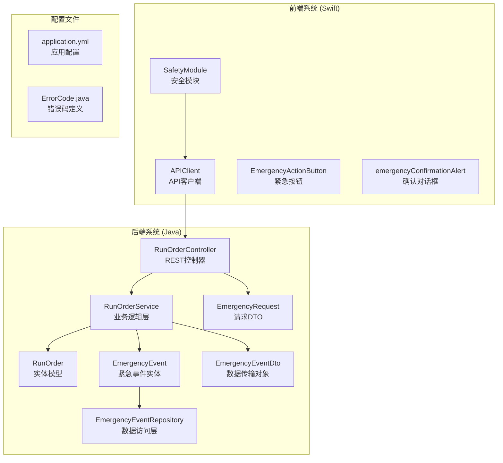
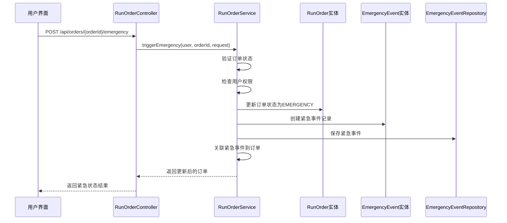
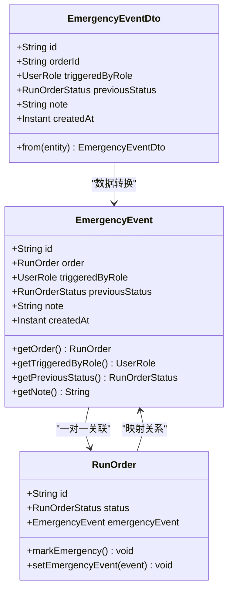
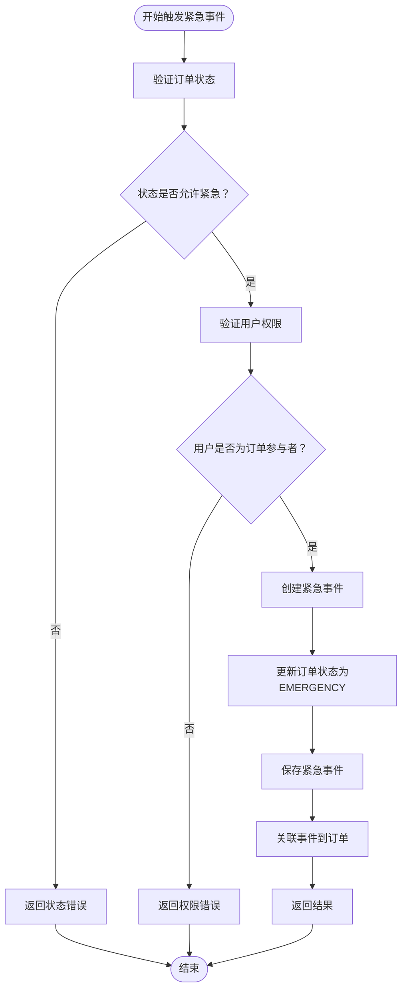
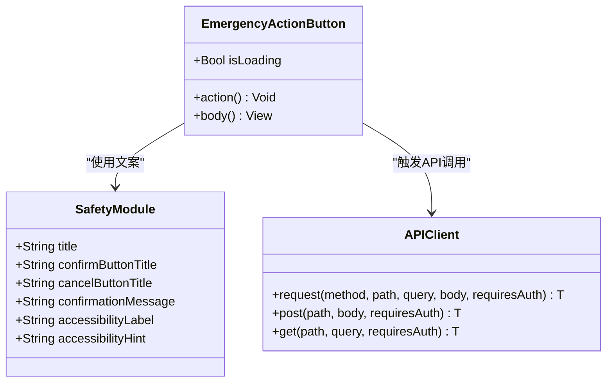
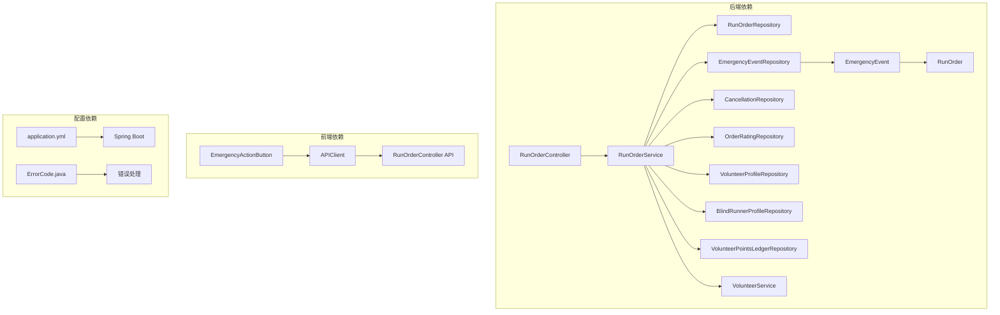
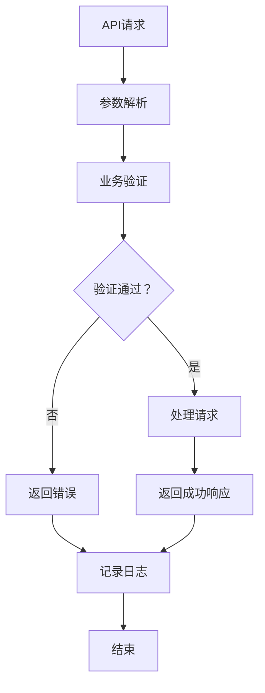

# 紧急事件系统

<cite>
**本文档引用的文件**
- [EmergencyEvent.java](file://backend/src/main/java/com/aidrun/backend/order/EmergencyEvent.java)
- [EmergencyEventRepository.java](file://backend/src/main/java/com/aidrun/backend/order/EmergencyEventRepository.java)
- [EmergencyEventDto.java](file://backend/src/main/java/com/aidrun/backend/order/dto/EmergencyEventDto.java)
- [EmergencyRequest.java](file://backend/src/main/java/com/aidrun/backend/order/dto/EmergencyRequest.java)
- [RunOrderService.java](file://backend/src/main/java/com/aidrun/backend/order/RunOrderService.java)
- [RunOrder.java](file://backend/src/main/java/com/aidrun/backend/order/RunOrder.java)
- [RunOrderStatus.java](file://backend/src/main/java/com/aidrun/backend/order/RunOrderStatus.java)
- [RunOrderController.java](file://backend/src/main/java/com/aidrun/backend/order/RunOrderController.java)
- [application.yml](file://backend/src/main/resources/application.yml)
- [SafetyModule.swift](file://blindRun/blindRun/Safety/SafetyModule.swift)
- [APIClient.swift](file://blindRun/blindRun/Core/APIClient.swift)
- [RunOrderControllerIntegrationTest.java](file://backend/src/test/java/com/aidrun/backend/order/RunOrderControllerIntegrationTest.java)
- [ErrorCode.java](file://backend/src/main/java/com/aidrun/backend/common/error/ErrorCode.java)
</cite>

## 目录
1. [简介](#简介)
2. [项目结构](#项目结构)
3. [核心组件](#核心组件)
4. [架构概览](#架构概览)
5. [详细组件分析](#详细组件分析)
6. [依赖关系分析](#依赖关系分析)
7. [性能考虑](#性能考虑)
8. [故障排除指南](#故障排除指南)
9. [结论](#结论)

## 简介

紧急事件系统是盲人跑步服务应用中的关键安全功能模块，旨在为用户提供紧急情况下的快速求助机制。该系统允许盲人跑者和志愿者在服务过程中的任何阶段触发紧急状态，系统会记录紧急事件并将其标记为异常状态。

系统采用前后端分离架构，后端基于Spring Boot构建RESTful API，前端使用SwiftUI开发iOS应用。紧急事件功能遵循MVP（最小可行产品）原则，在保证核心功能的前提下简化了复杂的实时通知机制。

## 项目结构

紧急事件系统主要分布在以下两个部分：

**图表来源**
- [RunOrderController.java:1-140](file://backend/src/main/java/com/aidrun/backend/order/RunOrderController.java#L1-140)
- [RunOrderService.java:1-403](file://backend/src/main/java/com/aidrun/backend/order/RunOrderService.java#L1-403)
- [SafetyModule.swift:1-43](file://blindRun/blindRun/Safety/SafetyModule.swift#L1-43)
- [APIClient.swift:1-194](file://blindRun/blindRun/Core/APIClient.swift#L1-194)

**章节来源**
- [RunOrderController.java:1-140](file://backend/src/main/java/com/aidrun/backend/order/RunOrderController.java#L1-140)
- [RunOrderService.java:1-403](file://backend/src/main/java/com/aidrun/backend/order/RunOrderService.java#L1-403)
- [SafetyModule.swift:1-43](file://blindRun/blindRun/Safety/SafetyModule.swift#L1-43)

## 核心组件

### 后端核心组件

#### 紧急事件实体模型
紧急事件系统的核心是`EmergencyEvent`实体，它与运行订单建立一对一关联，记录每次紧急事件的关键信息。

#### 状态管理
系统定义了完整的订单状态生命周期，其中`EMERGENCY`状态作为特殊终止状态存在。

#### 业务逻辑处理
`RunOrderService`负责处理紧急事件的所有业务逻辑，包括状态验证、权限检查和事件记录。

### 前端核心组件

#### 用户界面组件
iOS端提供了专门的紧急求助界面组件，包含确认对话框和无障碍支持。

#### API通信层
统一的API客户端处理所有HTTP请求，包括紧急事件的触发和状态同步。

**章节来源**
- [EmergencyEvent.java:1-58](file://backend/src/main/java/com/aidrun/backend/order/EmergencyEvent.java#L1-58)
- [RunOrderStatus.java:1-36](file://backend/src/main/java/com/aidrun/backend/order/RunOrderStatus.java#L1-36)
- [SafetyModule.swift:1-43](file://blindRun/blindRun/Safety/SafetyModule.swift#L1-43)

## 架构概览

紧急事件系统采用分层架构设计，确保职责分离和代码可维护性：

**图表来源**
- [RunOrderController.java:118-127](file://backend/src/main/java/com/aidrun/backend/order/RunOrderController.java#L118-127)
- [RunOrderService.java:282-306](file://backend/src/main/java/com/aidrun/backend/order/RunOrderService.java#L282-306)

系统架构特点：
- **RESTful API设计**：提供标准的HTTP接口供前端调用
- **状态机模式**：严格的订单状态转换规则
- **事件驱动**：紧急事件独立存储，便于审计和分析
- **权限控制**：基于角色的访问控制机制

## 详细组件分析

### 紧急事件实体分析

**图表来源**
- [EmergencyEvent.java:14-57](file://backend/src/main/java/com/aidrun/backend/order/EmergencyEvent.java#L14-57)
- [RunOrder.java:62-72](file://backend/src/main/java/com/aidrun/backend/order/RunOrder.java#L62-72)
- [EmergencyEventDto.java:8-27](file://backend/src/main/java/com/aidrun/backend/order/dto/EmergencyEventDto.java#L8-27)

#### 数据模型复杂度分析
- **时间复杂度**：紧急事件创建为O(1)，查询为O(1)
- **空间复杂度**：每个紧急事件占用固定内存空间
- **索引策略**：通过订单ID建立唯一索引确保数据完整性

### 紧急事件触发流程

**图表来源**
- [RunOrderService.java:282-306](file://backend/src/main/java/com/aidrun/backend/order/RunOrderService.java#L282-306)

### 前端紧急求助组件

**图表来源**
- [SafetyModule.swift:14-42](file://blindRun/blindRun/Safety/SafetyModule.swift#L14-42)
- [APIClient.swift:46-99](file://blindRun/blindRun/Core/APIClient.swift#L46-99)

**章节来源**
- [EmergencyEvent.java:1-58](file://backend/src/main/java/com/aidrun/backend/order/EmergencyEvent.java#L1-58)
- [RunOrderService.java:282-306](file://backend/src/main/java/com/aidrun/backend/order/RunOrderService.java#L282-306)
- [SafetyModule.swift:1-43](file://blindRun/blindRun/Safety/SafetyModule.swift#L1-43)

## 依赖关系分析

紧急事件系统的核心依赖关系如下：

**图表来源**
- [RunOrderService.java:41-71](file://backend/src/main/java/com/aidrun/backend/order/RunOrderService.java#L41-71)
- [EmergencyEvent.java:18-20](file://backend/src/main/java/com/aidrun/backend/order/EmergencyEvent.java#L18-20)

### 外部依赖分析

系统对外部依赖主要包括：
- **Spring Boot框架**：提供Web服务和依赖注入
- **JPA/Hibernate**：提供ORM功能和数据库访问
- **H2数据库**：开发环境内存数据库
- **SwiftUI**：iOS用户界面框架
- **Foundation**：iOS基础框架

**章节来源**
- [application.yml:1-34](file://backend/src/main/resources/application.yml#L1-34)
- [RunOrderService.java:1-27](file://backend/src/main/java/com/aidrun/backend/order/RunOrderService.java#L1-27)

## 性能考虑

### 数据库性能优化

紧急事件系统的数据库设计考虑了以下性能因素：

1. **索引策略**
   - 订单ID唯一索引确保紧急事件与订单的一对一关系
   - 创建时间戳索引支持紧急事件查询和排序

2. **查询优化**
   - 紧急事件查询仅涉及必要的字段
   - 使用懒加载避免不必要的关联数据加载

3. **事务管理**
   - 紧急事件创建使用原子性事务确保数据一致性
   - 最小化事务持续时间减少锁竞争

### 缓存策略

系统采用以下缓存策略：
- **订单状态缓存**：热门订单状态的短期缓存
- **紧急事件统计**：按时间段的紧急事件统计缓存
- **配置参数缓存**：系统配置的静态缓存

### 并发处理

紧急事件系统通过以下方式处理并发：
- **乐观锁**：订单状态更新使用版本号控制
- **线程安全**：所有服务方法都是线程安全的
- **异步处理**：非关键操作采用异步执行

## 故障排除指南

### 常见错误类型

系统定义了多种错误类型用于紧急事件处理：

| 错误代码 | 描述 | 触发场景 |
|---------|------|----------|
| INVALID_ORDER_STATUS | 订单状态无效 | 尝试在不允许的状态触发紧急事件 |
| UNAUTHORIZED | 未授权访问 | 非订单参与者尝试触发紧急事件 |
| ORDER_NOT_FOUND | 订单不存在 | 访问不存在的订单ID |

### 错误处理流程

**图表来源**
- [ErrorCode.java:6-18](file://backend/src/main/java/com/aidrun/backend/common/error/ErrorCode.java#L6-18)

### 调试建议

1. **后端调试**
   - 启用详细日志记录
   - 使用H2控制台查看数据库状态
   - 检查事务提交和回滚

2. **前端调试**
   - 检查网络请求和响应
   - 验证用户权限和认证状态
   - 测试无障碍功能

**章节来源**
- [ErrorCode.java:1-41](file://backend/src/main/java/com/aidrun/backend/common/error/ErrorCode.java#L1-41)
- [RunOrderControllerIntegrationTest.java:371-437](file://backend/src/test/java/com/aidrun/backend/order/RunOrderControllerIntegrationTest.java#L371-437)

## 结论

紧急事件系统是一个设计精良的安全功能模块，具有以下特点：

### 技术优势
- **清晰的架构设计**：分层架构确保了代码的可维护性和可扩展性
- **严格的状态管理**：完整的状态机确保了业务逻辑的正确性
- **完善的错误处理**：全面的错误码和异常处理机制
- **前后端协作**：iOS和后端的紧密集成提供了良好的用户体验

### 功能特性
- **MVP设计理念**：专注于核心功能，避免过度设计
- **安全性优先**：严格的权限控制和状态验证
- **可审计性**：完整的紧急事件记录便于追踪和分析
- **无障碍支持**：完整的iOS无障碍功能支持

### 改进建议
1. **实时通知**：未来可以添加WebSocket支持实现实时状态更新
2. **地理位置**：集成更精确的位置服务以提供更好的救援定位
3. **多语言支持**：扩展国际化支持以服务更多用户群体
4. **监控告警**：添加系统监控和告警机制提高运维效率

该系统为盲人跑步服务提供了可靠的安全保障，是整个应用的重要组成部分。