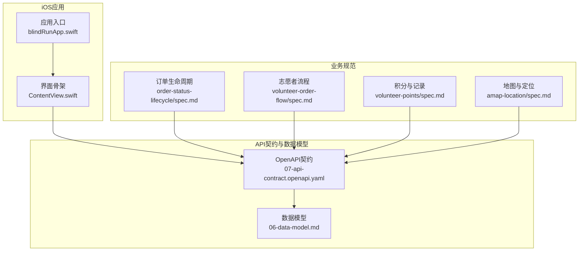
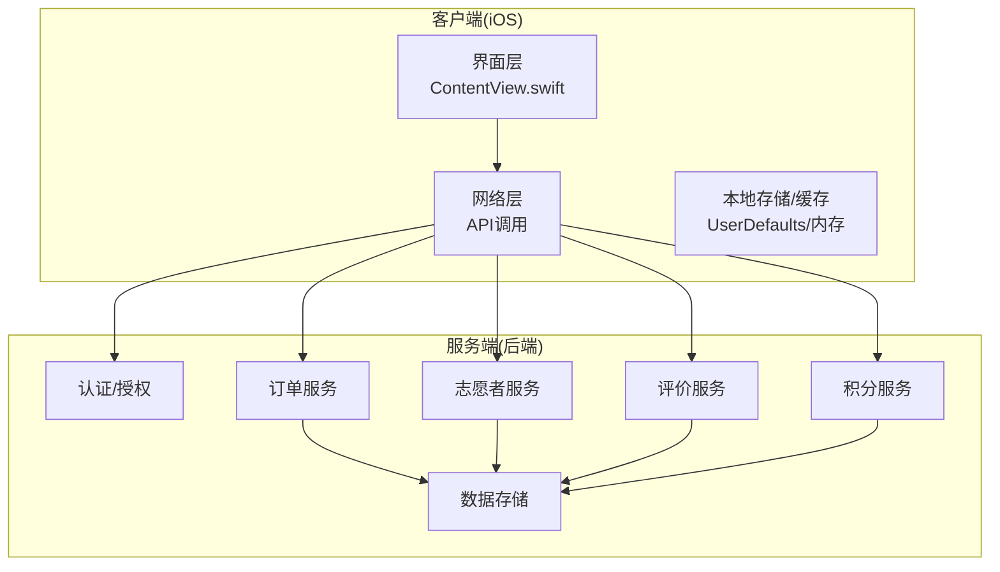
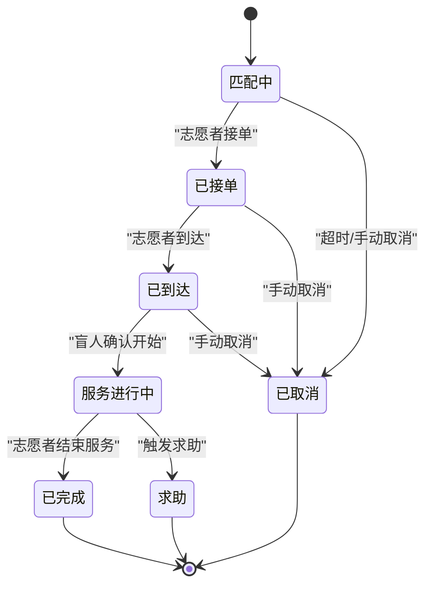
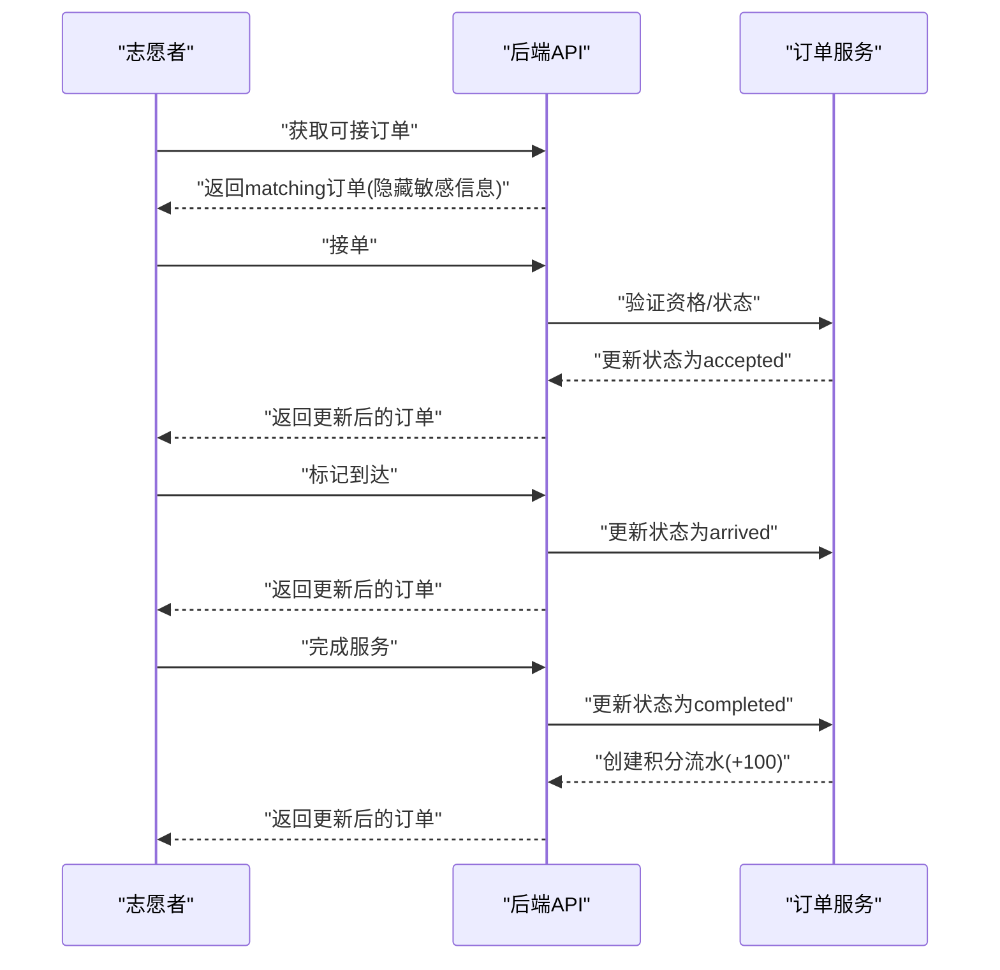
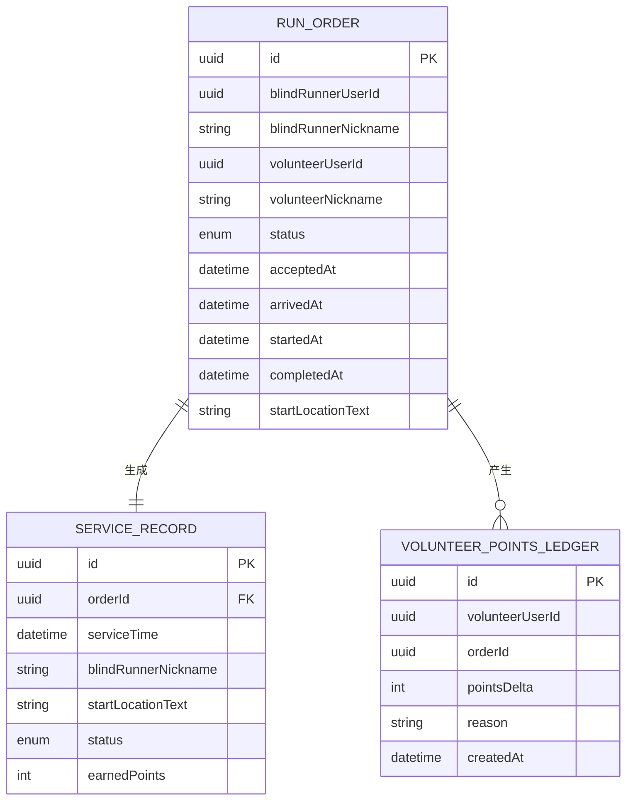
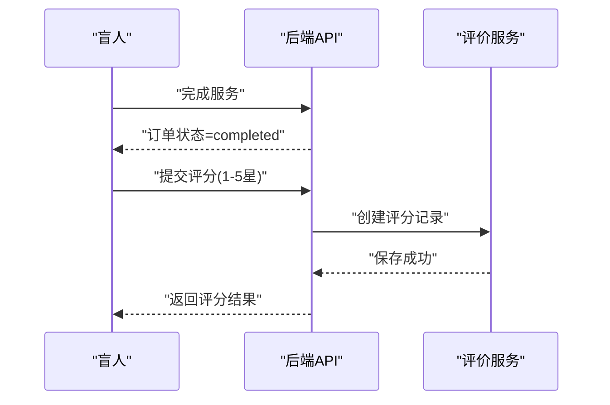
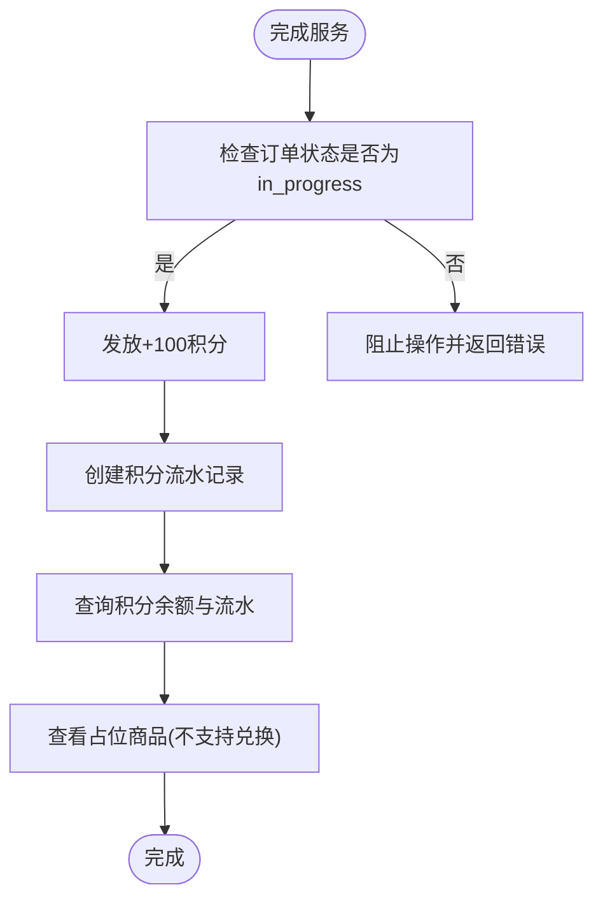
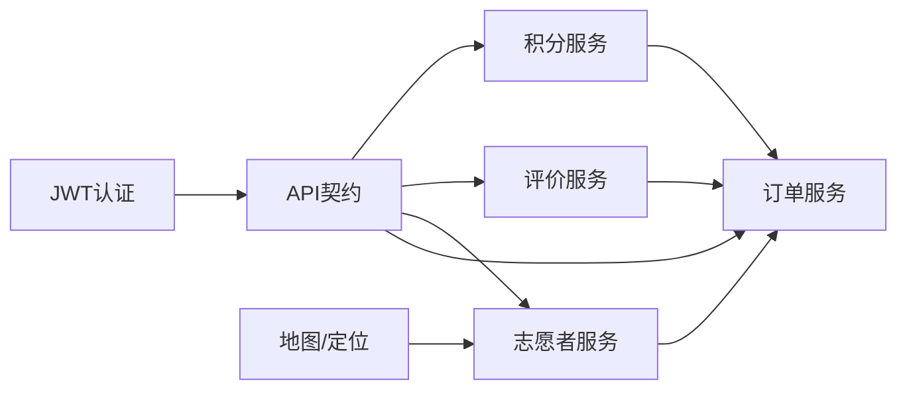

# 工作记录与统计

<cite>
**本文引用的文件**
- [blindRunApp.swift](file://blindRun/blindRunApp.swift)
- [ContentView.swift](file://blindRun/ContentView.swift)
- [07-api-contract.openapi.yaml](file://docs/07-api-contract.openapi.yaml)
- [06-data-model.md](file://docs/06-data-model.md)
- [order-status-lifecycle/spec.md](file://openspec/changes/add-aidrun-ios-spring-mvp/specs/order-status-lifecycle/spec.md)
- [volunteer-order-flow/spec.md](file://openspec/changes/add-aidrun-ios-spring-mvp/specs/volunteer-order-flow/spec.md)
- [volunteer-points/spec.md](file://openspec/changes/add-aidrun-ios-spring-mvp/specs/volunteer-points/spec.md)
- [amap-location/spec.md](file://openspec/changes/add-aidrun-ios-spring-mvp/specs/amap-location/spec.md)
</cite>

## 目录
1. [简介](#简介)
2. [项目结构](#项目结构)
3. [核心组件](#核心组件)
4. [架构总览](#架构总览)
5. [详细组件分析](#详细组件分析)
6. [依赖关系分析](#依赖关系分析)
7. [性能考虑](#性能考虑)
8. [故障排查指南](#故障排查指南)
9. [结论](#结论)
10. [附录](#附录)

## 简介
本文件围绕志愿者工作记录与统计功能，系统梳理已完成订单的统计分析、服务时长与距离统计、工作记录的数据结构与存储方式、历史记录查询与导出能力、服务评价与反馈收集机制、绩效评估指标（接单成功率、服务完成率、服务质量评分）、积分累积与奖励机制（volunteerPoints）及工作统计报表的生成与展示。内容基于iOS端与后端API契约、数据模型与规范文档，确保技术实现与业务目标一致。

## 项目结构
- iOS应用入口位于 [blindRunApp.swift](file://blindRun/blindRunApp.swift) 与 [ContentView.swift](file://blindRun/ContentView.swift)，当前为最小可用骨架，实际业务逻辑通过网络请求与API契约对接后端。
- 业务契约与数据模型集中在 [07-api-contract.openapi.yaml](file://docs/07-api-contract.openapi.yaml) 与 [06-data-model.md](file://docs/06-data-model.md)。
- 与工作记录直接相关的规范包括：
  - 订单状态生命周期：[order-status-lifecycle/spec.md](file://openspec/changes/add-aidrun-ios-spring-mvp/specs/order-status-lifecycle/spec.md)
  - 志愿者接单与服务流程：[volunteer-order-flow/spec.md](file://openspec/changes/add-aidrun-ios-spring-mvp/specs/volunteer-order-flow/spec.md)
  - 志愿者积分与服务记录：[volunteer-points/spec.md](file://openspec/changes/add-aidrun-ios-spring-mvp/specs/volunteer-points/spec.md)
  - 地图与位置服务：[amap-location/spec.md](file://openspec/changes/add-aidrun-ios-spring-mvp/specs/amap-location/spec.md)

**图表来源**
- [blindRunApp.swift:10-17](file://blindRun/blindRunApp.swift#L10-L17)
- [ContentView.swift:10-20](file://blindRun/ContentView.swift#L10-L20)
- [07-api-contract.openapi.yaml:1-1117](file://docs/07-api-contract.openapi.yaml#L1-L1117)
- [06-data-model.md:1-307](file://docs/06-data-model.md#L1-L307)
- [order-status-lifecycle/spec.md:1-66](file://openspec/changes/add-aidrun-ios-spring-mvp/specs/order-status-lifecycle/spec.md#L1-L66)
- [volunteer-order-flow/spec.md:1-38](file://openspec/changes/add-aidrun-ios-spring-mvp/specs/volunteer-order-flow/spec.md#L1-L38)
- [volunteer-points/spec.md:1-26](file://openspec/changes/add-aidrun-ios-spring-mvp/specs/volunteer-points/spec.md#L1-L26)
- [amap-location/spec.md:1-38](file://openspec/changes/add-aidrun-ios-spring-mvp/specs/amap-location/spec.md#L1-L38)

**章节来源**
- [blindRunApp.swift:10-17](file://blindRun/blindRunApp.swift#L10-L17)
- [ContentView.swift:10-20](file://blindRun/ContentView.swift#L10-L20)
- [07-api-contract.openapi.yaml:1-1117](file://docs/07-api-contract.openapi.yaml#L1-L1117)
- [06-data-model.md:1-307](file://docs/06-data-model.md#L1-L307)
- [order-status-lifecycle/spec.md:1-66](file://openspec/changes/add-aidrun-ios-spring-mvp/specs/order-status-lifecycle/spec.md#L1-L66)
- [volunteer-order-flow/spec.md:1-38](file://openspec/changes/add-aidrun-ios-spring-mvp/specs/volunteer-order-flow/spec.md#L1-L38)
- [volunteer-points/spec.md:1-26](file://openspec/changes/add-aidrun-ios-spring-mvp/specs/volunteer-points/spec.md#L1-L26)
- [amap-location/spec.md:1-38](file://openspec/changes/add-aidrun-ios-spring-mvp/specs/amap-location/spec.md#L1-L38)

## 核心组件
- 订单生命周期与状态机：定义从匹配到完成的标准流转，约束状态变更合法性与并发接单处理。
- 志愿者工作流：志愿者资格与可用性检查、接单、到达、确认开始、完成服务等步骤。
- 服务记录与统计：服务时长、起点、状态、积分等记录项，支持历史查询。
- 服务评价与反馈：完成后的可选评分与评论。
- 积分体系：完成服务获得固定积分，积分余额与流水查询，积分商城占位展示。
- 地图与距离：前端根据当前位置与订单起点计算距离并排序，支持模拟坐标。

**章节来源**
- [order-status-lifecycle/spec.md:3-66](file://openspec/changes/add-aidrun-ios-spring-mvp/specs/order-status-lifecycle/spec.md#L3-L66)
- [volunteer-order-flow/spec.md:3-38](file://openspec/changes/add-aidrun-ios-spring-mvp/specs/volunteer-order-flow/spec.md#L3-L38)
- [volunteer-points/spec.md:3-26](file://openspec/changes/add-aidrun-ios-spring-mvp/specs/volunteer-points/spec.md#L3-L26)
- [amap-location/spec.md:3-38](file://openspec/changes/add-aidrun-ios-spring-mvp/specs/amap-location/spec.md#L3-L38)
- [07-api-contract.openapi.yaml:412-452](file://docs/07-api-contract.openapi.yaml#L412-L452)
- [06-data-model.md:236-281](file://docs/06-data-model.md#L236-L281)

## 架构总览
下图展示志愿者工作记录与统计在系统中的交互关系：iOS应用通过API契约访问后端，后端维护订单状态、服务记录、积分流水与评分数据，iOS负责展示与交互。

**图表来源**
- [07-api-contract.openapi.yaml:25-452](file://docs/07-api-contract.openapi.yaml#L25-L452)
- [06-data-model.md:167-281](file://docs/06-data-model.md#L167-L281)

## 详细组件分析

### 订单生命周期与状态机
- 正常流转：matching → accepted → arrived → in_progress → completed
- 并发接单：仅当状态为matching时可接单，其他状态拒绝
- 状态变更约束：非in_progress状态下禁止完成服务
- 取消规则：仅matching/accepted/arrived可普通取消；超时无志愿者自动取消
- 轮询策略：盲人端在等待与进行中页面每5秒轮询订单详情

**图表来源**
- [order-status-lifecycle/spec.md:3-66](file://openspec/changes/add-aidrun-ios-spring-mvp/specs/order-status-lifecycle/spec.md#L3-L66)
- [07-api-contract.openapi.yaml:256-387](file://docs/07-api-contract.openapi.yaml#L256-L387)

**章节来源**
- [order-status-lifecycle/spec.md:3-66](file://openspec/changes/add-aidrun-ios-spring-mvp/specs/order-status-lifecycle/spec.md#L3-L66)
- [07-api-contract.openapi.yaml:256-387](file://docs/07-api-contract.openapi.yaml#L256-L387)

### 志愿者工作流程与资格
- 资格要求：昵称、手机号、Mock认证通过、管理员审核通过、isAvailable=true
- 可见信息：接单前仅可见非敏感订单信息（昵称、起点、预约时间、路线说明等），联系方式在接单后可见
- 流程步骤：接单→到达→确认开始→完成服务

**图表来源**
- [volunteer-order-flow/spec.md:3-38](file://openspec/changes/add-aidrun-ios-spring-mvp/specs/volunteer-order-flow/spec.md#L3-L38)
- [07-api-contract.openapi.yaml:256-341](file://docs/07-api-contract.openapi.yaml#L256-L341)

**章节来源**
- [volunteer-order-flow/spec.md:3-38](file://openspec/changes/add-aidrun-ios-spring-mvp/specs/volunteer-order-flow/spec.md#L3-L38)
- [07-api-contract.openapi.yaml:256-341](file://docs/07-api-contract.openapi.yaml#L256-L341)

### 服务记录与统计
- 服务记录字段：订单ID、服务时间、盲人昵称、起点文本、状态、获得积分
- 查询接口：获取志愿者服务记录列表
- 统计维度：
  - 服务时长：由订单时间戳字段推导（开始/完成时间差）
  - 距离统计：前端基于起点坐标与当前位置计算，支持排序
  - 历史记录：通过查询接口获取已完成订单集合

**图表来源**
- [06-data-model.md:167-281](file://docs/06-data-model.md#L167-L281)
- [07-api-contract.openapi.yaml:1050-1087](file://docs/07-api-contract.openapi.yaml#L1050-L1087)

**章节来源**
- [07-api-contract.openapi.yaml:412-424](file://docs/07-api-contract.openapi.yaml#L412-L424)
- [07-api-contract.openapi.yaml:1050-1067](file://docs/07-api-contract.openapi.yaml#L1050-L1067)
- [06-data-model.md:236-281](file://docs/06-data-model.md#L236-L281)

### 服务评价与反馈
- 评分规则：完成订单后盲人可提交1-5星评分与可选评论
- 评分接口：提交评分，状态变更不受评分影响
- 交互策略：UI可展示评分控件，但MVP不强制提交

**图表来源**
- [order-status-lifecycle/spec.md:59-66](file://openspec/changes/add-aidrun-ios-spring-mvp/specs/order-status-lifecycle/spec.md#L59-L66)
- [07-api-contract.openapi.yaml:389-410](file://docs/07-api-contract.openapi.yaml#L389-L410)
- [06-data-model.md:250-264](file://docs/06-data-model.md#L250-L264)

**章节来源**
- [order-status-lifecycle/spec.md:59-66](file://openspec/changes/add-aidrun-ios-spring-mvp/specs/order-status-lifecycle/spec.md#L59-L66)
- [07-api-contract.openapi.yaml:389-410](file://docs/07-api-contract.openapi.yaml#L389-L410)
- [06-data-model.md:250-264](file://docs/06-data-model.md#L250-L264)

### 绩效评估指标
- 接单成功率：已接单/总匹配数
- 服务完成率：已完成/已接单
- 服务质量评分：平均星级与评论数量
- 服务时长分布：按时间段统计完成订单的服务时长
- 距离效率：按起点到终点距离与服务时长的比值评估

上述指标可通过查询已完成订单集合与评分数据进行聚合统计。

**章节来源**
- [07-api-contract.openapi.yaml:412-424](file://docs/07-api-contract.openapi.yaml#L412-L424)
- [06-data-model.md:250-281](file://docs/06-data-model.md#L250-L281)

### 积分累积与奖励机制
- 积分发放：完成服务后获得+100积分
- 积分余额与流水：查询接口返回当前积分余额与积分流水
- 积分商城：MVP阶段仅占位展示，不涉及兑换、库存、支付与履约
- 数据结构：积分流水包含订单关联、积分变动、原因与创建时间

**图表来源**
- [volunteer-points/spec.md:3-26](file://openspec/changes/add-aidrun-ios-spring-mvp/specs/volunteer-points/spec.md#L3-L26)
- [07-api-contract.openapi.yaml:321-341](file://docs/07-api-contract.openapi.yaml#L321-L341)
- [07-api-contract.openapi.yaml:426-451](file://docs/07-api-contract.openapi.yaml#L426-L451)
- [06-data-model.md:266-281](file://docs/06-data-model.md#L266-L281)

**章节来源**
- [volunteer-points/spec.md:3-26](file://openspec/changes/add-aidrun-ios-spring-mvp/specs/volunteer-points/spec.md#L3-L26)
- [07-api-contract.openapi.yaml:321-341](file://docs/07-api-contract.openapi.yaml#L321-L341)
- [07-api-contract.openapi.yaml:426-451](file://docs/07-api-contract.openapi.yaml#L426-L451)
- [06-data-model.md:266-281](file://docs/06-data-model.md#L266-L281)

### 工作统计报表
- 报表内容：服务次数、完成率、平均服务时长、平均评分、总积分、距离统计
- 数据来源：已完成订单集合、评分集合、积分流水
- 展示形式：按月/季度/年度聚合，支持筛选与导出（具体导出格式以实现为准）

**章节来源**
- [07-api-contract.openapi.yaml:412-424](file://docs/07-api-contract.openapi.yaml#L412-L424)
- [06-data-model.md:236-281](file://docs/06-data-model.md#L236-L281)

## 依赖关系分析
- 组件耦合：
  - 订单服务与志愿者服务强耦合于状态机与资格校验
  - 评价服务与积分服务独立于订单主流程，仅在完成后触发
- 外部依赖：
  - 高德地图与定位权限用于展示真实地图与计算距离
  - JWT鉴权贯穿所有受保护接口

**图表来源**
- [07-api-contract.openapi.yaml:25-452](file://docs/07-api-contract.openapi.yaml#L25-L452)
- [amap-location/spec.md:3-38](file://openspec/changes/add-aidrun-ios-spring-mvp/specs/amap-location/spec.md#L3-L38)

**章节来源**
- [07-api-contract.openapi.yaml:25-452](file://docs/07-api-contract.openapi.yaml#L25-L452)
- [amap-location/spec.md:3-38](file://openspec/changes/add-aidrun-ios-spring-mvp/specs/amap-location/spec.md#L3-L38)

## 性能考虑
- 轮询频率：盲人端在等待与进行中页面每5秒轮询订单详情，避免频繁请求导致抖动
- 距离计算：前端本地计算距离并排序，减少后端压力
- 缓存策略：对已完成订单列表与积分余额进行短期缓存，降低重复请求
- 导出性能：报表导出建议异步执行并分批处理，避免阻塞UI

## 故障排查指南
- 订单状态异常：
  - 现象：尝试在非in_progress状态下完成服务被拒
  - 排查：确认当前订单状态与API响应
  - 参考： [order-status-lifecycle/spec.md:19-26](file://openspec/changes/add-aidrun-ios-spring-mvp/specs/order-status-lifecycle/spec.md#L19-L26)
- 接单失败：
  - 现象：提示未通过认证或不可用
  - 排查：检查Mock认证状态、管理员审核状态与可服务开关
  - 参考： [volunteer-order-flow/spec.md:3-14](file://openspec/changes/add-aidrun-ios-spring-mvp/specs/volunteer-order-flow/spec.md#L3-L14)
- 评分提交失败：
  - 现象：完成订单后无法提交评分
  - 排查：确认订单状态为completed且评分参数合法
  - 参考： [order-status-lifecycle/spec.md:59-66](file://openspec/changes/add-aidrun-ios-spring-mvp/specs/order-status-lifecycle/spec.md#L59-L66)
- 积分未到账：
  - 现象：完成服务后积分未增加
  - 排查：确认订单状态为completed且积分流水创建成功
  - 参考： [volunteer-points/spec.md:3-10](file://openspec/changes/add-aidrun-ios-spring-mvp/specs/volunteer-points/spec.md#L3-L10)

**章节来源**
- [order-status-lifecycle/spec.md:19-26](file://openspec/changes/add-aidrun-ios-spring-mvp/specs/order-status-lifecycle/spec.md#L19-L26)
- [volunteer-order-flow/spec.md:3-14](file://openspec/changes/add-aidrun-ios-spring-mvp/specs/volunteer-order-flow/spec.md#L3-L14)
- [order-status-lifecycle/spec.md:59-66](file://openspec/changes/add-aidrun-ios-spring-mvp/specs/order-status-lifecycle/spec.md#L59-L66)
- [volunteer-points/spec.md:3-10](file://openspec/changes/add-aidrun-ios-spring-mvp/specs/volunteer-points/spec.md#L3-L10)

## 结论
本系统通过明确的订单状态机、严格的志愿者资格与流程控制、完善的积分与服务记录机制，以及可选的服务评价体系，构建了完整的志愿者工作记录与统计框架。结合前端的距离计算与报表聚合能力，能够有效支撑绩效评估与运营分析需求。后续可在现有基础上扩展导出功能与更丰富的统计维度。

## 附录
- 关键接口与数据结构参考：
  - 服务记录查询： [07-api-contract.openapi.yaml:412-424](file://docs/07-api-contract.openapi.yaml#L412-L424)
  - 积分余额与流水： [07-api-contract.openapi.yaml:426-436](file://docs/07-api-contract.openapi.yaml#L426-L436)
  - 积分商城占位商品： [07-api-contract.openapi.yaml:438-451](file://docs/07-api-contract.openapi.yaml#L438-L451)
  - 评分提交： [07-api-contract.openapi.yaml:389-410](file://docs/07-api-contract.openapi.yaml#L389-L410)
  - 数据模型（含服务记录、积分流水等）： [06-data-model.md:236-281](file://docs/06-data-model.md#L236-L281)