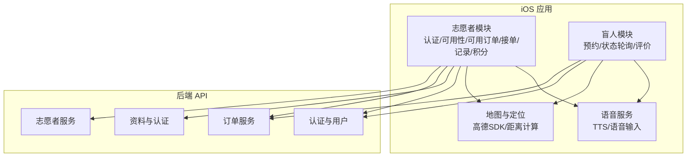
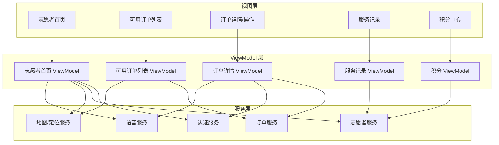
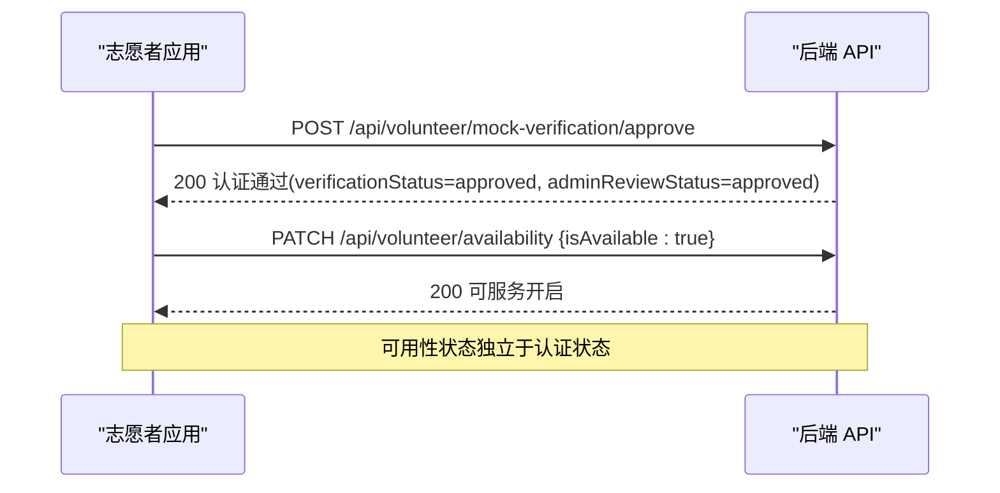
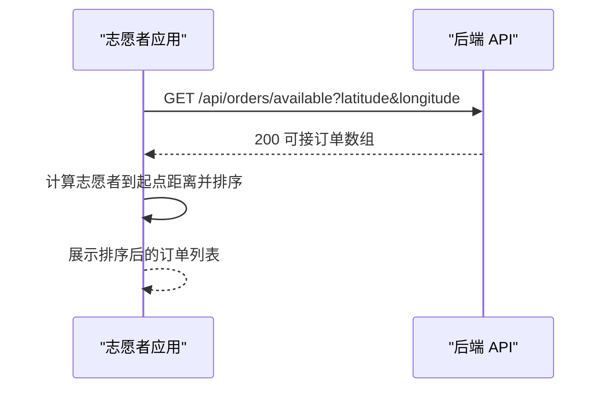
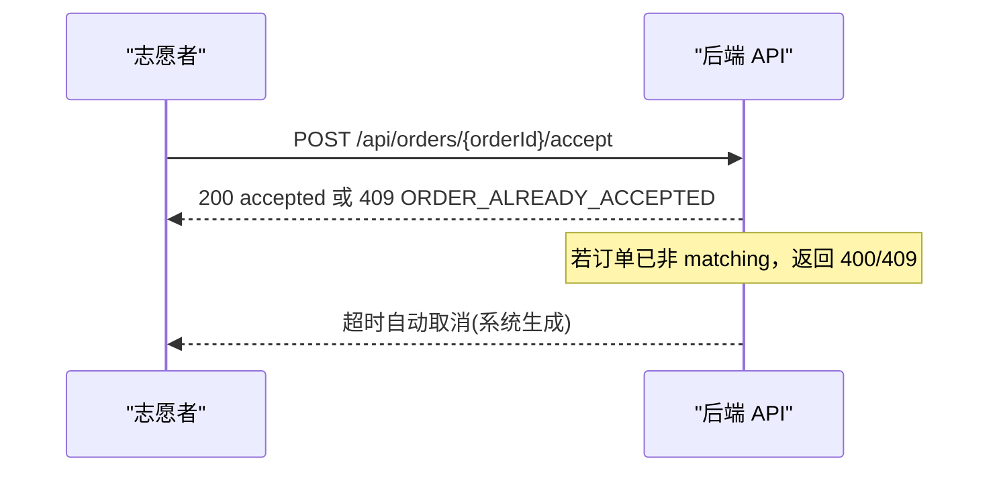
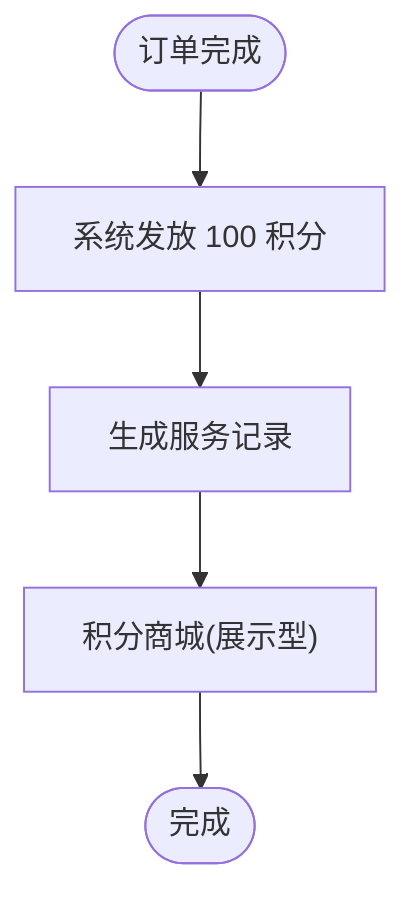
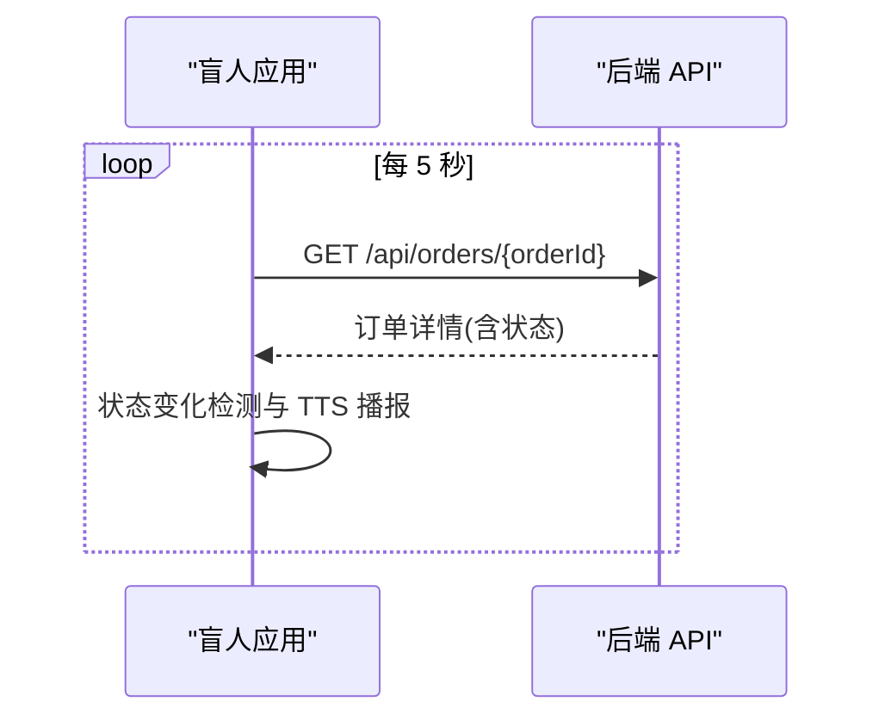
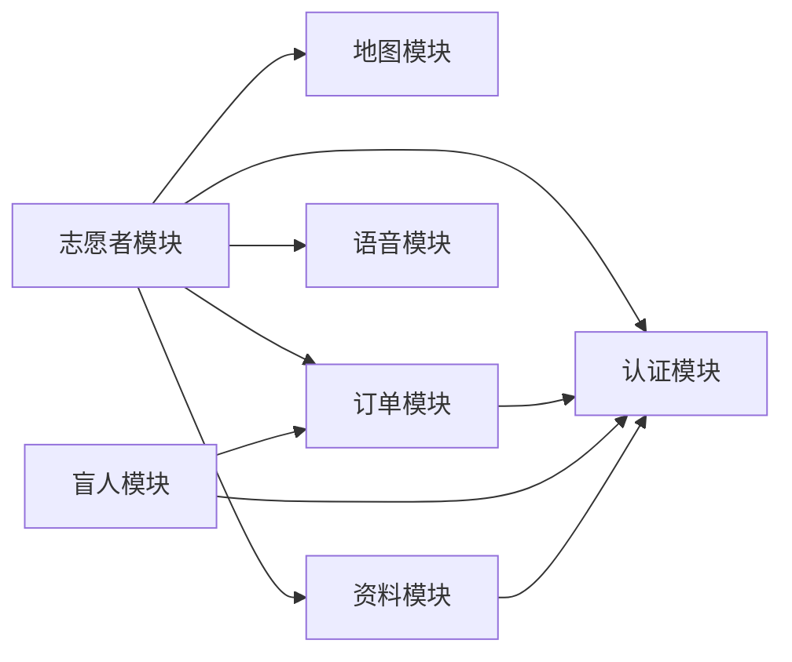
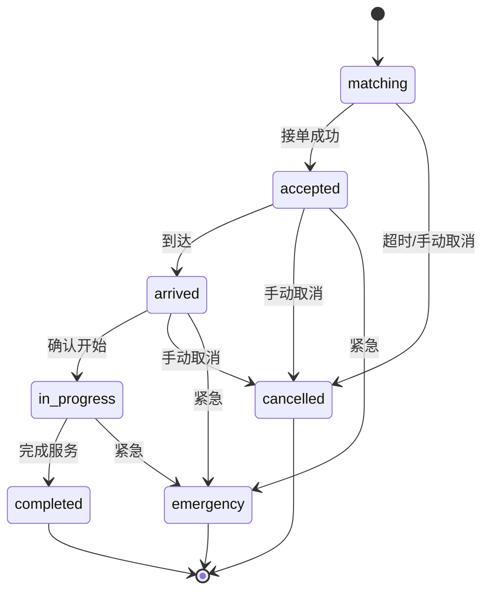

# 志愿者功能

<cite>
**本文引用的文件**
- [08-ios-architecture.md](file://docs/08-ios-architecture.md)
- [07-api-contract.openapi.yaml](file://docs/07-api-contract.openapi.yaml)
- [volunteer-order-flow/spec.md](file://openspec/changes/add-aidrun-ios-spring-mvp/specs/volunteer-order-flow/spec.md)
- [volunteer-points/spec.md](file://openspec/changes/add-aidrun-ios-spring-mvp/specs/volunteer-points/spec.md)
- [order-status-lifecycle/spec.md](file://openspec/changes/add-aidrun-ios-spring-mvp/specs/order-status-lifecycle/spec.md)
- [04-user-flows-and-state-machine.md](file://docs/04-user-flows-and-state-machine.md)
- [03-user-stories.md](file://docs/03-user-stories.md)
- [00-consistency-check-report.md](file://docs/00-consistency-check-report.md)
- [ContentView.swift](file://blindRun/ContentView.swift)
- [blindRunApp.swift](file://blindRun/blindRun/blindRunApp.swift)
- [VolunteerController.java](file://backend/src/main/java/com/aidrun/backend/volunteer/VolunteerController.java)
- [VolunteerService.java](file://backend/src/main/java/com/aidrun/backend/volunteer/VolunteerService.java)
- [VolunteerControllerIntegrationTest.java](file://backend/src/test/java/com/aidrun/backend/volunteer/VolunteerControllerIntegrationTest.java)
- [VolunteerProfile.java](file://backend/src/main/java/com/aidrun/backend/profile/VolunteerProfile.java)
- [VerificationStatus.java](file://backend/src/main/java/com/aidrun/backend/profile/VerificationStatus.java)
- [AdminReviewStatus.java](file://backend/src/main/java/com/aidrun/backend/profile/AdminReviewStatus.java)
- [VolunteerProfileDto.java](file://backend/src/main/java/com/aidrun/backend/profile/dto/VolunteerProfileDto.java)
- [AvailabilityRequest.java](file://backend/src/main/java/com/aidrun/backend/volunteer/dto/AvailabilityRequest.java)
- [ErrorCode.java](file://backend/src/main/java/com/aidrun/backend/common/error/ErrorCode.java)
- [VolunteerHomeView.swift](file://blindRun/Volunteer/VolunteerHomeView.swift)
- [VolunteerModule.swift](file://blindRun/Volunteer/VolunteerModule.swift)
- [ProfileModels.swift](file://blindRun/Core/Models/ProfileModels.swift)
</cite>

## 更新摘要
**所做更改**
- 新增志愿者认证管理章节，详细说明Mock验证审批流程
- 新增可用性管理章节，说明可服务开关的完整生命周期
- 更新核心组件分析，加入认证管理与可用性管理的详细描述
- 新增认证状态枚举与权限控制的完整说明
- 更新故障排查指南，包含新的认证相关错误码

## 目录
1. [简介](#简介)
2. [项目结构](#项目结构)
3. [核心组件](#核心组件)
4. [架构总览](#架构总览)
5. [详细组件分析](#详细组件分析)
6. [依赖关系分析](#依赖关系分析)
7. [性能考虑](#性能考虑)
8. [故障排查指南](#故障排查指南)
9. [结论](#结论)
10. [附录](#附录)

## 简介
本文件面向志愿者功能模块，围绕认证管理、订单浏览、接单服务与工作记录展开，系统性阐述志愿者资质验证、认证状态管理与权限控制机制；详解可用订单筛选算法、距离排序与优先级设置及批量操作；深入说明接单流程的并发控制、订单锁定与冲突解决策略；并提供工作记录统计分析、服务评价与绩效管理功能说明，以及志愿者与跑者的交互界面与通信机制。

**更新** 新增志愿者认证管理与可用性管理功能的详细说明，包括Mock验证审批流程和可服务开关的完整生命周期管理。

## 项目结构
- iOS 应用采用 SwiftUI + MVVM 架构，按功能域划分模块，志愿者相关功能位于独立模块中，职责清晰：
  - 认证与资料：志愿者资料创建/更新、Mock 认证审批
  - 可用性管理：可服务开关控制、认证状态验证
  - 可用订单：获取可接订单列表、位置参数传递、距离排序
  - 接单服务：可服务开关、接单、到达、确认开始、完成、取消、紧急
  - 工作记录与积分：服务记录查询、积分余额与流水、积分商城占位
- API 由 OpenAPI 描述，涵盖认证、用户、志愿者、订单等标签，统一使用 Bearer JWT 进行鉴权。

**图表来源**
- [08-ios-architecture.md:18-31](file://docs/08-ios-architecture.md#L18-L31)
- [07-api-contract.openapi.yaml:16-24](file://docs/07-api-contract.openapi.yaml#L16-L24)

**章节来源**
- [08-ios-architecture.md:18-31](file://docs/08-ios-architecture.md#L18-L31)
- [07-api-contract.openapi.yaml:16-24](file://docs/07-api-contract.openapi.yaml#L16-L24)

## 核心组件
- 志愿者认证与资料
  - 资料创建/更新：支持昵称等非敏感字段
  - Mock 认证：将 verificationStatus 与 adminReviewStatus 设为 approved
  - 可服务开关：独立控制是否可接单，不影响查看
- 可用性管理
  - 可服务状态：isAvailable 字段控制接单能力
  - 认证验证：只有认证通过的志愿者才能开启可服务状态
  - 状态同步：认证状态变更影响可用性开关的有效性
- 可用订单
  - 获取 matching 订单列表，支持传入经纬度参数
  - iOS 侧根据当前位置进行距离排序
- 接单服务
  - 仅允许 status 为 matching 的订单被接单
  - 并发场景下，后端拒绝重复接单
  - 支持到达、确认开始、完成、取消、紧急等状态推进
- 工作记录与积分
  - 完成服务后获得 100 积分
  - 查询服务记录，包含服务时间、跑者昵称、起始地点、状态、积分
  - 积分商城为展示型占位

**章节来源**
- [volunteer-order-flow/spec.md:3-37](file://openspec/changes/add-aidrun-ios-spring-mvp/specs/volunteer-order-flow/spec.md#L3-L37)
- [volunteer-points/spec.md:3-25](file://openspec/changes/add-aidrun-ios-spring-mvp/specs/volunteer-points/spec.md#L3-L25)
- [order-status-lifecycle/spec.md:3-66](file://openspec/changes/add-aidrun-ios-spring-mvp/specs/order-status-lifecycle/spec.md#L3-L66)
- [07-api-contract.openapi.yaml:100-148](file://docs/07-api-contract.openapi.yaml#L100-L148)
- [07-api-contract.openapi.yaml:209-237](file://docs/07-api-contract.openapi.yaml#L209-L237)
- [07-api-contract.openapi.yaml:412-436](file://docs/07-api-contract.openapi.yaml#L412-L436)

## 架构总览
志愿者功能遵循 MVVM 架构，视图层保持轻薄，业务逻辑集中在 ViewModel 与 Service 层，通过统一的 APIClient 访问后端 API。认证与角色状态由 Auth 模块负责，志愿者模块通过 JWT 令牌访问受保护接口。

**图表来源**
- [08-ios-architecture.md:33-49](file://docs/08-ios-architecture.md#L33-L49)
- [07-api-contract.openapi.yaml:16-24](file://docs/07-api-contract.openapi.yaml#L16-L24)

## 详细组件分析

### 组件一：志愿者认证管理与权限控制
- 资质验证要求
  - 必须具备昵称、电话、Mock 认证通过（verificationStatus 与 adminReviewStatus 均为 approved）、可服务开关开启（isAvailable = true）方可接单
- Mock 认证流程
  - 调用 Mock 认证接口后，系统将两项状态均置为 approved，随后需开启可服务开关
  - 支持幂等调用：重复调用不会产生副作用
  - 需要先创建志愿者资料，否则返回 PROFILE_INCOMPLETE 错误
- 认证状态枚举
  - VerificationStatus：not_submitted、pending、approved、rejected
  - AdminReviewStatus：not_submitted、pending、approved、rejected
- 权限控制
  - 接单前检查：未认证返回 VOLUNTEER_NOT_APPROVED；未开启可服务返回 VOLUNTEER_NOT_AVAILABLE
  - 角色切换限制：存在进行中订单时禁止切换角色

**图表来源**
- [volunteer-order-flow/spec.md:3-21](file://openspec/changes/add-aidrun-ios-spring-mvp/specs/volunteer-order-flow/spec.md#L3-L21)
- [07-api-contract.openapi.yaml:118-129](file://docs/07-api-contract.openapi.yaml#L118-L129)
- [07-api-contract.openapi.yaml:131-148](file://docs/07-api-contract.openapi.yaml#L131-L148)
- [07-api-contract.openapi.yaml:61-80](file://docs/07-api-contract.openapi.yaml#L61-L80)

**章节来源**
- [volunteer-order-flow/spec.md:3-21](file://openspec/changes/add-aidrun-ios-spring-mvp/specs/volunteer-order-flow/spec.md#L3-L21)
- [07-api-contract.openapi.yaml:118-129](file://docs/07-api-contract.openapi.yaml#L118-L129)
- [07-api-contract.openapi.yaml:131-148](file://docs/07-api-contract.openapi.yaml#L131-L148)
- [07-api-contract.openapi.yaml:61-80](file://docs/07-api-contract.openapi.yaml#L61-L80)

### 组件二：可用性管理与状态控制
- 可服务状态管理
  - 开启条件：必须先通过 Mock 认证（verificationStatus = approved 且 adminReviewStatus = approved）
  - 关闭条件：可随时关闭，不影响查看订单
  - 状态验证：未认证状态下尝试开启可服务会返回 VOLUNTEER_NOT_APPROVED
- 可用性开关接口
  - PATCH /api/volunteer/availability：更新 isAvailable 状态
  - 请求体：AvailabilityRequest{ isAvailable: boolean }
  - 响应：完整的志愿者资料对象，包含认证状态和可用性信息
- 状态同步机制
  - 认证状态变更会影响可用性开关的有效性
  - 可用性状态变更不影响认证状态
- 幂等性保证
  - 重复开启/关闭可服务状态不会产生副作用
  - 状态变更后立即生效，无需额外确认

**图表来源**
- [VolunteerController.java:25-39](file://backend/src/main/java/com/aidrun/backend/volunteer/VolunteerController.java#L25-L39)
- [VolunteerService.java:24-62](file://backend/src/main/java/com/aidrun/backend/volunteer/VolunteerService.java#L24-L62)
- [VolunteerControllerIntegrationTest.java:107-155](file://backend/src/test/java/com/aidrun/backend/volunteer/VolunteerControllerIntegrationTest.java#L107-L155)

**章节来源**
- [VolunteerController.java:25-39](file://backend/src/main/java/com/aidrun/backend/volunteer/VolunteerController.java#L25-L39)
- [VolunteerService.java:24-62](file://backend/src/main/java/com/aidrun/backend/volunteer/VolunteerService.java#L24-L62)
- [VolunteerControllerIntegrationTest.java:107-155](file://backend/src/test/java/com/aidrun/backend/volunteer/VolunteerControllerIntegrationTest.java#L107-L155)

### 组件三：可用订单筛选、距离排序与优先级
- 数据来源
  - 调用获取可用订单接口，后端返回 status 为 matching 的订单集合
- 参数与排序
  - 支持传入 latitude/longitude 参数；后端不进行距离排序，iOS 侧基于当前位置计算并排序
- 优先级与批量操作
  - 优先级策略：距离优先；可结合预约时间、备注等字段进行二次筛选
  - 批量操作：在列表页支持批量标记"查看详情/快速接单"，减少重复跳转

**图表来源**
- [07-api-contract.openapi.yaml:209-237](file://docs/07-api-contract.openapi.yaml#L209-L237)
- [08-ios-architecture.md:47](file://docs/08-ios-architecture.md#L47)

**章节来源**
- [07-api-contract.openapi.yaml:209-237](file://docs/07-api-contract.openapi.yaml#L209-L237)
- [08-ios-architecture.md:47](file://docs/08-ios-architecture.md#L47)

### 组件四：接单流程与并发控制
- 流程步骤
  - 志愿者在订单列表选择订单，发起接单请求
  - 后端校验：仅 matching 订单可接；志愿者需认证通过且可服务开启
  - 成功后订单进入 accepted；后续可标记到达、确认开始、完成
- 并发控制与冲突解决
  - 若订单状态已变更为 accepted，则再次接单返回 ORDER_ALREADY_ACCEPTED
  - 系统无人接单超时：当距离预约时间小于 30 分钟且仍未接单，自动取消并记录原因 no_volunteer_available

**图表来源**
- [07-api-contract.openapi.yaml:256-287](file://docs/07-api-contract.openapi.yaml#L256-L287)
- [order-status-lifecycle/spec.md:15-17](file://openspec/changes/add-aidrun-ios-spring-mvp/specs/order-status-lifecycle/spec.md#L15-L17)
- [order-status-lifecycle/spec.md:43-49](file://openspec/changes/add-aidrun-ios-spring-mvp/specs/order-status-lifecycle/spec.md#L43-L49)

**章节来源**
- [07-api-contract.openapi.yaml:256-287](file://docs/07-api-contract.openapi.yaml#L256-L287)
- [order-status-lifecycle/spec.md:15-17](file://openspec/changes/add-aidrun-ios-spring-mvp/specs/order-status-lifecycle/spec.md#L15-L17)
- [order-status-lifecycle/spec.md:43-49](file://openspec/changes/add-aidrun-ios-spring-mvp/specs/order-status-lifecycle/spec.md#L43-L49)

### 组件五：工作记录与积分管理
- 积分发放
  - 完成服务（in_progress -> completed）后，系统向志愿者账户增加 100 积分
- 服务记录
  - 包含：订单 ID、服务时间、跑者昵称、起始地点、状态、获得积分
- 积分商城
  - MVP 阶段为展示型占位，不涉及兑换、库存与支付

**图表来源**
- [volunteer-points/spec.md:3-25](file://openspec/changes/add-aidrun-ios-spring-mvp/specs/volunteer-points/spec.md#L3-L25)
- [07-api-contract.openapi.yaml:412-436](file://docs/07-api-contract.openapi.yaml#L412-L436)
- [07-api-contract.openapi.yaml:438-451](file://docs/07-api-contract.openapi.yaml#L438-L451)

**章节来源**
- [volunteer-points/spec.md:3-25](file://openspec/changes/add-aidrun-ios-spring-mvp/specs/volunteer-points/spec.md#L3-L25)
- [07-api-contract.openapi.yaml:412-436](file://docs/07-api-contract.openapi.yaml#L412-L436)
- [07-api-contract.openapi.yaml:438-451](file://docs/07-api-contract.openapi.yaml#L438-L451)

### 组件六：志愿者与跑者的交互与通信
- 状态轮询
  - 盲人端在等待、已接单、已到达、服务中页面每 5 秒轮询订单详情，观察状态变化并播报
- 无障碍与语音
  - 主要页面提供"重复当前状态"按钮；危险操作（取消、紧急、完成、登出）需二次确认
- 交互界面
  - 志愿者首页：可服务开关、可用订单列表、服务记录、积分中心
  - 订单详情页：到达、确认开始、完成、取消、紧急等操作按钮

**图表来源**
- [03-user-stories.md:655-667](file://docs/03-user-stories.md#L655-L667)
- [08-ios-architecture.md:140-146](file://docs/08-ios-architecture.md#L140-L146)

**章节来源**
- [03-user-stories.md:655-667](file://docs/03-user-stories.md#L655-L667)
- [08-ios-architecture.md:140-146](file://docs/08-ios-architecture.md#L140-L146)

## 依赖关系分析
- 模块耦合
  - 志愿者模块依赖认证模块（JWT 令牌）、地图模块（距离计算）、语音模块（TTS）
  - 订单模块与志愿者模块强耦合，涉及接单、状态推进与轮询
  - 认证模块与资料模块紧密关联，认证状态影响志愿者功能的可用性
- 外部依赖
  - 高德地图 SDK 用于定位与距离计算
  - URLSession 作为网络栈，统一 APIClient 接口
- 接口契约
  - 所有受保护接口使用 Bearer JWT；错误码统一映射为用户可理解的消息

**图表来源**
- [08-ios-architecture.md:18-31](file://docs/08-ios-architecture.md#L18-L31)
- [07-api-contract.openapi.yaml:16-24](file://docs/07-api-contract.openapi.yaml#L16-L24)

**章节来源**
- [08-ios-architecture.md:18-31](file://docs/08-ios-architecture.md#L18-L31)
- [07-api-contract.openapi.yaml:16-24](file://docs/07-api-contract.openapi.yaml#L16-L24)

## 性能考虑
- 轮询频率与节流
  - 盲人端每 5 秒轮询一次，建议在后台或页面不可见时降低频率或停止轮询
- 网络重试
  - MVP 不引入复杂离线队列，简单重试即可；避免频繁重试造成抖动
- 地图与定位
  - 距离计算在客户端进行，建议缓存最近 N 个订单的距离结果，减少重复计算
- 并发与锁
  - 接单请求幂等性设计：同一志愿者对同一订单的重复接单应被后端拒绝，避免前端锁竞争
- 认证状态缓存
  - 建议在客户端缓存认证状态，减少重复认证检查的网络开销

## 故障排查指南
- 接单失败常见原因
  - 未认证：返回 VOLUNTEER_NOT_APPROVED
  - 未开启可服务：返回 VOLUNTEER_NOT_AVAILABLE
  - 订单非 matching：返回 INVALID_ORDER_STATUS 或 ORDER_ALREADY_ACCEPTED
- Mock 认证问题
  - 未创建资料：返回 PROFILE_INCOMPLETE
  - 重复认证：支持幂等调用，不会产生副作用
  - 无认证令牌：返回 401 Unauthorized
- 可服务开关问题
  - 未认证状态尝试开启：返回 VOLUNTEER_NOT_APPROVED
  - 请求参数无效：返回 VALIDATION_FAILED
  - 重复开关：支持幂等调用，状态不变
- 取消与紧急
  - 仅 matching/accepted/arrived 可普通取消；in_progress 只能紧急求助
  - 紧急触发后，到达/确认开始/完成/取消均被拒绝
- 超时取消
  - matching 订单在预约前 30 分钟无人接单将自动取消，原因 no_volunteer_available
- 轮询异常
  - 若长时间无状态更新，检查网络与令牌有效性；确认页面处于活跃状态

**章节来源**
- [07-api-contract.openapi.yaml:256-287](file://docs/07-api-contract.openapi.yaml#L256-L287)
- [order-status-lifecycle/spec.md:31-49](file://openspec/changes/add-aidrun-ios-spring-mvp/specs/order-status-lifecycle/spec.md#L31-L49)
- [03-user-stories.md:687-700](file://docs/03-user-stories.md#L687-L700)
- [VolunteerControllerIntegrationTest.java:58-103](file://backend/src/test/java/com/aidrun/backend/volunteer/VolunteerControllerIntegrationTest.java#L58-L103)
- [VolunteerControllerIntegrationTest.java:107-155](file://backend/src/test/java/com/aidrun/backend/volunteer/VolunteerControllerIntegrationTest.java#L107-L155)

## 结论
志愿者功能模块以清晰的认证与权限控制为基础，结合可用订单的距离排序与优先级策略，提供稳定可靠的接单服务；通过严格的并发控制与超时取消机制保障公平性与系统稳定性；配合工作记录与积分体系，形成完整的激励闭环。新增的认证管理与可用性管理功能进一步完善了志愿者生态系统的完整性，通过Mock验证审批和可服务开关的精细化控制，确保了功能的安全性和可用性。盲人端的状态轮询与无障碍语音播报进一步提升了用户体验。整体设计符合 MVP 阶段的约束与目标。

## 附录
- 订单状态机（简化）
  - matching → accepted → arrived → in_progress → completed
  - 任一环节可触发 emergency，进入异常终态
- 认证状态枚举
  - VerificationStatus：not_submitted → pending → approved → rejected
  - AdminReviewStatus：not_submitted → pending → approved → rejected

**图表来源**
- [04-user-flows-and-state-machine.md:72-96](file://docs/04-user-flows-and-state-machine.md#L72-L96)

**章节来源**
- [04-user-flows-and-state-machine.md:72-96](file://docs/04-user-flows-and-state-machine.md#L72-L96)