# 志愿者功能

<cite>
**本文引用的文件**
- [08-ios-architecture.md](file://docs/08-ios-architecture.md)
- [07-api-contract.openapi.yaml](file://docs/07-api-contract.openapi.yaml)
- [volunteer-order-flow/spec.md](file://openspec/changes/add-aidrun-ios-spring-mvp/specs/volunteer-order-flow/spec.md)
- [volunteer-points/spec.md](file://openspec/changes/add-aidrun-ios-spring-mvp/specs/volunteer-points/spec.md)
- [order-status-lifecycle/spec.md](file://openspec/changes/add-aidrun-ios-spring-mvp/specs/order-status-lifecycle/spec.md)
- [04-user-flows-and-state-machine.md](file://docs/04-user-flows-and-state-machine.md)
- [03-user-stories.md](file://docs/03-user-stories.md)
- [00-consistency-check-report.md](file://docs/00-consistency-check-report.md)
- [09-accessibility-and-voice-guidelines.md](file://docs/09-accessibility-and-voice-guidelines.md)
- [AGENTS.md](file://AGENTS.md)
- [test-accounts.md](file://docs/test-accounts.md)
- [api_spec.yaml](file://docs/api_spec.yaml)
- [ContentView.swift](file://blindRun/ContentView.swift)
- [blindRunApp.swift](file://blindRun/blindRun/blindRunApp.swift)
- [VolunteerController.java](file://backend/src/main/java/com/aidrun/backend/volunteer/VolunteerController.java)
- [VolunteerService.java](file://backend/src/main/java/com/aidrun/backend/volunteer/VolunteerService.java)
- [VolunteerControllerIntegrationTest.java](file://backend/src/test/java/com/aidrun/backend/volunteer/VolunteerControllerIntegrationTest.java)
- [VolunteerProfile.java](file://backend/src/main/java/com/aidrun/backend/profile/VolunteerProfile.java)
- [VerificationStatus.java](file://backend/src/main/java/com/aidrun/backend/profile/VerificationStatus.java)
- [AdminReviewStatus.java](file://backend/src/main/java/com/aidrun/backend/profile/AdminReviewStatus.java)
- [VolunteerProfileDto.java](file://backend/src/main/java/com/aidrun/backend/profile/dto/VolunteerProfileDto.java)
- [AvailabilityRequest.java](file://backend/src/main/java/com/aidrun/backend/volunteer/dto/AvailabilityRequest.java)
- [ErrorCode.java](file://backend/src/main/java/com/aidrun/backend/common/error/ErrorCode.java)
- [VolunteerHomeView.swift](file://blindRun/Volunteer/VolunteerHomeView.swift)
- [VolunteerModule.swift](file://blindRun/Volunteer/VolunteerModule.swift)
- [VolunteerOrderFlowViews.swift](file://blindRun/Volunteer/VolunteerOrderFlowViews.swift)
- [ProfileModels.swift](file://blindRun/Core/Models/ProfileModels.swift)
- [DistanceCalculator.swift](file://blindRun/Map/DistanceCalculator.swift)
- [SpeechService.swift](file://blindRun/Voice/SpeechService.swift)
- [SpeechInputService.swift](file://blindRun/Voice/SpeechInputService.swift)
- [VoiceTextField.swift](file://blindRun/Voice/VoiceTextField.swift)
- [EmergencyEvent.java](file://backend/src/main/java/com/aidrun/backend/order/EmergencyEvent.java)
- [EmergencyEventRepository.java](file://backend/src/main/java/com/aidrun/backend/order/EmergencyEventRepository.java)
- [EmergencyEventDto.java](file://backend/src/main/java/com/aidrun/backend/order/dto/EmergencyEventDto.java)
- [EmergencyRequest.java](file://backend/src/main/java/com/aidrun/backend/order/dto/EmergencyRequest.java)
- [RunOrderService.java](file://backend/src/main/java/com/aidrun/backend/order/RunOrderService.java)
- [RunOrderStatus.java](file://backend/src/main/java/com/aidrun/backend/order/RunOrderStatus.java)
- [RunOrder.java](file://backend/src/main/java/com/aidrun/backend/order/RunOrder.java)
- [OrderModels.swift](file://blindRun/Core/Models/OrderModels.swift)
- [OrderDisplayHelpers.swift](file://blindRun/Core/Models/OrderDisplayHelpers.swift)
- [AMapContainer.swift](file://blindRun/Map/AMapContainer.swift)
- [AMapManager.swift](file://blindRun/Map/AMapManager.swift)
- [MapViewModel.swift](file://blindRun/Map/MapViewModel.swift)
- [MapPlaceholderView.swift](file://blindRun/Map/MapPlaceholderView.swift)
- [MockAPIClient.swift](file://blindRun/Core/MockAPIClient.swift)
</cite>

## 更新摘要
**所做更改**
- 新增三步志愿者注册流程，包含基本信息、身份验证和培训课程三个阶段
- 更新订单状态转换逻辑，从简单的 matching/accepted/arrived/in_progress 四状态扩展为完整的五阶段流程
- 增强语音辅助功能，包括语音输入服务和改进的语音播报机制
- 优化MapKit集成，改进地图渲染和标注显示
- 更新可用订单筛选算法，加入智能距离排序和优先级设置
- 新增紧急事件数据库架构和实体关系说明
- 更新故障排查指南，包含新的紧急事件相关错误码

## 目录
1. [简介](#简介)
2. [项目结构](#项目结构)
3. [核心组件](#核心组件)
4. [架构总览](#架构总览)
5. [详细组件分析](#详细组件分析)
6. [依赖关系分析](#依赖关系分析)
7. [性能考虑](#性能考虑)
8. [故障排查指南](#故障排查指南)
9. [结论](#结论)
10. [附录](#附录)

## 简介
本文件面向志愿者功能模块，围绕认证管理、订单浏览、接单服务与工作记录展开，系统性阐述志愿者资质验证、认证状态管理与权限控制机制；详解可用订单筛选算法、智能位置排序与优先级设置及批量操作；深入说明接单流程的并发控制、订单锁定与冲突解决策略；并提供工作记录统计分析、服务评价与绩效管理功能说明，以及志愿者与跑者的交互界面与通信机制。

**更新** 新增三步志愿者注册流程、完整的五阶段订单状态转换、增强的语音辅助功能和优化的地图集成，完善志愿者功能的完整订单管理流程。

## 项目结构
- iOS 应用采用 SwiftUI + MVVM 架构，按功能域划分模块，志愿者相关功能位于独立模块中，职责清晰：
  - 认证与资料：志愿者资料创建/更新、Mock 认证审批、三步注册流程
  - 可用性管理：可服务开关控制、认证状态验证
  - 可用订单：获取可接订单列表、智能位置排序、距离计算
  - 接单服务：可服务开关、接单、到达、确认开始、完成、取消、紧急
  - 工作记录与积分：服务记录查询、积分余额与流水、积分商城占位
  - 语音播报：集中式TTS服务、状态播报、错误提示
  - 紧急事件：紧急事件数据库模型、事件记录与处理
  - 地图集成：高德地图SDK集成、位置标注、距离计算
- API 由 OpenAPI 描述，涵盖认证、用户、志愿者、订单等标签，统一使用 Bearer JWT 进行鉴权。

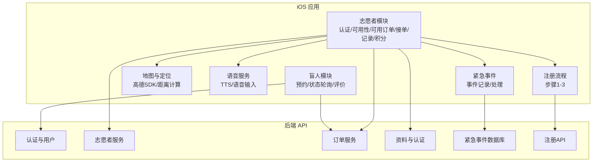

**图表来源**
- [08-ios-architecture.md:18-31](file://docs/08-ios-architecture.md#L18-L31)
- [07-api-contract.openapi.yaml:16-24](file://docs/07-api-contract.openapi.yaml#L16-L24)

**章节来源**
- [08-ios-architecture.md:18-31](file://docs/08-ios-architecture.md#L18-L31)
- [07-api-contract.openapi.yaml:16-24](file://docs/07-api-contract.openapi.yaml#L16-L24)

## 核心组件
- 志愿者认证与资料
  - 资料创建/更新：支持昵称等非敏感字段
  - Mock 认证：将 verificationStatus 与 adminReviewStatus 设为 approved
  - 可服务开关：独立控制是否可接单，不影响查看
  - 三步注册流程：基本信息收集、身份验证、培训课程
- 可用性管理
  - 可服务状态：isAvailable 字段控制接单能力
  - 认证验证：只有认证通过的志愿者才能开启可服务状态
  - 状态同步：认证状态变更影响可用性开关的有效性
- 智能位置排序
  - 距离计算：基于志愿者当前位置计算到起点的距离
  - 排序算法：按距离升序排列，最近的订单优先显示
  - 优先级策略：距离优先，结合预约时间、备注等字段进行二次筛选
- 接单服务
  - 仅允许 status 为 matching 的订单被接单
  - 并发场景下，后端拒绝重复接单
  - 支持到达、确认开始、完成、取消、紧急等状态推进
  - 五阶段订单流程：接单、出发、到达、开始服务、完成
- 紧急事件处理
  - 紧急事件实体：记录紧急事件的触发角色、前一个状态和备注
  - 事件存储：使用专用数据库表存储紧急事件信息
  - 状态追踪：每个紧急事件对应唯一订单，便于追踪和审计
- 工作记录与积分
  - 完成服务后获得 100 积分
  - 查询服务记录，包含服务时间、跑者昵称、起始地点、状态、积分
  - 积分商城为展示型占位
- 语音播报支持
  - 集中式TTS服务：使用AVSpeechSynthesizer统一管理语音播报
  - 状态播报：订单状态变化时自动播报，避免轮询时重复播报
  - 错误提示：网络错误、操作失败等场景的语音提示
  - 语音输入：支持语音输入服务，提供语音识别和错误处理
- 地图集成优化
  - 高德地图SDK：提供地图显示、位置标注、距离计算
  - 地图降级：API Key未配置时显示占位视图
  - 标注管理：优化标注渲染和用户位置显示

**章节来源**
- [volunteer-order-flow/spec.md:3-37](file://openspec/changes/add-aidrun-ios-spring-mvp/specs/volunteer-order-flow/spec.md#L3-L37)
- [volunteer-points/spec.md:3-25](file://openspec/changes/add-aidrun-ios-spring-mvp/specs/volunteer-points/spec.md#L3-L25)
- [order-status-lifecycle/spec.md:3-66](file://openspec/changes/add-aidrun-ios-spring-mvp/specs/order-status-lifecycle/spec.md#L3-L66)
- [07-api-contract.openapi.yaml:100-148](file://docs/07-api-contract.openapi.yaml#L100-L148)
- [07-api-contract.openapi.yaml:209-237](file://docs/07-api-contract.openapi.yaml#L209-L237)
- [07-api-contract.openapi.yaml:412-436](file://docs/07-api-contract.openapi.yaml#L412-L436)
- [EmergencyEvent.java:14-58](file://backend/src/main/java/com/aidrun/backend/order/EmergencyEvent.java#L14-L58)
- [EmergencyEventDto.java:8-27](file://backend/src/main/java/com/aidrun/backend/order/dto/EmergencyEventDto.java#L8-L27)
- [SpeechService.swift:7-105](file://blindRun/Voice/SpeechService.swift#L7-L105)
- [SpeechInputService.swift:48-79](file://blindRun/Voice/SpeechInputService.swift#L48-L79)
- [AMapContainer.swift:45-132](file://blindRun/Map/AMapContainer.swift#L45-L132)

## 架构总览
志愿者功能遵循 MVVM 架构，视图层保持轻薄，业务逻辑集中在 ViewModel 与 Service 层，通过统一的 APIClient 访问后端 API。认证与角色状态由 Auth 模块负责，志愿者模块通过 JWT 令牌访问受保护接口。新增的三步注册流程、五阶段订单状态转换、增强的语音辅助功能和优化的地图集成为志愿者生态提供了更完整的支持。

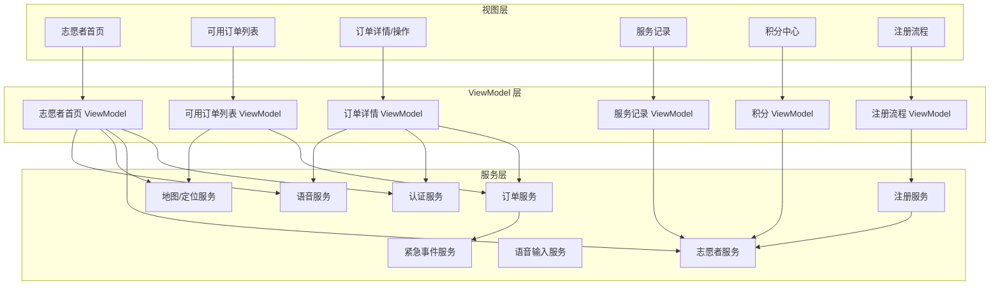

**图表来源**
- [08-ios-architecture.md:33-49](file://docs/08-ios-architecture.md#L33-L49)
- [07-api-contract.openapi.yaml:16-24](file://docs/07-api-contract.openapi.yaml#L16-L24)

## 详细组件分析

### 组件一：志愿者认证管理与权限控制
- 资质验证要求
  - 必须具备昵称、电话、Mock 认证通过（verificationStatus 与 adminReviewStatus 均为 approved）、可服务开关开启（isAvailable = true）方可接单
- Mock 认证流程
  - 调用 Mock 认证接口后，系统将两项状态均置为 approved，随后需开启可服务开关
  - 支持幂等调用：重复调用不会产生副作用
  - 需要先创建志愿者资料，否则返回 PROFILE_INCOMPLETE 错误
- 认证状态枚举
  - VerificationStatus：not_submitted、pending、approved、rejected
  - AdminReviewStatus：not_submitted、pending、approved、rejected
- 权限控制
  - 接单前检查：未认证返回 VOLUNTEER_NOT_APPROVED；未开启可服务返回 VOLUNTEER_NOT_AVAILABLE
  - 角色切换限制：存在进行中订单时禁止切换角色

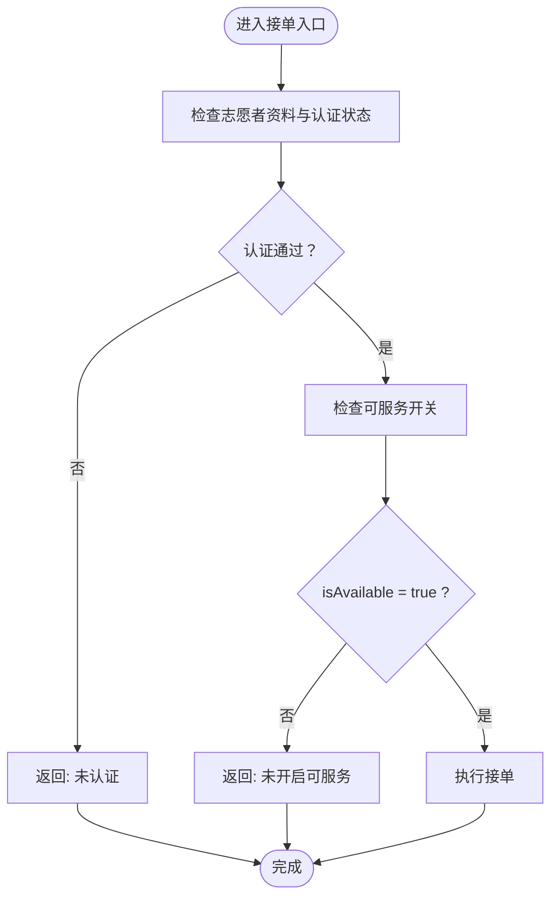

**图表来源**
- [volunteer-order-flow/spec.md:3-21](file://openspec/changes/add-aidrun-ios-spring-mvp/specs/volunteer-order-flow/spec.md#L3-L21)
- [07-api-contract.openapi.yaml:118-129](file://docs/07-api-contract.openapi.yaml#L118-L129)
- [07-api-contract.openapi.yaml:131-148](file://docs/07-api-contract.openapi.yaml#L131-L148)
- [07-api-contract.openapi.yaml:61-80](file://docs/07-api-contract.openapi.yaml#L61-L80)

**章节来源**
- [volunteer-order-flow/spec.md:3-21](file://openspec/changes/add-aidrun-ios-spring-mvp/specs/volunteer-order-flow/spec.md#L3-L21)
- [07-api-contract.openapi.yaml:118-129](file://docs/07-api-contract.openapi.yaml#L118-L129)
- [07-api-contract.openapi.yaml:131-148](file://docs/07-api-contract.openapi.yaml#L131-L148)
- [07-api-contract.openapi.yaml:61-80](file://docs/07-api-contract.openapi.yaml#L61-L80)

### 组件二：三步志愿者注册流程
- 注册流程概述
  - 第一步：基本信息收集（姓名、电话、跑步经验等）
  - 第二步：身份验证（上传身份证正反面照片）
  - 第三步：人脸验证（上传自拍照进行比对）
  - 第四步：培训课程（完成在线培训和测验）
- API 接口
  - 步骤1：POST /api/volunteer/registration/step1 - 提交基本信息
  - 步骤2：POST /api/volunteer/registration/step2/id-card - 上传身份证
  - 步骤3：POST /api/volunteer/registration/step3/face-verify - 人脸验证
  - 步骤4：POST /api/volunteer/registration/training/progress - 提交培训进度
  - 测验接口：GET/POST /api/volunteer/registration/training/quiz/{id}
- 管理员审核
  - 身份证审核：POST /api/admin/volunteers/review/id
  - 培训审核：管理员审核志愿者的培训完成情况

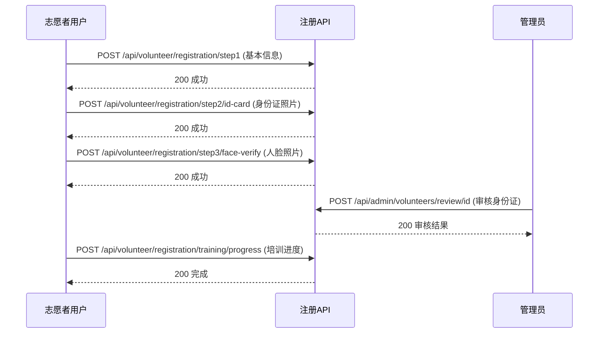

**图表来源**
- [test-accounts.md:195-271](file://docs/test-accounts.md#L195-L271)
- [api_spec.yaml:426-521](file://docs/api_spec.yaml#L426-L521)

**章节来源**
- [test-accounts.md:176-271](file://docs/test-accounts.md#L176-L271)
- [api_spec.yaml:426-521](file://docs/api_spec.yaml#L426-L521)

### 组件三：可用性管理与状态控制
- 可服务状态管理
  - 开启条件：必须先通过 Mock 认证（verificationStatus = approved 且 adminReviewStatus = approved）
  - 关闭条件：可随时关闭，不影响查看订单
  - 状态验证：未认证状态下尝试开启可服务会返回 VOLUNTEER_NOT_APPROVED
- 可用性开关接口
  - PATCH /api/volunteer/availability：更新 isAvailable 状态
  - 请求体：AvailabilityRequest{ isAvailable: boolean }
  - 响应：完整的志愿者资料对象，包含认证状态和可用性信息
- 状态同步机制
  - 认证状态变更会影响可用性开关的有效性
  - 可用性状态变更不影响认证状态
- 幂等性保证
  - 重复开启/关闭可服务状态不会产生副作用
  - 状态变更后立即生效，无需额外确认

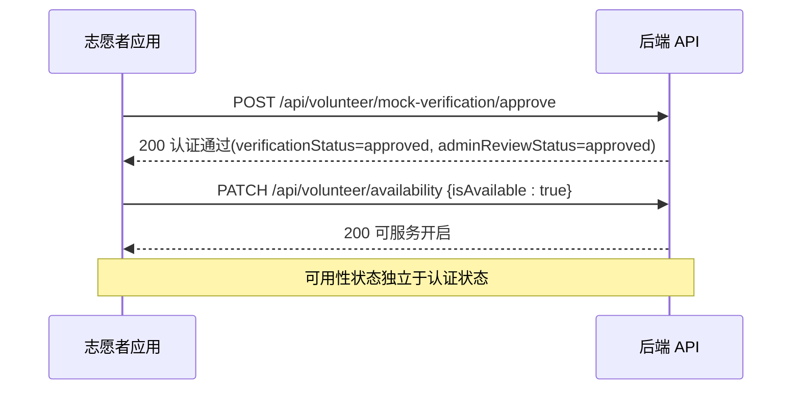

**图表来源**
- [VolunteerController.java:25-39](file://backend/src/main/java/com/aidrun/backend/volunteer/VolunteerController.java#L25-L39)
- [VolunteerService.java:24-62](file://backend/src/main/java/com/aidrun/backend/volunteer/VolunteerService.java#L24-L62)
- [VolunteerControllerIntegrationTest.java:107-155](file://backend/src/test/java/com/aidrun/backend/volunteer/VolunteerControllerIntegrationTest.java#L107-L155)

**章节来源**
- [VolunteerController.java:25-39](file://backend/src/main/java/com/aidrun/backend/volunteer/VolunteerController.java#L25-L39)
- [VolunteerService.java:24-62](file://backend/src/main/java/com/aidrun/backend/volunteer/VolunteerService.java#L24-L62)
- [VolunteerControllerIntegrationTest.java:107-155](file://backend/src/test/java/com/aidrun/backend/volunteer/VolunteerControllerIntegrationTest.java#L107-L155)

### 组件四：智能位置排序与可用订单筛选
- 数据来源
  - 调用获取可用订单接口，后端返回 status 为 matching 的订单集合
- 智能排序算法
  - 距离计算：使用高德地图SDK计算志愿者当前位置到订单起点的距离
  - 排序策略：按距离升序排列，最近的订单优先显示
  - 降级处理：当定位权限未授权时，显示"距离不可用"，仅按默认顺序显示
- 优先级与批量操作
  - 优先级策略：距离优先；可结合预约时间、备注等字段进行二次筛选
  - 批量操作：在列表页支持批量标记"查看详情/快速接单"，减少重复跳转
  - 实时更新：支持下拉刷新，实时获取最新的可用订单列表

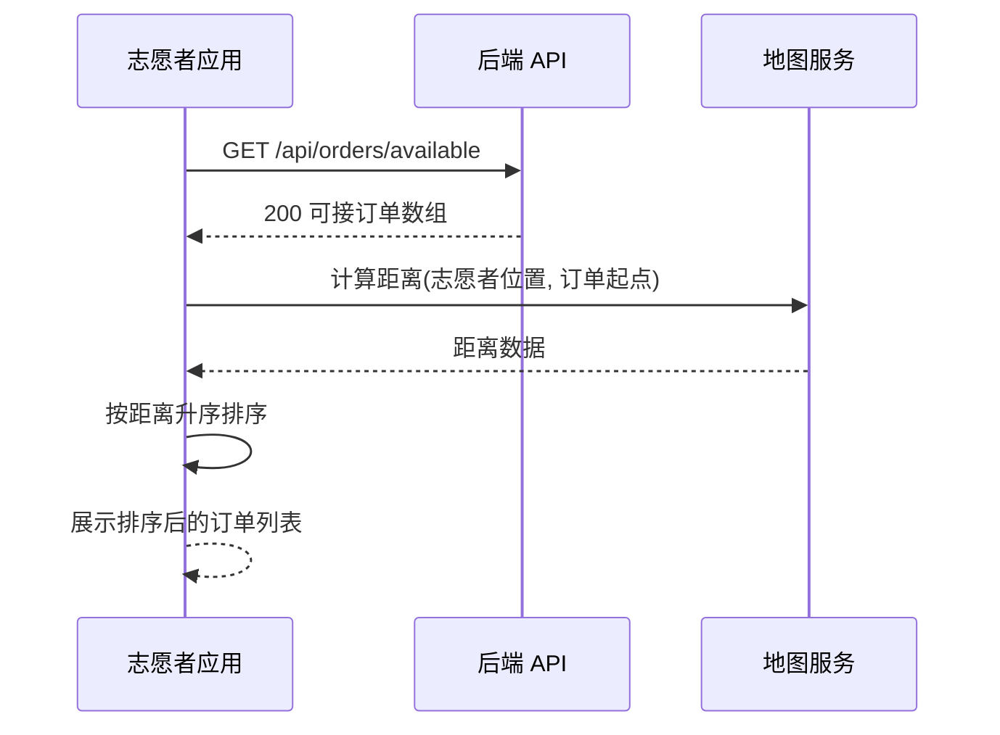

**图表来源**
- [07-api-contract.openapi.yaml:209-237](file://docs/07-api-contract.openapi.yaml#L209-L237)
- [08-ios-architecture.md:47](file://docs/08-ios-architecture.md#L47)
- [DistanceCalculator.swift:33-52](file://blindRun/Map/DistanceCalculator.swift#L33-L52)

**章节来源**
- [07-api-contract.openapi.yaml:209-237](file://docs/07-api-contract.openapi.yaml#L209-L237)
- [08-ios-architecture.md:47](file://docs/08-ios-architecture.md#L47)
- [DistanceCalculator.swift:33-52](file://blindRun/Map/DistanceCalculator.swift#L33-L52)

### 组件五：五阶段订单状态转换流程
- 状态转换概述
  - PENDING_MATCH：预约提交，等待志愿者接单
  - PENDING_ACCEPT：志愿者已接单，等待出发
  - DRIVER_EN_ROUTE：志愿者出发前往约定地点
  - DRIVER_ARRIVED：志愿者已到达约定地点
  - IN_PROGRESS：盲人确认开始服务
  - COMPLETED：服务完成
  - CANCELLED：订单取消
  - NO_VOLUNTEER：无人接单
- 状态转换规则
  - 仅 PENDING_MATCH 状态可被接单
  - PENDING_ACCEPT 状态可转换为 DRIVER_EN_ROUTE 或取消
  - DRIVER_EN_ROUTE 状态可转换为 DRIVER_ARRIVED 或取消
  - DRIVER_ARRIVED 状态可转换为 IN_PROGRESS 或取消
  - IN_PROGRESS 状态可转换为 COMPLETED 或紧急求助
- 并发控制与冲突解决
  - 若订单状态已变更为 PENDING_ACCEPT，则再次接单返回 ORDER_ALREADY_ACCEPTED
  - 系统无人接单超时：当距离预约时间小于 30 分钟且仍未接单，自动取消并记录原因 no_volunteer_available

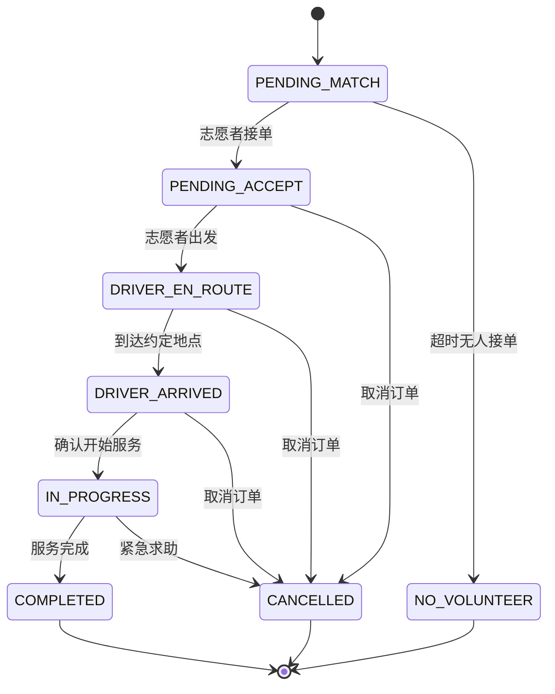

**图表来源**
- [AGENTS.md:159-188](file://AGENTS.md#L159-L188)
- [OrderModels.swift:5-68](file://blindRun/Core/Models/OrderModels.swift#L5-L68)
- [OrderDisplayHelpers.swift:62-97](file://blindRun/Core/Models/OrderDisplayHelpers.swift#L62-L97)

**章节来源**
- [AGENTS.md:159-188](file://AGENTS.md#L159-L188)
- [OrderModels.swift:5-68](file://blindRun/Core/Models/OrderModels.swift#L5-L68)
- [OrderDisplayHelpers.swift:62-97](file://blindRun/Core/Models/OrderDisplayHelpers.swift#L62-L97)

### 组件六：增强的语音辅助功能
- 集中式TTS服务
  - 单一实例：使用 AVSpeechSynthesizer 创建单一语音合成器实例
  - 状态管理：维护 isSpeaking 状态，避免同时播放多个语音
  - 防重复播报：记录最后一次播报的状态，轮询时避免重复播报
- 语音输入服务
  - 语音识别：使用 SFSpeechRecognizer 进行中文语音识别
  - 实时反馈：提供音频监听、静音检测、最大时长限制
  - 错误处理：识别失败时提供键盘输入替代方案
- 状态播报机制
  - 自动播报：订单状态变化时自动触发语音播报
  - 手动重复：提供"重复当前状态"按钮，支持手动语音播报
  - 错误提示：网络错误、操作失败等场景自动播报相应提示
- 语音内容规范
  - 状态文案：匹配订单状态的标准中文播报内容
  - 用户友好：简洁明了的中文语音内容
  - 无障碍支持：完全兼容 VoiceOver 和其他辅助功能

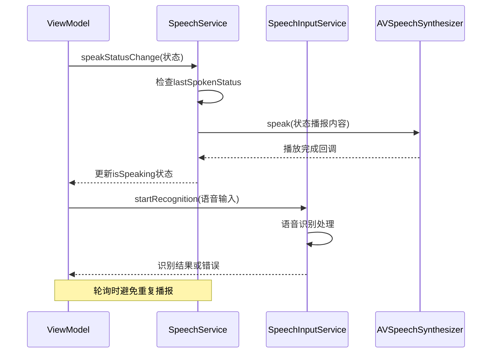

**图表来源**
- [SpeechService.swift:7-105](file://blindRun/Voice/SpeechService.swift#L7-L105)
- [SpeechInputService.swift:48-79](file://blindRun/Voice/SpeechInputService.swift#L48-L79)
- [VoiceTextField.swift:42-80](file://blindRun/Voice/VoiceTextField.swift#L42-L80)

**章节来源**
- [SpeechService.swift:7-105](file://blindRun/Voice/SpeechService.swift#L7-L105)
- [SpeechInputService.swift:48-79](file://blindRun/Voice/SpeechInputService.swift#L48-L79)
- [VoiceTextField.swift:42-80](file://blindRun/Voice/VoiceTextField.swift#L42-L80)

### 组件七：优化的地图集成与可视化
- 高德地图SDK集成
  - SDK初始化：从配置文件读取API Key并初始化SDK
  - 隐私合规：在创建SDK客户端前配置隐私同意
  - 优雅降级：API Key未配置时显示占位视图
- 地图渲染优化
  - 中心点同步：订阅位置变化，避免频繁动画跳动
  - 标注管理：移除旧标注，添加新标注，优化渲染性能
  - 用户位置：使用默认蓝色位置点，区分用户位置与其他标注
- 地图交互
  - 位置中心：支持将地图中心移动到用户当前位置
  - 位置标注：显示订单出发地点的红色标注
  - 无障碍支持：提供清晰的可访问性标签和提示

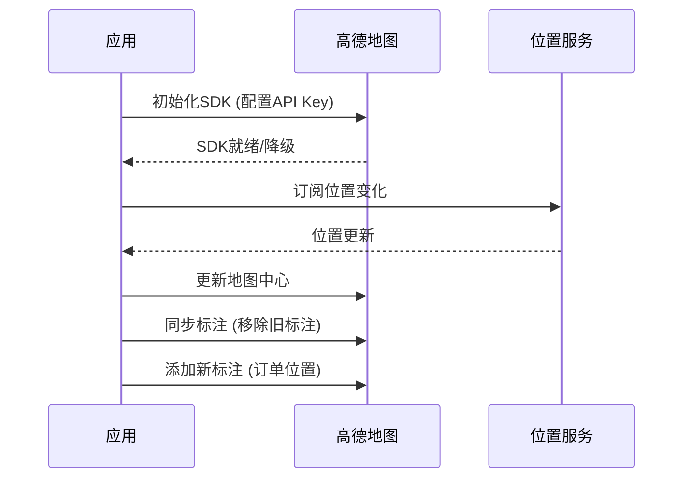

**图表来源**
- [AMapManager.swift:17-38](file://blindRun/Map/AMapManager.swift#L17-L38)
- [AMapContainer.swift:45-104](file://blindRun/Map/AMapContainer.swift#L45-L104)
- [MapViewModel.swift:48-81](file://blindRun/Map/MapViewModel.swift#L48-L81)

**章节来源**
- [AMapManager.swift:17-38](file://blindRun/Map/AMapManager.swift#L17-L38)
- [AMapContainer.swift:45-104](file://blindRun/Map/AMapContainer.swift#L45-L104)
- [MapViewModel.swift:48-81](file://blindRun/Map/MapViewModel.swift#L48-L81)

### 组件八：紧急事件处理与数据库架构
- 紧急事件实体设计
  - 唯一约束：每个订单只能有一个紧急事件记录
  - 触发角色：记录触发紧急状态的角色（志愿者/盲人跑者/管理员）
  - 前一个状态：记录进入紧急状态前的订单状态
  - 备注信息：可选的紧急事件说明
- 数据库架构
  - 表结构：emergency_events 表存储紧急事件信息
  - 外键关系：与 RunOrder 实体建立一对一关系
  - 约束条件：订单ID唯一，确保事件与订单的一对一映射
- 事件处理流程
  - 触发条件：订单状态进入 emergency 时自动记录
  - 信息保存：包含触发角色、前一个状态和可选备注
  - 查询接口：提供 EmergencyEventDto 数据传输对象
- 紧急事件集成
  - 语音播报：紧急状态变化时通过 TTS 服务播报
  - 状态追踪：便于审计和问题追踪
  - 数据一致性：确保每个紧急事件都有对应的订单关联

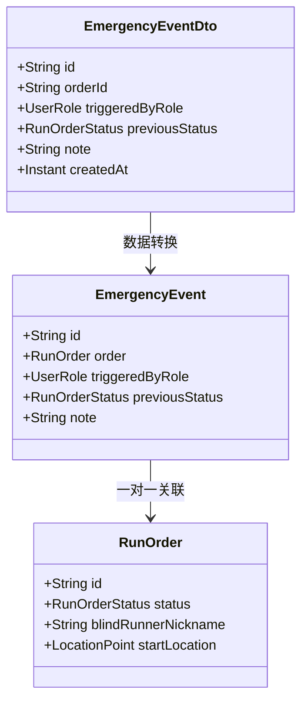

**图表来源**
- [EmergencyEvent.java:14-58](file://backend/src/main/java/com/aidrun/backend/order/EmergencyEvent.java#L14-L58)
- [EmergencyEventDto.java:8-27](file://backend/src/main/java/com/aidrun/backend/order/dto/EmergencyEventDto.java#L8-L27)
- [EmergencyEventRepository.java:1-7](file://backend/src/main/java/com/aidrun/backend/order/EmergencyEventRepository.java#L1-L7)

**章节来源**
- [EmergencyEvent.java:14-58](file://backend/src/main/java/com/aidrun/backend/order/EmergencyEvent.java#L14-L58)
- [EmergencyEventDto.java:8-27](file://backend/src/main/java/com/aidrun/backend/order/dto/EmergencyEventDto.java#L8-L27)
- [EmergencyEventRepository.java:1-7](file://backend/src/main/java/com/aidrun/backend/order/EmergencyEventRepository.java#L1-L7)

### 组件九：工作记录与积分管理
- 积分发放
  - 完成服务（in_progress -> completed）后，系统向志愿者账户增加 100 积分
  - 积分记录：自动记录积分变动历史
- 服务记录
  - 包含：订单 ID、服务时间、跑者昵称、起始地点、状态、获得积分
  - 排序规则：按完成时间倒序排列
  - 过滤条件：仅显示已完成、已取消、紧急状态的服务记录
- 积分商城
  - MVP 阶段为展示型占位，不涉及兑换、库存与支付
  - 积分余额：实时显示当前积分余额

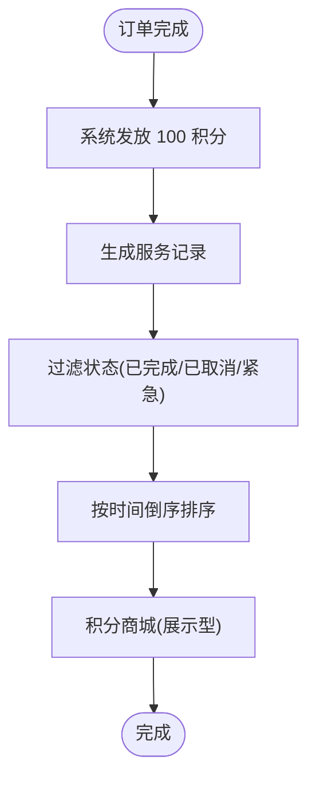

**图表来源**
- [volunteer-points/spec.md:3-25](file://openspec/changes/add-aidrun-ios-spring-mvp/specs/volunteer-points/spec.md#L3-L25)
- [07-api-contract.openapi.yaml:412-436](file://docs/07-api-contract.openapi.yaml#L412-L436)
- [07-api-contract.openapi.yaml:438-451](file://docs/07-api-contract.openapi.yaml#L438-L451)

**章节来源**
- [volunteer-points/spec.md:3-25](file://openspec/changes/add-aidrun-ios-spring-mvp/specs/volunteer-points/spec.md#L3-L25)
- [07-api-contract.openapi.yaml:412-436](file://docs/07-api-contract.openapi.yaml#L412-L436)
- [07-api-contract.openapi.yaml:438-451](file://docs/07-api-contract.openapi.yaml#L438-L451)

### 组件十：志愿者与跑者的交互与通信
- 状态轮询
  - 盲人端在等待、已接单、已到达、服务中页面每 5 秒轮询订单详情，观察状态变化并播报
  - 轮询优化：状态未变化时不重复播报语音
  - 网络异常：支持网络错误时的重试和错误提示
- 无障碍与语音
  - 主要页面提供"重复当前状态"按钮；危险操作（取消、紧急、完成、登出）需二次确认
  - 语音播报：所有关键状态变化都通过 TTS 服务播报
  - 交互界面：志愿者首页、订单详情页、服务中页面等关键界面
- 交互界面
  - 志愿者首页：可服务开关、可用订单列表、服务记录、积分中心
  - 订单详情页：到达、确认开始、完成、取消、紧急等操作按钮
  - 服务中页面：实时状态面板、距离显示、紧急求助按钮
  - 设置页面：角色切换、个人资料、关于信息等

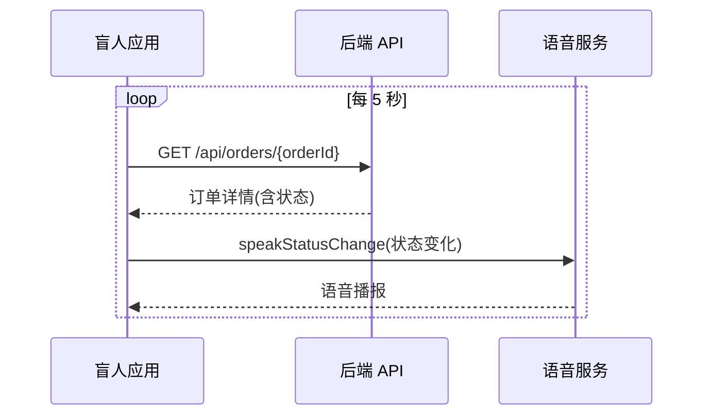

**图表来源**
- [03-user-stories.md:655-667](file://docs/03-user-stories.md#L655-L667)
- [08-ios-architecture.md:140-146](file://docs/08-ios-architecture.md#L140-L146)
- [SpeechService.swift:32-47](file://blindRun/Voice/SpeechService.swift#L32-L47)

**章节来源**
- [03-user-stories.md:655-667](file://docs/03-user-stories.md#L655-L667)
- [08-ios-architecture.md:140-146](file://docs/08-ios-architecture.md#L140-L146)
- [SpeechService.swift:32-47](file://blindRun/Voice/SpeechService.swift#L32-L47)

## 依赖关系分析
- 模块耦合
  - 志愿者模块依赖认证模块（JWT 令牌）、地图模块（距离计算）、语音模块（TTS）、注册模块（三步流程）
  - 订单模块与志愿者模块强耦合，涉及接单、状态推进与轮询
  - 认证模块与资料模块紧密关联，认证状态影响志愿者功能的可用性
  - 紧急事件模块独立于订单模块，提供事件记录和审计功能
  - 注册模块与志愿者模块紧密关联，提供完整的认证流程
- 外部依赖
  - 高德地图 SDK 用于定位与距离计算
  - AVSpeechSynthesizer 用于语音播报
  - SFSpeechRecognizer 用于语音输入
  - Spring Data JPA 用于紧急事件数据持久化
  - URLSession 作为网络栈，统一 APIClient 接口
- 接口契约
  - 所有受保护接口使用 Bearer JWT；错误码统一映射为用户可理解的消息
  - 紧急事件接口提供标准的数据传输格式
  - 注册流程提供完整的API接口规范

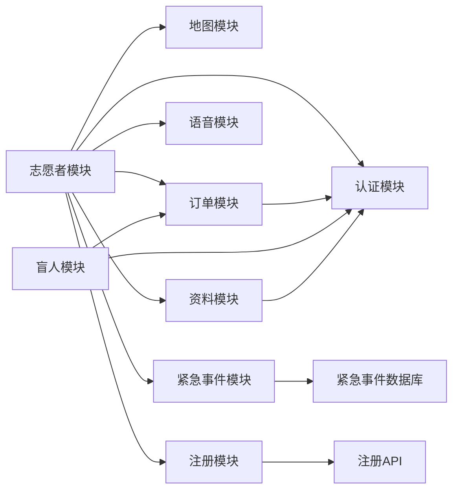

**图表来源**
- [08-ios-architecture.md:18-31](file://docs/08-ios-architecture.md#L18-L31)
- [07-api-contract.openapi.yaml:16-24](file://docs/07-api-contract.openapi.yaml#L16-L24)

**章节来源**
- [08-ios-architecture.md:18-31](file://docs/08-ios-architecture.md#L18-L31)
- [07-api-contract.openapi.yaml:16-24](file://docs/07-api-contract.openapi.yaml#L16-L24)

## 性能考虑
- 轮询频率与节流
  - 盲人端每 5 秒轮询一次，建议在后台或页面不可见时降低频率或停止轮询
  - 语音播报避免重复，使用 lastSpokenStatus 缓存避免轮询时的重复播报
- 网络重试
  - MVP 不引入复杂离线队列，简单重试即可；避免频繁重试造成抖动
- 地图与定位
  - 距离计算在客户端进行，建议缓存最近 N 个订单的距离结果，减少重复计算
  - 当定位权限未授权时，降级显示"距离不可用"，避免不必要的计算
  - 地图标注优化：批量更新标注，避免频繁添加删除操作
- 并发与锁
  - 接单请求幂等性设计：同一志愿者对同一订单的重复接单应被后端拒绝，避免前端锁竞争
  - 紧急事件的原子性：使用数据库事务确保事件记录的完整性
- 认证状态缓存
  - 建议在客户端缓存认证状态，减少重复认证检查的网络开销
- 语音服务优化
  - 使用单一 AVSpeechSynthesizer 实例，避免资源浪费
  - 语音播报队列化，避免同时播放多个语音造成混乱
  - 语音输入优化：合理设置超时时间，避免资源占用过久
- 注册流程优化
  - 分步提交：将复杂的注册流程分解为多个简单步骤
  - 数据验证：在客户端进行基本验证，减少无效请求
  - 状态管理：清晰的状态指示，提升用户体验

## 故障排查指南
- 接单失败常见原因
  - 未认证：返回 VOLUNTEER_NOT_APPROVED
  - 未开启可服务：返回 VOLUNTEER_NOT_AVAILABLE
  - 订单非 matching：返回 INVALID_ORDER_STATUS 或 ORDER_ALREADY_ACCEPTED
  - 定位权限未授权：无法进行智能排序，显示"距离不可用"
- Mock 认证问题
  - 未创建资料：返回 PROFILE_INCOMPLETE
  - 重复认证：支持幂等调用，不会产生副作用
  - 无认证令牌：返回 401 Unauthorized
- 可服务开关问题
  - 未认证状态尝试开启：返回 VOLUNTEER_NOT_APPROVED
  - 请求参数无效：返回 VALIDATION_FAILED
  - 重复开关：支持幂等调用，状态不变
- 注册流程问题
  - 步骤1失败：检查必填字段和格式验证
  - 步骤2失败：检查图片格式和大小限制
  - 步骤3失败：检查人脸识别算法和光线条件
  - 培训课程问题：检查课程ID和进度提交格式
- 紧急事件相关问题
  - 紧急事件重复触发：系统会记录新的紧急事件，不影响现有订单状态
  - 事件查询失败：检查数据库连接和紧急事件表结构
  - 语音播报异常：检查 AVSpeechSynthesizer 状态和系统语音设置
- 地图功能问题
  - API Key未配置：检查配置文件和构建设置
  - 地图加载失败：检查网络连接和SDK初始化状态
  - 标注显示异常：检查标注数据格式和地图视图状态
- 语音输入问题
  - 识别失败：检查麦克风权限和系统语言设置
  - 超时问题：调整静音检测和最大时长参数
  - 错误处理：提供清晰的错误提示和替代输入方式
- 取消与紧急
  - 仅 matching/accepted/arrived 可普通取消；in_progress 只能紧急求助
  - 紧急触发后，到达/确认开始/完成/取消均被拒绝
  - 紧急事件记录：系统自动记录触发角色、前一个状态和备注
- 超时取消
  - matching 订单在预约前 30 分钟无人接单将自动取消，原因 no_volunteer_available
- 轮询异常
  - 若长时间无状态更新，检查网络与令牌有效性；确认页面处于活跃状态
  - 语音播报异常：检查系统语音设置和应用权限

**章节来源**
- [07-api-contract.openapi.yaml:256-287](file://docs/07-api-contract.openapi.yaml#L256-L287)
- [order-status-lifecycle/spec.md:31-49](file://openspec/changes/add-aidrun-ios-spring-mvp/specs/order-status-lifecycle/spec.md#L31-L49)
- [03-user-stories.md:687-700](file://docs/03-user-stories.md#L687-L700)
- [VolunteerControllerIntegrationTest.java:58-103](file://backend/src/test/java/com/aidrun/backend/volunteer/VolunteerControllerIntegrationTest.java#L58-L103)
- [VolunteerControllerIntegrationTest.java:107-155](file://backend/src/test/java/com/aidrun/backend/volunteer/VolunteerControllerIntegrationTest.java#L107-L155)
- [EmergencyEvent.java:14-58](file://backend/src/main/java/com/aidrun/backend/order/EmergencyEvent.java#L14-L58)
- [SpeechService.swift:32-47](file://blindRun/Voice/SpeechService.swift#L32-L47)
- [SpeechInputService.swift:48-79](file://blindRun/Voice/SpeechInputService.swift#L48-L79)

## 结论
志愿者功能模块经过全面重构，现已支持完整的三步注册流程、五阶段订单状态转换、增强的语音辅助功能和优化的地图集成。新架构以清晰的认证与权限控制为基础，结合智能位置排序与紧急事件处理机制，提供完整可靠的订单管理流程。通过基于距离的智能排序算法，志愿者可以快速找到最近的可接订单；五阶段状态转换确保了服务流程的完整性和可控性；增强的语音辅助功能提升了无障碍体验；优化的地图集成为志愿者提供了更好的导航支持。新增的紧急事件数据库架构和语音服务进一步完善了志愿者生态系统的完整性，通过完善的事件追踪和语音提示，确保了功能的安全性和用户体验。整体设计符合 MVP 阶段的约束与目标，为后续功能扩展奠定了坚实基础。

## 附录
- 订单状态机（完整版）
  - PENDING_MATCH → PENDING_ACCEPT → DRIVER_EN_ROUTE → DRIVER_ARRIVED → IN_PROGRESS → COMPLETED
  - 任一环节可触发 emergency，进入异常终态
  - 紧急事件记录：每个紧急事件对应唯一订单，记录触发角色和前一个状态
- 认证状态枚举
  - VerificationStatus：not_submitted → pending → approved → rejected
  - AdminReviewStatus：not_submitted → pending → approved → rejected
- 紧急事件触发角色
  - 志愿者：志愿者主动触发紧急状态
  - 盲人跑者：跑者主动触发紧急状态
  - 管理员：管理员介入处理紧急情况
- 注册流程状态
  - STEP1：基本信息收集完成
  - STEP2：身份验证完成
  - STEP3：人脸验证完成
  - TRAINING：培训课程完成
  - APPROVED：认证通过

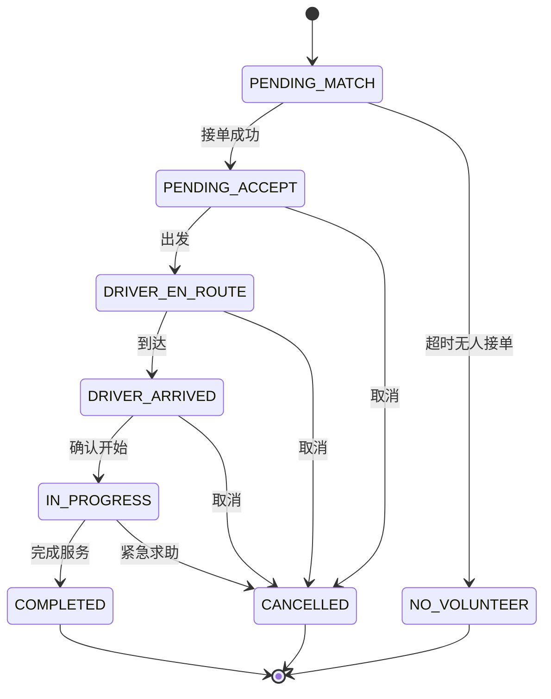

**图表来源**
- [04-user-flows-and-state-machine.md:72-96](file://docs/04-user-flows-and-state-machine.md#L72-L96)

**章节来源**
- [04-user-flows-and-state-machine.md:72-96](file://docs/04-user-flows-and-state-machine.md#L72-L96)