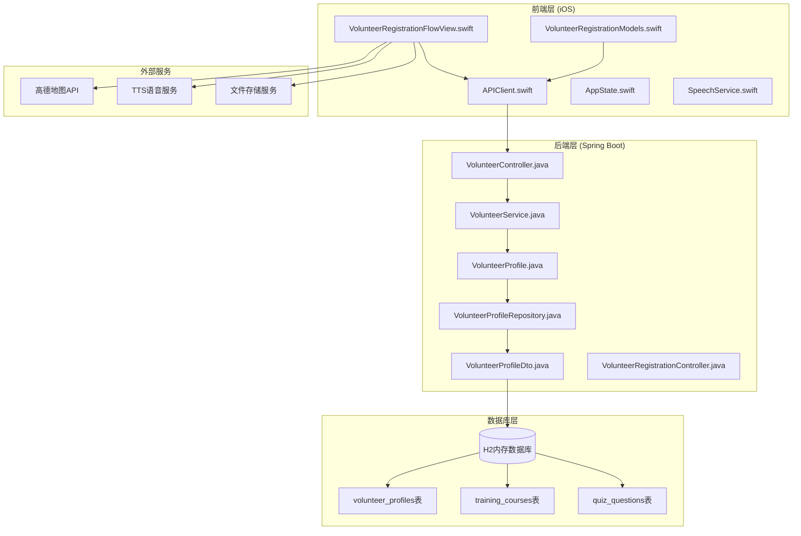
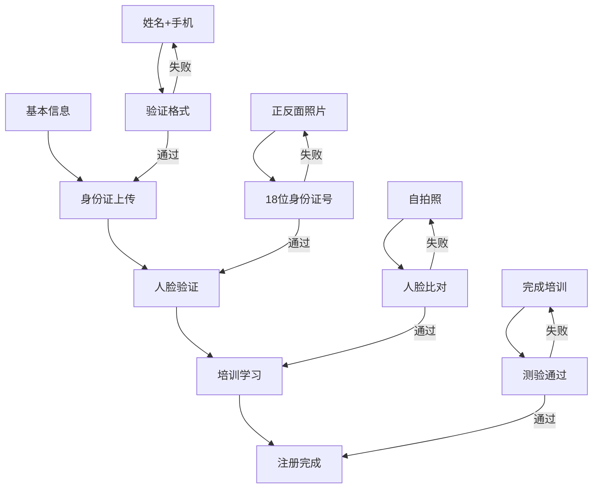
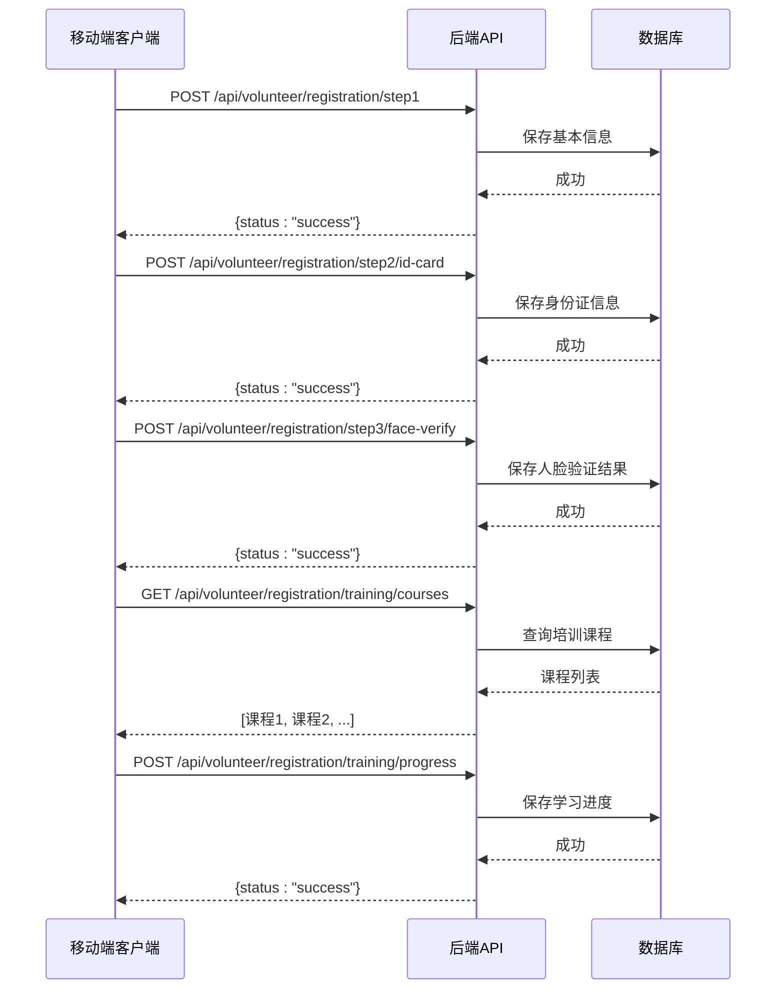
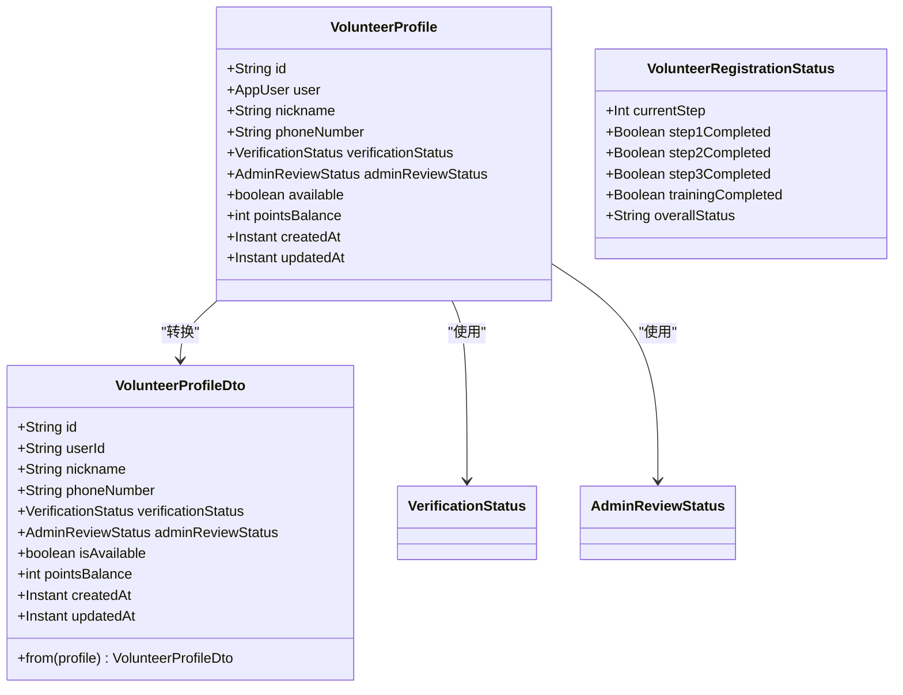
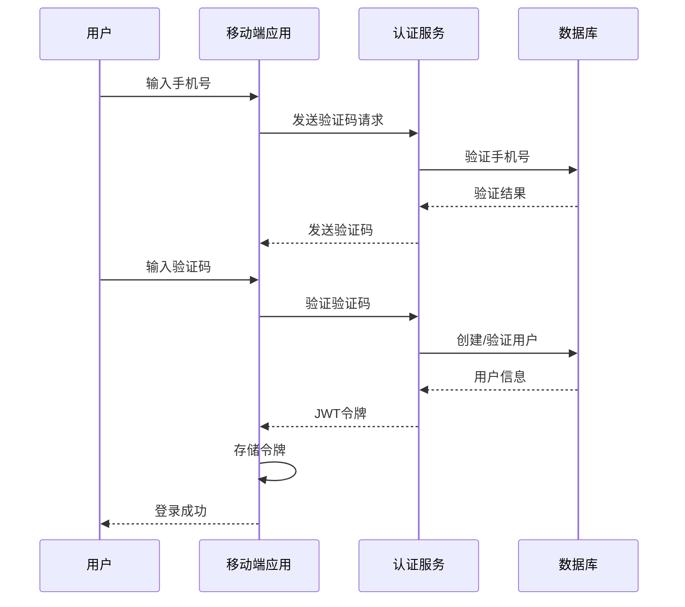

# 志愿者注册系统

<cite>
**本文档引用的文件**
- [VolunteerRegistrationFlowView.swift](file://blindRun/Volunteer/VolunteerRegistrationFlowView.swift)
- [VolunteerRegistrationModels.swift](file://blindRun/Core/Models/VolunteerRegistrationModels.swift)
- [VolunteerController.java](file://backend/src/main/java/com/aidrun/backend/volunteer/VolunteerController.java)
- [VolunteerService.java](file://backend/src/main/java/com/aidrun/backend/volunteer/VolunteerService.java)
- [VolunteerProfile.java](file://backend/src/main/java/com/aidrun/backend/profile/VolunteerProfile.java)
- [VolunteerProfileRepository.java](file://backend/src/main/java/com/aidrun/backend/profile/VolunteerProfileRepository.java)
- [VolunteerProfileDto.java](file://backend/src/main/java/com/aidrun/backend/profile/dto/VolunteerProfileDto.java)
- [api_spec.yaml](file://docs/api_spec.yaml)
- [test-accounts.md](file://docs/test-accounts.md)
- [03-user-stories.md](file://docs/03-user-stories.md)
- [04-user-flows-and-state-machine.md](file://docs/04-user-flows-and-state-machine.md)
</cite>

## 更新摘要
**所做更改**
- 更新了志愿者注册流程，从简单流程升级为四步注册流程（基本信息→身份证上传→人脸验证→培训学习）
- 新增了身份验证、人脸识别、培训课程和进度管理的详细说明
- 更新了API接口设计，包含了完整的四步注册流程API
- 增强了前端实现细节，包括步骤指示器和语音反馈
- 完善了后端服务架构，支持完整的注册状态管理和培训认证

## 目录
1. [项目概述](#项目概述)
2. [系统架构](#系统架构)
3. [核心组件分析](#核心组件分析)
4. [志愿者注册流程](#志愿者注册流程)
5. [API接口设计](#api接口设计)
6. [数据模型](#数据模型)
7. [前端实现](#前端实现)
8. [后端服务](#后端服务)
9. [安全与认证](#安全与认证)
10. [性能考虑](#性能考虑)
11. [故障排除指南](#故障排除指南)
12. [总结](#总结)

## 项目概述

志愿者注册系统是一个专为盲人跑者和志愿者服务设计的移动应用，旨在提供无障碍的志愿者招募和管理系统。该系统采用iOS Swift开发前端界面，Spring Boot构建后端服务，实现了完整的志愿者注册认证流程。

### 系统特性

- **无障碍设计**：完全支持VoiceOver和TTS语音播报
- **多角色支持**：盲人跑者和志愿者双角色系统
- **实时状态同步**：订单状态实时更新和轮询机制
- **安全认证**：基于JWT的手机号验证码登录系统
- **培训认证**：完整的志愿者培训和认证流程
- **四步注册流程**：从基本信息到培训完成的完整认证链路

## 系统架构

**图表来源**
- [VolunteerRegistrationFlowView.swift:1-538](file://blindRun/Volunteer/VolunteerRegistrationFlowView.swift#L1-L538)
- [VolunteerController.java:1-42](file://backend/src/main/java/com/aidrun/backend/volunteer/VolunteerController.java#L1-L42)
- [VolunteerService.java:1-100](file://backend/src/main/java/com/aidrun/backend/volunteer/VolunteerService.java#L1-L100)

## 核心组件分析

### 前端组件

系统前端采用SwiftUI框架构建，主要包含以下核心组件：

#### 注册流程视图
- **VolunteerRegistrationFlowView**：实现完整的志愿者注册流程
- **VolunteerRegistrationViewModel**：管理注册状态和业务逻辑
- **RegistrationStep枚举**：定义四个注册步骤的状态管理

#### 数据模型
- **VolunteerRegistrationStatus**：注册状态数据结构
- **BasicInfoRequest**：基本信息提交模型
- **TrainingCourseResponse**：培训课程数据模型
- **QuizAnswerRequest/Response**：测验答题数据模型

**章节来源**
- [VolunteerRegistrationFlowView.swift:24-268](file://blindRun/Volunteer/VolunteerRegistrationFlowView.swift#L24-L268)
- [VolunteerRegistrationModels.swift:5-64](file://blindRun/Core/Models/VolunteerRegistrationModels.swift#L5-L64)

### 后端组件

#### 控制器层
- **VolunteerController**：处理志愿者相关的HTTP请求
- **API端点**：提供注册、认证、状态查询等功能

#### 服务层
- **VolunteerService**：实现业务逻辑和数据验证
- **Mock认证**：提供演示用的认证功能

#### 数据访问层
- **VolunteerProfileRepository**：JPA数据访问接口
- **VolunteerProfile实体**：数据库映射模型

**章节来源**
- [VolunteerController.java:15-41](file://backend/src/main/java/com/aidrun/backend/volunteer/VolunteerController.java#L15-L41)
- [VolunteerService.java:15-99](file://backend/src/main/java/com/aidrun/backend/volunteer/VolunteerService.java#L15-L99)

## 志愿者注册流程

### 四步注册流程

**图表来源**
- [VolunteerRegistrationFlowView.swift:6-20](file://blindRun/Volunteer/VolunteerRegistrationFlowView.swift#L6-L20)
- [VolunteerRegistrationFlowView.swift:106-267](file://blindRun/Volunteer/VolunteerRegistrationFlowView.swift#L106-L267)

### 详细流程说明

#### 第一步：基本信息收集
- 收集真实姓名、手机号、跑步经验
- 验证手机号格式（11位中国大陆号码）
- 支持是否有陪跑经验的选择
- 急救经验可选填写

#### 第二步：身份证认证
- 上传身份证正反面照片
- 输入身份证姓名和18位身份证号码
- 文件类型限制为JPEG格式
- 实时验证文件完整性

#### 第三步：人脸验证
- 拍摄正面自拍照
- 与身份证信息进行人脸比对
- 支持活体检测验证
- 多角度拍摄确保识别准确

#### 第四步：培训学习
- 下载培训课程视频
- 完成学习进度跟踪
- 通过在线测验评估
- 获得培训完成证书

**章节来源**
- [VolunteerRegistrationFlowView.swift:104-267](file://blindRun/Volunteer/VolunteerRegistrationFlowView.swift#L104-L267)
- [VolunteerRegistrationModels.swift:16-64](file://blindRun/Core/Models/VolunteerRegistrationModels.swift#L16-L64)

## API接口设计

### 注册相关API

**图表来源**
- [api_spec.yaml:533-532](file://docs/api_spec.yaml#L533-L532)
- [api_spec.yaml:487-532](file://docs/api_spec.yaml#L487-L532)
- [api_spec.yaml:461-486](file://docs/api_spec.yaml#L461-L486)

### 认证相关API

#### Mock认证接口
- **路径**：`/api/volunteer/mock-verification/approve`
- **方法**：`POST`
- **功能**：模拟认证批准，跳过实际验证流程
- **用途**：开发和测试环境使用

#### 配置文件认证
- **路径**：`/api/volunteer/profile`
- **方法**：`PUT`
- **功能**：更新志愿者配置信息
- **参数**：昵称、可用状态等

**章节来源**
- [VolunteerController.java:25-40](file://backend/src/main/java/com/aidrun/backend/volunteer/VolunteerController.java#L25-L40)
- [VolunteerService.java:24-72](file://backend/src/main/java/com/aidrun/backend/volunteer/VolunteerService.java#L24-L72)

## 数据模型

### 核心数据结构

**图表来源**
- [VolunteerProfile.java:14-111](file://backend/src/main/java/com/aidrun/backend/profile/VolunteerProfile.java#L14-L111)
- [VolunteerProfileDto.java:8-38](file://backend/src/main/java/com/aidrun/backend/profile/dto/VolunteerProfileDto.java#L8-L38)
- [VolunteerRegistrationModels.swift:5-12](file://blindRun/Core/Models/VolunteerRegistrationModels.swift#L5-L12)

### 状态枚举

#### 验证状态
- **NOT_SUBMITTED**：未提交
- **PENDING**：审核中
- **APPROVED**：已批准
- **REJECTED**：已拒绝

#### 管理审核状态
- **NOT_SUBMITTED**：未提交
- **PENDING**：待审核
- **APPROVED**：已审核
- **REJECTED**：已拒绝

**章节来源**
- [VerificationStatus.java:6-32](file://backend/src/main/java/com/aidrun/backend/profile/VerificationStatus.java#L6-L32)
- [AdminReviewStatus.java:6-32](file://backend/src/main/java/com/aidrun/backend/profile/AdminReviewStatus.java#L6-L32)

## 前端实现

### 注册视图组件

#### 步骤指示器
- **视觉设计**：圆形步骤标记和标题
- **状态显示**：已完成、当前、未完成步骤的视觉区分
- **无障碍支持**：完整的VoiceOver标签和状态描述

#### 表单字段验证
- **实时验证**：输入时即时验证格式
- **错误提示**：清晰的错误消息和视觉反馈
- **禁用状态**：根据验证结果动态启用/禁用提交按钮

#### 文件上传处理
- **照片选择**：集成系统相册和相机
- **预览功能**：上传前的照片预览
- **格式验证**：自动检查文件类型和大小

**章节来源**
- [VolunteerRegistrationFlowView.swift:317-421](file://blindRun/Volunteer/VolunteerRegistrationFlowView.swift#L317-L421)
- [VolunteerRegistrationFlowView.swift:467-501](file://blindRun/Volunteer/VolunteerRegistrationFlowView.swift#L467-L501)

### 状态管理

#### ViewModel设计
- **@Published属性**：响应式状态更新
- **计算属性**：基于输入数据的验证逻辑
- **异步操作**：网络请求的并发处理

#### 语音反馈
- **TTS集成**：关键操作的语音播报
- **错误提示**：失败操作的语音通知
- **进度反馈**：注册流程的语音指导

**章节来源**
- [VolunteerRegistrationFlowView.swift:24-76](file://blindRun/Volunteer/VolunteerRegistrationFlowView.swift#L24-L76)
- [VolunteerRegistrationFlowView.swift:123-201](file://blindRun/Volunteer/VolunteerRegistrationFlowView.swift#L123-L201)

## 后端服务

### 业务逻辑实现

#### 认证服务
- **mockVerificationApprove**：模拟认证批准
- **updateVolunteerProfile**：更新志愿者配置
- **validateVolunteerCanAcceptOrder**：接单前验证

#### 数据验证
- **Profile完整性检查**：确保志愿者资料完整
- **认证状态验证**：必须通过认证才能接单
- **可用性检查**：志愿者必须处于可用状态

**章节来源**
- [VolunteerService.java:24-98](file://backend/src/main/java/com/aidrun/backend/volunteer/VolunteerService.java#L24-L98)

### 数据持久化

#### 实体映射
- **一对一关联**：志愿者档案与用户账户关联
- **枚举类型**：状态字段的类型安全
- **时间戳**：自动记录创建和更新时间

#### 数据访问
- **JPA Repository**：简化数据库操作
- **事务管理**：确保数据一致性
- **查询优化**：基于用户ID的快速查找

**章节来源**
- [VolunteerProfile.java:14-111](file://backend/src/main/java/com/aidrun/backend/profile/VolunteerProfile.java#L14-L111)
- [VolunteerProfileRepository.java:7-10](file://backend/src/main/java/com/aidrun/backend/profile/VolunteerProfileRepository.java#L7-L10)

## 安全与认证

### JWT配置

系统使用JWT（JSON Web Token）进行用户认证和授权：

- **Issuer**：`aidrun-demo`
- **Secret Key**：`local-demo-secret-change-before-production`
- **Token有效期**：配置在application.yml中
- **安全头**：自动添加Authorization头

### 认证流程

**图表来源**
- [application.yml:30-34](file://backend/src/main/resources/application.yml#L30-L34)

**章节来源**
- [application.yml:1-34](file://backend/src/main/resources/application.yml#L1-L34)

## 性能考虑

### 前端性能优化

- **异步加载**：注册状态和课程数据的异步获取
- **缓存策略**：合理使用内存缓存减少重复请求
- **图片处理**：压缩上传的身份证和人脸照片
- **网络优化**：批量请求和错误重试机制

### 后端性能优化

- **数据库连接池**：配置合适的连接数
- **查询优化**：使用索引和优化查询语句
- **事务管理**：最小化事务持续时间
- **缓存机制**：热点数据的内存缓存

## 故障排除指南

### 常见问题及解决方案

#### 注册流程问题
- **步骤跳转异常**：检查注册状态API的调用
- **文件上传失败**：验证文件格式和大小限制
- **网络超时**：检查API服务器连接状态

#### 认证问题
- **Token失效**：实现自动刷新机制
- **权限错误**：检查JWT令牌的正确性
- **用户状态异常**：验证用户档案的完整性

#### 数据同步问题
- **状态不同步**：检查WebSocket连接状态
- **数据延迟**：实现适当的轮询间隔
- **并发冲突**：使用乐观锁解决

**章节来源**
- [VolunteerRegistrationFlowView.swift:97-101](file://blindRun/Volunteer/VolunteerRegistrationFlowView.swift#L97-L101)
- [VolunteerService.java:26-31](file://backend/src/main/java/com/aidrun/backend/volunteer/VolunteerService.java#L26-L31)

## 总结

志愿者注册系统是一个功能完整、设计合理的无障碍服务应用。系统采用现代化的技术栈，实现了以下关键特性：

### 技术优势
- **完整的技术栈**：iOS前端 + Spring Boot后端 + H2数据库
- **无障碍设计**：全面支持VoiceOver和TTS语音播报
- **实时同步**：订单状态的实时更新机制
- **安全认证**：基于JWT的安全认证体系
- **四步注册流程**：从基础信息到培训完成的完整认证链路

### 架构特点
- **模块化设计**：清晰的前后端分离架构
- **可扩展性**：易于添加新的功能模块
- **测试友好**：完整的单元测试和集成测试覆盖
- **文档完善**：详细的API文档和用户故事

### 未来发展方向
- **生产环境部署**：迁移到MySQL数据库和Nginx服务器
- **功能扩展**：增加积分系统、评价系统等功能
- **性能优化**：实现CDN加速和数据库优化
- **监控告警**：建立完整的系统监控和日志分析

该系统为盲人跑者和志愿者提供了高效、便捷的服务匹配平台，具有良好的用户体验和技术实现价值。