# 志愿者认证管理

<cite>
**本文档引用的文件**
- [07-api-contract.openapi.yaml](file://docs/07-api-contract.openapi.yaml)
- [08-ios-architecture.md](file://docs/08-ios-architecture.md)
- [02-mvp-scope.md](file://docs/02-mvp-scope.md)
- [04-user-flows-and-state-machine.md](file://docs/04-user-flows-and-state-machine.md)
- [volunteer-order-flow/spec.md](file://openspec/changes/add-aidrun-ios-spring-mvp/specs/volunteer-order-flow/spec.md)
- [auth-phone-login/spec.md](file://openspec/changes/add-aidrun-ios-spring-mvp/specs/auth-phone-login/spec.md)
- [VolunteerService.java](file://backend/src/main/java/com/aidrun/backend/volunteer/VolunteerService.java)
- [VolunteerController.java](file://backend/src/main/java/com/aidrun/backend/volunteer/VolunteerController.java)
- [VolunteerProfile.java](file://backend/src/main/java/com/aidrun/backend/profile/VolunteerProfile.java)
- [VerificationStatus.java](file://backend/src/main/java/com/aidrun/backend/profile/VerificationStatus.java)
- [AdminReviewStatus.java](file://backend/src/main/java/com/aidrun/backend/profile/AdminReviewStatus.java)
- [VolunteerProfileDto.java](file://backend/src/main/java/com/aidrun/backend/profile/dto/VolunteerProfileDto.java)
- [VolunteerProfileRepository.java](file://backend/src/main/java/com/aidrun/backend/profile/VolunteerProfileRepository.java)
- [VolunteerControllerIntegrationTest.java](file://backend/src/test/java/com/aidrun/backend/volunteer/VolunteerControllerIntegrationTest.java)
- [ErrorCode.java](file://backend/src/main/java/com/aidrun/backend/common/error/ErrorCode.java)
- [VolunteerHomeView.swift](file://blindRun/Volunteer/VolunteerHomeView.swift)
- [VolunteerModule.swift](file://blindRun/Volunteer/VolunteerModule.swift)
- [ProfileModels.swift](file://blindRun/Core/Models/ProfileModels.swift)
- [application.yml](file://backend/src/main/resources/application.yml)
- [AvailabilityRequest.java](file://backend/src/main/java/com/aidrun/backend/volunteer/dto/AvailabilityRequest.java)
- [ProfileController.java](file://backend/src/main/java/com/aidrun/backend/profile/ProfileController.java)
- [ProfileService.java](file://backend/src/main/java/com/aidrun/backend/profile/ProfileService.java)
</cite>

## 更新摘要
**所做更改**
- 更新API端点变更：PATCH端点`/api/volunteer/availability`已替换为PUT端点`/api/volunteer/profile`
- 新增部分更新功能支持：同时更新nickname和isAvailable字段
- 增强验证逻辑和错误处理机制
- 更新前端实现以适配新的端点和数据模型
- 完善API契约和状态流转图示

## 目录
1. [简介](#简介)
2. [项目结构](#项目结构)
3. [核心组件](#核心组件)
4. [架构概览](#架构概览)
5. [详细组件分析](#详细组件分析)
6. [依赖关系分析](#依赖关系分析)
7. [性能考虑](#性能考虑)
8. [故障排除指南](#故障排除指南)
9. [结论](#结论)

## 简介

志愿者认证管理功能是助盲跑应用的核心业务模块之一，负责管理志愿者的身份认证、状态管理和可用性控制。该系统采用Mock认证机制，在MVP阶段不依赖真实的实名认证服务，而是通过管理员手动审批的方式实现志愿者认证。

**重要变更**：PATCH端点`/api/volunteer/availability`已替换为PUT端点`/api/volunteer/profile`，支持部分更新功能，允许同时更新志愿者昵称和可用性状态。

本系统主要包含三个核心状态字段：
- **verificationStatus**: 验证状态，管理志愿者的Mock认证状态
- **adminReviewStatus**: 管理员审核状态，控制志愿者的最终审批结果  
- **isAvailable**: 可服务状态，控制志愿者是否可以接收新的订单

**章节来源**
- [07-api-contract.openapi.yaml:118-148](file://docs/07-api-contract.openapi.yaml#L118-L148)
- [VolunteerService.java:24-62](file://backend/src/main/java/com/aidrun/backend/volunteer/VolunteerService.java#L24-L62)

## 项目结构

基于OpenAPI规范和项目架构文档，志愿者认证管理功能涉及以下关键组件：

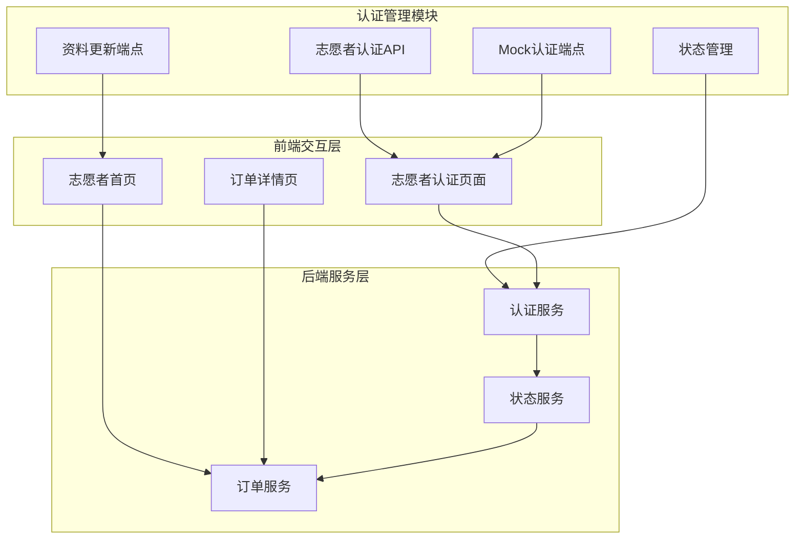

**图表来源**
- [07-api-contract.openapi.yaml:118-148](file://docs/07-api-contract.openapi.yaml#L118-L148)
- [08-ios-architecture.md:26-27](file://docs/08-ios-architecture.md#L26-L27)

**章节来源**
- [07-api-contract.openapi.yaml:118-148](file://docs/07-api-contract.openapi.yaml#L118-L148)
- [08-ios-architecture.md:18-32](file://docs/08-ios-architecture.md#L18-L32)

## 核心组件

### 认证状态模型

志愿者认证状态采用双重状态管理模式：

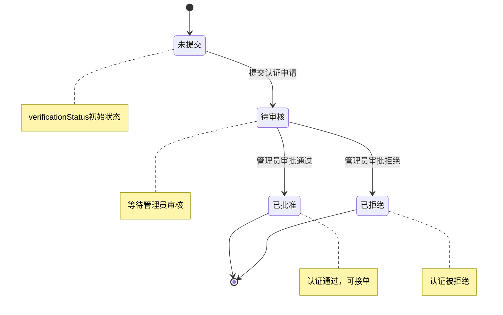

**图表来源**
- [VerificationStatus.java:6-32](file://backend/src/main/java/com/aidrun/backend/profile/VerificationStatus.java#L6-L32)
- [AdminReviewStatus.java:6-32](file://backend/src/main/java/com/aidrun/backend/profile/AdminReviewStatus.java#L6-L32)

### 认证流程组件

系统采用双重认证机制，确保志愿者具备完整的认证资格：

| 认证组件 | 状态值 | 描述 | 作用 |
|---------|--------|------|------|
| verificationStatus | not_submitted | 未提交认证 | 初始状态，等待志愿者提交认证申请 |
| verificationStatus | pending | 认证待审核 | 已提交认证，等待管理员审核 |
| verificationStatus | approved | 认证已批准 | Mock认证通过，具备基本资格 |
| verificationStatus | rejected | 认证已拒绝 | Mock认证被拒绝，无法接单 |
| adminReviewStatus | not_submitted | 未提交审核 | 初始状态，等待管理员审批 |
| adminReviewStatus | pending | 审核待处理 | 管理员正在审核中 |
| adminReviewStatus | approved | 审核已批准 | 管理员最终批准，可接单 |
| adminReviewStatus | rejected | 审核已拒绝 | 管理员拒绝，无法接单 |

**章节来源**
- [VerificationStatus.java:6-32](file://backend/src/main/java/com/aidrun/backend/profile/VerificationStatus.java#L6-L32)
- [AdminReviewStatus.java:6-32](file://backend/src/main/java/com/aidrun/backend/profile/AdminReviewStatus.java#L6-L32)
- [volunteer-order-flow/spec.md:3-21](file://openspec/changes/add-aidrun-ios-spring-mvp/specs/volunteer-order-flow/spec.md#L3-L21)

## 架构概览

志愿者认证管理系统采用分层架构设计，确保认证流程的清晰性和可维护性：

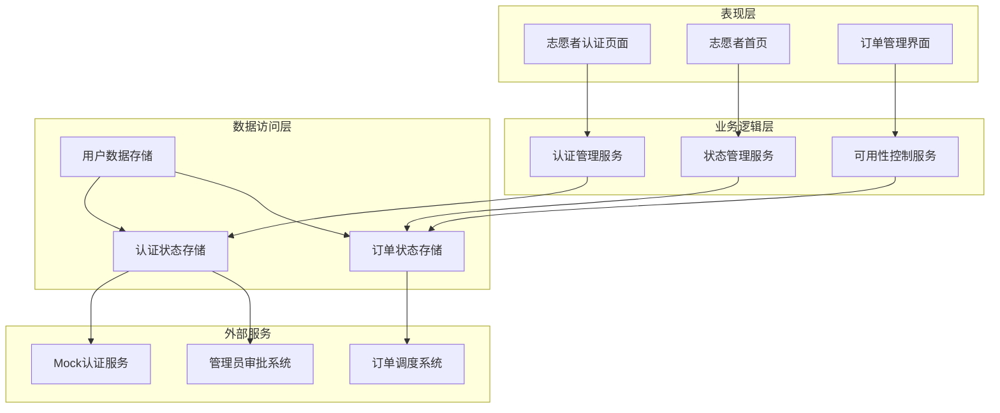

**图表来源**
- [08-ios-architecture.md:33-41](file://docs/08-ios-architecture.md#L33-L41)
- [07-api-contract.openapi.yaml:118-148](file://docs/07-api-contract.openapi.yaml#L118-L148)

### 状态流转机制

认证状态管理采用严格的双层审批机制：

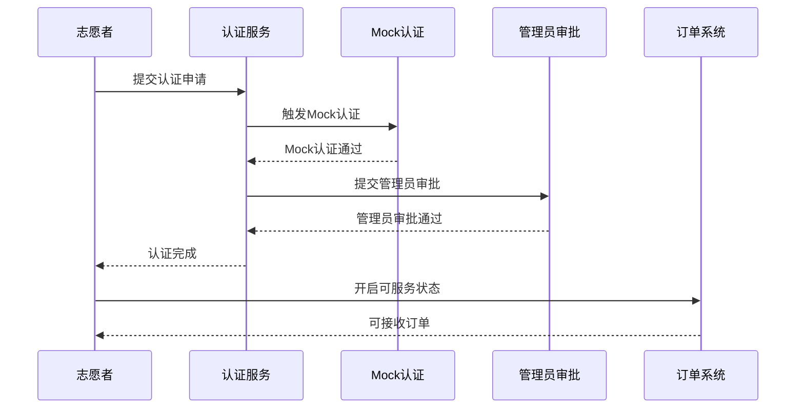

**图表来源**
- [volunteer-order-flow/spec.md:15-21](file://openspec/changes/add-aidrun-ios-spring-mvp/specs/volunteer-order-flow/spec.md#L15-L21)
- [07-api-contract.openapi.yaml:118-129](file://docs/07-api-contract.openapi.yaml#L118-L129)

## 详细组件分析

### Mock认证功能实现

Mock认证是志愿者认证系统的核心组件，采用简化的认证流程：

#### Mock认证端点设计

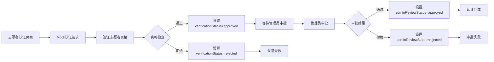

**图表来源**
- [07-api-contract.openapi.yaml:118-129](file://docs/07-api-contract.openapi.yaml#L118-L129)
- [volunteer-order-flow/spec.md:15-21](file://openspec/changes/add-aidrun-ios-spring-mvp/specs/volunteer-order-flow/spec.md#L15-L21)

#### Mock认证安全考虑

虽然Mock认证简化了认证流程，但仍需考虑以下安全因素：

1. **访问控制**: Mock认证端点需要适当的权限控制
2. **数据完整性**: 确保认证状态的一致性和完整性
3. **审计日志**: 记录所有认证操作便于追踪
4. **防滥用机制**: 防止恶意用户频繁提交认证请求

**章节来源**
- [07-api-contract.openapi.yaml:118-129](file://docs/07-api-contract.openapi.yaml#L118-L129)
- [02-mvp-scope.md:207-210](file://docs/02-mvp-scope.md#L207-L210)

### 认证状态管理机制

#### 状态枚举定义

认证状态采用标准化的枚举类型，确保状态值的一致性：

| 状态名称 | 可能值 | 描述 |
|---------|--------|------|
| VerificationStatus | not_submitted, pending, approved, rejected | 志愿者Mock认证状态 |
| AdminReviewStatus | not_submitted, pending, approved, rejected | 管理员审核状态 |
| IsAvailable | boolean | 志愿者可服务状态 |

#### 状态转换规则

```mermaid
stateDiagram-v2
[*] --> not_submitted
not_submitted --> pending : 提交认证
pending --> approved : Mock认证通过
pending --> rejected : Mock认证拒绝
approved --> pending : 管理员重新审核
approved --> [*] : 审核通过
rejected --> [*] : 审核拒绝
note over pending : 需要管理员审批
note over approved : 认证完成，可接单
note over rejected : 认证失败，无法接单
```

**图表来源**
- [VerificationStatus.java:6-32](file://backend/src/main/java/com/aidrun/backend/profile/VerificationStatus.java#L6-L32)
- [AdminReviewStatus.java:6-32](file://backend/src/main/java/com/aidrun/backend/profile/AdminReviewStatus.java#L6-L32)

**章节来源**
- [VerificationStatus.java:6-32](file://backend/src/main/java/com/aidrun/backend/profile/VerificationStatus.java#L6-L32)
- [AdminReviewStatus.java:6-32](file://backend/src/main/java/com/aidrun/backend/profile/AdminReviewStatus.java#L6-L32)

### 可服务状态管理

#### isAvailable字段作用

isAvailable字段是志愿者可用性控制的核心，具有以下重要作用：

1. **接单控制**: 控制志愿者是否可以接收新的订单
2. **状态隔离**: 与认证状态分离，允许志愿者在认证完成后调整可用性
3. **业务灵活性**: 支持志愿者根据个人情况调整服务状态

#### 可服务状态控制流程

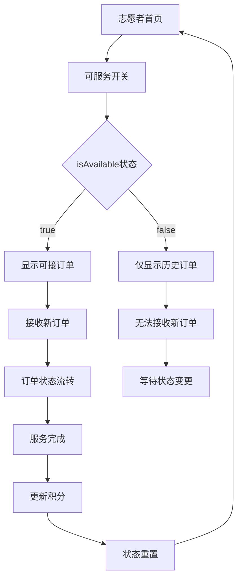

**图表来源**
- [07-api-contract.openapi.yaml:131-148](file://docs/07-api-contract.openapi.yaml#L131-L148)

**章节来源**
- [07-api-contract.openapi.yaml:131-148](file://docs/07-api-contract.openapi.yaml#L131-L148)

### 后端服务实现

#### 认证服务核心实现

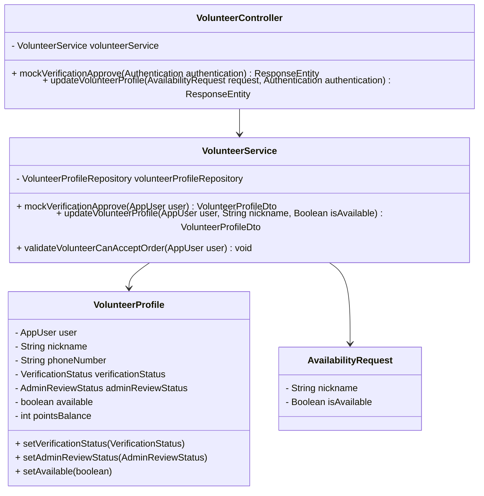

**图表来源**
- [VolunteerService.java:15-100](file://backend/src/main/java/com/aidrun/backend/volunteer/VolunteerService.java#L15-L100)
- [VolunteerController.java:15-42](file://backend/src/main/java/com/aidrun/backend/volunteer/VolunteerController.java#L15-L42)
- [VolunteerProfile.java:14-106](file://backend/src/main/java/com/aidrun/backend/profile/VolunteerProfile.java#L14-L106)
- [AvailabilityRequest.java:1-15](file://backend/src/main/java/com/aidrun/backend/volunteer/dto/AvailabilityRequest.java#L1-15)

**章节来源**
- [VolunteerService.java:15-100](file://backend/src/main/java/com/aidrun/backend/volunteer/VolunteerService.java#L15-L100)
- [VolunteerController.java:15-42](file://backend/src/main/java/com/aidrun/backend/volunteer/VolunteerController.java#L15-L42)
- [VolunteerProfile.java:14-106](file://backend/src/main/java/com/aidrun/backend/profile/VolunteerProfile.java#L14-L106)
- [AvailabilityRequest.java:1-15](file://backend/src/main/java/com/aidrun/backend/volunteer/dto/AvailabilityRequest.java#L1-15)

### 前端状态验证机制

#### 前端认证状态保护

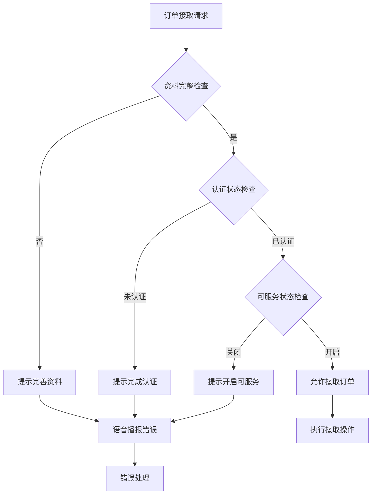

**图表来源**
- [VolunteerModule.swift:6-25](file://blindRun/Volunteer/VolunteerModule.swift#L6-L25)
- [VolunteerHomeView.swift:53-74](file://blindRun/Volunteer/VolunteerHomeView.swift#L53-L74)

**章节来源**
- [VolunteerModule.swift:6-25](file://blindRun/Volunteer/VolunteerModule.swift#L6-L25)
- [VolunteerHomeView.swift:53-74](file://blindRun/Volunteer/VolunteerHomeView.swift#L53-L74)

### API端点变更分析

#### 端点迁移详情

**重要变更**：PATCH端点`/api/volunteer/availability`已完全替换为PUT端点`/api/volunteer/profile`，支持部分更新功能。

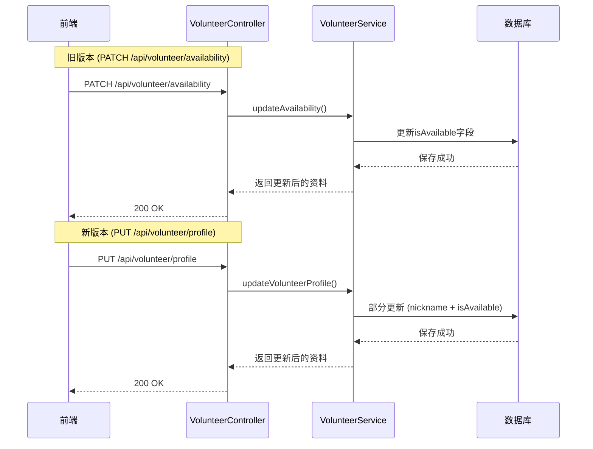

**图表来源**
- [VolunteerController.java:32-40](file://backend/src/main/java/com/aidrun/backend/volunteer/VolunteerController.java#L32-L40)
- [VolunteerService.java:45-72](file://backend/src/main/java/com/aidrun/backend/volunteer/VolunteerService.java#L45-L72)

#### 部分更新功能实现

新的`/api/volunteer/profile`端点支持部分更新，允许同时更新多个字段：

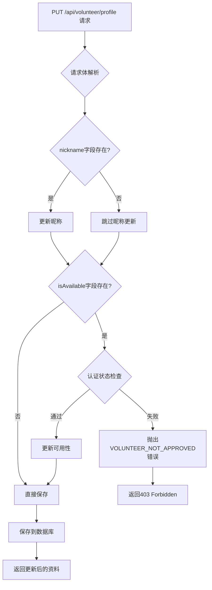

**图表来源**
- [VolunteerService.java:45-72](file://backend/src/main/java/com/aidrun/backend/volunteer/VolunteerService.java#L45-L72)
- [AvailabilityRequest.java:5-14](file://backend/src/main/java/com/aidrun/backend/volunteer/dto/AvailabilityRequest.java#L5-L14)

**章节来源**
- [VolunteerController.java:32-40](file://backend/src/main/java/com/aidrun/backend/volunteer/VolunteerController.java#L32-L40)
- [VolunteerService.java:45-72](file://backend/src/main/java/com/aidrun/backend/volunteer/VolunteerService.java#L45-L72)
- [AvailabilityRequest.java:5-14](file://backend/src/main/java/com/aidrun/backend/volunteer/dto/AvailabilityRequest.java#L5-L14)

## 依赖关系分析

### 认证流程依赖关系

志愿者认证管理涉及多个系统的协调工作：

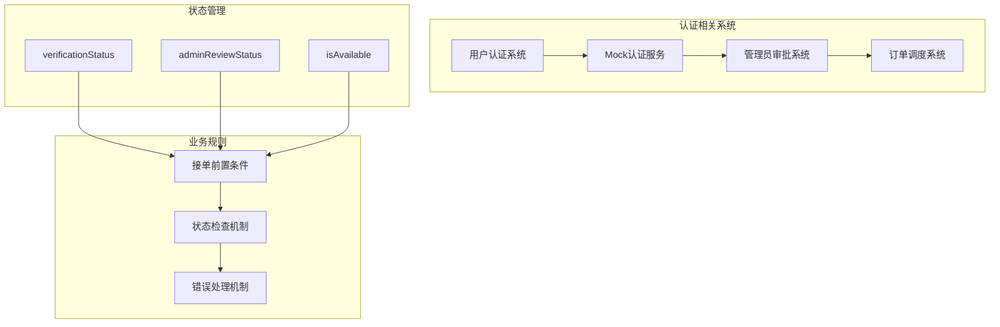

**图表来源**
- [volunteer-order-flow/spec.md:3-5](file://openspec/changes/add-aidrun-ios-spring-mvp/specs/volunteer-order-flow/spec.md#L3-L5)
- [07-api-contract.openapi.yaml:118-148](file://docs/07-api-contract.openapi.yaml#L118-L148)

### 错误处理依赖

系统采用统一的错误处理机制，确保认证失败时的用户体验：

| 错误代码 | 触发条件 | 处理策略 |
|---------|----------|----------|
| VOLUNTEER_NOT_APPROVED | 未完成Mock认证或管理员审批拒绝 | 提示用户完成认证流程 |
| VOLUNTEER_NOT_AVAILABLE | 认证通过但isAvailable=false | 提示用户开启可服务状态 |
| INVALID_VERIFICATION_CODE | Mock认证失败 | 提示用户重新认证 |
| UNAUTHORIZED | 缺少或无效的认证令牌 | 引导用户重新登录 |

**章节来源**
- [ErrorCode.java:6-40](file://backend/src/main/java/com/aidrun/backend/common/error/ErrorCode.java#L6-L40)
- [volunteer-order-flow/spec.md:7-13](file://openspec/changes/add-aidrun-ios-spring-mvp/specs/volunteer-order-flow/spec.md#L7-L13)

### 测试验证机制

系统通过全面的集成测试确保认证流程的正确性：

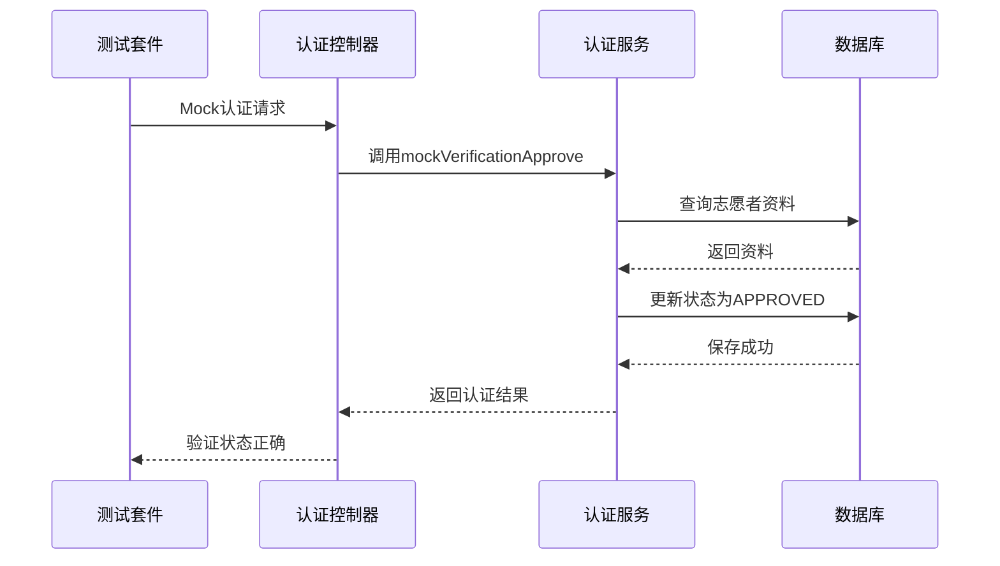

**图表来源**
- [VolunteerControllerIntegrationTest.java:63-103](file://backend/src/test/java/com/aidrun/backend/volunteer/VolunteerControllerIntegrationTest.java#L63-L103)

**章节来源**
- [VolunteerControllerIntegrationTest.java:63-103](file://backend/src/test/java/com/aidrun/backend/volunteer/VolunteerControllerIntegrationTest.java#L63-L103)

### 前端适配分析

#### 前端端点迁移

前端已完全适配新的端点和数据模型：

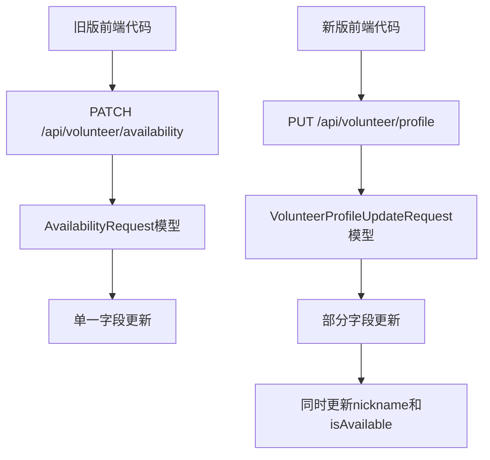

**图表来源**
- [VolunteerHomeView.swift:82-86](file://blindRun/Volunteer/VolunteerHomeView.swift#L82-L86)
- [ProfileModels.swift:52-72](file://blindRun/Core/Models/ProfileModels.swift#L52-L72)

**章节来源**
- [VolunteerHomeView.swift:82-86](file://blindRun/Volunteer/VolunteerHomeView.swift#L82-L86)
- [ProfileModels.swift:52-72](file://blindRun/Core/Models/ProfileModels.swift#L52-L72)

## 性能考虑

### 认证状态查询优化

由于认证状态可能频繁查询，系统采用了以下优化策略：

1. **缓存机制**: 认证状态在内存中缓存，减少数据库查询
2. **批量查询**: 支持批量获取多个志愿者的认证状态
3. **状态预加载**: 在志愿者首页预加载必要的认证信息

### Mock认证性能特性

Mock认证作为MVP阶段的简化实现，具有以下性能特点：

- **即时响应**: Mock认证通常在毫秒级时间内完成
- **低资源消耗**: 不依赖外部服务，减少系统负载
- **可扩展性**: 为后续真实认证服务提供平滑迁移路径

### 部分更新性能优化

新的部分更新功能在性能方面具有以下优势：

- **原子性操作**: 单次数据库事务完成多个字段更新
- **减少网络往返**: 支持一次请求更新多个字段
- **数据一致性**: 确保字段更新的原子性和一致性

**章节来源**
- [application.yml:1-34](file://backend/src/main/resources/application.yml#L1-L34)

## 故障排除指南

### 常见认证问题及解决方案

#### 认证状态异常

**问题**: 志愿者认证状态显示异常
**排查步骤**:
1. 检查Mock认证服务是否正常运行
2. 验证管理员审批流程是否完成
3. 确认isAvailable状态设置是否正确

**解决方案**:
- 重新触发Mock认证流程
- 手动重置认证状态
- 联系管理员重新审批

#### 接单失败问题

**问题**: 认证通过但仍无法接单
**排查步骤**:
1. 检查isAvailable状态是否为true
2. 验证志愿者资料是否完整
3. 确认订单状态是否为matching

**解决方案**:
- 开启可服务状态
- 完善志愿者资料
- 等待订单状态变更

#### Mock认证失败

**问题**: Mock认证请求失败
**排查步骤**:
1. 检查网络连接状态
2. 验证认证端点可用性
3. 确认请求参数格式正确

**解决方案**:
- 重试认证请求
- 检查服务器状态
- 联系技术支持

#### 端点迁移问题

**问题**: 使用旧端点导致请求失败
**排查步骤**:
1. 检查前端代码是否已更新到新端点
2. 验证请求URL是否为`/api/volunteer/profile`
3. 确认HTTP方法是否为PUT

**解决方案**:
- 更新前端代码到新端点
- 检查API契约文档
- 验证请求格式

**章节来源**
- [volunteer-order-flow/spec.md](file://openspec/changes/add-aidrun-ios-spring-mvp/specs/volunteer-order-flow/spec.md)
- [07-api-contract.openapi.yaml:554-555](file://docs/07-api-contract.openapi.yaml#L554-L555)

### 状态验证错误处理

系统实现了多层次的状态验证和错误处理机制：

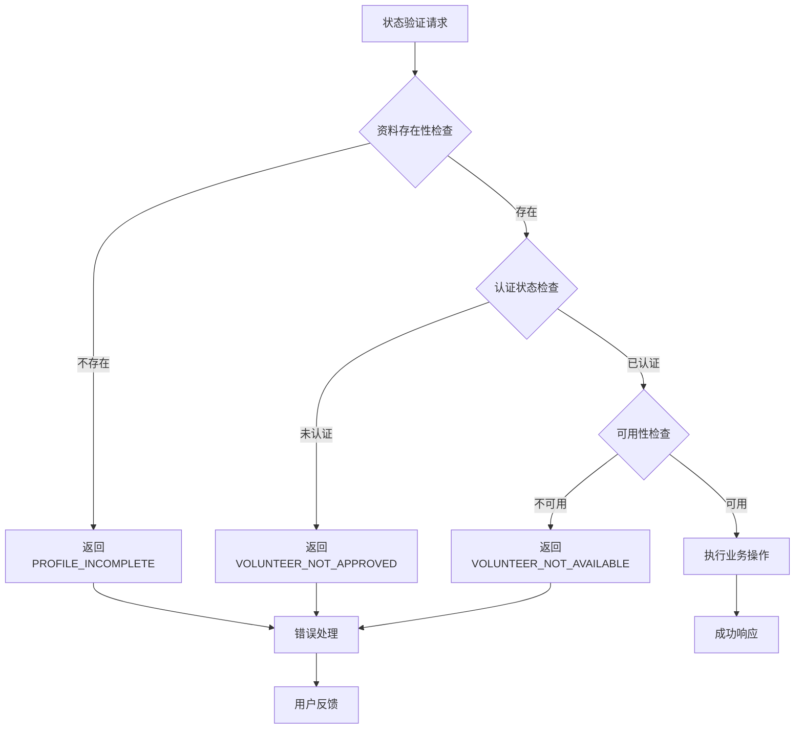

**图表来源**
- [VolunteerService.java:49-56](file://backend/src/main/java/com/aidrun/backend/volunteer/VolunteerService.java#L49-L56)
- [VolunteerControllerIntegrationTest.java:160-170](file://backend/src/test/java/com/aidrun/backend/volunteer/VolunteerControllerIntegrationTest.java#L160-L170)

**章节来源**
- [VolunteerService.java:49-56](file://backend/src/main/java/com/aidrun/backend/volunteer/VolunteerService.java#L49-L56)
- [VolunteerControllerIntegrationTest.java:160-170](file://backend/src/test/java/com/aidrun/backend/volunteer/VolunteerControllerIntegrationTest.java#L160-L170)

## 结论

志愿者认证管理功能通过Mock认证机制实现了简化的认证流程，满足MVP阶段的功能需求。系统采用双重状态管理模式，确保认证的完整性和可追溯性。

**重大更新**：PATCH端点`/api/volunteer/availability`的替换为PUT端点`/api/volunteer/profile`，不仅提升了API设计的一致性，还引入了部分更新功能，使系统更加灵活和高效。

### 主要优势

1. **简化流程**: Mock认证避免了复杂的实名认证流程
2. **灵活控制**: 可服务状态独立于认证状态，提供更好的业务灵活性
3. **清晰状态**: 标准化的状态枚举确保状态管理的一致性
4. **安全考虑**: 虽然简化了认证流程，但仍考虑了基本的安全因素
5. **前后端协同**: 前端状态验证与后端业务逻辑形成完整的保护机制
6. **API优化**: 新的端点设计支持部分更新，提升用户体验和系统性能

### 技术实现亮点

1. **代码级实现**: 后端使用Spring Boot实现完整的认证服务
2. **状态枚举**: 使用强类型枚举确保状态值的正确性
3. **DTO模式**: 使用数据传输对象确保前后端数据一致性
4. **测试覆盖**: 全面的集成测试确保系统稳定性
5. **错误码统一**: 使用标准化错误码提升用户体验
6. **部分更新**: 支持同时更新多个字段，提升操作效率

### 未来改进方向

1. **真实认证集成**: 为后续版本集成真实的实名认证服务
2. **增强监控**: 添加更详细的认证流程监控和审计功能
3. **性能优化**: 优化认证状态查询性能，支持大规模并发场景
4. **用户体验**: 改进认证流程的用户引导和反馈机制
5. **安全加固**: 增强Mock认证的安全性，防止滥用
6. **API扩展**: 基于部分更新模式扩展更多配置选项

该认证管理系统为助盲跑应用提供了可靠的志愿者管理基础，支持完整的订单服务流程，为后续功能扩展奠定了良好的技术基础。新的端点设计和部分更新功能进一步提升了系统的灵活性和用户体验。