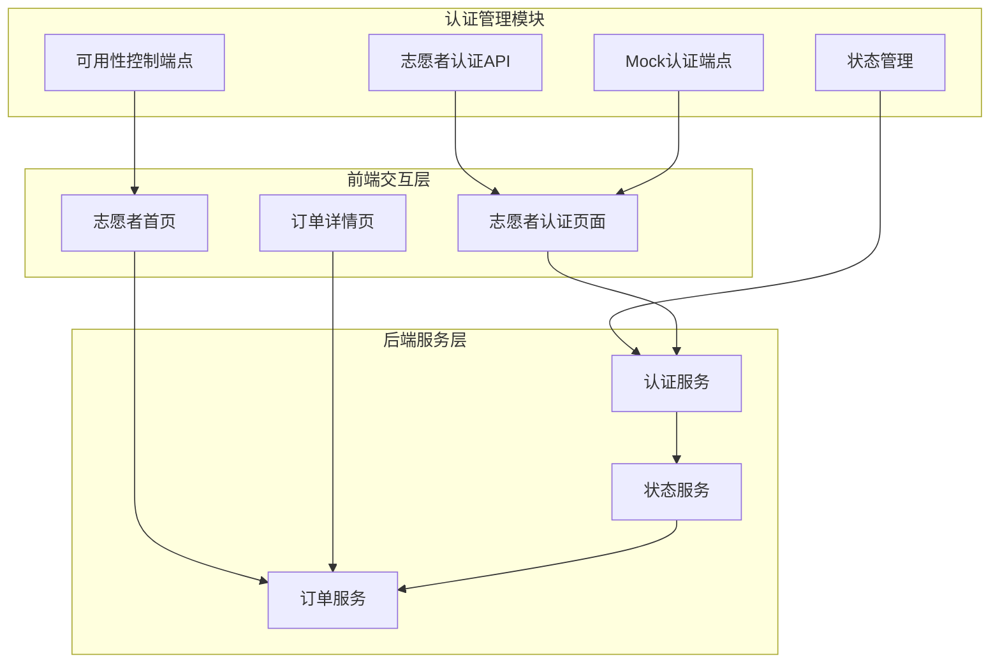
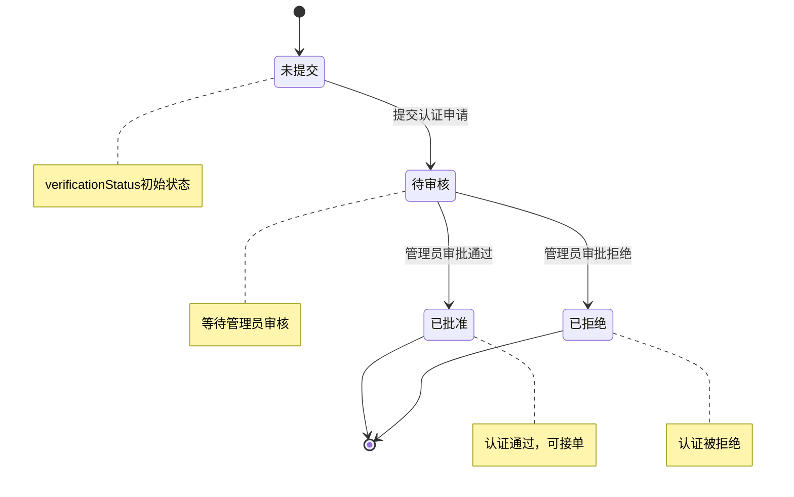
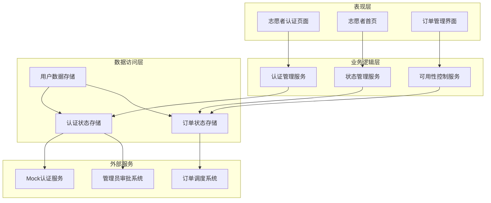
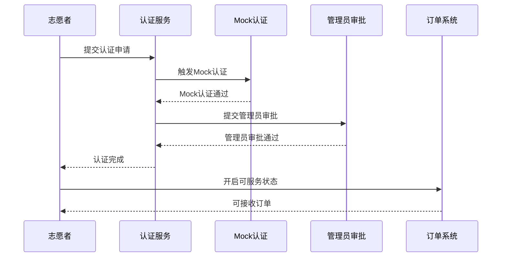
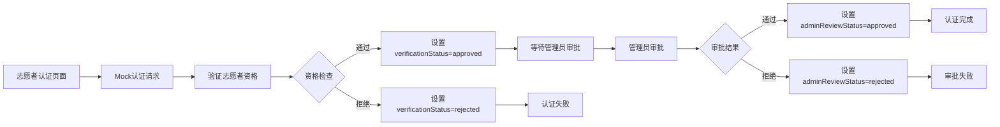
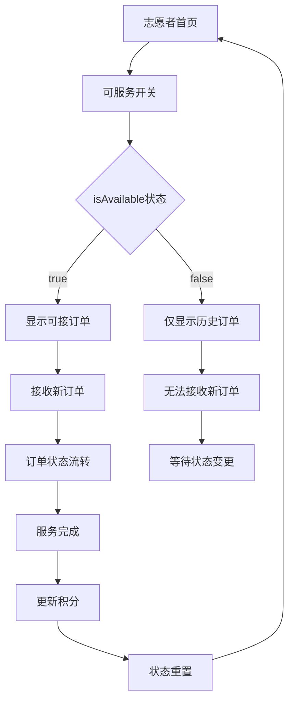
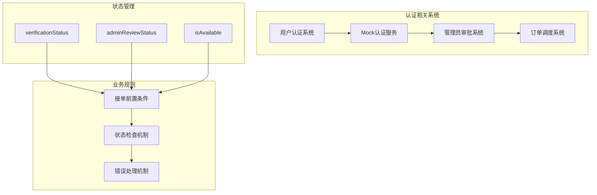

# 志愿者认证管理

<cite>
**本文档引用的文件**
- [07-api-contract.openapi.yaml](file://docs/07-api-contract.openapi.yaml)
- [08-ios-architecture.md](file://docs/08-ios-architecture.md)
- [02-mvp-scope.md](file://docs/02-mvp-scope.md)
- [04-user-flows-and-state-machine.md](file://docs/04-user-flows-and-state-machine.md)
- [volunteer-order-flow/spec.md](file://openspec/changes/add-aidrun-ios-spring-mvp/specs/volunteer-order-flow/spec.md)
- [auth-phone-login/spec.md](file://openspec/changes/add-aidrun-ios-spring-mvp/specs/auth-phone-login/spec.md)
</cite>

## 目录
1. [简介](#简介)
2. [项目结构](#项目结构)
3. [核心组件](#核心组件)
4. [架构概览](#架构概览)
5. [详细组件分析](#详细组件分析)
6. [依赖关系分析](#依赖关系分析)
7. [性能考虑](#性能考虑)
8. [故障排除指南](#故障排除指南)
9. [结论](#结论)

## 简介

志愿者认证管理功能是助盲跑应用的核心业务模块之一，负责管理志愿者的身份认证、状态管理和可用性控制。该系统采用Mock认证机制，在MVP阶段不依赖真实的实名认证服务，而是通过管理员手动审批的方式实现志愿者认证。

本系统主要包含三个核心状态字段：
- **verificationStatus**: 验证状态，管理志愿者的Mock认证状态
- **adminReviewStatus**: 管理员审核状态，控制志愿者的最终审批结果  
- **isAvailable**: 可服务状态，控制志愿者是否可以接收新的订单

## 项目结构

基于OpenAPI规范和项目架构文档，志愿者认证管理功能涉及以下关键组件：



**图表来源**
- [07-api-contract.openapi.yaml:118-148](file://docs/07-api-contract.openapi.yaml#L118-L148)
- [08-ios-architecture.md:26-27](file://docs/08-ios-architecture.md#L26-L27)

**章节来源**
- [07-api-contract.openapi.yaml:118-148](file://docs/07-api-contract.openapi.yaml#L118-L148)
- [08-ios-architecture.md:18-32](file://docs/08-ios-architecture.md#L18-L32)

## 核心组件

### 认证状态模型

志愿者认证状态采用双重状态管理模式：



**图表来源**
- [07-api-contract.openapi.yaml:572-578](file://docs/07-api-contract.openapi.yaml#L572-L578)

### 认证流程组件

系统采用双重认证机制，确保志愿者具备完整的认证资格：

| 认证组件 | 状态值 | 描述 | 作用 |
|---------|--------|------|------|
| verificationStatus | not_submitted | 未提交认证 | 初始状态，等待志愿者提交认证申请 |
| verificationStatus | pending | 认证待审核 | 已提交认证，等待管理员审核 |
| verificationStatus | approved | 认证已批准 | Mock认证通过，具备基本资格 |
| verificationStatus | rejected | 认证已拒绝 | Mock认证被拒绝，无法接单 |
| adminReviewStatus | not_submitted | 未提交审核 | 初始状态，等待管理员审批 |
| adminReviewStatus | pending | 审核待处理 | 管理员正在审核中 |
| adminReviewStatus | approved | 审核已批准 | 管理员最终批准，可接单 |
| adminReviewStatus | rejected | 审核已拒绝 | 管理员拒绝，无法接单 |

**章节来源**
- [07-api-contract.openapi.yaml:572-578](file://docs/07-api-contract.openapi.yaml#L572-L578)
- [volunteer-order-flow/spec.md:3-21](file://openspec/changes/add-aidrun-ios-spring-mvp/specs/volunteer-order-flow/spec.md#L3-L21)

## 架构概览

志愿者认证管理系统采用分层架构设计，确保认证流程的清晰性和可维护性：



**图表来源**
- [08-ios-architecture.md:33-41](file://docs/08-ios-architecture.md#L33-L41)
- [07-api-contract.openapi.yaml:118-148](file://docs/07-api-contract.openapi.yaml#L118-L148)

### 状态流转机制

认证状态管理采用严格的双层审批机制：



**图表来源**
- [volunteer-order-flow/spec.md:15-21](file://openspec/changes/add-aidrun-ios-spring-mvp/specs/volunteer-order-flow/spec.md#L15-L21)
- [07-api-contract.openapi.yaml:118-129](file://docs/07-api-contract.openapi.yaml#L118-L129)

## 详细组件分析

### Mock认证功能实现

Mock认证是志愿者认证系统的核心组件，采用简化的认证流程：

#### Mock认证端点设计



**图表来源**
- [07-api-contract.openapi.yaml:118-129](file://docs/07-api-contract.openapi.yaml#L118-L129)
- [volunteer-order-flow/spec.md:15-21](file://openspec/changes/add-aidrun-ios-spring-mvp/specs/volunteer-order-flow/spec.md#L15-L21)

#### Mock认证安全考虑

虽然Mock认证简化了认证流程，但仍需考虑以下安全因素：

1. **访问控制**: Mock认证端点需要适当的权限控制
2. **数据完整性**: 确保认证状态的一致性和完整性
3. **审计日志**: 记录所有认证操作便于追踪
4. **防滥用机制**: 防止恶意用户频繁提交认证请求

**章节来源**
- [07-api-contract.openapi.yaml:118-129](file://docs/07-api-contract.openapi.yaml#L118-L129)
- [02-mvp-scope.md:207-210](file://docs/02-mvp-scope.md#L207-L210)

### 认证状态管理机制

#### 状态枚举定义

认证状态采用标准化的枚举类型，确保状态值的一致性：

| 状态名称 | 可能值 | 描述 |
|---------|--------|------|
| VerificationStatus | not_submitted, pending, approved, rejected | 志愿者Mock认证状态 |
| AdminReviewStatus | not_submitted, pending, approved, rejected | 管理员审核状态 |
| IsAvailable | boolean | 志愿者可服务状态 |

#### 状态转换规则

```mermaid
stateDiagram-v2
[*] --> not_submitted
not_submitted --> pending : 提交认证
pending --> approved : Mock认证通过
pending --> rejected : Mock认证拒绝
approved --> pending : 管理员重新审核
approved --> [*] : 审核通过
rejected --> [*] : 审核拒绝
note over pending : 需要管理员审批
note over approved : 认证完成，可接单
note over rejected : 认证失败，无法接单
```

**图表来源**
- [07-api-contract.openapi.yaml:572-578](file://docs/07-api-contract.openapi.yaml#L572-L578)

**章节来源**
- [07-api-contract.openapi.yaml:572-578](file://docs/07-api-contract.openapi.yaml#L572-L578)

### 可服务状态管理

#### isAvailable字段作用

isAvailable字段是志愿者可用性控制的核心，具有以下重要作用：

1. **接单控制**: 控制志愿者是否可以接收新的订单
2. **状态隔离**: 与认证状态分离，允许志愿者在认证完成后调整可用性
3. **业务灵活性**: 支持志愿者根据个人情况调整服务状态

#### 可服务状态控制流程



**图表来源**
- [07-api-contract.openapi.yaml:131-148](file://docs/07-api-contract.openapi.yaml#L131-L148)

**章节来源**
- [07-api-contract.openapi.yaml:131-148](file://docs/07-api-contract.openapi.yaml#L131-L148)

## 依赖关系分析

### 认证流程依赖关系

志愿者认证管理涉及多个系统的协调工作：



**图表来源**
- [volunteer-order-flow/spec.md:3-5](file://openspec/changes/add-aidrun-ios-spring-mvp/specs/volunteer-order-flow/spec.md#L3-L5)
- [07-api-contract.openapi.yaml:118-148](file://docs/07-api-contract.openapi.yaml#L118-L148)

### 错误处理依赖

系统采用统一的错误处理机制，确保认证失败时的用户体验：

| 错误代码 | 触发条件 | 处理策略 |
|---------|----------|----------|
| VOLUNTEER_NOT_APPROVED | 未完成Mock认证或管理员审批拒绝 | 提示用户完成认证流程 |
| VOLUNTEER_NOT_AVAILABLE | 认证通过但isAvailable=false | 提示用户开启可服务状态 |
| INVALID_VERIFICATION_CODE | Mock认证失败 | 提示用户重新认证 |
| UNAUTHORIZED | 缺少或无效的认证令牌 | 引导用户重新登录 |

**章节来源**
- [07-api-contract.openapi.yaml:554-555](file://docs/07-api-contract.openapi.yaml#L554-L555)
- [volunteer-order-flow/spec.md:7-13](file://openspec/changes/add-aidrun-ios-spring-mvp/specs/volunteer-order-flow/spec.md#L7-L13)

## 性能考虑

### 认证状态查询优化

由于认证状态可能频繁查询，系统采用了以下优化策略：

1. **缓存机制**: 认证状态在内存中缓存，减少数据库查询
2. **批量查询**: 支持批量获取多个志愿者的认证状态
3. **状态预加载**: 在志愿者首页预加载必要的认证信息

### Mock认证性能特性

Mock认证作为MVP阶段的简化实现，具有以下性能特点：

- **即时响应**: Mock认证通常在毫秒级时间内完成
- **低资源消耗**: 不依赖外部服务，减少系统负载
- **可扩展性**: 为后续真实认证服务提供平滑迁移路径

## 故障排除指南

### 常见认证问题及解决方案

#### 认证状态异常

**问题**: 志愿者认证状态显示异常
**排查步骤**:
1. 检查Mock认证服务是否正常运行
2. 验证管理员审批流程是否完成
3. 确认isAvailable状态设置是否正确

**解决方案**:
- 重新触发Mock认证流程
- 手动重置认证状态
- 联系管理员重新审批

#### 接单失败问题

**问题**: 认证通过但仍无法接单
**排查步骤**:
1. 检查isAvailable状态是否为true
2. 验证志愿者资料是否完整
3. 确认订单状态是否为matching

**解决方案**:
- 开启可服务状态
- 完善志愿者资料
- 等待订单状态变更

#### Mock认证失败

**问题**: Mock认证请求失败
**排查步骤**:
1. 检查网络连接状态
2. 验证认证端点可用性
3. 确认请求参数格式正确

**解决方案**:
- 重试认证请求
- 检查服务器状态
- 联系技术支持

**章节来源**
- [volunteer-order-flow/spec.md](file://openspec/changes/add-aidrun-ios-spring-mvp/specs/volunteer-order-flow/spec.md)
- [07-api-contract.openapi.yaml:554-555](file://docs/07-api-contract.openapi.yaml#L554-L555)

## 结论

志愿者认证管理功能通过Mock认证机制实现了简化的认证流程，满足MVP阶段的功能需求。系统采用双重状态管理模式，确保认证的完整性和可追溯性。

### 主要优势

1. **简化流程**: Mock认证避免了复杂的实名认证流程
2. **灵活控制**: 可服务状态独立于认证状态，提供更好的业务灵活性
3. **清晰状态**: 标准化的状态枚举确保状态管理的一致性
4. **安全考虑**: 虽然简化了认证流程，但仍考虑了基本的安全因素

### 未来改进方向

1. **真实认证集成**: 为后续版本集成真实的实名认证服务
2. **增强监控**: 添加更详细的认证流程监控和审计功能
3. **性能优化**: 优化认证状态查询性能，支持大规模并发场景
4. **用户体验**: 改进认证流程的用户引导和反馈机制

该认证管理系统为助盲跑应用提供了可靠的志愿者管理基础，支持完整的订单服务流程，为后续功能扩展奠定了良好的技术基础。