# 接单服务流程

<cite>
**本文引用的文件**
- [04-用户流程与状态机.md](file://docs/04-user-flows-and-state-machine.md)
- [07-API契约.openapi.yaml](file://docs/07-api-contract.openapi.yaml)
- [02-MVP范围.md](file://docs/02-mvp-scope.md)
- [08-iOS架构.md](file://docs/08-ios-architecture.md)
- [03-用户故事.md](file://docs/03-user-stories.md)
- [00-一致性检查报告.md](file://docs/00-一致性检查报告.md)
- [volunteer-order-flow.spec.md](file://openspec/changes/add-aidrun-ios-spring-mvp/specs/volunteer-order-flow/spec.md)
- [order-status-lifecycle.spec.md](file://openspec/changes/add-aidrun-ios-spring-mvp/specs/order-status-lifecycle/spec.md)
- [volunteer-points.spec.md](file://openspec/changes/add-aidrun-ios-spring-mvp/specs/volunteer-points/spec.md)
- [safety-basic-emergency.spec.md](file://openspec/changes/add-aidrun-ios-spring-mvp/specs/safety-basic-emergency/spec.md)
- [VolunteerService.java](file://backend/src/main/java/com/aidrun/backend/volunteer/VolunteerService.java)
- [VolunteerController.java](file://backend/src/main/java/com/aidrun/backend/volunteer/VolunteerController.java)
- [RunOrder.java](file://backend/src/main/java/com/aidrun/backend/order/RunOrder.java)
- [RunOrderStatus.java](file://backend/src/main/java/com/aidrun/backend/order/RunOrderStatus.java)
- [RunOrderRepository.java](file://backend/src/main/java/com/aidrun/backend/order/RunOrderRepository.java)
- [AvailabilityRequest.java](file://backend/src/main/java/com/aidrun/backend/volunteer/dto/AvailabilityRequest.java)
- [CancelledBy.java](file://backend/src/main/java/com/aidrun/backend/order/CancelledBy.java)
- [blindRunApp.swift](file://blindRun/blindRun/blindRunApp.swift)
- [ContentView.swift](file://blindRun/blindRun/ContentView.swift)
</cite>

## 更新摘要
**所做更改**
- 新增志愿者接单验证机制的详细说明
- 补充订单状态管理的完整生命周期规范
- 增加接单阻断机制的技术实现细节
- 完善志愿者资格检查的前后端协同机制
- 更新并发控制与冲突解决的技术实现

## 目录
1. [简介](#简介)
2. [项目结构](#项目结构)
3. [核心组件](#核心组件)
4. [架构概览](#架构概览)
5. [详细组件分析](#详细组件分析)
6. [依赖关系分析](#依赖关系分析)
7. [性能考虑](#性能考虑)
8. [故障排查指南](#故障排查指南)
9. [结论](#结论)

## 简介
本文件系统化阐述接单服务的完整业务流程，涵盖志愿者资格检查、订单锁定与并发控制、状态转换生命周期、冲突解决机制、服务进度管理、与跑者系统的双向验证、以及超时与异常恢复策略。文档基于仓库内的需求规格、API契约与用户故事，确保技术实现与业务目标一致。

**更新** 本次更新重点反映了新增的志愿者接单服务流程，包括接单验证、订单状态管理、接单阻断机制等核心技术实现。

## 项目结构
- 文档驱动：通过多份文档定义业务规则、API契约与验收标准
- 规格约束：OpenSpec变更集提供严格的业务规则与边界条件
- 后端实现：Spring Boot后端提供完整的志愿者服务与订单管理
- 客户端架构：iOS采用SwiftUI + MVVM，职责清晰、便于实现状态机与轮询逻辑

```mermaid
graph TB
subgraph "文档与规格"
A["04-用户流程与状态机.md"]
B["07-API契约.openapi.yaml"]
C["02-MVP范围.md"]
D["03-用户故事.md"]
E["08-iOS架构.md"]
F["00-一致性检查报告.md"]
end
subgraph "OpenSpec变更集"
G["volunteer-order-flow.spec.md"]
H["order-status-lifecycle.spec.md"]
I["volunteer-points.spec.md"]
J["safety-basic-emergency.spec.md"]
end
subgraph "后端实现"
K["VolunteerService.java"]
L["VolunteerController.java"]
M["RunOrder.java"]
N["RunOrderStatus.java"]
O["RunOrderRepository.java"]
end
subgraph "客户端代码"
P["blindRunApp.swift"]
Q["ContentView.swift"]
end
A --> B
B --> C
C --> D
D --> E
E --> F
G --> H
H --> I
I --> J
K --> L
M --> N
O --> M
P --> Q
```

**图表来源**
- [04-用户流程与状态机.md:1-309](file://docs/04-user-flows-and-state-machine.md#L1-L309)
- [07-API契约.openapi.yaml:1-800](file://docs/07-api-contract.openapi.yaml#L1-L800)
- [02-MVP范围.md:1-216](file://docs/02-mvp-scope.md#L1-L216)
- [03-用户故事.md:438-702](file://docs/03-user-stories.md#L438-L702)
- [08-iOS架构.md:1-165](file://docs/08-iOS架构.md#L1-L165)
- [00-一致性检查报告.md:27-43](file://docs/00-一致性检查报告.md#L27-L43)
- [volunteer-order-flow.spec.md:1-38](file://openspec/changes/add-aidrun-ios-spring-mvp/specs/volunteer-order-flow/spec.md#L1-L38)
- [order-status-lifecycle.spec.md:1-66](file://openspec/changes/add-aidrun-ios-spring-mvp/specs/order-status-lifecycle/spec.md#L1-L66)
- [volunteer-points.spec.md:1-26](file://openspec/changes/add-aidrun-ios-spring-mvp/specs/volunteer-points/spec.md#L1-L26)
- [safety-basic-emergency.spec.md:1-42](file://openspec/changes/add-aidrun-ios-spring-mvp/specs/safety-basic-emergency/spec.md#L1-L42)
- [VolunteerService.java:1-90](file://backend/src/main/java/com/aidrun/backend/volunteer/VolunteerService.java#L1-L90)
- [VolunteerController.java:1-41](file://backend/src/main/java/com/aidrun/backend/volunteer/VolunteerController.java#L1-L41)
- [RunOrder.java:1-102](file://backend/src/main/java/com/aidrun/backend/order/RunOrder.java#L1-L102)
- [RunOrderStatus.java:1-35](file://backend/src/main/java/com/aidrun/backend/order/RunOrderStatus.java#L1-L35)
- [RunOrderRepository.java:1-19](file://backend/src/main/java/com/aidrun/backend/order/RunOrderRepository.java#L1-L19)
- [blindRunApp.swift:1-18](file://blindRun/blindRun/blindRunApp.swift#L1-L18)
- [ContentView.swift:1-25](file://blindRun/blindRun/ContentView.swift#L1-L25)

## 核心组件
- **志愿者资格检查**：必须完成志愿者资料完善、Mock认证通过、管理员复审通过、且可服务开关开启
- **订单状态机**：定义从matching到accepted、arrived、in_progress、completed、cancelled、emergency的严格状态转换
- **并发控制**：仅matching订单可被接单，后续并发接单返回冲突错误
- **接单阻断机制**：通过后端服务层验证确保只有符合条件的志愿者才能接单
- **轮询机制**：盲人端每5秒轮询订单状态，实时感知变化
- **紧急求助**：仅在特定状态下触发，进入emergency终态
- **积分奖励**：完成服务后志愿者获得100积分

**更新** 新增了接单阻断机制的技术实现，通过VolunteerService.validateVolunteerCanAcceptOrder方法确保接单前的完整验证。

**章节来源**
- [volunteer-order-flow.spec.md:3-13](file://openspec/changes/add-aidrun-ios-spring-mvp/specs/volunteer-order-flow/spec.md#L3-L13)
- [VolunteerService.java:64-88](file://backend/src/main/java/com/aidrun/backend/volunteer/VolunteerService.java#L64-L88)
- [order-status-lifecycle.spec.md:11-30](file://openspec/changes/add-aidrun-ios-spring-mvp/specs/order-status-lifecycle/spec.md#L11-L30)
- [04-用户流程与状态机.md:72-118](file://docs/04-user-flows-and-state-machine.md#L72-L118)

## 架构概览
接单服务涉及客户端（iOS）与后端API协作，客户端负责用户交互、轮询与状态播报，后端负责状态持久化与业务规则校验。

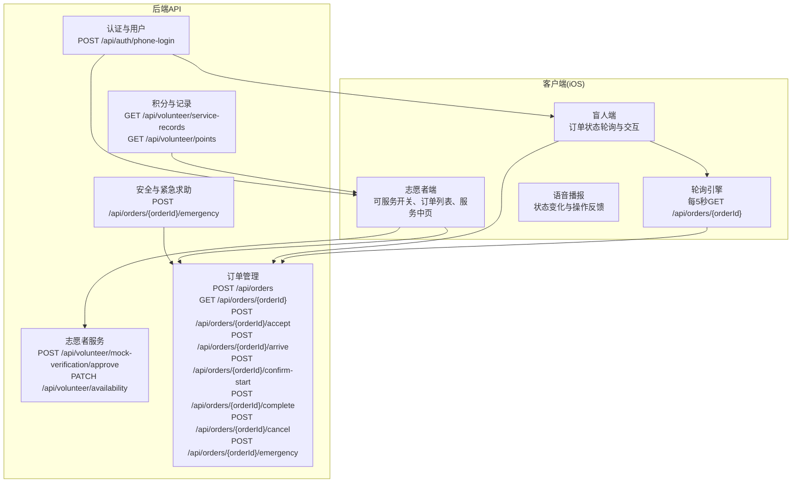

**图表来源**
- [07-API契约.openapi.yaml:25-341](file://docs/07-api-contract.openapi.yaml#L25-L341)
- [08-iOS架构.md:125-139](file://docs/08-iOS架构.md#L125-L139)
- [04-用户流程与状态机.md:120-178](file://docs/04-user-flows-and-state-machine.md#L120-L178)

## 详细组件分析

### 志愿者资格检查与接单阻断机制
- **必备条件**
  - 完成志愿者资料完善（PROFILE_INCOMPLETE）
  - Mock认证通过（verificationStatus与adminReviewStatus均为APPROVED）
  - 可服务开关isAvailable=true
- **接单阻断实现**
  - 后端通过validateVolunteerCanAcceptOrder方法统一验证
  - 前端通过VolunteerOrderActionGuard计算接单按钮可用性
  - 验证失败返回对应错误码：VOLUNTEER_NOT_APPROVED或VOLUNTEER_NOT_AVAILABLE
- **前置信息展示**
  - 接单前仅展示非敏感信息（昵称、起点、预约时间、备注等），隐藏电话与紧急联系人

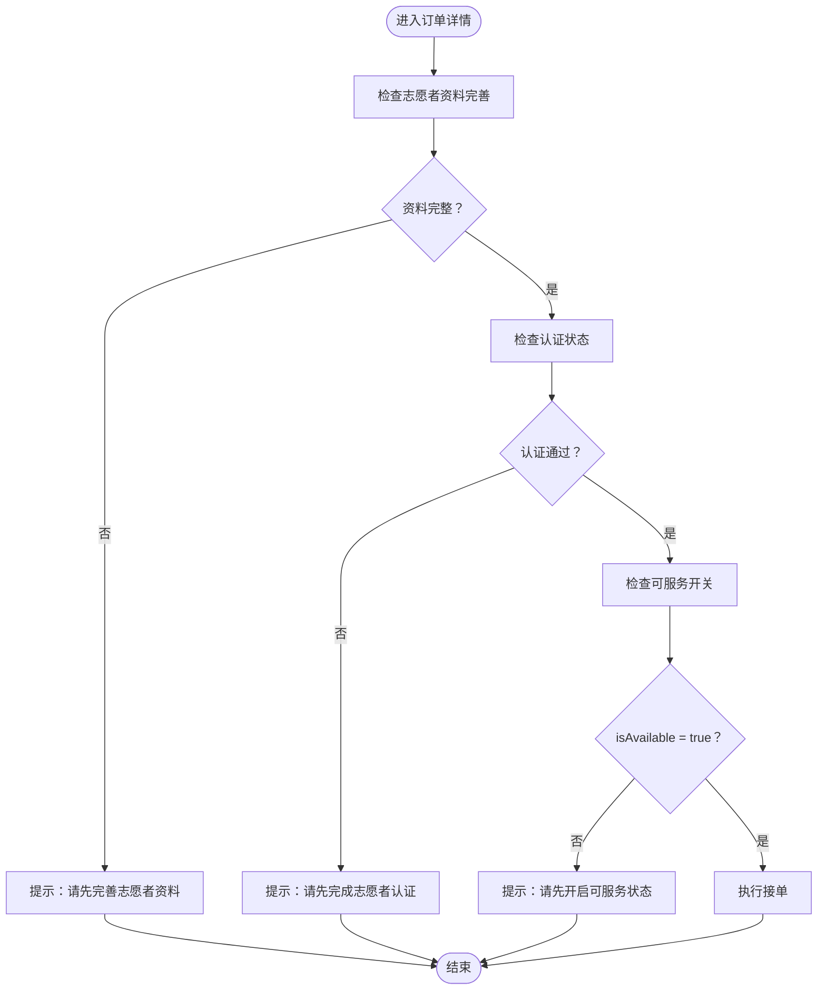

**图表来源**
- [VolunteerService.java:64-88](file://backend/src/main/java/com/aidrun/backend/volunteer/VolunteerService.java#L64-L88)
- [volunteer-order-flow.spec.md:3-13](file://openspec/changes/add-aidrun-ios-spring-mvp/specs/volunteer-order-flow/spec.md#L3-L13)

**章节来源**
- [VolunteerService.java:64-88](file://backend/src/main/java/com/aidrun/backend/volunteer/VolunteerService.java#L64-L88)
- [volunteer-order-flow.spec.md:3-13](file://openspec/changes/add-aidrun-ios-spring-mvp/specs/volunteer-order-flow/spec.md#L3-L13)
- [VolunteerController.java:25-39](file://backend/src/main/java/com/aidrun/backend/volunteer/VolunteerController.java#L25-L39)

### 订单锁定机制与并发控制
- **乐观锁保护**
  - 仅matching订单可被接单；一旦状态变更为accepted，其他志愿者并发接单将失败
  - 通过后端服务层的原子性验证防止并发冲突
- **冲突处理**
  - 返回ORDER_ALREADY_ACCEPTED，提示"该订单已被其他志愿者接单"，引导返回订单列表
  - 前端显示友好的冲突提示信息
- **超时自动取消**
  - 若距离预约开始时间不足30分钟且仍未接单，则系统自动取消（cancelledReason=no_volunteer_available）

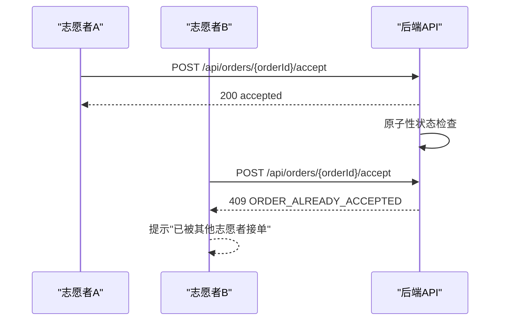

**图表来源**
- [order-status-lifecycle.spec.md:15-17](file://openspec/changes/add-aidrun-ios-spring-mvp/specs/order-status-lifecycle/spec.md#L15-L17)
- [VolunteerService.java:64-88](file://backend/src/main/java/com/aidrun/backend/volunteer/VolunteerService.java#L64-L88)

**章节来源**
- [order-status-lifecycle.spec.md:11-17](file://openspec/changes/add-aidrun-ios-spring-mvp/specs/order-status-lifecycle/spec.md#L11-L17)
- [VolunteerService.java:64-88](file://backend/src/main/java/com/aidrun/backend/volunteer/VolunteerService.java#L64-L88)

### 订单状态转换生命周期
- **正常路径**
  - matching → accepted（志愿者接单）
  - accepted → arrived（志愿者到达）
  - arrived → in_progress（盲人确认开始）
  - in_progress → completed（志愿者结束服务）
- **取消与求助**
  - matching/accepted/arrived可取消（普通取消）
  - in_progress仅能求助（emergency）
  - emergency为终态，不支持恢复
- **状态枚举定义**
  - 所有状态通过RunOrderStatus枚举统一管理
  - 支持JSON序列化与反序列化

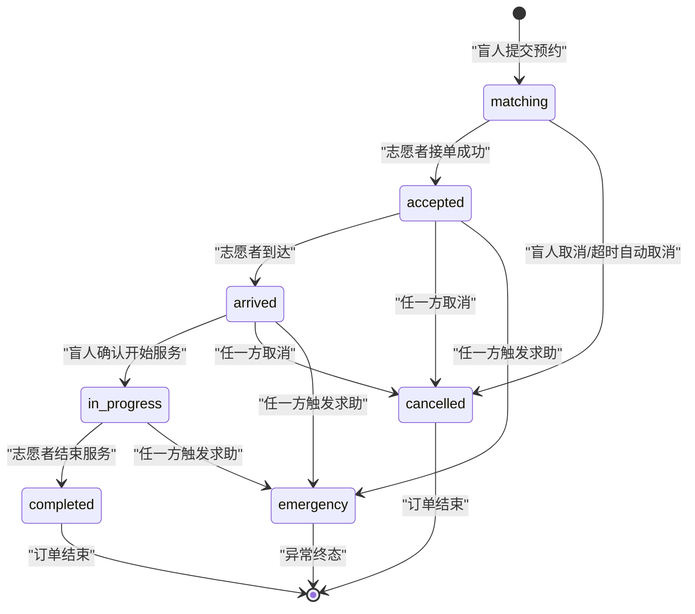

**图表来源**
- [RunOrderStatus.java:6-13](file://backend/src/main/java/com/aidrun/backend/order/RunOrderStatus.java#L6-L13)
- [04-用户流程与状态机.md:74-96](file://docs/04-user-flows-and-state-machine.md#L74-L96)

**章节来源**
- [RunOrderStatus.java:6-13](file://backend/src/main/java/com/aidrun/backend/order/RunOrderStatus.java#L6-L13)
- [order-status-lifecycle.spec.md:3-9](file://openspec/changes/add-aidrun-ios-spring-mvp/specs/order-status-lifecycle/spec.md#L3-L9)
- [04-用户流程与状态机.md:72-118](file://docs/04-user-flows-and-state-machine.md#L72-L118)

### 服务进度管理与双向验证
- **到达确认**
  - 志愿者在accepted状态下点击"我已到达"，订单进入arrived
  - 后端通过markArrived方法更新状态和时间戳
- **服务开始**
  - 盲人端轮询到arrived后，点击"确认开始服务"，订单进入in_progress
  - 通过confirmStart接口确保双方确认
- **服务完成**
  - 志愿者在in_progress状态下点击"结束服务"，订单进入completed
  - 志愿者获得+100积分奖励

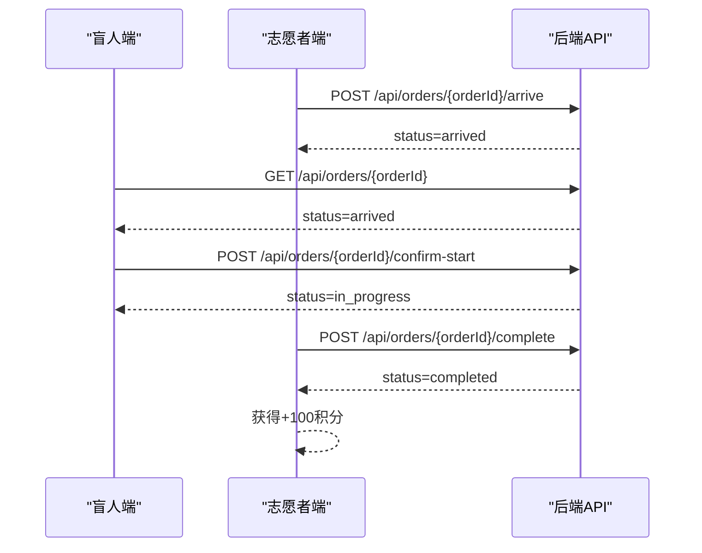

**图表来源**
- [04-用户流程与状态机.md:122-178](file://docs/04-用户流程与状态机.md#L122-L178)
- [volunteer-points.spec.md:3-9](file://openspec/changes/add-aidrun-ios-spring-mvp/specs/volunteer-points/spec.md#L3-L9)

**章节来源**
- [04-用户流程与状态机.md:120-178](file://docs/04-user-flows-and-state-machine.md#L120-L178)
- [volunteer-points.spec.md:3-9](file://openspec/changes/add-aidrun-ios-spring-mvp/specs/volunteer-points/spec.md#L3-L9)

### 冲突解决机制
- **重复接取预防**
  - 仅matching订单可接；一旦变为accepted，其他请求返回ORDER_ALREADY_ACCEPTED
  - 后端通过原子性验证防止竞态条件
- **冲突处理流程**
  - 客户端提示"已被其他志愿者接单"，引导返回订单列表
  - 前端根据错误码显示相应提示
- **取消与求助的边界**
  - in_progress阶段仅支持emergency，不支持普通cancel
  - emergency为终态，不支持恢复

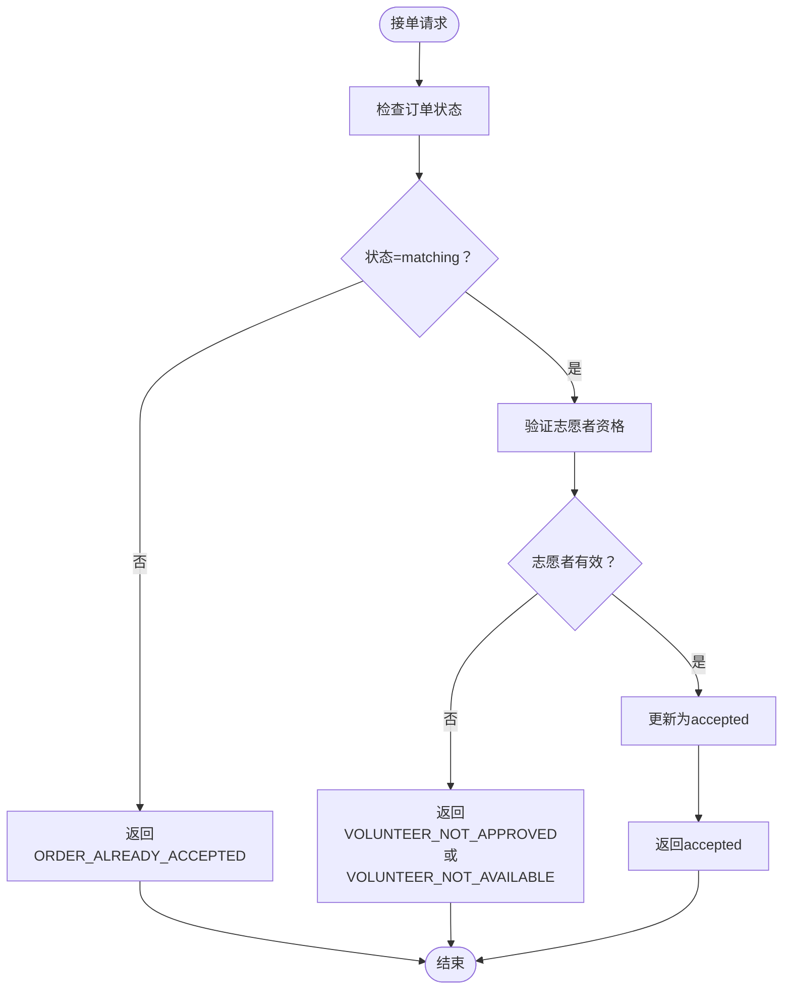

**图表来源**
- [order-status-lifecycle.spec.md:15-17](file://openspec/changes/add-aidrun-ios-spring-mvp/specs/order-status-lifecycle/spec.md#L15-L17)
- [VolunteerService.java:64-88](file://backend/src/main/java/com/aidrun/backend/volunteer/VolunteerService.java#L64-L88)

**章节来源**
- [order-status-lifecycle.spec.md:19-30](file://openspec/changes/add-aidrun-ios-spring-mvp/specs/order-status-lifecycle/spec.md#L19-L30)
- [VolunteerService.java:64-88](file://backend/src/main/java/com/aidrun/backend/volunteer/VolunteerService.java#L64-L88)

### 超时处理与异常恢复
- **超时自动取消**
  - matching订单在预约前30分钟仍未接单，系统自动取消（cancelledReason=no_volunteer_available）
  - 通过RunOrderRepository.existsByUserIdAndStatusIn查询活跃订单
- **异常恢复**
  - emergency为终态，MVP不支持恢复或继续执行生命周期动作
  - 可视化与数据层面记录emergency事件，但不回滚到之前状态

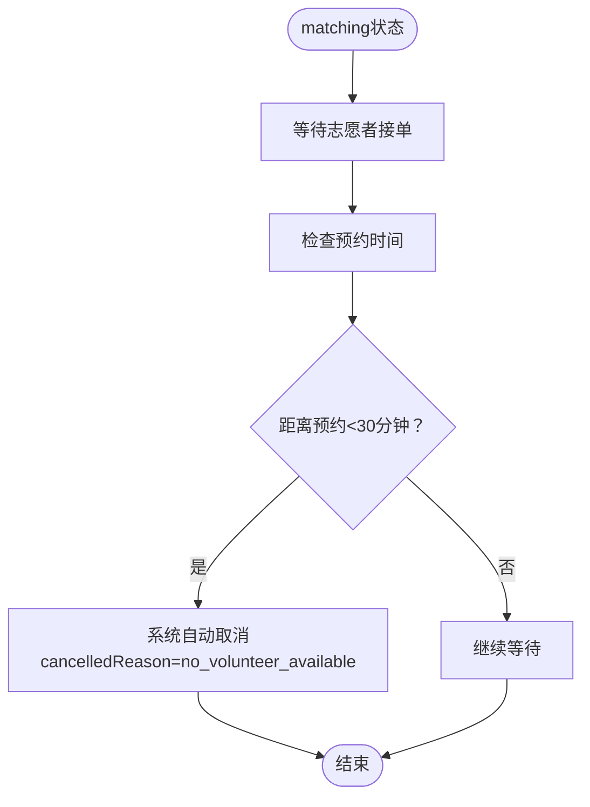

**图表来源**
- [order-status-lifecycle.spec.md:43-49](file://openspec/changes/add-aidrun-ios-spring-mvp/specs/order-status-lifecycle/spec.md#L43-L49)
- [RunOrderRepository.java:12-17](file://backend/src/main/java/com/aidrun/backend/order/RunOrderRepository.java#L12-L17)

**章节来源**
- [order-status-lifecycle.spec.md:43-49](file://openspec/changes/add-aidrun-ios-spring-mvp/specs/order-status-lifecycle/spec.md#L43-L49)
- [RunOrderRepository.java:12-17](file://backend/src/main/java/com/aidrun/backend/order/RunOrderRepository.java#L12-L17)

### 客户端轮询与状态播报
- **轮询策略**
  - 盲人端在订单相关页面（等待、已接单、已到达、服务中）每5秒轮询GET /api/orders/{orderId}
  - 状态变化时更新UI并触发TTS播报
- **停止条件**
  - 订单进入completed、cancelled或emergency；页面离开；用户登出
- **前端验证**
  - 通过VolunteerOrderActionGuard计算接单按钮可用性
  - 根据志愿者状态动态显示接单按钮

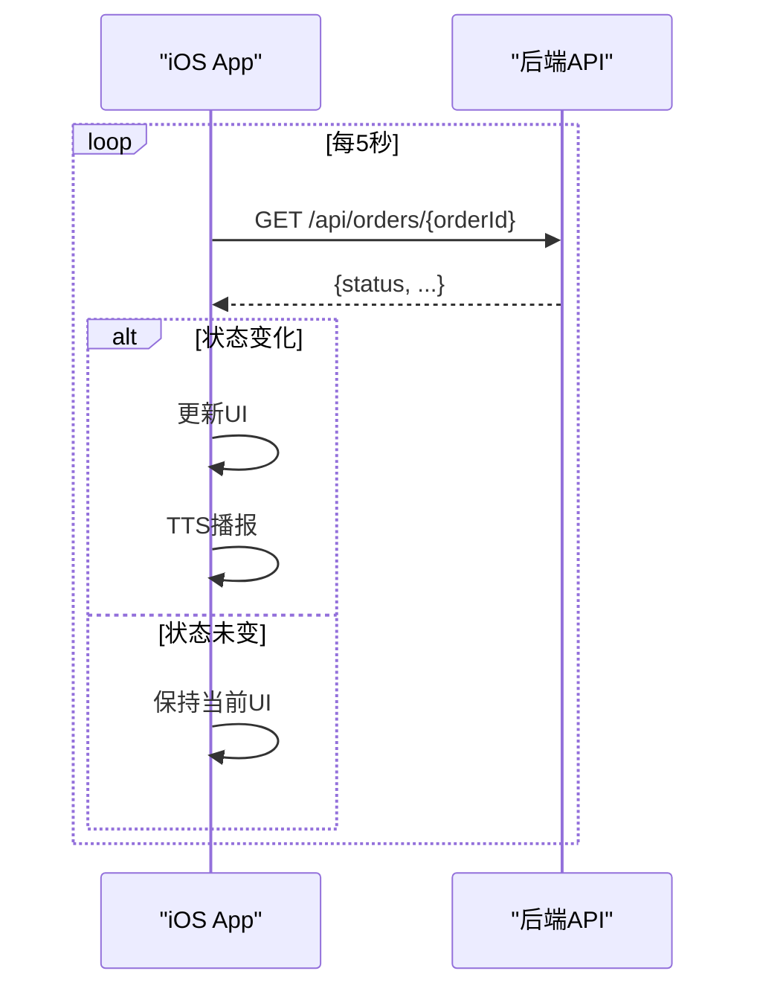

**图表来源**
- [08-iOS架构.md:125-139](file://docs/08-iOS架构.md#L125-L139)
- [04-用户流程与状态机.md:277-299](file://docs/04-user-flows-and-state-machine.md#L277-L299)

**章节来源**
- [08-iOS架构.md:125-139](file://docs/08-iOS架构.md#L125-L139)
- [04-用户流程与状态机.md:275-299](file://docs/04-user-flows-and-state-machine.md#L275-L299)

### 紧急求助流程与双向验证
- **触发条件**
  - 仅在accepted、arrived、in_progress状态下可触发emergency
  - 通过CancelledBy枚举定义取消行为方
- **流程**
  - 任一方确认后，订单进入emergency终态
  - 另一方轮询到emergency状态，UI更新并TTS播报
- **数据记录**
  - MVP记录emergency事件与当前状态，不进行自动通知

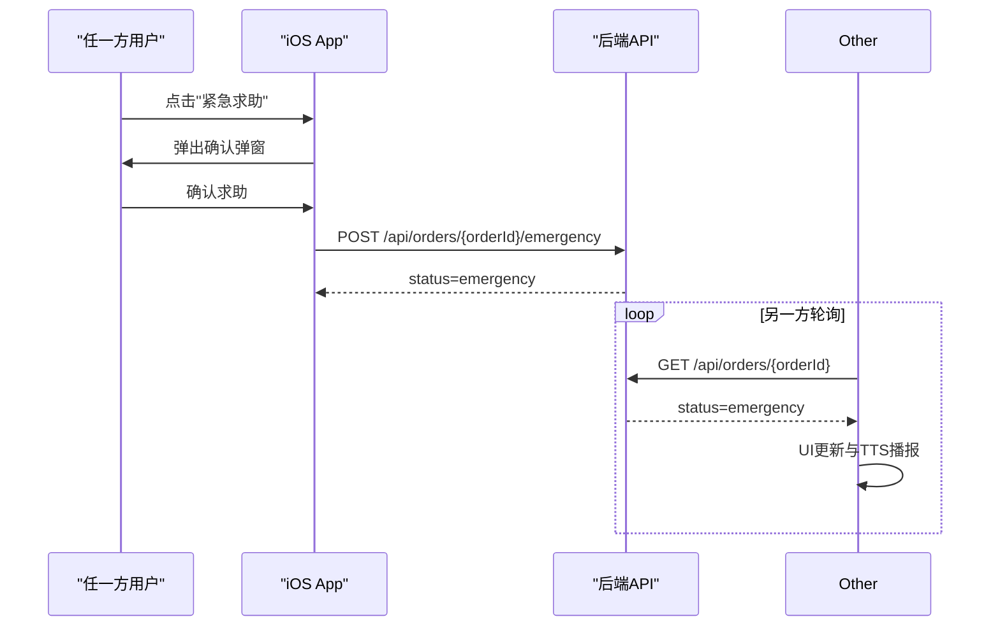

**图表来源**
- [04-用户流程与状态机.md:232-257](file://docs/04-user-flows-and-state-machine.md#L232-L257)
- [safety-basic-emergency.spec.md:11-29](file://openspec/changes/add-aidrun-ios-spring-mvp/specs/safety-basic-emergency/spec.md#L11-L29)

**章节来源**
- [04-用户流程与状态机.md:230-257](file://docs/04-user-flows-and-state-machine.md#L230-L257)
- [safety-basic-emergency.spec.md:11-29](file://openspec/changes/add-aidrun-ios-spring-mvp/specs/safety-basic-emergency/spec.md#L11-L29)

## 依赖关系分析
- **文档与API契约**
  - 04-用户流程与状态机.md定义状态机与流程
  - 07-API契约.openapi.yaml提供REST API定义与错误码
- **规格约束**
  - volunteer-order-flow.spec.md定义志愿者资格与可见性
  - order-status-lifecycle.spec.md定义状态转换与并发控制
  - volunteer-points.spec.md定义积分奖励
  - safety-basic-emergency.spec.md定义紧急求助
- **后端实现**
  - VolunteerService提供志愿者验证与状态管理
  - RunOrder管理订单状态与生命周期
  - RunOrderStatus定义状态枚举
  - RunOrderRepository提供订单查询功能
- **客户端架构**
  - 08-iOS架构.md定义轮询、模块划分与MVVM职责

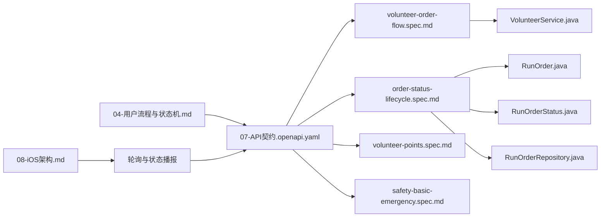

**图表来源**
- [04-用户流程与状态机.md:1-309](file://docs/04-user-flows-and-state-machine.md#L1-L309)
- [07-API契约.openapi.yaml:1-800](file://docs/07-api-contract.openapi.yaml#L1-L800)
- [volunteer-order-flow.spec.md:1-38](file://openspec/changes/add-aidrun-ios-spring-mvp/specs/volunteer-order-flow/spec.md#L1-L38)
- [order-status-lifecycle.spec.md:1-66](file://openspec/changes/add-aidrun-ios-spring-mvp/specs/order-status-lifecycle/spec.md#L1-L66)
- [volunteer-points.spec.md:1-26](file://openspec/changes/add-aidrun-ios-spring-mvp/specs/volunteer-points/spec.md#L1-L26)
- [safety-basic-emergency.spec.md:1-42](file://openspec/changes/add-aidrun-ios-spring-mvp/specs/safety-basic-emergency/spec.md#L1-L42)
- [VolunteerService.java:1-90](file://backend/src/main/java/com/aidrun/backend/volunteer/VolunteerService.java#L1-L90)
- [RunOrder.java:1-102](file://backend/src/main/java/com/aidrun/backend/order/RunOrder.java#L1-L102)
- [RunOrderStatus.java:1-35](file://backend/src/main/java/com/aidrun/backend/order/RunOrderStatus.java#L1-L35)
- [RunOrderRepository.java:1-19](file://backend/src/main/java/com/aidrun/backend/order/RunOrderRepository.java#L1-L19)
- [08-iOS架构.md:125-139](file://docs/08-iOS架构.md#L125-L139)

**章节来源**
- [04-用户流程与状态机.md:1-309](file://docs/04-user-flows-and-state-machine.md#L1-L309)
- [07-API契约.openapi.yaml:1-800](file://docs/07-api-contract.openapi.yaml#L1-L800)
- [volunteer-order-flow.spec.md:1-38](file://openspec/changes/add-aidrun-ios-spring-mvp/specs/volunteer-order-flow/spec.md#L1-L38)
- [order-status-lifecycle.spec.md:1-66](file://openspec/changes/add-aidrun-ios-spring-mvp/specs/order-status-lifecycle/spec.md#L1-L66)
- [volunteer-points.spec.md:1-26](file://openspec/changes/add-aidrun-ios-spring-mvp/specs/volunteer-points/spec.md#L1-L26)
- [safety-basic-emergency.spec.md:1-42](file://openspec/changes/add-aidrun-ios-spring-mvp/specs/safety-basic-emergency/spec.md#L1-L42)
- [VolunteerService.java:1-90](file://backend/src/main/java/com/aidrun/backend/volunteer/VolunteerService.java#L1-L90)
- [RunOrder.java:1-102](file://backend/src/main/java/com/aidrun/backend/order/RunOrder.java#L1-L102)
- [RunOrderStatus.java:1-35](file://backend/src/main/java/com/aidrun/backend/order/RunOrderStatus.java#L1-L35)
- [RunOrderRepository.java:1-19](file://backend/src/main/java/com/aidrun/backend/order/RunOrderRepository.java#L1-L19)
- [08-iOS架构.md:125-139](file://docs/08-iOS架构.md#L125-L139)

## 性能考虑
- **轮询频率**
  - 盲人端每5秒轮询，平衡实时性与网络负载
- **并发接单**
  - 乐观锁与唯一约束减少数据库竞争，降低冲突成本
- **状态机约束**
  - 严格的转换规则减少无效请求与重复处理
- **志愿者验证缓存**
  - 前端缓存志愿者状态，减少重复验证请求
- **批量查询优化**
  - RunOrderRepository使用existsByUserIdAndStatusIn避免不必要的数据加载

**更新** 新增了志愿者验证缓存和批量查询优化的性能考虑。

**章节来源**
- [RunOrderRepository.java:12-17](file://backend/src/main/java/com/aidrun/backend/order/RunOrderRepository.java#L12-L17)

## 故障排查指南
- **接单失败**
  - 检查志愿者资料完善状态
  - 确认Mock认证和管理员复审状态
  - 验证可服务开关状态
  - 若返回ORDER_ALREADY_ACCEPTED，提示"已被其他志愿者接单"
- **状态不更新**
  - 确认轮询是否仍在运行（页面离开、订单终态、登出会停止）
  - 检查网络环境与API可达性
  - 验证志愿者资格状态
- **紧急求助**
  - 仅在特定状态可触发；确认当前状态是否为accepted/arrived/in_progress
  - emergency为终态，不支持恢复
- **并发冲突**
  - 检查订单状态是否仍为matching
  - 验证志愿者资格是否发生变化
  - 查看后端日志确认原子性验证结果

**更新** 新增了志愿者资格状态检查和并发冲突排查的具体步骤。

**章节来源**
- [VolunteerService.java:64-88](file://backend/src/main/java/com/aidrun/backend/volunteer/VolunteerService.java#L64-L88)
- [order-status-lifecycle.spec.md:15-17](file://openspec/changes/add-aidrun-ios-spring-mvp/specs/order-status-lifecycle/spec.md#L15-L17)
- [08-iOS架构.md:134-139](file://docs/08-iOS架构.md#L134-L139)
- [safety-basic-emergency.spec.md:19-29](file://openspec/changes/add-aidrun-ios-spring-mvp/specs/safety-basic-emergency/spec.md#L19-L29)

## 结论
本接单服务流程以严格的订单状态机为核心，结合志愿者资格检查、乐观锁并发控制、定时轮询与紧急求助机制，确保从盲人预约到志愿者完成服务的完整闭环。MVP阶段通过清晰的API契约与规格约束，为后续扩展（如真实短信、实名认证、WebSocket等）预留了稳定基础。

**更新** 本次更新重点强化了志愿者接单验证机制的技术实现，通过后端服务层的完整验证确保接单流程的安全性和可靠性，为整个接单服务提供了坚实的技术基础。