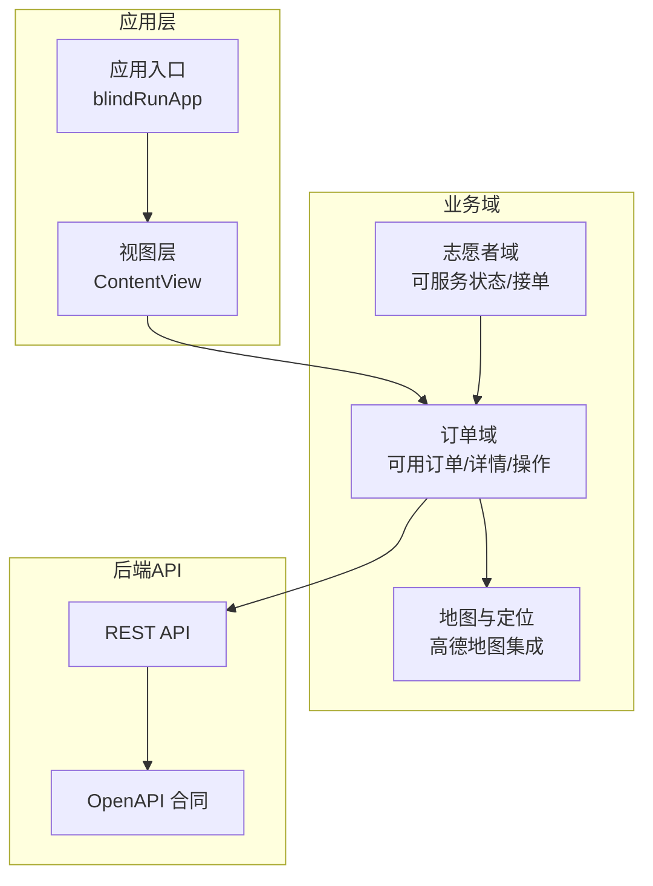
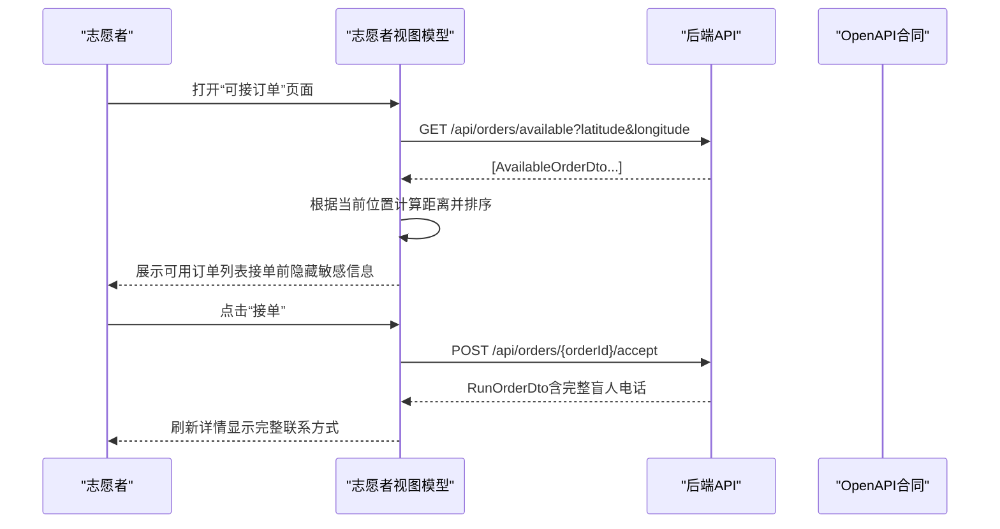
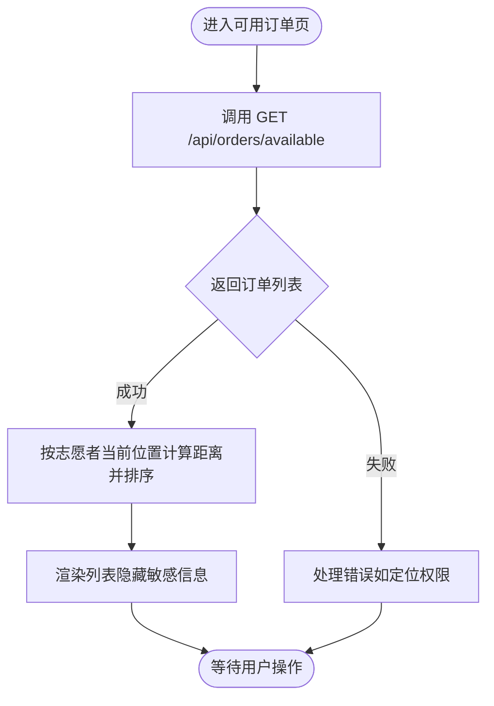
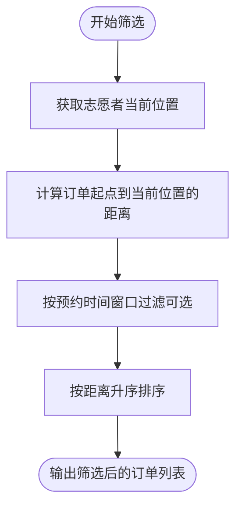
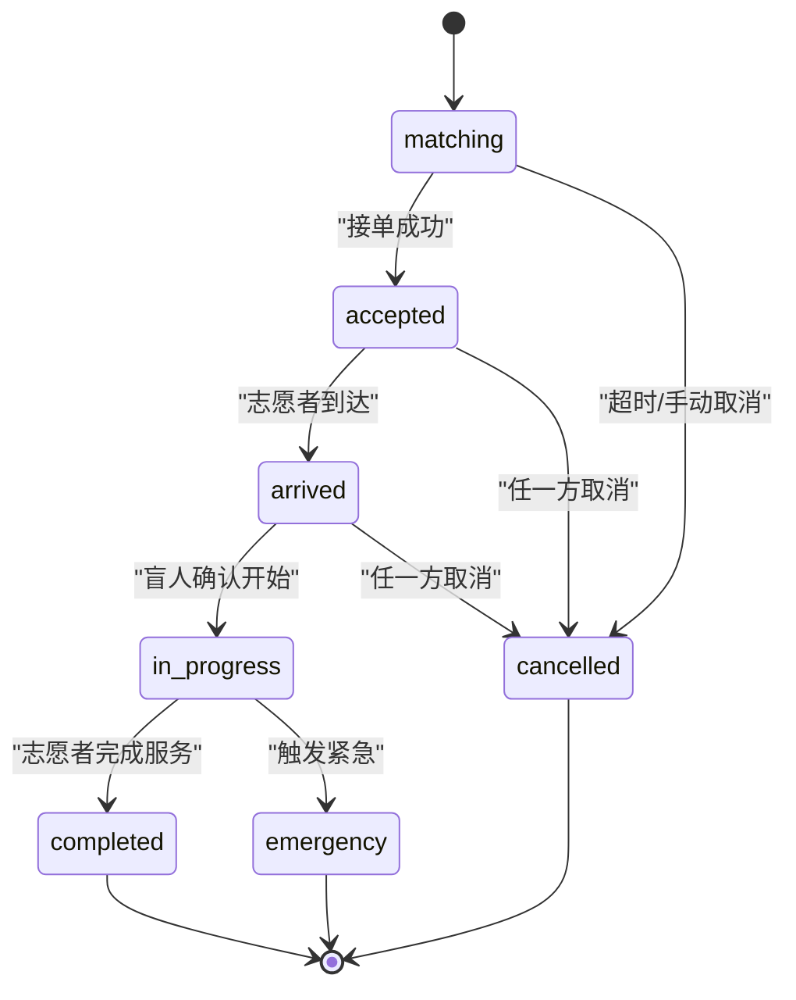
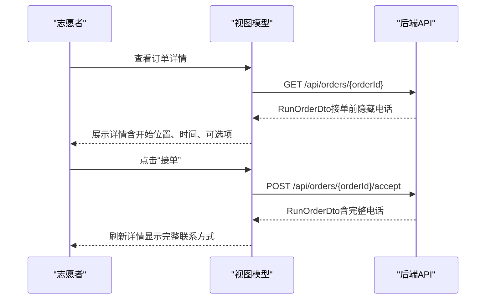
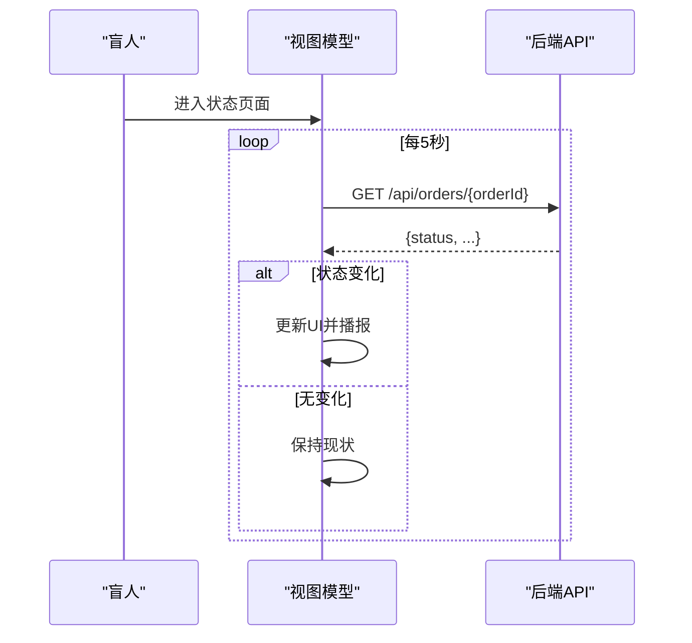
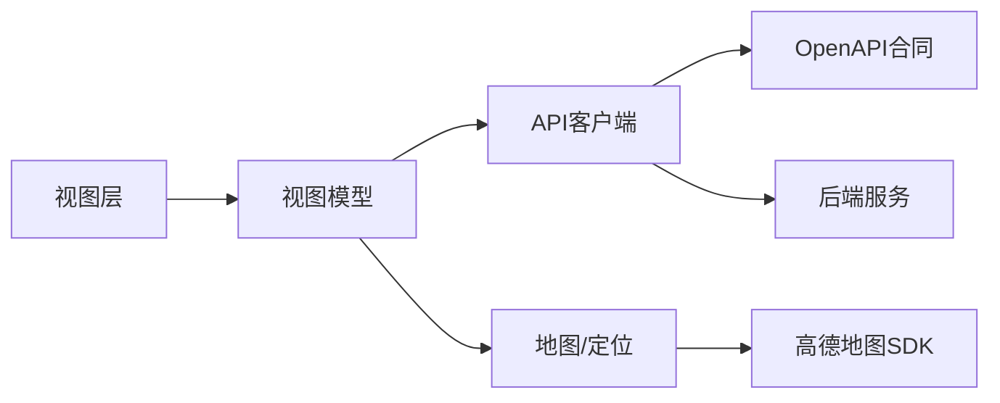

# 订单浏览与筛选

<cite>
**本文引用的文件**
- [blindRunApp.swift](file://blindRun/blindRunApp.swift)
- [ContentView.swift](file://blindRun/blindRun/ContentView.swift)
- [08-ios-architecture.md](file://docs/08-ios-architecture.md)
- [07-api-contract.openapi.yaml](file://docs/07-api-contract.openapi.yaml)
- [04-user-flows-and-state-machine.md](file://docs/04-user-flows-and-state-machine.md)
- [03-user-stories.md](file://docs/03-user-stories.md)
- [amap-location/spec.md](file://openspec/changes/add-aidrun-ios-spring-mvp/specs/amap-location/spec.md)
- [order-status-lifecycle/spec.md](file://openspec/changes/add-aidrun-ios-spring-mvp/specs/order-status-lifecycle/spec.md)
- [safety-basic-emergency/spec.md](file://openspec/changes/add-aidrun-ios-spring-mvp/specs/safety-basic-emergency/spec.md)
</cite>

## 目录
1. [简介](#简介)
2. [项目结构](#项目结构)
3. [核心组件](#核心组件)
4. [架构总览](#架构总览)
5. [详细组件分析](#详细组件分析)
6. [依赖关系分析](#依赖关系分析)
7. [性能考虑](#性能考虑)
8. [故障排查指南](#故障排查指南)
9. [结论](#结论)
10. [附录](#附录)

## 简介
本文件围绕“订单浏览与筛选”功能，系统化梳理盲跑应用中志愿者视角的可用订单列表获取、展示与筛选机制，涵盖以下要点：
- 可用订单列表的获取与展示：从后端拉取 matching 订单，前端按志愿者当前位置进行距离排序。
- 隐私保护：在接单前隐藏盲人电话与紧急联系人信息，接单后按策略逐步暴露必要信息。
- 筛选算法：基于地理位置匹配（当前坐标）、时间窗口过滤（预约时间）与距离排序（志愿者到起点）。
- 订单优先级与批量操作：通过状态与时间窗口组合形成优先级，批量操作以单订单操作为主（接单、到达、开始、完成、取消、紧急）。
- 订单详情安全展示：开始位置、预约时间、可选目的地/路线描述等信息的呈现策略。
- 状态过滤与实时更新：支持按状态过滤，结合轮询实现状态变更的近实时展示。

## 项目结构
- 应用采用 SwiftUI + MVVM 架构，模块划分清晰，涉及 Orders、Map、Volunteer 等领域模块。
- 订单相关 API 由 OpenAPI 描述，包含可用订单查询、订单详情、接单、到达、确认开始、完成、取消、紧急等端点。
- 地图与定位要求明确：需集成高德地图，显示真实地图、当前位置与订单起点标记；距离排序在 iOS 端完成。

**图表来源**
- [blindRunApp.swift:10-17](file://blindRun/blindRunApp.swift#L10-L17)
- [ContentView.swift:10-20](file://blindRun/blindRun/ContentView.swift#L10-L20)
- [08-ios-architecture.md:18-31](file://docs/08-ios-architecture.md#L18-L31)
- [07-api-contract.openapi.yaml:209-237](file://docs/07-api-contract.openapi.yaml#L209-L237)

**章节来源**
- [08-ios-architecture.md:18-31](file://docs/08-ios-architecture.md#L18-L31)
- [07-api-contract.openapi.yaml:209-237](file://docs/07-api-contract.openapi.yaml#L209-L237)

## 核心组件
- 订单模型与隐私字段
  - 订单详情包含盲人昵称、起点位置、预约时间、可选终点文本、预估时长/距离、配速偏好、同性别偏好、备注等。
  - 在接单前，盲人电话字段可为空或受保护；接单后才返回完整号码，确保隐私前置。
- 可用订单模型
  - 可用订单在通用订单模型基础上，补充“接单前可为空”的盲人电话字段说明。
- API 端点
  - 获取可用订单：GET /api/orders/available，支持经纬度参数；返回 matching 订单列表。
  - 获取我的订单：GET /api/orders/my，支持按状态过滤。
  - 订单详情：GET /api/orders/{orderId}，用于轮询与详情展示。
  - 订单操作：accept、arrive、confirm-start、complete、cancel、emergency 等。
- 轮询与实时更新
  - 盲人端在关键状态页面（matching/accepted/arrived/in_progress）每 5 秒轮询订单详情，对比状态变化并播报。

**章节来源**
- [07-api-contract.openapi.yaml:811-924](file://docs/07-api-contract.openapi.yaml#L811-L924)
- [07-api-contract.openapi.yaml:188-237](file://docs/07-api-contract.openapi.yaml#L188-L237)
- [07-api-contract.openapi.yaml:239-254](file://docs/07-api-contract.openapi.yaml#L239-L254)
- [04-user-flows-and-state-machine.md:275-299](file://docs/04-user-flows-and-state-machine.md#L275-L299)

## 架构总览
下图展示志愿者视角“可用订单列表”的获取与展示路径，以及隐私字段的暴露时机。

**图表来源**
- [07-api-contract.openapi.yaml:209-237](file://docs/07-api-contract.openapi.yaml#L209-L237)
- [07-api-contract.openapi.yaml:811-924](file://docs/07-api-contract.openapi.yaml#L811-L924)
- [08-ios-architecture.md:47-48](file://docs/08-ios-architecture.md#L47-L48)

## 详细组件分析

### 组件A：可用订单列表获取与展示
- 数据来源
  - 通过 GET /api/orders/available 拉取 matching 订单；可传入当前经纬度参数辅助后端定位（如需）。
- 展示策略
  - 列表项包含起点地址文本、预约时间、预估时长/距离、可选备注等；接单前不显示盲人电话。
- 隐私保护
  - 接单前盲人电话字段为空或受保护；接单成功后返回完整号码，满足最小披露原则。

**图表来源**
- [07-api-contract.openapi.yaml:209-237](file://docs/07-api-contract.openapi.yaml#L209-L237)
- [amap-location/spec.md:23-29](file://openspec/changes/add-aidrun-ios-spring-mvp/specs/amap-location/spec.md#L23-L29)

**章节来源**
- [07-api-contract.openapi.yaml:209-237](file://docs/07-api-contract.openapi.yaml#L209-L237)
- [amap-location/spec.md:23-29](file://openspec/changes/add-aidrun-ios-spring-mvp/specs/amap-location/spec.md#L23-L29)

### 组件B：订单筛选算法
- 地理位置匹配
  - 使用志愿者当前经纬度与订单起点坐标计算距离，按升序排序，优先展示最近订单。
- 时间窗口过滤
  - 可通过 GET /api/orders/my 的 status 查询参数对我的订单进行状态过滤；可用订单默认返回 matching。
- 距离排序逻辑
  - iOS 端本地计算并排序，避免后端地理复杂度；需确保定位权限已授权。

**图表来源**
- [07-api-contract.openapi.yaml:209-237](file://docs/07-api-contract.openapi.yaml#L209-L237)
- [amap-location/spec.md:23-29](file://openspec/changes/add-aidrun-ios-spring-mvp/specs/amap-location/spec.md#L23-L29)

**章节来源**
- [amap-location/spec.md:11-29](file://openspec/changes/add-aidrun-ios-spring-mvp/specs/amap-location/spec.md#L11-L29)
- [07-api-contract.openapi.yaml:188-207](file://docs/07-api-contract.openapi.yaml#L188-L207)

### 组件C：订单优先级与批量操作
- 优先级设置
  - 以“状态优先 + 时间窗口优先 + 距离优先”综合判定：matching > accepted > arrived > in_progress；预约时间越近优先；距离越近优先。
- 批量操作
  - 当前以单订单操作为主：接单、到达、确认开始、完成、取消、紧急；暂无多订单批量操作。

**图表来源**
- [04-user-flows-and-state-machine.md:72-96](file://docs/04-user-flows-and-state-machine.md#L72-L96)
- [order-status-lifecycle/spec.md:3-29](file://openspec/changes/add-aidrun-ios-spring-mvp/specs/order-status-lifecycle/spec.md#L3-L29)

**章节来源**
- [order-status-lifecycle/spec.md:3-29](file://openspec/changes/add-aidrun-ios-spring-mvp/specs/order-status-lifecycle/spec.md#L3-L29)
- [04-user-flows-and-state-machine.md:72-96](file://docs/04-user-flows-and-state-machine.md#L72-L96)

### 组件D：订单详情的安全展示
- 展示内容
  - 开始位置（地址文本/坐标）、预约时间、可选目的地/路线描述、预估时长/距离、配速偏好、同性别偏好、备注。
- 隐私策略
  - 接单前不显示盲人电话；接单后显示完整联系方式；紧急联系人信息在盲人资料中维护，创建订单前需完善。
- 安全交互
  - 紧急求助需二次确认，且仅在特定状态下可用；状态进入 emergency 后，常规生命周期动作被限制。

**图表来源**
- [07-api-contract.openapi.yaml:239-254](file://docs/07-api-contract.openapi.yaml#L239-L254)
- [03-user-stories.md:502-530](file://docs/03-user-stories.md#L502-L530)
- [safety-basic-emergency/spec.md:11-33](file://openspec/changes/add-aidrun-ios-spring-mvp/specs/safety-basic-emergency/spec.md#L11-L33)

**章节来源**
- [07-api-contract.openapi.yaml:811-924](file://docs/07-api-contract.openapi.yaml#L811-L924)
- [03-user-stories.md:502-530](file://docs/03-user-stories.md#L502-L530)
- [safety-basic-emergency/spec.md:3-33](file://openspec/changes/add-aidrun-ios-spring-mvp/specs/safety-basic-emergency/spec.md#L3-L33)

### 组件E：状态过滤与实时更新
- 状态过滤
  - GET /api/orders/my 支持 status 查询参数，便于按状态筛选我的订单。
- 实时更新
  - 盲人端在关键状态页面（matching/accepted/arrived/in_progress）每 5 秒轮询订单详情，对比状态变化并播报。

**图表来源**
- [04-user-flows-and-state-machine.md:275-299](file://docs/04-user-flows-and-state-machine.md#L275-L299)
- [07-api-contract.openapi.yaml:239-254](file://docs/07-api-contract.openapi.yaml#L239-L254)

**章节来源**
- [04-user-flows-and-state-machine.md:275-299](file://docs/04-user-flows-and-state-machine.md#L275-L299)
- [07-api-contract.openapi.yaml:188-207](file://docs/07-api-contract.openapi.yaml#L188-L207)

## 依赖关系分析
- 组件耦合
  - 视图模型依赖 API 客户端与 OpenAPI 合同；地图模块依赖定位能力与高德 SDK。
- 外部依赖
  - 高德地图 SDK 提供真实地图、定位与距离计算能力；后端 API 提供订单数据与状态机操作。
- 潜在循环
  - 未见直接循环依赖；各模块职责清晰（视图/视图模型/服务/数据模型）。

**图表来源**
- [08-ios-architecture.md:33-49](file://docs/08-ios-architecture.md#L33-L49)
- [amap-location/spec.md:3-9](file://openspec/changes/add-aidrun-ios-spring-mvp/specs/amap-location/spec.md#L3-L9)

**章节来源**
- [08-ios-architecture.md:33-49](file://docs/08-ios-architecture.md#L33-L49)
- [amap-location/spec.md:3-9](file://openspec/changes/add-aidrun-ios-spring-mvp/specs/amap-location/spec.md#L3-L9)

## 性能考虑
- 轮询频率与网络开销
  - 5 秒轮询在 MVP 中平衡了实时性与资源消耗；建议在后台或页面不可见时降低频率或暂停。
- 排序与计算
  - iOS 端本地距离排序简单高效；建议缓存当前坐标与已排序结果，减少重复计算。
- 网络与存储
  - Token 存储建议迁移到 Keychain；调试构建保留 UserDefaults 方便开发，生产环境需迁移。

## 故障排查指南
- 定位权限问题
  - 若无法获取可用订单或排序异常，检查定位权限；必要时使用演示坐标以保证演示稳定性。
- 接单失败
  - 若提示“已被其他志愿者接单”，说明并发竞争导致；建议提示后刷新列表重试。
- 紧急求助
  - 确认当前状态允许紧急（accepted/arrived/in_progress）；进入紧急后常规操作受限。
- 状态不更新
  - 确认轮询是否仍在运行（页面可见且非终态）；检查网络与鉴权状态。

**章节来源**
- [amap-location/spec.md:11-21](file://openspec/changes/add-aidrun-ios-spring-mvp/specs/amap-location/spec.md#L11-L21)
- [03-user-stories.md:519-529](file://docs/03-user-stories.md#L519-L529)
- [safety-basic-emergency/spec.md:11-33](file://openspec/changes/add-aidrun-ios-spring-mvp/specs/safety-basic-emergency/spec.md#L11-L33)

## 结论
本方案以 OpenAPI 合同为依据，结合 iOS 端 MVVM 架构与高德地图能力，实现了志愿者视角的可用订单获取、隐私保护、地理与时间筛选、优先级排序与实时轮询更新。通过“接单后暴露必要信息”的策略，在保障隐私的同时满足服务流程需求；通过状态机与轮询机制，确保关键页面的状态近实时同步。

## 附录
- 关键端点与参数
  - GET /api/orders/available（支持 latitude/longitude）
  - GET /api/orders/my（支持 status）
  - GET /api/orders/{orderId}
  - POST /api/orders/{orderId}/accept
  - POST /api/orders/{orderId}/arrive
  - POST /api/orders/{orderId}/confirm-start
  - POST /api/orders/{orderId}/complete
  - POST /api/orders/{orderId}/cancel
  - POST /api/orders/{orderId}/emergency

**章节来源**
- [07-api-contract.openapi.yaml:150-387](file://docs/07-api-contract.openapi.yaml#L150-L387)