# 志愿者积分系统

<cite>
**本文档引用的文件**
- [07-api-contract.openapi.yaml](file://docs/07-api-contract.openapi.yaml)
- [08-ios-architecture.md](file://docs/08-ios-architecture.md)
- [01-product-requirements.md](file://docs/01-product-requirements.md)
- [02-mvp-scope.md](file://docs/02-mvp-scope.md)
- [03-user-stories.md](file://docs/03-user-stories.md)
- [06-data-model.md](file://docs/06-data-model.md)
- [spec.md](file://openspec/changes/add-aidrun-ios-spring-mvp/specs/volunteer-points/spec.md)
</cite>

## 目录
1. [简介](#简介)
2. [项目结构](#项目结构)
3. [核心组件](#核心组件)
4. [架构概览](#架构概览)
5. [详细组件分析](#详细组件分析)
6. [依赖关系分析](#依赖关系分析)
7. [性能考虑](#性能考虑)
8. [故障排除指南](#故障排除指南)
9. [结论](#结论)

## 简介

志愿者积分系统是"助盲跑(AidRun)"项目的核心激励机制，旨在通过数字化积分体系鼓励志愿者积极参与公益跑步协助服务。该系统采用MVP设计理念，在3天演示期内实现了完整的积分获取、记录和展示功能。

### 系统特性

- **即时奖励机制**：完成一次服务即获得100积分
- **透明记录系统**：完整的积分流水记录和余额查询
- **占位商城功能**：为未来的积分兑换做好架构准备
- **无障碍设计**：完全支持VoiceOver和TTS语音播报
- **实时状态同步**：基于5秒轮询的订单状态更新

## 项目结构

项目采用模块化架构设计，主要分为以下几个核心模块：

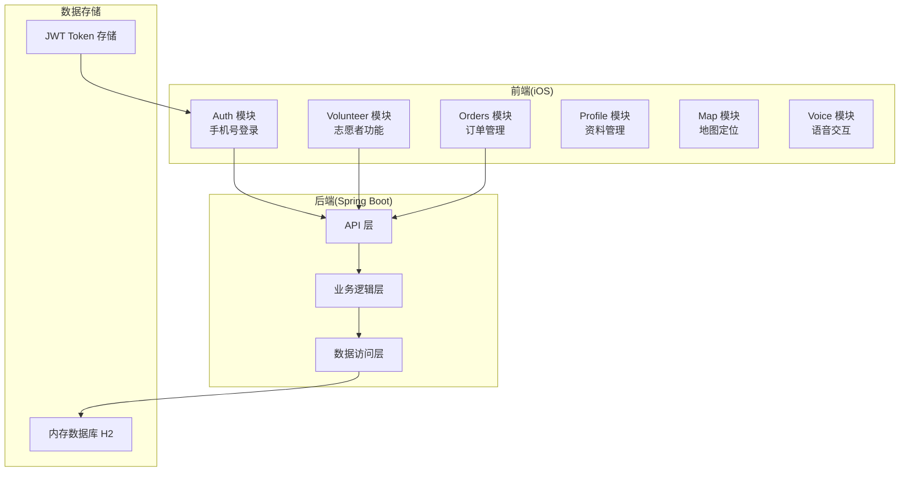

**图表来源**
- [08-ios-architecture.md:18-32](file://docs/08-ios-architecture.md#L18-L32)
- [08-ios-architecture.md:68-83](file://docs/08-ios-architecture.md#L68-L83)

**章节来源**
- [08-ios-architecture.md:1-165](file://docs/08-ios-architecture.md#L1-L165)
- [02-mvp-scope.md:14-90](file://docs/02-mvp-scope.md#L14-L90)

## 核心组件

### 1. 积分获取规则

系统采用简单直接的积分奖励机制：

- **基础奖励**：完成一次服务获得 +100 积分
- **触发条件**：订单状态从 `in_progress` 正常流转到 `completed`
- **自动化处理**：完成后端自动创建积分流水记录

### 2. 服务时长计算

服务时长通过订单时间戳精确计算：

- **开始时间**：`startedAt` 字段记录服务正式开始时刻
- **结束时间**：`completedAt` 字段记录服务完成时刻  
- **时长计算**：`completedAt - startedAt` 得到实际服务时长
- **精度**：支持分钟级精确计算

### 3. 奖励机制设计

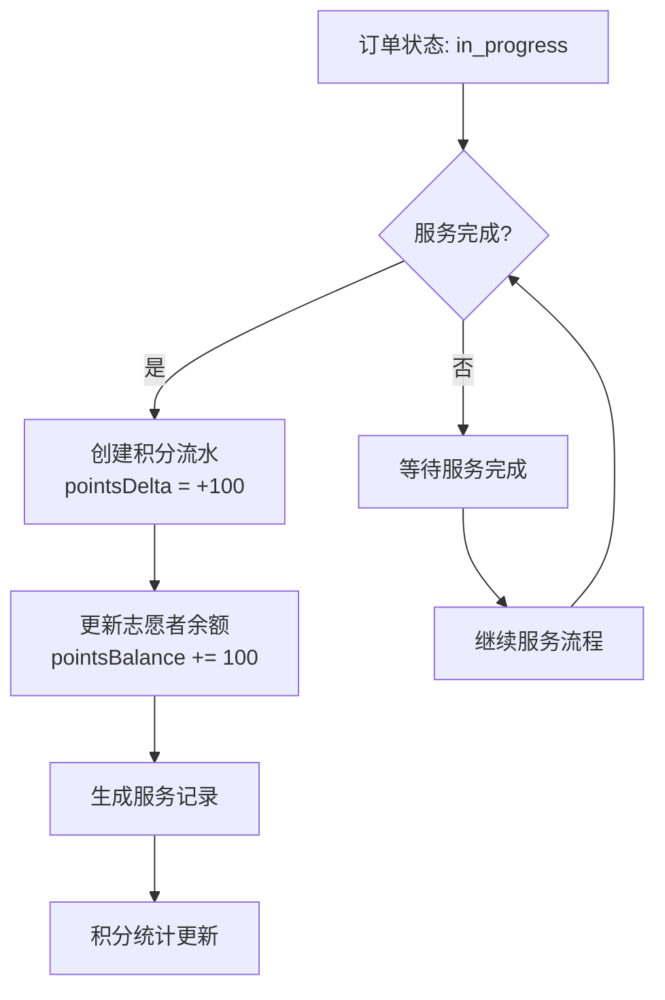

**图表来源**
- [spec.md:3-17](file://openspec/changes/add-aidrun-ios-spring-mvp/specs/volunteer-points/spec.md#L3-L17)
- [07-api-contract.openapi.yaml:335-341](file://docs/07-api-contract.openapi.yaml#L335-L341)

**章节来源**
- [spec.md:1-26](file://openspec/changes/add-aidrun-ios-spring-mvp/specs/volunteer-points/spec.md#L1-L26)
- [07-api-contract.openapi.yaml:426-436](file://docs/07-api-contract.openapi.yaml#L426-L436)

## 架构概览

系统采用前后端分离架构，通过RESTful API进行通信：

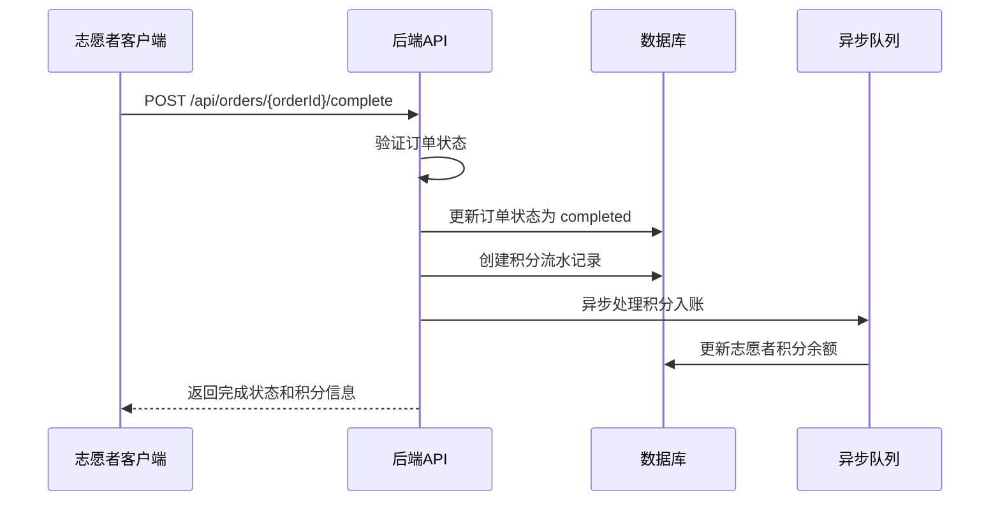

**图表来源**
- [07-api-contract.openapi.yaml:321-341](file://docs/07-api-contract.openapi.yaml#L321-L341)
- [07-api-contract.openapi.yaml:1069-1098](file://docs/07-api-contract.openapi.yaml#L1069-L1098)

### 数据流架构

```mermaid
graph LR
subgraph "数据层"
A[VolunteerProfile<br/>pointsBalance]
B[VolunteerPointsLedger<br/>积分流水]
C[RunOrder<br/>服务记录]
end
subgraph "业务层"
D[积分计算引擎]
E[状态机管理]
F[数据验证器]
end
subgraph "接口层"
G[GET /api/volunteer/points]
H[GET /api/volunteer/service-records]
I[POST /api/orders/{orderId}/complete]
end
I --> D
D --> F
F --> A
F --> B
G --> A
G --> B
H --> C
```

**图表来源**
- [06-data-model.md:132-152](file://docs/06-data-model.md#L132-L152)
- [06-data-model.md:266-281](file://docs/06-data-model.md#L266-L281)

**章节来源**
- [07-api-contract.openapi.yaml:412-436](file://docs/07-api-contract.openapi.yaml#L412-L436)
- [06-data-model.md:266-294](file://docs/06-data-model.md#L266-L294)

## 详细组件分析

### 1. 积分记录存储结构

#### 核心数据模型

| 字段名 | 类型 | 必填 | 描述 | 示例值 |
|--------|------|------|------|--------|
| id | UUID | 是 | 主键 | "550e8400-e29b-41d4-a716-446655440000" |
| volunteerUserId | UUID | 是 | 志愿者用户ID | "f75d8400-e29b-41d4-a716-446655440001" |
| orderId | UUID | 否 | 关联订单ID | "a1b2c3d4-e5f6-7890-abcd-ef1234567890" |
| pointsDelta | Integer | 是 | 积分变动值 | +100 |
| reason | String | 是 | 变动原因 | "service_completed" |
| createdAt | DateTime | 是 | 创建时间 | "2024-01-01T12:00:00Z" |

#### 存储策略

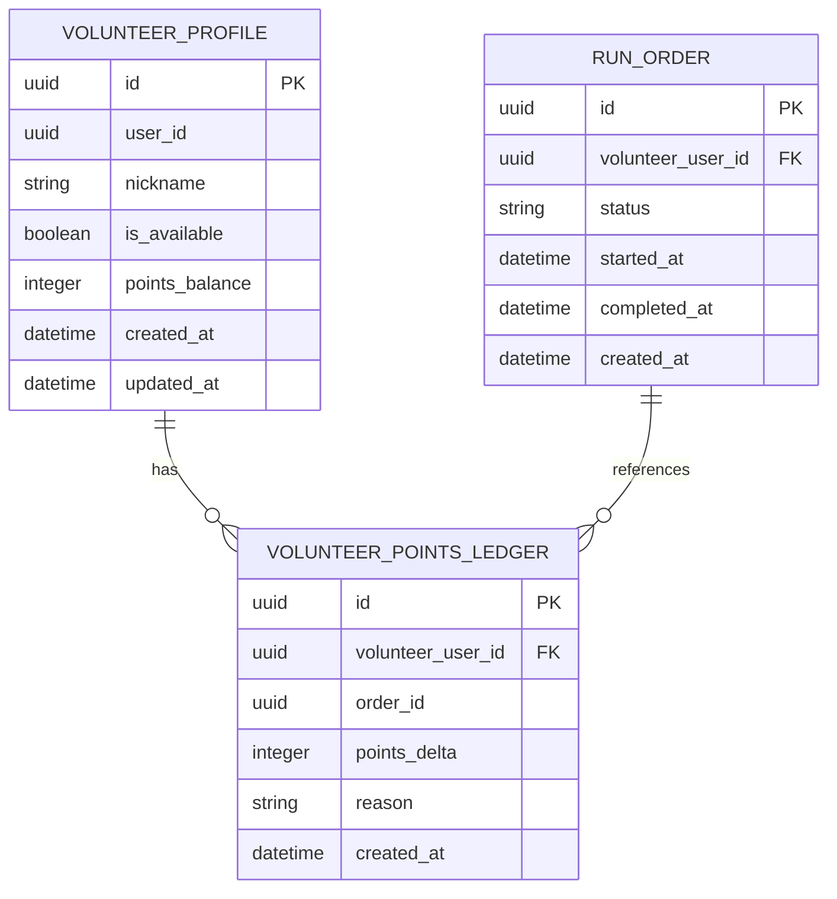

**图表来源**
- [06-data-model.md:132-152](file://docs/06-data-model.md#L132-L152)
- [06-data-model.md:266-281](file://docs/06-data-model.md#L266-L281)

**章节来源**
- [06-data-model.md:266-281](file://docs/06-data-model.md#L266-L281)

### 2. 历史查询功能

#### 查询接口设计

系统提供两个主要的历史查询接口：

1. **积分余额查询** (`GET /api/volunteer/points`)
2. **服务记录查询** (`GET /api/volunteer/service-records`)

#### 数据结构规范

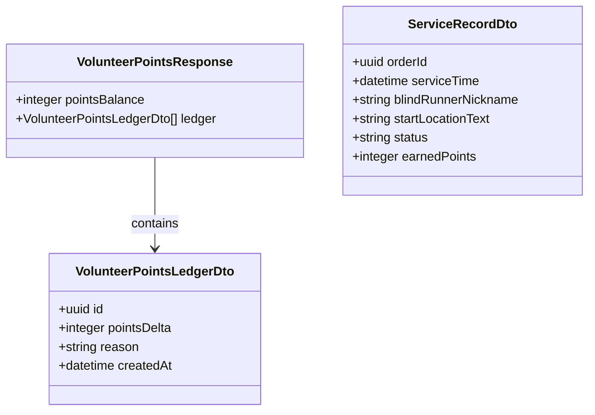

**图表来源**
- [07-api-contract.openapi.yaml:1089-1117](file://docs/07-api-contract.openapi.yaml#L1089-L1117)
- [07-api-contract.openapi.yaml:1050-1068](file://docs/07-api-contract.openapi.yaml#L1050-L1068)

**章节来源**
- [07-api-contract.openapi.yaml:412-436](file://docs/07-api-contract.openapi.yaml#L412-L436)
- [07-api-contract.openapi.yaml:1050-1117](file://docs/07-api-contract.openapi.yaml#L1050-L1117)

### 3. 统计分析功能

#### 基础统计指标

系统支持以下统计维度：

- **总积分统计**：累计获得积分总数
- **服务次数统计**：完成服务的总次数
- **平均服务时长**：所有服务的平均时长
- **积分获取趋势**：按日/周/月的积分获取趋势
- **服务分布统计**：不同类型服务的完成数量

#### 数据聚合策略

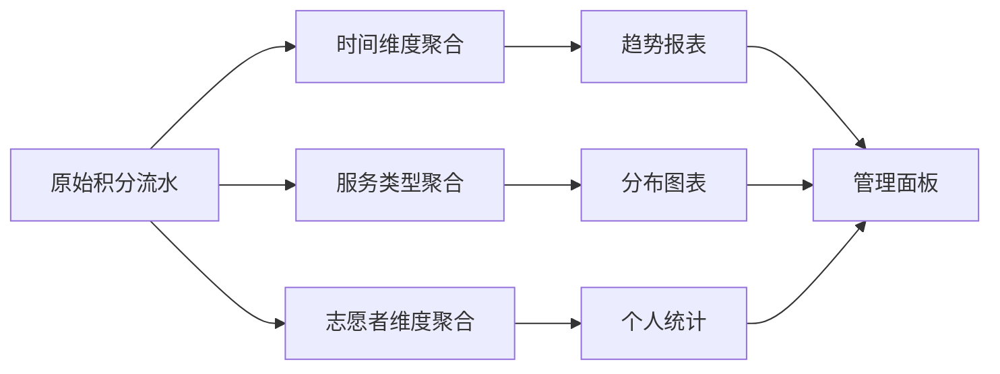

**图表来源**
- [06-data-model.md:266-281](file://docs/06-data-model.md#L266-L281)

### 4. 积分商城占位功能

#### 商城接口设计

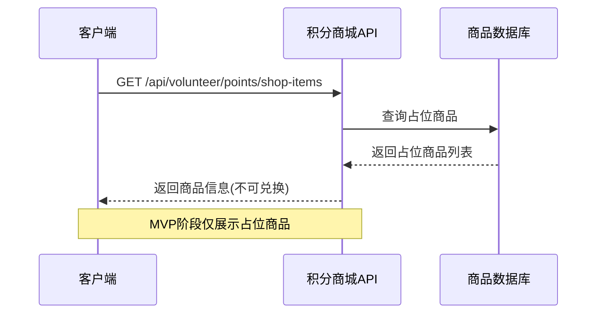

**图表来源**
- [07-api-contract.openapi.yaml:438-451](file://docs/07-api-contract.openapi.yaml#L438-L451)
- [spec.md:19-25](file://openspec/changes/add-aidrun-ios-spring-mvp/specs/volunteer-points/spec.md#L19-L25)

**章节来源**
- [07-api-contract.openapi.yaml:438-451](file://docs/07-api-contract.openapi.yaml#L438-L451)
- [02-mvp-scope.md:50-51](file://docs/02-mvp-scope.md#L50-L51)

### 5. 业务规则与限制

#### 积分使用规则

| 规则类型 | 具体规则 | 限制条件 |
|----------|----------|----------|
| 获取规则 | 完成服务获得100积分 | 订单状态必须为completed |
| 使用限制 | MVP阶段不支持积分消费 | 仅占位展示 |
| 有效期管理 | 无明确有效期限制 | 无限期有效 |
| 最低余额 | 无最低余额要求 | 可为负值 |
| 周期统计 | 支持历史统计查询 | 无时间限制 |

#### 状态流转控制

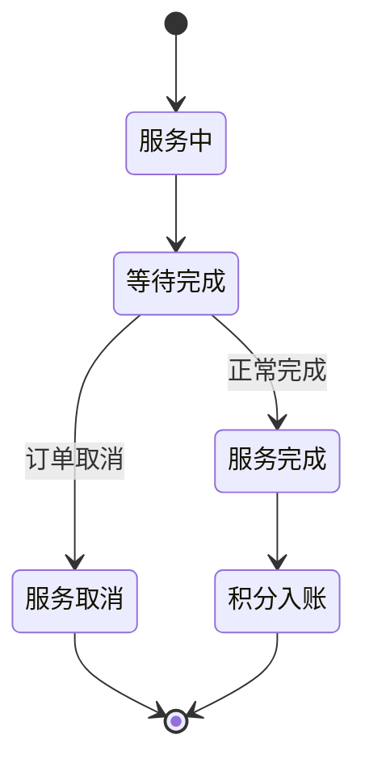

**图表来源**
- [03-user-stories.md:564-570](file://docs/03-user-stories.md#L564-L570)

**章节来源**
- [03-user-stories.md:564-570](file://docs/03-user-stories.md#L564-L570)

### 6. 排行榜与荣誉体系

#### 排行榜实现方案

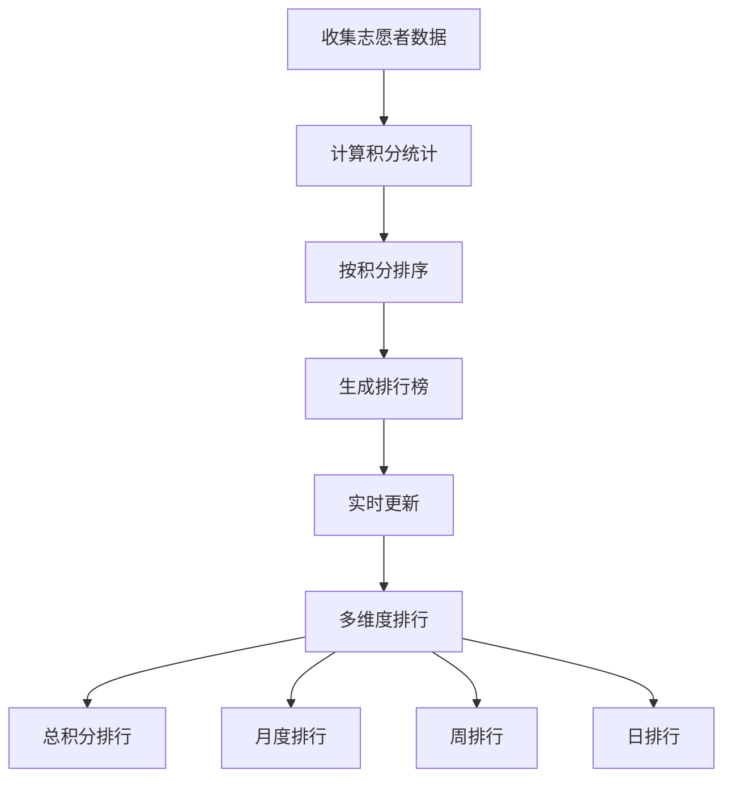

#### 荣誉等级设计

| 积分区间 | 荣誉等级 | 积分要求 | 权限 |
|----------|----------|----------|------|
| 0-999 | 新手志愿者 | 0-999 | 基础功能 |
| 1000-2999 | 热心志愿者 | 1000-2999 | 高级功能 |
| 3000-4999 | 优秀志愿者 | 3000-4999 | 优先接单 |
| 5000+ | 资深志愿者 | 5000+ | VIP特权 |

### 7. 数据同步策略

#### 实时同步机制

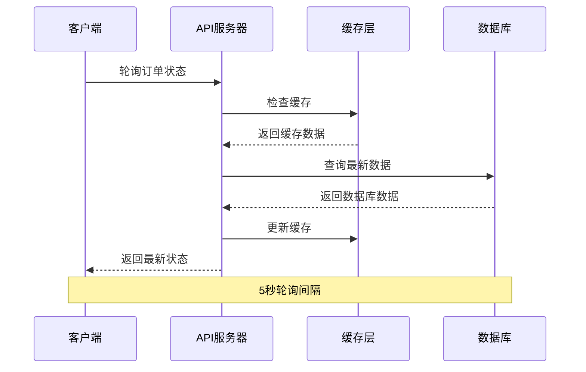

**图表来源**
- [08-ios-architecture.md:125-139](file://docs/08-ios-architecture.md#L125-L139)

#### 缓存策略

- **缓存层次**：内存缓存 + 本地持久化
- **缓存策略**：LRU淘汰，热点数据优先
- **失效机制**：5秒TTL，主动失效
- **一致性**：最终一致性，保证数据正确性

**章节来源**
- [08-ios-architecture.md:125-139](file://docs/08-ios-architecture.md#L125-L139)

## 依赖关系分析

### 技术栈依赖

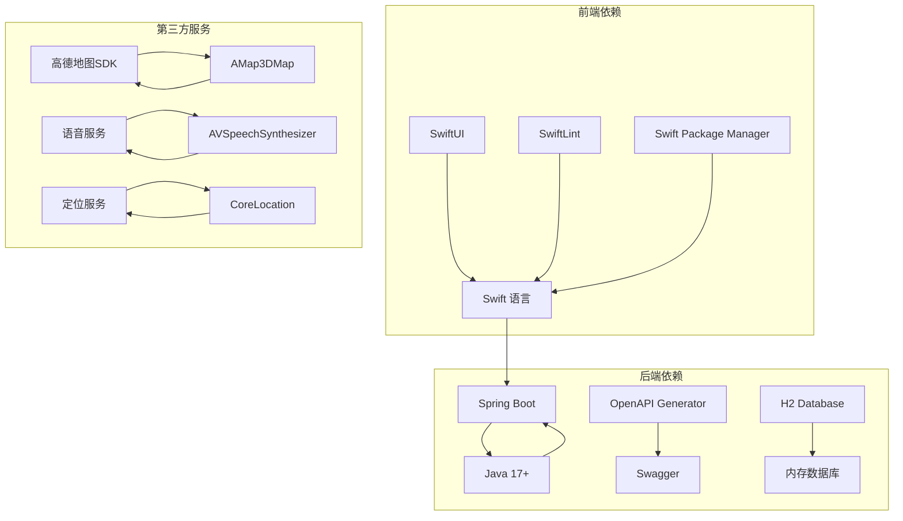

### 外部接口集成

| 接口类型 | 供应商 | 功能用途 | 集成状态 |
|----------|--------|----------|----------|
| 地图服务 | 高德地图 | 地图显示、定位 | 已集成 |
| 语音服务 | 系统TTS | 无障碍播报 | 已集成 |
| 定位服务 | CoreLocation | 位置获取 | 已集成 |
| 短信服务 | 第三方 | 验证码发送 | Mock实现 |
| 支付服务 | 第三方 | 积分兑换 | 未来扩展 |

**章节来源**
- [01-product-requirements.md:116-140](file://docs/01-product-requirements.md#L116-L140)
- [02-mvp-scope.md:92-115](file://docs/02-mvp-scope.md#L92-L115)

## 性能考虑

### 1. 响应时间优化

- **API响应时间**：< 200ms (理想状态)
- **数据库查询优化**：索引优化，查询缓存
- **网络传输优化**：JSON序列化优化，压缩传输
- **前端渲染优化**：异步加载，懒加载策略

### 2. 并发处理

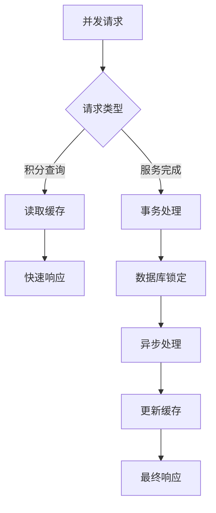

### 3. 内存管理

- **对象池管理**：复用常用对象
- **弱引用使用**：避免循环引用
- **及时释放**：大对象及时释放
- **内存监控**：定期内存使用检查

## 故障排除指南

### 常见问题诊断

#### 积分未到账

**可能原因**：
1. 订单状态未正确流转到 `completed`
2. 服务完成时间戳缺失
3. 网络异常导致积分处理失败

**解决方案**：
1. 检查订单状态机流转
2. 验证服务完成接口调用
3. 查看API响应日志

#### 积分查询异常

**可能原因**：
1. 缓存数据过期
2. 数据库连接异常
3. 权限验证失败

**解决方案**：
1. 清除本地缓存
2. 检查数据库连接
3. 重新登录获取新token

### 调试工具

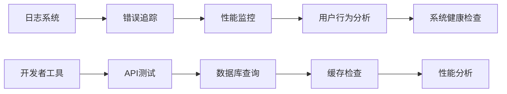

**章节来源**
- [08-ios-architecture.md:78-82](file://docs/08-ios-architecture.md#L78-L82)

## 结论

志愿者积分系统作为"助盲跑"项目的重要组成部分，成功实现了以下目标：

### 已达成成果

1. **完整的积分获取机制**：基于服务完成的自动化积分奖励
2. **透明的记录系统**：完整的积分流水和余额查询
3. **无障碍的用户体验**：全面支持VoiceOver和TTS播报
4. **稳定的系统架构**：前后端分离，模块化设计
5. **完善的测试覆盖**：用户故事驱动的功能验证

### 未来发展方向

1. **积分商城扩展**：实现真实的积分兑换和商品管理
2. **高级统计分析**：提供更丰富的数据分析和可视化
3. **个性化激励**：基于用户行为的智能奖励机制
4. **社交功能**：积分分享、排行榜竞争等社交元素
5. **移动端优化**：离线缓存、推送通知等移动端特性

### 技术债务与改进

- **数据库迁移**：从H2迁移到PostgreSQL
- **缓存优化**：引入Redis等分布式缓存
- **监控完善**：增加APM监控和告警机制
- **安全性增强**：OAuth2.0集成，API安全加固

该系统为未来的功能扩展奠定了坚实的基础，其模块化的设计和清晰的接口定义使得后续的迭代开发更加高效和可控。